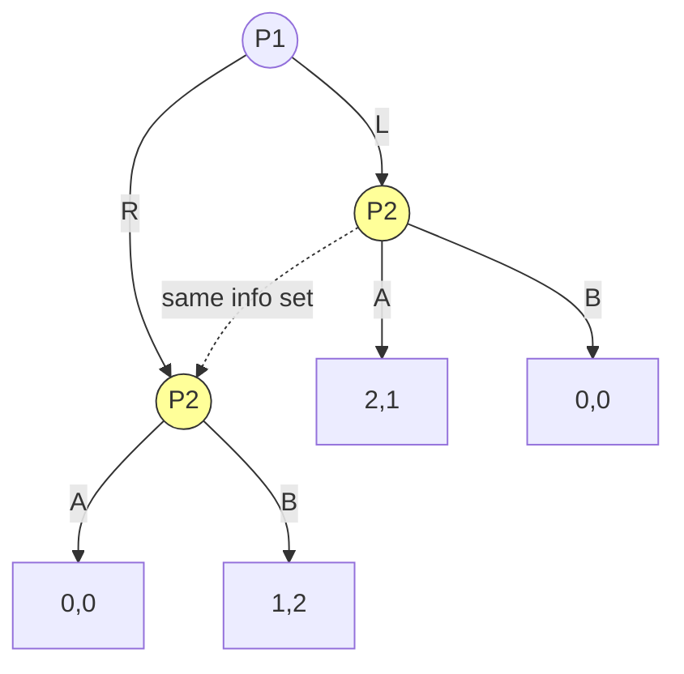
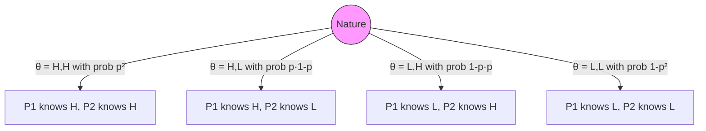

# 🔍 Information in Games

> [!abstract] TL;DR
> Information structure determines what players know when they act. **Perfect information**: every player observes the full history of play (chess, checkers). **Imperfect information**: some past actions are unobservable — modeled by non-singleton information sets (poker, simultaneous-move games). **Incomplete information**: players have private **types** θᵢ drawn from a type space Θᵢ with common prior p(θ) — Harsanyi's 1967–68 type-space formulation converts incomplete information into imperfect information through the "Harsanyi transformation." A **Bayesian game** = (N, {Aᵢ}, {Θᵢ}, p, {uᵢ}) where equilibrium is Bayesian Nash Equilibrium: σᵢ*(θᵢ) ∈ argmax Eθ₋ᵢ[uᵢ(σ) | θᵢ]. Incomplete ⊥ imperfect — they are orthogonal dimensions.

---

## Intuition — analogy FIRST

Consider a **poker hand**: you see your own cards (private type), you don't see opponents' cards (incomplete information about their types), and you didn't observe whether they peeked at the deck (imperfect information about past actions). These are different dimensions of ignorance:

- **Imperfect info**: "I didn't see what you did last round" (information sets)
- **Incomplete info**: "I don't know your hand value" (private types)

A **chess game** has perfect information but complete information (both players see the full board — imperfect info ≠ incomplete info). **Sealed-bid auctions** have complete information (symmetric valuations known) but imperfect information (bids simultaneous). **First-price auction with private values** has both: each bidder has a private type AND submits simultaneously.

---

## How It Works

### Perfect Information

A game of **perfect information** is an extensive-form game where every information set is a singleton: Iᵢ = {v} for all decision nodes v of player i.

**Consequence**: Every player knows the entire history of play (which decisions were made at every previous node) when it is their turn.

**Examples**: Chess, checkers, Go, tic-tac-toe, sequential bargaining with observed offers.

**Key result**: Every finite perfect-information game has a pure strategy Nash equilibrium (Zermelo 1913 for chess; backward induction finds it).

### Imperfect Information

A game of **imperfect information** contains at least one non-singleton information set: |Iᵢ| > 1 for some i and some Iᵢ.

*P2 cannot distinguish whether P1 played L or R — this is a simultaneous-move game in extensive form.*

**Simultaneous-move games** are extensive-form games where all players' information sets cover all nodes of the other players' simultaneous moves. The normal form is the "collapsed" representation.

### Incomplete Information and Harsanyi Types

**Incomplete information**: Players have **private information** about payoff-relevant variables (their own valuation, cost, type).

**Harsanyi transformation (1967–68)**: Convert incomplete information into imperfect information by introducing **Nature** as a player who first draws type profiles (θ₁, …, θₙ) ∈ Θ from a common prior p(θ), then reveals θᵢ privately to player i only.

**Bayesian Game** = (N, {Aᵢ}, {Θᵢ}, p, {uᵢ}) where:
- Aᵢ — action set for player i
- Θᵢ — type space for player i
- p ∈ Δ(Θ) — common prior over type profiles
- uᵢ: A × Θ → ℝ — payoff depending on actions AND types

**Strategy**: σᵢ: Θᵢ → Δ(Aᵢ) — a mapping from types to (possibly mixed) actions

---

## Key Concepts / Details

### Bayesian Nash Equilibrium (BNE)

A strategy profile σ* = (σ₁*, …, σₙ*) is a **Bayesian Nash Equilibrium** if for every player i and every type θᵢ ∈ Θᵢ:

$$\sigma_i^*(\theta_i) \in \arg\max_{a_i \in A_i} \mathbb{E}_{\theta_{-i}|{\theta_i}} \left[ u_i(a_i, \sigma_{-i}^*(\theta_{-i}), \theta) \right]$$

Each type of each player best-responds to the conditional distribution over opponents' types and strategies.

**Worked Example — First-Price Auction (2 bidders, uniform values)**:
- v₁, v₂ ~ U[0,1] independently
- BNE bid function: b(v) = v/2
- Derivation: If P2 uses b(v₂) = αv₂, P1 with value v₁ wins if b₁ > αv₂, i.e., prob = b₁/α. Expected payoff: (v₁ - b₁)(b₁/α). FOC: v₁/2 = b₁, so α = ½. Symmetric BNE: b*(v) = v/2.

### Information Taxonomy (2×2)

| | **Imperfect (don't observe history)** | **Perfect (observe full history)** |
|--|--|--|
| **Complete (common payoffs)** | Simultaneous move games, Matching Pennies | Chess, checkers, Go, sequential bargaining |
| **Incomplete (private types)** | Sealed-bid auctions, Bayesian games, poker | Sequential auctions with private values (rare) |

**Key insight**: Imperfect ⊥ Incomplete — they are independent dimensions. A game can be:
- Perfect + Complete: chess
- Imperfect + Complete: rock-paper-scissors
- Perfect + Incomplete: sequential auction where previous bids reveal values
- Imperfect + Incomplete: sealed-bid auction with private values (most interesting case)

### Adverse Selection and Moral Hazard

Incomplete information drives two core economic phenomena:

**Adverse Selection** (hidden type, pre-contract): The uninformed party gets a biased sample of the informed party's types.
- *Example*: Used car market (Akerlof 1970 "Market for Lemons") — sellers know car quality, buyers don't. Good cars priced out; market unravels.
- *Mechanism design response*: Screening contracts (menu of options separating types)

**Moral Hazard** (hidden action, post-contract): Uninformed party cannot observe the informed party's actions.
- *Example*: Insurance — insured party takes less care after insuring
- *Mechanism design response*: Incentive contracts, monitoring

### Higher-Order Beliefs

Harsanyi's type space implicitly encodes **higher-order beliefs**:
- Type θᵢ determines player i's beliefs about opponents
- The common prior p generates consistent higher-order beliefs
- "I believe you believe I believe…" — the type space handles this infinite regress

**Universal type space** (Mertens-Zamir 1985): Exists a canonical type space containing all possible belief hierarchies. Most economic analyses use parametric type spaces (e.g., Θᵢ = [0,1]) for tractability.

---

## Real-World Notes

- **Platform design**: Marketplaces (Uber, Airbnb) design matching and pricing under incomplete information (drivers don't know passenger destinations, passengers don't know driver availability).
- **Cybersecurity**: Attacker-defender games with private information about vulnerabilities. Information revelation (disclosure) is a strategic choice.
- **Medical diagnosis**: Patient has private information about lifestyle; doctor observes signals. Mechanism design: incentive-compatible screening tests.
- **Financial markets**: Market microstructure theory (Kyle 1985): informed traders have private signals; market maker updates beliefs based on order flow. Price discovery is Bayesian updating.
- **AI alignment**: AI systems may have incomplete information about human preferences (hidden type = human values). Assistance games (Russell 2019) formalize this as a Bayesian game.

---

## Common Pitfalls

1. **Confusing imperfect with incomplete** — These are orthogonal. Chess has perfect + complete information. Poker has both imperfect (don't see opponents' cards = also incomplete) + imperfect (don't observe prior raises in some variants).
2. **Common prior assumption** — BNE requires common prior. "Agreeing to disagree" about prior beliefs leads to different frameworks (subjective priors, non-Bayesian games).
3. **Type space completeness** — Specifying Θᵢ = {H, L} assumes only two types exist. In reality, type spaces may need to include all possible belief hierarchies.
4. **Strategies depend on types** — In Bayesian games, σᵢ must be a function of θᵢ; a strategy that ignores the type signal is not BNE (unless the type is irrelevant to payoffs).

---

## Related Concepts

- [[_MOC_GT_Fundamentals|↑ Fundamentals MOC]]
- [[Game_Representations|Game Representations]]
- [[../03_Dynamic_Games/Signaling_Games|Signaling Games]]
- [[../05_Mechanism_Design/Revelation_Principle_and_IC|Revelation Principle & IC]]
- [[../05_Mechanism_Design/Auction_Theory|Auction Theory]]

---

## Review Questions

1. A seller has cost c ~ U[0,1] and a buyer has value v ~ U[0,1], independent. Describe the Bayesian game and find the BNE of a double auction where both simultaneously announce prices.
2. Explain why the "Market for Lemons" result (market unraveling) is a consequence of adverse selection. What mechanism could restore efficiency?
3. In an extensive-form game, prove that any simultaneous-move normal-form game can be represented as an extensive-form game with imperfect information. Where do the information sets appear?

---

## Sources

- Harsanyi, J. (1967–68) — "Games with Incomplete Information Played by Bayesian Players," *Management Science*
- Akerlof, G. (1970) — "The Market for Lemons," *Quarterly Journal of Economics*
- Mertens & Zamir (1985) — "Formulation of Bayesian Analysis for Games with Incomplete Information"

#Game_Theory #Fundamentals #InformationInGames
