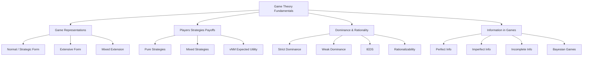

# 📐 Fundamentals of Game Theory — Section MOC

> [!abstract] Section Overview
> The foundations of game theory establish the language every subsequent concept speaks: how to represent strategic situations formally, what players, strategies, and payoffs mean, how rationality and dominance eliminate actions, and how information structures change the analysis.

---

## Concept Map



---

## Notes in This Section

| Note | Core Idea | Difficulty |
|------|-----------|-----------|
| [[Game_Representations\|Game Representations]] | Normal form (N, S, u), extensive form trees, bimatrix, mixed extension | Beginner |
| [[Players_Strategies_and_Payoffs\|Players, Strategies & Payoffs]] | Pure vs mixed strategies, vNM utility, expected payoff, zero-sum | Beginner |
| [[Dominance_and_Rationality\|Dominance & Rationality]] | Strict/weak dominance, IEDS, CKR, rationalizability | Beginner–Intermediate |
| [[Information_in_Games\|Information in Games]] | Perfect vs imperfect vs incomplete, Harsanyi types, Bayesian games | Intermediate |

---

## Learning Path

```
Game_Representations → Players_Strategies_and_Payoffs → Dominance_and_Rationality → Information_in_Games
```

---

## Key Definitions

- **Game** = (N, {Sᵢ}ᵢ∈N, {uᵢ}ᵢ∈N) — player set, strategy spaces, payoff functions
- **Strategy profile** s = (s₁, …, sₙ) ∈ S = ×ᵢSᵢ
- **Best response**: BRᵢ(s₋ᵢ) = argmaxₛᵢ uᵢ(sᵢ, s₋ᵢ)
- **Strict dominance**: sᵢ ≻ s'ᵢ iff uᵢ(sᵢ, s₋ᵢ) > uᵢ(s'ᵢ, s₋ᵢ) ∀ s₋ᵢ

## Key Questions

1. When does IEDS yield a unique prediction?
2. What is the difference between imperfect and incomplete information?
3. Why is rationalizability coarser than IEDS?

---

## Related Sections

- [[_MOC_Game_Theory_Master|↑ Master MOC]]
- [[../02_Static_Games/_MOC_Static_Games|→ Static Games]]

#Game_Theory #Fundamentals #MOC
