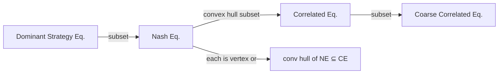

# 🔗 Correlated Equilibrium

> [!abstract] TL;DR
> A **Correlated Equilibrium** (CE, Aumann 1974) allows a trusted mediator to recommend correlated action profiles from a joint distribution p(s) ∈ Δ(S). Players obey the recommendation if no one profits from deviating: Σₛ₋ᵢ p(sᵢ,s₋ᵢ)·[uᵢ(sᵢ,s₋ᵢ) − uᵢ(s'ᵢ,s₋ᵢ)] ≥ 0 ∀i, ∀sᵢ, s'ᵢ. The set of CEs is a **convex polytope** defined by these linear inequalities, containing the convex hull of all Nash equilibria. A **Coarse Correlated Equilibrium** (CCE) weakens this to ex-ante obedience and is the precise limit of **no-regret learning** dynamics. Socially optimal CE can be found via LP in polynomial time — a dramatic computational improvement over NE.

---

## Intuition — analogy FIRST

Imagine a **traffic light** at an intersection. Without a light, drivers play a simultaneous game: both going straight leads to a crash (−10, −10), one yielding leads to (5, −1), other yielding leads to (−1, 5), both yielding leads to (0, 0). The two pure NE are (go, yield) and (yield, go). The mixed NE has both randomizing with prob ½ — expected crash probability is ¼.

A traffic light **correlates actions**: red gets recommendation "stop," green gets recommendation "go." Each driver obeys because given the recommendation, deviating (running a red light) is worse. The traffic light achieves a correlated equilibrium where neither crashes, with expected payoff (2, 2) — better than the mixed NE payoffs.

This is correlated equilibrium: a mediator sends **private recommendations** that no one individually wants to deviate from.

---

## How It Works

### Formal Definition (Aumann 1974)

A **correlated equilibrium** is a probability distribution p ∈ Δ(S) over pure strategy profiles such that for every player i and every pair sᵢ, s'ᵢ ∈ Sᵢ:

$$\sum_{s_{-i} \in S_{-i}} p(s_i, s_{-i}) \cdot \left[ u_i(s_i, s_{-i}) - u_i(s'_i, s_{-i}) \right] \geq 0$$

**Interpretation**: Given player i receives recommendation sᵢ, deviating to s'ᵢ doesn't help in expectation (averaging over what opponents were recommended, weighted by their likelihood given i's recommendation).

This is an **obedience constraint**: "If I'm told to play sᵢ, I prefer to obey rather than deviate to s'ᵢ."

---

### Battle of the Sexes: CE vs NE

| | O | F |
|--|:--:|:--:|
| **O** | (2,1) | (0,0) |
| **F** | (0,0) | (1,2) |

**Nash equilibria**: (O,O), (F,F), and mixed NE (2/3, 1/3) × (1/3, 2/3) with expected payoffs (2/3, 2/3).

**Correlated equilibrium example**: Mediator recommends (O,O) with prob ½ and (F,F) with prob ½.

Obedience check for P1 (recommendation O, prob ½):
- Given P1 gets "O," P2 also gets "O" with certainty (the distribution conditional on P1=O is all mass on P2=O)
- Deviating to F: u₁(F,O) = 0 < 2 = u₁(O,O) ✓ → Obedience satisfied

Expected payoffs: u₁ = ½·2 + ½·1 = **3/2**; u₂ = ½·1 + ½·2 = **3/2**.

This beats the mixed NE payoffs of 2/3 for both! The mediator coordinates on alternating pure NE.

**The correlated equilibrium set** for Battle of Sexes includes all convex combinations of the three NE plus additional distributions — it's a convex polytope strictly larger than the convex hull of NE.

---

## Key Concepts / Details

### Equilibrium Hierarchy

**Formal inclusions**:
- Every NE σ* induces a product distribution p(s) = Πᵢσ*ᵢ(sᵢ) which is a CE
- The convex hull of all NE distributions is contained in the CE set
- CE set is a strictly larger convex polytope in general
- CE ⊂ CCE (coarse correlated) ⊂ all distributions

### LP Characterization and Computation

The **set of correlated equilibria** is defined by a finite system of linear inequalities → **linear program**!

**Finding socially optimal CE**:
$$\max_{p \in \Delta(S)} \sum_s p(s) \cdot \sum_i u_i(s)$$
subject to:
$$\sum_{s_{-i}} p(s_i, s_{-i})[u_i(s_i, s_{-i}) - u_i(s'_i, s_{-i})] \geq 0 \quad \forall i, s_i, s'_i$$
$$\sum_s p(s) = 1, \quad p(s) \geq 0 \; \forall s$$

This LP has |S| variables and O(n · max|Sᵢ|²) constraints — polynomial in game representation size!

**Contrast with NE**: Computing NE is PPAD-complete (no poly-time algorithm known unless PPAD = P). CE computation is poly-time.

### Coarse Correlated Equilibrium (CCE)

**Definition**: p ∈ Δ(S) is a CCE if for every player i and every deviating strategy s'ᵢ ∈ Sᵢ:

$$\sum_{s \in S} p(s) \cdot u_i(s) \geq \sum_{s \in S} p(s) \cdot u_i(s'_i, s_{-i})$$

**Difference from CE**: The deviation happens BEFORE seeing the recommendation (ex-ante), not after (ex-post). Player commits to deviating without observing the mediator's signal.

**Why it matters**: CCE is the **precise equilibrium concept that no-regret learning algorithms converge to**. If all players in a repeated game use no-regret algorithms (e.g., Hedge/Multiplicative Weights Update), the empirical distribution of play converges to a CCE.

### No-Regret Learning → CCE

**Hedge algorithm** (Freund-Schapire 1997): Multiplicative Weights Update (MWU) — player updates strategy weights proportional to observed payoffs.

**Theorem**: If all players use MWU with learning rate η = O(1/√T), the empirical distribution of play satisfies:
$$\frac{1}{T}\sum_{t=1}^{T} u_i(s^t) \geq \max_{s_i} \frac{1}{T}\sum_{t=1}^{T} u_i(s_i, s^t_{-i}) - O(1/\sqrt{T})$$

i.e., average regret → 0. The time-average profile is approximately a CCE.

**Stronger result for CE**: Swap regret minimization (instead of external regret) ensures convergence to CE.

---

## Real-World Notes

- **Algorithmic mechanism design**: CE is computationally tractable; mechanisms that implement CE outcomes can improve welfare over NE
- **No-regret AI training**: Multi-agent RL with regret-minimizing agents converges to CCE — used in poker AI (Libratus, Pluribus use counterfactual regret minimization, a swap-regret algorithm → CE)
- **Mediators and recommendations**: Traffic signals, auction protocols, recommendation systems — all function as correlated equilibrium devices
- **Finance**: Correlated asset returns; portfolio insurance protocols as correlated equilibria between market participants
- **Mechanism design**: Any mechanism that recommends actions and satisfies obedience constraints implements a CE — broader class than Nash-implementing mechanisms

---

## Common Pitfalls

1. **CE requires ex-post obedience** — After seeing the recommendation, no one wants to deviate. CCE only requires ex-ante obedience (before seeing the recommendation).
2. **CE is not a mixed NE** — The joint distribution in CE can have correlations between players' actions; mixed NE uses product distributions (independent mixing).
3. **Mediator need not be strategic** — The mediator in a CE is a passive recommendation device, not a player with their own incentives. If the mediator is strategic, different equilibrium concepts apply.
4. **CE set can include non-NE distributions** — The convex hull of NE ⊆ CE, but CE contains additional distributions not achievable as mixtures of NE.

---

## Related Concepts

- [[_MOC_Static_Games|↑ Static Games MOC]]
- [[Nash_Equilibrium|Nash Equilibrium]]
- [[Mixed_Strategies|Mixed Strategies]]
- [[../06_Evolutionary_Computational/Algorithmic_Game_Theory|Algorithmic Game Theory]]
- [[../06_Evolutionary_Computational/Price_of_Anarchy|Price of Anarchy]]

---

## Review Questions

1. Verify that the distribution p(O,O) = p(F,F) = ½ is a correlated equilibrium for Battle of Sexes. Write out all obedience constraints explicitly.
2. For a symmetric 2×2 game with payoffs (H,H)=(6,6), (H,D)=(2,7), (D,H)=(7,2), (D,D)=(0,0), write the LP to find the welfare-maximizing CE and solve it.
3. Explain why CCE is the "right" equilibrium concept for no-regret learning. What additional assumption on the learning algorithm is needed to guarantee convergence to CE instead of CCE?

---

## Sources

- Aumann, R.J. (1974) — "Subjectivity and Correlation in Randomized Strategies," *Journal of Mathematical Economics*
- Aumann, R.J. (1987) — "Correlated Equilibrium as an Expression of Bayesian Rationality," *Econometrica*
- Freund & Schapire (1999) — "Adaptive Game Playing Using Multiplicative Weights"

#Game_Theory #StaticGames #CorrelatedEquilibrium
