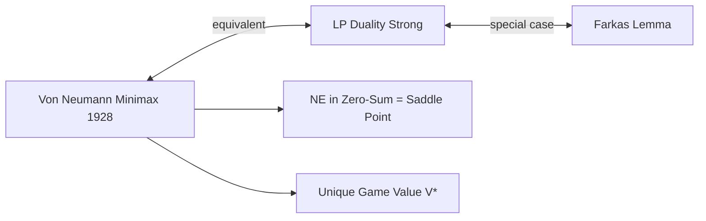

# ⚔️ Minimax Theorem

> [!abstract] TL;DR
> Von Neumann's Minimax Theorem (1928) states that for any finite two-player zero-sum game with payoff matrix A, maxₓminᵧ xᵀAy = minᵧmaxₓ xᵀAy = V*, where x ∈ Δ(m) and y ∈ Δ(n) are mixed strategies. V* is the **value** of the game; (x*, y*) achieving it is a **saddle point**. The theorem is equivalent to LP duality — P1's maximin problem and P2's minimax problem are LP duals, and strong duality guarantees equal optimal values. In the mixed extension, every finite zero-sum game has a unique value V* and (possibly multiple) optimal strategies. For pure strategies, minimax = maximin only if a pure saddle point exists; the minimax theorem requires mixing.

---

## Intuition — analogy FIRST

Consider a **two-army war game** on a grid map. Army Red wants to maximize territory captured; Army Blue wants to minimize territory lost. Red moves first, Blue responds — or both move simultaneously. The minimax theorem says: **it doesn't matter who moves first**. If both play optimally, the outcome (territory captured/lost) is the same whether the game is sequential or simultaneous. This is counterintuitive — normally committing first seems disadvantageous in zero-sum conflicts.

The theorem guarantees the existence of a "value" of the game: a number V* that Red can guarantee at least (by maximin strategy) and Blue can guarantee at most (by minimax strategy). Both armies can lock in this value regardless of the other's play.

---

## How It Works

### Formal Statement

**Von Neumann's Minimax Theorem (1928)**: For any m×n matrix A (payoffs to Player 1 in zero-sum game):

$$\max_{x \in \Delta(m)} \min_{y \in \Delta(n)} x^\top A y = \min_{y \in \Delta(n)} \max_{x \in \Delta(m)} x^\top A y = V^*$$

where Δ(m) = {x ∈ ℝᵐ : xᵢ ≥ 0, Σxᵢ = 1} is the m-dimensional simplex.

- **V*** = **value of the game**
- **(x*, y*)** achieving the saddle point: x* is P1's optimal (maximin) strategy, y* is P2's optimal (minimax) strategy

### Saddle Point Condition

(x*, y*) is a **saddle point** (Nash equilibrium for zero-sum) iff:

$$x^{*\top} A y \leq x^{*\top} A y^* \leq x^\top A y^* \quad \forall x \in \Delta(m), \forall y \in \Delta(n)$$

Equivalently:
- P1 cannot increase payoff by changing from x*: maxₓ xᵀAy* = x*ᵀAy*
- P2 cannot decrease payoff by changing from y*: minᵧ x*ᵀAy = x*ᵀAy*

**Example: Rock-Paper-Scissors** A = [[0,-1,1],[1,0,-1],[-1,1,0]]

Saddle point: x* = y* = (⅓, ⅓, ⅓), V* = 0. (Symmetric zero-sum → value = 0.)

---

### Proof via LP Duality

**P1's maximin problem** (Primal LP):

$$\max_{x \in \Delta(m), v} v \quad \text{s.t.} \quad \sum_i x_i A_{ij} \geq v \; \forall j \in [n], \quad \sum_i x_i = 1, x_i \geq 0$$

(P1 maximizes the minimum payoff over all P2 pure strategies.)

**P2's minimax problem** (Dual LP):

$$\min_{y \in \Delta(n), w} w \quad \text{s.t.} \quad \sum_j A_{ij} y_j \leq w \; \forall i \in [m], \quad \sum_j y_j = 1, y_j \geq 0$$

(P2 minimizes the maximum payoff P1 can achieve given P2's strategy.)

**Strong LP duality** guarantees: Primal optimal value = Dual optimal value = V*.
This is equivalent to the minimax theorem. The minimax theorem was historically proved BEFORE LP duality, and Von Neumann's insight inspired the LP duality theorem.

---

## Key Concepts / Details

### Pure Saddle Points

A **pure saddle point** exists when some entry A[i*][j*] satisfies:
- A[i*][j*] ≥ A[i][j*] for all i (i* is a best response to j*)
- A[i*][j*] ≤ A[i*][j] for all j (j* is a best response to i*)

**Pure saddle point iff max over rows of (min over columns) = min over columns of (max over rows):**
$$\max_i \min_j A_{ij} = \min_j \max_i A_{ij}$$

**Example with pure saddle point**:

| | L | M | R |
|--|:--:|:--:|:--:|
| **T** | 3 | 1 | **2** |
| **B** | 4 | **3** | 5 |

minᵢA[T][j] = 1; minᵢA[B][j] = 3. maxᵢ of these = **3**.
maxⱼA[i][R] = 5; maxⱼA[i][M] = 3; maxⱼA[i][L] = 4. minⱼ of these = **3**.
maximin = minimax = 3. Pure saddle point at (B, M): A[B][M] = 3. ✓

### Mixed Saddle Points (No Pure Saddle Point)

**Matching Pennies**: A = [[1,-1],[-1,1]]
- P1 maximin (pure): min(1,-1) = -1; min(-1,1) = -1. Max = -1 (P1 can't guarantee more than -1 with pure strategy).
- P2 minimax (pure): max(1,-1) = 1; max(-1,1) = 1. Min = 1 (P2 can't guarantee holding P1 below 1 with pure strategy).
- Pure maximin (-1) < Pure minimax (1) → **no pure saddle point**

With mixed strategies: x* = y* = (½, ½), V* = 0. Mixed saddle point resolves the gap.

### Relation to Nash Equilibrium

**Theorem**: For zero-sum games, every Nash equilibrium (x*, y*) achieves the minimax value V*. The NE value is unique (though strategies may differ), and every pair of individually optimal strategies forms a saddle point.

**Proof**: 
- x* is P1's maximin strategy (by NE, P1 can't improve)
- y* is P2's minimax strategy (by NE, P2 can't improve)  
- Minimax theorem guarantees these equal the same value V*.
- Multiple optimal strategies for P1 all achieve V*; same for P2. Any combination (x1*, y2*) where x1*, y2* are independently optimal also achieves V* — no coordination needed!

**Non-zero-sum**: The minimax theorem does NOT apply. maxᵢminⱼuᵢ(sᵢ,sⱼ) ≠ NE value in general.

### Worked 2×2 Example (No Pure Saddle)

$$A = \begin{pmatrix} 2 & -1 \\ -1 & 1 \end{pmatrix}$$

P1 rows = {T, B}, P2 cols = {L, R}.

Maximin (pure): max(min(2,-1), min(-1,1)) = max(-1,-1) = -1.
Minimax (pure): min(max(2,-1), max(-1,1)) = min(2,1) = 1. Gap: -1 < 1.

Mixed: P1 mixes with p = P(T).
P2 indifference: 2p - 1(1-p) = -p + 1(1-p) → 3p-1 = 1-2p → 5p = 2 → **p = 2/5**

P2 mixes with q = P(L).
P1 indifference: 2q - 1(1-q) = -q + 1(1-q) → 3q-1 = 1-2q → 5q = 2 → **q = 2/5**

V* = 2·(2/5)(2/5) + (-1)·(2/5)(3/5) + (-1)·(3/5)(2/5) + 1·(3/5)(3/5)
   = 8/25 - 6/25 - 6/25 + 9/25 = **5/25 = 1/5**

---

## Real-World Notes

- **Chess/Go engines** (minimax search): Alpha-beta pruning is minimax search with pruning. The theorem guarantees that optimal play is well-defined.
- **Adversarial ML**: Minimax optimization underlies GANs (generator maximizes, discriminator minimizes classification loss). The minimax theorem provides theoretical foundation.
- **Robust optimization**: Minimax over uncertain parameters gives the worst-case optimal solution — equivalent to a zero-sum game against Nature.
- **Security games**: Minimax strategies for defenders against adversaries in network security, terrorism prevention, etc.

---

## Common Pitfalls

1. **Minimax ≠ maximin without mixing** — The theorem requires mixed strategies. With only pure strategies, the minimax value can exceed maximin.
2. **Only for zero-sum** — The theorem does NOT hold for general-sum games. Never apply minimax to general-sum games.
3. **Multiple optimal strategies** — The value V* is unique, but optimal strategies need not be. All optimal strategies are Nash equilibria; any combination of P1's and P2's optimal strategies is also a NE.
4. **Minimax theorem proves NE existence for zero-sum** — But NE existence in general games requires Kakutani's fixed-point theorem (Nash 1950), not the minimax theorem.

---

## Related Concepts

- [[_MOC_Static_Games|↑ Static Games MOC]]
- [[Nash_Equilibrium|Nash Equilibrium]]
- [[Mixed_Strategies|Mixed Strategies]]
- [[../06_Evolutionary_Computational/Price_of_Anarchy|Price of Anarchy]]
- [[../06_Evolutionary_Computational/Algorithmic_Game_Theory|Algorithmic Game Theory]]

---

## Review Questions

1. Find the value and optimal strategies of the 3×3 zero-sum game A = [[3,0,-1],[0,3,-1],[-1,-1,2]] using the LP formulation. Verify with mixed strategy indifference.
2. Prove that if (x₁*, y*) and (x₂*, y*) are both saddle points (with different P1 strategies), then (αx₁* + (1-α)x₂*, y*) is also a saddle point for any α ∈ [0,1].
3. The minimax theorem was proved in 1928, LP duality in 1947. Explain the conceptual relationship: how does LP duality imply the minimax theorem, and how does the minimax theorem inspire LP duality?

---

## Sources

- Von Neumann, J. (1928) — "Zur Theorie der Gesellschaftsspiele," *Math. Annalen*
- Dantzig, G. (1951) — "A Proof of the Equivalence of the Programming Problem and the Game Problem"
- Luce & Raiffa — *Games and Decisions* (1957), Ch. 4

#Game_Theory #StaticGames #MinimaxTheorem
