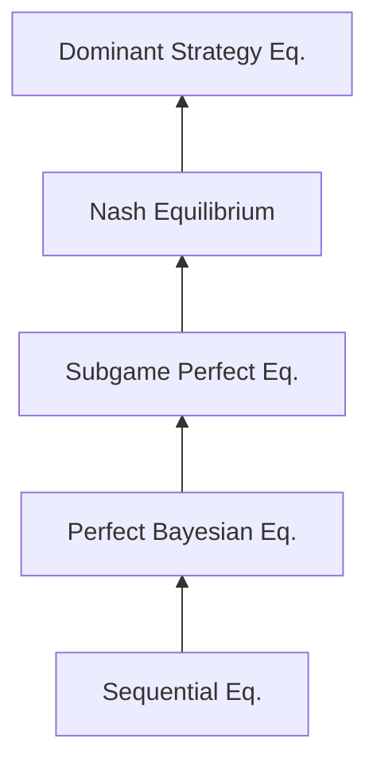

# ⚖️ Nash Equilibrium

> [!abstract] TL;DR
> A **Nash Equilibrium** (NE) is a strategy profile s* where no player can increase their payoff by unilaterally deviating: uᵢ(s*ᵢ, s*₋ᵢ) ≥ uᵢ(sᵢ, s*₋ᵢ) ∀ sᵢ ∈ Sᵢ, ∀ i. Nash (1950) proved existence via Kakutani's fixed-point theorem applied to the best-response correspondence BR(σ) = ×ᵢBRᵢ(σ₋ᵢ). Every finite game has ≥1 NE in mixed strategies. NE is not necessarily unique (Battle of Sexes has 3: two pure + one mixed) nor Pareto optimal (Prisoner's Dilemma (D,D) is the unique NE yet Pareto-dominated by (C,C)). The **support lemma** characterizes mixed NE: all strategies in the support of a mixed NE must yield equal expected payoffs.

---

## Intuition — analogy FIRST

Imagine **two gas stations** on opposite corners deciding on a price. If Station A charges $3.00, Station B's best response is $2.99 (undercut to steal all customers). But if B charges $2.99, A's best response is $2.98. This keeps going until both hit marginal cost — the Nash equilibrium. At that point: neither station wants to change price given the other's price. **Mutual best response = stable self-enforcing prediction.**

Nash equilibrium captures exactly this: a profile where everyone is already playing optimally given what everyone else is doing. No regret, no profitable deviation. It's a **fixed point** of the reasoning "I'm best-responding to you best-responding to me."

---

## How It Works

### Formal Definition

A mixed strategy profile σ* = (σ*₁, …, σ*ₙ) is a **Nash Equilibrium** if for every player i:

$$u_i(\sigma^*_i, \sigma^*_{-i}) \geq u_i(\sigma_i, \sigma^*_{-i}) \quad \forall \sigma_i \in \Delta(S_i)$$

Equivalently (by linearity of expected utility), for every pure strategy sᵢ:

$$u_i(\sigma^*_i, \sigma^*_{-i}) \geq u_i(s_i, \sigma^*_{-i}) \quad \forall s_i \in S_i$$

**Best Response Correspondence**: BRᵢ(σ₋ᵢ) = {σᵢ ∈ Δ(Sᵢ) : uᵢ(σᵢ, σ₋ᵢ) ≥ uᵢ(σ'ᵢ, σ₋ᵢ) ∀σ'ᵢ}

**NE characterization**: σ* is a NE iff σ*ᵢ ∈ BRᵢ(σ*₋ᵢ) ∀i — a fixed point of the joint BR correspondence.

---

### Nash's Existence Theorem (1950)

**Theorem**: Every finite strategic-form game has at least one Nash equilibrium (in mixed strategies).

**Proof sketch** (Kakutani's Fixed Point):
1. Define joint BR correspondence: BR: Δ(S) → 2^Δ(S) by BR(σ) = ×ᵢ BRᵢ(σ₋ᵢ)
2. **Kakutani's conditions**:
   - Δ(S) is compact and convex ✓
   - BR(σ) is non-empty ∀σ (finite game, utility maximization over compact set) ✓
   - BR(σ) is convex-valued ✓ (best responses form a convex set — any mixture of BRs is a BR)
   - BR has a closed graph ✓ (continuity of expected payoff)
3. **Kakutani's theorem**: Such a correspondence has a fixed point σ* ∈ BR(σ*)
4. Fixed point = Nash equilibrium. □

**Nash's original proof** (1950) used Brouwer's fixed-point theorem via a continuous approximation.

---

## Key Concepts / Details

### Finding Nash Equilibria: Bimatrix Method

**Step 1**: Underline best responses in the payoff matrix.
**Step 2**: Pure NE = cells where both entries are underlined.
**Step 3**: Mixed NE via indifference principle (see [[Mixed_Strategies]]).

**Battle of the Sexes:**

|  | **Opera (O)** | **Football (F)** |
|--|:---:|:---:|
| **Opera (O)** | (**2**, **1**) | (0, 0) |
| **Football (F)** | (0, 0) | (**1**, **2**) |

*(Best responses underlined in bold)*

- (O,O): P1 gets 2, P2 gets 1. P1 BR to O is O ✓. P2 BR to O is O ✓. → **Pure NE**
- (F,F): P1 gets 1, P2 gets 2. P1 BR to F is F ✓. P2 BR to F is F ✓. → **Pure NE**
- Mixed NE: P1 plays O with prob p such that P2 is indifferent: 1·p + 0·(1-p) = 0·p + 2·(1-p) → p = ⅔
  P2 plays O with prob q: 2q = 1-q → q = ⅓. Mixed NE: (2/3, 1/3) for P1; (1/3, 2/3) for P2.
  Expected payoffs: P1 gets 2·(⅓) = 2/3; P2 gets 1·(⅔) = 2/3.

**Three Nash Equilibria total**: two pure, one mixed.

### Support Lemma

**Lemma**: In a NE σ*, if player i mixes over strategies in supp(σ*ᵢ), then all strategies in the support yield the same expected payoff. Strategies outside the support yield strictly lower expected payoff.

Formally: ∀ sᵢ, s'ᵢ ∈ supp(σ*ᵢ): uᵢ(sᵢ, σ*₋ᵢ) = uᵢ(s'ᵢ, σ*₋ᵢ)

This is the **indifference principle**: mixing makes sense only when you're indifferent between all mixed strategies. If one pure strategy were strictly better, you'd put all weight on it.

### Uniqueness Conditions

NE need not be unique. Conditions that guarantee uniqueness:

1. **Strict dominant strategy**: One dominant strategy per player → unique pure NE
2. **Diagonal dominance** (for smooth games): Payoff functions satisfy contraction conditions
3. **Potential games**: Unique pure NE if the potential function has a unique maximum
4. **Zero-sum games**: Unique value (though multiple strategies may achieve it)

### Pareto Sub-optimality of NE

**Prisoner's Dilemma revisited**: (D,D) is the unique NE. (C,C) gives both players 3 > 1. The NE is Pareto-dominated.

This is the central tension of game theory: **individually rational behavior can produce collectively sub-optimal outcomes**. Solutions:
- Repeated interaction (Folk Theorem allows cooperation)
- Mechanism design (change payoffs to align incentives)
- Correlated equilibrium (mediator can improve on NE)

### Nash Equilibrium Refinements

*NE is the coarsest; sequential equilibrium is the finest standard refinement.*

---

## Real-World Notes

- **Oligopoly pricing** (Cournot, Bertrand): Firms' equilibrium quantities/prices in industrial organization
- **Traffic routing**: Wardrop equilibrium in transportation networks is a Nash equilibrium of the routing game — related to Price of Anarchy
- **International trade**: Tariff-setting between countries as Nash equilibrium — often leads to trade wars (mutual tariffs)
- **Algorithmic NE computation**: In 2-player zero-sum games, NE is a linear program (solvable in poly-time). In general 2-player games, NE is PPAD-complete (Daskalakis, Goldberg, Papadimitriou 2009)
- **AI training**: GAN training is a zero-sum game between generator and discriminator; convergence to NE is the training objective (often difficult in practice)

---

## Common Pitfalls

1. **NE is not necessarily unique** — Always check for multiple NE (pure and mixed) rather than stopping after finding one.
2. **NE is not necessarily Pareto optimal** — Efficiency and stability are distinct properties. Don't conflate them.
3. **Mixed NE expected payoffs** — In a mixed NE, a player's expected payoff may be lower than any pure strategy NE payoff in some games (Battle of the Sexes mixed NE gives 2/3 < 1 from pure NE).
4. **Off-equilibrium-path reasoning** — NE doesn't pin down beliefs at unreached histories. This is why SPE and sequential equilibrium are needed for dynamic games.

---

## Related Concepts

- [[_MOC_Static_Games|↑ Static Games MOC]]
- [[Mixed_Strategies|Mixed Strategies]]
- [[Correlated_Equilibrium|Correlated Equilibrium]]
- [[Minimax_Theorem|Minimax Theorem]]
- [[../01_Fundamentals/Dominance_and_Rationality|Dominance & Rationality]]
- [[../03_Dynamic_Games/Subgame_Perfect_Equilibrium|Subgame Perfect Equilibrium]]

---

## Review Questions

1. Find all Nash equilibria (pure and mixed) of the Hawk-Dove game with payoffs: (H,H)=(−1,−1), (H,D)=(6,0), (D,H)=(0,6), (D,D)=(3,3).
2. Prove that if σ* is a Nash equilibrium with σ*ᵢ fully mixed (every pure strategy has positive probability), then player i is indifferent over all pure strategies. Does the converse hold?
3. Show that Nash's proof via Kakutani's theorem fails for infinite games with non-compact strategy spaces. Provide a counterexample where no NE exists.

---

## Sources

- Nash, J. (1950) — "Equilibrium Points in N-person Games," *PNAS*
- Nash, J. (1951) — "Non-Cooperative Games," *Annals of Mathematics*
- Kakutani, S. (1941) — "A Generalization of Brouwer's Fixed Point Theorem"
- Osborne & Rubinstein — *A Course in Game Theory*, Ch. 2–3

#Game_Theory #StaticGames #NashEquilibrium
