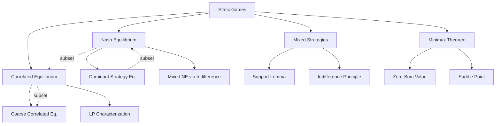

# ⚖️ Static Games — Section MOC

> [!abstract] Section Overview
> Static (simultaneous-move) games are the core laboratory of game theory. Players choose strategies simultaneously without observing each other's choices. This section covers the central equilibrium concepts: Nash equilibrium (fixed point of best responses), mixed strategies (indifference principle), correlated equilibrium (mediated coordination), and the minimax theorem (zero-sum game value).

---

## Concept Map



---

## Notes in This Section

| Note | Core Idea | Difficulty |
|------|-----------|-----------|
| [[Nash_Equilibrium\|Nash Equilibrium]] | Fixed point of BRs; Nash 1950 existence; uniqueness; Pareto sub-optimality | Intermediate |
| [[Mixed_Strategies\|Mixed Strategies]] | Indifference principle; 2×2 closed form; support identification; Matching Pennies | Intermediate |
| [[Correlated_Equilibrium\|Correlated Equilibrium]] | Aumann 1974; obedience constraint; LP; no-regret learning → CCE | Intermediate |
| [[Minimax_Theorem\|Minimax Theorem]] | Von Neumann 1928; saddle point; LP duality proof; zero-sum value | Intermediate |

---

## Equilibrium Hierarchy

```
Dominant Strategy Eq. ⊂ Nash Eq. ⊆ Correlated Eq. ⊆ Coarse Correlated Eq.
```

## Learning Path

```
Nash_Equilibrium → Mixed_Strategies → Minimax_Theorem → Correlated_Equilibrium
```

## Key Questions

1. Does every finite game have a Nash equilibrium?
2. How do you find mixed NE using the indifference principle?
3. What can a mediator achieve that Nash equilibria cannot?
4. Why does the minimax theorem hold only for zero-sum games?

---

## Related Sections

- [[_MOC_Game_Theory_Master|↑ Master MOC]]
- [[../01_Fundamentals/_MOC_GT_Fundamentals|← Fundamentals]]
- [[../03_Dynamic_Games/_MOC_Dynamic_Games|→ Dynamic Games]]

#Game_Theory #StaticGames #MOC
