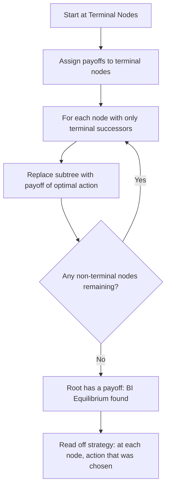
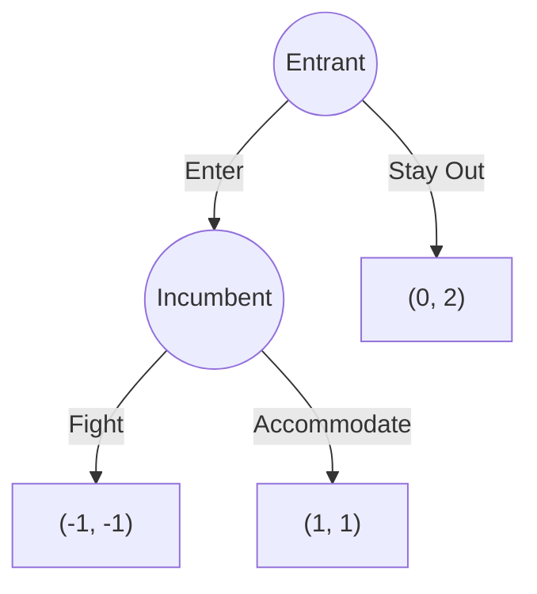
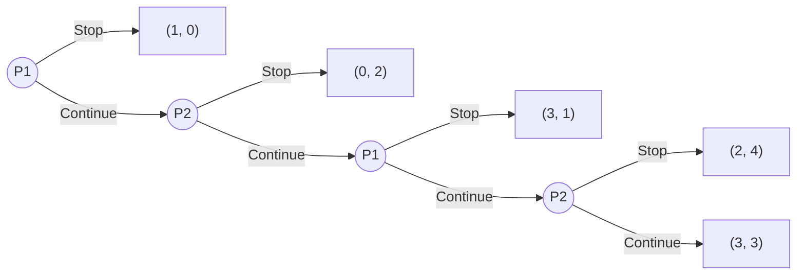

# ↩️ Backward Induction

> [!abstract] TL;DR
> **Backward induction** solves finite perfect-information games by working backwards from terminal nodes: at each decision node, replace the subtree with the payoff from the optimal action (given future play). The resulting strategy profile is the **Backward Induction Equilibrium** — the unique outcome in generic perfect-information games. **Zermelo's theorem** (1913) proves chess (and all finite perfect-info games) are "determined": one player has a winning strategy or both can force a draw. The **Centipede Paradox** (Rosenthal 1981) reveals the limits of backward induction rationality: BI predicts immediate stop in a game where any human player would take several steps, exposing tension between individual rationality and mutual benefit.

---

## Intuition — analogy FIRST

When you're playing **chess**, the ideal strategy would be to look all the way to the end of every line: if you make this move, your opponent responds with that move, then you reply, and eventually you win (or lose). Working backwards from the win/loss/draw positions to find the optimal move NOW is exactly backward induction. The trick is that you solve the "last decision first" and substitute the answer back to simplify the prior decision — like solving a math problem from the inside out.

More concretely: imagine a **3-round salary negotiation** where the contract must be agreed or rejected. In the last round, rational agents will accept any positive surplus. Knowing this, the second-round offer can exploit this knowledge. Knowing the second-round logic, the first-round offer can be optimally made. Backward induction is the mathematical formalization of this reasoning.

---

## How It Works

### The Algorithm

**Input**: Finite extensive-form game with perfect information (singleton information sets).
**Output**: Unique strategy profile and outcome for generic payoffs.

**Generic payoffs assumption**: No terminal node payoffs tied; each player has a unique best action at each decision node. Ensures **uniqueness** of BI outcome.

---

### Worked Example: Entry Deterrence

**Step 1** (Last mover — Incumbent): If Entrant enters, Incumbent chooses:
- Fight: u_I = -1
- Accommodate: u_I = 1
- Best response: **Accommodate** (1 > -1). Replace Incumbent subtree with (1, 1).

**Step 2** (Entrant): Now the game looks like:
- Enter → (1, 1)
- Stay Out → (0, 2)
- Entrant's payoffs: Enter=1 > Stay Out=0. **Best: Enter**.

**BI Equilibrium**: (Enter, Accommodate). Payoffs: (1, 1).

**Threat analysis**: Incumbent's threat to "Fight if entry occurs" is **non-credible** — it's not in Incumbent's interest to fight (−1 < 1). Backward induction correctly eliminates this empty threat. This is the core logic of [[Subgame_Perfect_Equilibrium|SPE]].

---

## Key Concepts / Details

### Zermelo's Theorem (1913)

**Theorem**: Every finite two-player zero-sum game of perfect information is **determined**: exactly one of the following holds:
1. Player 1 has a winning strategy
2. Player 2 has a winning strategy
3. Both players can force at least a draw (if draw is possible)

**Corollary**: Chess, checkers, Go — all are determined. One side can force at least a draw with perfect play.

**Proof** (by backward induction):
- From any position, the current player either has a winning move, a drawing move, or all moves lead to the opponent having a winning position
- By backward induction, label each position W (current player wins) or L (current player loses) or D (draw available)
- This labeling is well-defined by finite descent
- The starting position is labeled, determining which player "wins" with perfect play

**Caveat**: Determining chess is proven only existentially — the actual optimal strategies are unknown (search space ~10¹²⁰ positions). Checkers was solved in 2007 (Schaeffer et al.): perfect play → draw.

### Centipede Game (Rosenthal 1981)

*Payoffs grow as the game continues. At each stage, current player can "take" a larger share (Stop) or let the pot grow (Continue).*

**Backward induction**:
- Last node (P2's last choice): Continue gives (3,3), Stop gives (2,4). P2 prefers Stop (4>3).
- Replace with (2,4). Now P1's last choice: Continue gives (2,4)→P1 gets 2; Stop gives (3,1)→P1 gets 3. P1 prefers Stop.
- Replace with (3,1). P2's first choice: Continue gives (3,1)→P2 gets 1; Stop gives (0,2)→P2 gets 2. P2 prefers Stop.
- Replace with (0,2). P1's first choice: Continue gives (0,2)→P1 gets 0; Stop gives (1,0)→P1 gets 1. P1 prefers Stop.

**BI Prediction**: P1 stops immediately at the first node. Both get (1, 0).

**The paradox**: This prediction is absurd! If P1 continues just once, and P2 also continues, both get far more than BI predicts. Experimental evidence: players continue for several steps, only stopping near the end. BI requires "common knowledge of rationality" to work — if P1 knows P2 MIGHT continue even when BI says stop, P1 benefits from continuing.

**Lessons**:
- BI prediction requires complete common knowledge of rationality
- Even a small probability that P2 is "irrational" (continues) can rationally induce P1 to also continue
- McKelvey & Palfrey (1992): Quantal Response Equilibrium explains centipede data

### Dynamic Consistency

**Dynamic consistency**: A plan is dynamically consistent if, when the time to execute a step arrives, the agent still wants to execute it.

Backward induction strategies are always dynamically consistent (the plan is sequentially rational at every node). Strategies that deviate from BI may be inconsistent:

**Inconsistent threat example**: "I'll fight if you enter" (Incumbent). Once entry occurs, fighting is suboptimal — the threat is dynamically inconsistent. BI eliminates such threats by requiring optimality at every decision node.

### BI vs. Weak Dominance

**Theorem**: In a finite game of perfect information, backward induction is equivalent to iterated weak dominance applied to the strategic form.

This links dynamic and static reasoning: backward induction = IEDS (weak) from the terminal nodes up.

---

## Real-World Notes

- **Negotiation**: In ultimatum games (one-sided take-it-or-leave-it offer), BI predicts the proposer takes almost everything. Experiments show offers of ~40% are common and low offers (~20%) are rejected — violating BI predictions
- **Chess engines**: Alpha-beta minimax search implements BI with heuristic horizon evaluation, not full BI (impractical at depth ~10¹²⁰)
- **Supply chain**: Multi-tier Stackelberg pricing games between manufacturer and retailer solved by BI — gives optimal price schedule
- **Project planning**: PERT/CPM uses backward induction to find critical path and optimal resource allocation
- **Contract theory**: Optimal contract design uses BI: anticipate agent's response, design contract to induce desired action

---

## Common Pitfalls

1. **BI requires perfect information** — In games with imperfect information (non-singleton info sets), backward induction cannot be directly applied. SPE and PBE are needed.
2. **Generic payoff assumption** — Ties between payoffs can make BI non-unique. Small perturbations resolve ties and restore uniqueness.
3. **Centipede paradox**: BI prediction breaks down empirically when cooperation gains are large relative to the cost of being "suckered." Don't over-apply BI to real human behavior.
4. **"Backward induction equilibrium" ≠ SPE in all games** — BI applies to perfect-information games and finds the unique SPE there. For imperfect information, SPE requires different tools.

---

## Related Concepts

- [[_MOC_Dynamic_Games|↑ Dynamic Games MOC]]
- [[Extensive_Form_and_Game_Trees|Extensive Form & Game Trees]]
- [[Subgame_Perfect_Equilibrium|Subgame Perfect Equilibrium]]
- [[../01_Fundamentals/Dominance_and_Rationality|Dominance & Rationality]]
- [[Repeated_Games_and_Folk_Theorems|Repeated Games & Folk Theorems]]

---

## Review Questions

1. Apply backward induction to a 3-player game where P1 moves first (U/D), then P2 observes and moves (L/R), then P3 observes all and moves (A/B). Payoffs are specified at 8 terminal nodes. Write the full strategy profile.
2. Prove Zermelo's theorem for finite two-player zero-sum games with no draws by induction on the depth of the game tree.
3. The 6-legged Centipede game has BI prediction (Stop immediately). How large does the probability of irrational play by P2 need to be before P1 rationally Continues? (Set up the calculation formally.)

---

## Sources

- Zermelo, E. (1913) — "Über eine Anwendung der Mengenlehre auf die Theorie des Schachspiels"
- Rosenthal, R.W. (1981) — "Games of Perfect Information, Predatory Pricing and the Chain-Store Paradox," *Journal of Economic Theory*
- McKelvey & Palfrey (1992) — "An Experimental Study of the Centipede Game," *Econometrica*

#Game_Theory #DynamicGames #BackwardInduction
