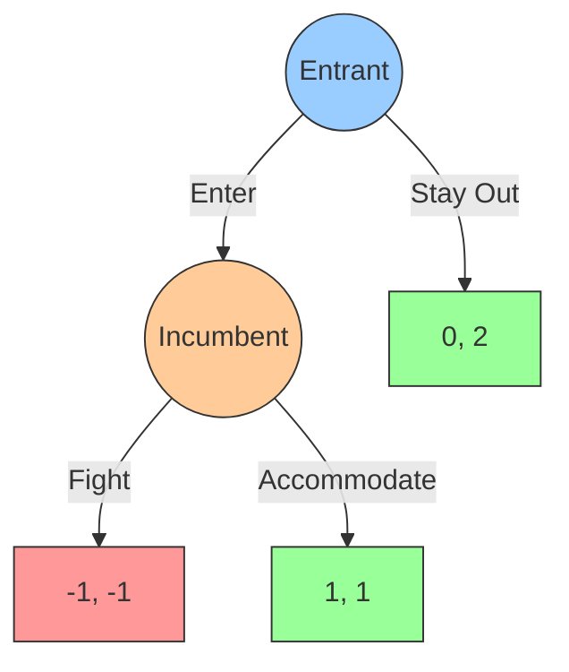
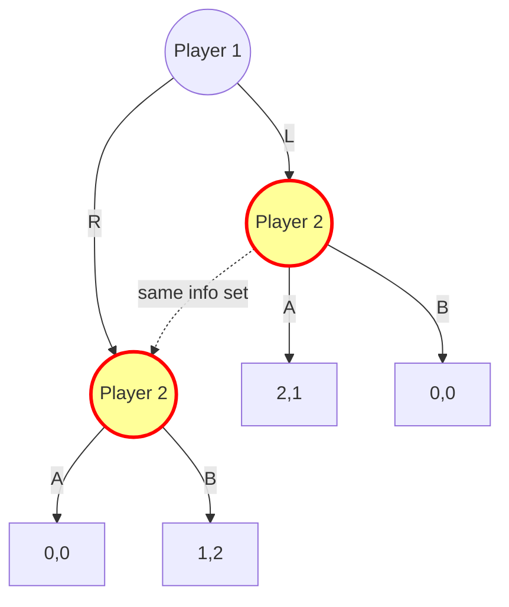
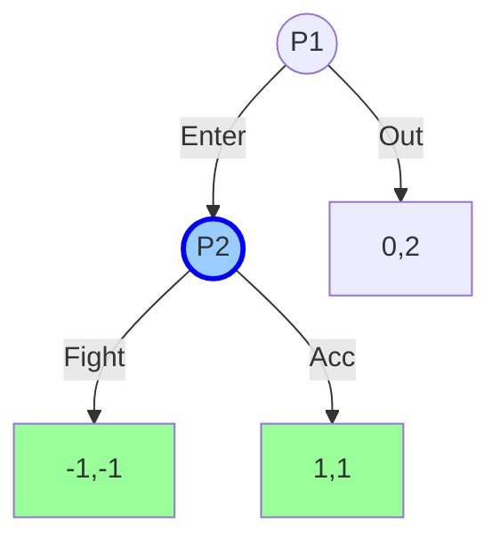

# 🌳 Extensive Form and Game Trees

> [!abstract] TL;DR
> An **extensive-form game** represents dynamic strategic interaction as a rooted tree with **decision nodes** (owned by players or Nature), **chance nodes** (Nature's random moves with fixed probabilities), **terminal nodes** (end states with payoff vectors), and **information sets** Iᵢ (partitions of player i's decision nodes capturing what they observe). A **pure strategy** for player i is a complete contingent plan: a function from each information set of i to an action. A **behavioral strategy** independently randomizes at each information set. **Kuhn's Theorem** (1953): In games of perfect recall, every mixed strategy has a payoff-equivalent behavioral strategy — behavioral strategies suffice for analysis. Information sets are the key structural element separating sequential from simultaneous moves.

---

## Intuition — analogy FIRST

A **chess game tree** branches at every possible board position: each node represents a board state, edges represent moves, leaves represent game endings (win/loss/draw). The information set at each node is a singleton (you can see the whole board) — this is **perfect information**.

Now imagine **poker**: you see your own cards but not your opponent's. When it's your turn to bet, you're at a decision node, but you don't know which of several possible "states of the world" you're in (what cards your opponent has). This uncertainty is captured by an **information set**: a set of nodes that are indistinguishable to you. Your strategy must specify the same action at all nodes in an information set (since you can't distinguish them).

Game trees translate sequential strategic situations into formal objects that can be analyzed mathematically.

---

## How It Works

### Components of an Extensive-Form Game

**Formal definition**: An extensive-form game Γ = (N, T, A, {Iᵢ}, {Aᵢ}, ρ, u) consists of:

1. **N** = {1, …, n} ∪ {0} — players plus Nature (player 0)
2. **T** — rooted tree with root ∅ (game start)
3. **Decision nodes** H — non-terminal nodes, each owned by some player ι(h) ∈ N ∪ {0}
4. **Terminal nodes** Z — end states with no successors
5. **Action sets** A(h) — available moves at node h
6. **Chance probabilities** p(a|h) for h owned by Nature
7. **Information partition** Iᵢ — partition of player i's decision nodes into information sets
8. **Payoff function** u: Z → ℝⁿ — payoff vector at each terminal node

**Information set constraint**: If h, h' ∈ Iᵢ (same information set), then A(h) = A(h'). Player must have same actions at indistinguishable nodes.

---

### Example: Entry Deterrence Game

*Payoffs: (Entrant, Incumbent). Entrant moves first, Incumbent observes entry and responds.*

This is **perfect information**: Incumbent knows whether Entrant entered (singleton information set).

### Imperfect Information: Simultaneous Move in Extensive Form

*P2's dashed nodes form one information set: P2 cannot observe P1's choice. Equivalent to simultaneous game.*

---

## Key Concepts / Details

### Strategies: Pure, Mixed, Behavioral

**Pure strategy** for player i: σᵢ: Iᵢ → Aᵢ, assigning an action to each information set.
- Player must specify action at ALL information sets, including those that won't be reached

**Mixed strategy** for player i: σᵢ ∈ Δ(Pure strategies) — a distribution over complete pure strategies.

**Behavioral strategy** for player i: βᵢ: Iᵢ → Δ(Aᵢ) — at each information set, independently draw an action from a local distribution.

**Worked example**: P1 has two information sets I₁, I₂, each with 2 actions.
- Pure strategies: 2 × 2 = 4 (must specify action at both sets)
- Mixed strategy: Δ({AA, AB, BA, BB}) — distribution over 4 pure strategies
- Behavioral strategy: (p₁ ∈ [0,1], p₂ ∈ [0,1]) — prob of action 1 at each set independently

### Kuhn's Theorem (1953)

**Theorem**: In any finite extensive-form game with **perfect recall**, for every mixed strategy there exists a payoff-equivalent behavioral strategy (and vice versa).

**Perfect recall**: Player i never forgets their own past moves and information. Formally: if h, h' ∈ Iᵢ(k) (same info set), then the sequence of player i's information sets and actions on the path to h equals that to h'.

**Consequence**: Behavioral strategies suffice for analysis in games of perfect recall (the standard assumption). No information is lost by restricting to behavioral strategies — a dramatic simplification.

**Without perfect recall** (imperfect recall): The equivalence fails. Strategic form analysis required.

### Perfect Recall Illustration

**Perfect recall** example: If I bet big in round 1, I know I bet big in round 2. My information set in round 2 includes my round-1 action as context.

**Imperfect recall** example (rare, theoretical): Absent-minded driver who forgets how many exits they passed. They're at a decision node but can't recall their own past moves.

### Subgames

A **subgame** of Γ is a subtree rooted at some node h that:
1. Starts at a singleton information set (h alone in its info set)
2. Contains all successors of h
3. Includes all information sets for every player that has a decision in the subtree

**Well-defined subgames** can be analyzed as independent games — the foundation of [[Subgame_Perfect_Equilibrium|Subgame Perfect Equilibrium]].

*The subgame rooted at P2's node is a valid subgame: singleton info set, closed under info sets.*

### Game Tree Complexity

| Game | Branching Factor | Tree Nodes | Decision Nodes |
|------|-----------------|-----------|---------------|
| Tic-Tac-Toe | ~5 | ~362,880 | Solved |
| Chess | ~35 | ~10^120 | Determined, unsolved |
| Go | ~250 | ~10^170 | Determined, solved by neural MCTS |
| Poker (Texas Hold'em) | Variable | ~10^14 information sets | Approximated by CFR |

---

## Real-World Notes

- **AlphaGo/AlphaZero**: MCTS over the game tree; neural networks estimate value/policy at each node, dramatically reducing search depth needed
- **Poker solvers**: Counterfactual Regret Minimization (CFR) works directly on the information-set game tree to find approximate Nash equilibrium strategies
- **Automated planning (AI)**: STRIPS/PDDL planning can be modeled as single-player game trees; adversarial planning is an extensive-form game
- **Contract theory**: Optimal contract design as a game tree where principal moves first (offers contract) and agent moves second (accepts/rejects, then exerts effort)

---

## Common Pitfalls

1. **Strategy ≠ action plan**: A strategy must specify actions at ALL information sets, not just those reached in equilibrium. Off-path specifications affect equilibrium selection.
2. **Information set validity**: Nodes in the same information set must be at the same depth (no node on the path from root to another can be in the same information set).
3. **Subgame requirements**: Not every subtree is a subgame — it must start at a singleton info set and be closed under information sets.
4. **Mixed ≠ behavioral without perfect recall**: Kuhn's theorem assumes perfect recall. In imperfect recall games, mixed and behavioral strategies can diverge.

---

## Related Concepts

- [[_MOC_Dynamic_Games|↑ Dynamic Games MOC]]
- [[../01_Fundamentals/Game_Representations|Game Representations]]
- [[Backward_Induction|Backward Induction]]
- [[Subgame_Perfect_Equilibrium|Subgame Perfect Equilibrium]]
- [[Signaling_Games|Signaling Games]]

---

## Review Questions

1. Draw the extensive form of a 3-stage game where P1 chooses U/D, then P2 observes and chooses L/R, then P1 (having observed P2's choice) chooses A/B. Identify all information sets and count pure strategies for each player.
2. In a 2-player game with perfect recall, P1 has 3 information sets with 2 actions each. How many pure strategies does P1 have? What is the dimension of P1's behavioral strategy space?
3. Construct a game where one player has imperfect recall and show that a payoff-equivalent behavioral strategy for a specific mixed strategy does not exist.

---

## Sources

- Kuhn, H.W. (1953) — "Extensive Games and the Problem of Information," *Annals of Math Studies*
- Fudenberg & Tirole — *Game Theory*, Ch. 3
- Osborne — *An Introduction to Game Theory*, Ch. 7

#Game_Theory #DynamicGames #ExtensiveFormGameTrees
