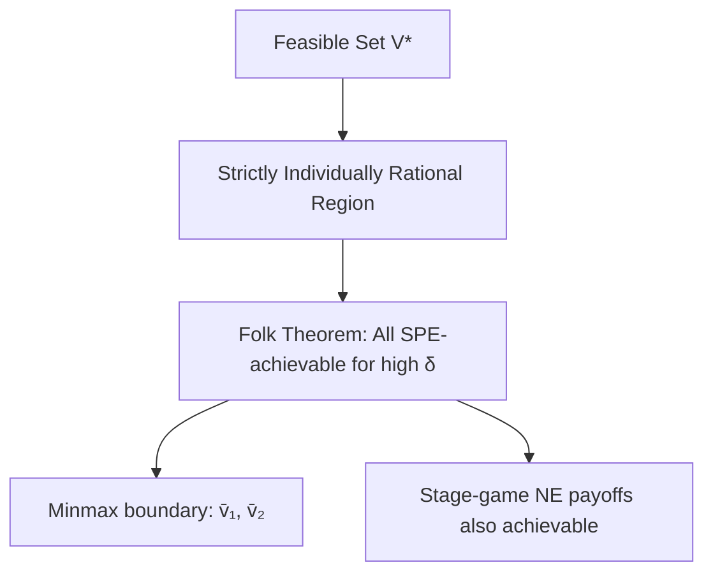

# 🔁 Repeated Games and Folk Theorems

> [!abstract] TL;DR
> In an **infinitely repeated game**, players face the same stage game each period and discount future payoffs by factor δ ∈ (0,1). Long-run interaction enables cooperation via **credible punishments**: deviations trigger retaliation that outweighs short-run gains. **Grim Trigger** supports cooperation in PD iff δ ≥ (T−R)/(T−P) where T=temptation, R=reward, P=punishment. The **Fudenberg-Maskin Folk Theorem** (1986): any feasible individually-rational payoff v ∈ V* with vᵢ > v̄ᵢ (minmax value) is supportable as an SPE payoff for δ sufficiently close to 1. **Tit-for-Tat** (Axelrod 1984) — nice, retaliatory, forgiving, clear — is robustly successful in tournaments but is NOT an SPE in general.

---

## Intuition — analogy FIRST

Two competing **airlines on a route** could maintain high fares (cooperative, profits $10M each) or price-cut (competitive, profits $2M each). In a single-shot game, undercutting is dominant (Prisoner's Dilemma). But airlines interact repeatedly on the same routes for years. If one airline undercuts today, the other will undercut tomorrow — and every future day. The fear of losing $8M/year in future profits (for every future year!) makes undercutting unattractive today. Patience (high δ) means the future matters more, making cooperation sustainable.

This is the key insight of repeated games: **the shadow of the future enables cooperation**.

---

## How It Works

### Setup: Infinitely Repeated Game

**Stage game** G = (N, {Sᵢ}, {uᵢ}) played at times t = 0, 1, 2, …

**History** hᵗ = (s⁰, s¹, …, sᵗ⁻¹) — all past outcomes observed (perfect monitoring)

**Strategy**: σᵢ maps each history hᵗ to an action for period t

**Discounted payoffs** with common discount factor δ ∈ (0,1):

$$U_i(\sigma) = (1-\delta) \sum_{t=0}^{\infty} \delta^t \cdot u_i(s^t)$$

*(The (1−δ) normalization converts to "average per-period equivalent" payoffs — a payoff of v forever gives U = (1−δ)·v/(1−δ) = v.)*

**Key**: δ near 1 = very patient players who care a lot about the future; δ near 0 = myopic players.

---

### Grim Trigger Strategy

**Grim Trigger** (for Prisoner's Dilemma, cooperation = C):

$$\sigma^{GT}_i(h^t) = \begin{cases} C & \text{if } h^t = (C,C,C,\ldots,C) \text{ (all C so far)} \\ D & \text{otherwise (anyone ever defected)} \end{cases}$$

"Cooperate until anyone defects; then defect forever."

**Payoff from cooperating forever**: U(cooperate) = R = 3 (normalized to per-period)

**Payoff from deviating at period 0** (then Grim Trigger punishes forever):
$$U(\text{deviate}) = (1-\delta)[T + \delta P + \delta^2 P + \ldots] = (1-\delta)T + \delta P$$

**Cooperation condition**: U(cooperate) ≥ U(deviate):
$$R \geq (1-\delta)T + \delta P$$
$$R - P \geq (1-\delta)(T-P)$$
$$\delta \geq \frac{T-R}{T-P}$$

**Prisoner's Dilemma** (T=5, R=3, P=1): δ* = (5−3)/(5−1) = 2/4 = **½**

For δ ≥ ½, grim trigger supports (C,C) as an SPE of the repeated game. □

---

## Key Concepts / Details

### Feasible Payoffs and Minmax Values

**Feasible set** V* = convex hull of all achievable per-period payoff vectors:
$$V^* = \text{conv}\{u(s) : s \in S\}$$

**Minmax value** for player i: the lowest payoff player i can be held to by all opponents:
$$\bar{v}_i = \min_{\sigma_{-i}} \max_{\sigma_i} u_i(\sigma_i, \sigma_{-i})$$

Players can always guarantee at least their minmax value (by playing their maximin strategy).

**Individually rational** payoff: vᵢ ≥ v̄ᵢ — player i wouldn't prefer to be minmaxed forever vs. receiving vᵢ.

### Fudenberg-Maskin Folk Theorem (1986)

**Theorem**: Let v ∈ V* be a feasible payoff vector with vᵢ > v̄ᵢ for all i. For any ε > 0, there exists δ̄ < 1 such that for all δ ∈ (δ̄, 1), v is within ε of an SPE payoff vector of the infinitely repeated game.

**Content**: Any feasible, strictly individually rational payoff is achievable as an SPE when players are sufficiently patient. The set of SPE payoffs "fills up" V* above the minmax frontier.

**Key requirements**:
1. Payoff must be **feasible** (in V*)
2. Payoff must be **strictly individually rational** (above minmax, not just equal)
3. Discount factor must be **sufficiently high** (δ close to 1)

**Earlier versions**: Aumann-Shapley (folk theorem for repeated games), Nash-Shapley. The "folk" label indicates the result was known before it was formally proved.

### Tit-for-Tat (Axelrod 1984 Tournament)

**Tit-for-Tat (TFT)**:
- Start by cooperating
- In period t+1, copy opponent's period-t action

**Properties that make TFT successful**:
1. **Nice**: Never defects first (no preemptive exploitation)
2. **Retaliatory**: Immediately punishes defection (no doormat behavior)
3. **Forgiving**: Returns to cooperation after one retaliatory defection (no eternal grudge)
4. **Clear**: Strategy is simple and legible to opponents

**Axelrod's tournaments**: Robert Axelrod invited game theorists to submit strategies for repeated PD tournaments. TFT (submitted by Anatol Rapoport) won both rounds.

**TFT is NOT always SPE**: In a 2-player game, TFT can be exploited by "defect, then cooperate" if the forgiveness timing creates exploitable windows. TFT can support cooperation but isn't necessarily the optimal punishment strategy.

**Better punishment**: Grim trigger is more effective at deterring defection but less robust to errors/mistakes.

### Finite vs. Infinite Repetition

| Property | Finite Horizon | Infinite Horizon |
|---------|---------------|-----------------|
| Last period | Unique — NE must be played | Doesn't exist |
| Cooperation | Impossible (BI unravels) | Possible for high δ |
| SPE set | Small (essentially stage NE) | Large (Folk Theorem) |
| Practical application | Short-run contracts | Ongoing relationships |

**Exception for finite**: If stage game has multiple NE, cooperation can be supported in finite repetition via "play good NE as reward, bad NE as punishment" (Benoit-Krishna 1985).

### Observable vs. Unobservable Actions

**Perfect monitoring** (above): all players observe all stage-game actions. Cooperation supportable by simple trigger strategies.

**Imperfect public monitoring**: Outputs observed, actions not. Green-Porter (1984): firms observe price (noisy signal of quantity) not quantities. Cooperation supportable via periodic "price wars" (punishment triggered by low price realization even if no one defected).

**Private monitoring**: Each player observes private signal. Much harder — even defining "SPE" requires sophisticated equilibrium concepts (perfect public equilibrium, belief-based strategies).

---

## Real-World Notes

- **OPEC**: Cartel cooperation is a repeated game. Cheating (overproduction) is tempting short-run but triggers price wars. Oil cartel stability depends on δ = discount factor of member governments
- **Antitrust**: Tacit collusion (no explicit agreement, just mutual understanding) is supported by repeated interaction. Hard to prosecute because no overt conspiracy
- **International trade**: WTO dispute resolution provides punishment mechanism (trade sanctions) enabling cooperation in repeated trade games
- **Business relationships**: Long-term supplier contracts, franchising — repeated interaction supports quality and cooperation beyond what single-shot contracting achieves
- **Evolutionary biology**: Tit-for-Tat as model for evolution of cooperation (Hamilton's kin selection, Axelrod-Hamilton 1981)

---

## Common Pitfalls

1. **Grim trigger is extreme**: It punishes forever even for one deviation, including mistakes. More robust equilibria use forgiving trigger strategies.
2. **Folk theorem is existence, not uniqueness**: Infinitely many payoffs are achievable as SPE — the folk theorem says what's achievable, not what will be played.
3. **δ threshold depends on payoffs**: The cooperation threshold δ* = (T−R)/(T−P) is game-specific. Don't use a fixed cutoff across games.
4. **TFT isn't SPE in general 2-player PD**: TFT can be part of an NE but the "forgiveness" creates deviation opportunities. For strict SPE, one-shot deviation verification is needed at each history.

---

## Related Concepts

- [[_MOC_Dynamic_Games|↑ Dynamic Games MOC]]
- [[Subgame_Perfect_Equilibrium|Subgame Perfect Equilibrium]]
- [[Backward_Induction|Backward Induction]]
- [[../02_Static_Games/Nash_Equilibrium|Nash Equilibrium]]
- [[../06_Evolutionary_Computational/Replicator_Dynamics|Replicator Dynamics]]

---

## Review Questions

1. In the Stag Hunt game (Stag,Stag)=(4,4), (Hare,Hare)=(3,3), (Stag,Hare)=(0,3), (Hare,Stag)=(3,0): find the grim trigger cooperation threshold δ* for both cooperative outcomes (Stag,Stag) and (Hare,Hare) as the "punishment" phase outcome.
2. Construct an SPE of the infinitely repeated PD that supports cooperation payoff (2.5, 2.5) (not the Pareto-optimal (3,3)) using a Nash-threat strategy profile. What is the δ threshold?
3. Explain why the Folk Theorem fails for finite-horizon games when the stage game has a unique Nash equilibrium. Why does having multiple stage-game NE restore cooperation possibilities in finite repetition?

---

## Sources

- Fudenberg & Maskin (1986) — "The Folk Theorem in Repeated Games with Discounting or with Incomplete Information," *Econometrica*
- Axelrod, R. (1984) — *The Evolution of Cooperation*
- Aumann, R.J. (1959) — "Acceptable Points in General Cooperative n-Person Games"

#Game_Theory #DynamicGames #RepeatedGamesFolkTheorems
