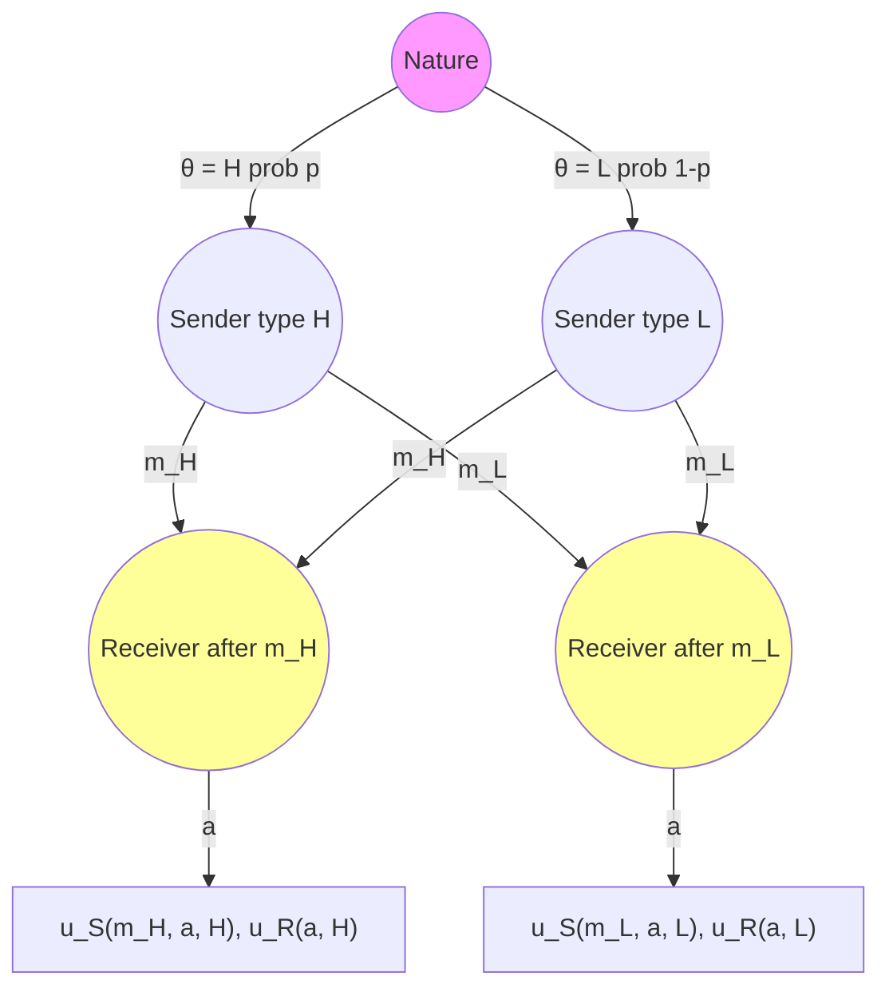

# 📡 Signaling Games

> [!abstract] TL;DR
> A **signaling game** has two players: a **Sender** who observes a private type θ ∈ Θ and sends a message m ∈ M; a **Receiver** who observes m (not θ) and takes an action a ∈ A. Equilibrium concept is **Perfect Bayesian Equilibrium (PBE)**: Sender's strategy σ(m|θ) and Receiver's strategy a(m) plus beliefs μ(θ|m) satisfying (i) sequential rationality — both players best-respond; (ii) Bayesian updating on-path — μ(θ|m) = p(θ)σ(m|θ)/Σθ'p(θ')σ(m|θ') for messages sent in equilibrium. Key equilibrium types: **separating** (different types send different messages — fully revealing), **pooling** (all types send same message — uninformative). **Spence's education model** (1973): education signals ability to employers; separating equilibrium is possible without education being productive. **Cho-Kreps Intuitive Criterion** (1987) refines off-path beliefs to select among multiple PBE.

---

## Intuition — analogy FIRST

A **job interview** is a signaling game. Applicants know their own ability (private type); employers observe only the resume/credentials (message), not ability directly. Education can serve as a signal: if getting a degree is cheap for high-ability types and expensive for low-ability types (differential cost), then in equilibrium only high-ability types get degrees. Employers correctly update: "degree holder = high ability." Education needn't make anyone more productive — it's pure signaling!

This is Spence's insight: **costly signals enable separation of types even without intrinsic value**. The cost structure creates a self-selection mechanism.

---

## How It Works

### Game Structure

**Players**:
- **Sender** (S): observes type θ, chooses message m ∈ M. Payoff: uS(m, a, θ)
- **Receiver** (R): observes message m, chooses action a ∈ A. Payoff: uR(a, θ)

**Receiver's problem**: Infer θ from m to best-respond with action a(m).

### Perfect Bayesian Equilibrium

A **PBE** of a signaling game is (σ, a, μ) where:
- **σ(m|θ)**: Sender's strategy (prob of sending m given type θ)
- **a(m)**: Receiver's optimal action given message m
- **μ(θ|m)**: Receiver's posterior beliefs about Sender's type given m

**Conditions**:

1. **Sender optimality**: ∀θ: σ(m|θ) > 0 ⟹ m ∈ argmax_{m'} uS(m', a(m'), θ)

2. **Receiver optimality**: a(m) ∈ argmax_a Σθ μ(θ|m) · uR(a, θ)

3. **Bayes' rule on-path**: For messages m reached with positive prob:
$$\mu(\theta|m) = \frac{p(\theta)\sigma(m|\theta)}{\sum_{\theta'} p(\theta')\sigma(m|\theta')}$$

4. **Off-path beliefs**: For messages m not sent in equilibrium, μ(θ|m) is unrestricted (but must be a valid probability distribution). This freedom creates multiplicity of PBE.

---

## Key Concepts / Details

### Spence's Education Model (1973)

**Setup**:
- Worker types: H (high ability, fraction q) and L (low ability, fraction 1-q)
- Education level e ∈ ℝ≥0 chosen by worker (costless to produce, costly to acquire)
- Cost of education: cH(e) = e/2 (low cost for H), cL(e) = e (high cost for L)
- Wage = expected productivity: wH = 2, wL = 1
- Worker's payoff: wage − cost of education

**Separating Equilibrium**: H gets education e* ≥ 1, L gets e = 0.

**Incentive Compatibility conditions**:
- H prefers e* over 0: 2 − e*/2 ≥ 1 → e* ≤ 2
- L prefers 0 over e*: 1 ≥ 2 − e* → e* ≥ 1

**Separating equilibria exist for e* ∈ [1, 2]**. Education is purely a signal — it doesn't increase productivity! Workers waste resources on signaling (social cost of signaling).

**Pooling Equilibrium**: Both types get e = 0. Employer pays w = q·2 + (1-q)·1 = 1 + q. H's incentive to deviate: send e = 1 + ε to get wage 2. Profitable if 2 − (1+ε)/2 > 1 + q → ε < 2(1−q)−1 = 1−2q. If q > ½, high types can't profitably deviate — pooling equilibrium exists!

### Equilibrium Types

| Type | Definition | Signal | Revelation | Multiplicity |
|------|-----------|--------|-----------|-------------|
| **Separating** | Different types send different messages | Fully informative | Full | Many possible |
| **Pooling** | All types send same message | Uninformative | None | Many possible |
| **Semi-separating** | Some types mix over messages | Partially informative | Partial | Intermediate |

### Cho-Kreps Intuitive Criterion (1987)

**Problem**: Signaling games have **multiple PBE** (both separating and pooling exist). Off-path beliefs can sustain bad equilibria.

**Intuitive Criterion**: Eliminates PBE where the Receiver has "unreasonable" off-path beliefs.

**Formal statement**: A PBE fails the Intuitive Criterion if there exists an off-path message m and a type θ such that:
1. Type θ would never benefit from sending m, **even if** the Receiver's response to m were maximally favorable to θ (i.e., m is equilibrium-dominated for θ)
2. There exists another type θ' that WOULD benefit from sending m if the Receiver interprets m as coming from type θ'

In such cases, the Receiver should believe m came from θ', not θ. If this leads to a profitable deviation, the original PBE is eliminated.

**Result for Spence model**: Intuitive Criterion selects the **least-costly separating equilibrium** e* = 1 (lowest separating education level). Pooling equilibria (for q < ½) are also eliminated.

**Intuition**: If only high types could possibly benefit from education level e* = 1 (low types definitely don't want it regardless of wage response), then seeing e* = 1 convinces the employer it's a high type.

### Cheap Talk (Crawford-Sobel 1982)

**Cheap talk**: Signals are costless (no education cost). Can truthful communication occur?

**Sender's bias**: If Sender prefers a higher action than Receiver would choose given truth, Sender has incentive to overstate type.

**Result**: Truthful communication impossible if interests are misaligned. But **partial communication** (coarse signals) is possible: Sender partitions types into intervals, sends the same message for each interval. "Babbling equilibrium" (fully uninformative) always exists.

**Partition equilibria**: More types of messages → more partitions → finer communication → closer to efficient. Number of credible messages decreasing in Sender-Receiver preference divergence.

---

## Real-World Notes

- **Financial signaling**: Dividend policy as signal of firm quality (Miller-Modigliani 1961). Dividend cuts signal bad news; firms maintain dividends at cost to signal stability
- **Advertising**: Uninformative advertising (doesn't describe product qualities) signals quality via willingness to spend. High-quality firms can afford to advertise; low-quality firms cannot (Nelson 1974)
- **Health insurance**: Choosing higher-deductible plan signals low health risk (separating equilibrium in insurance markets)
- **Salary negotiation**: First salary offer is a signal. High offers signal high outside option; low offers invite exploitation
- **AI alignment**: AI systems may signal their capabilities/values; principal-agent problem of ensuring AI "truth-tells" about its capabilities

---

## Common Pitfalls

1. **Multiple PBE are common** — Don't stop at finding one PBE; check all types of equilibria (separating, pooling, semi-separating) and apply refinements (Intuitive Criterion, D1).
2. **Off-path beliefs drive results** — In pooling equilibria, off-path beliefs (what employer thinks when seeing e = 1) sustain the equilibrium. Changing off-path beliefs changes the equilibrium.
3. **Education as signal ≠ education is worthless** — Spence's model shows education CAN be pure signaling. This doesn't mean education is never productive in reality.
4. **Separating ≠ unique** — Many separating equilibria exist (different values of e*); Cho-Kreps selects the least wasteful one.

---

## Related Concepts

- [[_MOC_Dynamic_Games|↑ Dynamic Games MOC]]
- [[Subgame_Perfect_Equilibrium|Subgame Perfect Equilibrium]]
- [[../01_Fundamentals/Information_in_Games|Information in Games]]
- [[../05_Mechanism_Design/Revelation_Principle_and_IC|Revelation Principle & IC]]
- [[../04_Cooperative_Games/Bargaining_Theory|Bargaining Theory]]

---

## Review Questions

1. In Spence's model with cH(e) = e/3 and cL(e) = e, find the range of separating equilibria and the Intuitive Criterion selection. What changes if costs are reversed (H has higher cost)?
2. Construct a 2-type signaling game with 2 possible messages and show that there exist BOTH a separating and a pooling PBE. Apply the Intuitive Criterion to select between them.
3. In the Crawford-Sobel cheap-talk model with uniform types on [0,1] and Sender's ideal action = θ + b (bias b > 0), find the partition equilibrium with exactly 2 intervals. For what value of b does truthful signaling (infinite partitions) become impossible?

---

## Sources

- Spence, M. (1973) — "Job Market Signaling," *Quarterly Journal of Economics*
- Cho, I.K. & Kreps, D. (1987) — "Signaling Games and Stable Equilibria," *QJE*
- Crawford & Sobel (1982) — "Strategic Information Transmission," *Econometrica*

#Game_Theory #DynamicGames #SignalingGames
