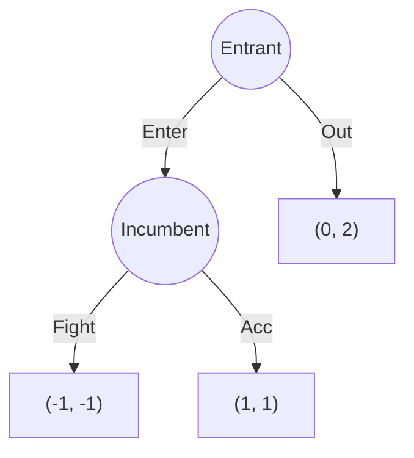

# 🎯 Subgame Perfect Equilibrium

> [!abstract] TL;DR
> A **Subgame Perfect Equilibrium** (SPE, Selten 1965) is a strategy profile that induces a Nash Equilibrium in every proper subgame of the extensive-form game, not just in the game as a whole. SPE eliminates **non-credible threats** by requiring sequential rationality at every decision node. The **one-shot deviation principle** simplifies verification: a strategy profile is SPE iff no player can improve by deviating at a single information set while conforming everywhere else. Key applications: entry deterrence (fight-always is NE but not SPE), Stackelberg competition (leader commits to quantity, follower best-responds — SPE gives leader first-mover advantage), and finite repeated games (SPE = stage-game NE played every period by backward induction).

---

## Intuition — analogy FIRST

A **mob boss threatening a store owner** says: "If you don't pay protection money, I'll burn your store down — even though burning it costs me money too." If the store owner knows the boss is rational, this threat is not credible: once the store owner refuses to pay, the boss faces a choice between expensive arson and doing nothing — and rational choice is doing nothing. The threat has no sting.

SPE formalizes this: a Nash equilibrium that relies on non-credible threats off the equilibrium path is NOT a subgame perfect equilibrium. SPE requires the strategy to specify optimal behavior everywhere — even at "unreached" branches where a non-credible threat would be exposed.

---

## How It Works

### Subgame Definition (Selten 1965)

A **proper subgame** of extensive-form game Γ is a subtree Γ' satisfying:
1. **Starts at a singleton information set**: the root node of Γ' is alone in its information set
2. **Closed under information sets**: if a decision node h is in Γ', then the entire information set containing h is in Γ' (no partial information sets)
3. **Contains all successors**: the entire subtree below the root is in Γ'

**Note**: The entire game is a (trivial) subgame. Non-trivial subgames start at internal nodes.

**Proper subgame count**:
- Entry deterrence game (above): 2 proper subgames (full game + Incumbent's subgame)
- Perfect information game with k decision nodes: k subgames (one rooted at each node)
- Simultaneous-move game: only 1 subgame (the whole game) — no non-trivial subgames!

### Formal Definition

**Definition**: σ* = (σ*₁, …, σ*ₙ) is a **Subgame Perfect Equilibrium** if for every proper subgame Γ', the restriction of σ* to Γ' is a Nash equilibrium of Γ'.

**Implication**: SPE requires Nash equilibrium play in every subgame — including those reached only after hypothetical deviations (off-equilibrium-path subgames).

**Relation to NE**: Every SPE is a NE of the full game. The converse fails — NE can involve non-credible threats that aren't optimal in subgames.

---

### Entry Deterrence: NE vs SPE

**Consider strategy**: Entrant plays "Out"; Incumbent plays "Fight if entry".

**Is this a NE?** Given Incumbent plays "Fight":
- Entrant: Enter → -1, Out → 0. Best: Out. ✓
- Incumbent: given Entrant plays Out, Incumbent's strategy doesn't affect outcome. Both Fight and Accommodate are best responses. ✓
→ **Yes, this is a NE**.

**Is it SPE?** Consider the subgame starting at Incumbent's node:
- Incumbent chooses: Fight (−1) or Accommodate (1). Best: Accommodate.
- Restriction to this subgame: Incumbent plays "Fight" ≠ NE of subgame.
→ **Not SPE**. "Fight-always" is not sequentially rational.

**SPE**: Entrant plays "Enter"; Incumbent plays "Accommodate". Both strategies are optimal in their respective subgames.

---

## Key Concepts / Details

### One-Shot Deviation Principle

**Theorem**: A strategy profile σ* is SPE if and only if no player can profitably deviate at a **single** information set, holding all other strategies (including their own at other information sets) fixed.

**Why this works**: Deviations that benefit must benefit at the first deviating node — multi-step deviations can be decomposed into a sequence of single deviations. If no single deviation helps, no multi-step deviation can either.

**Verification algorithm**:
1. For each player i and each information set Iᵢ:
2. Compute what player i would gain by deviating at Iᵢ (holding σ*₋ᵢ and σ*ᵢ at all other info sets fixed)
3. If no profitable single deviation exists → SPE

This transforms SPE verification into a local check at each information set.

### Finite Horizon: SPE = Stage-Game NE

**Theorem**: In a finitely repeated game where the stage game has a unique NE, the unique SPE involves playing the stage-game NE in every period.

**Proof** (backward induction): In the last period T, there are no future periods to influence — the unique NE must be played (by backward induction in the last-period subgame). Knowing period T is fixed, period T−1's subgame is also just the stage game → NE. Continue backwards. □

**Implication**: Cooperation cannot be supported by SPE in a finitely repeated Prisoner's Dilemma! The backward induction unraveling prevents it. Infinitely repeated games escape this via the Folk Theorem (see [[Repeated_Games_and_Folk_Theorems|Repeated Games]]).

### Stackelberg Competition as SPE

**Setup**: P1 (leader) commits to quantity q₁, then P2 (follower) observes q₁ and best-responds with q₂(q₁). Market price P = 1 − q₁ − q₂, cost = 0.

**SPE by backward induction**:

Step 1 (P2's subgame given q₁): max_{q₂} (1 − q₁ − q₂)q₂. FOC: 1 − q₁ − 2q₂ = 0 → q₂*(q₁) = (1 − q₁)/2

Step 2 (P1 anticipates P2's response): max_{q₁} (1 − q₁ − q₂*(q₁))q₁ = (1 − q₁ − (1−q₁)/2)q₁ = (1−q₁)/2 · q₁. FOC: (1−2q₁)/2 = 0 → **q₁* = 1/2**

P2 responds: q₂*(1/2) = (1 − 1/2)/2 = **1/4**. Profits: π₁ = (1−1/2−1/4)·1/2 = **1/8**; π₂ = 1/16.

Cournot NE (simultaneous): q₁ = q₂ = 1/3, profits = 1/9 each. Leader earns **1/8 > 1/9** — first-mover advantage!

### Sequential Equilibrium (Kreps-Wilson 1982)

For games with imperfect information (non-singleton info sets), SPE isn't defined via backward induction. **Sequential equilibrium** extends SPE by requiring:
1. **Behavioral strategy profile** σ is a NE in every continuation game
2. **Beliefs** μ (at each info set, a probability over nodes) satisfy **Bayes' rule on-path** and are "reasonable" off-path

Sequential equilibrium ⊂ SPE (for games where SPE is defined) but more general for imperfect information.

---

## Real-World Notes

- **Business strategy**: Credible commitment (Dixit 1980) — investing in capacity before competition occurs converts a non-credible threat (produce more if entry occurs) into a credible one (capacity is sunk → optimal to use it)
- **Labor relations**: Wage negotiations — firm's threat to "fire striking workers" must be credible. If firing is costly, the threat may not be SPE
- **Monetary policy**: Central bank's threat to maintain inflation target — time inconsistency problem (Kydland-Prescott 1977): after the private sector forms expectations, it's subgame-optimal to deviate → commitment devices needed
- **AI agents**: Automated negotiation agents (auctions, resource allocation) must commit to SPE strategies; non-credible threats can be exploited by sophisticated counterparts

---

## Common Pitfalls

1. **SPE requires subgames to be well-defined**: In games with imperfect information, few non-trivial subgames may exist. SPE has little bite → need sequential equilibrium.
2. **"Fight-always" is a NE but not SPE**: This is the canonical example. Always double-check that the NE strategies are sequentially rational in all subgames.
3. **One-shot deviation principle is a simplification tool**: Don't check all possible multi-step deviations — the principle guarantees single-step checking is sufficient.
4. **Finite repetition unraveling**: Finite repetition of a unique-NE stage game always yields stage-game NE play in SPE. Cooperation in finite games requires multiple stage-game NE (then reward/punishment can be implemented).

---

## Related Concepts

- [[_MOC_Dynamic_Games|↑ Dynamic Games MOC]]
- [[Backward_Induction|Backward Induction]]
- [[Extensive_Form_and_Game_Trees|Extensive Form & Game Trees]]
- [[Repeated_Games_and_Folk_Theorems|Repeated Games & Folk Theorems]]
- [[Signaling_Games|Signaling Games]]
- [[../02_Static_Games/Nash_Equilibrium|Nash Equilibrium]]

---

## Review Questions

1. In the 3-stage game: P1 chooses Enter/Out → if Enter, P2 chooses Fight/Accommodate → if Accommodate, P1 chooses Stay/Expand. Find all NE and identify which are SPE.
2. Prove the one-shot deviation principle formally for a finite perfect-information game. (Hint: Use induction on the length of the strategy deviation from σ*.)
3. In Stackelberg competition with asymmetric costs (P1 cost c₁, P2 cost c₂), find the SPE. For what values of c₁, c₂ does the leader prefer to commit rather than play the Cournot NE?

---

## Sources

- Selten, R. (1965) — "Spieltheoretische Behandlung eines Oligopolmodells mit Nachfrageträgheit"
- Kreps, D. & Wilson, R. (1982) — "Sequential Equilibria," *Econometrica*
- Fudenberg & Tirole — *Game Theory*, Ch. 3–4

#Game_Theory #DynamicGames #SubgamePerfectEquilibrium
