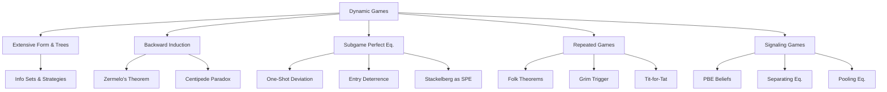

# ⏱️ Dynamic Games — Section MOC

> [!abstract] Section Overview
> Dynamic games add time: players move sequentially, observe (some of) what came before, and choose strategies that are contingent on history. Backward induction and subgame perfect equilibrium refine Nash equilibrium to eliminate non-credible threats. Repeated games show how cooperation can emerge from self-interest with patience. Signaling games model strategic information transmission.

---

## Concept Map



---

## Notes in This Section

| Note | Core Idea | Difficulty |
|------|-----------|-----------|
| [[Extensive_Form_and_Game_Trees\|Extensive Form & Game Trees]] | Decision/chance/terminal nodes; info sets; strategies; Kuhn's theorem | Intermediate |
| [[Backward_Induction\|Backward Induction]] | Solve from terminal up; Zermelo; centipede paradox; dynamic consistency | Intermediate |
| [[Subgame_Perfect_Equilibrium\|Subgame Perfect Equilibrium]] | SPE = NE in every subgame; one-shot deviation; entry deterrence | Intermediate |
| [[Repeated_Games_and_Folk_Theorems\|Repeated Games & Folk Theorems]] | Grim trigger; Folk theorem; discount factor; cooperation conditions | Intermediate–Advanced |
| [[Signaling_Games\|Signaling Games]] | Sender-receiver; PBE; separating/pooling; Spence education; Cho-Kreps | Advanced |

---

## Learning Path

```
Extensive_Form_and_Game_Trees → Backward_Induction → Subgame_Perfect_Equilibrium → Repeated_Games_and_Folk_Theorems → Signaling_Games
```

## Key Questions

1. Why does backward induction give a unique solution for finite perfect-info games but not for imperfect-info games?
2. What makes a threat "non-credible" and how does SPE eliminate it?
3. For what discount factor δ does grim-trigger support cooperation in PD?
4. What is the difference between a separating and pooling equilibrium in signaling?

---

## Related Sections

- [[_MOC_Game_Theory_Master|↑ Master MOC]]
- [[../02_Static_Games/_MOC_Static_Games|← Static Games]]
- [[../04_Cooperative_Games/_MOC_Cooperative_Games|→ Cooperative Games]]

#Game_Theory #DynamicGames #MOC
