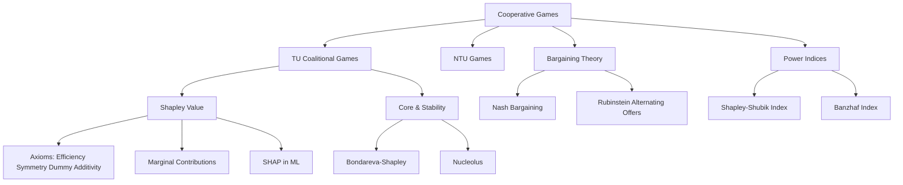

# 🤝 Cooperative Games — Section MOC

> [!abstract] Section Overview
> Cooperative game theory analyzes situations where binding agreements are possible. Instead of asking "which strategy equilibrium emerges," it asks "which payoff allocations are stable, fair, or rational?" The characteristic function v: 2ᴺ → ℝ summarizes what each coalition can achieve. Key solution concepts: Shapley value (unique fair allocation), Core (stable allocations no coalition wants to block), Nash/Rubinstein bargaining (two-player surplus splitting), and power indices (measuring voter influence).

---

## Concept Map



---

## Notes in This Section

| Note | Core Idea | Difficulty |
|------|-----------|-----------|
| [[Coalitional_Games_and_Shapley_Value\|Coalitional Games & Shapley Value]] | Characteristic function; φᵢ = Σ marginal contributions; axioms; SHAP | Intermediate |
| [[Core_and_Stability\|Core & Stability]] | Core = no blocking coalition; Bondareva-Shapley; nucleolus | Intermediate |
| [[Bargaining_Theory\|Bargaining Theory]] | Nash bargaining; Kalai-Smorodinsky; Rubinstein alternating offers | Intermediate–Advanced |
| [[Power_Indices\|Power Indices]] | Shapley-Shubik vs Banzhaf; voting games; weight ≠ power | Intermediate |

---

## Learning Path

```
Coalitional_Games_and_Shapley_Value → Core_and_Stability → Bargaining_Theory → Power_Indices
```

## Key Questions

1. Why is the Shapley value the unique allocation satisfying four axioms?
2. When is the core non-empty? What does Bondareva-Shapley say?
3. What is the strategic foundation for Nash bargaining?
4. How can Shapley-Shubik and Banzhaf indices rank voters differently?

---

## Related Sections

- [[_MOC_Game_Theory_Master|↑ Master MOC]]
- [[../03_Dynamic_Games/_MOC_Dynamic_Games|← Dynamic Games]]
- [[../05_Mechanism_Design/_MOC_Mechanism_Design|→ Mechanism Design]]

#Game_Theory #CooperativeGames #MOC
