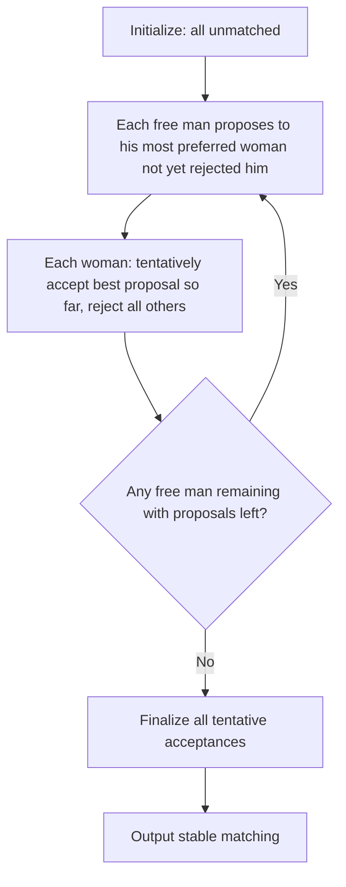

# 💍 Matching Markets

> [!abstract] TL;DR
> **Matching markets** pair agents (students–schools, residents–hospitals, men–women) without prices. A **stable matching** has no **blocking pair** (a pair who both prefer each other to their current match). **Gale-Shapley deferred acceptance** (DA, 1962) produces a stable matching: proposers make offers in descending preference order, receivers tentatively accept best offer and reject others, rejected proposers try next choice. DA is **proposer-optimal** (best stable matching for proposers) and **strategy-proof for proposers** (truthful preference revelation is dominant) — but receivers can manipulate. **Rural Hospitals Theorem**: every hospital appears in every stable matching; total matches constant across stable matchings. **Roth-Peranson** (1999) extended DA for the US NRMP (medical residency match). **Kidney exchange** (Roth et al.) uses matching with cycles to enable incompatible donor pairs.

---

## Intuition — analogy FIRST

**Medical school graduates choosing hospitals** for residency: each doctor has preferences over hospitals, and each hospital has preferences over doctors. A "market clearing" where doctor Alice is matched to Hospital B even though she'd prefer Hospital A (which would also prefer Alice over its current resident) is **unstable** — Alice and Hospital A have mutual incentive to defect from the assignment.

A **stable matching** eliminates such blocking pairs. Deferred acceptance works like speed dating with memory: doctors propose to their most preferred hospitals; hospitals tentatively hold the best applicant, rejecting others. Rejected doctors propose to their next choice. Continue until no one is rejected. The resulting matching is stable.

---

## How It Works

### The Stable Matching Problem

**Setup** (one-to-one bipartite): Two disjoint sets M (men/proposers) and W (women/receivers) of equal size n. Each agent has a strict preference ordering over agents on the other side (complete and transitive).

**Matching**: A bijection μ: M → W.

**Blocking pair**: (m, w) block matching μ if:
- m prefers w to μ(m): w ≻_m μ(m)
- w prefers m to μ(w): m ≻_w μ(w)

**Stable matching**: A matching with no blocking pair.

**Claim**: Stable matchings always exist (for finite markets with complete preferences).

---

### Gale-Shapley Algorithm (Deferred Acceptance)

**Man-proposing DA**:

**Termination**: After ≤ n² proposals total (each man proposes to each woman at most once).

**Correctness**: The output is stable.

**Proof of stability**: Suppose (m, w) is a blocking pair in output μ.
- m prefers w to μ(m): m proposed to w before μ(m) (m proposes in decreasing preference order).
- If w rejected m during DA: w had a better proposal at that time. Since DA only upgrades proposals, w's final match μ(w) ≻_w m. Contradiction with w preferring m.
- If w never rejected m: m is matched to w → μ(m) = w. Contradiction.
→ No blocking pair. □

---

## Key Concepts / Details

### Worked Example (3 × 3)

Preferences:
- m₁: w₁ ≻ w₂ ≻ w₃
- m₂: w₁ ≻ w₃ ≻ w₂
- m₃: w₂ ≻ w₁ ≻ w₃

- w₁: m₂ ≻ m₁ ≻ m₃
- w₂: m₁ ≻ m₂ ≻ m₃
- w₃: m₁ ≻ m₂ ≻ m₃

**Round 1**: m₁→w₁, m₂→w₁, m₃→w₂. w₁ holds m₂ (prefers m₂ over m₁), rejects m₁. w₂ holds m₃.

**Round 2**: m₁ (rejected from w₁) proposes to w₂. w₂ prefers m₁ over m₃, holds m₁, rejects m₃.

**Round 3**: m₃ proposes to w₁ (next after w₂). w₁ holds m₂ (prefers m₂ over m₃), rejects m₃.

**Round 4**: m₃ proposes to w₃ (last choice). w₃ holds m₃.

**Final matching**: μ = {(m₁,w₂), (m₂,w₁), (m₃,w₃)}.

### Proposer-Optimal Property

**Theorem**: Man-proposing DA produces the **man-optimal stable matching**: every man is matched to his best partner across all stable matchings.

Equivalently, every woman is matched to her worst stable partner (woman-pessimal).

**Proof sketch**: Suppose some man m is matched to w in man-optimal stable matching μ*, but μ*(m) ≻_m w. By contradiction: if w were the best any stable matching can offer m, DA must match m to w. ... (inductive argument on rounds of proposals).

**Woman-proposing DA** produces the **woman-optimal** (man-pessimal) matching. The two stable matchings bound the "lattice" of stable matchings.

### Strategy-Proofness

**Theorem (Dubins-Freedman 1981, Roth 1982)**: Man-proposing DA is **strategy-proof for men**: truthful preference revelation is a weakly dominant strategy for every man.

**Proof intuition**: Submitting a truncated or permuted preference list can only make a man propose to "better" options earlier — but this may cause him to be rejected (women correctly assess lower demand), leading to a worse match. True preferences dominate.

**Women can manipulate**: There exist preference profiles where a woman benefits by misreporting. Example: w₂ in the above example could list m₂ first to get a better match under woman-proposing DA.

**Impossibility**: No stable matching mechanism is strategy-proof for both sides simultaneously (Roth 1982).

### Rural Hospitals Theorem

**Theorem**: In any hospital-doctor matching with multi-capacity hospitals:
1. The set of **unmatched doctors** is the same across all stable matchings
2. Each hospital is matched to the **same number of doctors** across all stable matchings
3. Any hospital with unfilled positions in one stable matching has the same set of doctors in every stable matching (rural hospitals always lose)

**Policy implication**: The "rural hospital problem" — rural hospitals struggle to recruit — cannot be solved by changing the matching algorithm. The problem is structural (doctors prefer urban hospitals).

### The NRMP (National Residency Matching Program)

**History**: US medical residency matching has existed since 1952. Roth (1984) discovered it is equivalent to the man-proposing DA. Roth & Peranson (1999) redesigned NRMP to handle:
- Couples (must be matched to same city)
- Multi-position hospitals
- Preferences over programs, not just hospitals

**Scale**: ~40,000 applicants, ~30,000 positions annually. Algorithm runs in seconds.

**Game-theory achievement**: Al Roth won the 2012 Nobel Prize in Economics for redesigning NRMP and other matching markets.

### Kidney Exchange (Roth et al. 2004)

**Problem**: Incompatible donor-recipient pairs (patient needs kidney, their willing donor is incompatible blood-type/tissue). Direct exchange impossible.

**Solution**: **Cycle matching**: if pair A's donor can give to B's patient, and B's donor can give to A's patient, a 2-way exchange is possible. Larger cycles: 3-way, 4-way exchanges enable more matches.

**Algorithm**: Find maximum-weight cycle cover in the compatibility graph — NP-hard in general, but tractable for small cycle lengths (practical constraint: 3-way swaps maximum, as they must happen simultaneously to prevent reneging).

**Impact**: New England Program for Kidney Exchange and national programs have facilitated thousands of transplants.

---

## Real-World Notes

- **College admissions**: Stable matching in school choice (Boston, Chicago public schools used DA after game-theorists redesigned systems; NYC high school matching)
- **Uber/Lyft driver-rider matching**: One-sided platform matching; weighted matching for surge pricing
- **Dating apps**: Tinder/Hinge use algorithmic matching but without stability guarantees (users can swipe right/left independently — decentralized)
- **Job markets**: Economics PhD job market uses informal DA-like process; central platforms (JOE) facilitate. Law school clerkships have matching problems due to decentralized offers
- **Radio spectrum allocation**: Matching broadcasters to channels; 2016 FCC incentive auction used two-sided matching logic

---

## Common Pitfalls

1. **DA strategy-proof for proposers, not receivers**: Many students think DA is strategy-proof for both sides. It's only for the proposing side. Receivers can strategically manipulate their reported preferences.
2. **Rural hospitals theorem means the algorithm can't fix structural problems**: If rural hospitals are unpopular, no matching algorithm creates more matches for them — only attracting better candidates can.
3. **Stability ≠ efficiency**: A stable matching may not maximize total welfare. The "welfare-maximizing" matching might be unstable (a blocking pair exists). Efficiency vs. stability is a fundamental tension.
4. **Large cycle kidney exchange is hard**: 3-way exchanges are practically feasible; longer cycles (4+) require simultaneous surgery coordination that's logistically infeasible — algorithm must impose cycle length constraints.

---

## Related Concepts

- [[_MOC_Mechanism_Design|↑ Mechanism Design MOC]]
- [[Revelation_Principle_and_IC|Revelation Principle & IC]]
- [[VCG_Mechanism|VCG Mechanism]]
- [[../04_Cooperative_Games/Core_and_Stability|Core & Stability]]

---

## Review Questions

1. Run man-proposing DA on the following preferences: m₁: w₂≻w₁≻w₃, m₂: w₁≻w₂≻w₃, m₃: w₃≻w₁≻w₂; w₁: m₁≻m₂≻m₃, w₂: m₃≻m₁≻m₂, w₃: m₂≻m₁≻m₃. Find all stable matchings.
2. Construct a 2×2 matching market where a woman can improve her outcome by misreporting preferences to the man-proposing DA. Describe her manipulation strategy.
3. Suppose hospital H has 2 positions and preference ranking d₁≻d₂≻d₃ over doctors. Doctors d₁,d₂,d₃ each rank H first. Apply the hospital-proposing DA and verify that H gets exactly 2 doctors in every stable matching (Rural Hospitals Theorem).

---

## Sources

- Gale, D. & Shapley, L.S. (1962) — "College Admissions and the Stability of Marriage," *American Mathematical Monthly*
- Roth, A.E. (1984) — "The Evolution of the Labor Market for Medical Interns and Residents," *JPE*
- Roth, A.E. & Peranson, E. (1999) — "The Redesign of the Matching Market for American Physicians," *AER*
- Roth et al. (2004) — "Kidney Exchange," *Quarterly Journal of Economics*

#Game_Theory #MechanismDesign #MatchingMarkets
