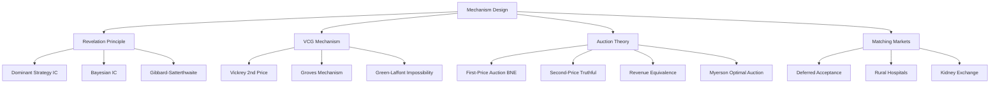

# ⚙️ Mechanism Design — Section MOC

> [!abstract] Section Overview
> Mechanism design is "reverse game theory": instead of analyzing given games, we design the rules of the game to achieve desired outcomes. The central challenge is extracting private information (types) and aligning incentives (incentive compatibility). Key results: revelation principle (direct mechanisms suffice), VCG (efficient and DSIC), auction theory (optimal mechanisms, revenue equivalence), and matching markets (stable matchings via Gale-Shapley).

---

## Concept Map



---

## Notes in This Section

| Note | Core Idea | Difficulty |
|------|-----------|-----------|
| [[Revelation_Principle_and_IC\|Revelation Principle & IC]] | Direct mechanisms; DSIC; G-S impossibility; single-peaked escape | Advanced |
| [[VCG_Mechanism\|VCG Mechanism]] | Groves payment; efficiency + DSIC; Green-Laffont impossibility | Advanced |
| [[Auction_Theory\|Auction Theory]] | First/second price BNE; Revenue Equivalence; Myerson optimal; winner's curse | Advanced |
| [[Matching_Markets\|Matching Markets]] | Gale-Shapley DA; stability; strategy-proofness; NRMP | Intermediate–Advanced |

---

## Learning Path

```
Revelation_Principle_and_IC → VCG_Mechanism → Auction_Theory → Matching_Markets
```

## Key Questions

1. Why does the revelation principle reduce mechanism design to direct mechanisms?
2. Why can't VCG be simultaneously efficient, DSIC, and budget-balanced?
3. In first-price auctions, what is the BNE bid shading formula for n bidders with uniform values?
4. Why is deferred acceptance strategy-proof only for the proposing side?

---

## Related Sections

- [[_MOC_Game_Theory_Master|↑ Master MOC]]
- [[../04_Cooperative_Games/_MOC_Cooperative_Games|← Cooperative Games]]
- [[../06_Evolutionary_Computational/_MOC_Evolutionary_Computational|→ Evolutionary & Computational]]

#Game_Theory #MechanismDesign #MOC
