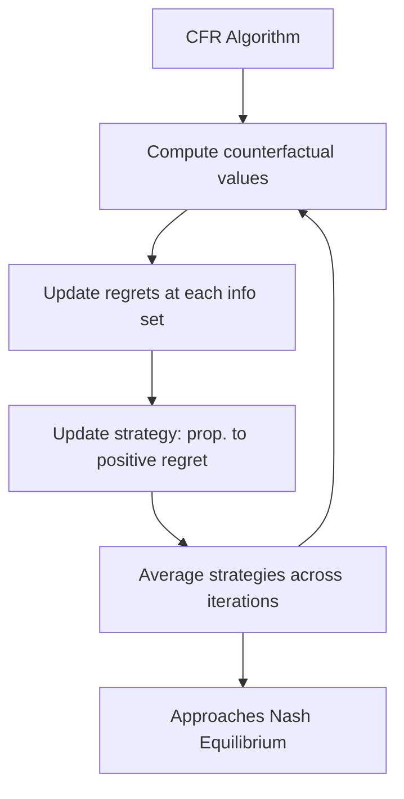

# 💻 Algorithmic Game Theory

> [!abstract] TL;DR
> **Algorithmic Game Theory** (AGT) studies the computational complexity of equilibria and the design of algorithms that learn to play equilibrium strategies. Nash equilibrium computation is **PPAD-complete** (Daskalakis-Goldberg-Papadimitriou 2009) — no polynomial algorithm unless PPAD = P; but 2-player zero-sum NE is solvable by LP in poly-time. **Correlated equilibrium** is computable by LP in poly-time. **No-regret learning** algorithms (MWU, Hedge, Follow-the-Regularized-Leader) converge to correlated equilibria at rate O(1/√T). **Counterfactual Regret Minimization (CFR)** solves large imperfect-information games (poker); it's the algorithm behind Libratus and Pluribus. Agent-based modeling (Mesa) simulates heterogeneous boundedly-rational agents.

---

## Intuition — analogy FIRST

Finding a Nash equilibrium is like asking "where do two crossed beams intersect?" in a dark room — you know it exists (Nash's theorem), but finding it without seeing the room is computationally hard. For zero-sum games, it's like solving a crossword — structured enough for polynomial algorithms (LP). For general-sum games, it's in PPAD — a complexity class that captures "search problems where a solution is guaranteed to exist but may be hard to find."

**No-regret learning** takes a different tack: instead of solving for the equilibrium directly, algorithms learn it by playing repeatedly and updating strategies based on observed payoffs. Like a robot learning to play poker by playing millions of hands — it doesn't "know" game theory, but its play converges to equilibrium behavior.

---

## How It Works

### Complexity of Nash Equilibrium

**PPAD (Polynomial Parity Argument on Directed graphs)**: A complexity class capturing search problems where every solution has a predecessor, implying at least one solution exists.

**Key results**:

| Problem | Complexity |
|---------|-----------|
| 2-player zero-sum NE | P (LP duality) |
| 2-player general-sum NE | PPAD-complete |
| n-player NE (n≥2) | PPAD-complete |
| Correlated equilibrium | P (LP) |
| Coarse correlated equilibrium | P (no-regret learning) |
| Approximate NE (ε-NE) | P for constant ε (Lipton-Markakis-Mehta) |

**PPAD-completeness** means: unless PPAD = P (widely believed false), no polynomial-time algorithm can find a NE in general 2-player games. This is a formal hardness result — computing NE is "hard" in a precise sense.

**Lemke-Howson algorithm** (1964): Finds a NE in finite time but worst-case exponential. In practice, runs fast on random instances.

---

### Two-Player Zero-Sum: LP Formulation

For zero-sum game with m×n payoff matrix A:

**P1's maximin LP**:
$$\max_{x \geq 0, v} v \quad \text{s.t.} \quad (A^\top x)_j \geq v \; \forall j \in [n], \quad \mathbf{1}^\top x = 1$$

**P2's minimax LP** (dual):
$$\min_{y \geq 0, w} w \quad \text{s.t.} \quad (Ay)_i \leq w \; \forall i \in [m], \quad \mathbf{1}^\top y = 1$$

Solving either LP (poly-time via interior point or simplex) gives the NE and game value.

**Computational complexity**: O((m+n)^3.5 L) for interior point methods where L = bit complexity of A.

---

## Key Concepts / Details

### No-Regret Learning

**External regret**: Difference between player i's average payoff and the best fixed strategy in hindsight:
$$R_i^T = \frac{1}{T}\max_{s_i \in S_i} \sum_{t=1}^{T} u_i(s_i, s_{-i}^t) - \frac{1}{T}\sum_{t=1}^{T} u_i(s_i^t, s_{-i}^t)$$

**No-regret**: Algorithm that ensures Rᵢᵀ → 0 as T → ∞. Regret rate O(1/√T) achievable.

**Multiplicative Weights Update (MWU / Hedge)**:

Initialize: σᵢ⁰ = uniform over Sᵢ.
At each round t:
1. Observe payoff vector u^t (rewards for each strategy)
2. Update: σᵢᵗ⁺¹(s) ∝ σᵢᵗ(s) · exp(η · uᵢᵗ(s))

Learning rate η = O(1/√T) guarantees O(√T log|Sᵢ|) total regret.

**Convergence theorem**: If all players use MWU with η = O(1/√T), the empirical distribution (¹/ₜΣₜσᵢᵗ) converges to a coarse correlated equilibrium.

**Swap regret minimization**: Replace external regret with swap regret (could I have improved by consistently swapping s→s' in every round?). No-swap-regret algorithms → convergence to correlated equilibrium.

### Follow-the-Regularized-Leader (FTRL)

General framework: At round t, play strategy:
$$\sigma_i^t = \arg\max_{\sigma \in \Delta(S_i)} \left[\sum_{\tau < t} u_i(\sigma, \sigma_{-i}^\tau) - R(\sigma) \right]$$

where R(σ) is a regularizer (e.g., negative entropy → MWU; ℓ₂ norm → gradient descent).

**Regret bounds**: FTRL with strongly convex regularizer achieves O(log T) regret in online strongly convex games.

### Counterfactual Regret Minimization (CFR)

**Imperfect information games** (e.g., poker): Cannot directly apply MWU at the full strategy level (exponentially many strategies). CFR works at the **information set** level.

**Counterfactual value** of action a at information set I: Expected payoff to player i if they reach I and play a, under the counterfactual assumption that they tried to reach I (even if their actual strategy wouldn't).

**CFR algorithm**:
1. At each information set I, maintain a regret vector for each action a
2. Update strategy proportional to positive regret (only positive regrets determine mixing)
3. At the end, average strategies over all iterations (NOT the final strategy)

**Convergence**: CFR achieves O(1/√T) convergence to NE in zero-sum games. Poker-specific variants (CFR+, DCFR) converge faster.

**Poker AI applications**:
- **Libratus** (2017, CMU): Beat 4 professional poker players in Heads-Up No-Limit Texas Hold'Em
- **Pluribus** (2019, CMU+Facebook): Beat 6-player poker professionals — first superhuman multi-player poker AI
- Both use variants of CFR for the core equilibrium computation



### Agent-Based Modeling (Mesa)

**Agent-based modeling (ABM)**: Simulate populations of heterogeneous, boundedly-rational agents following simple local rules. Emergent behavior studied at the population level.

**Mesa** (Python): Open-source ABM framework.

```python
from mesa import Agent, Model
from mesa.time import RandomActivation

class GameAgent(Agent):
    def __init__(self, unique_id, model, strategy='cooperate'):
        super().__init__(unique_id, model)
        self.strategy = strategy
        self.score = 0
    
    def step(self):
        neighbors = self.model.grid.get_neighbors(
            self.pos, moore=True, include_center=False
        )
        # Play Prisoner's Dilemma with each neighbor
        for neighbor in neighbors:
            if self.strategy == 'cooperate' and neighbor.strategy == 'cooperate':
                self.score += 3
            elif self.strategy == 'defect' and neighbor.strategy == 'cooperate':
                self.score += 5
            # ... etc
        # Imitate highest-scoring neighbor (replicator-like dynamics)
        if neighbors:
            best_neighbor = max(neighbors, key=lambda n: n.score)
            if best_neighbor.score > self.score:
                self.strategy = best_neighbor.strategy
```

**Axelrod (1984) tournaments**: Computer tournament of strategies for repeated PD. Tit-for-Tat won both rounds. ABM reproduces this and extends to spatial games on lattices.

**Spatial games**: Cooperation can evolve in spatial settings where cooperators cluster and resist invasion better than in well-mixed populations. Key insight: spatial structure changes equilibrium predictions from standard GT.

### Congestion Games = Potential Games

**Rosenthal's theorem (1973)**: Every congestion game has a pure strategy Nash equilibrium. Proof: the potential function Φ(s) = Σₑ Σₖ₌₁^{fₑ(s)} cₑ(k) is an exact potential.

**Computing NE in potential games**: Follow the potential improvement path from any starting profile; must terminate at a local maximum of Φ (pure NE). This is the constructive proof of NE existence.

**Best-response dynamics in potential games**: Monotone in Φ → converges to pure NE (finite termination, no cycles).

---

## Real-World Notes

- **Multi-agent RL training**: Policy gradient methods (REINFORCE, PPO, SAC) are approximately replicator dynamics. Multi-agent training via self-play converges to approximate NE for zero-sum games (AlphaZero, OpenAI Five)
- **Ad auction design**: Google/Facebook run billions of auctions daily; algorithmic AGT ensures mechanisms run in microseconds while maintaining approximate IC
- **Load balancing in data centers**: Servers assigned tasks by distributed algorithms that converge to NE of load-balancing game; no-regret dynamics guarantee low latency
- **Blockchain consensus**: Proof-of-Work mining is a congestion game; PPAD-hard NE computation isn't relevant (miners use simple greedy heuristics), but PoA analysis reveals efficiency loss from selfish mining
- **AI safety**: Multi-agent debate (Irving et al.) uses game-theoretic learning to produce safer AI outputs by having AIs argue against each other

---

## Common Pitfalls

1. **PPAD-hard ≠ no solution**: PPAD-complete means no poly-time EXACT algorithm (under standard assumptions). Approximation, special structure (zero-sum, potential games), or learning algorithms can still find approximate or exact NE efficiently.
2. **No-regret → CCE, not NE**: Without swap-regret minimization, MWU converges to CCE, not CE or NE. Different notions of regret → different equilibrium concepts.
3. **CFR averages strategies**: The CURRENT strategy in CFR may not be near NE; only the TIME-AVERAGE converges. Using the current strategy for deployment is a mistake.
4. **ABM ≠ equilibrium analysis**: ABM simulation shows what dynamics produce given initial conditions and rules. It doesn't guarantee convergence to NE or ESS — that requires additional analysis.

---

## Related Concepts

- [[_MOC_Evolutionary_Computational|↑ Evolutionary & Computational MOC]]
- [[Price_of_Anarchy|Price of Anarchy]]
- [[Replicator_Dynamics|Replicator Dynamics]]
- [[../02_Static_Games/Correlated_Equilibrium|Correlated Equilibrium]]
- [[../02_Static_Games/Nash_Equilibrium|Nash Equilibrium]]
- [[../02_Static_Games/Minimax_Theorem|Minimax Theorem]]

---

## Review Questions

1. Implement MWU for a 3×3 zero-sum game (rock-paper-scissors) with 1000 rounds. Plot the empirical distribution over rounds and show convergence to the uniform NE. What is the final external regret?
2. Explain why computing a Nash equilibrium of a 2-player general-sum game is PPAD-complete. What property of PPAD captures the "existence without efficient computation" aspect, and how does Nash's fixed-point theorem relate?
3. Describe how CFR could be modified to handle risk-sensitive poker strategies (where the agent is risk-averse and wants to minimize variance in outcomes, not just maximize expected value). What part of the CFR algorithm would need to change?

---

## Sources

- Daskalakis, C., Goldberg, P. & Papadimitriou, C. (2009) — "The Complexity of Computing a Nash Equilibrium," *SIAM J. Computing*
- Freund, Y. & Schapire, R. (1997) — "A Decision-Theoretic Generalization of On-Line Learning," *JCSS*
- Zinkevich et al. (2007) — "Regret Minimization in Games with Incomplete Information" (CFR paper)
- Brown & Sandholm (2019) — "Superhuman AI for Multiplayer Poker" (Pluribus)
- Axelrod, R. (1984) — *The Evolution of Cooperation*

#Game_Theory #EvolutionaryComputational #AlgorithmicGameTheory
