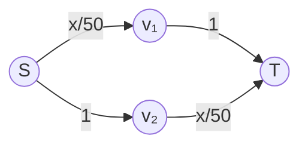

# 🚗 Price of Anarchy

> [!abstract] TL;DR
> The **Price of Anarchy** (PoA) measures the efficiency loss from selfish behavior: PoA = worst NE cost / optimal cost. **Price of Stability** (PoS) = best NE / optimal. For **routing/congestion games** with affine latency functions ℓₑ(fₑ) = aₑfₑ + bₑ, Roughgarden-Tardos (2002) proved PoA = 4/3. The **Braess paradox**: adding a zero-latency road can increase equilibrium travel time for all — network design must account for selfish routing. **Roughgarden's smoothness framework** (2009): a game is (λ,μ)-smooth if Σᵢ uᵢ(sᵢ*, s₋ᵢ) ≥ λ·OPT − μ·C(s), then PoA ≤ λ/(1−μ). Smoothness extends PoA bounds to correlated and coarse-correlated equilibria — "no-regret PoA" is bounded by the same constant.

---

## Intuition — analogy FIRST

**Morning commute**: Each driver independently chooses the fastest route to work, ignoring the congestion they cause to others (a negative externality). At Nash equilibrium, all routes have equal travel time (Wardrop condition) — if one were faster, drivers would switch to it. But the selfish equilibrium may be much slower than a centrally coordinated routing (e.g., traffic control, HOV lanes).

The **Price of Anarchy** quantifies how much selfish routing hurts: if the centrally coordinated optimum has average travel time 30 min, but selfish routing creates 40 min average, PoA = 40/30 = 4/3.

The famous **Braess paradox** shows that adding a road can make every driver worse off — the selfish routing completely changes when the new road is available, and the new equilibrium is worse than the old one.

---

## How It Works

### Congestion/Routing Games

**Setup**:
- Directed graph G = (V, E)
- n players (drivers), each with origin-destination pair (sᵢ, tᵢ)
- Each player chooses a path Pᵢ from sᵢ to tᵢ
- Edge e has **latency function** ℓₑ(fₑ) — nondecreasing, where fₑ = total flow on edge e
- Player i's cost = sum of edge latencies on their path Pᵢ
- **Social cost** = Σᵢ (player i's cost) = Σₑ fₑ · ℓₑ(fₑ)

**Wardrop equilibrium** (continuous flow version): Flow distribution f is at equilibrium if no infinitesimal player can unilaterally reduce their travel time. Equivalent to Nash equilibrium for infinitesimal players.

**Existence**: Every routing game with convex, nondecreasing latency functions has a Nash equilibrium (potential function argument — Rosenthal 1973).

### Braess Paradox

**Original network**: Two paths from s to t.
- Path 1: s →(latency x/50)→ v₁ →(latency 1)→ t
- Path 2: s →(latency 1)→ v₂ →(latency x/50)→ t

100 players. At equilibrium: x = 50 on each path. Latency of each path = 50/50 + 1 = **2 hours**.

**Add a zero-latency shortcut** v₁ → v₂:

New equilibrium: All 100 players use S→v₁→v₂→T (latency 100/50 + 0 + 100/50 = **4 hours**). No one gains by switching: taking original paths gives latency 100/50 + 1 = 3 (better!) — wait, that means the equilibrium shifts.

Actually with the shortcut: equilibrium has all players on S→v₁→v₂→T gives 4h. Alternative paths: S→v₁→T = 50/50 + 1 = 2; S→v₂→T = 1 + 50/50 = 2. But at equilibrium, all 100 on the shortcut means x=100 on both s-v₁ and v₂-t edges... 

Let me recalculate: If x players use shortcut (S→v₁→v₂→T) and (100-x) use one of the other paths:

At equilibrium all 3 paths used: s→v₁→t, s→v₂→t, s→v₁→v₂→t. Flow: f(s,v₁) = x₁+x₃, f(v₂,t) = x₂+x₃, f(v₁,v₂) = x₃.

At NE with all using shortcut (x₃=100, x₁=x₂=0): latency = 100/50 + 0 + 100/50 = **4h**.

Does a player gain by deviating to s→v₁→t? f(s,v₁) = 100, f(v₁,t) = 0 (1 player). Latency = 100/50 + 1 = 3h < 4h → PROFITABLE DEVIATION! So all-shortcut isn't equilibrium.

True equilibrium: equal latency on all paths. Solve: shortcut path = s-v₁ path. Let x=flow on shortcut, 100-x/2 on each other path (by symmetry).

f(s,v₁) = x + (100-x)/2 = (x+100)/2. f(v₂,t) = (x+100)/2. 
Latency(shortcut) = (x+100)/(2·50) + 0 + (x+100)/(2·50) = (x+100)/50.
Latency(s→v₁→t) = (x+100)/100 + 1.

Set equal: (x+100)/50 = (x+100)/100 + 1 → (x+100)/100 = 1 → x+100=100 → x=0.

So equilibrium with shortcut: x=0 (no one uses shortcut!) with each old path having 50 players, latency 2h. **Shortcut not used.** Wait, then Braess paradox doesn't apply? Let me use the standard version.

**Standard Braess Paradox** (Braess 1968):
- Path s→v₁→t: latency = x/100 + 1 (first edge depends on flow, second is constant 1)
- Path s→v₂→t: latency = 1 + x/100 (symmetric)  
- Add v₁→v₂ with latency 0.

With shortcut: NE = all use s→v₁→v₂→t with flow 100 on s→v₁ and v₂→t: latency = 100/100 + 0 + 100/100 = **2h**. Without shortcut: NE = 50 on each path, latency = 50/100 + 1 = **1.5h**.

Adding the shortcut: equilibrium latency goes from **1.5h to 2h** — everyone is worse off! This is the Braess paradox.

---

## Key Concepts / Details

### Price of Anarchy and Price of Stability

**Price of Anarchy (PoA)**:
$$\text{PoA} = \frac{\max_{\text{NE } s} C(s)}{C(\text{OPT})}$$

Worst-case ratio of NE social cost to optimal social cost. Measures worst-case efficiency loss from selfish behavior.

**Price of Stability (PoS)**:
$$\text{PoS} = \frac{\min_{\text{NE } s} C(s)}{C(\text{OPT})}$$

Best-case NE vs. optimal. PoS = 1 means the best NE achieves the optimum.

**Always**: 1 ≤ PoS ≤ PoA.

### PoA = 4/3 for Affine Routing Games

**Theorem (Roughgarden-Tardos 2002)**: For routing games with affine latency functions ℓₑ(fₑ) = aₑfₑ + bₑ, the Price of Anarchy is exactly 4/3.

**Upper bound proof** (sketch): For any NE f and optimal flow f*:

$$C(f) = \sum_e f_e \ell_e(f_e) \leq \sum_e f_e^* \ell_e(f_e) + \sum_e f_e \ell_e(f_e^*)$$

(By Nash condition: fₑℓₑ(fₑ) ≤ fₑ*ℓₑ(fₑ*) rearranged using KKT conditions.)

For affine latency: fₑℓₑ(fₑ) ≤ fₑ*ℓₑ(fₑ) + fₑ²/4 (AM-GM inequality applied to affine functions).

Combining: C(f) ≤ C(f*) + ¾C(f) → C(f) ≤ 4C(f*) → PoA ≤ 4/3. □

**Tight example**: Pigou network (1920) — two parallel edges, one with ℓ(x) = x, one with ℓ(x) = 1. NE: all take ℓ(x)=x edge (latency 1). OPT: half on each edge (average latency ½·½ + ½·1 = ¾). PoA = 1/¾ = 4/3.

### Roughgarden's Smoothness Framework (2009)

**Definition**: A game is **(λ, μ)-smooth** if for any strategy profiles s, s*:
$$\sum_{i} u_i(s_i^*, s_{-i}) \geq \lambda \cdot OPT - \mu \cdot C(s)$$

where OPT = optimal welfare and C(s) = social cost at profile s.

**Theorem**: If a game is (λ, μ)-smooth with μ < 1, then:
$$\text{PoA} \leq \frac{\lambda}{1-\mu}$$

**Key advantage**: The smoothness bound extends to **coarse correlated equilibria** (the limit of no-regret learning). If players use no-regret learning algorithms, the time-average social cost is also bounded by λ/(1-μ) times the optimum.

**For affine routing**: Games are (1, ¼)-smooth → PoA ≤ 1/(1-¼) = 4/3. ✓

### PoA vs. PoS for Congestion Games

| Latency type | PoA | PoS |
|-------------|-----|-----|
| Constant (ℓ = c) | 1 | 1 |
| Linear (ℓ = ax) | 4/3 | 1 |
| Polynomial degree d | Θ(Φ(d)) | O(log n) |
| General (bounded) | Unbounded | 1 (potential game) |

*Φ(d) grows rapidly with d.*

---

## Real-World Notes

- **Urban traffic design**: Braess paradox documented empirically (Stuttgart 1969, New York 42nd St 2009). Removing roads can improve traffic flow. Policy implication: don't blindly add road capacity
- **Internet routing**: BGP routing is selfish; PoA bounds apply. Kleinberg-Tardos (2004) show internet routing PoA can be large; mechanism design (traffic-weighted routing) improves it
- **Electricity grids**: Selfish generation dispatch in power markets — PoA analysis guides market design
- **Cloud computing**: Tasks routed to servers with latency ∝ load — PoA analysis guides load balancing algorithms
- **Sports**: Draft order choice (team selects optimally given others will select next) — ordinal efficiency vs. PoA analysis

---

## Common Pitfalls

1. **PoA ≥ 1 always** (for minimization games). For maximization, PoA = best-NE / OPT ≤ 1. Make sure you're using the right convention.
2. **Braess paradox is about Nash behavior** — In the Braess example, removing the road (or making it costly) restores the better equilibrium. The paradox disappears if a central authority controls routing.
3. **PoA bounds are worst-case** — Specific networks/games may have PoA = 1 (no efficiency loss). The bound 4/3 is tight but not always achieved.
4. **Smoothness extends to CCE** — The smoothness PoA bound holds for correlated and coarse-correlated equilibria, not just Nash equilibria. This is the power of the framework for no-regret learning settings.

---

## Related Concepts

- [[_MOC_Evolutionary_Computational|↑ Evolutionary & Computational MOC]]
- [[Algorithmic_Game_Theory|Algorithmic Game Theory]]
- [[Replicator_Dynamics|Replicator Dynamics]]
- [[../02_Static_Games/Correlated_Equilibrium|Correlated Equilibrium]]
- [[../02_Static_Games/Nash_Equilibrium|Nash Equilibrium]]

---

## Review Questions

1. Construct a routing network (not Braess) with linear latency functions where the PoA is exactly 4/3. Verify by computing both the NE and optimal flows.
2. Verify the Braess paradox for the network: s→v (latency x/50), v→t (latency x/50), s→t directly (latency 1 + 0·x). With 100 players: find NE without the v node (only s→t possible) vs. with v node (two paths). Show equilibrium worsens.
3. Use the smoothness framework to prove PoA ≤ 4/3 for the routing game with a single parallel-path network where one edge has latency ℓ(x) = x and the other has ℓ(x) = 1. Show the (λ,μ) parameters directly.

---

## Sources

- Roughgarden, T. & Tardos, E. (2002) — "How Bad is Selfish Routing?" *JACM*
- Roughgarden, T. (2009) — "Intrinsic Robustness of the Price of Anarchy," *STOC*
- Braess, D. (1968) — "Über ein Paradoxon aus der Verkehrsplanung"

#Game_Theory #EvolutionaryComputational #PriceOfAnarchy
