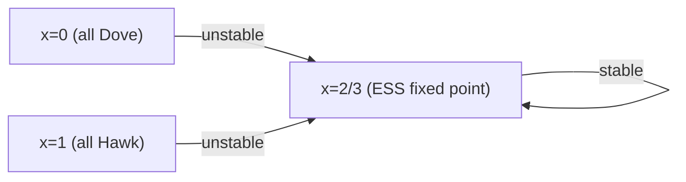

# 📈 Replicator Dynamics

> [!abstract] TL;DR
> **Replicator dynamics** model evolutionary selection: the share of a strategy grows proportionally to how much its fitness exceeds average population fitness. For continuous time: ẋᵢ = xᵢ · [fᵢ(x) − f̄(x)], where fᵢ(x) = Σⱼ Aᵢⱼxⱼ is strategy i's fitness and f̄(x) = Σᵢ xᵢfᵢ(x) is the mean. **Evolutionary folk theorem**: every Nash equilibrium is a fixed point of replicator dynamics, and every asymptotically stable fixed point is a Nash equilibrium. **ESS implies asymptotic stability** (under replicator dynamics), but not vice versa. In Hawk-Dove, the mixed ESS is the globally attracting fixed point. **Logit dynamics** and **best-response dynamics** are alternative learning rules with different convergence properties. **Potential games** (Monderer-Shapley) converge to pure NE under replicator/best-response dynamics.

---

## Intuition — analogy FIRST

Think of **firms choosing production technologies** in a market. Technologies that earn above-average profit attract investment (imitators switch to them); technologies earning below average lose market share. Over time, the distribution of technologies in the industry shifts. Replicator dynamics model this selection pressure: the share of each strategy grows or shrinks based on relative performance.

The replicator equation is the mathematical twin of **natural selection** in biology (Fisher's fundamental theorem of natural selection) and **reinforcement learning** in AI (strategies with higher rewards get more probability mass).

---

## How It Works

### The Replicator Equation

**Setup**: Population plays a symmetric game with strategy set S = {1, …, n} and payoff matrix A. State x ∈ Δⁿ (simplex) = population frequency distribution.

**Fitness** of strategy i in state x:
$$f_i(x) = \sum_j A_{ij} x_j = (Ax)_i$$

(Expected payoff of strategy i against the current population distribution x)

**Mean fitness**:
$$\bar{f}(x) = \sum_i x_i f_i(x) = x^\top A x$$

**Replicator dynamics** (continuous time):
$$\dot{x}_i = x_i \cdot [f_i(x) - \bar{f}(x)]$$

**Discrete time** (generation model):
$$x_i(t+1) = x_i(t) \cdot \frac{f_i(x(t))}{\bar{f}(x(t))}$$

**Invariant**: x(t) ∈ Δⁿ for all t if x(0) ∈ Δⁿ (probability simplex is invariant).

**Intuition**: ẋᵢ > 0 iff fᵢ(x) > f̄(x) — strategy i grows in share iff it outperforms the average. Selection favors above-average strategies.

---

### Hawk-Dove Phase Portrait

**A = [[V-C)/2, V], [0, V/2]]** (V=4, C=6, so V-C=-2)

**A = [[-1, 4], [0, 2]]**

Let x = fraction of Hawks, 1-x = fraction of Doves.

Hawk fitness: f_H(x) = -1·x + 4·(1-x) = 4 - 5x
Dove fitness: f_D(x) = 0·x + 2·(1-x) = 2 - 2x
Mean: f̄ = x·f_H + (1-x)·f_D = x(4-5x) + (1-x)(2-2x) = 4x-5x²+2-4x+2x² = 2-3x²

ẋ = x·[f_H - f̄] = x·[(4-5x) - (2-3x²)] = x·[2-5x+3x²] = x(1-x)(2-3x+... hmm)

Let me use: ẋ = x(1-x)(f_H - f_D) = x(1-x)[(4-5x)-(2-2x)] = x(1-x)[2-3x]

Fixed points: x=0 (all Dove), x=1 (all Hawk), x=2/3 = V/C = 4/6 = 2/3.

Stability:
- x=0: ẋ = 0·(1)(2) → perturb x slightly positive: ẋ = x·(1-x)·(2-3x) > 0 → x increases → UNSTABLE
- x=1: perturb x=1-ε slightly below 1: ẋ = (1-ε)·ε·(2-3(1-ε)) = (1-ε)ε(-1+3ε) < 0 for small ε → x decreases → UNSTABLE
- x=2/3: the interior fixed point. Check d/dx(ẋ) at x=2/3.

**The interior fixed point x*=2/3 is globally asymptotically stable** (for x₀ ∈ (0,1)) — this is the ESS.

---

## Key Concepts / Details

### Evolutionary Folk Theorem

**Theorem**: 
1. Every **Nash equilibrium** is a **fixed point** of replicator dynamics.
2. Every **asymptotically stable** fixed point is a **Nash equilibrium**.
3. Every **ESS** is an **asymptotically stable** fixed point. The converse fails.

**Proof (1)**: If x* is NE, then for all i ∈ supp(x*): fᵢ(x*) = f̄(x*) → ẋᵢ = 0. For i ∉ supp(x*): xᵢ* = 0 → ẋᵢ = 0. Fixed point. □

**Proof (3)**: ESS σ* implies stability. Technical proof via Lyapunov function V(x) = −Σᵢ xᵢ* log(xᵢ*/xᵢ) (KL divergence from x* to x). □

**The gap between AS and ESS**: In rock-paper-scissors, the interior NE (⅓,⅓,⅓) is a fixed point but the orbit structure depends on the specific game — it can be Lyapunov stable (cycles) but not asymptotically stable. So NE can be stable but not ESS.

### 2×2 Replicator Dynamics Cases

For a general symmetric 2×2 game with payoff matrix:

| | s₁ | s₂ |
|--|:--:|:--:|
| **s₁** | a | b |
| **s₂** | c | d |

ẋ = x(1-x)[(a-c)x + (b-d)(1-x)] where x = fraction playing s₁.

**Cases**:
- **a>c and b>d** (s₁ dominates): ẋ > 0 for all x ∈ (0,1) → x → 1, ESS = s₁
- **a<c and b<d** (s₂ dominates): ẋ < 0 → x → 0, ESS = s₂
- **a>c and b<d** (coordination game): Interior unstable equilibrium at x* = (d-b)/((a-c)+(d-b)); two ESS at x=0 and x=1
- **a<c and b>d** (anticoordination/Hawk-Dove): Interior stable equilibrium x* = (d-b)/((a-c)+(d-b)); unique mixed ESS

### Alternative Learning Dynamics

**Best-Response Dynamics**: At each step, each player switches to the pure strategy that best-responds to the current population. Converges to Nash in potential games (not in general).

**Logit Dynamics** (Blume 1993): Player i chooses strategy proportional to exp(β · uᵢ(sᵢ, x)):
$$x_i(t+1) \propto x_i(t) \cdot e^{\beta f_i(x(t))}$$

- β → ∞: approaches best-response dynamics
- β = 0: uniform mixing (no selection pressure)  
- β finite: noisy best-response; converges to **logit equilibrium** (stochastic stability)

**Fictitious Play**: Each player best-responds to the empirical frequency of others' past play. Converges in zero-sum games (and a few other classes), cycles in general.

### Potential Games and Convergence

**Monderer-Shapley (1996)**: A game G is a **potential game** if there exists a function Φ: S → ℝ (the potential) such that for all players i, all s₋ᵢ, and all sᵢ, s'ᵢ:
$$u_i(s_i, s_{-i}) - u_i(s'_i, s_{-i}) = \Phi(s_i, s_{-i}) - \Phi(s'_i, s_{-i})$$

**Theorem**: In a potential game, best-response dynamics converge to a pure Nash equilibrium (local maximizer of Φ). Replicator dynamics also converge (to a Nash equilibrium, not necessarily pure).

**Examples of potential games**:
- Congestion games (Rosenthal 1973)
- All symmetric games
- Cournot oligopoly (with appropriate payoffs)

**Why it matters**: Potential games guarantee convergence of learning dynamics — important for AI multi-agent systems.

---

## Real-World Notes

- **Evolutionary biology**: Fisher (1930) fundamental theorem; frequency-dependent selection in biology (e.g., frequency-dependent mating preferences in birds)
- **Multi-agent reinforcement learning**: Policy gradient methods = continuous-time replicator dynamics in the strategy space. Convergence results import directly from evolutionary GT
- **Traffic routing**: Wardrop equilibrium in traffic networks = Nash equilibrium of routing game; day-to-day dynamics where drivers adjust routes = replicator-like dynamics
- **Cryptocurrency protocols**: Miners choosing between competing chains follow evolutionary dynamics; ESS = dominant chain protocol
- **Marketing mix**: Firms in an industry adapt advertising/pricing strategies; market share dynamics follow replicator-like equations

---

## Common Pitfalls

1. **Replicator dynamics ≠ rational learning**: Replicator dynamics model selection pressure or imitation, NOT Bayesian updating or best-response learning. Different dynamics can converge to different outcomes.
2. **Fixed point ≠ NE in general**: A fixed point of replicator dynamics where xᵢ > 0 for multiple i IS a NE. But boundary fixed points (xᵢ = 0 for some i) may not be NE.
3. **Asymptotic stability ≠ ESS in mixed strategies**: ESS implies asymptotic stability, not vice versa. Some AS fixed points are "evolutionarily neutral" for invasion — they're NE but not ESS.
4. **Logit equilibrium ≠ Nash equilibrium**: Logit dynamics converge to "logit equilibrium" (a perturbed Nash concept with random mistakes), not exact Nash equilibrium. They coincide only as β → ∞.

---

## Related Concepts

- [[_MOC_Evolutionary_Computational|↑ Evolutionary & Computational MOC]]
- [[Evolutionary_Stable_Strategies|Evolutionary Stable Strategies]]
- [[Price_of_Anarchy|Price of Anarchy]]
- [[Algorithmic_Game_Theory|Algorithmic Game Theory]]
- [[../02_Static_Games/Nash_Equilibrium|Nash Equilibrium]]

---

## Review Questions

1. Analyze the replicator dynamics of the Stag Hunt game: (S,S)=(4,4), (S,H)=(0,3), (H,S)=(3,0), (H,H)=(3,3). Find all fixed points, classify their stability, and draw the phase portrait on [0,1].
2. Prove that in a 2-player symmetric zero-sum game, the replicator dynamics have no asymptotically stable fixed point (every orbit is a closed curve or diverges). What does this say about ESS in zero-sum games?
3. Show that the potential game property implies that every path of best-response dynamics is monotone increasing in Φ. Conclude that best-response dynamics cannot cycle in potential games.

---

## Sources

- Taylor & Jonker (1978) — "Evolutionary Stable Strategies and Game Dynamics," *Mathematical Biosciences*
- Hofbauer & Sigmund (1998) — *Evolutionary Games and Population Dynamics*
- Monderer & Shapley (1996) — "Potential Games," *Games and Economic Behavior*

#Game_Theory #EvolutionaryComputational #ReplicatorDynamics
