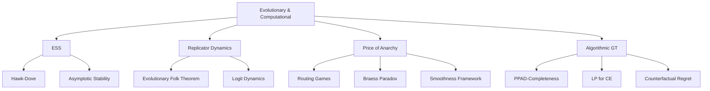

# 🧬 Evolutionary & Computational Game Theory — Section MOC

> [!abstract] Section Overview
> Evolutionary game theory abandons the "hyper-rational" player assumption, replacing it with selection dynamics on populations. Computational game theory asks: how hard is it to find equilibria, and how bad can equilibria be? Together these sections connect game theory to biology, computer science, and AI/ML.

---

## Concept Map



---

## Notes in This Section

| Note | Core Idea | Difficulty |
|------|-----------|-----------|
| [[Evolutionary_Stable_Strategies\|Evolutionary Stable Strategies]] | ESS; Maynard Smith; invasion condition; Hawk-Dove; ESS ⊂ NE | Intermediate |
| [[Replicator_Dynamics\|Replicator Dynamics]] | ẋᵢ = xᵢ(fᵢ−f̄); evolutionary folk theorem; ESS=asympt. stable; logit | Intermediate |
| [[Price_of_Anarchy\|Price of Anarchy]] | PoA, PoS; routing games; Braess paradox; Roughgarden smoothness 4/3 | Advanced |
| [[Algorithmic_Game_Theory\|Algorithmic Game Theory]] | PPAD-hardness; LP for CE; CFR; no-regret learning; MWU | Advanced |

---

## Learning Path

```
Evolutionary_Stable_Strategies → Replicator_Dynamics → Price_of_Anarchy → Algorithmic_Game_Theory
```

## Key Questions

1. Why is every ESS a Nash equilibrium but not every NE an ESS?
2. What is the evolutionary folk theorem and how does it differ from the standard folk theorem?
3. How does the Braess paradox show that adding roads can hurt everyone?
4. Why is Nash equilibrium computation PPAD-complete?

---

## Related Sections

- [[_MOC_Game_Theory_Master|↑ Master MOC]]
- [[../05_Mechanism_Design/_MOC_Mechanism_Design|← Mechanism Design]]

#Game_Theory #EvolutionaryComputational #MOC
