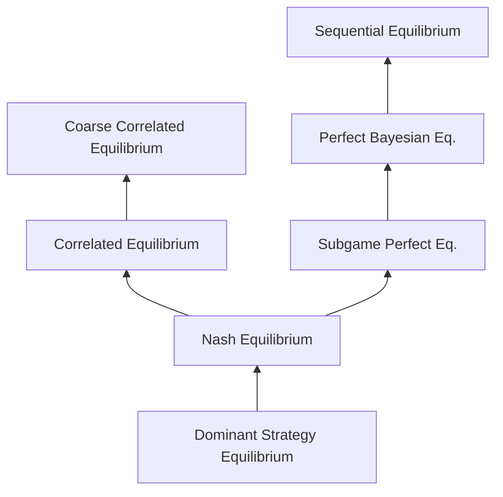

# 🎮 Game Theory — Master Map of Content

> [!abstract] Vault Overview
> A 32-note structured knowledge vault covering the complete landscape of Game Theory: from foundational representations and equilibrium concepts, through dynamic and cooperative games, to mechanism design, evolutionary dynamics, and algorithmic analysis. Each section builds on the previous, culminating in modern computational applications.

---

## Vault Architecture

```mermaid
graph TD
    GT[🎮 Game Theory] --> F[01 Fundamentals]
    GT --> S[02 Static Games]
    GT --> D[03 Dynamic Games]
    GT --> C[04 Cooperative Games]
    GT --> M[05 Mechanism Design]
    GT --> E[06 Evolutionary & Computational]

    F --> F1[Game Representations]
    F --> F2[Players Strategies Payoffs]
    F --> F3[Dominance & Rationality]
    F --> F4[Information in Games]

    S --> S1[Nash Equilibrium]
    S --> S2[Mixed Strategies]
    S --> S3[Correlated Equilibrium]
    S --> S4[Minimax Theorem]

    D --> D1[Extensive Form & Trees]
    D --> D2[Backward Induction]
    D --> D3[Subgame Perfect Equilibrium]
    D --> D4[Repeated Games & Folk Theorems]
    D --> D5[Signaling Games]

    C --> C1[Coalitional Games & Shapley Value]
    C --> C2[Core & Stability]
    C --> C3[Bargaining Theory]
    C --> C4[Power Indices]

    M --> M1[Revelation Principle & IC]
    M --> M2[VCG Mechanism]
    M --> M3[Auction Theory]
    M --> M4[Matching Markets]

    E --> E1[Evolutionary Stable Strategies]
    E --> E2[Replicator Dynamics]
    E --> E3[Price of Anarchy]
    E --> E4[Algorithmic Game Theory]

    S1 -.->|refines| F3
    D3 -.->|extends| S1
    C1 -.->|axiomatizes| C3
    M1 -.->|underpins| M2
    E1 -.->|relates to| S1
    E3 -.->|quantifies| S1
```



---

## Sections at a Glance

| # | Section | Key Concepts | Difficulty | Notes |
|---|---------|-------------|-----------|-------|
| 01 | [[_MOC_GT_Fundamentals\|Fundamentals]] | Normal/extensive form, strategies, dominance, information | Beginner | 4 |
| 02 | [[_MOC_Static_Games\|Static Games]] | Nash equilibrium, mixed strategies, minimax, correlated eq. | Intermediate | 4 |
| 03 | [[_MOC_Dynamic_Games\|Dynamic Games]] | SPE, backward induction, repeated games, signaling | Intermediate | 5 |
| 04 | [[_MOC_Cooperative_Games\|Cooperative Games]] | Shapley value, core, bargaining, power indices | Intermediate | 4 |
| 05 | [[_MOC_Mechanism_Design\|Mechanism Design]] | Revelation principle, VCG, auctions, matching | Advanced | 4 |
| 06 | [[_MOC_Evolutionary_Computational\|Evolutionary & Computational]] | ESS, replicator dynamics, PoA, algorithmic GT | Advanced | 4 |

---

## Learning Paths

### Path A — Economist (Classical Theory)
```
Fundamentals → Static Games → Dynamic Games → Cooperative Games → Mechanism Design
```

### Path B — Computer Scientist (Algorithmic Focus)
```
Fundamentals → Static Games → Algorithmic GT → Price of Anarchy → Mechanism Design (VCG/Auctions)
```

### Path C — AI/ML Practitioner
```
Fundamentals → Nash Equilibrium → Correlated Equilibrium → Mechanism Design → Evolutionary & Computational
```

### Path D — Research/Theory (Complete)
```
All sections in order 01 → 02 → 03 → 04 → 05 → 06
```

---

## Core Theorems Reference

| Theorem | Statement | Section |
|---------|-----------|---------|
| **Nash 1950** | Every finite game has ≥1 NE (in mixed strategies) | [[Nash_Equilibrium\|Nash Equilibrium]] |
| **Von Neumann 1928** | maxₓminᵧ xᵀAy = minᵧmaxₓ xᵀAy for zero-sum | [[Minimax_Theorem\|Minimax]] |
| **Zermelo 1913** | Chess/checkers determined: one player has winning strategy | [[Backward_Induction\|Backward Induction]] |
| **Folk Theorem** | Any feasible individually-rational payoff is an SPE for patient players | [[Repeated_Games_and_Folk_Theorems\|Repeated Games]] |
| **Bondareva-Shapley** | Core non-empty iff game is balanced | [[Core_and_Stability\|Core & Stability]] |
| **Myerson 1979** | Revelation principle: any mechanism payoff-equiv. to truthful direct | [[Revelation_Principle_and_IC\|Revelation Principle]] |
| **Gibbard-Satterthwaite** | Any DSIC non-dictatorial social choice over ≥3 alternatives is impossible | [[Revelation_Principle_and_IC\|Revelation Principle]] |
| **Gale-Shapley 1962** | Deferred acceptance produces stable matching | [[Matching_Markets\|Matching Markets]] |
| **Roughgarden 2009** | Smoothness framework: PoA ≤ 1/(1-μ) for (λ,μ)-smooth games | [[Price_of_Anarchy\|Price of Anarchy]] |

---

## Equilibrium Concept Hierarchy



*Arrows point from stronger → weaker refinement. Every NE is a CE; every SPE is a NE in the full game.*

---

## Cross-Vault Links

| Vault | Connection |
|-------|-----------|
| [[../AI-ML/_MOC_AI_ML_Master\|AI-ML Vault]] | Multi-agent RL, mechanism design for AI alignment, SHAP values |
| [[../System Design/_MOC_SystemDesign_Master\|System Design Vault]] | Auction-based resource allocation, incentive design in distributed systems |
| [[../Database/_MOC_Database_Master\|Database Vault]] | Query optimization as adversarial game, distributed consensus |

---

## Section MOC Index

- [[_MOC_GT_Fundamentals|01 — Fundamentals MOC]]
- [[_MOC_Static_Games|02 — Static Games MOC]]
- [[_MOC_Dynamic_Games|03 — Dynamic Games MOC]]
- [[_MOC_Cooperative_Games|04 — Cooperative Games MOC]]
- [[_MOC_Mechanism_Design|05 — Mechanism Design MOC]]
- [[_MOC_Evolutionary_Computational|06 — Evolutionary & Computational MOC]]

---

#Game_Theory #MOC #Master
