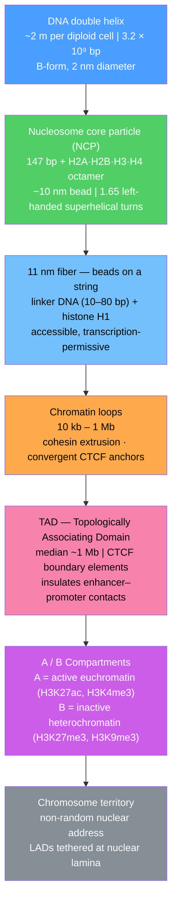

# Chromatin Structure and Nucleosomes

> [!abstract] TL;DR
> The human genome is ~2 metres of DNA that must fit inside a nucleus 6 micrometres across; the solution is a hierarchical packaging system — **nucleosomes** (DNA spools), **cohesin-extruded loops**, **topologically associating domains (TADs)**, and **A/B compartments** — that simultaneously compacts the genome and controls which genes are accessible to the transcription machinery.

---

## Intuition — analogy FIRST

Imagine you have to fit **2 metres of ultra-thin thread** (your DNA) into a **marble** (the nucleus). You can't just stuff it in randomly — you need it coiled onto small spools, then the spooled thread coiled into bigger coils, and those coils grouped into labelled chapters that keep "related pages" (genes and their enhancers) physically close together.

That is exactly what the cell does:
- **Nucleosomes** are the spools — 147 base-pairs of DNA wrapped ~1.65 times around a protein spool.
- **Chromatin loops** are the coils — stretches of 10 kb to 1 Mb extruded into loops by a molecular motor (cohesin).
- **TADs** are the chapters — roughly 1-Mb neighbourhoods whose internal contacts are far more frequent than contacts between neighbourhoods, so enhancers typically only regulate genes within the same chapter.
- **A/B compartments** are the active and archived sections of the library — open, gene-rich regions (compartment A) vs. densely packed, silenced regions (compartment B).

The beauty of this hierarchy is that it is **dynamic**: the same genome sequence can be packaged differently in a neuron versus a liver cell, because the spooling and looping are controlled by epigenetic marks and regulatory proteins, not just the DNA sequence itself.

---

## How It Works

### Nucleosome Core Particle — Level 1

The **nucleosome core particle (NCP)** is the fundamental unit. Its crystal structure was solved by Luger et al. in 1997 (resolution 2.8 Å, PDB: 1AOI):

- **Histone octamer** — two copies each of H2A, H2B, H3, and H4 form a disc-shaped protein spool (~100 kDa total).
- **DNA wrapping** — exactly **147 base pairs** of DNA make **~1.65 left-handed superhelical turns** around the octamer surface, with the negatively charged DNA backbone contacting positively charged lysine and arginine residues on each histone.
- **Linker DNA** — 10 to 80 bp of DNA connects adjacent nucleosomes (average ~20 bp in mammals). Histone **H1** binds the linker and the nucleosome entry/exit point, stabilising a compact form.
- Together, one NCP + one linker + one H1 molecule is a **chromatosome**. The bead-on-a-string appearance of chromatin at low salt is the **11 nm fiber**.

### The 30 nm Fiber — Contested

The textbook **30 nm fiber** (a compact solenoid or zigzag helix of nucleosomes) is readily observed in vitro but its existence **in vivo is debated**. Cryo-EM tomography of native nuclei (2017, Nishino et al. and others) found irregular, loosely packed nucleosome arrays rather than a regular 30 nm structure, suggesting the next level of compaction is loop-based, not fiber-based.

### Higher-Order Structure — Loop Extrusion Model

The **loop extrusion model** (developed 2016–2020 by Fudenberg, Mirny, Lieberman-Aiden and others) explains how 10 kb–1 Mb chromatin loops form:

1. **Cohesin** (an SMC ring complex: SMC1-SMC3 heterodimer + Rad21/SCC1 kleisin + HEAT-repeat subunits) topologically embraces two DNA segments and translocates along chromatin, extruding a growing loop.
2. **CTCF** (CCCTC-binding factor) is a zinc-finger protein that recognises a ~17 bp binding motif oriented in a specific direction. A convergently oriented pair of CTCF sites acts as a **roadblock**, stalling cohesin and stabilising the loop anchor.
3. The result is a population of loops with CTCF-anchored bases that insulate the interior enhancer–promoter pairs from those outside.

### Topologically Associating Domains (TADs)

**TADs** are megabase-scale structural units first described by Dixon et al. (2012) using Hi-C contact maps:
- **Definition** — a genomic region (median ~1 Mb in mammals) within which DNA segments contact each other far more frequently than they contact segments in adjacent TADs.
- **Boundaries** — marked by convergent CTCF sites, often co-occupied by cohesin; regions of high chromatin accessibility; frequently contain housekeeping genes.
- **Function** — restrict the action of enhancers to promoters within the same TAD; disruption of CTCF boundaries (by deletion, inversion, or mutation) can rewire enhancer–promoter contacts and cause disease (see Real-World Applications).

### A/B Compartments

Hi-C correlation matrices at lower resolution (~100 kb bins) reveal a **plaid pattern** corresponding to two interacting compartments:
- **Compartment A** — early-replicating, gene-dense, high GC content, marked by active histone modifications (H3K4me3, H3K27ac, H3K36me3); spatially occupies the nuclear interior.
- **Compartment B** — late-replicating, gene-poor, marked by repressive modifications (H3K27me3, H3K9me3); often associated with the nuclear periphery.

Compartments are largely maintained by phase-separation mechanisms (see Graduate Level).

### Lamina-Associated Domains (LADs)

**LADs** are genome regions (0.1–10 Mb) that are physically tethered to the **nuclear lamina** — the intermediate-filament meshwork lining the inner nuclear membrane. LADs overlap strongly with compartment B, are replicated late, and are transcriptionally silent. The transcription factor **LBR** (Lamin B Receptor) and **Lamin A/C** mutations disrupt LAD organisation and cause laminopathies (Hutchinson-Gilford Progeria, Emery-Dreifuss muscular dystrophy).

### Euchromatin vs Heterochromatin

| Property | Euchromatin | Constitutive Heterochromatin | Facultative Heterochromatin |
|----------|-------------|-----------------------------|-----------------------------|
| Location | Chromosome arms | Centromeres, telomeres, pericentromeric repeats | Gene-poor arms; inactive X |
| Histone mark | H3K4me3, H3K27ac | H3K9me3, H4K20me3 | H3K27me3 |
| Writer | KMT2 family (MLL) | SUV39H1/H2 (KMT1) | PRC2 (EZH2) |
| Reader | ING proteins, BPTF | HP1α/β/γ | PRC1 (CBX proteins) |
| Replication timing | Early S | Mid-to-late S | Late S |
| Transcription | Active | Silenced (permanent) | Silenced (reversible) |

### Nucleosome Positioning and Phasing

Nucleosomes are **not randomly placed**:
- **Nucleosome-free regions (NFRs)** at promoters, enhancers, and insulators allow transcription factor and polymerase binding.
- Nucleosome positions are determined by: (i) DNA sequence (AT-rich sequences disfavour wrapping; GC-rich sequences favour it); (ii) chromatin remodellers (SWI/SNF, ISWI, CHD, INO80 families) that slide, eject, or exchange nucleosomes; (iii) transcription factor competition.
- **Phasing** — the regular spacing of nucleosomes downstream of an NFR (the +1, +2, +3 nucleosomes); ISWI-family remodellers set this spacing.

### Mermaid — Chromatin Hierarchy



---

## Key Concepts / Details

### Secondary Level

**Why bother packaging?** Each human diploid cell contains ~2 metres of DNA (6.4 × 10⁹ bp total, ~3 nm per bp). The nucleus is only ~6 µm across. That is a ~10,000-fold linear compaction problem. Nucleosomes achieve roughly **40–50-fold** compaction of naked DNA; loops and territories provide the remaining factor.

**The four core histones** (H2A, H2B, H3, H4) are among the most conserved proteins in eukaryotes — yeast H4 is 92% identical to human H4 — because almost every surface residue either contacts DNA or is modified to regulate gene expression. Each has a **histone fold domain** (three alpha-helices connected by two loops) that allows histone-histone handshaking within the octamer, plus flexible **N-terminal tails** that protrude from the nucleosome surface and carry most of the post-translational modifications.

**Euchromatin = open = active; heterochromatin = compact = silenced.** This is a useful first approximation. Open regions (euchromatin) are accessible to RNA polymerase and transcription factors; compact regions (heterochromatin) are not, by default.

**Histone modifications — three main classes at secondary level:**
- **Acetylation** (e.g. H3K27ac) — generally activating; neutralises the positive charge on lysine, loosening DNA–histone contacts; written by HATs (histone acetyltransferases), erased by HDACs (deacetylases).
- **Methylation** (e.g. H3K4me3 active promoters; H3K27me3 facultative silencing; H3K9me3 constitutive silencing) — can be either activating or repressive depending on the specific residue and degree (mono/di/tri).
- **Phosphorylation** (e.g. H3S10ph during mitosis, H2AX phosphorylation at DNA double-strand breaks as γH2AX).

### Undergraduate Level

**Nucleosome positioning energy.** The minimum energy configuration for a 147-bp stretch of DNA on the histone octamer has the minor groove facing the histone surface at every helical repeat (~10.2 bp). DNA sequences with alternating A/T and G/C dinucleotides phased at this repeat bend more easily onto the octamer. Conversely, **poly-dA:dT tracts** are intrinsically stiff and strongly exclude nucleosomes — this is why the NFRs at yeast promoters are often AT-rich.

**CTCF binding motif.** CTCF (CCCTC-binding factor) is an 11-zinc-finger protein that recognises a degenerate ~17 bp core sequence (enriched in CCGCG). Different subsets of the 11 zinc fingers engage different parts of the motif, allowing CTCF to also bind RNA and partner proteins. The orientation of the CTCF motif (relative to its partner on the other loop anchor) is **critical**: cohesin-extruded loops preferentially form between **convergent** CTCF sites (arrows pointing toward each other); divergent or tandem sites stall cohesin weakly and rarely form stable loops.

**Cohesin as an SMC complex.** Cohesins belong to the Structural Maintenance of Chromosomes (SMC) protein family — ring-shaped ATPases. The ring (SMC1-SMC3 coiled-coil arms + Rad21 kleisin bridging their ATPase heads) topologically entraps DNA. NIPBL/MAU2 (the loader) loads cohesin onto chromatin at NFRs near transcription start sites; WAPL (the releaser) removes it. The loop extrusion ATPase cycle: NIPBL-stimulated ATPase activity drives a conformational change that reels in flanking DNA, growing the loop ~0.5–1 kb per second.

**Hi-C contact maps.** Hi-C (chromosome conformation capture with next-generation sequencing) cross-links proteins to DNA in situ, digests DNA with restriction enzymes, ligates nearby (cross-linked) ends, reverses cross-links, and sequences the ligation junctions. The result is a pairwise contact matrix: $C_{ij}$ = number of ligation events between genomic bins $i$ and $j$. Features in the map:
- **TADs** appear as triangles of elevated contacts along the diagonal.
- **Loop dots** — punctate high-contact spots at CTCF-anchored loop bases, observed at ~5 kb resolution.
- **Stripes** — emanating from CTCF sites, reflecting one-sided loop extrusion.
- **Compartment plaid** — a checkerboard pattern at ~100 kb resolution reflecting A–A and B–B contacts being more frequent than A–B.

**ATAC-seq and chromatin accessibility.** Assay for Transposase-Accessible Chromatin with sequencing (ATAC-seq) uses the Tn5 transposase to insert sequencing adapters preferentially into nucleosome-free (open) chromatin. The resulting read pile-ups mark NFRs at active promoters, enhancers, and CTCF sites genome-wide, in as few as 50,000 cells (or single cells with scATAC-seq).

### Graduate Level

**Phase separation of heterochromatin (HP1 condensates).** HP1 (Heterochromatin Protein 1; three paralogs in mammals: HP1α/CBX5, HP1β/CBX1, HP1γ/CBX3) recognises H3K9me3 via its **chromodomain** and oligomerises via its **chromoshadow domain**. Larson et al. and Strom et al. (2017, *Science*) showed that HP1α undergoes **liquid-liquid phase separation (LLPS)** — forming micron-scale liquid droplets that enrich H3K9me3 chromatin and exclude active transcription machinery. The intrinsically disordered hinge region of HP1α drives LLPS. Phosphorylation of the hinge by CK2 (casein kinase 2) enhances LLPS; competing RNA can dissolve droplets. This provides a biophysical mechanism for "reading" H3K9me3 marks and amplifying them into stable, phase-separated heterochromatin compartments.

**Liquid condensates at transcription hubs.** Super-enhancers (clusters of strong enhancers) concentrate transcription coactivators (Mediator, BRD4) and RNA Pol II into dense **transcription condensates** via the intrinsically disordered C-terminal domain (CTD) of Pol II. Boija et al. (2018, *Cell*) demonstrated that the Pol II CTD partitions into Mediator condensates, while the phosphorylated CTD (after pause release) is excluded, potentially providing directionality to the transcription cycle. Condensates formed in phase-separated environments concentrate activators ~100-fold above bulk concentration, amplifying transcription output.

**Loop extrusion at single-molecule resolution.** Davidson et al. and Kim et al. (2019, *Science*) reconstituted cohesin-mediated loop extrusion on DNA tightropes with single-molecule imaging, measuring extrusion rates (~0.5 kb/s) and showing that CTCF specifically pauses one-sided extrusion. WAPL competes with NIPBL for cohesin binding: the ratio of loader to releaser sets the average loop size. Auxin-inducible degron (AID) systems allow acute depletion of cohesin or CTCF in cells, collapsing loops/TADs while leaving compartments largely intact — demonstrating that loops/TADs and compartments are mechanistically separable.

**Cryo-EM structural insights.** Beyond the 1997 NCP crystal structure, recent cryo-EM structures (2018–2024) have resolved: the **di-nucleosome** with linker H1 and linker DNA; **nucleosome–chromatin remodeller** complexes (SWI/SNF, ISWI, CHD at ~2–3 Å); **cohesin-NIPBL-DNA** in the loop extrusion conformation; and **CTCF-cohesin-DNA** ternary complexes. These reveal allosteric communication between the remodeller ATPase and the nucleosome dyad during sliding, and the precise geometry by which CTCF's zinc-finger array blocks cohesin translocation.

---

## Python Demo

```python
# pip install numpy matplotlib
import numpy as np
import matplotlib.pyplot as plt

rng = np.random.default_rng(42)

# ------------------------------------------------------------------
# Freely-jointed chain (FJC) model of a chromatin fibre.
# Each bead represents one nucleosome; the step length b = 11 nm
# (nucleosome diameter).  Under ideal-chain (Rouse) conditions the
# mean-square end-to-end distance scales as  <R^2> = s * b^2,
# giving R ~ s^0.5  (Rouse / random-walk exponent 0.5).
# ------------------------------------------------------------------

N_BEADS = 1000     # nucleosomes per chain
B = 11.0           # Kuhn step length, nm  (one nucleosome)
N_CHAINS = 400     # ensemble size for averaging

# Random 3-D unit vectors, scaled to b
steps = rng.standard_normal((N_CHAINS, N_BEADS, 3))
norms = np.linalg.norm(steps, axis=2, keepdims=True)
steps = steps / norms * B                  # shape (N_CHAINS, N_BEADS, 3)

# Cumulative bead positions, including the origin
positions = np.zeros((N_CHAINS, N_BEADS + 1, 3))
positions[:, 1:, :] = np.cumsum(steps, axis=1)

# Mean-square displacement <R^2(s)> as a function of genomic separation s
max_sep = 500
separations = np.arange(1, max_sep + 1)
msd = np.empty(max_sep)

for k, s in enumerate(separations):
    # All pairs (i, i+s) across all chains
    diff = positions[:, s:, :] - positions[:, : N_BEADS + 1 - s, :]
    msd[k] = np.mean(np.sum(diff ** 2, axis=2))

# Theoretical Rouse prediction
rouse_theory = separations * B ** 2

# Log-log slope (fit over the middle range to avoid endpoint noise)
slope, _ = np.polyfit(np.log(separations[50:450]),
                      np.log(msd[50:450]), 1)

fig, ax = plt.subplots(figsize=(7, 5))
ax.loglog(separations, msd, lw=2, color="steelblue",
          label="FJC simulation")
ax.loglog(separations, rouse_theory, "--", lw=2, color="coral",
          label=r"Rouse theory  $\langle R^2\rangle = s \cdot b^2$")
ax.set_xlabel("Genomic separation  s  (nucleosomes)", fontsize=12)
ax.set_ylabel(r"$\langle R^2 \rangle$  (nm²)", fontsize=12)
ax.set_title(
    f"Chromatin — freely-jointed chain\n"
    f"log-log slope = {slope:.3f}  (ideal Rouse = 1.000)",
    fontsize=11,
)
ax.legend(fontsize=10)
ax.grid(True, which="both", alpha=0.3)
plt.tight_layout()
plt.savefig("chromatin_rouse_scaling.png", dpi=120)
plt.show()

print(f"Fitted log-log slope: {slope:.4f}  (expect 1.0000 for ideal FJC)")
print(f"Prefactor b^2 = {B**2:.1f} nm²  |  "
      f"FJC at s=100: {msd[99]:.1f} nm²  |  "
      f"theory: {100 * B**2:.1f} nm²")
```

**What the output shows.** On a log-log plot both the simulation and the Rouse theory trace identical straight lines with slope ≈ 1.000, confirming $\langle R^2 \rangle \propto s$ (i.e. $R \propto s^{0.5}$). Real chromatin deviates from this ideal at short separations (stiff rod regime, slope → 1 is exact) and at large separations (confinement in a chromosome territory causes the curve to plateau). Hi-C-derived polymer models use more sophisticated variants (loop-polymer, fractal-globule, string-binder-switch) to fit the observed contact-frequency decay $P(s) \sim s^{-1}$ seen in mammalian Hi-C data.

---

## Real-World Applications

**1. HDAC inhibitors in cancer epigenomics.** Many tumour cells silence tumour-suppressor genes by recruiting HDACs, which remove acetyl groups from histones H3 and H4 and promote compaction. Pan-HDAC inhibitors (vorinostat/SAHA, romidepsin) and isoform-selective inhibitors (entinostat for HDAC1/3, tucidinostat) restore acetylation, re-open compacted chromatin, and de-repress silenced growth-control genes. They are approved for T-cell lymphoma and are in trials for solid tumours, often in combination with PD-1 checkpoint inhibitors.

**2. Chromatin remodelling in stem-cell reprogramming.** Somatic cell reprogramming to iPSCs (Yamanaka factors: Oct4, Sox2, Klf4, c-Myc) requires widespread chromatin remodelling: BAF (SWI/SNF) complexes slide nucleosomes away from pluripotency gene promoters; PRC2/EZH2 removes H3K27me3 at the same loci; and DNMT3A/3B activity is suppressed to allow remethylation of the pluripotency pattern. Inhibiting EZH2 (GSK126) or using small-molecule BRD4 inhibitors (JQ1) accelerates reprogramming efficiency, demonstrating that chromatin-state barriers are the rate-limiting step.

**3. TAD disruption in developmental disorders.** Disruption of CTCF boundary elements between the *EPHA4* TAD and the *WNT6/IHH* TAD on chromosome 2q35 rewires limb-development enhancers from *Epha4* to *Wnt6* or *Ihh*, causing brachydactyly, polydactyly, or Liebenberg syndrome depending on the precise boundary deletion. This was the landmark demonstration (Lupiáñez et al., 2015, *Cell*) that structural TAD disruption — not gene-coding mutation — can cause Mendelian disease.

**4. CTCF mutations in cancer.** CTCF is among the most frequently somatically mutated zinc-finger proteins in human cancers (endometrial, colon, breast, blood). Zinc-finger mutations reduce DNA-binding affinity at specific sites, dissolving loop anchors and allowing tumour-suppressor promoters to be contacted by previously insulated oncogenic enhancers, effectively creating neo-enhancer hijacking events without any coding-sequence change.

---

## Common Pitfalls

- **Assuming euchromatin = active and heterochromatin = inactive — always.** Constitutive heterochromatin at centromeres and telomeres is permanently silent, but facultative heterochromatin (H3K27me3-marked Polycomb domains) is *reversibly* silenced — it is the gene's "off state" that can be reactivated by developmental cues. Some actively transcribed genes (e.g. elongating Pol II through a gene body) acquire H3K36me3, which is a "heterochromatin mark" by crude classification but is actually a signal for RNA splicing.

- **Treating the 30 nm fiber as the default in-vivo state.** Textbooks still feature the solenoid or two-start zigzag fiber as the 30 nm fiber. In vivo cryo-EM evidence (2014 onward) consistently shows irregular nucleosome packing without a regular 30 nm structure in most chromatin. The 30 nm fiber is a preparation artefact of low-salt, high-Mg²⁺ in-vitro conditions. Do not quote "30 nm fiber" as established in-vivo architecture in grant proposals or exams without this caveat.

- **Conflating DNA methylation with histone methylation.** DNA methylation (5-methylcytosine, 5mC) at CpG dinucleotides and histone methylation (H3K9me3, H3K27me3) are distinct chemical marks written by different enzymes (DNMTs vs HMTs). They are correlated (MBD proteins recruit HDACs; PRC2 can propagate H3K27me3 independently of DNA methylation), but many silenced genes lack DNA methylation, and many methylated CpGs outside CGI promoters are in actively expressed gene bodies.

- **Misinterpreting Hi-C contact frequency as physical proximity.** A high $C_{ij}$ value means those two loci were cross-linked often in the bulk population, but it does not mean they are close together in every cell. Hi-C is a **population-average** measurement. Single-molecule imaging (DNA-FISH, ORCA, STORM) and live-cell tracking reveal substantial cell-to-cell variability in loop/TAD structure, with loops present in only ~30–80% of alleles at any given time.

- **Ignoring the strand orientation of CTCF motifs.** A pair of CTCF sites flanking a loop always has convergent orientation (→ ... ←). Re-inverting or deleting one site disrupts the loop even if the CTCF protein still binds. This directionality is essential when designing synthetic genome-editing experiments (e.g. moving an enhancer or creating synthetic TAD boundaries).

---

## Related Concepts

- [[_MOC_Molecular_Genetics|↑ Molecular Genetics MOC]]
- [[Protein_Structure_and_Function]] — histone octamer assembly relies on the histone-fold domain (a three-helix bundle); histone–DNA contacts are electrostatic, and post-translational modifications are read/written by specific folded reader/writer domains (bromodomain, chromodomain, PHD finger).
- [[Nucleic_Acids_and_the_Central_Dogma]] — chromatin packaging directly gates the first step of the central dogma: RNA Pol II cannot transcribe a nucleosome-occluded promoter without prior remodelling; understanding DNA chemistry is prerequisite to understanding nucleosomal DNA deformation.
- [[Gene_Regulation_and_Epigenetics]] — chromatin structure is the physical implementation of epigenetic regulation; histone modifications, DNA methylation, and chromatin remodelling are the molecular mechanisms that set and read the epigenetic code. *(planned note in this vault)*
- [[Fourier_Transform]] — Hi-C contact maps are analysed spectrally: compartment A/B structure is extracted by principal component analysis (PCA) of the correlation matrix, and insulation scores use sliding-window averaging analogous to low-pass filtering; spectral decomposition of contact decay $P(s)$ reveals polymer scaling exponents.
- [[Functional_Genomics_and_Transcriptomics]] — ATAC-seq, ChIP-seq, and RNA-seq data are interpreted in the context of nucleosome positions and TAD boundaries; single-cell multi-omics (scATAC + scRNA) link chromatin accessibility landscapes to transcriptional output cell by cell. *(planned note in this vault, section 03)*

---

## Review Questions

### Conceptual

1. A mutation deletes a 500 bp CTCF binding site at the boundary between the *EPHA4* TAD and the adjacent *WNT6/IHH* TAD. Without running any experiment, predict: (a) what happens to the Hi-C contact map in the region, (b) which enhancers now gain access to which promoters, and (c) what phenotype might result. Explain the mechanistic chain from CTCF loss to gene mis-expression.

### Scenario

2. You are reprogramming human fibroblasts to iPSCs and find that the pluripotency gene *NANOG* is in a B-compartment, H3K27me3-marked Polycomb domain with its promoter covered by a well-positioned +1 nucleosome. Reprogramming efficiency is low. Propose two independent small-molecule interventions targeting chromatin structure (not the Yamanaka factors themselves) that might improve efficiency, and explain the mechanism of each.

### Trade-off

3. HDAC inhibitors re-open silenced tumour-suppressor loci but also globally increase histone acetylation genome-wide. What are the on-target benefits and the potential unintended consequences of global histone hyperacetylation in a cancer cell, and how might isoform-selective HDAC inhibitors address the trade-off?

---

## Sources

- [Luger K et al. (1997) Crystal structure of the nucleosome core particle at 2.8 Å resolution. *Nature* 389, 251–260.](https://doi.org/10.1038/38444)
- [Dixon JR et al. (2012) Topological domains in mammalian genomes identified by analysis of chromatin interactions. *Nature* 485, 376–380.](https://doi.org/10.1038/nature11082)
- [Alberts B et al. *Molecular Biology of the Cell*, 7th edition. W. W. Norton, 2022. Chapter 7: Control of Gene Expression.](https://www.ncbi.nlm.nih.gov/books/NBK26887/)
- [Fudenberg G et al. (2016) Formation of chromosomal domains by loop extrusion. *Cell Reports* 15, 2038–2049.](https://doi.org/10.1016/j.celrep.2016.04.085)
- [Lupiáñez DG et al. (2015) Disruptions of topological chromatin domains cause pathogenic rewiring of gene-enhancer interactions. *Cell* 161, 1012–1025.](https://doi.org/10.1016/j.cell.2015.04.004)
- [Strom AR et al. (2017) Phase separation drives heterochromatin domain formation. *Nature* 547, 241–245.](https://doi.org/10.1038/nature22989)
- [Nora EP et al. (2017) Targeted degradation of CTCF decouples local insulation of chromosome domains from genomic compartmentalization. *Cell* 169, 930–944.](https://doi.org/10.1016/j.cell.2017.05.004)

---

#Genetics #MolecularGenetics #Chromatin #Nucleosome
