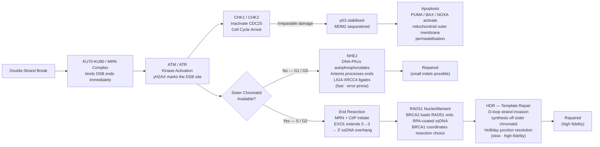

# 🧬 DNA Repair and Mutation

> [!abstract] TL;DR
> A human cell suffers ~10,000–100,000 DNA lesions per day from metabolism and environment alone; a hierarchy of five major repair pathways — BER, NER, MMR, NHEJ, and HDR — corrects almost all of them before the next division. Mutations are the rare lesions that escape or are misrepaired, and the cell cycle kinases ATM/ATR, the effectors CHK1/CHK2, and the transcription factor p53 form a surveillance network that arrests or kills cells when damage overwhelms repair. When repair genes themselves are mutated, the result is accelerated mutagenesis, hereditary cancer syndromes, and the mechanistic basis for PARP-inhibitor therapy.

---

## Intuition — analogy FIRST

Imagine a word processor's spell-checker running continuously on a 3-billion-letter document — one that is also being copied every time the cell divides. Every few seconds, an individual "character" (a nucleotide base) is accidentally altered, stripped out, or chemically mangled. The spell-checker scans the context, recognises the error pattern, and patches it using the complementary strand as the authoritative reference copy. A mutation is a typo that slips through the checker's scan: some are silent (the altered codon still spells the same amino acid), some subtly change the word's meaning (missense), and some place a full stop in the middle of a sentence (nonsense), truncating the entire protein.

The analogy also captures why repair matters: if you stop the spell-checker, the document degrades rapidly. Cells deficient in even one repair pathway accumulate mutations thousands of times faster than normal, and the resulting genomic instability is the hallmark feature of virtually every human cancer.

---

## How It Works

### Mutation Taxonomy

A **mutation** is a heritable change in the DNA sequence. Mutations are classified by their molecular nature and their effect on the encoded protein.

**By molecular change:**

| Class | Definition | Example | Typical consequence |
|-------|-----------|---------|---------------------|
| Transition | Purine ↔ purine or pyrimidine ↔ pyrimidine | A:T → G:C, C:G → T:A | Often missense or silent |
| Transversion | Purine ↔ pyrimidine | A:T → T:A, G:C → C:G | Less frequent spontaneously; often missense |
| Insertion/deletion (indel) | Addition or loss of one or more bases | +1 bp, −3 bp | Frameshift (if not divisible by 3) or in-frame deletion |
| Inversion / translocation | Segment flipped or moved | inv(9)(p11q13) | Gene disruption, fusion gene |

**By effect on protein:**

- **Silent (synonymous):** codon change does not alter the amino acid — exploits codon degeneracy.
- **Missense:** single nucleotide change alters one amino acid — may be tolerated, deleterious, or activating (e.g., KRAS G12V).
- **Nonsense:** change to a stop codon (UAA, UAG, UGA) → truncated protein, often degraded by nonsense-mediated decay.
- **Frameshift:** indel not divisible by 3 shifts the reading frame → garbled downstream sequence → premature stop.
- **Splice-site:** mutation at intron-exon boundary → exon skipping or intron retention.

### Sources of DNA Damage

Damage is caused by both endogenous chemistry and environmental insults, generating ~10,000–100,000 lesions per cell per day under normal conditions.

**Spontaneous / endogenous:**
- **Deamination:** cytosine → uracil (~100–500/cell/day); 5-methylcytosine → thymine, creating a promutagenic G:T mismatch. The C→T transition at CpG dinucleotides is the single most common point mutation in the human germline.
- **Depurination:** hydrolysis of the N-glycosidic bond releases a purine base, leaving an **apurinic (AP) site** (~10,000/cell/day). AP sites block replication and are premutagenic.
- **Reactive oxygen species (ROS):** from mitochondrial respiration and inflammation. The major product is **8-oxoguanine (8-oxoG)**, which mispairs with adenine (G:C → T:A transversion). Also produces 8-oxoadenine, formamidopyrimidines, and single-strand breaks.
- **Replication errors:** DNA Pol δ/ε have intrinsic error rates of ~10⁻⁵; 3'→5' proofreading reduces this to ~10⁻⁷; MMR reduces it further to ~10⁻⁹–10⁻¹⁰.

**Environmental / exogenous:**
- **UV-B radiation (280–320 nm):** absorbed by adjacent pyrimidines → **cyclobutane pyrimidine dimers (CPDs)** and **6-4 photoproducts (6-4PP)** at TC, TT, CT, and CC sites. Helix-distorting; blocked by NER. Yields characteristic C→T and CC→TT "UV-signature" transitions.
- **Ionising radiation (X-ray, γ, particle):** direct strand scission and indirect ROS generation → **double-strand breaks (DSBs)** and oxidative base damage (~40 DSBs per Gy per cell).
- **Alkylating agents:** methylate or ethylate bases (MNNG, EMS, nitrogen mustard, temozolomide). O⁶-methylguanine mispairs with thymine → G:C → A:T transition; corrected by O⁶-methylguanine DNA methyltransferase (MGMT) in a suicidal one-shot reaction.
- **Intercalating agents:** ethidium bromide, acridines — insert between base pairs → induce frameshift mutations during replication.
- **Interstrand crosslinks (ICLs):** cisplatin, mitomycin C, nitrogen mustard — covalently link complementary strands → block both replication and transcription; repaired by the Fanconi anemia (FA) pathway.

### Repair Pathways

Five major pathways handle the chemical diversity of lesions:

**1. Base Excision Repair (BER)** — small, non-helix-distorting base lesions.
1. A lesion-specific **DNA glycosylase** (e.g., UNG for uracil, OGG1 for 8-oxoG) hydrolyses the N-glycosidic bond, excising only the damaged base to leave an AP site.
2. **APE1** (AP endonuclease 1) incises the phosphodiester backbone 5' of the AP site.
3. Short-patch BER: **DNA Pol β** removes the dRP flap and inserts one correct nucleotide; **XRCC1-LIG3** seals.
4. Long-patch BER (2–10 nt): Pol δ/ε displaces a flap, FEN1 removes it, LIG1 seals.

**2. Nucleotide Excision Repair (NER)** — bulky, helix-distorting lesions (CPDs, 6-4PP, large chemical adducts).
- **Global Genome NER (GG-NER):** XPC-RAD23B senses helix distortion → XPA + RPA verify the lesion → TFIIH complex (helicases XPB + XPD) unwinds ~30 bp → XPF-ERCC1 incises 5′ and XPG incises 3′ → excision of a 24–32 nt oligonucleotide containing the lesion → Pol δ/ε + PCNA fill the gap → LIG1 seals.
- **Transcription-Coupled NER (TC-NER):** RNA Pol II stalled at a lesion triggers CSB recruitment, which displaces the polymerase and hands the lesion to the GG-NER machinery.
- Defective NER → **Xeroderma Pigmentosum (XP):** eight complementation groups (XPA–XPG plus XPV/Pol η), severe UV sensitivity, >1,000× elevated skin cancer incidence; mutations in CSA/CSB cause **Cockayne syndrome** (TC-NER defect, premature aging, no skin cancer predisposition).

**3. Mismatch Repair (MMR)** — base-base mismatches and small insertion/deletion loops from replication errors.
1. **MutSα (MSH2-MSH6)** recognises base-base mismatches and single-nucleotide loops; **MutSβ (MSH2-MSH3)** recognises larger insertion-deletion loops.
2. Bound MutS recruits **MutLα (MLH1-PMS2)**, which communicates with PCNA to identify the newly synthesised (error-containing) strand.
3. **EXO1** excises a long patch of the incorrect strand, passing through the mismatch.
4. Pol δ fills the gap; LIG1 seals.
- Germline defects in MLH1, MSH2, MSH6, or PMS2 cause **Lynch syndrome (HNPCC):** ~80% lifetime colorectal cancer risk, high endometrial cancer risk. Tumours show **microsatellite instability (MSI)** — slippage mutations at simple sequence repeats accumulate uncorrected.

**4. Double-Strand Break (DSB) Repair** — the most cytotoxic lesion; see Mermaid diagram below for the pathway choice.

Two competing sub-pathways:
- **NHEJ (Non-Homologous End Joining):** rapid but imprecise; dominates in G1/G0 and throughout the cell cycle for faster resolution.
- **HDR (Homology-Directed Repair):** precise, using the sister chromatid as template; restricted to S/G2 when a sister chromatid is present.

**5. Fanconi Anemia (FA) Pathway** — interstrand crosslinks (ICLs).
1. **FANCM** and its associated proteins recognise stalled replication forks at ICLs.
2. The **FA core complex** (FANCA, B, C, E, F, G, L, M + co-factors) monoubiquitinates the **FANCD2-FANCI** heterodimer.
3. Ubiquitinated FANCD2-I recruits structure-specific nucleases (SLX4 scaffold recruiting XPF-ERCC1, MUS81) to "unhook" the ICL from one strand.
4. TLS or HDR repairs the resulting gap/DSB.
5. USP1-UAF1 deubiquitinates FANCD2-I to terminate signalling.
- Biallelic FANC mutations cause **Fanconi anemia:** bone marrow failure, congenital abnormalities, extreme sensitivity to crosslinking agents, and cancer predisposition. Monoallelic BRCA1/BRCA2 mutations cause hereditary breast/ovarian cancer — both BRCA proteins are FA pathway factors (FANCS and FANCD1, respectively).

### Cell Cycle Checkpoints and Apoptosis

The **DNA Damage Response (DDR)** coordinates repair with cell cycle control:

- **ATM** (Ataxia-Telangiectasia Mutated) is activated by DSBs via the MRN complex. **ATR** (ATM-and-Rad3-Related) is activated by RPA-coated ssDNA at stalled forks or resected DSBs.
- ATM/ATR phosphorylate **H2AX → γH2AX** (a DSB marker), **CHK2** (ATM) and **CHK1** (ATR), and **p53** (Ser15 phosphorylation prevents MDM2-mediated ubiquitination and proteasomal degradation).
- CHK1/CHK2 phosphorylate and inactivate **CDC25** phosphatases, preventing activation of CDK-cyclin complexes — imposing G1/S, intra-S, or G2/M arrest.
- **p53** ("guardian of the genome") transcriptionally activates: **p21** (CDK inhibitor, reinforces G1 arrest), **GADD45** (chromatin remodelling, repair), and if damage is irreparable, **BAX, PUMA, NOXA** (pro-apoptotic BCL-2 family members that permeabilise the mitochondrial outer membrane).

### DSB Repair Pathway Choice



---

## Key Concepts / Details

### Secondary Level

**What is a mutation vs. a lesion?** A **DNA lesion** is any physical or chemical alteration to the DNA structure — a modified base, a strand break, a crosslink. A **mutation** is a heritable change in the nucleotide sequence that persists after replication. Most lesions are corrected by repair without becoming mutations; a lesion becomes a mutation only when DNA polymerase encounters it before repair is complete and inserts an incorrect nucleotide opposite the damage.

**Classifying point mutations by direction:**
- A **transition** swaps within the same chemical class: A↔G (purines) or C↔T (pyrimidines). These are the most common spontaneous mutations because they cause minimal helix distortion.
- A **transversion** swaps classes: A/G ↔ C/T. Each purine position can make two possible transversions; transitions are ~2-fold more frequent than transversions in the human germline.

**Frameshift mutations.** The genetic code is read in non-overlapping triplets. Inserting or deleting one or two nucleotides shifts every downstream codon — almost always encountering a premature stop codon within tens of codons. Inserting or deleting exactly 3 (or multiples of 3) bases adds or removes whole codons without disrupting the reading frame. Most frameshift mutations cause loss of function.

**Spontaneous mutation rate.** The probability of a mutation at any given base pair per cell division is kept extraordinarily low by the fidelity of DNA Pol δ/ε (~10⁻⁵ per base pair) plus 3'→5' proofreading (~10²-fold improvement) plus mismatch repair (~10²-fold improvement), yielding an overall error rate of ~10⁻⁹–10⁻¹⁰ per base pair per replication.

### Undergraduate Level

**Human germline mutation rate.** The measured rate in the human germline is approximately **1.2 × 10⁻⁸ per base pair per generation** (about 38 new single-nucleotide mutations per haploid genome per generation; de Vries et al. 2022). The rate increases with paternal age (~1–2 extra mutations per year in fathers) because spermatogonia undergo far more mitotic divisions than oocytes.

**Luria-Delbrück fluctuation test (1943).** A landmark experiment demonstrating that mutations are **pre-adaptive** (occur randomly before selection) rather than **directed** (induced by the selective agent). Luria and Delbrück grew E. coli cultures in parallel, then challenged all cultures with T1 phage. If mutations were induced by phage exposure, every culture would show ~equal, small numbers of resistant colonies. Instead, they observed **high variance** — most cultures had few resistant colonies, but occasional "jackpot" cultures had thousands, because the resistance mutation had arisen early in a lineage and been amplified by subsequent growth. The fluctuation in numbers across cultures fit a model of random, undirected mutation, for which they received the 1969 Nobel Prize in Physiology or Medicine.

**BER substrate specificity.** Each DNA glycosylase recognises a specific chemical modification:

| Glycosylase | Substrate | Resulting mutation if unrepaired |
|-------------|-----------|----------------------------------|
| UNG (UDG) | Uracil (from C deamination) | C:G → T:A transition |
| OGG1 | 8-oxoguanine | G:C → T:A transversion |
| MUTYH | Adenine opposite 8-oxoG | — (prevents G:C → T:A) |
| SMUG1 | Uracil, 5-hydroxymethyluracil | — |
| AAG (MPG) | 3-methyladenine, hypoxanthine | —, or A:T → G:C |
| NEIL1/2 | Oxidised pyrimidines, ring-opened purines | Multiple |

**NER and Xeroderma Pigmentosum.** XP complementation groups A–G correspond to mutations in different NER assembly factors; XP-V (variant) corresponds to Pol η, the TLS polymerase that accurately bypasses CPDs. Loss of Pol η forces bypass by error-prone TLS polymerases, causing the same elevated mutation rate at UV-irradiated sites without a global NER defect.

**Microsatellite instability (MSI)** is the molecular fingerprint of MMR deficiency. Microsatellites — short tandem repeats (e.g., (CA)n) scattered throughout the genome — are hotspots for replication slippage. In MMR-proficient cells, slippage errors are corrected; in MMR-deficient cells they accumulate. Clinical testing of four loci (BAT25, BAT26, D5S346, D2S123, D17S250) defines MSI-High (≥2 loci unstable) vs MSS (stable). MSI-High tumours respond exceptionally well to **immune checkpoint inhibitors** (pembrolizumab), because accumulated frameshifts generate abundant neoantigens.

**NHEJ vs HDR — which wins?** The key regulator is **53BP1 vs BRCA1 competition** at DSB ends. In G1, 53BP1 blocks end resection (promoting NHEJ). In S/G2, CDK-dependent phosphorylation of CtIP activates resection, and BRCA1 counteracts 53BP1 to allow end resection and HDR. PALB2 bridges BRCA1 and BRCA2 at the DSB. This explains why BRCA1 loss (which would push DSBs toward NHEJ in S/G2) is more mutagenic than BRCA2 loss (which impairs RAD51 loading but not the initial choice).

### Graduate Level

**Mutational signatures.** Systematic analysis of thousands of cancer genomes has revealed ~67 distinct **single-base substitution (SBS)** and **doublet-base substitution (DBS)** signatures catalogued in the **COSMIC database** (Alexandrov et al. 2020, Nature). Each signature reflects a distinct mutational process:

| COSMIC Signature | Aetiology | Characteristic change |
|-----------------|-----------|----------------------|
| SBS1 | Spontaneous 5-mC deamination (clock-like) | C→T at CpG |
| SBS2 / SBS13 | APOBEC3A/3B cytidine deaminase activity | C→T / C→G at TCA, TCT |
| SBS4 | Tobacco smoke (benzo[a]pyrene adducts, NER substrate) | C→A at specific trinucleotides |
| SBS6/14/15/20/21/26 | MMR deficiency | broad spectrum |
| SBS7a/7b | UV-induced CPDs (NER substrate) | C→T and CC→TT at pyrimidine dimers |
| SBS3 | HRD (BRCA1/2 defect) | broad spectrum indel + structural variant signature |
| SBS17a/17b | Unknown (5-fluorouracil therapy?) | T→G, T→C |

Mutational signatures are **diagnostic** (identify the repair pathway defect in a tumour), **prognostic** (HRD score predicts PARP inhibitor sensitivity), and **forensic** (SBS4 in a non-smoker's lung tumour suggests environmental tobacco exposure, not primary disease).

**Synthetic lethality and PARP inhibitors.** Normal cells repair **single-strand breaks (SSBs)** via BER, with PARP1 as a critical sensor that PARylates nearby proteins to recruit BER factors. When PARP1 is inhibited (e.g., by olaparib, niraparib, rucaparib), unrepaired SSBs stall replication forks → collapsed forks → DSBs. In **BRCA1/2-wild-type** cells, these DSBs are repaired by HDR. In **BRCA1/2-deficient** cancer cells (which already cannot perform HDR), the DSBs are unrepairable and lethal — the definition of **synthetic lethality**: two individually tolerated defects that together are lethal. FDA approval of olaparib (2014) was the first therapeutic example of synthetic lethality in oncology. The concept has extended to ATR inhibitors (synthetic lethal with ATM loss), WEE1 inhibitors (synthetic lethal with RB1 loss), and DNA-PK inhibitors (combined with radiotherapy or PARPi).

**Error-prone vs error-free repair.** When a bulky lesion blocks a replicative polymerase, cells can:
1. **Template switching (error-free TLS):** Use the newly synthesised sister chromatid as a template to bypass the lesion — catalysed by RAD6-RAD18 monoubiquitination of PCNA at Lys164, then K63-linked polyubiquitination (HLTF/SHPRH) triggering template switching. No mutagenesis; slower.
2. **Translesion synthesis (TLS, error-prone):** Specialised Y-family polymerases (Pol η, ι, κ, Rev1) have enlarged active sites that can insert nucleotides opposite a lesion but have much lower fidelity. The same PCNA-Ub modification recruits them. Pol η accurately bypasses CPDs (loss → XP-V); Pol ζ (Rev3-Rev7) is the major extender.

The **SOS response** in bacteria (recA, lexA, umuCD) is the prokaryotic equivalent: under massive DNA damage, LexA autoproteolyzes (activated by RecA-ssDNA), derepressing error-prone polymerases UmuC/UmuD (Pol V) and causing a ~1,000-fold increase in mutagenesis — a last-resort survival mechanism that accelerates adaptive evolution under stress.

---

## Python Demo

```python
# pip install numpy matplotlib
import numpy as np
import matplotlib.pyplot as plt

# Simulate mutation accumulation under the distribution of fitness effects (DFE)
# Model: each generation introduces Poisson(mu) new mutations per genome.
# Each mutation's selection coefficient (s) is drawn from a mixture:
#   - lethal (s = -1.0)          2%
#   - slightly deleterious       55%  [gamma-distributed, mean s ~ -0.02]
#   - effectively neutral        25%  [|s| < 1e-5]
#   - beneficial                 18%  [exponentially distributed, mean s ~ +0.01]
# The cumulative mutational load is sum of all s values acquired.

np.random.seed(42)

N_GENERATIONS = 300
MU_PER_GEN    = 1.3        # ~1.2 de novo mutations per haploid genome per generation

P_LETHAL    = 0.02
P_DELET     = 0.55
P_NEUTRAL   = 0.25
P_BENEF     = 0.18

def draw_fitness_effects(n):
    """Return an array of selection coefficients for n new mutations."""
    classes = np.random.choice(
        ['lethal', 'deleterious', 'neutral', 'beneficial'],
        size=n,
        p=[P_LETHAL, P_DELET, P_NEUTRAL, P_BENEF]
    )
    s = np.zeros(n)
    s[classes == 'lethal']      = -1.0
    s[classes == 'deleterious'] = -np.random.gamma(shape=0.2, scale=0.1,
                                                    size=(classes == 'deleterious').sum())
    s[classes == 'beneficial']  =  np.random.exponential(scale=0.01,
                                                    size=(classes == 'beneficial').sum())
    return s

# Run simulation
all_s    = []
load_series = []
cumulative_load = 0.0

for _ in range(N_GENERATIONS):
    n_new = np.random.poisson(MU_PER_GEN)
    if n_new > 0:
        effects = draw_fitness_effects(n_new)
        all_s.extend(effects)
        cumulative_load += effects.sum()
    load_series.append(cumulative_load)

all_s = np.array(all_s)

# --- Plotting ---
fig, axes = plt.subplots(1, 2, figsize=(13, 5))

# Panel 1: Distribution of fitness effects (non-neutral only)
nonneutral = all_s[np.abs(all_s) > 1e-5]
axes[0].hist(nonneutral, bins=60, color='steelblue', edgecolor='white', alpha=0.85)
axes[0].axvline(0, color='crimson', linestyle='--', linewidth=1.5, label='s = 0 (neutral)')
axes[0].set(
    xlabel='Selection coefficient  s',
    ylabel='Count of mutations',
    title='Distribution of Fitness Effects (DFE)\n(non-neutral mutations only)'
)
axes[0].legend()
axes[0].grid(alpha=0.3)

# Panel 2: Cumulative mutational load over generations
axes[1].plot(range(N_GENERATIONS), load_series, color='darkorange', linewidth=1.5)
axes[1].axhline(0, color='black', linestyle=':', linewidth=0.8)
axes[1].set(
    xlabel='Generation',
    ylabel='Cumulative load  (Σs)',
    title=f'Mutational load accumulation\n({N_GENERATIONS} gens,  μ = {MU_PER_GEN} mutations/gen)'
)
axes[1].grid(alpha=0.3)

plt.tight_layout()
plt.show()

# Summary statistics
print(f"Total mutations accumulated : {len(all_s)}")
print(f"  Lethal   (s = -1)         : {(all_s == -1.0).sum()}")
print(f"  Deleterious (s < 0)       : {(all_s < 0).sum()}  ({(all_s < 0).mean():.1%})")
print(f"  Neutral  (|s| <= 1e-5)    : {(np.abs(all_s) <= 1e-5).sum()}")
print(f"  Beneficial (s > 0)        : {(all_s > 0).sum()}  ({(all_s > 0).mean():.1%})")
print(f"Mean fitness effect         : {all_s.mean():.5f}")
print(f"Final cumulative load       : {load_series[-1]:.3f}")
```

The left panel shows the characteristic **L-shaped DFE**: a long deleterious tail with a sharp peak near zero, and a small beneficial shoulder — matching empirical DFEs inferred from mutant-fitness assays (Eyre-Walker & Keightley 2007). The right panel illustrates **mutational meltdown risk**: if beneficial mutations are rare and deleterious ones predominate, the genome load drifts progressively negative over time — relieved evolutionarily by selection and recombination.

---

## Real-World Applications

> **BRCA1/2 and Hereditary Breast/Ovarian Cancer (HBOC).** Monoallelic germline loss-of-function variants in *BRCA1* or *BRCA2* confer ~70% lifetime breast cancer risk and ~40–65% ovarian cancer risk (BRCA1 > BRCA2 for ovarian). Both proteins are HDR components (BRCA1 coordinates end resection; BRCA2 directly loads RAD51). Somatic loss of the remaining wild-type allele abolishes HDR in the tumour, creating the synthetic lethal vulnerability exploited by PARP inhibitors. Cascade genetic testing, risk-reducing salpingo-oophorectomy, and enhanced MRI screening are standard clinical management.

> **PARP Inhibitors in BRCA-Mutant Tumours.** Olaparib (AstraZeneca, 2014) was the first FDA-approved targeted therapy for BRCA-mutant ovarian cancer, followed by niraparib, rucaparib, talazoparib, and veliparib. The mechanism is dual: catalytic PARP inhibition + **PARP trapping** (inhibitor-bound PARP is locked onto DNA, creating a physical roadblock more toxic than simple PARP catalytic loss). Resistance arises via secondary BRCA2 reversion mutations, loss of 53BP1/RIF1 (restores NHEJ), or RAD51 paralog up-regulation.

> **Lynch Syndrome (Hereditary Non-Polyposis Colorectal Cancer, HNPCC).** Germline defects in *MLH1*, *MSH2*, *MSH6*, or *PMS2* cause Lynch syndrome, with ~80% lifetime colorectal cancer risk. Tumours are universally MSI-High. Lynch syndrome accounts for ~3–5% of all colorectal cancers. Pembrolizumab (anti-PD-1) is FDA-approved for MSI-High/dMMR tumours of any histology — the first tissue-agnostic cancer approval.

> **UV Exposure and Melanoma.** Melanoma genomes carry some of the highest mutational burdens of any cancer (~100–200 mutations/Mb vs ~1/Mb in paediatric cancers), dominated by SBS7a/7b UV signatures. BRAF V600E (the most common melanoma driver) is a C→T transition at a dipyrimidine context, consistent with UV-induced CPD misrepair. Sunscreen and tanning-bed avoidance are direct primary prevention measures targeting NER substrate load.

> **Radiation Therapy — Exploiting DSB Repair.** Ionising radiation generates DSBs that tumour cells must repair to survive. Tumours with HRD (homologous recombination deficiency, e.g., BRCA2-null) are more radiosensitive because they rely on error-prone NHEJ. Combining radiotherapy with DNA-PK inhibitors (NHEJ) or ATR inhibitors can selectively kill repair-compromised tumour cells while sparing normal tissue — an active area of clinical trials.

> **Alkylating Agent Resistance — MGMT Promoter Methylation.** Temozolomide (TMZ) methylates O⁶-guanine; the repair enzyme MGMT removes the methyl group in a one-shot, suicidal reaction. *MGMT* promoter methylation (silencing) prevents this repair, making glioblastoma tumours far more sensitive to TMZ. MGMT methylation status is now a standard predictive biomarker in glioblastoma management (Stupp protocol).

---

## Common Pitfalls

1. **Conflating "DNA damage" with "mutation."** Damage is a chemical event; a mutation is a sequence change. Most damage is repaired without mutation. Mutations arise when repair fails, is saturated, or when a damage-stalled polymerase uses TLS.

2. **Assuming NHEJ is error-free.** NHEJ is fast and sufficient for most DSBs, but the Artemis processing step and end-joining can create small insertions or deletions — particularly at complex DSBs with degraded or incompatible ends. This is exploited deliberately in CRISPR-Cas9 genome editing.

3. **Confusing MMR with NER.** MMR corrects small mismatches and slippage loops arising during replication; NER corrects bulky, helix-distorting adducts. Both have a cut-and-patch logic but recognise entirely different substrates with entirely different protein machinery.

4. **Thinking p53 mutation is always a gain-of-function.** Most *TP53* mutations are missense, not truncating. The majority simply lose DNA-binding function (loss-of-function); a subset also acquire dominant-negative activity (blocking wild-type p53 from forming tetramers) or genuine gain-of-function activities (activating alternative transcriptional targets, enhancing metastasis).

5. **Treating "microsatellite instability" and "homologous recombination deficiency" as the same thing.** MSI is the signature of MMR deficiency; HRD is the signature of BRCA1/2 or other HDR factor deficiency. They are mechanistically distinct, associated with different cancers, and respond to different therapies (immune checkpoint inhibitors vs PARP inhibitors respectively).

6. **Overlooking strand bias in NER.** TC-NER preferentially repairs the template strand of active genes. This creates a **transcriptional strand bias** in mutational signatures: more C→T transitions on the non-template (sense) strand of expressed genes. This asymmetry is a key quality-control feature when calling mutations from tumour sequencing and a signature feature of SBS7 (UV) and SBS4 (tobacco).

---

## Related Concepts

- [[_MOC_Molecular_Genetics|↑ Molecular Genetics MOC]]
- [[Chemical_Kinetics]] (Chemistry/02_Physical_Chemistry) — the reaction kinetics of lesion formation (deamination rate constants, Arrhenius temperature dependence of depurination), and the rate laws governing enzyme-catalysed repair.
- [[Protein_Structure_and_Function]] (Chemistry/06_Biochemistry) — DNA repair enzymes depend on precise active-site geometry; missense mutations in XPA, MLH1, or BRCA2 disrupt protein folding and abrogate function.
- [[DNA_Structure_and_Replication]] (Genetics/01_Molecular_Genetics) — the B-DNA structure determines which bases are exposed to chemical attack; the replication fork is the primary context for MMR, TLS, and template-switching repair.
- [[Cancer_Genetics_and_Oncogenes]] (Genetics/05_Cancer_Genetics) — driver mutations in repair genes (BRCA1, BRCA2, MLH1, POLE, TP53) are among the most clinically actionable cancer predispositions; mutational signatures link repair defects to cancer phenotypes.

---

## Review Questions

1. **Secondary.** A single cytosine is spontaneously deaminated to uracil in the template strand of a gene. (a) If the resulting U:G mismatch is not repaired before the next round of replication, what mutation will result in one of the daughter cells? (b) Classify this mutation as a transition or transversion. (c) Which repair pathway would normally correct this lesion, and what is the first enzymatic step?

2. **Undergraduate.** A patient with colorectal cancer has a tumour that shows microsatellite instability at four of five tested loci, and germline sequencing reveals a pathogenic variant in *MLH1*. (a) Explain the molecular mechanism by which *MLH1* deficiency causes microsatellite instability. (b) Why does this tumour respond well to pembrolizumab but not to a PARP inhibitor? (c) What term describes the germline condition, and what is the recommended surveillance protocol for first-degree relatives?

3. **Graduate.** BRCA2-deficient tumour cells are selectively killed by PARP inhibitors, whereas BRCA2-proficient normal cells are not. (a) Describe the molecular mechanism through which PARP1 inhibition generates cytotoxic double-strand breaks, distinguishing between catalytic inhibition and PARP trapping. (b) Explain why the same PARP inhibitor concentration that kills the tumour cell is tolerated by the wild-type cell. (c) A patient initially responds to olaparib but then relapses; tumour re-biopsy shows a somatic reversion mutation restoring the BRCA2 reading frame. Explain how this restores drug resistance at the molecular level.

---

## Sources

- Friedberg, E. C., Walker, G. C., Siede, W., Wood, R. D., Schultz, R. A., & Ellenberger, T. (2006). *DNA Repair and Mutagenesis*, 2nd ed. ASM Press. — the definitive mechanistic reference.
- Hanahan, D., & Weinberg, R. A. (2011). Hallmarks of Cancer: The Next Generation. *Cell*, 144(5), 646–674. — genomic instability as a cancer hallmark.
- Alberts, B. et al. (2022). *Molecular Biology of the Cell*, 7th ed. — accessible overview of repair pathways and checkpoints.
- Alexandrov, L. B. et al. (2020). The repertoire of mutational signatures in human cancer. *Nature*, 578, 94–101. — COSMIC v3 mutational signatures.
- Eyre-Walker, A., & Keightley, P. D. (2007). The distribution of fitness effects of new mutations. *Nature Reviews Genetics*, 8, 610–618. — empirical DFE data behind the Python demo.
- Harper, J. W., & Elledge, S. J. (2007). The DNA Damage Response: Ten Years After. *Molecular Cell*, 28(5), 739–745. — ATM/ATR/CHK pathway review.
- Lord, C. J., & Ashworth, A. (2017). PARP inhibitors: Synthetic lethality in the clinic. *Science*, 355(6330), 1152–1158. — synthetic lethality mechanism and clinical data.

---

#Genetics #MolecularGenetics #DNARepair #Mutation
