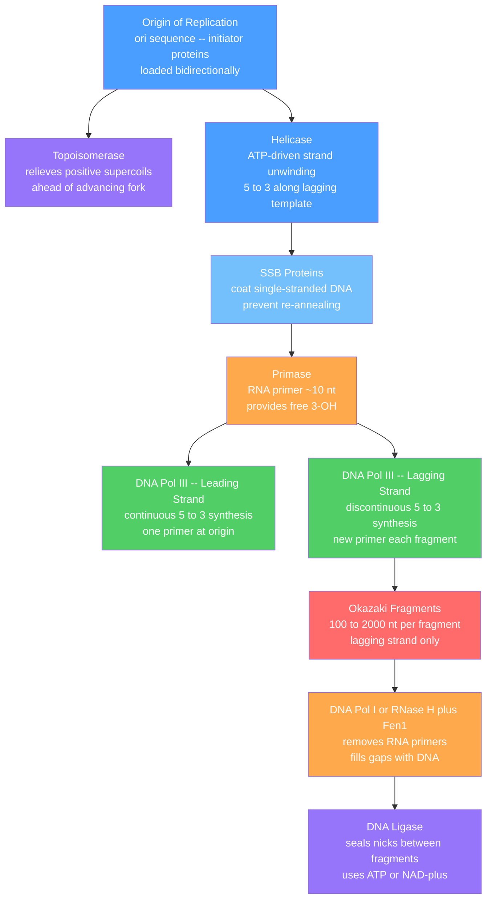

# 🧬 DNA Structure and Replication

> [!abstract] TL;DR
> DNA is a right-handed double helix in which two antiparallel strands are held together by hydrogen-bonded base pairs (A=T with 2 H-bonds, G≡C with 3) and hydrophobic base stacking, encoding hereditary information in the linear sequence of its four bases. During semiconservative replication each strand is unwound at the replication fork and used as a template to build a new complementary strand, yielding two daughter duplexes that each carry one original and one new strand. Fidelity of ~1 error per 10⁹ base pairs is achieved through the coordinated action of helicase, primase, DNA polymerases III and I, DNA ligase, and post-replicative mismatch-repair machinery.

---

## Intuition

**Analogy:** Picture a twisted rope ladder. The two side ropes are the sugar-phosphate backbones and every rung is a pair of puzzle pieces that snap together in only one way — one specific shape on the left always matches one specific shape on the right. To copy the ladder, you unzip it down the middle, separating every rung into its two halves. Then, using each half-rung as a stencil, the cell snaps matching puzzle pieces onto it — and two complete ladders appear where there was one.

The "only one correct match" rule is the foundation of genetics: adenine (A) fits only thymine (T), and guanine (G) fits only cytosine (C). Because the rule is strict, knowing the sequence of one strand is enough to reconstruct the other perfectly — which is exactly how cells copy three billion base pairs with fewer than three mistakes per division.

---

## How It Works

### Double Helix Geometry

In the canonical **B-form helix** (the dominant form under physiological ionic conditions):

- The helix is **right-handed** with a rise of **3.4 Å per base pair** and approximately **10.5 bp per full turn** (helical pitch ≈ 34 Å).
- The two polynucleotide strands run **antiparallel**: one is oriented 5'→3' top-to-bottom; its complement is oriented 3'→5' in the same direction — equivalently 5'→3' bottom-to-top.
- **Bases** are stacked in the hydrophobic interior, their planes nearly perpendicular to the helix axis. The hydrophilic sugar-phosphate backbone faces the aqueous exterior.
- The winding geometry creates two distinct grooves: the wide **major groove** (~22 Å across) and the narrow **minor groove** (~12 Å). Transcription factors and replication initiators read DNA sequence predominantly through the major groove, where the edges of base pairs are most exposed.
- **Hydrogen bonding**: A–T base pairs share **2 H-bonds**; G–C pairs share **3 H-bonds**. The extra bond means GC-rich regions melt (denature) at higher temperatures.

Other helical forms arise in different contexts: **A-form** (dehydrated DNA and DNA:RNA hybrids, right-handed, compressed) and **Z-form** (left-handed, seen at methylated CpG dinucleotides and under torsional stress, implicated in transcription regulation).

### Supercoiling and Topoisomerases

Unwinding the helix at the replication fork generates **positive supercoils** that propagate ahead of the moving fork, stiffening the DNA and eventually halting replication unless relieved. Two topoisomerase classes act:

- **Type I topoisomerases** (e.g., Topo I): introduce a transient single-strand nick, allow controlled rotation around the intact strand, then reseal. No ATP consumed. Relax both positive and negative supercoils.
- **Type II topoisomerases** (e.g., bacterial **DNA gyrase**; eukaryotic **Topo IIA**): cleave both strands simultaneously, pass an intact double-stranded segment through the break, then reseal. Consume ATP. Can introduce negative supercoils (gyrase), relax positive supercoils, and **decatenate** interlocked daughter chromosomes after replication.

**Clinical relevance**: fluoroquinolone antibiotics (ciprofloxacin) trap the gyrase-DNA cleavage complex, causing lethal double-strand breaks in bacteria. Etoposide and doxorubicin trap human Topo IIA in cancer chemotherapy.

### Nucleosome Packaging

A human cell contains ~2 m of DNA compressed into a nucleus ~6 µm across — a compaction ratio of ~300,000-fold. This is achieved hierarchically:

1. **Nucleosome core particle**: 147 bp wrapped ~1.65 times around a histone octamer (two each of H2A, H2B, H3, and H4). Linker DNA (~20–80 bp) connects adjacent nucleosomes, producing the "beads-on-a-string" 11 nm fiber.
2. **30 nm fiber**: nucleosomes fold on each other; histone H1 binds at the DNA entry/exit point and stabilizes this higher-order structure.
3. **Loop domains** (~50–100 kb loops) anchored to a protein scaffold form 300 nm chromatin fibers visible in interphase nuclei.
4. **Metaphase chromosome**: maximum compaction achieved during mitosis through further looping and coiling.

The unstructured N-terminal **histone tails** protrude from the nucleosome and are subject to combinatorial post-translational modifications (acetylation, methylation, phosphorylation, ubiquitination). These modifications — the **histone code** — regulate chromatin accessibility: lysine acetylation neutralizes positive charge, loosens DNA contact, and opens chromatin for transcription; H3K27 trimethylation marks silent heterochromatin.

### Semiconservative Replication — The Meselson-Stahl Experiment

In 1958, Meselson and Stahl grew *E. coli* in ¹⁵N medium until all DNA was uniformly heavy, then shifted cells to ¹⁴N medium. After **one generation** all DNA banded at a single **intermediate density** (one heavy, one light strand). After **two generations** two bands appeared — half intermediate, half fully light. This pattern uniquely fits the semiconservative model and disproves both the conservative model (which would produce separate heavy and light bands after generation 1) and the dispersive model (which would produce a single progressively lighter band at each generation).

**Consequence**: each daughter chromosome carries one parental template strand (whose sequence is preserved from the parent) and one newly synthesized strand. Any misincorporation in the new strand is not automatically corrected by the template — hence the necessity of proofreading and repair.

### The Replication Fork: Step-by-Step Mechanics

**Step 1 — Origin recognition.** Sequence-specific **initiator proteins** bind the **origin of replication** (ori). Bacteria have a single ori (oriC in *E. coli*). Human cells have ~350,000 potential origins licensed in G1 phase by loading of the MCM2-7 helicase complex; ~30,000–50,000 actually fire in each S-phase.

**Step 2 — Helicase loading and activation.** The bacterial **DnaB helicase** (eukaryotic: MCM2-7 activated by Cdc45 and GINS) encircles the lagging-strand template and translocates 5'→3' along it, unwinding the helix. Each fork progresses at ~500–1000 bp/s (bacteria) or ~30–50 bp/s (eukaryotes). Two divergent forks emanate from each origin in bacteria; bidirectional firing at each eukaryotic origin creates two forks that travel in opposite directions.

**Step 3 — Topoisomerase.** Runs continuously ahead of each fork, relieving accumulating positive supercoils (and, after replication, decatenating interlinked daughter chromosomes).

**Step 4 — SSB coating.** **Single-strand DNA binding proteins** (SSBs in bacteria; RPA in eukaryotes) coat the exposed single-stranded regions, preventing hairpin formation and protecting from nucleases. SSBs also serve as landing pads that recruit other replication factors.

**Step 5 — Primase.** Because all DNA polymerases require a pre-existing 3'-OH, a specialized RNA polymerase called **primase** synthesizes a short RNA primer (~5–10 nt) complementary to each template strand, providing the free 3'-OH needed to initiate DNA synthesis.

**Step 6 — DNA polymerase III (leading strand).** One primer at the origin is extended continuously by the replicative polymerase (Pol III holoenzyme in bacteria; Pol ε in eukaryotes) as the fork advances. This is the **leading strand** — synthesized 5'→3' in the same overall direction as fork movement. Synthesis is continuous and fast.

**Step 7 — DNA polymerase III (lagging strand).** The other template strand runs antiparallel to fork movement, so synthesis 5'→3' on this strand proceeds away from the fork. Primase must repeatedly lay fresh primers every ~1–2 kb on the exposed template. Pol III (Pol δ in eukaryotes) synthesizes each **Okazaki fragment** (100–200 nt in eukaryotes; ~1000–2000 nt in bacteria) back toward the previous fragment until it reaches the prior RNA primer.

**Step 8 — Primer removal and gap filling.** **DNA polymerase I** (bacteria) removes the RNA primer ahead of it using a 5'→3' exonuclease and simultaneously fills the gap with DNA. In eukaryotes, RNase H1 and Fen1 (flap endonuclease) displace and cleave the primer, with Pol δ filling the gap.

**Step 9 — Ligation.** **DNA ligase** seals the final nick (phosphodiester bond) between the 3'-OH of the newly filled gap and the 5'-phosphate of the downstream Okazaki fragment. Bacterial ligase uses NAD⁺ as cofactor; eukaryotic ligase I uses ATP.

### Proofreading

The replicative polymerase contains an intrinsic **3'→5' exonuclease** domain. After each nucleotide insertion, the polymerase senses base-pair geometry: a mismatch distorts the active site, stalls translocation, and the primer terminus is transferred to the exonuclease domain for excision. Extension then resumes. This proofreading reduces the intrinsic misincorporation rate from ~10⁻⁵ to ~10⁻⁷ per base. Combined with post-replicative **mismatch repair** (MMR, involving MutS/MutL/MutH in bacteria; MSH2-MSH6, MLH1-PMS2 in humans), total fidelity reaches ~10⁻⁹ to 10⁻¹⁰ per base per division.

### Telomeres and Telomerase

Linear eukaryotic chromosomes face the **end-replication problem**: after the terminal RNA primer on the lagging strand is removed, the resulting 3' overhang cannot be filled because there is no upstream fragment to serve as a primer. Each division therefore shortens chromosomes by ~50–200 bp — a counting mechanism for cellular aging.

**Telomeres** — TTAGGG hexanucleotide repeats (5–15 kb in humans) capping chromosome ends — buffer coding sequences from this erosion. The **shelterin** complex (TRF1, TRF2, POT1, TIN2, TPP1, RAP1) protects telomeres from being recognized as double-strand breaks and regulates telomerase access.

**Telomerase** is a ribonucleoprotein reverse transcriptase. Its RNA subunit (hTR, 451 nt) contains the template sequence 3'-AAUCCC-5'. The catalytic protein subunit (hTERT) reverse-transcribes this template onto the 3' overhang to add TTAGGG repeats, then translocates and repeats — processive repeat-addition mode. Conventional replication then fills in the complementary C-strand. Telomerase is active in germ cells, stem cells, and most cancers; silenced in most somatic cells, imposing the Hayflick replication limit (~50–70 divisions).

### Replication Fork Diagram



---

## Key Concepts

### Secondary Level

**The four bases and complementarity.** DNA uses four nitrogen-containing bases — **A**denine, **T**hymine, **G**uanine, **C**ytosine. Pairing is strict: A with T (two hydrogen bonds), G with C (three hydrogen bonds). Because the pairing rule is fixed, each strand is the unique complement of the other. This complementarity is the physical mechanism by which genetic information is both stored and copied.

**The phosphodiester backbone.** Each nucleotide consists of a deoxyribose sugar bonded to a phosphate group and a nitrogenous base. Phosphate links the 3'-carbon of one sugar to the 5'-carbon of the next, giving the strand a chemical direction: a free 5'-phosphate end and a free 3'-hydroxyl end. All synthesis runs 5'→3'.

**Why two strands?** A double-stranded molecule is far more stable than a single strand. More importantly, damage to one strand can be repaired using the opposite strand as an error-free guide — a feature exploited by base-excision repair, nucleotide-excision repair, and mismatch repair.

**Semiconservative copying.** Each of the two resulting daughter duplexes inherits one parental strand (the template) and acquires one new strand. This was proven by the Meselson-Stahl ¹⁵N/¹⁴N isotope-labelling experiment.

### Undergraduate Level

**B-form geometry (quantitative summary).**

| Parameter | Value |
|-----------|-------|
| Rise per base pair | 3.4 Å |
| Bases per helical turn | ~10.5 |
| Helical pitch | ~34 Å |
| Helix diameter | ~20 Å |
| Major groove width | ~22 Å |
| Minor groove width | ~12 Å |

**Melting temperature — empirical formula.** The temperature at which 50% of a population of duplexes is single-stranded under a given set of conditions:

$$T_m \approx 81.5 + 16.6\log_{10}[\text{Na}^+] + 0.41\,(\%GC) - \frac{675}{n}$$

where $[\text{Na}^+]$ is the sodium concentration in molar, $\%GC$ is the percentage of G and C base pairs in the duplex, and $n$ is the duplex length in base pairs. The three terms capture:
- **GC effect**: each G–C pair contributes 3 H-bonds vs. 2 for A–T, raising stability.
- **Salt effect**: Na⁺ and Mg²⁺ shield the negatively charged phosphate backbone from electrostatic self-repulsion, stabilizing the duplex.
- **Length effect**: longer duplexes have proportionally fewer end-effects; $T_m$ rises and asymptotes above ~500 bp.

For short oligonucleotides (<14 nt) the simpler **Wallace rule** is used: $T_m = 2(A+T) + 4(G+C)$ °C.

**Replication accuracy — three tiers.**

| Stage | Approximate error rate per base |
|-------|--------------------------------|
| Intrinsic polymerase fidelity | ~10⁻⁵ |
| After 3'→5' proofreading | ~10⁻⁷ |
| After mismatch repair | ~10⁻⁹ to 10⁻¹⁰ |

**The priming problem.** All DNA polymerases require a free 3'-OH to extend — they cannot initiate a strand de novo. Only **primase** (a specialized RNA polymerase) can initiate, producing the short RNA primer that supplies the 3'-OH. This primer is later removed and replaced with DNA.

**Trombone model of the replisome.** The leading-strand and lagging-strand polymerases are physically coupled in the **replisome**. The lagging-strand template is looped back (forming a "trombone loop") so both polymerases move in the same direction as overall fork advancement. When a lagging-strand polymerase finishes an Okazaki fragment, it releases the loop and re-engages a newly primed site without dissociating from the replisome.

### Graduate Level

**Origin firing — stochastic and cell-type-regulated.** The ~350,000 MCM-licensed potential origins in a human G1 cell are not equivalent: only ~10–15% fire in any given S-phase. Firing requires sequential kinase activation:
- **CDK2/Cyclin E and CDK2/Cyclin A** phosphorylate MCM2, Cdc6, Treslin, and RecQL4.
- **DDK (Dbf4-dependent kinase, Cdc7-Dbf4)** phosphorylates MCM4 and MCM6, recruiting Cdc45 and GINS (the CMG helicase activating complex).

Dormant origins serve as replication-stress backup. When active forks stall (e.g., at nucleotide depletion, DNA damage, or tightly bound proteins), ATR kinase signaling normally suppresses dormant origin firing to conserve dNTP pools. When ATR is compromised (as in early oncogenesis), spurious origin firing depletes dNTPs, causing replication stress — a key mechanism of oncogene-induced genomic instability.

**Replication timing domains.** The human genome is replicated in a defined temporal programme: open, gene-rich euchromatin in **early S-phase**; compact, gene-poor heterochromatin in **late S-phase**. Timing correlates with lamina-association (late) and H3K27ac/H3K4me3 marks (early). The timing programme is cell-type-specific and partially reset after mitosis; its disruption in cancer cells correlates with copy-number variation patterns.

**Translesion synthesis (TLS).** When the replicative polymerase stalls at a damaged template (UV-induced cyclobutane pyrimidine dimer, oxidized base), monoubiquitination of the PCNA sliding clamp by the RAD6-RAD18 E3 ligase recruits specialized **TLS polymerases** (Pol η, Pol ι, Pol κ, Rev1). These have more open active sites tolerating distorted templates, but with fidelity of only ~10⁻²–10⁻³. Pol η is notable: it inserts two A's across a TT dimer — error-free bypass — and loss of Pol η causes xeroderma pigmentosum variant (XPV).

**Telomerase mechanism and shelterin.** Telomerase is a reverse transcriptase ribonucleoprotein. The RNA subunit (hTR) base-pairs its 3'-AAUCCC template with the 3' telomeric overhang (TTAGGG)ₙ. hTERT catalyzes 6 nt of extension, then **translocates** — the RNA template repositions to allow the next cycle of addition. This repeat-addition processivity is controlled by auxiliary factors (TCAB1, dyskerin, TCOF1). The **shelterin** complex (TRF1/2, POT1, TIN2, TPP1, RAP1) caps the telomere: TRF2 prevents ATM-kinase activation at chromosome ends; POT1 suppresses ATR; TIN2 bridges TRF1/TRF2 with TPP1-POT1. Loss of TRF2 triggers DNA-damage signaling, chromosome fusions, and senescence. Mutations in hTERT, hTR, or dyskerin cause **dyskeratosis congenita** (premature aging, bone marrow failure).

---

## Python Demo

```python
# pip install numpy matplotlib
import numpy as np
import matplotlib.pyplot as plt

np.random.seed(42)

def make_genome(regions):
    """Build a synthetic DNA string from (length, gc_fraction) region tuples."""
    bases = []
    gc_pool = ['G', 'C']
    at_pool = ['A', 'T']
    for length, gc_frac in regions:
        for _ in range(length):
            if np.random.random() < gc_frac:
                bases.append(np.random.choice(gc_pool))
            else:
                bases.append(np.random.choice(at_pool))
    return ''.join(bases)

# Three-region genome: AT-rich origin-like zone, GC-rich CpG island, mixed coding region
genome = make_genome([
    (500, 0.35),   # AT-rich -- typical replication origin vicinity
    (500, 0.65),   # GC-rich -- CpG island near gene promoter
    (500, 0.50),   # mixed  -- average coding sequence
])

def sliding_gc(seq, window=100, step=None):
    """Return midpoint positions and GC% for overlapping windows."""
    if step is None:
        step = window // 2
    positions, gc_vals = [], []
    for i in range(0, len(seq) - window + 1, step):
        w = seq[i:i + window]
        gc = 100.0 * (w.count('G') + w.count('C')) / len(w)
        positions.append(i + window // 2)
        gc_vals.append(gc)
    return np.array(positions), np.array(gc_vals)

def empirical_tm(seq, na_molar=0.05):
    """
    Marmur-Schildkraut-Doty empirical Tm for long duplexes:
        Tm = 81.5 + 16.6*log10[Na+] + 0.41*(%GC) - 675/n
    Valid for n > 100 bp and standard aqueous conditions.
    """
    n = len(seq)
    gc_pct = 100.0 * (seq.count('G') + seq.count('C')) / n
    tm = 81.5 + 16.6 * np.log10(na_molar) + 0.41 * gc_pct - 675.0 / n
    return tm, gc_pct

# Compute sliding-window GC profile
pos, gc_prof = sliding_gc(genome, window=100, step=25)

# Region-level Tm estimates
regions = [
    ('AT-rich\n0-500 bp',    genome[:500]),
    ('GC-rich\n500-1000 bp', genome[500:1000]),
    ('Mixed\n1000-1500 bp',  genome[1000:]),
]

fig, axes = plt.subplots(2, 1, figsize=(10, 7))

# --- Panel 1: GC content profile ---
axes[0].plot(pos, gc_prof, color='steelblue', lw=1.5, label='GC content')
axes[0].axhline(50, color='gray', linestyle='--', alpha=0.6, label='50% baseline')
axes[0].fill_between(pos, gc_prof, 50,
                     where=(gc_prof > 50), alpha=0.25, color='tomato', label='GC-rich')
axes[0].fill_between(pos, gc_prof, 50,
                     where=(gc_prof <= 50), alpha=0.25, color='steelblue', label='AT-rich')
axes[0].axvline(500, color='black', linestyle=':', lw=1, alpha=0.6)
axes[0].axvline(1000, color='black', linestyle=':', lw=1, alpha=0.6)
axes[0].set_ylabel('GC Content (%)')
axes[0].set_xlabel('Genomic position (bp)')
axes[0].set_title('Sliding-Window GC Content (window = 100 bp, step = 25 bp)')
axes[0].legend(fontsize=8, loc='upper left')
axes[0].set_ylim(0, 100)

# --- Panel 2: Estimated Tm per region ---
names = [r[0] for r in regions]
tms   = [empirical_tm(r[1])[0] for r in regions]
gcs   = [empirical_tm(r[1])[1] for r in regions]
colors = ['steelblue', 'tomato', 'mediumseagreen']
x = np.arange(len(names))

bars = axes[1].bar(x, tms, color=colors, alpha=0.85, edgecolor='white')
axes[1].set_xticks(x)
axes[1].set_xticklabels(names, fontsize=9)
axes[1].set_ylabel('Estimated Tm (°C)')
axes[1].set_title('Melting Temperature by Region  --  50 mM NaCl')
axes[1].set_ylim(min(tms) - 5, max(tms) + 5)

for bar, gc_val in zip(bars, gcs):
    axes[1].text(
        bar.get_x() + bar.get_width() / 2,
        bar.get_height() + 0.2,
        f'{gc_val:.1f}% GC',
        ha='center', va='bottom', fontsize=9
    )

plt.tight_layout()
plt.show()
```

---

## Real-World Applications

**PCR (Polymerase Chain Reaction).** PCR reconstitutes the strand-separation and polymerase-extension steps in a thermocycler. Denaturation (~95°C) separates strands; annealing (~55–65°C) hybridizes specific primers; extension (72°C, Taq polymerase) replicates the target segment. Each cycle doubles the copy count — 30 cycles yield ~10⁸-fold amplification. RT-PCR first converts RNA to cDNA using reverse transcriptase; this underpins COVID-19 diagnostics, viral load monitoring, and expression profiling. Primer Tm design applies the empirical formula directly.

**Sanger Sequencing.** Chain-terminating dideoxynucleotides (ddNTPs) lack a 3'-OH and halt extension when incorporated. Running four reactions (each spiked with one fluorescent-labelled ddNTP) and resolving products by capillary electrophoresis reads the sequence from the order of termination events. This is the direct experimental embodiment of 5'→3' synthesis directionality. Automated Sanger sequencing drove the Human Genome Project (draft 2001, completed 2003).

**Cancer and Replication Infidelity.** Germline loss-of-function in **MMR genes** (MLH1, MSH2, MSH6, PMS2) causes Lynch syndrome, conferring ~80% lifetime colorectal cancer risk; somatic MMR inactivation occurs in ~15% of sporadic colorectal cancers, producing microsatellite instability (MSI-H). Mutations in the 3'→5' exonuclease domain of **DNA polymerase epsilon** (POLE) create "ultramutator" tumors with >100 mutations per Mb. **BRCA1/2** mutations impair homologous recombination repair of stalled replication forks, predisposing to breast and ovarian cancers and creating synthetic lethality with PARP inhibitors.

**Telomerase in Aging and Cancer.** Most somatic cells lack telomerase; progressive shortening limits division to ~50–70 cycles (Hayflick limit). When telomeres reach a critical short length, p53-mediated senescence or apoptosis is triggered — a tumour-suppression mechanism. Cells that escape senescence with dysfunctional telomeres undergo breakage-fusion-bridge cycles and genome instability. Approximately 85–90% of cancers reactivate hTERT to bypass this limit. Conversely, germline hTERT or hTR mutations cause **dyskeratosis congenita**, characterised by premature aging, aplastic anaemia, and pulmonary fibrosis from stem cell exhaustion. Telomerase inhibitors (imetelstat) are in clinical development for myelofibrosis and haematological cancers.

---

## Common Pitfalls

- **Reversing template and synthesis direction.** DNA polymerase reads its template **3'→5'** and synthesises the new strand **5'→3**. Students frequently swap these. Mnemonics: the polymerase "builds from the 5' end toward the 3' end" of the new strand; equivalently, it "reads backward along the template."
- **Assuming both strands are copied identically.** Only the leading strand is synthesised as one continuous piece. The lagging strand requires a fresh RNA primer for every Okazaki fragment, making it fundamentally different in mechanism and involving additional enzymes (primase, Pol I/RNase H, ligase) not needed for the leading strand alone.
- **Confusing proofreading with mismatch repair.** Proofreading is the polymerase's intrinsic 3'→5' exonuclease acting during synthesis — it operates in microseconds at the active site. Mismatch repair is a separate post-replicative enzyme cascade (MutS/MutL/MutH or MSH/MLH proteins) that scans newly replicated DNA minutes to hours later. They are complementary but mechanistically distinct.
- **Believing all origins fire at the start of S-phase.** Human replication follows a defined temporal programme across 6–8 hours of S-phase. Early-firing origins are in accessible euchromatin; late-firing origins are in heterochromatin. This is regulated, cell-type-specific, and biologically consequential — not a single synchronous start event.

---

## Related Concepts

- [[_MOC_Molecular_Genetics|↑ Molecular Genetics MOC]]
- [[Biomolecules_Overview]] — covers nucleotides as one of the four major biomolecule classes; sugar chemistry and phosphate backbone context
- [[Protein_Structure_and_Function]] — histones, DNA polymerases, topoisomerases, and repair enzymes are all proteins; their fold explains sequence-specific DNA recognition
- [[Nucleic_Acids_and_the_Central_Dogma]] — broader treatment of DNA and RNA together; covers transcription, translation, and the genetic code downstream of replication
- [[Electrochemistry]] — electrostatic interactions between phosphate backbone charges and cations are central to DNA stability, Tm, and how salt concentration modulates hybridisation
- [[Transcription_and_RNA_Processing]] — the next step in information flow: RNA polymerase reads the replicated DNA template to produce mRNA and non-coding RNAs
- [[Gene_Regulation_and_Epigenetics]] — histone modifications laid down during and after replication determine which origins fire, which genes are accessible, and how cell identity is maintained across divisions

---

## Review Questions

1. **Secondary** — Sketch the replication fork and label helicase, primase, leading strand, lagging strand, one Okazaki fragment, DNA ligase, and SSB proteins. In one sentence, explain why the lagging strand cannot be copied as a single continuous molecule.

2. **Undergraduate** — A 300-bp duplex from a CpG island has 68% GC content. Using the empirical Tm formula, calculate its melting temperature at 50 mM NaCl. Now predict how Tm changes if: (a) the salt concentration is raised to 150 mM NaCl; (b) the duplex is shortened to 50 bp; (c) a 5-bp insertion of pure AT sequence is introduced. Show your working.

3. **Graduate** — Explain the origin licensing and firing cycle in human S-phase: which kinases activate dormant MCM complexes, how does the cell prevent re-replication within a single cell cycle, and how does oncogene-driven replication stress exploit dormant origins to cause genome instability? Connect your answer to why BRCA2-deficient cells show copy-number aberrations even before selection for cancer driver mutations.

---

## Sources

- Watson, J.D. et al. — *Molecular Biology of the Gene*, 7th ed. (Cold Spring Harbor Laboratory Press, 2014), Ch. 9–11
- Alberts, B. et al. — *Molecular Biology of the Cell*, 7th ed. (W.W. Norton, 2022), Ch. 5
- Lodish, H. et al. — *Molecular Cell Biology*, 9th ed. (Macmillan Learning, 2021), Ch. 4, 7
- Meselson, M. & Stahl, F.W. (1958) — "The Replication of DNA in *Escherichia coli*," *PNAS* 44, 671–682

---

#Genetics #MolecularGenetics #DNA #Replication
