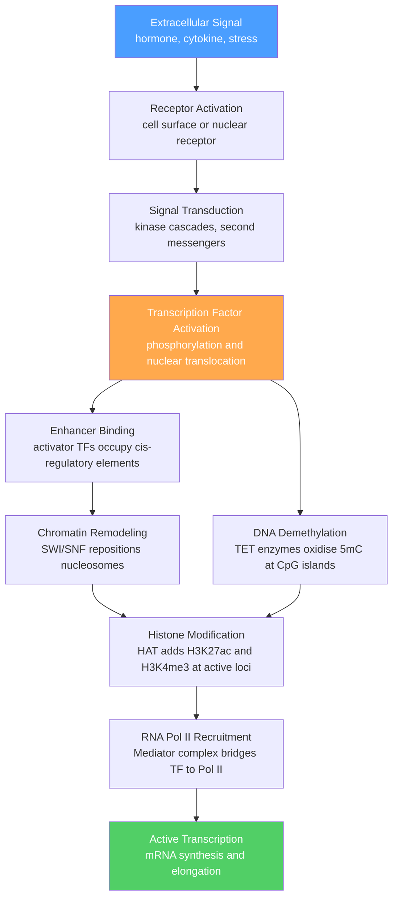

# Gene Regulation and Epigenetics

> [!abstract] TL;DR
> Gene regulation controls *which* genes are expressed in each cell type, developmental stage, and environmental condition; epigenetics adds heritable chemical marks to DNA and histones that alter chromatin accessibility without changing the underlying nucleotide sequence. Together they explain how a single genome can encode 200+ distinct cell types and respond dynamically to signals over a lifetime.

## Intuition — analogy FIRST

Think of gene expression as a **light dimmer switch**, not a light switch. A cell does not simply flip a gene on or off; it slides the output from silent to low hum to full brightness depending on the combination of transcription factors, chromatin state, and signaling context present at that moment. The same light bulb (gene) in a skin cell runs dim; in a pancreatic beta cell it burns at full power — same wiring, different dimmer settings.

Epigenetics is the **Post-it note system on the DNA instruction manual**. The 3-billion-letter text in your genome never changes, but the cell plasters sticky notes on certain pages — "skip this chapter," "read this chapter twice," "bookmark here." A liver cell and a neuron have identical books but radically different Post-it arrangements. Crucially, when the cell divides, the daughter cells inherit the Post-it arrangement along with the book — that is epigenetic inheritance.

---

## How It Works

### Signal-to-Transcription Flow



---

## Key Concepts / Details

### Secondary Level

**Why do cells need gene regulation?** Every cell in a human body carries the same ~20,000 genes, yet a muscle cell looks and behaves nothing like a neuron. The difference is not sequence — it is which genes are expressed, at what level, and when. Gene regulation is the set of molecular mechanisms that implement these cell-type-specific expression programmes.

**Cis-regulatory elements (the addresses on the DNA):**

| Element | Location relative to gene | Role |
|---------|--------------------------|------|
| Promoter | Just upstream of TSS (~−100 to TSS) | Binding site for RNA Pol II and general TFs |
| Enhancer | Can be kb to Mb away from target gene | Boosts transcription; orientation-independent |
| Silencer | Variable distance | Represses transcription |
| Insulator | Between enhancer and gene it must not regulate | Blocks aberrant enhancer-promoter crosstalk |

**Transcription factors (TFs):** Proteins that bind specific short DNA sequences (6–12 bp motifs) and recruit or block the transcription machinery. An **activator** recruits co-activators and RNA Pol II. A **repressor** competes for the same site or recruits co-repressors that silence the locus. Cells interpret gene activity as the sum of all TFs bound at a given moment — combinatorial logic, not one TF = one gene.

**Epigenetics — two chemical layers:**
1. **DNA methylation** — a methyl group added to the 5-carbon of cytosine in CpG dinucleotides. Heavily methylated genes are generally silent.
2. **Histone modifications** — the tails of histone proteins protruding from the nucleosome core are decorated with acetyl, methyl, phosphate, or ubiquitin groups that either open or compact chromatin.

---

### Undergraduate Level

**Cis-regulatory elements in depth:**

*Promoters* contain the **TATA box** (~−25), the Inr element, and binding sites for general transcription factors (TFIID, TFIIB etc.) that recruit RNA Pol II to form the pre-initiation complex (PIC). Core promoter elements are necessary but not sufficient — they produce only basal transcription without enhancers.

*Enhancers* act as signal integration hubs. A single enhancer can receive inputs from 10–20 different TFs simultaneously; the resulting output is not additive but combinatorial (**enhanceosome model**). Enhancers are defined operationally by active chromatin marks: **H3K27ac** (histone 3, lysine 27 acetylated) marks active enhancers; **H3K4me1** marks poised (primed but inactive) enhancers.

*Insulators* (e.g., CTCF-binding sites) block enhancer activity when placed between an enhancer and a target promoter. CTCF also anchors topologically associating domains (TADs) in 3D genome organisation (see Graduate section).

**Trans-acting factors:**

- **Signal-dependent TFs — nuclear receptors:** Steroid hormones (cortisol, estrogen, testosterone) diffuse through the membrane and bind intracellular receptors that translocate to the nucleus and bind hormone response elements (HREs) directly. Ligand binding changes receptor conformation to expose a transactivation domain.
- **Signal-dependent TFs — NF-κB:** In the cytoplasm, NF-κB is held inactive by IκB. Pro-inflammatory signals activate IKK kinase, which phosphorylates IκB → ubiquitination → proteasomal degradation → NF-κB released → nuclear translocation → cytokine gene activation.
- **Co-activators and co-repressors:** TFs rarely act alone. Co-activators (CBP/p300, Mediator) bridge sequence-specific TFs to the basal machinery and carry **histone acetyltransferase (HAT)** activity. Co-repressors (NCoR, SMRT) recruit **histone deacetylases (HDACs)** that remove acetyl marks and compact chromatin.

**Chromatin remodeling — SWI/SNF:**
The SWI/SNF family (BAF complex in mammals) uses ATP hydrolysis to slide, eject, or restructure nucleosomes. By evicting a nucleosome from a promoter or enhancer, it exposes TF binding sites previously wrapped around the histone octamer. SWI/SNF subunits are among the most frequently mutated genes in human cancer (~20% of all cancers carry a SWI/SNF mutation).

**Histone modification code:**

| Mark | Writer | Eraser | Functional outcome |
|------|--------|--------|-------------------|
| H3K4me3 | MLL/SET1 | KDM5 | Active gene promoters |
| H3K27ac | p300/CBP | HDAC1/2 | Active enhancers and promoters |
| H3K27me3 | PRC2 (EZH2) | KDM6A/B | Polycomb repression |
| H3K9me3 | SUV39H1 | KDM4 | Constitutive heterochromatin |
| H3K4me1 | MLL3/4 | KDM1A | Poised / active enhancers |

"Writers" add the mark; "erasers" remove it; "readers" (bromodomains, chromodomains, PHD fingers) interpret the mark to recruit further effectors.

**DNA methylation machinery:**

- **DNMT3a / DNMT3b**: *de novo* methyltransferases — establish new methylation patterns during development and in differentiated cells.
- **DNMT1**: maintenance methyltransferase — copies the parental methylation pattern onto the newly synthesised strand after replication (uses hemi-methylated DNA as a substrate, ensuring epigenetic inheritance).
- **TET1/2/3**: oxidise 5-methylcytosine (5mC) → 5-hydroxymethylcytosine (5hmC) → 5-formylcytosine → 5-carboxylcytosine, driving active demethylation via base excision repair.

*CpG islands*: ~2 kb stretches of CpG-dense, methylation-free DNA that overlap the promoters of ~60% of human genes. When CpG islands become aberrantly methylated (as in cancer), the associated gene is silenced — a key mechanism in tumour suppressor silencing.

**Polycomb and Trithorax systems:**

- **PRC2** (Polycomb Repressive Complex 2): Contains EZH2, which writes H3K27me3, establishing large repressive domains over developmental gene clusters (Hox genes, lineage-specific TFs not needed in the current cell type).
- **PRC1**: Recognises H3K27me3 (via CBX proteins), adds H2AK119ub1 (monoubiquitination of histone H2A), and physically compacts chromatin.
- **Trithorax group (TrxG)**: Antagonises Polycomb; MLL/SET1 complexes write H3K4me3 to maintain active transcription of developmental regulators. The Polycomb/Trithorax balance governs cell fate decisions throughout development.

**Non-coding RNAs:**

| Class | Size | Mechanism | Example |
|-------|------|-----------|---------|
| miRNA | ~22 nt | Loaded into RISC; seed sequence (nt 2–8) base-pairs 3'UTR of target mRNA → translational repression or mRNA cleavage | miR-21 (oncomiR) |
| siRNA | ~21 nt | Perfect complementarity to target → AGO2-mediated mRNA slicing; also triggers heterochromatin via RITS complex | RNAi knockdown tools |
| lncRNA | >200 nt | Scaffolds for chromatin complexes; decoys; nuclear organisation | Xist (X inactivation), HOTAIR (Hox silencing) |

**Xist** coats the inactive X chromosome in cis, recruiting PRC2 to spread H3K27me3 over the entire chromosome — the paradigm for epigenetic gene silencing at the chromosome scale. **HOTAIR** is transcribed from the HOXC locus and in trans represses HOXD genes by scaffolding PRC2 and LSD1/CoREST complexes.

**Hill equation for TF binding cooperativity:**

When *n* TF molecules must bind cooperatively to activate a gene, the dose-response follows a sigmoid:

$$\text{Output} = \frac{[\text{TF}]^n}{K_d^n + [\text{TF}]^n}$$

where $n$ is the Hill coefficient (cooperativity) and $K_d$ is the dissociation constant. High $n$ (e.g., 2–5) produces a switch-like, bistable response — the gene is nearly silent below a threshold [TF] and nearly fully on above it. This bistability is used in developmental patterning (e.g., bicoid gradient activating hunchback in Drosophila with $n \approx 5$) and in cellular memory circuits where a gene's own product reinforces its expression.

---

### Graduate Level

**Phase separation and transcriptional condensates:**

Super-enhancers — clusters of enhancers spanning tens of kilobases — concentrate TFs and Mediator at levels that exceed solubility thresholds, driving **liquid-liquid phase separation** into membrane-less condensates. These transcriptional condensates, first described by Hnisz et al. (2017) and Boija et al. (2018), concentrate activators (e.g., OCT4, MYC) and the Mediator co-activator through intrinsically disordered region (IDR) interactions. Condensates exhibit properties distinct from simple protein-DNA interactions: they are dissolved by 1,6-hexanediol (disrupts weak hydrophobic interactions), they exchange components dynamically (FRAP recovery within seconds), and they are selectively enriched for activated forms of RNA Pol II (phospho-Ser5 CTD for initiation; phospho-Ser2 CTD for elongation). Whether phase separation is causal or merely correlative with transcriptional bursting remains an active debate.

**Enhancer-promoter 3D looping and TADs:**

The linear distance along chromatin is a poor predictor of regulatory interactions. Hi-C chromosome conformation capture has revealed that mammalian genomes are partitioned into **Topologically Associating Domains (TADs)** — self-interacting regions of ~0.1–1 Mb separated by boundary elements bound by CTCF and cohesin. Within a TAD, enhancers loop to promoters via cohesin-mediated extrusion (the **loop extrusion model**: cohesin translocates along chromatin until it encounters convergent CTCF sites, forming a loop). Mutations that delete CTCF boundaries can place oncogenes within the TAD of powerful enhancers — a mechanism of cancer-relevant structural variation. Distance-normalised enhancer-promoter contact frequencies (from Micro-C at nucleosome resolution) correlate strongly with transcriptional output, providing a quantitative link between genome topology and gene expression.

**Epigenetic inheritance across cell divisions:**

DNMT1 perpetuates DNA methylation with >95% fidelity per replication event by recognising hemi-methylated CpG dinucleotides. For histone marks, the mechanism is less clear: current evidence supports a **read-write** model in which histone modifying enzymes are recruited to the newly deposited nucleosomes by reading the mark on the parental octamer (e.g., PRC2 is stimulated by existing H3K27me3 to methylate adjacent newly incorporated histones). For H3K9me3/HP1-mediated heterochromatin, the HP1 protein bridges parental and daughter nucleosomes, seeding re-methylation by SUV39H1.

**Trans-generational epigenetics:**

In canonical germline reprogramming, the fertilised embryo undergoes two waves of epigenetic erasure: first at fertilisation (paternal genome is rapidly demethylated by TET3-driven oxidation; maternal genome demethylates passively over cleavage), then at the primordial germ cell stage. Some loci, however, **resist erasure** — notably imprinted gene DMRs and certain retrotransposon classes. Epidemiological studies in humans (Dutch Hunger Winter, Överkalix cohort) and mechanistic studies in *C. elegans* and mice demonstrate that ancestral environment (nutrition, stress, toxins) can alter offspring phenotype through incompletely reprogrammed epigenetic marks. The molecular carriers remain debated: small RNAs (piRNAs) in sperm, residual histone variants (H3.3, H2A.Z) retained in sperm at developmentally regulated promoters, and chemical modifications to sperm-borne tRNA fragments are all implicated.

---

## Python Demo

```python
# pip install numpy matplotlib
import numpy as np
import matplotlib.pyplot as plt

# Two-state (telegraph) stochastic gene expression model
# Promoter switches between OFF and ON states:
#   OFF -> ON  at rate k_on  (min^-1)
#   ON  -> OFF at rate k_off (min^-1)
# mRNA is produced at rate k_prod when the promoter is ON
# mRNA is degraded at rate k_deg regardless of promoter state

np.random.seed(42)

k_on   = 0.05   # min^-1 — rate of promoter activation
k_off  = 0.10   # min^-1 — rate of promoter silencing
k_prod = 2.0    # min^-1 — mRNA synthesis rate (promoter ON)
k_deg  = 0.20   # min^-1 — mRNA degradation rate

n_simulations = 500
t_end         = 200     # minutes — run time per cell
dt            = 0.5     # minutes — Euler step size

n_steps      = int(t_end / dt)
final_counts = []

for _ in range(n_simulations):
    state = 0   # promoter starts OFF
    mrna  = 0   # no mRNA at t = 0
    for _ in range(n_steps):
        # Stochastic promoter switching (Bernoulli approximation)
        if state == 0:
            if np.random.rand() < k_on * dt:
                state = 1
        else:
            if np.random.rand() < k_off * dt:
                state = 0
        # mRNA production (Poisson) and degradation (Binomial)
        produced   = np.random.poisson(k_prod * state * dt)
        degraded   = np.random.binomial(mrna, min(k_deg * dt, 1.0))
        mrna       = max(0, mrna + produced - degraded)
    final_counts.append(mrna)

# Theoretical steady-state mean: mean_mrna = (k_on/(k_on+k_off)) * (k_prod/k_deg)
mean_theory = (k_on / (k_on + k_off)) * (k_prod / k_deg)

fig, ax = plt.subplots(figsize=(8, 4))
ax.hist(final_counts, bins=30, color='steelblue', edgecolor='white', alpha=0.85)
ax.axvline(
    np.mean(final_counts), color='tomato', lw=2,
    label=f'Simulated mean = {np.mean(final_counts):.1f}'
)
ax.axvline(
    mean_theory, color='gold', lw=2, ls='--',
    label=f'Theoretical mean = {mean_theory:.1f}'
)
ax.set_xlabel('mRNA copy number at steady state (per cell)')
ax.set_ylabel('Number of simulated cells')
ax.set_title('Two-State Promoter Model — stochastic mRNA distribution')
ax.legend()
plt.tight_layout()
plt.show()

# The distribution is often bimodal when k_on is slow relative to k_off —
# cells spend most time either fully off (mRNA ~ 0) or in a burst phase.
# This matches single-cell RNA-seq observations of transcriptional bursting.
```

The bimodal shape that emerges when $k_{off} > k_{on}$ mirrors **transcriptional bursting** measured by single-molecule FISH and single-cell RNA-seq: individual cells have highly variable mRNA counts even in a genetically identical population, with most cells near zero and a minority in a high-expression state. Epigenetic marks modulate burst frequency ($k_{on}$) and burst size ($k_{prod}$) rather than simply toggling gene expression.

---

## Real-World Applications

**Cancer epigenomics and epigenetic therapy:**
Tumour cells accumulate two complementary epigenetic lesions: global *hypomethylation* (reactivating retrotransposons and proto-oncogenes) and focal *hypermethylation* of CpG island promoters of tumour suppressor genes (e.g., MLH1, CDKN2A/p16, BRCA1). This makes the epigenome an actionable drug target:
- **DNMT inhibitors** (5-azacytidine / azacitidine, decitabine): incorporate into DNA, trap DNMT1, and cause passive demethylation over replication cycles. Approved for myelodysplastic syndrome (MDS) and AML.
- **HDAC inhibitors** (vorinostat, romidepsin, panobinostat): block histone deacetylation, re-open compacted chromatin at silenced tumour suppressor loci, and restore their expression. Approved for cutaneous T-cell lymphoma and multiple myeloma.
- **EZH2 inhibitors** (tazemetostat): target the PRC2 catalytic subunit; approved for epithelioid sarcoma and follicular lymphoma bearing EZH2 gain-of-function mutations.

**Genomic imprinting disorders:**
A subset of genes is monoallelically expressed from only the maternal or paternal chromosome — controlled by parent-of-origin-specific DNA methylation at **imprinting control regions (ICRs)**. The SNRPN locus on chromosome 15q11-q13 controls a cluster of imprinted genes:
- Loss of the paternal allele (or maternal UPD) → **Prader-Willi syndrome** (hyperphagia, hypogonadism, intellectual disability) — paternally expressed genes SNRPN and snoRNAs are absent.
- Loss of the maternal allele (or paternal UPD) → **Angelman syndrome** (ataxia, seizures, absent speech, happy demeanour) — maternally expressed UBE3A is absent in neurons (where the paternal copy is imprinted).

**Developmental reprogramming (iPSCs):**
Yamanaka's 2006 discovery that four TFs (OCT4, SOX2, KLF4, MYC) can reprogram a differentiated fibroblast back to pluripotency works by erasing the somatic epigenetic landscape and reinstalling the pluripotency-associated pattern (high H3K4me3 at pluripotency genes, Polycomb-mediated bivalency at lineage-specific loci). The efficiency is low (~0.01–1%) because epigenetic barriers — particularly H3K9me3 heterochromatin at key pluripotency loci — resist reactivation. Vitamin C (ascorbate) enhances reprogramming by stimulating TET enzyme activity, accelerating 5mC oxidation and demethylation of pluripotency gene promoters.

**Epigenetic clocks and aging:**
The Horvath clock (2013) uses DNA methylation levels at 353 CpG sites to predict chronological age with a median absolute error of 3.6 years across diverse tissues and cell types. Clock sites are enriched at Polycomb-regulated loci and overlap with developmentally dynamic CpG islands — suggesting that aging involves progressive drift in the epigenetic programme that maintains differentiated cell identity. Epigenetic age acceleration (biological age > chronological age) predicts all-cause mortality, cancer risk, and cardiovascular disease independently of other risk factors, making the epigenome a candidate biomarker and therapeutic target for aging.

---

## Common Pitfalls

- **Conflating epigenetic marks with genetic mutations.** Epigenetic marks are chemically heritable but reversible; they do not change the DNA sequence. A methylated CpG is not a C→T transition (though unmethylated CpGs do deaminate to T over evolutionary time, creating mutational hotspots). In cancer, aberrant methylation silences a tumour suppressor *functionally* but the gene itself is intact and can be re-expressed by demethylating drugs — unlike a deletion.
- **Assuming all CpG methylation is repressive.** Methylation at a gene body is often *positively* correlated with transcription (it may suppress cryptic intragenic promoters and repetitive element transcription). Only promoter-region CpG island methylation is consistently repressive. Stating "methylation = silence" without specifying context is an oversimplification.
- **Confusing chromatin remodeling with histone modification.** Chromatin remodeling (SWI/SNF, ISWI, CHD, INO80 families) uses ATP to physically move nucleosomes. Histone modification (HATs, HDACs, HMTs, HDMs) adds or removes chemical groups to histone tails. Both influence accessibility, but the mechanism and enzymatic machinery are entirely distinct; treating them interchangeably is incorrect.
- **Mis-specifying the miRNA seed sequence.** The "seed" is nucleotides 2–8 of the mature miRNA (counting from the 5' end), not the full 22 nt. Seed:3'UTR complementarity is necessary and approximately sufficient for target prediction. Perfect complementarity across the full length is the hallmark of plant miRNAs (and siRNA mode), which trigger mRNA cleavage; animal miRNAs typically have imperfect 3'-pairing and predominantly repress translation.
- **Treating Polycomb repression as permanent.** PRC2-mediated H3K27me3 domains are reversible — they can be erased by KDM6A/UTX demethylases during differentiation, allowing developmental genes to switch on at the appropriate lineage step. Polycomb silencing is a default "stay quiescent" state, not irreversible inactivation.
- **Ignoring transcriptional bursting in population-level measurements.** Bulk RNA-seq reports an average over millions of cells. The underlying biology is stochastic: individual cells transcribe a gene in discrete bursts separated by silent intervals. Epigenetic activation often increases burst frequency without dramatically changing burst amplitude, a nuance invisible in bulk data but critical for understanding noise and cell-to-cell variability.

---

## Related Concepts

- [[_MOC_Molecular_Genetics|↑ Molecular Genetics MOC]]
- [[Nucleic_Acids_and_the_Central_Dogma]] — gene regulation layers sit on top of the foundational transcription-translation machinery described here (Chemistry/06_Biochemistry)
- [[Protein_Structure_and_Function]] — transcription factors, histone modifying enzymes, and chromatin remodelers are all proteins whose structure determines binding specificity and catalytic activity (Chemistry/06_Biochemistry)
- [[Membranes_and_Cell_Signaling]] — signal transduction cascades (MAPK, PI3K, JAK-STAT, Wnt) ultimately converge on TF activation and chromatin modification described here (Chemistry/06_Biochemistry)
- [[Synaptic_Plasticity_and_LTP]] — CREB-mediated transcription during late LTP, BDNF gene activation, and activity-dependent histone acetylation show epigenetic mechanisms operating in memory formation (Neuroscience/01_Cellular_and_Molecular_Neuroscience)

> **Forward links (notes planned for this vault):**
> - `Chromatin_Structure_and_Nucleosomes` — nucleosome structure, histone variants, and linker histones that form the physical substrate regulated by all epigenetic marks described here
> - `DNA_Structure_and_Replication` — the double helix and CpG dinucleotide geometry that determines why cytosine methylation is heritable through semiconservative replication

---

## Review Questions

1. **(Secondary)** A bone marrow stem cell and a mature red blood cell have identical DNA sequences. Explain, using at least two epigenetic mechanisms, why they look and function so differently. Why can the globin genes in the red blood cell not simply be activated in the stem cell by adding the right transcription factors alone?

2. **(Undergraduate)** A researcher treats a cancer cell line with 5-azacytidine and observes re-expression of the CDKN2A tumour suppressor. She then withdraws the drug and passages the cells 20 times; CDKN2A silences again. (a) What molecular mechanism does 5-azacytidine exploit, and why does it require cell division to work? (b) Why does silencing return after drug withdrawal? (c) Name one complementary epigenetic therapy that might sustain re-expression and explain its mechanism.

3. **(Graduate)** Two cell types express the same transcription factor OCT4 at equal levels, yet genome-wide ChIP-seq shows OCT4 occupies different sets of enhancers in each cell type. Using the concepts of pioneer factors, chromatin accessibility (ATAC-seq), histone modification state, and 3D genome organisation (TADs), propose a mechanistic model for how the same TF achieves cell-type-specific binding. What experimental perturbations would distinguish between a model based on co-factor availability versus a model based on pre-existing chromatin accessibility?

---

## Sources

- Allis, C.D., Jenuwein, T., Reinberg, D. & Caparros, M.L. (eds.) (2015). *Epigenetics*, 2nd ed. Cold Spring Harbor Laboratory Press.
- Bird, A. (2007). "Perceptions of epigenetics." *Nature*, 447, 396–398. https://doi.org/10.1038/nature05913
- Alberts, B. et al. (2022). *Molecular Biology of the Cell*, 7th ed. W.W. Norton. Ch. 7 (Control of Gene Expression).
- Hnisz, D. et al. (2017). "A phase separation model for transcriptional control." *Cell*, 169, 13–23.
- Smallwood, S.A. & Kelsey, G. (2012). "De novo DNA methylation: a germ cell perspective." *Trends in Genetics*, 28, 33–42.
- Blackledge, N.P. & Klose, R.J. (2021). "The molecular principles of gene regulation by Polycomb repressive complexes." *Nature Reviews Molecular Cell Biology*, 22, 815–833.
- Horvath, S. (2013). "DNA methylation age of human tissues and cell types." *Genome Biology*, 14, R115.

---

#Genetics #MolecularGenetics #GeneRegulation #Epigenetics
