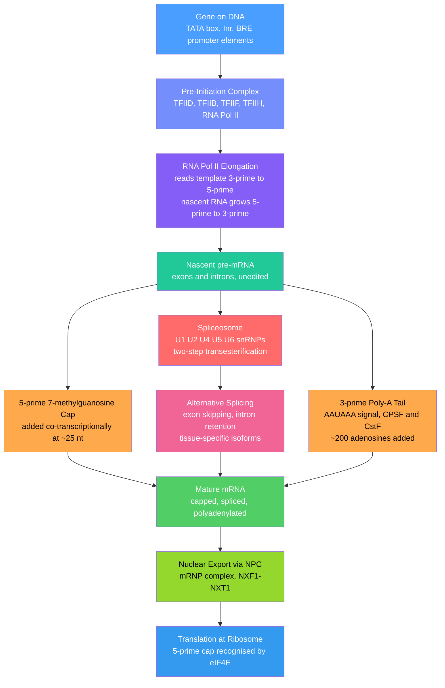

# Transcription and RNA Processing

> [!abstract] TL;DR
> Transcription is the process by which **RNA polymerase II** reads a DNA gene and synthesises a complementary **pre-mRNA** strand. Before that raw transcript can be used, the cell performs three indispensable edits: capping the 5' end with a **7-methylguanosine** cap, excising non-coding **introns** via the **spliceosome**, and adding a **poly-A tail** to the 3' end — together converting the pre-mRNA into a stable, export-ready **mature mRNA**. Errors in any step underlie cancers, neurological disease, and developmental disorders, which is also why these processes are prime targets for RNA-based therapeutics.

---

## Intuition

**Analogy:** The genome is the original master blueprint stored in a secure vault. Because the vault's security rules forbid removing the master, a staff member feeds the relevant page through a **photocopier** and produces a single-use paper copy (RNA). But the raw photocopy comes out with stray watermarks and irrelevant boilerplate printed on it — so an **editorial team** goes to work: they laminate the top edge (5' cap), cut out the boilerplate passages with scissors and tape the remaining sections back together (splicing), and stamp a long row of authentication stamps on the bottom edge (poly-A tail). Only then does the copy travel to the factory floor (cytoplasm) where workers (ribosomes) can finally read and act on it.

In molecular terms: RNA polymerase II is the photocopier, the pre-initiation complex is the technician lining up the page, and the capping enzyme, spliceosome, and poly-A machinery are the editorial team — all working in a tightly coordinated assembly line that largely happens **co-transcriptionally**, while the RNA is still being synthesised.

---

## How It Works

### Core Mechanics

**Initiation — Building the Pre-Initiation Complex (PIC)**

1. **TFIID** (containing TBP) recognises and binds the **TATA box** (~30 bp upstream of the transcription start site, TSS) and the **Initiator element (Inr)** at the TSS. The **BRE** (TFIIB Recognition Element) flanks the TATA box and recruits TFIIB.
2. TFIIB, TFIIF, and RNA Pol II join the complex, positioning the polymerase over the TSS.
3. **TFIIH** (a helicase/kinase) unwinds ~11 bp of DNA to form the **transcription bubble** and phosphorylates the **CTD** (carboxy-terminal domain) of RNA Pol II at Ser5, triggering promoter clearance.

**Elongation**

RNA Pol II reads the **template strand 3'→5'** and synthesises pre-mRNA **5'→3'** via phosphodiester bond formation. Elongation speed is ~2 kb/min in humans. Pausing at +30–50 bp (promoter-proximal pausing) is regulated by P-TEFb (CDK9), which phosphorylates Ser2 of the CTD for productive elongation.

**Termination**

For protein-coding genes: the **poly-A signal** (canonical: **AAUAAA**, 10–30 nt upstream of the cleavage site) is recognised by **CPSF** and **CstF**. Cleavage occurs ~15–30 nt downstream; **poly-A polymerase** then adds ~200 non-templated adenosines. Cleavage destabilises the downstream RNA still attached to the polymerase, triggering release (torpedo model: Xrn2 degrades the trailing RNA and dislodges Pol II).

**5' Cap Addition (co-transcriptional)**

After ~25–30 nt of RNA are synthesised, the nascent transcript is capped:
1. RNA 5'-triphosphatase removes the gamma-phosphate.
2. Guanylyltransferase adds GMP via a 5'–5' triphosphate linkage.
3. Guanine-7-methyltransferase methylates the N7 of the added guanosine.

The cap protects mRNA from 5'→3' exonucleases, facilitates nuclear export, and is essential for translation initiation (eIF4E cap-binding).

**Splicing by the Spliceosome**

Pre-mRNA contains **exons** (expressed sequences) separated by **introns** (intervening sequences). Splicing removes introns via two transesterification reactions:

1. **Branch point attack:** The 2'-OH of a conserved **branch point adenosine** (~18–40 nt upstream of the 3' splice site) attacks the 5' splice site phosphodiester bond. This creates a **lariat intermediate** and frees the upstream exon with a 3'-OH.
2. **Exon ligation:** The free 3'-OH of exon 1 attacks the 3' splice site, joining the two exons and releasing the lariat intron.

The spliceosome is assembled from **five snRNPs**: U1 (recognises 5' splice site), U2 (base-pairs with the branch point), and the U4/U6•U5 tri-snRNP. Extensive RNA–RNA rearrangements driven by eight DExD/H-box ATPases drive catalysis.

**Alternative Splicing**

~95% of human multi-exon genes are alternatively spliced. Major patterns:
- **Exon skipping** — one or more internal exons are excluded (most common in humans)
- **Intron retention** — an intron is kept in the mature mRNA (common in plants, neuronal mRNAs)
- **Alternative 5'/3' splice site** — different splice sites are used within an exon or intron
- **Mutually exclusive exons** — only one of two exons is included (e.g., *Dscam* in *Drosophila* generates >38,000 isoforms)

**The RNA Zoo — Major Classes**

| RNA class | Full name | Function |
|-----------|-----------|----------|
| mRNA | Messenger RNA | Encodes proteins; subject to all processing steps above |
| rRNA | Ribosomal RNA | Structural and catalytic component of ribosomes (23S/28S, 16S/18S, 5S, 5.8S) |
| tRNA | Transfer RNA | Adaptor; delivers amino acids to ribosome; anticodon:codon matching |
| snRNA | Small nuclear RNA | Spliceosome components (U1, U2, U4, U5, U6); base-pair with pre-mRNA |
| miRNA | MicroRNA | ~22 nt; base-pairs with 3'-UTR of target mRNAs; recruits RISC to silence or degrade |
| siRNA | Small interfering RNA | ~21 bp dsRNA; loaded into RISC; guides endonucleolytic cleavage of complementary mRNA |
| lncRNA | Long non-coding RNA | >200 nt; diverse roles: chromatin remodelling, scaffold, decoy, enhancer activity |

---

### Transcription-to-Translation Pipeline



---

## Key Concepts

### Secondary Level

**The Central Dogma: DNA → RNA → Protein**

Information flows in one direction under normal circumstances: DNA is the permanent archive, RNA is the working copy, and protein is the product. Transcription (DNA→RNA) and translation (RNA→protein) are the two steps of **gene expression**. The DNA double helix is never consumed; only one strand (the **template strand**, also called the antisense strand) is read by RNA polymerase. The other strand (the **non-template or coding strand**) has the same sequence as the mRNA, except U replaces T.

Three key rules distinguish RNA from its DNA template:
- The RNA has **uracil (U)** where the template has adenine (A).
- RNA is single-stranded and uses **ribose** rather than deoxyribose.
- The RNA is antiparallel to the template: polymerase reads 3'→5', building RNA 5'→3'.

### Undergraduate Level

**Splice-Site Signals and the snRNA Base-Pairing Logic**

Splice sites are defined by short consensus sequences:
- **5' splice site (donor):** GU at the start of every intron (GU-AG rule).
- **3' splice site (acceptor):** AG at the end of every intron, preceded by a polypyrimidine tract.
- **Branch point:** YNYURAY consensus (~25 nt upstream of the 3' splice site); the underlined A is the nucleophile.

U1 snRNA base-pairs with the 5' splice site by Watson–Crick complementarity. U2 snRNA base-pairs with the branch point sequence, bulging out the branch point A. This RNA–RNA recognition is the key fidelity mechanism — any mutation disrupting these base pairs causes **aberrant splicing**.

**Exon Definition vs. Intron Definition**

In organisms with short introns (yeast): the spliceosome recognises and pairs the two ends of each intron (**intron definition**). In vertebrates with long introns (median ~5 kb): SR proteins bound on exons bridge the upstream 3' splice site to the downstream 5' splice site across the exon (**exon definition**), then cross-exon complexes pair across introns for catalysis. This explains why most human splicing mutations do not simply abolish splicing — they shift the exon–intron boundary.

### Graduate Level

**Co-Transcriptional Splicing and CTD Coupling**

Splicing does not wait for the transcript to be released. The phosphorylated CTD of RNA Pol II acts as a **landing pad**: Ser5-P CTD recruits capping enzymes early, while Ser2-P CTD (in the elongating body) recruits splicing factors and the 3'-processing machinery. Introns are removed in a strict 5'→3' order as they emerge from the polymerase exit channel. The kinetics of elongation directly influence splice-site choice: **slow polymerase** gives weak splice sites time to be recognised (kinetic coupling hypothesis).

**Transcription Bursting**

Single-molecule live-cell imaging (e.g., MS2 stem-loop reporter systems) shows that most genes do not transcribe continuously — instead they fire in discrete, stochastic **bursts** of multiple transcripts separated by silent periods. Burst frequency (how often a gene transitions from OFF to ON) is primarily controlled by **enhancer-promoter contact frequency**, while burst size (transcripts per burst) is controlled by core promoter strength and pause release. Cell-to-cell variation in mRNA counts (transcriptional noise) is a direct consequence of bursting and has developmental implications.

**R-Loops and Genome Instability**

As RNA Pol II elongates, the newly synthesised RNA can re-hybridise to the template DNA strand behind the polymerase — forming a stable RNA:DNA hybrid called an **R-loop**, with the non-template strand single-stranded. R-loops occur at G-rich sequences, the 5' cap, and behind paused polymerases. They are resolved by RNase H1/H2, the Senataxin helicase, and TOP1. Unresolved R-loops obstruct replication forks, cause double-strand breaks, and contribute to transcription–replication conflicts seen in cancer. Conversely, regulated R-loops at CpG islands promote gene activation and at immunoglobulin switch regions facilitate class-switch recombination.

**Enhancer–Promoter Looping and 3D Genome Organisation**

Enhancers can be hundreds of kilobases from their target promoters yet regulate them efficiently. The prevailing model involves **chromatin looping**: architectural proteins **CTCF** and **cohesin** extrude chromatin loops, bringing enhancers and promoters into proximity within **Topologically Associating Domains (TADs)**. Enhancer-bound Mediator complex contacts the promoter-bound PIC and stimulates TFIIH kinase activity and pause release. Hi-C and micro-C experiments confirm that active enhancer–promoter pairs co-occupy the same **transcriptional condensate** — liquid-like phase-separated compartments enriched in RNA Pol II CTD and Mediator.

---

## Python Demo

```python
# pip install numpy matplotlib
import numpy as np
import matplotlib
matplotlib.use("Agg")  # non-interactive backend; remove if running in a notebook
import matplotlib.pyplot as plt
import random
import collections

# -------------------------------------------------------------------
# Standard genetic code (stop codons excluded)
# -------------------------------------------------------------------
GENETIC_CODE = {
    'TTT': 'F', 'TTC': 'F',
    'TTA': 'L', 'TTG': 'L', 'CTT': 'L', 'CTC': 'L', 'CTA': 'L', 'CTG': 'L',
    'ATT': 'I', 'ATC': 'I', 'ATA': 'I',
    'ATG': 'M',
    'GTT': 'V', 'GTC': 'V', 'GTA': 'V', 'GTG': 'V',
    'TCT': 'S', 'TCC': 'S', 'TCA': 'S', 'TCG': 'S', 'AGT': 'S', 'AGC': 'S',
    'CCT': 'P', 'CCC': 'P', 'CCA': 'P', 'CCG': 'P',
    'ACT': 'T', 'ACC': 'T', 'ACA': 'T', 'ACG': 'T',
    'GCT': 'A', 'GCC': 'A', 'GCA': 'A', 'GCG': 'A',
    'TAT': 'Y', 'TAC': 'Y',
    'CAT': 'H', 'CAC': 'H',
    'CAA': 'Q', 'CAG': 'Q',
    'AAT': 'N', 'AAC': 'N',
    'AAA': 'K', 'AAG': 'K',
    'GAT': 'D', 'GAC': 'D',
    'GAA': 'E', 'GAG': 'E',
    'TGT': 'C', 'TGC': 'C',
    'TGG': 'W',
    'CGT': 'R', 'CGC': 'R', 'CGA': 'R', 'CGG': 'R', 'AGA': 'R', 'AGG': 'R',
    'GGT': 'G', 'GGC': 'G', 'GGA': 'G', 'GGG': 'G',
}

# Build reverse map: amino acid -> list of synonymous codons
AA_TO_CODONS = collections.defaultdict(list)
for codon, aa in GENETIC_CODE.items():
    AA_TO_CODONS[aa].append(codon)


def generate_random_cds(length_codons=500, gc_bias=0.5, seed=42):
    """
    Generate a random coding sequence with optional GC-content bias.
    gc_bias=0.5 is perfectly random; 0.7 gives GC-rich sequence.
    """
    rng = random.Random(seed)
    bases = ['A', 'T', 'G', 'C']
    at_prob = (1.0 - gc_bias) / 2
    gc_prob = gc_bias / 2
    weights = [at_prob, at_prob, gc_prob, gc_prob]  # A, T, G, C
    nucleotides = rng.choices(bases, weights=weights, k=length_codons * 3)
    codons = [''.join(nucleotides[i:i+3]) for i in range(0, len(nucleotides), 3)]
    # Keep only valid sense codons (ignore stops generated by chance)
    return [c for c in codons if c in GENETIC_CODE]


def compute_rscu(cds_codons):
    """
    Compute Relative Synonymous Codon Usage (RSCU).

    RSCU(codon_i for amino acid AA) = observed(codon_i) / (total_for_AA / n_synonyms)

    RSCU = 1.0  ->  exactly as expected under uniform usage
    RSCU > 1.0  ->  codon is preferred / over-represented
    RSCU < 1.0  ->  codon is avoided / under-represented
    """
    codon_counts = collections.Counter(cds_codons)
    rscu = {}
    for aa, synonyms in AA_TO_CODONS.items():
        n_synonyms = len(synonyms)
        total_for_aa = sum(codon_counts.get(c, 0) for c in synonyms)
        expected = total_for_aa / n_synonyms if n_synonyms > 0 else 0.0
        for codon in synonyms:
            observed = codon_counts.get(codon, 0)
            rscu[codon] = observed / expected if expected > 0 else 0.0
    return rscu


# -------------------------------------------------------------------
# Simulate two CDSs: one random (GC=50%) and one GC-rich (GC=70%)
# -------------------------------------------------------------------
cds_neutral = generate_random_cds(500, gc_bias=0.50, seed=1)
cds_gcrich  = generate_random_cds(500, gc_bias=0.70, seed=2)

rscu_neutral = compute_rscu(cds_neutral)
rscu_gcrich  = compute_rscu(cds_gcrich)

# -------------------------------------------------------------------
# Plot RSCU for Leucine (L) — 6 synonymous codons, a classic example
# Also plot for Serine (S) — 6 synonymous codons
# -------------------------------------------------------------------
fig, axes = plt.subplots(1, 2, figsize=(12, 4))

for ax, aa_label, aa_code in zip(axes, ['Leucine (L)', 'Serine (S)'], ['L', 'S']):
    synonyms = sorted(AA_TO_CODONS[aa_code])
    neutral_vals = [rscu_neutral[c] for c in synonyms]
    gcrich_vals  = [rscu_gcrich[c]  for c in synonyms]

    x = np.arange(len(synonyms))
    width = 0.35
    ax.bar(x - width/2, neutral_vals, width, label='GC=50% (neutral)', color='#4a9eff', alpha=0.85)
    ax.bar(x + width/2, gcrich_vals,  width, label='GC=70% (GC-rich)',  color='#ff6b6b', alpha=0.85)
    ax.axhline(1.0, color='gray', linestyle='--', linewidth=0.8, label='RSCU=1 (uniform)')
    ax.set_xticks(x)
    ax.set_xticklabels(synonyms, fontsize=9)
    ax.set_title(f'RSCU — {aa_label}')
    ax.set_xlabel('Codon')
    ax.set_ylabel('RSCU')
    ax.legend(fontsize=7)

plt.suptitle('Relative Synonymous Codon Usage (RSCU)\nGC-rich genes prefer G/C-ending codons', fontsize=11)
plt.tight_layout()
plt.savefig('rscu_demo.png', dpi=120)
print("Saved rscu_demo.png")

# Print top 3 preferred codons in the GC-rich CDS
top3 = sorted(rscu_gcrich.items(), key=lambda kv: kv[1], reverse=True)[:3]
print("Top 3 preferred codons in GC-rich CDS:", [(c, f"{v:.2f}") for c, v in top3])
```

> **What this demonstrates:** Codon usage bias is real and measurable. In human cells, CTG is the dominant Leucine codon (~40% of Leu usage); its RSCU approaches 2.0 while CTA has RSCU ~0.2. Codon optimisation of mRNA vaccines exploits this — replacing rare codons with abundant synonymous ones increases translation efficiency in human cells without changing the encoded protein.

---

## Real-World Applications

**Alternative Splicing in Cancer**

Many oncogenic mutations do not change a protein's amino-acid sequence — they destroy a splice site or create a new one. *BCL2L1* (Bcl-xL/Bcl-xS ratio), *VEGFA*, *FGFR3*, and hundreds of other genes are recurrently mis-spliced in tumours. The ratio of pro-apoptotic Bcl-xS to anti-apoptotic Bcl-xL is controlled entirely by alternative 5' splice-site choice; tumours shift it toward Bcl-xL to evade apoptosis. Small-molecule splicing modulators (e.g., H3B-8800) that target the SF3B1 subunit of U2 snRNP are in clinical trials for myeloid neoplasms.

**Spinal Muscular Atrophy (SMA) and Splice-Switching Oligonucleotides**

SMA is caused by loss-of-function mutations in *SMN1*. Humans carry a near-duplicate gene *SMN2* that produces only ~10% full-length protein because exon 7 is largely skipped due to a single C→T transition that weakens an exonic splicing enhancer. **Nusinersen (Spinraza)** is an antisense oligonucleotide injected intrathecally that blocks an intronic splicing silencer downstream of exon 7, shifting *SMN2* splicing to include exon 7 and restore ~50% full-length SMN protein — a direct therapeutic exploitation of the splicing code.

**mRNA Vaccines**

COVID-19 mRNA vaccines (BNT162b2, mRNA-1273) are the first licensed drugs built entirely on the transcription-processing knowledge: in-vitro-transcribed mRNA with a synthetic 5' 7-methylguanosine cap analogue (ARCA), optimised 5'/3' UTRs, codon-optimised spike-protein coding sequence (all rare codons replaced with high-usage human synonyms), and a poly-A tail ~100–150 A long. The 5' cap enables eIF4E-mediated ribosome recruitment; the poly-A tail stabilises the transcript in the cytoplasm; codon optimisation maximises translation output per molecule.

**RNA Interference Therapeutics**

siRNAs delivered to hepatocytes exploit the RISC pathway: the antisense strand guides the Argonaute-2 endonuclease to complementary mRNA, which is then cleaved. Inclisiran (Leqvio) uses siRNA to silence PCSK9 mRNA in the liver, reducing LDL cholesterol by ~50% with a twice-yearly injection — a direct application of the gene-silencing arm of the RNA processing world. Patisiran (Onpattro) was the first FDA-approved siRNA drug (2018), targeting TTR mRNA for hereditary transthyretin amyloidosis.

---

## Common Pitfalls

- **"The coding strand is the template"** — The naming is counter-intuitive. The **coding strand** (sense strand, non-template strand) has the same sequence as the mRNA (with T instead of U) and is *not* read by RNA polymerase. The **template strand** (antisense strand) is the one RNA Pol II reads 3'→5'. Students routinely confuse these and write the wrong complementary sequence.

- **"Splicing happens after transcription finishes"** — Most splicing in metazoans is **co-transcriptional**: spliceosome assembly begins on introns while RNA Pol II is still elongating. Thinking of splicing as a purely post-transcriptional event misses the functional coupling between polymerase pausing and splice-site choice, and the entire logic of exon definition.

- **"The poly-A tail is encoded in the DNA"** — The poly-A tail is added by **poly-A polymerase** (an untemplated reaction) after CPSF/CstF cleave the nascent transcript at the poly-A site. Only the AAUAAA signal sequence is encoded; the ~200-A tail itself is not. The same misunderstanding leads students to think the genome encodes runs of ~200 T residues at every gene's 3' end.

- **"miRNAs degrade their targets"** — miRNA-loaded RISC does not invariably cleave its target. Perfect complementarity leads to endonucleolytic cleavage (like siRNA), but most animal miRNA:mRNA interactions involve partial complementarity and instead cause **translational repression and deadenylation** without immediate mRNA cleavage. Conflating miRNA and siRNA mechanisms leads to incorrect predictions about rescue experiments and off-target effects.

---

## Related Concepts

- [[_MOC_Molecular_Genetics|↑ Molecular Genetics MOC]]
- [[Biomolecules_Overview]] — provides the polymer chemistry of nucleotides and the phosphodiester backbone that RNA polymerase assembles; foundational chemistry for understanding the transcript itself
- [[Protein_Structure_and_Function]] — transcription's downstream product; alternative splicing directly diversifies the proteome without expanding genome size
- [[Nucleic_Acids_and_the_Central_Dogma]] — the broader DNA→RNA→protein framework of which transcription is the first information-transfer step; covers base-pairing logic essential for splice-site recognition
- [[Information_Theory]] — the coding-theory analogy is exact: the 64-codon→20-amino-acid mapping is a degenerate code; redundancy mirrors error-correcting codes; mutual information between codon position and amino acid identity quantifies degeneracy
- [[DNA_Structure_and_Replication]] — transcription begins with the same helix that replication uses; R-loops and transcription–replication conflicts arise from polymerase collisions on the same duplex
- [[Translation_and_the_Genetic_Code]] — the direct continuation of this note: the mature mRNA produced here is the substrate for ribosome-mediated decoding covered there

---

## Review Questions

**Tier 1 — Secondary (Recall and Mechanism)**

1. A mutation changes the TATA box sequence from TATAAA to TATCAA. Predict the effect on transcription initiation and explain which general transcription factor is most directly affected.
2. Describe in order the three co-transcriptional modifications made to a pre-mRNA before it is exported from the nucleus. For each, state the enzyme responsible and the functional consequence.
3. Draw and annotate the two transesterification reactions of pre-mRNA splicing, labelling the branch point adenosine, the lariat intermediate, and the final exon ligation product.

**Tier 2 — Undergraduate (Analysis and Application)**

4. A patient's fibroblasts produce a BRCA1 mRNA that is 120 nt shorter than normal and encodes a truncated protein. Sequencing reveals no change in exon sequence, but a G→A transition 6 bp into intron 11. Explain the molecular mechanism by which this intronic variant most likely generates the shorter mRNA. How would you confirm your hypothesis experimentally?
5. Two neurons in different brain regions express different isoforms of the *NRXN1* gene despite having identical genomic sequences. Describe three molecular mechanisms that could generate this tissue-specific alternative splicing pattern.

**Tier 3 — Graduate (Synthesis and Design)**

6. You observe that a gene with a weak proximal poly-A site and a strong distal poly-A site switches its poly-A site usage when cells are treated with a CDK9 inhibitor (which blocks Ser2 phosphorylation of the RNA Pol II CTD). Construct a mechanistic model — invoking CTD-coupled 3'-processing factors — that explains this observation.
7. A new mRNA therapeutic requires high protein output from a single-dose injection into muscle cells. Describe five design parameters you would optimise in the in-vitro-transcribed mRNA, drawing on the mechanistic knowledge in this note, and justify each choice with reference to the relevant processing step or translational machinery.

---

## Sources

- [Alberts et al. — Molecular Biology of the Cell, 7th ed. (2022), Ch. 6–7](https://www.ncbi.nlm.nih.gov/books/NBK26887/)
- [Lodish et al. — Molecular Cell Biology, 9th ed. (2021), Ch. 10](https://www.macmillanlearning.com/college/us/product/Molecular-Cell-Biology/p/1319381235)
- [Lewin's Genes XII — Krebs et al. (2018), Ch. 12–14](https://www.jblearning.com/catalog/productdetails/9781284104493)
- [Bentley DL — Coupling mRNA processing with transcription in time and space. Nature Rev Genet (2014)](https://doi.org/10.1038/nrg3662)
- [Will CL, Luhrmann R — Spliceosome Structure and Function. Cold Spring Harb Perspect Biol (2011)](https://doi.org/10.1101/cshperspect.a003707)
- [Sharp PA — The Centrality of RNA. Cell (2009)](https://doi.org/10.1016/j.cell.2009.02.009)

---

#Genetics #MolecularGenetics #Transcription #RNA
