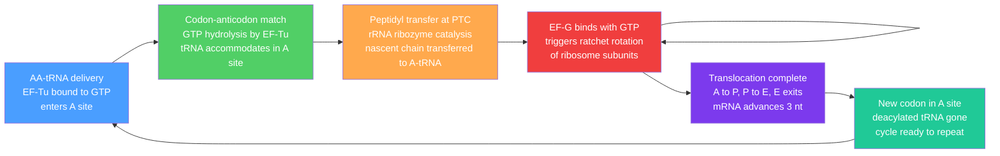

# 🧬 Translation and the Genetic Code

> [!abstract] TL;DR
> Translation is the ribosome-mediated decoding of mRNA into a polypeptide chain using the nearly universal **64-codon genetic code** that maps to 20 amino acids and 3 stop signals. It is the final step of the central dogma — the gateway through which genotype becomes functional phenotype — and its molecular machinery (tRNAs, synthetases, ribosome, elongation factors) is among the most ancient and conserved in all of life.

---

## Intuition

**Analogy:** Translation is a 3D printer manufacturing a custom protein part. The **mRNA** is the digital instruction file, the **ribosome** is the printer head that reads it three characters at a time, **tRNA molecules** are the supply couriers that each deliver one specific amino acid component, and the growing **polypeptide** is the physical object being assembled. When the printer encounters a STOP command at the end of the file, it ejects the finished product for post-processing (folding, modification, delivery).

The genius is its modularity and universality: the same 64-codon language is shared by bacteria, yeast, plants, and humans — evolution has been running the same compiler for roughly 3.5 billion years. Change one letter in the instruction file and you may swap one amino acid for another with catastrophic consequences (sickle-cell disease: Glu→Val at position 6 of beta-globin) or no consequence at all, thanks to a built-in redundancy called degeneracy.

---

## How It Works

### Core Mechanics

#### 1. The Genetic Code: 64 Codons for 20 Amino Acids

The code maps all **64 possible triplet codons** (4³) to **20 canonical amino acids plus 3 stop signals**. Its four defining properties:

| Property | Meaning | Example |
|----------|---------|---------|
| **Degenerate** | Most amino acids have multiple codons | Leu: 6 codons; Trp: only 1 |
| **Non-overlapping** | Each nucleotide belongs to exactly one codon in the reading frame | No sharing of bases between adjacent codons |
| **Unambiguous** | One codon always maps to one amino acid | Degeneracy is one-directional |
| **Nearly universal** | Same code in bacteria, archaea, eukaryotes | Exceptions: mitochondria, some ciliates |

**Start codon:** AUG (methionine). It defines the reading frame and is decoded by the **initiator tRNA** (Met-tRNA$_i$ in eukaryotes; fMet-tRNA$_f^{Met}$ in prokaryotes — note the formyl group).

**Stop codons:** UAA, UAG, UGA. These are **not** decoded by tRNAs; instead, protein **release factors** occupy the A site and trigger hydrolysis of the peptidyl-tRNA ester bond.

#### 2. Wobble Base Pairing and the tRNA Adaptor

A **tRNA** (~73–93 nt) is an L-shaped adaptor with two functional ends:
- **3' CCA terminus** — the amino acid is attached here by an ester bond to the 2'- or 3'-OH
- **Anticodon loop (positions 34–36)** — base-pairs with the complementary mRNA codon in the A site

**Wobble pairing** (Crick, 1966): positions 1 and 2 of the codon pair strictly (Watson–Crick A:U and G:C). The **third "wobble" position** permits non-canonical pairings:

| Anticodon base (position 34) | Codon third bases recognized |
|------------------------------|------------------------------|
| C | G only |
| A | U only |
| G | C or U |
| U | A or G |
| Inosine (I, modified G) | U, C, or A |

This wobble explains why only ~45 distinct tRNA species suffice to decode all 61 sense codons — the genetic code is compressed by relaxing third-position complementarity.

#### 3. Aminoacyl-tRNA Synthetases — The Charging Reaction

Before a tRNA can participate in translation, it must be covalently **aminoacylated** ("charged") by its cognate **aminoacyl-tRNA synthetase (aaRS)**. There are 20 aaRS enzymes (one per amino acid, in most organisms). The reaction consumes two high-energy phosphate bonds:

**Step 1 — Adenylation** (amino acid activation):
$$\text{AA} + \text{ATP} \xrightarrow{\text{aaRS}} \text{AA-AMP} + \text{PP}_i$$

**Step 2 — Transfer** to tRNA:
$$\text{AA-AMP} + \text{tRNA} \xrightarrow{\text{aaRS}} \text{AA-tRNA} + \text{AMP}$$

**Net:**
$$\text{AA} + \text{ATP} + \text{tRNA} \longrightarrow \text{AA-tRNA} + \text{AMP} + \text{PP}_i$$

The coupled hydrolysis of PP$_i$ by cellular pyrophosphatase ($\Delta G \approx -33$ kJ/mol) drives the reaction essentially to completion — the cost is equivalent to two ATP equivalents per amino acid activated. This is where the **fidelity of the genetic code is enforced**: aaRS enzymes use a two-sieve proofreading mechanism (pre-transfer editing at the synthetic site; post-transfer editing at a separate hydrolytic site) to achieve per-amino-acid mismatch rates below $10^{-4}$.

#### 4. Ribosome Structure

The eukaryotic ribosome is an **80S ribonucleoprotein machine** (~4.3 MDa):

| Subunit | Sedimentation | rRNA | Proteins | Key functional site |
|---------|--------------|------|----------|---------------------|
| **Small (40S)** | 18S rRNA | ~33 | Decoding center | Codon-anticodon matching |
| **Large (60S)** | 28S + 5.8S + 5S rRNA | ~50 | Peptidyl transferase center (PTC) | Peptide bond catalysis |

The large subunit presents three **tRNA-binding sites**:

| Site | Name | tRNA present | Status of tRNA |
|------|------|--------------|----------------|
| **A** | Aminoacyl | Incoming | Carries next amino acid |
| **P** | Peptidyl | Resident | Carries growing chain |
| **E** | Exit | Departing | Deacylated, leaving |

Prokaryotic ribosomes are **70S** (30S + 50S), structurally analogous but exploitable by antibiotics.

#### 5. Eukaryotic Initiation

1. **Ternary complex** assembles: eIF2·GTP·Met-tRNA$_i$
2. **43S pre-initiation complex (PIC)** forms: 40S + eIF1 + eIF1A + eIF3 + ternary complex
3. The 43S PIC is recruited to the **5' cap** via the eIF4F cap-binding complex (eIF4E + eIF4G + eIF4A helicase)
4. The complex **scans** $5' \to 3'$, unwinding secondary structure, until it encounters an AUG in a favorable **Kozak context** (gcc**acc**AUGG is optimal)
5. **Start codon recognition** triggers GTP hydrolysis by eIF2; eIF5B promotes **60S joining**
6. The assembled **80S ribosome** with Met-tRNA$_i$ in the **P site** is ready for elongation

#### 6. Elongation Cycle — Three Repeating Steps

**Step A — Decoding:** A new AA-tRNA, delivered as an **EF-Tu·GTP·AA-tRNA ternary complex** (EF-1A in eukaryotes), samples the A site. Correct codon-anticodon pairing triggers conformational changes that stimulate GTP hydrolysis by EF-Tu; the factor dissociates, and the AA-tRNA **accommodates** fully into the A site. Incorrect tRNAs are rejected at two kinetic checkpoints (initial selection and proofreading) before GTP hydrolysis.

**Step B — Peptidyl Transfer:** The **PTC** in the 23S/28S rRNA — a ribozyme, not a protein — catalyzes the nucleophilic attack of the α-amino group of the A-site aminoacyl-tRNA on the ester carbonyl of the P-site peptidyl-tRNA. The growing chain is **transferred to the A-site tRNA**, now one residue longer. The P site now holds a deacylated tRNA. The ribosome acts by positioning and entropic exclusion of water, providing a rate enhancement of ~$10^7$ over uncatalyzed reaction.

**Step C — Translocation:** **EF-G·GTP** (eEF2·GTP in eukaryotes) binds and hydrolyzes GTP, driving a ratchet-like rotation of the two subunits. The mRNA advances **3 nucleotides** in the $5' \to 3'$ direction; the A-site tRNA (now bearing the chain) shifts to the **P site**; the P-site tRNA moves to the **E site**; the E-site tRNA exits. The A site is vacated and the next codon is presented.

This cycle repeats at ~5–20 amino acids per second in bacteria (~5 aa/s in eukaryotes under optimal conditions).

#### 7. Termination and Ribosome Recycling

1. A **stop codon** (UAA, UAG, UGA) enters the A site
2. **eRF1** (eukaryotic release factor 1, a tRNA mimic with a GGQ motif) occupies the A site and recognizes all three stop codons
3. **eRF3** (a GTPase) stimulates peptide release: eRF1 hydrolyzes the ester bond at the PTC, releasing the completed polypeptide
4. **ABCE1** (Rli1 in yeast), an ATPase, splits the 80S into subunits
5. Subunits, mRNA, and tRNA are recycled for subsequent rounds

#### 8. Post-Translational Modifications (PTMs)

The nascent chain is rarely the final product. PTMs extend the 20-letter amino acid alphabet into hundreds of functional variants:

| PTM | Key enzymes | Modified residue | Functional role |
|-----|-------------|-----------------|-----------------|
| **Phosphorylation** | Kinases / Phosphatases | Ser, Thr, Tyr | Signaling switch, on/off |
| **N-Glycosylation** | OST complex (ER) | Asn in Asn-X-Ser/Thr | Folding, cell recognition |
| **O-Glycosylation** | O-GlcNAc transferase | Ser, Thr | Nutrient sensing, nuclear signaling |
| **Ubiquitination** | E1/E2/E3 cascade | Lys | Proteasomal degradation, signaling |
| **Acetylation** | HATs / HDACs | Lys, N-terminus | Chromatin, stability, aggregation |
| **Proteolytic cleavage** | Signal peptidase, furin | Peptide bond | Zymogen activation, signal sequence removal |

---

### Flow / Architecture — Elongation Cycle



---

## Key Concepts

### Secondary Level

**Why triplet codons?** With a 4-letter nucleotide alphabet, doublets (4² = 16) are insufficient to encode 20 amino acids; triplets (4³ = 64) give more than enough, with room for redundancy and stop signals. This was demonstrated experimentally by Crick, Barnett, Brenner, and Watts-Tobin in 1961 using frameshift mutations in bacteriophage T4.

**Reading the codon table.** Amino acids in the same "codon box" (sharing the first two positions) are biochemically similar — this is non-accidental. The code is organized so that mutations at the wobble position (most synonymous) and even the second position (conservative changes like Leu→Val→Ile) are buffered against drastic amino acid switches. This is the **error-minimization** property of the genetic code.

**What happens if the reading frame shifts?** Insertion or deletion of a single nucleotide shifts every subsequent codon, usually generating a nonsense codon within a few triplets. This is a **frameshift mutation** — almost always catastrophic for protein function unless compensated by a nearby second mutation.

**Central dogma flow:**
$$\text{DNA} \xrightarrow{\text{Transcription}} \text{mRNA} \xrightarrow{\text{Translation}} \text{Protein}$$
Translation is the last irreversible step. Unlike transcription, it cannot be "run in reverse" — no known enzyme polymerizes nucleotides from a protein template.

### Undergraduate Level

**Peptide bond formation energetics.** The peptidyl transfer reaction at the PTC is thermodynamically favorable: the ester bond broken ($\Delta G$ of hydrolysis ~−21 kJ/mol) is replaced by the amide (peptide) bond formed (~−6 kJ/mol), so the reaction is spontaneously favored. However, this favorable $\Delta G$ is modest — the real driving force for translation directionality is the **GTP hydrolysis** by EF-Tu and EF-G at each cycle, committing the cycle forward irreversibly and providing fidelity at the kinetic proofreading steps.

**Total ATP cost of translation.** Each amino acid incorporated costs:
- 2 ATP equivalents for aminoacylation (ATP → AMP + PP$_i$; PP$_i$ hydrolysis = 2 phosphoanhydride bonds)
- 2 GTP for delivery (EF-Tu GTP hydrolysis)
- 1 GTP for translocation (EF-G GTP hydrolysis)
- **Total: ~4–5 high-energy phosphate bonds per peptide bond**

Given that a typical protein is 300 aa, translation consumes ~1200–1500 high-energy phosphate bonds per protein. Protein synthesis accounts for ~50% of all ATP expenditure in a rapidly dividing cell.

**Accuracy of translation.** The ribosome achieves a per-codon error rate of approximately $10^{-3}$ to $10^{-4}$ (one wrong amino acid per 1,000–10,000 incorporations), despite having only ~100-fold discrimination at the initial codon-anticodon matching step. The extra 10–100-fold accuracy comes from **kinetic proofreading** (Hopfield, 1974): EF-Tu GTP hydrolysis creates an irreversible branch point; near-cognate tRNAs dissociate faster before accommodation than cognate tRNAs, multiplying the discrimination factor.

**Shine-Dalgarno sequence (prokaryotes).** In bacteria, translation initiation does not require cap-dependent scanning. Instead, a purine-rich sequence 5–10 nt upstream of the AUG — the **Shine-Dalgarno sequence** (consensus: 5'-AGGAGG-3') — base-pairs with the 3' end of 16S rRNA in the 30S subunit, positioning the AUG in the P site. This allows polycistronic mRNAs (multiple ORFs on one transcript) and very rapid reinitiation.

### Graduate Level

**Ribosome profiling (Ribo-seq).** Harrington & Bhaskara; Ingolia et al. (2009) developed a genome-wide technique that captures actively translating ribosomes: treat cells with cycloheximide to freeze ribosomes, digest exposed mRNA with nuclease, and sequence the ~28–30 nt "footprint" protected by each ribosome. This reveals the **instantaneous translation rate** at single-codon resolution across all ORFs, exposes upstream ORFs (uORFs), stalling sites, and the translation of lncRNAs. It has upended the view of the translatome — many thousands of short ORFs (<100 aa) are translated, though most produce unstable peptides.

**Programmed ribosomal frameshifting.** Certain mRNAs direct the ribosome to slip ±1 codon at a specific "slippery sequence" with defined probability (typically 5–30%). This is exploited by:
- HIV-1: −1 frameshift at the gag-pol junction produces the Gag-Pol fusion polyprotein at exactly the stoichiometry needed for virion assembly
- Antizyme mRNA: +1 frameshift triggered by polyamines regulates ornithine decarboxylase activity in a feedback loop

**Selenocysteine — the 21st amino acid.** Sec is encoded by UGA, normally a stop codon. Recoding requires a cis-acting **SECIS element** in the 3' UTR of the mRNA and a specialized machinery: Sec-tRNA$^{Sec}$, selenophosphate synthetase, and a dedicated elongation factor (SelB in prokaryotes, eEFSec in eukaryotes). ~25 human selenoproteins contain Sec, including thioredoxin reductases and glutathione peroxidases — all with Sec at the active site exploiting its lower pKa and higher nucleophilicity relative to Cys.

**Non-canonical start codons.** In bacteria, GUG (~8% of all start codons in *E. coli*), UUG, and AUU can initiate translation because the initiator fMet-tRNA$_f$ can decode them by tolerating a mismatch at position 1 in the context of IF2 and Shine-Dalgarno base pairing. In eukaryotes, CUG codons can direct translation initiation with Leu-tRNA (not Met) in stress conditions and is exploited by some viruses and cancer-related mRNAs. This non-AUG initiation contributes to proteomic diversity beyond the genome's ORFome.

**Cotranslational folding.** Proteins do not wait until synthesis is complete to begin folding. As the nascent chain emerges from the **ribosome exit tunnel** (~40-aa capacity), it can begin to fold domain-by-domain. Ribosomes pace synthesis at synonymous codons — rare codons stall the ribosome, providing time for upstream domains to fold before the next domain emerges (translational kinetics as a folding chaperone). The **ribosome-associated chaperone** Hsp70 (RAC complex in eukaryotes; Trigger Factor in bacteria) contacts the polypeptide at the tunnel exit. For multi-domain proteins, cotranslational folding dramatically reduces misfolding and aggregation compared to in-vitro refolding from a denatured state.

---

## Python Demo

```python
# pip install numpy matplotlib
import numpy as np
import matplotlib.pyplot as plt
from collections import Counter

# Standard genetic code: RNA codon 5'->3' -> single-letter amino acid
# '*' marks stop codons
GENETIC_CODE = {
    'UUU': 'F', 'UUC': 'F', 'UUA': 'L', 'UUG': 'L',
    'CUU': 'L', 'CUC': 'L', 'CUA': 'L', 'CUG': 'L',
    'AUU': 'I', 'AUC': 'I', 'AUA': 'I', 'AUG': 'M',
    'GUU': 'V', 'GUC': 'V', 'GUA': 'V', 'GUG': 'V',
    'UCU': 'S', 'UCC': 'S', 'UCA': 'S', 'UCG': 'S',
    'CCU': 'P', 'CCC': 'P', 'CCA': 'P', 'CCG': 'P',
    'ACU': 'T', 'ACC': 'T', 'ACA': 'T', 'ACG': 'T',
    'GCU': 'A', 'GCC': 'A', 'GCA': 'A', 'GCG': 'A',
    'UAU': 'Y', 'UAC': 'Y', 'UAA': '*', 'UAG': '*',
    'CAU': 'H', 'CAC': 'H', 'CAA': 'Q', 'CAG': 'Q',
    'AAU': 'N', 'AAC': 'N', 'AAA': 'K', 'AAG': 'K',
    'GAU': 'D', 'GAC': 'D', 'GAA': 'E', 'GAG': 'E',
    'UGU': 'C', 'UGC': 'C', 'UGA': '*', 'UGG': 'W',
    'CGU': 'R', 'CGC': 'R', 'CGA': 'R', 'CGG': 'R',
    'AGU': 'S', 'AGC': 'S', 'AGA': 'R', 'AGG': 'R',
    'GGU': 'G', 'GGC': 'G', 'GGA': 'G', 'GGG': 'G',
}


def dna_to_mrna(dna: str) -> str:
    """Convert coding-strand DNA (5'->3') to mRNA: replace T with U."""
    return dna.upper().replace('T', 'U')


def translate(mrna: str) -> str:
    """Translate mRNA from the first AUG; halt at the first in-frame stop codon."""
    mrna = mrna.upper()
    start = mrna.find('AUG')
    if start == -1:
        return ''
    protein = []
    for i in range(start, len(mrna) - 2, 3):
        codon = mrna[i:i + 3]
        aa = GENETIC_CODE.get(codon, '?')
        if aa == '*':
            break
        protein.append(aa)
    return ''.join(protein)


def plot_composition(protein: str, title: str = 'Amino Acid Composition') -> None:
    """Bar chart of amino acid frequencies in a translated protein."""
    counts = Counter(protein)
    aas = sorted(counts.keys())
    freqs = np.array([counts[aa] for aa in aas])

    fig, ax = plt.subplots(figsize=(12, 5))
    bars = ax.bar(np.arange(len(aas)), freqs,
                  color='steelblue', edgecolor='black', linewidth=0.8)
    ax.set_xticks(np.arange(len(aas)))
    ax.set_xticklabels(aas, fontsize=12)
    ax.set_xlabel('Amino Acid (single-letter code)', fontsize=12)
    ax.set_ylabel('Count', fontsize=12)
    ax.set_title(title, fontsize=13)
    ax.bar_label(bars, padding=2, fontsize=9)
    plt.tight_layout()
    plt.show()


# Human HBB (beta-globin, NM_000518): first 93 nt of the CDS
# Encodes the N-terminal 31-aa heme-contact region; sickle-cell mutation is Glu7Val
hbb_partial_dna = (
    "ATGGTGCACCTGACTCCTGAGGAGAAGTCTGCCGTTACTGCC"
    "CTGTGGGGCAAGGTGAACGTGGATGAAGTTGGTGGTGAGGCC"
    "CTGGGCAGG"
)

mrna = dna_to_mrna(hbb_partial_dna)
protein = translate(mrna)
print(f"mRNA   : {mrna}")
print(f"Protein: {protein}")    # MVHLTPEEKSAVTALWGKVNVDEVGGEALG R  (31 aa)
print(f"Length : {len(protein)} aa")
plot_composition(protein, title='AA Composition: HBB N-terminal peptide (first 31 aa)')
```

---

## Real-World Applications

**Antibiotics that target the ribosome.** The structural difference between the prokaryotic 70S and eukaryotic 80S ribosome is the basis for an entire antibiotic class:

| Antibiotic | Target site | Mechanism |
|-----------|------------|-----------|
| **Tetracyclines** | 30S A site | Block aminoacyl-tRNA delivery |
| **Aminoglycosides** (streptomycin) | 30S decoding center | Induce misreading, disrupt translocation |
| **Erythromycin / macrolides** | 50S peptide exit tunnel | Block elongation and cause premature drop-off |
| **Chloramphenicol** | 50S PTC | Inhibits peptidyl transfer directly |
| **Linezolid** | 50S / 70S PIC | Prevents 70S assembly |

Resistance arises through ribosomal RNA methylation (erythromycin, linezolid), efflux pumps (tetracyclines), or ribosomal protein mutations.

**Genetic code expansion.** Amber suppression technology (Schultz, Tirrell labs) re-assigns the UAG stop codon to a 21st non-natural amino acid by engineering an orthogonal aaRS / tRNA pair that is not cross-reactive with endogenous factors. Over 200 non-canonical amino acids have been site-specifically incorporated into proteins, enabling click-chemistry handles for imaging, photo-crosslinkers for capturing transient interactions, and biorthogonal reactive groups for conjugated drug delivery.

**mRNA therapeutics.** The Pfizer/BioNTech and Moderna COVID-19 vaccines are the first approved mRNA drugs. They deliver chemically optimized mRNA (N1-methylpseudouridine substitution reduces innate immune activation; optimized Kozak + UTRs maximize translation; lipid nanoparticle carrier crosses the plasma membrane) so the host ribosomes synthesize the SARS-CoV-2 spike protein as the immunogen. The same platform is being pursued for influenza, RSV, HIV, cancer neoantigens, and rare metabolic diseases (e.g., propionic acidemia).

**CAR-T cell manufacturing.** Chimeric antigen receptor T cells are engineered by introducing mRNA (for transient expression) or viral vector DNA (for stable expression) encoding the CAR construct, which the patient's T cells then translate using their own ribosomes. The translation machinery processes the CAR polypeptide through the ER, glycosylates it, and routes it to the plasma membrane — a direct application of the ribosome-ER secretory pathway for therapeutic cell engineering.

---

## Common Pitfalls

- **Confusing the coding strand with the template strand** — The mRNA sequence is identical to the **coding (sense) strand** of DNA (with U replacing T). Translation reads mRNA 5'→3'; the template used by RNA polymerase is the antisense strand. Always specify strand identity when writing sequences.

- **Treating degeneracy as ambiguity** — The code is degenerate (one amino acid, many codons) but never ambiguous (one codon, one amino acid). Degeneracy is one-directional. A common error is claiming "because the code is degenerate, you can't determine the DNA from the protein" — correct — while incorrectly implying that translation is uncertain — wrong.

- **Ignoring the reading frame** — A sequence only makes biological sense in the correct reading frame. Shifting by ±1 nt changes every downstream codon. When analyzing ORFs computationally, always consider all three frames on both strands (six-frame translation) before concluding that no protein is encoded.

- **Assuming AUG is always the start** — The first AUG in an mRNA is usually the start codon, but context (Kozak consensus) matters. Upstream ORFs (uORFs) with their own AUGs can compete with or regulate the main ORF. Some mRNAs use near-cognate start codons (CUG, GUG) in specific contexts; this is especially relevant in cancer and viral biology.

- **Conflating the PTC with a protein enzyme** — The peptidyl transferase center is **ribosomal RNA (rRNA)**, making the ribosome a **ribozyme**. No ribosomal protein has catalytic residues in the PTC in the crystal structure. This fact supports the RNA World hypothesis and is frequently tested in molecular biology courses.

- **Stopping translation at the polypeptide** — The nascent chain is rarely functional until it is folded (often cotranslationally), processed (signal sequence cleavage, PTMs), and trafficked to the correct compartment. "Translation produces protein" is true but incomplete — "translation produces an unfinished polypeptide that requires extensive post-translational processing" is more accurate.

---

## Related Concepts

- [[_MOC_Molecular_Genetics|↑ Molecular Genetics MOC]]
- [[Transcription_and_RNA_Processing]] — the upstream process that produces the mRNA substrate for translation; cap, poly-A tail, and splice site choice directly regulate which proteins are made and in what quantity *(same vault, forward link)*
- [[Nucleic_Acids_and_the_Central_Dogma]] — the chemistry of DNA and RNA that frames the information flow DNA → mRNA → protein, including a survey-level treatment of translation
- [[Protein_Structure_and_Function]] — the polypeptide produced by translation folds into a precise 3D structure; Anfinsen's principle, the hydrophobic effect, and PTMs treated in depth
- [[Biomolecules_Overview]] — amino acids as building blocks alongside nucleotides, the monomers that the genetic code connects
- [[Information_Theory]] — the genetic code is a biological channel code; Shannon entropy, error-correction capacity, and the information content of the 64→20 mapping are directly relevant; the code's near-optimality under point-mutation noise is an active research area

---

## Review Questions

1. **Secondary level:** Draw the codon table structure and explain why a 64-codon table encodes only 20 amino acids. What is degeneracy and why is it biologically advantageous? Name the three stop codons and explain why they are recognized by proteins rather than tRNA.

2. **Undergraduate level:** Walk through the complete eukaryotic translation elongation cycle — decoding, peptidyl transfer, and translocation — naming every GTPase factor and explaining how GTP hydrolysis drives directionality. Calculate the total high-energy phosphate bonds consumed per amino acid incorporated, and explain why this energetic cost is necessary for the observed accuracy of ~1 error per 10,000 incorporations.

3. **Graduate level:** Compare and contrast programmed −1 frameshifting (HIV-1 gag-pol junction) with selenocysteine recoding at a UGA codon: in both cases a "stop" or "near-stop" signal is decoded in a non-canonical way — what cis and trans factors are required in each case, and what does each tell us about the evolvability of the genetic code? Additionally, explain how ribosome profiling (Ribo-seq) detects upstream ORFs and ribosome stalling at rare codons, and why the latter supports the hypothesis that synonymous codon usage shapes cotranslational folding.

---

## Sources

- Alberts, B. et al. — *Molecular Biology of the Cell*, 7th ed., Ch. 6 (Lehrbuch overview of all three steps)
- Lodish, H. et al. — *Molecular Cell Biology*, 9th ed., Ch. 5 (ribosome structure and translation mechanism in detail)
- Ramakrishnan, V. (2002) — Nobel Lecture: "Unraveling the Structure of the Ribosome," *ChemBioChem* 2009 (structural basis of decoding and translocation)
- Crick, F. H. C. (1966) — "Codon–anticodon pairing: the wobble hypothesis," *J. Mol. Biol.* 19, 548–555
- Ingolia, N. T. et al. (2009) — "Genome-wide analysis in vivo of translation with nucleotide resolution using ribosome profiling," *Science* 324, 218–223
- Hopfield, J. J. (1974) — "Kinetic proofreading: a new mechanism for reducing errors in biosynthetic processes requiring high specificity," *PNAS* 71, 4135–4139

---

#Genetics #MolecularGenetics #Translation #GeneticCode
