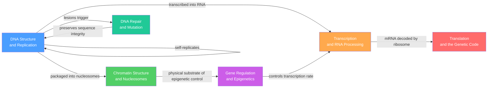

# Molecular Genetics — Map of Content

> [!info] How to use this map
> Start with **Fundamentals**, follow the arrows, and use the Learning Path below as your guide.
> Each node links to a full note. Come back to this map when you feel lost.

> [!abstract]
> Molecular genetics is the mechanistic core of all heredity: it describes how genetic information is stored in the DNA double helix, faithfully copied through semiconservative replication, expressed via the central dogma (transcription then translation), precisely regulated through chromatin architecture and epigenetic marks, and maintained against constant chemical damage by a hierarchy of repair pathways. Mastering this section provides the molecular vocabulary and conceptual framework that every downstream area of genetics — genomics, developmental genetics, cancer genetics, and population genetics — depends upon.

---

## Concept Map

*(Blue = fundamental entry point, Red = terminal central dogma output, arrows = "leads to" or "requires")*

---

## Learning Path

### Central Dogma Path

*Recommended order for tracing information flow from genome to protein:*

1. [[DNA_Structure_and_Replication]] — start here: establishes the double helix, base complementarity, and semiconservative replication as the physical basis of heredity
2. [[Chromatin_Structure_and_Nucleosomes]] — how DNA is packaged into nucleosomes, cohesin-extruded loops, and TADs, gating which regions are accessible to the transcription machinery
3. [[Transcription_and_RNA_Processing]] — RNA Pol II reads the accessible DNA template; co-transcriptional 5' capping, spliceosomal intron removal, and polyadenylation produce mature mRNA
4. [[Translation_and_the_Genetic_Code]] — the ribosome decodes mRNA triplets into polypeptide using the near-universal 64-codon genetic code
5. [[Gene_Regulation_and_Epigenetics]] — TFs, DNA methylation, and histone modifications integrate signals to control which genes are transcribed in each cell type and developmental stage

### Genome Maintenance Path

*Recommended order for understanding how the cell preserves its genetic information:*

1. [[DNA_Structure_and_Replication]] — the substrate: understanding B-DNA geometry and the replication machinery is prerequisite to understanding how it is damaged and repaired
2. [[DNA_Repair_and_Mutation]] — the five major repair pathways (BER, NER, MMR, NHEJ, HDR) and the ATM/ATR/p53 surveillance network that corrects ~10,000–100,000 daily lesions
3. [[Gene_Regulation_and_Epigenetics]] — repair failures alter gene expression; epigenetic marks are themselves perpetuated by replication-coupled mechanisms (DNMT1, PRC2 read-write)
4. [[Chromatin_Structure_and_Nucleosomes]] — chromatin compaction controls repair factor access; TAD boundary disruption by accumulated mutations rewires enhancer–promoter contacts

---

## All Notes in This Topic

| Note | Core Process | Key Molecule(s) | Level |
|------|-------------|-----------------|-------|
| [[DNA_Structure_and_Replication]] | Double helix architecture and semiconservative replication | DNA Pol III, helicase, primase, topoisomerase | Beginner |
| [[Chromatin_Structure_and_Nucleosomes]] | Hierarchical genome packaging from nucleosome to chromosome territory | Histone octamer (H2A/B/H3/H4), cohesin, CTCF, HP1 | Intermediate |
| [[Transcription_and_RNA_Processing]] | RNA Pol II synthesis and co-transcriptional pre-mRNA processing | RNA Pol II, spliceosome (U1–U6 snRNPs), CPSF/CstF | Intermediate |
| [[Translation_and_the_Genetic_Code]] | Ribosome-mediated codon decoding into polypeptide | 80S ribosome, tRNA, aminoacyl-tRNA synthetases, EF-Tu/EF-G | Intermediate |
| [[Gene_Regulation_and_Epigenetics]] | TF-driven and epigenetic control of transcription output | DNMT1/3a/3b, HAT/HDAC, PRC2 (EZH2), Mediator | Advanced |
| [[DNA_Repair_and_Mutation]] | Lesion detection, repair pathway choice, and checkpoint activation | DNA glycosylases, ATM/ATR, RAD51, BRCA1/2, p53 | Advanced |

---

## Key Questions This Topic Answers

- How does a cell copy 3 billion base pairs with fewer than three errors per division?
- How is 2 metres of DNA compacted ~300,000-fold into a 6-micrometre nucleus while remaining selectively readable?
- How does genetic information flow irreversibly from DNA sequence to functional protein via the central dogma?
- How do over 200 distinct human cell types arise from an identical genome sequence?
- What prevents ~100,000 daily DNA lesions from accumulating into heritable mutations that drive disease?
- How do BRCA1/2 mutations predispose to cancer, and why do PARP inhibitors selectively kill those tumours?

---

## Connections to Other Topics

- [[_MOC_Genomics]] — Genomics (section 03) scales the mechanisms described here across entire genomes; ATAC-seq maps chromatin accessibility, ChIP-seq maps histone marks and TF binding, RNA-seq measures transcription output, and Hi-C resolves the 3D TAD architecture introduced in Chromatin Structure and Nucleosomes
- [[_MOC_Developmental_Genetics]] — Developmental genetics (section 04) applies epigenetic regulation and chromatin remodeling to cell fate decisions; the Polycomb/Trithorax balance that governs Hox gene silencing and activation during embryogenesis is a direct application of the Gene Regulation and Epigenetics note

---

## Master MOC

[[_MOC_Genetics_Master]]

---

#MOC #Genetics #MolecularGenetics #SectionMOC
