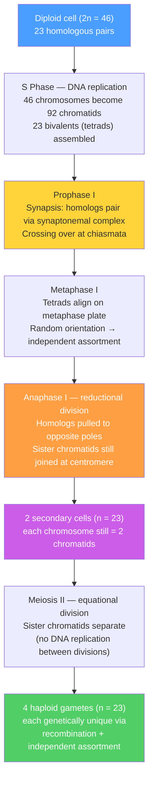

# 🧬 Chromosomal Theory of Inheritance

> [!abstract] TL;DR
> Chromosomes are the physical vehicles of heredity. The **Chromosomal Theory of Inheritance** (Sutton & Boveri, 1902) identifies Mendel's abstract "factors" as genes carried on chromosomes that exist in matched homologous pairs, segregate into gametes during meiosis, and recombine through crossing over — generating the genetic variation that natural selection acts on.

---

## Intuition — analogy FIRST

Imagine you own a matched pair of instruction manuals for building a car. One copy came from your mother, one from your father; together they form a **homologous chromosome pair**. The manuals cover the same topics (genes) on corresponding pages (loci), but individual instructions may differ in wording (alleles).

When you want to pass the blueprints to the next generation, you do not hand over both manuals — that would double the library size each time. Instead, a photocopier first duplicates both manuals (DNA replication), you then **shuffle pages between the two copies** (crossing over at chiasmata), and finally you **randomly choose one shuffled manual from each pair to send** (meiosis I, independent assortment). The recipient gamete gets one complete manual per pair — but it is a unique mosaic of both originals, never seen before.

This is exactly what chromosomes do: replicate, recombine, then segregate so that every gamete carries exactly one homolog from each pair.

---

## How It Works



---

## Key Concepts / Details

### Secondary Level

**Chromosome anatomy.** Every human chromosome has four essential landmarks:

- **Centromere** — the constricted region where the **kinetochore** protein complex assembles; spindle microtubules attach here to pull chromosomes apart. The centromere divides each chromosome into a short **p arm** (from French *petite*) and a long **q arm** (q follows p in the alphabet). Chromosomes with the centromere near the middle are *metacentric*; near one end, *acrocentric*.
- **Telomeres** — caps of tandem TTAGGG repeats at both chromosome ends, maintained by the enzyme **telomerase**. They act like the plastic tips on shoelaces, preventing nuclease degradation and illegitimate end-to-end fusions. Telomeres shorten with each cell division in somatic cells; their erosion is a clock of cellular ageing.
- **Chromatids** — after S-phase DNA replication, each chromosome consists of two identical **sister chromatids** joined at the centromere by the cohesin protein ring. One chromosome = two sister chromatids until anaphase separates them.
- **Satellite DNA** — highly repetitive, largely non-coding sequences concentrated near centromeres and telomeres, visible as distinct bands under early cytogenetic staining.

**Human karyotype.** Humans have **2n = 46** chromosomes in every somatic cell:
- 22 pairs of **autosomes** (numbered 1–22 by decreasing size)
- 1 pair of **sex chromosomes**: XX in females, XY in males

A karyotype is produced by arresting cells in metaphase (colchicine blocks spindle polymerisation), spreading and staining chromosomes, then photographing and arranging them. **G-banding** (Giemsa stain after trypsin treatment) produces a reproducible striped pattern unique to each chromosome, making it the standard for clinical cytogenetics.

**Mitosis vs meiosis.**

| Feature | Mitosis | Meiosis |
|---------|---------|---------|
| Purpose | growth, tissue repair, asexual reproduction | produce haploid gametes or spores |
| Number of divisions | 1 | 2 (meiosis I + meiosis II) |
| Daughter cells | 2 diploid (2n) | 4 haploid (n) |
| Homolog pairing (synapsis) | never | yes — obligate in prophase I |
| Crossing over | rare, not designed for it | yes — at least one per bivalent |
| Genetic outcome | clones of parent cell | genetically unique products |

**Segregation and independent assortment — Mendel explained.** Meiosis gives a physical mechanism to Mendel's two laws:
1. **Law of Segregation (Mendel's 1st Law):** at anaphase I, the two homologs of each pair are pulled to opposite poles — each gamete receives exactly one copy of each chromosome, and therefore exactly one allele at each locus.
2. **Law of Independent Assortment (Mendel's 2nd Law):** at metaphase I, each homolog pair orients toward the poles independently of all other pairs. With 23 chromosome pairs, independent assortment alone produces 2²³ ≈ 8.4 million chromosomally distinct gamete types per individual — before adding the effect of crossing over.

**Sex determination systems.**

| System | Organisms | Males | Females | Determining signal |
|--------|-----------|-------|---------|-------------------|
| XY | most mammals, *Drosophila* | XY | XX | Y carries *SRY* (mammals) |
| ZW | birds, snakes, some moths | ZZ | ZW | Z:W dosage or *DMRT1* |
| X0 | grasshoppers, some nematodes | X0 (one X) | XX | X:autosome ratio |
| Haplodiploidy | Hymenoptera (bees, ants, wasps) | haploid (unfertilised egg) | diploid (fertilised egg) | ploidy level |

In mammals the Y chromosome carries **SRY** (*Sex-determining Region Y*), a transcription factor that triggers Sertoli cell differentiation and testicular development; embryos lacking SRY default to the ovarian pathway regardless of karyotype.

**Sex-linked (X-linked) inheritance.**

- **X-linked recessive:** males are *hemizygous* (one X, no second copy), so a single recessive allele is expressed. Females need two copies (X^a X^a) to show the trait. Classic examples:
  - **Colour blindness** (red–green; ~8% of males, ~0.5% of females worldwide) — mutations in *OPN1LW* or *OPN1MW* on Xq28
  - **Haemophilia A** — defective clotting Factor VIII (*F8*, Xq28); haemophilia B — defective Factor IX (*F9*, Xq27)
  - A carrier mother (X^A X^a) passes the allele to 50% of sons (affected) and 50% of daughters (carriers); transmission jumps a generation through carrier females.
- **X-linked dominant:** one copy of the dominant allele on either X is sufficient; males are always fully affected; heterozygous females are affected but often less severely. Example: **hypophosphatemia** (X-linked vitamin D-resistant rickets, *PHEX* gene).
- **Y-linked (holandric):** genes on the non-recombining region of Y pass exclusively from fathers to **all** sons. The AZF region (AZFa/b/c) carries genes essential for spermatogenesis; deletions here cause male infertility.

**Non-disjunction and aneuploidy.** When chromosome pairs fail to separate (*non-disjunction*) during meiosis I or sister chromatids fail to separate in meiosis II, gametes gain or lose a chromosome. Fertilisation of an abnormal gamete with a normal one produces an **aneuploid** zygote:

| Condition | Karyotype | Mechanism | Key features |
|-----------|-----------|-----------|-------------|
| Down syndrome (trisomy 21) | 47,XX/XY,+21 | maternal meiosis I non-disjunction (~95%) | intellectual disability, distinctive facies; risk rises sharply with maternal age |
| Turner syndrome | 45,X | loss of paternal sex chromosome (~70%) | short stature, ovarian dysgenesis, infertility; female phenotype |
| Klinefelter syndrome | 47,XXY | extra X in a male | hypogonadism, tall stature, often undiagnosed until infertility work-up |
| XYY syndrome | 47,XYY | paternal meiosis II non-disjunction | usually asymptomatic; tall stature |
| Trisomy 18 (Edwards) | 47,+18 | meiosis I error | severe cardiac defects; ~10% survive first year |
| Trisomy 13 (Patau) | 47,+13 | meiosis I error | severe malformations; rarely survive beyond weeks |

Autosomal *monosomies* (2n − 1 for any autosome) are almost always lethal before implantation; this is why monosomy 21 is not seen at birth even though trisomy 21 is viable.

**Chromosomal structural rearrangements.** Chromosomes can break and rejoin incorrectly, producing:

- **Translocation** — a segment moves to a non-homologous chromosome. *Reciprocal*: two chromosomes exchange segments; balanced carriers are usually phenotypically normal but produce unbalanced gametes. *Robertsonian*: two acrocentric chromosomes (13, 14, 15, 21, 22) fuse at their centromeres — the t(14;21) fusion causes ~5% of Down syndrome cases and runs in families.
- **Inversion** — a segment is excised and reinserted in reverse orientation. *Paracentric* (doesn't include centromere) vs *pericentric* (includes centromere). Inversion heterozygotes suppress recombination within the inverted segment, maintaining co-adapted haplotype blocks.
- **Deletion** — loss of a chromosomal segment, typically causing haploinsufficiency. Cri-du-chat syndrome: deletion of 5p15.3. DiGeorge syndrome: 22q11.2 microdeletion.
- **Duplication** — an extra copy of a segment; source of new genes via divergent evolution (e.g., vertebrate colour-vision opsin genes arose from ancient tandem duplications).

---

### Undergraduate Level

**Sutton–Boveri chromosome theory (1902–1904).** Walter Sutton studied grasshopper spermatogenesis and noticed that chromosomes exist as matched homologous pairs that segregate during meiosis exactly as Mendel's factors did — they even associated in the same ratios. Theodor Boveri performed sea urchin polyspermy experiments: when eggs were fertilised by two sperm (producing abnormal chromosome combinations), larval development was invariably defective in ways that depended on *which* chromosomes were present — proving individual chromosomes carry distinct essential information. Thomas Hunt Morgan's group sealed the theory by showing that *Drosophila* genes encoding body colour and wing shape were **physically linked** on the same chromosome and violated independent assortment, demonstrating that genes ride chromosomes.

**Chi-square test for X-linkage.** To determine if a trait is X-linked rather than autosomal, one examines phenotype ratios in each sex. For an X-linked recessive cross (carrier female × unaffected male):
- Expected among sons: 1/2 affected : 1/2 unaffected
- Expected among daughters: 0 affected (all unaffected or carrier)

Deviation from these expectations is tested with:

$$\chi^2 = \sum_{i} \frac{(O_i - E_i)^2}{E_i}$$

with degrees of freedom = number of phenotypic classes − 1. A significant χ² combined with the pattern of sex-specific expression (affected males, unaffected carrier females) supports X-linkage over autosomal recessive.

**Chromosome painting and FISH.** **Fluorescence in situ hybridisation (FISH)** uses fluorescently labelled DNA probes that hybridise to specific chromosomal loci or whole chromosomes on a glass slide:
- Denaturation: double-stranded DNA in spread chromosomes is melted to single strands by heat or formamide
- Hybridisation: labelled probe anneals to its complementary sequence
- Detection: fluorescence microscopy reveals the probe location as a bright spot or coloured chromosome

Applications:
- **Spectral karyotyping (SKY)**: 24 chromosome-specific probes in distinct fluorescent colours allow all human chromosome types to be identified simultaneously — ideal for complex cancer karyotypes
- **Interphase FISH**: detects gene amplifications (HER2 in breast cancer) or deletions in non-dividing cells without a karyotype
- **Microdeletion detection**: identifies DiGeorge 22q11.2, Williams 7q11.23, and Prader-Willi/Angelman 15q11-13 deletions missed by G-banding

**X-inactivation (lyonisation).** In female mammals, one X chromosome per somatic cell is stably silenced early in embryogenesis by coating with **XIST** long non-coding RNA (transcribed from the inactive X only), triggering chromatin compaction into a **Barr body**. Key properties:
- Random (either the maternal or paternal X may be silenced, independently in each cell)
- Clonally maintained: all daughter cells of a silenced cell silence the same X
- Makes females **mosaics**: tissues contain patches expressing either the maternal or the paternal X

This explains why carrier females for X-linked disorders are usually unaffected (most cells express the functional allele), but also why some carriers show mild symptoms (skewed X-inactivation). The inactive X is not completely silent: ~15–25% of X-linked genes **escape** inactivation, particularly in the pseudoautosomal regions (PARs), explaining why Turner (45,X) females have a distinct phenotype from normal XX females.

**Recombination frequency and centiMorgans.** Crossing over between homologs during prophase I creates chiasmata — physical exchanges visible under the microscope. The frequency of recombination between two loci is proportional to the physical distance separating them. **1 centimorgan (cM) = 1% recombinant offspring** in a test cross. Loci on different chromosomes (or > 50 cM apart on the same chromosome) show 50% recombination and appear to assort independently; tightly linked loci show < 50% recombination and violate Mendel's second law.

---

### Graduate Level

**Cohesin loading and stepwise resolution.** The cohesin complex — a tripartite ring formed by SMC1, SMC3, and the kleisin subunit RAD21, stabilised by HEAT-repeat subunits STAG1 or STAG2 — is loaded onto replicated chromatids in S phase and physically entraps sister chromatids inside its ring. In meiosis, cohesin must be removed in two controlled steps to allow sequential segregation:

1. **Anaphase I:** cohesin along chromosome *arms* is cleaved by the protease **separase** (activated when APC/C^Cdc20^ ubiquitinates and destroys **securin**). Arm cohesin removal allows homologs to separate; chiasmata resolve.
2. **Anaphase II:** residual *centromeric* cohesin is cleaved by the same separase wave, separating sister chromatids.

Between the two steps, centromeric cohesin is protected by **shugoshin 1 (SGO1)**, which recruits **protein phosphatase 2A (PP2A)** to dephosphorylate cohesin SA subunits at the centromere, blocking separase access. SGO1 is itself localised by **MEIKIN**, a meiosis-specific kinase that links SGO1 to the mono-oriented kinetochore complex specific to meiosis I. Meikin-null mice show precocious separation of sister chromatids in meiosis I, causing catastrophic aneuploidy.

**Kinetochore co-orientation in meiosis I.** In mitosis, sister kinetochores are *bi-oriented* (amphitelic) — each faces an opposite pole. For meiosis I to segregate homologs, sister kinetochores must be *mono-oriented* (syntelic) — both facing the same pole, so that homologs rather than sisters are pulled apart. Molecular basis:
- **MEIKIN–PLK1 axis:** MEIKIN recruits PLK1 to inner centromeres; PLK1 phosphorylates substrates that geometrically fuse the two sister kinetochores into a single microtubule-capture unit
- **HORMAD1/2 proteins** coat unsynapsed chromosomal axes in prophase I, ensuring the synaptonemal complex forms correctly and mono-orientation is established
- **Monopolin complex** in *S. cerevisiae* (Mam1, Csm1, Lrs4) cross-links sister kinetochores during meiosis I

In meiosis II, SGO2 and PLK1 reset the system to the standard bi-oriented configuration, allowing sister chromatid segregation identical to mitosis.

**Spindle Assembly Checkpoint (SAC).** The SAC monitors whether every kinetochore is under tension from properly attached, amphitelic spindle fibres (in meiosis II) or under the correct syntelic tension (in meiosis I). Unattached or low-tension kinetochores recruit MAD1–MAD2, BUB1/BUBR1, and BUB3 to catalyse the **Mitotic Checkpoint Complex (MCC = MAD2:BUBR1:BUB3:CDC20)**. MCC sequesters CDC20, preventing it from activating APC/C. Without APC/C^Cdc20^:
- **Securin** persists → separase inactive → cohesin intact → no anaphase
- **Cyclin B** persists → CDK1 active → mitotic state maintained

Once all kinetochores are satisfied, MCC rapidly dissembles via p31^comet^ and TRIP13 (an AAA-ATPase), CDC20 is liberated, APC/C fires, securin and cyclin B are poly-ubiquitinated and proteasomally degraded, separase cleaves cohesin, and the cell enters anaphase. SAC is weaker in oocytes (low MAD2 levels, long prophase I arrest), contributing to the high aneuploidy rate in aged human eggs.

**Meiotic drive.** Mendel's first law predicts equal transmission of both alleles. **Meiotic (segregation) drive** violates this by allowing one allele to end up in > 50% of functional gametes through selfish manipulation of meiotic mechanics:

- **t-haplotype in mice (chr 17):** heterozygous (+/t) males transmit t to ~90% of offspring. The t-haplotype encodes a **trans-acting poison** (hyperactivated SMOK kinase disrupts RAC1–CDC42 signalling in sperm flagella) that incapacitates wild-type sperm while t-bearing sperm carry a specific **RAC1-GEF antidote** (TAGAP1, FGD2) that neutralises the poison.
- **Segregation Distorter (SD) in *Drosophila*:** SD encodes a truncated **RanGAP** that mislocalises RanGTP and destabilises *Responder (Rsp)*-bearing sperm chromatin during spermiogenesis; SD-bearing sperm carry an insensitive *Rsp^i^* allele.
- **Female centromere drive:** because female meiosis retains only 1 of 4 meiotic products as the egg, chromosomes with *stronger* centromeres (more CENP-A loading) are preferentially captured by the cortical spindle pole that retains the egg nucleus, at the expense of weaker centromeres relegated to polar bodies. This is thought to have driven centromeric satellite DNA evolution.

Evolutionary consequence: meiotic drive alleles can spread even when homozygous lethality or reduced fitness would normally eliminate them, leading to evolutionary arms races with *suppressor* alleles and explaining unusually rapid centromere and centromeric protein evolution across species.

---

## Python Demo

```python
# pip install numpy matplotlib
# Simulate independent assortment of N_PAIRS chromosome pairs during meiosis.
# For each gamete, every chromosome pair independently contributes the paternal (0)
# or maternal (1) homolog with equal probability, modelling independent assortment.
# Plots observed gamete distribution vs the theoretical binomial expectation and
# prints the fraction of gametes receiving >= k maternal chromosomes.

import numpy as np
import matplotlib.pyplot as plt
from math import comb

N_PAIRS = 4        # chromosome pairs to model (use 4 for clarity; humans have 23)
N_SIM   = 100_000  # number of gametes to simulate

rng = np.random.default_rng(42)

# For each gamete, draw independently for each pair: 0 = paternal, 1 = maternal
draws = rng.integers(0, 2, size=(N_SIM, N_PAIRS))   # shape: (N_SIM, N_PAIRS)
maternal_count = draws.sum(axis=1)                   # 0 to N_PAIRS per gamete

# Theoretical binomial(N_PAIRS, 0.5) probabilities
k_vals      = np.arange(N_PAIRS + 1)
binom_probs = np.array([comb(N_PAIRS, k) / (2 ** N_PAIRS) for k in k_vals])

# Print table of exact and cumulative probabilities
print(f"Independent assortment simulation — {N_PAIRS} chromosome pairs\n")
print(f"{'k':>4} | {'P(X=k) sim':>12} | {'P(X=k) theory':>14} | {'P(X>=k) sim':>12}")
print("-" * 50)
for k in k_vals:
    p_exact  = (maternal_count == k).mean()
    p_cumul  = (maternal_count >= k).mean()
    print(f"{k:>4} | {p_exact:>12.4f} | {binom_probs[k]:>14.4f} | {p_cumul:>12.4f}")

# Plot: simulated histogram bars vs theoretical probability bars (offset for clarity)
fig, ax = plt.subplots(figsize=(7, 4))
bins = np.arange(-0.5, N_PAIRS + 1.5, 1)
ax.hist(maternal_count, bins=bins, density=True,
        alpha=0.55, color="steelblue", edgecolor="white", label="Simulated")
ax.bar(k_vals + 0.20, binom_probs, width=0.35, alpha=0.85,
       color="tomato", edgecolor="white", label="Binomial(n,0.5) theoretical")
ax.set_xlabel(f"Maternal chromosomes in gamete (out of {N_PAIRS} pairs)")
ax.set_ylabel("Probability")
ax.set_title(f"Meiotic Independent Assortment — {N_PAIRS} Chromosome Pairs")
ax.set_xticks(k_vals)
ax.legend()
plt.tight_layout()
plt.savefig("meiotic_assortment.png", dpi=150)
plt.show()

# Scale-up note: with all 23 human chromosome pairs
print(f"\nWith 23 human chromosome pairs:")
print(f"  Distinct gamete types from independent assortment alone: {2**23:,}")
print(f"  P(all 23 maternal) = 1/{2**23:,} = {1/2**23:.2e}")
```

---

## Real-World Applications

**Prenatal chromosomal testing.**
- *Conventional karyotype (amniocentesis / CVS)*: cultured fetal cells arrested in metaphase, G-banded, and photographed. Detects all whole-chromosome aneuploidies and large rearrangements (> 5–10 Mb). Invasive procedure carrying ~0.5–1% procedural loss risk.
- *Non-invasive prenatal testing (NIPT)*: cell-free fetal DNA (~10–15% of maternal plasma DNA after 10 weeks gestation) is sequenced at low depth; chromosome 21, 18, and 13 trisomies are detected by statistical over-representation. Sensitivity > 99% for trisomy 21 — but it is a *screening* test, not diagnostic; positive results require confirmatory karyotype.
- *Chromosomal microarray (CMA)*: detects submicroscopic copy-number variants (CNVs) 100× smaller than those visible by G-banding; recommended by ACMG for unexplained intellectual disability, autism spectrum disorder, and multiple congenital anomalies.

**Down syndrome (trisomy 21).**
Trisomy 21 (~1/700 live births) is the most common viable autosomal aneuploidy. In ~95% of cases it arises from maternal meiosis I non-disjunction — the chromosome 21 bivalent fails to separate, producing an egg with two copies. The extra chromosome 21 increases dosage of genes including *DYRK1A* (dual-specificity kinase disrupting neurogenesis), *HMGN1*, and *APP* (amyloid precursor protein — explaining early-onset Alzheimer in trisomy 21). Recurrence risk is ~1% above the age-specific background after one affected child; familial Down from a Robertsonian t(14;21) translocation carries a ~10–15% recurrence risk in carrier mothers.

**Cancer cytogenetics: the Philadelphia chromosome.**
In **chronic myeloid leukaemia (CML)**, a balanced translocation t(9;22)(q34;q11) fuses the *ABL1* tyrosine kinase gene (chromosome 9) to *BCR* (chromosome 22), producing the **BCR-ABL1** fusion oncoprotein — a constitutively active kinase driving uncontrolled granulocyte proliferation. The shortened derivative chromosome 22 is the "Philadelphia chromosome," present in > 95% of CML and 20% of adult ALL cases. **Imatinib (Gleevec)**, the first targeted kinase inhibitor rationally designed to fit the BCR-ABL1 ATP-binding pocket, achieves > 80% complete cytogenetic remission with minimal off-target toxicity — a landmark proof-of-concept for structure-based drug design. FISH for BCR-ABL1 fusion and quantitative PCR for BCR-ABL1 mRNA are now standard diagnostic and monitoring tools.

**Sex chromosome variation in elite athletics.**
Individuals with **46,XY differences of sex development (DSD)** — including complete androgen insensitivity syndrome (CAIS, X-linked) and 5α-reductase-2 deficiency (autosomal recessive) — may have a female phenotype, female socialisation, and testosterone levels in the male reference range. The *Caster Semenya* case (Court of Arbitration for Sport, 2019) and subsequent World Athletics testosterone regulations placed chromosomal sex and androgen biology at the intersection of science, ethics, and human rights. These cases illustrate that sex determination is a *developmental* spectrum, not a genetic binary: the same XY karyotype can produce a wide range of phenotypes depending on hormonal signalling, receptor sensitivity, and developmental timing.

---

## Common Pitfalls

1. **Confusing the two meiotic divisions** — meiosis I is the *reductional* division (homologs separate; chromosome number halves); meiosis II is the *equational* division (sister chromatids separate; chromosome number stays the same). Non-disjunction in meiosis I produces a gamete carrying *both* homologs (heterozygous for any differing alleles after recombination); non-disjunction in meiosis II produces a gamete with *two copies of the same post-crossover chromatid* — the distinction matters for interpreting which parent transmitted the extra chromosome.

2. **Conflating ploidy with chromatid number** — a diploid cell after S phase has 2n chromosomes but 4n chromatids (DNA content = 4C). It is *not* tetraploid; it is a diploid cell in G2. Tetraploidy means four copies of each chromosome, not four chromatids per bivalent.

3. **Treating X-linked as the only sex-linked inheritance** — Y-linked (holandric) genes pass exclusively from fathers to all sons; X-linked genes can be transmitted through daughters. A pedigree showing exclusively father-to-son transmission points to Y-linkage, not X-linkage.

4. **Assuming all trisomies are equally viable** — autosomal monosomies are almost never seen at birth (lethal before implantation); most autosomal trisomies are also lethal in utero. Only trisomies 21, 18, 13, and sex-chromosome aneuploidies survive to term with appreciable frequency, because chromosomes 21, 13, and 18 are gene-poor, and extra sex chromosomes are tolerated through X-inactivation.

5. **Ignoring pseudoautosomal regions (PARs)** — PAR1 (Xp22.3 / Yp11.3) and PAR2 (Xq28 / Yq12) are genuinely homologous between X and Y; obligatory crossover in PAR1 during male meiosis I ensures sex chromosome disjunction. Genes in the PARs do not show X-linked inheritance (they assort like autosomes). Treating PAR loci as X-linked leads to wrong predictions.

6. **Assuming recombination always increases diversity** — crossing over reshuffles alleles but creates no new alleles; in a completely homozygous individual (all loci identical between homologs), crossing over is genetically silent. Recombination's diversity-generating role depends on pre-existing allelic heterozygosity.

---

## Related Concepts

- [[_MOC_Classical_and_Population_Genetics|↑ Classical and Population Genetics MOC]]
- [[Mendelian_Inheritance_Patterns]] — chromosomal mechanics (segregation at anaphase I, random orientation at metaphase I) provide the direct physical basis for Mendel's first and second laws; physical linkage on the same chromosome produces deviations from the expected 9:3:3:1 dihybrid ratio
- [[Linkage_Mapping_and_Recombination]] — crossover frequency between two loci on the same chromosome is measured in centiMorgans; the prophase I chiasmata observed here are the molecular events underlying every linkage map
- [[Biological_Basis_of_Behavior]] — sex chromosomes and gonadal hormones modulate brain organisation and behavioural predispositions; trisomy 21 and sex-chromosome aneuploidies (Turner, Klinefelter) have well-characterised neurocognitive and psychiatric profiles
- [[Nucleic_Acids_and_the_Central_Dogma]] — chromosomes are the physical packaging of DNA; nucleosome wrapping, chromatin compaction, centromeric CENP-A nucleosomes, and telomeric G-quadruplexes all arise from the nucleotide chemistry of DNA strands

---

## Review Questions

1. **Secondary**: Draw a cell in metaphase I of meiosis for an organism with 2n = 6 (three chromosome pairs). Label one homolog pair, show a chiasma on one bivalent, and identify the centromere of each chromosome. Explain what would happen to the resulting gametes if non-disjunction occurred in this cell during anaphase I — which chromosomes would be present in each daughter cell?

2. **Undergraduate**: A woman known to be a carrier of haemophilia A (X^H X^h) and a balanced carrier of a Robertsonian translocation t(14;21) has children with an unaffected, karyotypically normal man. (a) What fraction of their sons would you expect to have haemophilia? (b) What fraction of all offspring are at risk for Down syndrome from the translocation? (c) The couple requests prenatal diagnosis — compare the information provided by conventional karyotype, FISH, and chromosomal microarray for this specific case.

3. **Graduate**: Aged human oocytes have higher rates of meiotic non-disjunction than young oocytes, even though the SAC is intact. Integrate the following observations into a mechanistic model: (a) cohesin on chromosomes is loaded in fetal life and not replenished; (b) MAD2 levels are lower in oocytes than in somatic cells; (c) the spindle assembly checkpoint requires many hours to arrest an oocyte but only minutes in a somatic cell; (d) bivalent inter-kinetochore distances are reduced in aged oocytes. How does "cohesin fatigue" lead to increased non-disjunction, and why is SAC insufficiency an aggravating factor rather than the root cause?

---

## Sources

- Griffiths, A.J.F. et al. — *Introduction to Genetic Analysis*, 12th ed., W.H. Freeman (2020)
- Alberts, B. et al. — *Molecular Biology of the Cell*, 7th ed., W.W. Norton (2022), Ch. 17–18
- Strachan, T. & Read, A. — *Human Molecular Genetics*, 5th ed., CRC Press (2018)
- Hassold, T. & Hunt, P. — "To err (meiotically) is human: the genesis of human aneuploidy," *Nature Reviews Genetics* 2, 280–291 (2001)
- Marston, A.L. & Amon, A. — "Meiosis: cell-cycle controls shuffle and deal," *Nature Reviews Molecular Cell Biology* 5, 983–997 (2004)
- Lampson, M.A. & Black, B.E. — "Cellular and molecular mechanisms of centromere drive," *Cold Spring Harbor Symposia on Quantitative Biology* 82, 249–257 (2017)

---

#Genetics #ClassicalGenetics #Chromosomes #Meiosis
