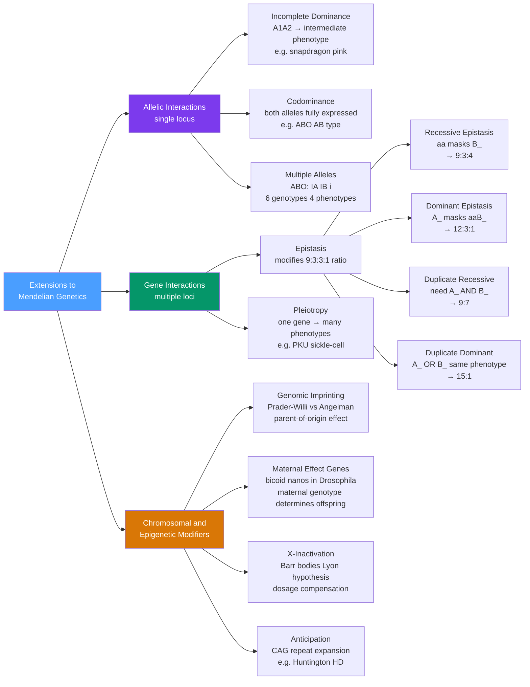

# 🧬 Extensions to Mendelian Genetics

> [!abstract] TL;DR
> Mendelian ratios (3:1, 9:3:3:1) are the baseline grammar of inheritance; extensions — incomplete dominance, codominance, multiple alleles, epistasis, pleiotropy, genomic imprinting, and X-inactivation — are the idioms and exceptions that describe how real genes actually behave when multiple alleles coexist, multiple genes interact, or the same mutation affects many traits simultaneously.

## Intuition — analogy FIRST

Mendel's ratios are like the simple rules of grammar: subject–verb–object, and you are done. They work well for simple sentences. But fluent language is full of idioms, irregular verbs, and exceptions — phrases that break the rules yet are perfectly understood by native speakers. Real biological systems are the same way. Two genes can interact like members of a committee: one loud voice (dominant epistasis) can silence everything else, or all voices must agree to produce an outcome (complementary epistasis). A single gene can wear many hats (pleiotropy), or the same deletion can cause completely different diseases depending on which parent passed it down (genomic imprinting). Each extension is not a failure of Mendel's logic — it is what happens when you apply that logic to a richer, messier, more interconnected genome.

---

## How It Works



---

## Key Concepts / Details

### Secondary Level

**Multiple Alleles and the ABO Blood Group**

Most diploid loci harbour more than two alleles in the population, even though any individual carries only two. The ABO system has three alleles at one locus:

| Allele | Enzyme Produced | Antigen on RBC |
|--------|-----------------|----------------|
| $I^A$  | GalNAc transferase | A antigen |
| $I^B$  | Gal transferase    | B antigen |
| $i$    | none (non-functional) | neither |

$I^A$ and $I^B$ are codominant with each other; both are dominant over $i$. This generates **6 genotypes** but only **4 phenotypes**:

| Genotype | Phenotype |
|----------|-----------|
| $I^A I^A$, $I^A i$ | Blood group A |
| $I^B I^B$, $I^B i$ | Blood group B |
| $I^A I^B$          | Blood group AB (codominance) |
| $ii$               | Blood group O |

**Incomplete Dominance**

When neither allele is fully dominant, the heterozygote has an intermediate phenotype. The classic example is snapdragon flower colour: $R_1R_1$ = red, $R_2R_2$ = white, $R_1R_2$ = pink. The F2 ratio is **1 red : 2 pink : 1 white** — the genotypic ratio is unchanged, but each genotype maps to a distinct phenotype.

**Codominance**

Both alleles are fully expressed in the heterozygote. The $I^A I^B$ blood type is the canonical example: both A and B antigens appear on red blood cells. No blending occurs — the products of both alleles function simultaneously.

**Epistasis and Modified 9:3:3:1 Ratios**

In a standard dihybrid cross $AaBb \times AaBb$, the phenotypic ratio is **9 A\_B\_ : 3 A\_bb : 3 aaB\_ : 1 aabb**. Epistasis occurs when the genotype at one locus masks or modifies the expression of another. The four core types:

| Epistasis Type | Mechanism | Ratio | Example |
|---|---|---|---|
| Recessive | $aa$ masks $B\_$ | **9:3:4** | Labrador coat colour (ee yellow masks B/b) |
| Dominant | $A\_$ masks $aaB\_$ | **12:3:1** | Summer squash colour (white dominant epistatic) |
| Duplicate recessive | Both $A\_$ AND $B\_$ needed for phenotype 1 | **9:7** | Sweet pea purple flower (C and P loci) |
| Duplicate dominant | $A\_$ OR $B\_$ gives same phenotype | **15:1** | Wheat kernel pigmentation |

The total is always 16 (as expected from two independent loci), but the classes are merged in different ways.

**Pleiotropy**

One gene affects multiple, apparently unrelated phenotypic traits. The single causal mutation has downstream consequences across several biological systems.

- **PKU (phenylketonuria)**: Loss-of-function in phenylalanine hydroxylase (*PAH*) leads to intellectual disability, fair skin and hair, musty odour, and seizures — all from the same enzyme deficiency.
- **Sickle-cell disease**: A single $\beta$-globin substitution (Glu6Val) causes haemolytic anaemia, vascular occlusion, splenomegaly, renal damage, and stroke — plus heterozygous protection against falciparum malaria.

---

### Undergraduate Level

**Penetrance and Expressivity**

These two concepts separate genotype from phenotype quantitatively.

- **Penetrance** is the proportion of individuals carrying a given genotype who actually display the associated phenotype. *Complete penetrance*: 100% show the trait. *Incomplete penetrance*: some carriers are phenotypically normal (e.g., BRCA1 pathogenic variants: ~72% lifetime breast cancer risk, not 100%).
- **Expressivity** is the degree to which the phenotype is expressed among those who show it at all. *Variable expressivity* produces a spectrum of severity from the same genotype (e.g., neurofibromatosis type 1).

Penetrance and expressivity are influenced by genetic background (modifier alleles), environment, stochastic developmental variation, and sex.

**Genomic Imprinting and Parent-of-Origin Effects**

For most autosomal loci, the maternal and paternal copies are equally expressed. Imprinted genes are exceptions: only one parental copy is expressed, the other silenced by DNA methylation and histone modification established in the germline. The clearest clinical example is chromosome **15q11–q13**:

| Deletion on | Syndrome | Key Features |
|---|---|---|
| Paternal chr 15 | Prader-Willi (PWS) | hypotonia, hyperphagia, obesity, short stature, hypogonadism |
| Maternal chr 15 | Angelman (AS) | severe intellectual disability, absent speech, happy affect, seizures |

The *same physical deletion* produces two completely different diseases depending solely on which parent contributed the chromosome. The mechanism: in the PWS region, normally only the paternal *SNRPN* and related genes are expressed; in the AS region, normally only the maternal *UBE3A* is expressed.

**Maternal Effect Genes**

In some organisms, offspring phenotype is determined by the *mother's* genotype, not the offspring's own. The maternal gene product (mRNA or protein) is deposited into the oocyte before fertilisation; the zygotic genome is irrelevant for that trait.

In *Drosophila* embryogenesis:
- **Bicoid (bcd)**: maternal *bcd* mRNA is localised to the anterior pole by cytoskeletal anchors. After fertilisation, Bicoid protein diffuses posteriorly, forming an exponentially decaying gradient. Above a threshold concentration, Bicoid activates *hunchback* and represses *caudal*, establishing the anterior body plan.
- **Nanos (nos)**: maternal *nos* mRNA is localised to the posterior pole. Nanos protein diffuses anteriorly and represses *hunchback* translation posteriorly, permitting abdominal segmentation.

A mother homozygous $bcd^-/bcd^-$ produces offspring lacking any anterior structures — regardless of whether the offspring themselves carry a wild-type copy inherited from the father.

**Epistasis Interaction Terms in ANOVA**

When extending quantitative genetics to two-locus analyses, the phenotypic value for a two-locus system is modelled as:

$$P = \mu + \alpha_A + \alpha_B + \delta_A + \delta_B + i_{AA} + i_{AD} + i_{DA} + i_{DD} + \varepsilon$$

where $\alpha$ terms are additive effects, $\delta$ terms are dominance deviations within a locus, and $i$ terms are **epistatic interaction effects** between loci (additive × additive, additive × dominance, dominance × additive, dominance × dominance). In a two-way ANOVA on offspring phenotypes crossed by genotype class at each locus, a significant locus-A × locus-B interaction term is the statistical signature of epistasis.

The **coefficient of epistasis** $\varepsilon_{AB}$ is sometimes defined as the departure of the double-mutant phenotype from the multiplicative expectation of the two single-mutant effects:

$$\varepsilon_{AB} = f_{AB} - f_A \cdot f_B$$

where $f$ denotes fitness (or another phenotypic measure) normalised to wild type.

**X-Inactivation and Dosage Compensation**

Mammalian females have two X chromosomes; males have one. To equalise X-linked gene dosage between sexes, one X is inactivated in each female somatic cell — the **Lyon hypothesis** (1961). Key features:

- Inactivation is random with respect to which parental X is silenced.
- It occurs in the early embryo (around day 16 in humans) and is **clonally heritable**: all descendants of a cell maintain the same inactive X.
- The inactive X is physically condensed as a **Barr body** and replicates late in S phase.
- Mechanistically, *XIST* non-coding RNA is transcribed from the X-inactivation centre (XIC) and coats the X in cis, recruiting Polycomb repressive complexes and triggering H3K27 trimethylation.
- Calico cats illustrate X-inactivation visibly: orange and black coat patches correspond to clones expressing different X chromosomes.

Approximately 15–25% of human X-linked genes **escape inactivation** and are expressed biallelically in females; these are concentrated at the pseudoautosomal regions and the distal short arm.

---

### Graduate Level

**Anticipation and Trinucleotide Repeat Expansion**

Some genetic diseases worsen in severity and/or manifest earlier in successive generations — a phenomenon called **anticipation**. The molecular basis is the instability of repetitive DNA tracts:

| Disease | Gene | Repeat | Normal | Premutation | Full Mutation |
|---|---|---|---|---|---|
| Huntington's | *HTT* exon 1 | CAG | 10–35 | 36–39 | ≥40 |
| Myotonic dystrophy 1 | *DMPK* 3′ UTR | CTG | 5–37 | 38–49 | ≥50 (up to 4000) |
| Fragile X | *FMR1* 5′ UTR | CGG | 6–44 | 55–200 | >200 |
| Friedreich's ataxia | *FXN* intron 1 | GAA | 5–33 | — | 66–1000 |

The CAG repeat in *HTT* encodes a polyglutamine (polyQ) tract. Expanded polyQ causes protein aggregation, disrupts transcription and axonal transport, and eventually triggers neuronal apoptosis. Paternal transmission of Huntington alleles shows greater repeat instability due to meiotic slippage during spermatogenesis.

**Epistasis in Systems Biology: Genetic Interaction Networks**

In the context of gene networks, epistasis quantifies how the effect of a mutation in gene A depends on the genetic background at gene B. The epistasis score $\varepsilon$ in yeast double-knockout experiments (e.g., E-MAP, SGA screens) takes a continuous value:

- $\varepsilon < 0$ (negative/aggravating epistasis): the double mutant is sicker than expected — the genes buffer each other or act in parallel pathways.
- $\varepsilon > 0$ (positive/alleviating epistasis): the double mutant is healthier than expected — the genes act in the same pathway.
- $\varepsilon = 0$: multiplicative independence.

Genetic interaction networks (e.g., from Costanzo et al. 2016, mapping ~5.4 million yeast gene pairs) reveal modular structure: genes in the same protein complex show positive epistasis; genes in redundant parallel pathways show negative epistasis.

**Synthetic Lethality and Cancer Therapeutics**

Synthetic lethality arises when simultaneous loss of two genes is lethal, but loss of either alone is viable. This concept underpins one of the most successful targeted cancer therapy strategies:

- *BRCA1* or *BRCA2* mutations impair homologous recombination (HR) DNA repair.
- PARP (poly-ADP ribose polymerase) is required for base excision repair (BER) of single-strand breaks; when BER is blocked by PARP inhibitors, single-strand breaks collapse into double-strand breaks.
- In BRCA-deficient cells (no HR), those DSBs are lethal. In normal cells (HR intact), the DSBs are repaired and the cell survives.
- PARP inhibitors (olaparib, niraparib) therefore selectively kill BRCA-mutant tumour cells while sparing normal tissue — a synthetic lethal therapeutic window.

**Imprinting Control Regions (ICRs)**

Genomic imprinting is controlled by **differentially methylated regions (DMRs)**, also called imprinting control regions. ICRs acquire parent-specific methylation marks in the germline (imprinting establishment) that are maintained through embryonic genome-wide demethylation (imprinting maintenance) and propagated mitotically in somatic cells.

The *H19/IGF2* imprinting cluster illustrates the mechanism: the ICR between *H19* and *Igf2* is methylated on the paternal allele. On the maternal allele, the unmethylated ICR binds the insulator protein CTCF, blocking enhancers from activating *Igf2* and directing them to *H19* instead. On the paternal allele, the methylated ICR cannot bind CTCF; enhancers freely activate *Igf2* while *H19* is silenced.

Disruption of ICR methylation through uniparental disomy, imprinting centre deletion, or epimutation underlies multiple growth and developmental syndromes (BWS, Silver-Russell, Prader-Willi, Angelman, Temple syndrome).

---

## Python Demo

```python
# pip install numpy matplotlib
import numpy as np
import matplotlib.pyplot as plt

np.random.seed(42)
n_offspring = 10_000

# Simulate AaBb x AaBb dihybrid cross
# Randomly draw one allele from each parent for each locus
a_p1 = np.random.choice(['A', 'a'], size=n_offspring, p=[0.5, 0.5])
a_p2 = np.random.choice(['A', 'a'], size=n_offspring, p=[0.5, 0.5])
b_p1 = np.random.choice(['B', 'b'], size=n_offspring, p=[0.5, 0.5])
b_p2 = np.random.choice(['B', 'b'], size=n_offspring, p=[0.5, 0.5])

# Determine dominant/recessive genotype class at each locus
has_A = (a_p1 == 'A') | (a_p2 == 'A')   # True if A_ genotype
has_B = (b_p1 == 'B') | (b_p2 == 'B')   # True if B_ genotype
is_aa = ~has_A
is_bb = ~has_B

# --- Standard Mendelian 9:3:3:1 ---
std_counts = [
    (has_A & has_B).sum(),   # A_B_  expected 9/16
    (has_A & is_bb).sum(),   # A_bb  expected 3/16
    (is_aa & has_B).sum(),   # aaB_  expected 3/16
    (is_aa & is_bb).sum(),   # aabb  expected 1/16
]
std_expected = [9/16, 3/16, 3/16, 1/16]
std_labels   = ['A_B_\n(exp 9)', 'A_bb\n(exp 3)', 'aaB_\n(exp 3)', 'aabb\n(exp 1)']

# --- Recessive epistasis 9:3:4 (aa masks B_) ---
# Phenotype 3 collapses aaB_ and aabb: aa is epistatic regardless of B
epi_counts = [
    (has_A & has_B).sum(),   # A_B_        expected 9/16
    (has_A & is_bb).sum(),   # A_bb        expected 3/16
    is_aa.sum(),             # aa__ (both) expected 4/16
]
epi_expected = [9/16, 3/16, 4/16]
epi_labels   = ['A_B_\n(exp 9)', 'A_bb\n(exp 3)', 'aa__\n(exp 4)']

fig, axes = plt.subplots(1, 2, figsize=(12, 5))

for ax, counts, expected, labels, title in [
    (axes[0], std_counts, std_expected, std_labels, 'Standard Dihybrid  9:3:3:1'),
    (axes[1], epi_counts, epi_expected, epi_labels, 'Recessive Epistasis  9:3:4'),
]:
    x = np.arange(len(counts))
    obs_freq = [c / n_offspring for c in counts]
    ax.bar(x - 0.2, obs_freq,  0.38, label='Simulated', color='steelblue')
    ax.bar(x + 0.2, expected,  0.38, label='Expected',  color='orange', alpha=0.8)
    ax.set_xticks(x)
    ax.set_xticklabels(labels, fontsize=9)
    ax.set_ylabel('Frequency')
    ax.set_ylim(0, 0.65)
    ax.set_title(title)
    ax.legend()

fig.suptitle(f'AaBb x AaBb Dihybrid Cross — {n_offspring:,} Simulated Offspring', fontsize=13)
plt.tight_layout()
plt.savefig('epistasis_simulation.png', dpi=150)
print("Simulated 9:3:3:1 :", [f"{c/n_offspring:.4f}" for c in std_counts])
print("Simulated 9:3:4   :", [f"{c/n_offspring:.4f}" for c in epi_counts])
```

---

## Real-World Applications

**Labrador Retriever Coat Colour — Recessive Epistasis**

Two loci determine coat colour in Labradors. The *B* locus controls eumelanin pigment (B = black, b = chocolate). The *E* locus controls pigment deposition (E = permits deposition, e = blocks it). Dogs with $ee$ are yellow regardless of B/b genotype because no pigment reaches the hair shaft — $ee$ is epistatically recessive to the B locus. Crossing $BbEe \times BbEe$ yields the 9 black : 3 chocolate : 4 yellow ratio characteristic of recessive epistasis.

**Sweet Pea Complementary Epistasis — Duplicate Recessive (9:7)**

William Bateson and Reginald Crundall Punnett (1906) crossed two white-flowered sweet pea varieties and obtained purple-flowered F1 plants — the original observation that led to the concept of epistasis. The F2 ratio was 9 purple : 7 white. Two unlinked loci (*C* and *P*) each encode enzymes in the anthocyanin pathway; functional alleles at *both* loci are required to produce purple pigment. Any genotype lacking a dominant allele at either locus produces no pigment.

**Cystic Fibrosis Modifier Genes — Variable Expressivity**

All classic CF patients are homozygous for *CFTR* loss-of-function mutations, yet lung disease severity varies enormously. Modifier loci — including *MUC5B*, *TGFB1*, and *DCTN4* — create epistatic effects that explain a substantial fraction of phenotypic variance in CF lung function independent of the *CFTR* genotype. This is a direct clinical example of how genetic background modulates expressivity.

**Cancer Synthetic Lethality — PARP Inhibitors**

The FDA-approved PARP inhibitor olaparib exploits synthetic lethality between *BRCA1/2* deficiency and PARP inhibition to treat ovarian and breast cancers driven by BRCA mutations. The therapeutic window is entirely a consequence of epistasis in the DNA damage response network: two parallel repair pathways (HR and BER) exhibit negative epistasis (their simultaneous loss is far more damaging than additive). Drug-combination epistasis screens in cancer cell lines now systematically map these synthetic lethal pairs to discover new targeted therapies.

---

## Common Pitfalls

- **Confusing epistasis with dominance** — Dominance is an interaction between alleles at the *same* locus; epistasis is an interaction between alleles at *different* loci. The terms are not interchangeable, though students frequently conflate them.
- **Misidentifying epistasis ratios** — Always tabulate the 16-box Punnett square first, identify which classes merge, then derive the ratio. Attempting to deduce the ratio from the mechanism alone without the Punnett square leads to errors in which classes are combined.
- **Assuming modified ratios imply linkage** — Deviations from 9:3:3:1 are caused by epistasis between unlinked genes, not linkage. Linkage distorts ratios differently (more parental-type than recombinant-type offspring) and requires specific mapping crosses to detect.
- **Ignoring penetrance in pedigree analysis** — A skipped generation in an autosomal dominant pedigree is often incomplete penetrance, not a new mutation or different inheritance pattern. Failing to consider penetrance leads to incorrect mode-of-inheritance calls.
- **Conflating maternal effect with maternal inheritance** — Maternal effect (bicoid) is nuclear and Mendelian; it just operates through maternal cytoplasm. Maternal (mitochondrial) inheritance involves the mitochondrial genome, is non-Mendelian, and shows no 3:1 ratios at all.
- **Forgetting that X-inactivation is random, not predetermined** — The inactive X is chosen randomly per cell early in embryogenesis; it is not always the maternal or always the paternal copy. Skewed inactivation (>90:10) can occur by chance or selection and complicates interpretation of female carrier phenotypes for X-linked recessive traits.
- **Treating incomplete penetrance and variable expressivity as synonyms** — Penetrance is binary (does the phenotype appear?); expressivity is continuous (how severe is it?). A disease can have complete penetrance with highly variable expressivity (e.g., NF1).

---

## Related Concepts

- [[_MOC_Classical_and_Population_Genetics|↑ Classical and Population Genetics MOC]]
- [[Mendelian_Inheritance_Patterns]] — the foundational 3:1 and 9:3:3:1 ratios that extensions modify and build upon
- [[Quantitative_Genetics_and_Heritability]] — when multiple genes each contribute small effects, discrete Mendelian classes dissolve into continuous trait distributions; epistasis enters as interaction variance $V_I$
- [[Bayesian_Statistics]] — Bayesian posterior updating is the formal framework for revising disease-risk estimates when pedigree data, penetrance, and prior probabilities must be combined

---

## Review Questions

1. **Secondary**: A cross between two dihybrid sweet peas ($CcPp \times CcPp$) produces 160 offspring. How many do you expect to be purple-flowered? Show which epistasis type this is and derive the expected ratio from first principles using a Punnett square.

2. **Undergraduate**: A woman with calico colouring (orange and black patches) has a son with Klinefelter syndrome (XXY) who is also calico. Explain this observation in terms of X-inactivation. How many Barr bodies do each of these individuals have in somatic cells, and which X is active in each patch of the son's coat?

3. **Graduate**: In a yeast genetic interaction screen, the $\Delta rpa1$ single mutant has fitness $f_A = 0.60$, the $\Delta rad52$ single mutant has $f_B = 0.65$, and the $\Delta rpa1 \, \Delta rad52$ double mutant has fitness $f_{AB} = 0.20$. Calculate the epistasis coefficient $\varepsilon_{AB}$. What sign does it have, and what does it imply about the relationship between these two pathways? How would this interact with the design of a PARP-inhibitor–based synthetic lethal therapy if analogous mutations occurred in a human tumour?

---

## Sources

- Griffiths, A. J. F. et al. *Introduction to Genetic Analysis*, 12th ed. W. H. Freeman. (Ch. 4–6)
- Hartl, D. L. & Clark, A. G. *Principles of Population Genetics*, 4th ed. Sinauer Associates.
- Bateson, W. & Punnett, R. C. (1906). Experimental studies in the physiology of heredity. *Reports to the Evolution Committee of the Royal Society*, 3, 1–53.
- Lyon, M. F. (1961). Gene action in the X-chromosome of the mouse. *Nature*, 190, 372–373. https://doi.org/10.1038/190372a0
- Costanzo, M. et al. (2016). A global genetic interaction network maps a wiring diagram of cellular function. *Science*, 353, aaf1420. https://doi.org/10.1126/science.aaf1420
- Bryant, H. E. et al. (2005). Specific killing of BRCA2-deficient tumours with inhibitors of poly(ADP-ribose) polymerase. *Nature*, 434, 913–917. https://doi.org/10.1038/nature03443

---

#Genetics #ClassicalGenetics #Epistasis #NonMendelian
