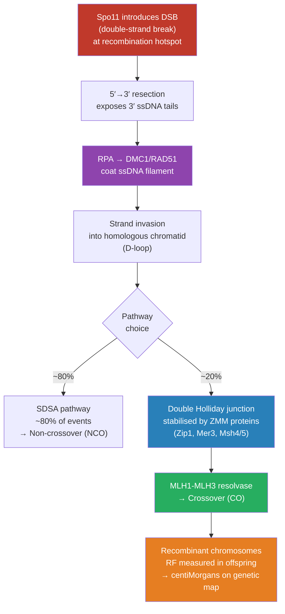

# 🧬 Linkage Mapping and Recombination

> [!abstract] TL;DR
> Genes on the same chromosome are physically linked and tend to be inherited together; recombination during meiosis shuffles alleles between homologs at a rate proportional to their physical separation, allowing that rate — expressed in centiMorgans — to be converted into a genetic map that predicts and dissects heritable traits.

## Intuition — analogy FIRST

Think of genes as houses lining the same street. Neighbours near the corner shop almost always appear together in each generation's "neighbourhood plan," because no demolition crew (recombination) reaches both of them in the same pass. Houses on opposite ends of the street, though, are separated so often by roadworks that they end up in completely different plans about half the time — statistically indistinguishable from houses on two entirely different streets (independent assortment).

The key insight Sturtevant had in 1913: the *frequency* with which two genes end up in separate plans is a direct readout of how far apart they sit. Measure that frequency across many offspring, scale it to a 0–50 range, and you have a ruler — the genetic map — that exists entirely in the currency of probability, not physical base pairs.

---

## How It Works



---

## Key Concepts / Details

### Secondary Level

**Mendel's Second Law and its limits.** Mendel's law of independent assortment holds only when genes reside on *different* chromosomes (or are far enough apart on the same chromosome to recombine freely). When two genes sit close together on the same chromosome they are **linked** and their alleles are transmitted as a unit more often than chance predicts.

**Parental vs recombinant classes.** In a dihybrid testcross ($AB/ab \times ab/ab$), if the genes are linked in *cis*, the parental classes ($AB$ and $ab$) are over-represented and the recombinant classes ($Ab$ and $aB$) are under-represented relative to the 1:1:1:1 Mendelian expectation. The departure from 50% recombinants is the signal of linkage.

**Recombination frequency (RF) as a map unit.** The recombination frequency between two loci is:
$$\theta = \frac{\text{number of recombinant offspring}}{\text{total offspring}}$$
For short distances ($\theta \ll 0.5$) this is a linear measure of physical separation. One **centiMorgan (cM)** is defined so that $1\,\text{cM} = 1\%$ recombination frequency. The Morgan (M = 100 cM) is the unit named after T.H. Morgan.

**Upper bound.** Regardless of true physical distance, $\theta$ is capped at 0.5 because each recombination event involves only two of the four chromatids in a tetrad; at saturation, recombinant and parental types balance at 50%.

---

### Undergraduate Level

**Three-point cross analysis.** Using three linked genes simultaneously allows determination of both gene *order* and pair-wise map distances in a single cross. The progeny classes and their diagnostic classes are:

| Class | Example genotype | Type |
|-------|-----------------|------|
| Most frequent (×2) | $ABC$, $abc$ | Parental (P) |
| Intermediate (×2) | $ABc$, $abC$ | SCO: interval A-B |
| Intermediate (×2) | $Abc$, $aBC$ | SCO: interval B-C |
| Least frequent (×2) | $AbC$, $aBc$ | DCO (double crossover) |

The **least abundant class** is always the double crossover (DCO); comparing the DCO genotype to the parental genotype reveals which gene is in the *middle* (its allele is swapped relative to the parentals).

Map distances including DCOs:
$$d_{AB} = \frac{n_{\text{SCO}_{AB}} + n_{\text{DCO}}}{N} \times 100\,\text{cM}$$
$$d_{BC} = \frac{n_{\text{SCO}_{BC}} + n_{\text{DCO}}}{N} \times 100\,\text{cM}$$

**Coefficient of coincidence (CoC) and interference.**
$$\text{CoC} = \frac{\text{observed DCO frequency}}{\text{expected DCO frequency}} = \frac{f_{\text{DCO}}}{d_{AB} \times d_{BC}}$$
$$\text{Interference} \; (I) = 1 - \text{CoC}$$
$I > 0$ (positive interference, the common situation in most eukaryotes) means one crossover suppresses nearby crossovers. $I = 0$ means independence; $I < 0$ (negative, rare) means one crossover promotes another.

**Haldane mapping function.** The simple RF underestimates true map distance for loci > ~20 cM apart because double crossovers (which are invisible to a pedigree but consume two exchange events) make the interval appear shorter. The Haldane function corrects under the assumption of *no interference* (Poisson-distributed crossovers):
$$x = -\frac{1}{2}\ln(1 - 2\theta) \quad \text{(Morgans)}$$
$$\theta = \frac{1}{2}(1 - e^{-2x})$$
At short distances $x \approx \theta$; as $x \to \infty$, $\theta \to 0.5$. The **Kosambi function** ($x_K = \frac{1}{4}\ln\frac{1+2\theta}{1-2\theta}$) incorporates positive interference and fits human data better.

**LOD score for linkage analysis.** In pedigree studies the LOD (Logarithm of the ODds) score quantifies the evidence for linkage at a hypothesised recombination fraction $\theta$:
$$Z(\theta) = \log_{10}\!\left(\frac{P(\text{data}\mid\theta)}{P(\text{data}\mid\theta = 0.5)}\right)$$
Convention: $Z \ge 3.0$ (odds $\ge 1000:1$) is accepted evidence for linkage; $Z \le -2.0$ rejects linkage. LOD scores are additive across families, so rare-disease pedigrees are pooled until the threshold is crossed.

**$\chi^2$ test for linkage (experimental crosses).** In a dihybrid testcross, independence predicts a 1:1:1:1 ratio. The chi-square statistic with 1 degree of freedom (under linkage with unknown $\theta$, the test is typically run with 3 df):
$$\chi^2 = \sum_{i} \frac{(O_i - E_i)^2}{E_i}$$
A significant $\chi^2$ rejects independent assortment and indicates linkage; $\theta$ is then estimated directly from the recombinant proportion.

**Physical map vs genetic map.** The human genome averages $\approx 1\,\text{cM} \approx 1\,\text{Mb}$, but the ratio is wildly non-uniform:

| Region | Recombination rate | Consequence |
|--------|-------------------|-------------|
| Pericentromeric heterochromatin | ~0.01 cM/Mb | 1 cM ≈ 100 Mb; fine-mapping impossible |
| Average euchromatin | ~1 cM/Mb | Map and physical distance track |
| Crossover hotspots | 10–100 cM/Mb | Compressed map; rapid LD decay |
| Near telomeres (males) | 5–10 cM/Mb | Male map > female near chromosome ends |

**Sex differences in recombination rate.** The total female genetic map ($\approx 4{,}460\,\text{cM}$ in humans) is $\approx 1.6\times$ longer than the male map ($\approx 2{,}700\,\text{cM}$). Male crossovers cluster near telomeres; female crossovers are distributed more evenly along chromosome arms. This creates sex-specific maps (e.g., Rutgers, Marshfield) used in clinical linkage analysis.

---

### Graduate Level

**PRDM9 and meiotic recombination hotspots.** Roughly 30,000–50,000 human hotspots — narrow intervals ($\sim 1$–$2\,\text{kb}$) with elevated DSB rates — concentrate $>80\%$ of all crossovers into $<0.5\%$ of the genome. The zinc-finger histone methyltransferase **PRDM9** is the primary hotspot determinant:
1. PRDM9 binds degenerate sequence motifs via its rapidly evolving zinc-finger array.
2. It deposits H3K4me3 and H3K36me3 on adjacent nucleosomes, creating an open-chromatin mark.
3. The DSB machinery (Spo11 via a multi-subunit complex) is recruited to the mark.
Different PRDM9 alleles recognise different motifs, explaining >50% of inter-individual variation in hotspot use. PRDM9 is absent in birds, yeasts, and plants, which use promoter-associated hotspots instead.

**Obligate crossover and chiasma interference.** Each bivalent must form at least one crossover (the obligate crossover) to ensure proper disjunction at anaphase I — chiasmata hold homologs together until tension is generated on the spindle. Crossover assurance is controlled by a counting/spacing mechanism: once a crossover is designated by the ZMM pathway, its neighbours are suppressed over distances of 20–50 cM. The molecular basis involves the synaptonemal complex (SC) as a "ruler," possibly transmitting inhibitory signals via HORMAD proteins and the SC central element. Pachytene FISH shows that interference acts over cytological distances corresponding to several tens of megabases.

**Crossover vs non-crossover outcome bias.** Most DSBs ($\sim 80\%$) are resolved as non-crossovers (NCOs) via synthesis-dependent strand annealing (SDSA). NCOs generate short gene-conversion tracts (~300 bp) without flanking exchange. The bias toward NCO is enforced by the anti-crossover helicase complex (RTEL1/Srs2 in yeast), which disrupts D-loops before they mature into double Holliday junctions. Only ZMM-stabilised dHJs proceed to Class I crossovers resolved by MLH1-MLH3. A minor Class II pathway (MUS81-EME1) generates crossovers without interference.

**Recombination in cancer.** Mitotic recombination is normally suppressed but becomes elevated in cells deficient in homologous recombination (HR) factors (BRCA1, BRCA2, PALB2, RAD51 paralogues). Somatic crossovers between heterozygous loci cause **loss of heterozygosity (LOH)**, the classic "second hit" exposing recessive tumour-suppressor mutations. COSMIC mutational signature SBS3 (flat substitution spectrum) and ID6 (small indels at homopolymers) are hallmarks of HR deficiency. PARP inhibitors exploit synthetic lethality with BRCA deficiency in breast and ovarian cancer because HR-deficient cells rely on PARP1 for single-strand break repair.

---

## Python Demo

```python
# pip install numpy matplotlib
import numpy as np

rng = np.random.default_rng(42)

# ─── True genetic parameters ───────────────────────────────────────
# Gene order on chromosome: A ── B ── C
# True map distances: A-B = 12 cM,  B-C = 18 cM
# Positive interference: I = 0.60  →  CoC = 0.40
p_AB      = 0.12
p_BC      = 0.18
CoC_true  = 0.40
p_DCO     = CoC_true * p_AB * p_BC      # 0.00864
p_SCO_AB  = p_AB - p_DCO               # single crossover A-B interval only
p_SCO_BC  = p_BC - p_DCO               # single crossover B-C interval only
p_parental = 1.0 - p_SCO_AB - p_SCO_BC - p_DCO

N = 2000  # testcross offspring

# 8 progeny classes (each reciprocal pair split equally)
probs = np.array([
    p_parental/2, p_parental/2,   # ABC, abc       — parental
    p_SCO_AB/2,   p_SCO_AB/2,    # ABc, abC       — SCO A-B
    p_SCO_BC/2,   p_SCO_BC/2,    # Abc, aBC       — SCO B-C
    p_DCO/2,      p_DCO/2,       # AbC, aBc       — DCO
])
labels     = ['ABC', 'abc', 'ABc', 'abC', 'Abc', 'aBC', 'AbC', 'aBc']
type_info  = ['Parental']*2 + ['SCO A-B']*2 + ['SCO B-C']*2 + ['DCO']*2

counts = rng.multinomial(N, probs)

# ─── Raw progeny table ─────────────────────────────────────────────
print("=== Three-Point Testcross:  ABC/abc  x  abc/abc  (N=2000) ===")
print(f"{'Genotype':<10}  {'n':>5}  {'Type'}")
print("─" * 32)
for lbl, cnt, typ in zip(labels, counts, type_info):
    print(f"{lbl:<10}  {cnt:>5}  {typ}")
print(f"{'TOTAL':<10}  {counts.sum():>5}")

# ─── Map distance estimation ───────────────────────────────────────
n_SCO_AB = counts[2] + counts[3]
n_SCO_BC = counts[4] + counts[5]
n_DCO    = counts[6] + counts[7]
total    = counts.sum()

rf_AB = (n_SCO_AB + n_DCO) / total    # DCOs must be counted in BOTH intervals
rf_BC = (n_SCO_BC + n_DCO) / total

print(f"\n=== Observed RF (underestimates true distance) ===")
print(f"RF(A-B) = {rf_AB*100:.2f} cM   [true: {p_AB*100:.1f} cM]")
print(f"RF(B-C) = {rf_BC*100:.2f} cM   [true: {p_BC*100:.1f} cM]")

# ─── Haldane map function ──────────────────────────────────────────
def haldane_cM(theta: float) -> float:
    """Convert RF to Haldane map distance in cM (no interference assumed)."""
    if theta >= 0.5:
        return float('inf')
    return -50.0 * np.log(1.0 - 2.0 * theta)

print(f"\n=== Haldane-Corrected Distances ===")
print(f"A-B: {haldane_cM(rf_AB):.2f} cM")
print(f"B-C: {haldane_cM(rf_BC):.2f} cM")

# ─── Coefficient of coincidence and interference ───────────────────
expected_DCO = rf_AB * rf_BC * total
CoC_est      = n_DCO / expected_DCO
I_est        = 1.0 - CoC_est

print(f"\n=== Interference Analysis ===")
print(f"Expected DCO count : {expected_DCO:.1f}")
print(f"Observed DCO count : {n_DCO}")
print(f"CoC                : {CoC_est:.3f}   [true: {CoC_true:.2f}]")
print(f"Interference (1-CoC): {I_est:.3f}   (positive interference)")
if I_est > 0:
    print("  -> One crossover SUPPRESSES formation of a nearby crossover.")
```

---

## Real-World Applications

**Disease gene mapping (Mendelian diseases).** Before whole-genome sequencing, LOD-score linkage analysis in large pedigrees was the primary route to cloning disease genes. Cystic fibrosis was mapped to chromosome 7q31 by linkage in 1985 (Tsui et al.) and the gene (*CFTR*) isolated in 1989. Huntington's disease was linked to 4p16.3 in 1983 using polymorphic RFLP markers — the first major triumph of linkage analysis.

**Marker-assisted selection (MAS) in plant and animal breeding.** QTL (quantitative trait locus) mapping uses dense genetic maps to identify chromosome regions explaining variation in yield, disease resistance, or production traits. Markers flanking a QTL are used to track the favourable allele through crosses without phenotyping every individual. Examples include *Lr34* in wheat (durable leaf-rust resistance) and high-oleic soybean via *fad2-1* selection.

**GWAS and linkage disequilibrium (LD).** Genome-wide association studies exploit the fact that common variants near a causal mutation stay in LD with it over evolutionary time because the recombination rate between them is low. Fine-mapping a GWAS locus requires knowing the local recombination landscape: LD decays faster inside hotspots and slower in cold regions. The 1000 Genomes Project recombination maps provide per-base estimates of recombination rate used by FINEMAP, SuSiE, and similar tools.

**Forensic DNA profiling.** Short tandem repeat (STR) markers used in forensic profiling were selected partly on the basis of known map positions to ensure they lie on different chromosomes (eliminating linkage) and have negligible LD, making the product rule ($P(\text{profile}) = \prod_i P(\text{genotype}_i)$) valid.

**Cancer LOH mapping.** SNP arrays measure allele frequencies in tumour vs normal DNA; a run of homozygosity extending from a heterozygous constitutional locus is evidence of somatic crossover or deletion. Mapping LOH boundaries localises tumour suppressor genes; this approach originally identified *RB1* (retinoblastoma) and *TP53* as cancer genes.

---

## Common Pitfalls

- **Ignoring double crossovers inflates map distances.** If you compute RF naively from the parental/recombinant ratio without adding DCOs to both flanking intervals, you underestimate both $d_{AB}$ and $d_{BC}$ and place the genes artificially close. Always count DCOs in *each* interval, not just once.

- **Equating RF with map distance for long intervals.** Because $\theta$ saturates at 0.5, two genes 80 cM apart appear indistinguishable from unlinked loci unless you use a mapping function. Always apply Haldane or Kosambi correction before summing intervals across a chromosome.

- **Confusing CoC and interference.** CoC is the *ratio* (observed/expected DCO frequency); Interference = $1 - \text{CoC}$. Positive interference ($I > 0$, CoC < 1) is the biologically common case (crossover suppresses neighbours). Students often invert the formula and report a CoC > 1 as "positive."

- **cis vs trans configuration matters for RF estimation.** RF is configuration-independent, but the *phenotypic* parental and recombinant classes swap between repulsion ($Ab/aB$) and coupling ($AB/ab$) arrangements. Getting the parental configuration wrong inverts the apparent linkage, leading to a reported RF > 50% — physically impossible.

- **Physical distance does not equal genetic distance.** Using SNP spacing in kb as a proxy for cM leads to errors of an order of magnitude near centromeres and in hotspot regions. Always use empirical genetic maps (e.g., HapMap, deCODE sex-averaged or sex-specific maps) for fine-mapping.

- **LOD score threshold is genome-wide.** A single-point LOD of 3.0 corrects for testing one marker; genome-wide significance in a multi-point scan requires LOD $\ge$ 3.3–3.6 to control for multiple testing across $\sim 10^4$ independent regions.

---

## Related Concepts

- [[_MOC_Classical_and_Population_Genetics|↑ Classical and Population Genetics MOC]]
- [[Chromosomal_Theory_of_Inheritance]] — Linkage mapping is the empirical validation of Morgan's chromosome theory; chiasmata are the cytological correlates of genetic crossovers
- [[Population_Genetics_and_Hardy_Weinberg]] — Linkage disequilibrium (the population-level signature of recent recombination) is measured against the Hardy-Weinberg equilibrium expectation
- [[Complex_Trait_Genetics_and_GWAS]] — GWAS fine-mapping depends critically on the local recombination landscape and LD decay; PRDM9-determined hotspots shape population LD blocks
- [[Bayesian_Statistics]] — LOD score analysis is a likelihood-ratio framework; multi-point linkage uses hidden Markov models with Bayesian priors on recombination fraction
- [[Statistical_Inference]] — The $\chi^2$ test of independent assortment and maximum-likelihood estimation of $\theta$ are foundational inferential procedures in linkage studies

---

## Review Questions

1. **(Secondary)** In a testcross between $AB/ab$ and $ab/ab$, you recover 420 $AB$, 430 $ab$, 75 $Ab$, and 75 $aB$ offspring. What is the recombination frequency? Are the genes linked? Which allele combinations represent the parental types, and what does that tell you about the original coupling phase?

2. **(Undergraduate)** A three-point cross yields the following progeny: $+$ $+$ $+$ (480), $a$ $b$ $c$ (475), $+$ $+$ $c$ (83), $a$ $b$ $+$ (80), $+$ $b$ $+$ (19), $a$ $+$ $c$ (21), $+$ $b$ $c$ (6), $a$ $+$ $+$ (7). (a) Determine the gene order. (b) Calculate the map distances for each flanking interval, including DCOs. (c) Compute the coefficient of coincidence and the interference value, and interpret the biological meaning.

3. **(Graduate)** The Haldane mapping function assumes crossovers occur as a Poisson process (no interference), while the Kosambi function assumes interference proportional to map distance. (a) Derive the Haldane function from the assumption of Poisson-distributed crossovers along a chromosome arm. (b) For an interval where $\theta = 0.30$, calculate the Haldane and Kosambi corrected distances and explain why they differ. (c) How does the existence of PRDM9-dependent hotspots challenge the assumption of a uniform recombination rate implicit in both mapping functions, and what practical consequence does this have for GWAS fine-mapping?

---

## Sources

- Griffiths, A.J.F. et al. *Introduction to Genetic Analysis*, 12th edition. W.H. Freeman, 2020.
- Sturtevant, A.H. (1913). The linear arrangement of six sex-linked factors in *Drosophila*, as shown by their mode of association. *Journal of Experimental Zoology* 14: 43–59.
- Lander, E.S. & Botstein, D. (1989). Mapping Mendelian factors underlying quantitative traits using RFLP linkage maps. *Genetics* 121: 185–199.
- Myers, S. et al. (2010). Drive against hotspot motifs in primates implicates the PRDM9 gene in meiotic recombination. *Science* 327: 876–879.
- Kong, A. et al. (2010). Fine-scale recombination rate differences between sexes, populations and individuals. *Nature* 467: 1099–1103.
- Haldane, J.B.S. (1919). The combination of linkage values and the calculation of distances between the loci of linked factors. *Journal of Genetics* 8: 299–309.

---

#Genetics #ClassicalGenetics #Linkage #Recombination
