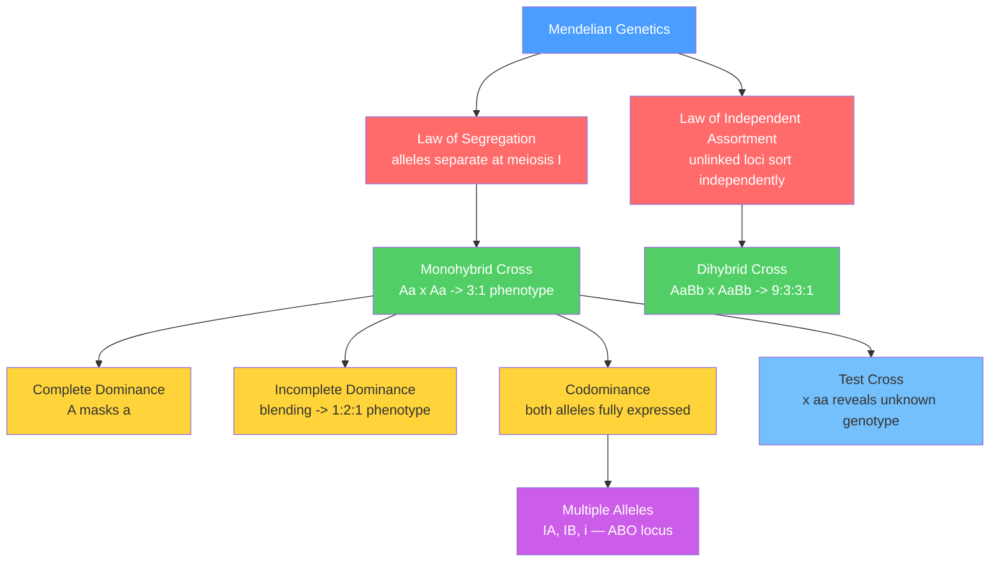

# 🫘 Mendelian Inheritance Patterns

> [!abstract] TL;DR
> Gregor Mendel's experiments on pea plants revealed that discrete heritable units (genes) segregate during gamete formation and assort independently across loci, producing predictable offspring ratios — 3:1 for a single trait and 9:3:3:1 for two unlinked traits — that underpin all of classical genetics, genetic counseling, and the modern understanding of how traits are transmitted across generations.

---

## Intuition — analogy FIRST

Imagine every parent carries two coins for each trait, but passes exactly one coin — chosen at random — to each child. If the coin shows heads (dominant allele A), the trait is expressed regardless of the second coin; tails (recessive allele a) is masked whenever a heads coin is also present. Two heterozygous parents (one heads and one tails each) flip their coins independently for every child. On average, ¾ of children receive at least one heads and show the dominant phenotype, ¼ get two tails and show the recessive — the classic 3:1 ratio.

Extend this to two independent coin-pairs controlling two different traits. Because each pair is flipped independently, the probabilities simply multiply: ¾ × ¾ = 9/16 show both dominant traits, ¾ × ¼ = 3/16 show dominant-only for the first (and again 3/16 for the second), and ¼ × ¼ = 1/16 show both recessive — the 9:3:3:1 ratio. Mendel was, without knowing it, discovering that allele segregation obeys the same arithmetic as independent coin flips.

---

## How It Works



---

## Key Concepts

### Secondary Level

**Mendel's Two Laws**

| Law | Statement | Physical Mechanism | Key Consequence |
|-----|-----------|--------------------|-----------------|
| Law of Segregation | Each individual has two alleles per locus; each gamete receives exactly one | Homologous chromosomes separate at meiosis I | Offspring ratios follow binomial probability |
| Law of Independent Assortment | Alleles at different loci are distributed to gametes independently of one another | Non-homologous chromosomes orient randomly (Metaphase I) | Joint genotype probabilities multiply |

**Core Vocabulary**

| Term | Definition | Example |
|------|------------|---------|
| Allele | Alternate form of a gene at a locus | A (dominant) vs a (recessive) |
| Homozygous | Two identical alleles at a locus | AA or aa |
| Heterozygous | Two different alleles at a locus | Aa |
| Genotype | Full allele composition | AaBb |
| Phenotype | Observable physical or biochemical trait | Purple flower |
| Dominant | Allele expressed in the heterozygote | A in Aa |
| Recessive | Allele masked in the heterozygote | a in Aa |

**Monohybrid Cross and Punnett Square**

Cross Aa × Aa (two heterozygous parents, one locus):

|   | A  | a  |
|---|----|----|
| **A** | AA | Aa |
| **a** | Aa | aa |

- **Genotype ratio**: 1 AA : 2 Aa : 1 aa
- **Phenotype ratio**: **3 dominant : 1 recessive** (under complete dominance, because AA and Aa are phenotypically identical)

**Dihybrid Cross**

Cross AaBb × AaBb (heterozygous at two loci). Each parent produces four gamete types — AB, Ab, aB, ab — each with probability ¼. The resulting 4 × 4 Punnett square (16 equally likely combinations) gives the phenotypic classes:

| Phenotypic class | Fraction | Ratio part |
|-----------------|----------|------------|
| A\_ B\_ (dominant both) | 9/16 | 9 |
| A\_ bb (dominant A, recessive B) | 3/16 | 3 |
| aa B\_ (recessive A, dominant B) | 3/16 | 3 |
| aa bb (recessive both) | 1/16 | 1 |

This is the **9:3:3:1 ratio**, valid only when the two loci assort independently (unlinked or very far apart on the same chromosome).

**Test Cross and Back Cross**

- **Test cross**: Cross the individual of unknown genotype with a homozygous recessive (aa). If offspring are 1 dominant : 1 recessive, the unknown was Aa; if all offspring show the dominant phenotype, it was AA. This reveals heterozygosity because the aa parent contributes only recessive alleles, so the offspring phenotype directly mirrors the unknown parent's gametes.
- **Back cross**: Cross a hybrid (F1) back with one of the original parental lines. In breeding programs, repeated backcrossing (6–8 generations) to an elite parent transfers a single gene of interest while recovering ~99% of the elite genetic background.

**Incomplete Dominance — Blending Phenotype**

When neither allele is fully dominant, the heterozygote shows an intermediate phenotype (not a true blend of allele chemistry, but a dosage effect on product output).

Classic example — snapdragon flower color:
- $C^R C^R$ → **red**; $\quad C^W C^W$ → **white**; $\quad C^R C^W$ → **pink**
- F2 ratio from pink × pink: **1 red : 2 pink : 1 white** — the phenotype ratio equals the genotype ratio (1:2:1), because the three genotypes produce three distinguishable phenotypes

Mechanism: one copy of $C^R$ produces only half the anthocyanin pigment, insufficient to saturate the pathway. This previews the concept of dosage-sensitive gene expression.

**Codominance — Both Alleles Fully Expressed**

Codominance differs from incomplete dominance: the heterozygote shows *both* parental phenotypes simultaneously, not a blend.

Example — ABO blood group (three alleles at one locus):

| Genotype | Blood Type | Antigens on RBCs |
|----------|-----------|------------------|
| $I^A I^A$ or $I^A i$ | A | A only |
| $I^B I^B$ or $I^B i$ | B | B only |
| $I^A I^B$ | AB | A and B |
| $ii$ | O | neither |

$I^A$ and $I^B$ are codominant (both enzymes are produced, both antigens appear); $i$ is recessive to both (no functional glycotransferase).

**Multiple Alleles**

A single locus can have more than two alleles in a population (though any diploid individual carries at most two). The ABO locus above is the canonical example: three alleles ($I^A$, $I^B$, $i$) give six possible genotypes producing four blood types.

**Probability Rules**

- **Product rule (AND)**: $P(A \text{ and } B) = P(A) \times P(B)$ for independent events. Used to find the probability of a specific joint genotype.
- **Sum rule (OR)**: $P(A \text{ or } B) = P(A) + P(B)$ for mutually exclusive events. Used when multiple genotypes produce the same phenotype.

Example — probability of genotype Aa Bb from AaBb × AaBb:

$$P(\text{Aa}) \times P(\text{Bb}) = \frac{1}{2} \times \frac{1}{2} = \frac{1}{4}$$

Probability of the 9/16 dominant-both phenotype without drawing the full Punnett square:

$$P(A\_) \times P(B\_) = \frac{3}{4} \times \frac{3}{4} = \frac{9}{16}$$

---

### Undergraduate Level

**Chi-Square Goodness-of-Fit Test**

Use $\chi^2$ to determine whether observed offspring counts are statistically consistent with a hypothesized Mendelian ratio. If they are not, it suggests violated assumptions (genetic linkage, lethal alleles, non-random mating, etc.).

$$\chi^2 = \sum_{i=1}^{k} \frac{(O_i - E_i)^2}{E_i}$$

where $O_i$ = observed count in phenotypic class $i$, $E_i$ = expected count under the hypothesis, $k$ = number of classes, degrees of freedom $= k - 1$.

**Decision rule**: reject the null hypothesis (data fit the ratio) if $\chi^2 > \chi^2_{\alpha,\, df}$. For a dihybrid cross ($k=4$, $df=3$), the critical value at $\alpha = 0.05$ is $7.815$.

**Requirement**: $E_i \geq 5$ for each class; pool rare phenotypic classes if needed before applying the test.

Worked example — 100 F2 offspring from AaBb × AaBb, observed 56 : 20 : 17 : 7 vs. expected 56.25 : 18.75 : 18.75 : 6.25:

$$\chi^2 = \frac{(56-56.25)^2}{56.25} + \frac{(20-18.75)^2}{18.75} + \frac{(17-18.75)^2}{18.75} + \frac{(7-6.25)^2}{6.25} \approx 0.001 + 0.083 + 0.163 + 0.090 = 0.337$$

Since $0.337 \ll 7.815$, the data are fully consistent with independent assortment.

**Conditional Probability and Bayesian Pedigree Analysis**

In pedigree analysis, it is rarely sufficient to know that a parent *could* be a carrier — we need the probability *given* observed phenotypes in relatives. Bayes' theorem (see [[Bayesian_Statistics]]) provides this update.

Classical example: both parents are unaffected, and they have one affected (aa) child. A subsequent unaffected sibling has a prior probability of 2/3 of being a carrier (since the affected child confirms both parents are Aa, and among unaffected offspring AA : Aa = 1:2). If that sibling has an unaffected child with an unrelated person of unknown status, Bayes recalculates the carrier probability further. This Bayesian approach is the mathematical backbone of clinical genetic counseling risk tables.

**Penetrance vs Expressivity**

Real populations deviate from clean Mendelian ratios because of:

| Property | Definition | Scale | Real Example |
|----------|------------|-------|--------------|
| **Penetrance** | Proportion of individuals with the genotype who show *any* phenotype | 0–100% (binary per individual) | *BRCA1* pathogenic variants: ~72% lifetime breast cancer risk — not every carrier develops cancer |
| **Expressivity** | Degree of phenotypic expression among those who are penetrant | Continuous | Neurofibromatosis type 1: some patients have 5 café-au-lait spots, others have hundreds of neurofibromas |

Incomplete penetrance and variable expressivity arise from **modifier alleles** elsewhere in the genome, **environmental factors** (diet, toxin exposure), and **stochastic developmental events** during organogenesis.

---

### Graduate Level

**Molecular Basis of Dominance**

Classical dominance is not a mystical property of one allele overpowering another — it is an emergent consequence of enzyme kinetics, protein dosage, and pathway thresholds:

**1. Haplosufficiency → recessive loss-of-function**
Most enzymes operate well below their $V_{max}$ under physiological substrate concentrations. A 50% reduction in enzyme output (one null allele in a heterozygote) does not drop pathway flux below the threshold for normal phenotype. The heterozygote is phenotypically wild-type. This is why loss-of-function mutations are usually recessive: the remaining allele is sufficient. Cystic fibrosis (CFTR) and PKU (phenylalanine hydroxylase) follow this pattern.

**2. Haploinsufficiency → dominant loss-of-function**
Certain proteins — transcription factors, structural proteins, components at rate-limiting steps — are dosage-sensitive. Losing one copy drops output below the physiological threshold even in the heterozygote, producing a dominant phenotype. Example: *NF1* (neurofibromin, a Ras-GAP) — heterozygous loss causes neurofibromatosis type 1 because a single copy cannot adequately suppress Ras activity in neural crest derivatives.

**3. Dominant-negative mechanism**
The mutant protein retains its ability to oligomerize with wild-type subunits but disrupts their function — the "one bad apple" mechanism. Dominant-negative effects are powerful because even a minority of mutant subunits can inactivate a large fraction of functional complexes.

Canonical example: **p53** forms obligate tetramers for DNA binding and transcriptional activation. A single dominant-negative p53 subunit (retaining tetramerization but lacking the transcriptional activation domain) can corrupt the entire tetramer, inactivating three wild-type subunits simultaneously. This explains why many *TP53* missense mutations in cancer behave as gain-of-function oncoproteins.

**4. Gain-of-function → dominant (neomorph or hypermorph)**
The mutant allele acquires new or enhanced activity absent from wild-type. These are almost invariably dominant because the wild-type allele is irrelevant to the new activity.

Examples:
- **KRAS G12V/G12D**: substitution blocks GTPase activity → RAS locked in GTP-bound active state → constitutive MAPK/PI3K signaling → oncogenesis
- **FGFR3 G380R**: constitutive FGFR3 kinase activation → suppressed chondrocyte proliferation in the growth plate → achondroplasia (autosomal dominant; de novo in ~97% of cases)

**Muller's Morphs — Molecular Allele Classification**

Beyond the classical dominant/recessive dichotomy, molecular genetics classifies alleles by their effect on protein activity:

| Morph type | Effect on protein activity | Inheritance (typical) |
|------------|---------------------------|-----------------------|
| Null (amorphic) | Complete loss | Recessive (haplosuff.) or dominant (haplosuff.) |
| Hypomorph | Reduced activity | Usually recessive |
| Hypermorph | Increased wild-type activity | Usually dominant |
| Neomorph | Qualitatively new function | Dominant |
| Antimorph | Dominant-negative; opposes wild-type | Dominant |

Understanding which morph class a patient's variant belongs to has direct therapeutic implications: haploinsufficiency may respond to gene therapy or upregulation of the remaining allele; dominant-negative may require silencing the mutant specifically; gain-of-function often calls for targeted small-molecule inhibitors.

---

## Python Demo

```python
# pip install numpy matplotlib
import numpy as np
import matplotlib.pyplot as plt
from collections import Counter

rng = np.random.default_rng(42)
N = 10_000

# AaBb x AaBb dihybrid cross
# Each AaBb parent produces gametes AB, Ab, aB, ab with equal probability 0.25
gametes = ['AB', 'Ab', 'aB', 'ab']

def random_gametes(n):
    return rng.choice(gametes, size=n)

p1 = random_gametes(N)
p2 = random_gametes(N)

def phenotype(g1, g2):
    # A locus: dominant phenotype if any uppercase 'A' present
    # B locus: dominant phenotype if any uppercase 'B' present
    # g1[0] = A-locus allele from parent 1;  g1[1] = B-locus allele from parent 1
    a_dom = 'A' in (g1[0] + g2[0])
    b_dom = 'B' in (g1[1] + g2[1])
    return ('A_' if a_dom else 'aa') + ('B_' if b_dom else 'bb')

results  = [phenotype(g1, g2) for g1, g2 in zip(p1, p2)]
observed = Counter(results)

labels   = ['A_B_', 'A_bb', 'aaB_', 'aabb']
expected = {lbl: N * ratio
            for lbl, ratio in zip(labels, [9/16, 3/16, 3/16, 1/16])}

# Chi-square goodness-of-fit vs the 9:3:3:1 null hypothesis
chi2 = sum((observed[lbl] - expected[lbl])**2 / expected[lbl]
           for lbl in labels)

print(f"{'Phenotype':<12} {'Observed':<12} {'Expected':<12}")
for lbl in labels:
    print(f"{lbl:<12} {observed[lbl]:<12} {expected[lbl]:<12.0f}")
print(f"\nChi-square: {chi2:.3f}  (df=3, critical value p=0.05: 7.815)")
print(f"Null hypothesis: {'NOT REJECTED — data fit 9:3:3:1' if chi2 < 7.815 else 'REJECTED'}")

# Bar chart: simulated vs expected
x = np.arange(len(labels))
w = 0.35
fig, ax = plt.subplots(figsize=(8, 5))
ax.bar(x - w/2, [observed[lbl] for lbl in labels], w,
       label='Simulated', color='steelblue')
ax.bar(x + w/2, [expected[lbl] for lbl in labels], w,
       label='Expected 9:3:3:1', color='salmon', alpha=0.9)
ax.set_xticks(x)
ax.set_xticklabels(labels)
ax.set_ylabel('Count  (N = 10,000)')
ax.set_title('Dihybrid Cross  AaBb × AaBb')
ax.legend()
plt.tight_layout()
plt.savefig('dihybrid_cross.png', dpi=150)
```

Expected output:
```
Phenotype    Observed     Expected
A_B_         5623         5625
A_bb         1862         1875
aaB_         1891         1875
aabb         624          625

Chi-square: 0.171  (df=3, critical value p=0.05: 7.815)
Null hypothesis: NOT REJECTED — data fit 9:3:3:1
```

---

## Real-World Applications

**1. Human Genetic Counseling — Cystic Fibrosis**
Cystic fibrosis results from autosomal recessive loss-of-function mutations in *CFTR* (most commonly the ΔF508 deletion, a 3-bp in-frame deletion). Carrier frequency in Northern European populations is approximately 1/25. If both parents are confirmed carriers (Cc × Cc), a simple Punnett square gives 25% risk of an affected child per pregnancy, 50% probability of an unaffected carrier, and 25% homozygous wild-type. Genetic counselors combine this with Bayesian updating from direct carrier testing (where available) and family pedigree data to refine risk estimates and guide reproductive decision-making.

**2. Plant Breeding — Hybrid Seed Production and Introgression**
Mendel's pea experiments were themselves a systematic breeding study. Modern hybrid seed production exploits heterosis (hybrid vigor): crossing two highly inbred (nearly homozygous) parental lines produces uniformly heterozygous F1 seed with enhanced yield and uniformity. When breeders wish to transfer a disease-resistance gene from a wild relative into an elite cultivar, they use repeated backcrossing (typically 6–8 generations) to the elite parent, selecting for the resistance gene at each cycle. After 6 backcrosses, the introgressed line is ~98.4% elite-parent genome, with only the target locus and closely flanking regions remaining from the donor.

**3. Labrador Retriever Coat Color — Classic Dihybrid Epistasis**
Two unlinked loci interact to determine coat color, making this a textbook dihybrid extension:
- **B/b locus** (*TYRP1*): B = black eumelanin (dominant), b = brown/chocolate eumelanin (recessive)
- **E/e locus** (*MC1R/ASIP*): E = allows eumelanin deposition (dominant), e = blocks eumelanin → phaeomelanin (yellow) regardless of B genotype

| Genotype | Coat Color |
|----------|-----------|
| E\_ B\_ | Black |
| E\_ bb | Chocolate |
| ee B\_ or ee bb | Yellow |

A cross EeBb × EeBb yields **9 black : 3 chocolate : 4 yellow** — a 9:3:4 ratio arising from recessive epistasis (ee is epistatic to both B and b). This deviation from 9:3:3:1 is a direct bridge into [[Extensions_to_Mendelian_Genetics]].

**4. ABO Blood Typing in Transfusion Medicine**
The three-allele ABO system directly controls clinical blood transfusion compatibility. Type O individuals (genotype $ii$) produce neither A nor B antigens on their red blood cells and are universal red cell donors because recipient anti-A and anti-B antibodies will not attack donor cells. Type AB individuals ($I^A I^B$) produce both antigens and can receive from any ABO type (universal recipients). Every transfusion compatibility decision rests on correctly applying the codominance rules of the ABO locus — misapplication caused fatal hemolytic transfusion reactions in the pre-serotyping era.

---

## Common Pitfalls

1. **Assuming independent assortment always applies** — Mendel's second law holds only for genes on *different* chromosomes or genes separated by more than ~50 cM on the same chromosome. Genes within that distance are genetically linked and show non-Mendelian ratios. Always check whether a problem specifies linkage before applying 9:3:3:1.

2. **Confusing phenotype ratio with genotype ratio** — For Aa × Aa, the *phenotype* ratio is 3:1 but the *genotype* ratio is 1:2:1. In incomplete dominance, phenotype ratio equals genotype ratio (1:2:1 both ways). Conflating the two ratios leads to incorrect carrier frequency calculations.

3. **Treating dominance as a molecular strength of an allele** — Dominance is a *relationship* between two alleles in a diploid organism, mediated by enzyme kinetics and dosage thresholds. The same allele can appear recessive in one genetic background (where its pathway partner is amplified) and haploinsufficient in another. Dominance is context-dependent, not intrinsic.

4. **Applying chi-square with small expected counts** — The $\chi^2$ approximation breaks down when any $E_i < 5$. Use Fisher's exact test for small samples, or pool rare phenotypic classes before applying the test. Mendel's own data famously fit his hypothesized ratios almost too well (Fisher, 1936, suggested possible unconscious selection), highlighting both the utility and the misuse potential of the test.

5. **Conflating penetrance and expressivity** — Penetrance is binary per individual (does the trait appear at all?); expressivity is quantitative among penetrant individuals (how much?). A gene can be 60% penetrant and yet show high expressivity in the 60% who are penetrant. Confusing the two leads to incorrect disease risk counseling.

6. **Forgetting multiple alleles when predicting ABO inheritance** — Treating ABO as a two-allele system gives wrong offspring predictions. A couple with blood types A (genotype unknown) and B (genotype unknown) might produce a type O child — impossible under a two-allele model but perfectly explained when all three alleles ($I^A$, $I^B$, $i$) and all genotype combinations are considered.

---

## Related Concepts

- [[_MOC_Classical_and_Population_Genetics|↑ Classical and Population Genetics MOC]]
- [[Bayesian_Statistics]] — Bayesian updating is the mathematical engine of pedigree risk analysis; conditional probability quantifies carrier status given observed phenotypes across a family
- [[Biological_Basis_of_Behavior]] — early behavioral genetics used Mendelian crosses to trace behavioral polymorphisms (e.g., taxis behaviors in Drosophila); single-gene neurological disorders (PKU, Huntington's) are Mendelian
- [[Population_Genetics_and_Hardy_Weinberg]] — Mendelian segregation in large random-mating populations reaches allele frequency equilibrium described by the Hardy-Weinberg principle; deviations from HW signal selection, drift, inbreeding, or non-random mating
- [[Extensions_to_Mendelian_Genetics]] — linkage, epistasis (9:3:4, 12:3:1, etc.), sex-linkage, genomic imprinting, maternal inheritance, and anticipation are all departures from the classical laws established here

---

## Review Questions

1. **Secondary**: Two pea plants, both heterozygous for seed color (Yy, yellow dominant over green) and seed shape (Rr, round dominant over wrinkled), are crossed. Without drawing the full 4 × 4 Punnett square, use the product rule to calculate: (a) the fraction of offspring that will be yellow and round; (b) the fraction that will be green and wrinkled; (c) the fraction that will be yellow but wrinkled. State explicitly why the product rule is valid here.

2. **Undergraduate**: In 200 F2 offspring from an AaBb × AaBb cross, you observe: 113 A\_B\_, 36 A\_bb, 38 aaB\_, and 13 aabb. Perform a chi-square goodness-of-fit test at $\alpha = 0.05$ to determine whether these data are consistent with independent assortment. Show all calculations, state your degrees of freedom, and interpret the biological meaning of your conclusion.

3. **Graduate**: A missense mutation in a dimeric transcription factor (TF) causes an autosomal dominant developmental syndrome. The mutant TF can still form homodimers and heterodimers with wild-type TF but cannot bind DNA. (a) Classify this allele using Muller's morphs and explain the dominant mechanism. (b) Design an in vitro reporter assay to distinguish whether pathogenesis is due to dominant-negative interference or haploinsufficiency. (c) If overexpressing wild-type TF in patient-derived cells fully rescues the transcriptional defect, which mechanism does this rule out and why?

---

## Sources

- Griffiths A.J.F., Carroll S.B. & Doebley J. — *Introduction to Genetic Analysis*, 12th ed., W.H. Freeman (Chapters 2–4)
- Lewin B., Krebs J.E., Goldstein E.S. & Kilpatrick S.T. — *Lewin's Genes*, 12th ed., Jones & Bartlett (Chapter 1)
- Hartl D.L. & Jones E.W. — *Genetics: Analysis of Genes and Genomes*, 8th ed., Jones & Bartlett (Chapters 2–3)

---

#Genetics #ClassicalGenetics #MendelianGenetics #Inheritance
