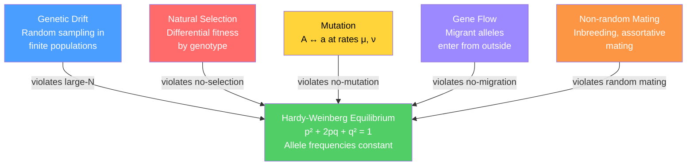

# 🧬 Population Genetics and Hardy-Weinberg

> [!abstract] TL;DR
> Hardy-Weinberg equilibrium is the null model of population genetics: in an ideal population allele and genotype frequencies remain constant across generations indefinitely. Real populations deviate from this baseline because five evolutionary forces — genetic drift, natural selection, mutation, gene flow, and non-random mating — act on them, and quantifying those deviations reveals a population's evolutionary history.

---

## Intuition — analogy FIRST

Hardy-Weinberg is Newton's first law for alleles. Newton says a body at rest stays at rest unless a force acts on it; Hardy-Weinberg says a population's allele frequencies stay the same generation after generation unless an evolutionary force acts on them. Just as friction, gravity, and an applied push are the agents that change velocity, genetic drift, natural selection, mutation, migration, and inbreeding are the agents that change allele frequency. Measuring how far a real population deviates from Hardy-Weinberg equilibrium tells you which forces are at work and, roughly, how strong each one is.

---

## How It Works

For a locus with two alleles, A (frequency $p$) and a (frequency $q = 1 - p$), Hardy-Weinberg equilibrium (HWE) predicts that after one round of random mating the three genotype frequencies are:

$$p^2\;(\text{AA}) + 2pq\;(\text{Aa}) + q^2\;(\text{aa}) = 1$$

This follows directly from the fact that random mating is equivalent to drawing two alleles independently from the gene pool. Once a population reaches HWE, both $p$ and $q$ remain unchanged generation after generation — the population's "resting state."

HWE holds only when five conditions are satisfied simultaneously: (1) effectively infinite population size, (2) random mating, (3) no mutation, (4) no migration, and (5) no natural selection. Any single violation shifts the population away from this resting state.



---

## Key Concepts / Details

### Secondary Level

**Hardy-Weinberg genotype frequencies.** With allele frequencies $p$ (A) and $q = 1 - p$ (a):

| Genotype | Expected frequency |
|----------|--------------------|
| AA (homozygous dominant) | $p^2$ |
| Aa (heterozygous) | $2pq$ |
| aa (homozygous recessive) | $q^2$ |

**Estimating allele frequencies from phenotype.** If a recessive trait (aa) has phenotypic frequency $f$ in a large random-mating population, then $q = \sqrt{f}$ and $p = 1 - q$ under HWE. This is the classic method when only phenotypes — not genotypes — are observable.

**The five HWE assumptions.**

1. **Large population** — no random sampling error changes allele frequencies
2. **Random mating** — every individual is equally likely to mate with any other
3. **No mutation** — allele identities are conserved each generation
4. **No migration** — the population is completely closed to outside alleles
5. **No natural selection** — all genotypes survive and reproduce equally

**HWE as a null model.** If an observed population departs from HWE genotype frequencies, at least one of these forces is acting. The direction and magnitude of the departure suggest which one.

### Undergraduate Level

**HWE chi-square test.** Observed and expected genotype counts are compared with:

$$\chi^2 = \sum_i \frac{(O_i - E_i)^2}{E_i}$$

with 1 degree of freedom for a two-allele locus (three genotype classes minus one estimated parameter $p$ minus one constraint that frequencies sum to 1, giving $3 - 1 - 1 = 1$ df). A significant $\chi^2$ rejects HWE; it does not identify which assumption is violated.

**Genetic drift — Wright-Fisher model.** In a diploid population with effective size $N_e$, each generation is formed by sampling $2N_e$ allele copies from the parental gene pool at random (with replacement). The allele frequency in the next generation is therefore a random variable:

$$p_{t+1} \;\sim\; \frac{1}{2N_e}\;\text{Binomial}(2N_e,\; p_t)$$

The expected change is zero, but the variance per generation is:

$$\text{Var}(\Delta p) = \frac{p(1-p)}{2N_e}$$

Drift is inversely proportional to $N_e$: small populations drift fast, large populations drift slowly. Over time, every neutral allele is either fixed ($p = 1$) or lost ($p = 0$). The **fixation probability** of a neutral allele currently at one copy in a diploid population of size $N_e$ is $1/(2N_e)$. The expected **time to fixation or loss**, starting at frequency $p_0$, is approximately $-4N_e\bigl[p_0\ln p_0 + (1-p_0)\ln(1-p_0)\bigr]$ generations — roughly $4N_e$ generations for $p_0 = 0.5$.

**Natural selection.** Assign fitnesses $w_{AA} = 1$, $w_{Aa} = 1 - hs$, $w_{aa} = 1 - s$, where $s \geq 0$ is the selection coefficient and $h \in [0,1]$ is the dominance coefficient. The per-generation change in the frequency of allele A is:

$$\Delta p \approx \frac{sp(1-p)\bigl[p + h(1-2p)\bigr]}{1 - sp^2}$$

Special cases: $h = 0$ (a fully recessive), $h = 1$ (a fully dominant), $h = 0.5$ (additive codominance), $h < 0$ (overdominance, heterozygote advantage), which produces a stable equilibrium polymorphism.

**Mutation-selection balance.** For a deleterious recessive allele with selection coefficient $s$ and forward mutation rate $\mu$ (A $\to$ a):

$$\hat{q} \approx \sqrt{\frac{\mu}{s}}$$

This equilibrium explains why many harmful recessive alleles persist at low but nonzero frequency: new mutations continuously replenish what selection removes.

**Gene flow and $F_{ST}$.** When migrants enter at rate $m$ per generation with allele frequency $P_m$, the change per generation is:

$$\Delta p = m(P_m - p)$$

Gene flow homogenizes allele frequencies across populations; isolation allows divergence. **Wright's $F_{ST}$** quantifies the fraction of total genetic variation attributable to between-population differences:

$$F_{ST} = \frac{H_T - H_S}{H_T}$$

where $H_T = 2\bar{p}(1-\bar{p})$ is the expected heterozygosity if the metapopulation were panmictic and $H_S$ is the average within-population expected heterozygosity. $F_{ST} = 0$ means no differentiation; $F_{ST} = 1$ means complete isolation and no shared alleles.

**Inbreeding coefficient $F$.** The probability that an individual carries two alleles that are identical by descent (IBD). Inbreeding shifts genotype frequencies without changing allele frequencies:

| Genotype | Frequency under inbreeding coefficient $F$ |
|----------|--------------------------------------------|
| AA | $p^2(1-F) + pF = p^2 + Fpq$ |
| Aa | $2pq(1-F)$ |
| aa | $q^2(1-F) + qF = q^2 + Fpq$ |

Heterozygosity decreases by fraction $F$ relative to the HWE expectation.

**Tajima's D.** A neutrality test that compares two estimators of $\theta = 4N_e\mu$:

- $\hat{\theta}_\pi$: average pairwise nucleotide differences between sequences
- $\hat{\theta}_W$ (Watterson's theta): from the number of segregating sites $S$ across $n$ sequences, $\hat{\theta}_W = S\,/\!\sum_{i=1}^{n-1}(1/i)$

$$D = \frac{\hat{\theta}_\pi - \hat{\theta}_W}{\text{SE}(\hat{\theta}_\pi - \hat{\theta}_W)}$$

$D \approx 0$: consistent with neutrality. $D < 0$: excess rare variants (purifying selection, recent selective sweep, or population expansion). $D > 0$: excess intermediate-frequency variants (balancing selection or population contraction/subdivision).

**Molecular clock.** Neutral mutations accumulate at a rate approximately equal to the per-base mutation rate $\mu$, independent of population size — the counterintuitive result that drift and mutation cancel in rate. This clock allows divergence time estimation from observed sequence divergence $K$ per site:

$$K \approx 2\mu t$$

### Graduate Level

**Coalescent theory.** Instead of tracking allele frequencies forward in time, the coalescent looks backward: two gene copies sampled today share a common ancestor (coalesce) $t$ generations ago with probability $(1 - 1/N_e)^{t-1}/(N_e)$ — geometric with mean $N_e$ generations. For $k$ lineages the rate of any pairwise coalescence is $\binom{k}{2}/N_e$ per generation. The entire genealogy of a sample is described by a random binary tree — the **coalescent tree** — whose branch lengths encode $N_e$ history. Key result: expected time for the most recent common ancestor of the entire sample is approximately $4N_e(1 - 1/n)$ generations, where $n$ is sample size.

**Bayesian skyline plots and demographic inference.** The spacing of coalescent events in an estimated gene tree reflects historical fluctuations in $N_e$. Bayesian skyline plots (implemented in BEAST and related software) extract a piecewise-constant $N_e(t)$ trajectory directly from a sequence alignment, recovering bottlenecks, expansions, and founder events without requiring fossil calibrations beyond a molecular clock rate.

**Genomic selection scans.** Positive (directional) selection leaves characteristic footprints detectable from population genomic data:

| Statistic | Biological signal | What it detects |
|-----------|-------------------|-----------------|
| $F_{ST}$ outlier | Unusually high between-population divergence | Recent local adaptation |
| iHS (integrated Haplotype Score) | Extended haplotype homozygosity within one population | Ongoing or recent selective sweep |
| XP-EHH (Cross-Population EHH) | Long haplotypes in one population vs. another | Completed selective sweep |
| Tajima's D outlier | Strongly negative $D$ in a genomic window | Sweep or expansion |

**Effective population size under variable demography.** The harmonic mean of census sizes governs genetic drift:

$$\frac{1}{N_e} = \frac{1}{t}\sum_{i=1}^{t}\frac{1}{N_i}$$

Bottlenecks dominate because the reciprocal of a very small $N_i$ is very large. A single generation with $N = 10$ in an otherwise $N = 10^6$ population drives $N_e$ toward 10. For humans, $N_e \approx 10{,}000$ — roughly 1/1000th of the current census size — reflecting the severe bottleneck at the out-of-Africa migration (~50–70 kya). PSMC (Pairwise Sequential Markovian Coalescent) inference from a single diploid genome can reconstruct $N_e(t)$ over millions of years of demographic history.

---

## Python Demo

```python
# pip install numpy matplotlib
import numpy as np
import matplotlib.pyplot as plt

rng = np.random.default_rng(42)

def wright_fisher(p0, Ne, generations, n_replicates, rng):
    """Simulate allele frequency trajectories under the Wright-Fisher model."""
    trajs = np.zeros((n_replicates, generations + 1))
    trajs[:, 0] = p0
    for gen in range(generations):
        p = trajs[:, gen]
        # Sample 2*Ne alleles; each is A with probability p
        counts = rng.binomial(2 * Ne, p)
        trajs[:, gen + 1] = counts / (2 * Ne)
    return trajs

p0          = 0.5
generations = 1000
n_reps      = 30
pop_sizes   = [10, 100, 1000]
colors      = ["#e74c3c", "#3498db", "#2ecc71"]

fig, axes = plt.subplots(1, 3, figsize=(15, 5), sharey=True)

for ax, Ne, color in zip(axes, pop_sizes, colors):
    trajs   = wright_fisher(p0, Ne, generations, n_reps, rng)
    final   = trajs[:, -1]
    n_fixed = int(np.sum(final == 1.0))
    n_lost  = int(np.sum(final == 0.0))

    for traj in trajs:
        ax.plot(traj, alpha=0.35, linewidth=0.7, color=color)
    ax.axhline(0.5, linestyle="--", color="gray", alpha=0.5, linewidth=1)
    ax.set_title(f"Ne = {Ne}\nFixed: {n_fixed}  |  Lost: {n_lost}", fontsize=11)
    ax.set_xlabel("Generation")
    ax.set_ylim(-0.05, 1.05)

axes[0].set_ylabel("Allele frequency (p)")
fig.suptitle(
    "Wright-Fisher Genetic Drift over 1000 Generations\n"
    f"({n_reps} replicates per population size, starting p = {p0})",
    fontsize=13,
)
plt.tight_layout()
plt.show()

# Verify theoretical variance for Ne = 100 (one-generation check)
Ne_check      = 100
theory_var    = p0 * (1 - p0) / (2 * Ne_check)
check_trajs   = wright_fisher(p0, Ne_check, 1, 50000, rng)
observed_var  = float(np.var(check_trajs[:, 1]))
print(f"Ne = {Ne_check}  |  Theoretical Var(Δp) = {theory_var:.5f}  |  "
      f"Observed Var(Δp) = {observed_var:.5f}")
```

Expected output pattern: `Ne = 10` panel shows nearly all trajectories fixed or lost by generation 1000; `Ne = 100` shows many reaching the boundaries; `Ne = 1000` shows trajectories still wandering around the central values. The variance check confirms $\text{Var}(\Delta p) = p(1-p)/(2N_e)$ empirically.

---

## Real-World Notes

**Sickle cell and heterozygote advantage (balancing selection).** The HbS allele causes sickle cell anaemia when homozygous (aa) but confers malaria resistance when heterozygous (Aa). This overdominance ($w_{Aa} > w_{AA}$ and $w_{Aa} > w_{aa}$) maintains a stable polymorphism: selection coefficient $s \approx 0.1$ against homozygotes, combined with the strong fitness benefit to heterozygotes, drives HbS to a stable equilibrium frequency near 0.1–0.2 in malaria-endemic regions of sub-Saharan Africa. This is the canonical example of balancing selection maintaining an otherwise deleterious allele at appreciable frequency — a direct violation of the "no selection" HWE assumption.

**Conservation genetics and minimum viable population.** Population viability analysis uses $N_e$ estimates to assess extinction risk. The "50/500 rule" proposes that $N_e \geq 50$ avoids short-term inbreeding depression and $N_e \geq 500$ preserves long-term adaptive potential. Cheetahs passed through a severe Pleistocene bottleneck that reduced $N_e$ to an estimated few hundred individuals; the resulting near-zero heterozygosity makes the species extraordinarily vulnerable to pathogens, demonstrating the practical consequence of genetic drift in conservation planning.

**Forensic DNA identification.** STR (short tandem repeat) allele frequencies measured in large reference panels are combined under HWE assumptions to compute random match probabilities for forensic identification. A 15-locus profile with combined frequency $10^{-15}$ provides strong evidence of identity, but only if HWE holds in the reference population. Population stratification violates this assumption and can systematically inflate or deflate match probabilities — the subject of the early 1990s "DNA wars" in forensic science.

**Detecting population stratification in GWAS.** Genome-wide association studies for disease risk produce spurious associations if cases and controls have different ancestry (different allele frequencies due to population history, not disease biology). Genomic inflation factor $\lambda_{GC}$ and principal component analysis based on genome-wide $F_{ST}$ patterns are the standard corrections. HWE departure tests run on control individuals also flag genotyping errors and, in some instances, hidden population substructure — routine quality control in every GWAS.

---

## Common Pitfalls

- **Applying the HWE allele frequency formula without testing HWE first.** Using $q = \sqrt{f_{aa}}$ to infer allele frequency is only valid under random mating and no selection. Inbreeding inflates $q^2$ and causes this formula to overestimate $q$; balancing selection does the opposite.
- **Conflating census size $N$ with effective size $N_e$.** Drift depends on $N_e$, not $N$. For organisms with high variance in reproductive success — Pacific salmon, many plants — $N_e$ can be two orders of magnitude smaller than $N$, producing far faster drift than the census figure suggests.
- **Tajima's D is not selection-specific.** A significantly negative $D$ is equally consistent with a recent selective sweep, a recent population bottleneck, or ongoing demographic expansion. Establishing a neutral demographic null model (e.g., via synonymous sites) is mandatory before attributing any signal to selection.
- **Ignoring the timescale.** Drift is negligible over a few human generations in a population of $N_e = 10^5$, but over tens of thousands of generations even this population size fixes neutral alleles. The relevance of drift depends entirely on the evolutionary timescale under consideration.
- **Over-counting degrees of freedom in the HWE chi-square test.** With $k$ alleles there are $k(k+1)/2$ genotype classes. After estimating $k - 1$ free allele frequencies, the df is $k(k+1)/2 - k = k(k-1)/2$, not $k(k+1)/2 - 1$.
- **Using selected loci with the molecular clock.** The strict molecular clock applies to neutral sites. Loci under strong directional or purifying selection violate its assumptions; mixing them into divergence-time analyses introduces systematic rate heterogeneity and biases the inferred dates.

---

## Related Concepts

- [[_MOC_Classical_and_Population_Genetics|↑ Classical and Population Genetics MOC]]
- [[Bayesian_Statistics]] (Mathematics/06_Probability_and_Statistics) — Bayesian inference underpins coalescent demographic reconstruction (Bayesian skyline plots, BEAST); STRUCTURE and ADMIXTURE model population membership probabilistically using Bayesian posteriors
- [[Statistical_Inference]] (Mathematics/06_Probability_and_Statistics) — chi-square HWE tests, maximum-likelihood allele frequency estimation, and likelihood-ratio tests for selection are standard inference problems; the neutrality tests (Tajima's D, McDonald-Kreitman) are hypothesis tests framed in classical statistics
- [[Nucleic_Acids_and_the_Central_Dogma]] (Chemistry/06_Biochemistry) — the alleles and mutations tracked by population genetics are ultimately changes in DNA sequence; the molecular clock rate is set by the DNA replication error rate and repair fidelity
- [[Natural_Selection_Genetic_Drift_and_Bottlenecks]] (Genetics/06) — deep treatment of the evolutionary mechanisms that violate HWE, including founder effects and selective sweeps *(planned)*
- [[Quantitative_Genetics_and_Heritability]] (Genetics) — extends population genetics from discrete alleles to continuous traits; heritability $h^2$ connects $F_{ST}$-style variance partitioning to phenotypic evolution *(planned)*
- [[Complex_Trait_Genetics_and_GWAS]] (Genetics/05) — GWAS relies on HWE assumptions in control populations and uses population stratification corrections derived directly from $F_{ST}$ theory *(planned)*

---

## Review Questions

1. **Secondary:** A recessive disease (aa) affects 1 in 10,000 people in a large, randomly mating population. Assuming HWE, what fraction of the population are carriers (Aa)? Why are carriers typically far more numerous than affected individuals for rare recessive alleles?
2. **Undergraduate:** A diploid population has $N_e = 200$ and starts with allele A at frequency $p = 0.3$. (a) Calculate the expected variance in allele frequency after one generation of drift. (b) Estimate the expected number of generations until allele A is fixed or lost. (c) If the population experiences a single-generation bottleneck to $N_e = 5$, how does this alter the expected time to fixation, and what happens to heterozygosity in the bottleneck generation?
3. **Graduate:** A GWAS on a disease cohort returns 100 genome-wide significant SNPs. Tajima's D in the genomic region surrounding the top associated variant is $-2.8$ in the case population. Outline three distinct evolutionary explanations for this negative $D$ that do not all invoke selection. Describe one statistical framework that would help distinguish between them. Finally, explain why population stratification must be ruled out before interpreting the GWAS association itself, and name the two standard genomic tools used to do so.

---

## Sources

- Hartl, D. L. & Clark, A. G. — *Principles of Population Genetics*, 4th ed. (Sinauer Associates)
- Crow, J. F. & Kimura, M. — *An Introduction to Population Genetics Theory* (Harper & Row)
- Nielsen, R. & Slatkin, M. — *An Introduction to Population Genetics: Theory and Applications* (Sinauer Associates)
- Ewens, W. J. — *Mathematical Population Genetics*, 2nd ed. (Springer)
- Kingman, J. F. C. (1982) — "The coalescent", *Stochastic Processes and their Applications*, 13: 235–248

---

#Genetics #ClassicalGenetics #PopulationGenetics #HardyWeinberg
