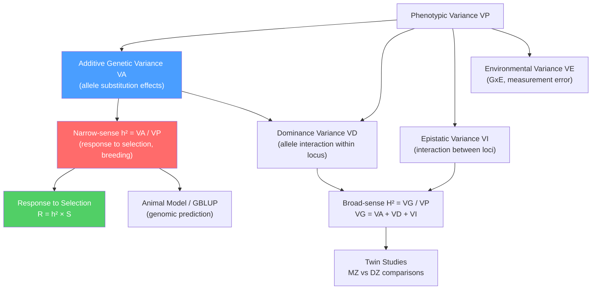

# 📊 Quantitative Genetics and Heritability

> [!abstract] TL;DR
> Quantitative genetics explains continuous traits (height, IQ, yield) as the sum of many small genetic and environmental effects; heritability ($h^2$) measures the fraction of phenotypic variance that is attributable to additive genetic differences, and is the central parameter linking natural selection, artificial breeding, and the genetic architecture of complex disease.

---

## Intuition — analogy FIRST

Think of a final exam grade. Each exam is made up of 50 short questions, and every student's score is the sum of how many they get right. Some students consistently score higher because they studied harder — that is the genetic component (differences in alleles). Others score higher because they happened to get lucky with the specific questions drawn — that is the environment. If you ran the same exam class repeatedly, the fraction of score variance explained by "how hard each student systematically studies" versus "random luck on test day" is exactly analogous to narrow-sense heritability.

The key insight: no single question (gene) makes or breaks the grade. Hundreds of questions each contribute a point or two. Remove any one question and the score barely changes. This is the polygenic model — many loci of small, additive effect — and it is why height, IQ, and most agronomic traits do not segregate in simple Mendelian ratios.

---

## How It Works



---

## Key Concepts / Details

### Secondary Level

**Continuous vs threshold traits.** Mendelian traits produce discrete classes (tall/dwarf). Quantitative traits produce a smooth, bell-shaped distribution. Examples: human height, blood pressure, crop yield, milk production. Threshold traits (schizophrenia, cleft palate) are biologically quantitative but observed as binary: they appear only when an underlying liability score crosses a threshold.

**The polygenic model.** Proposed by Fisher (1918): a quantitative trait is influenced by a large number of loci, each with a small, roughly additive effect, plus environmental noise. Mathematically, the phenotypic value of individual $i$ is:

$$P_i = \mu + \sum_{j=1}^{L} a_j x_{ij} + e_i$$

where $a_j$ is the additive effect of locus $j$, $x_{ij}$ is the genotype score (0, 1, or 2 copies of the effect allele), and $e_i$ is environmental deviation with mean zero. The central limit theorem guarantees that the sum of many small effects is approximately normally distributed — explaining the bell curve.

**Phenotypic variance decomposition.** The total phenotypic variance $V_P$ can be partitioned:

$$V_P = V_A + V_D + V_I + V_E$$

- $V_A$: **Additive genetic variance** — variance due to the average effects of allele substitutions. This is the component "transmitted from parent to offspring" and is the target of natural and artificial selection.
- $V_D$: **Dominance variance** — variance due to interactions between alleles at the same locus (heterozygote advantage or disadvantage).
- $V_I$: **Epistatic variance** — variance due to interactions between different loci.
- $V_E$: **Environmental variance** — everything else: nutrition, temperature, developmental noise, genotype-by-environment interaction ($V_{GE}$).

**Heritability.** There are two flavors:

| Measure | Formula | What it captures |
|---------|---------|-----------------|
| Narrow-sense $h^2$ | $V_A / V_P$ | Response to selection; parent-offspring resemblance |
| Broad-sense $H^2$ | $V_G / V_P$ where $V_G = V_A + V_D + V_I$ | Total genetic determination; relevant for clonal/inbred lines |

Heritability is a **population statistic**, not a property of the trait itself. The same trait can have $h^2 = 0.8$ in one environment and $h^2 = 0.3$ in another if environmental variance changes.

### Undergraduate Level

**Parent-offspring regression.** The simplest estimator of $h^2$: regress mid-offspring phenotype on mid-parent phenotype. The regression slope equals $h^2$ directly. For single-parent regression (e.g., mother only), the slope equals $h^2/2$ (because offspring share half their genes with one parent). This elegant result holds because the covariance between parent and offspring phenotypes equals $V_A/2$:

$$\text{slope} = \frac{\text{Cov}(\text{offspring}, \text{mid-parent})}{V_P(\text{parent})} = \frac{V_A/2}{V_P/2} = \frac{V_A}{V_P} = h^2$$

**The Breeder's Equation.** The cornerstone of artificial selection:

$$R = h^2 \times S$$

where $R$ is the **response to selection** (change in mean phenotype between generations) and $S$ is the **selection differential** (mean of selected parents minus population mean). If you select wheat plants with 20% higher yield than the population mean and $h^2 = 0.5$, the next generation will average 10% above the original mean. This equation predicts the pace of genetic change in livestock and crop improvement programs.

**QTL Mapping.** A Quantitative Trait Locus (QTL) is a chromosomal region that statistically associates with phenotypic variation. Classical QTL mapping uses an F2 or backcross population from two divergent lines:

1. Cross parental strains $P_1 \times P_2$ to produce F1 hybrids (fully heterozygous).
2. Self-fertilize F1 to produce an F2 population segregating at all loci.
3. Genotype individuals at dense marker loci (SSRs, SNPs).
4. For each position along the genome, test if marker genotype class (AA, Aa, aa) predicts phenotype.

**Interval mapping** (Lander & Botstein 1989) fits a simple regression model at every 1 cM position between flanking markers, computing the log-odds (LOD) score:

$$\text{LOD} = \log_{10}\frac{P(\text{data} \mid \text{QTL present})}{P(\text{data} \mid \text{no QTL})}$$

A LOD threshold of ~3.0 is conventionally used for genome-wide significance (corresponding to $\alpha = 0.05$ after accounting for multiple testing across the genome). QTL positions are reported as a 1.5 LOD drop confidence interval.

**Breeding value and BLUP.** The **breeding value** (BV) of an individual is twice the expected deviation of its offspring from the population mean — it measures the additive genetic value an individual passes to its progeny. In animal breeding, BVs are estimated using **BLUP (Best Linear Unbiased Prediction)**, Henderson's animal model:

$$\mathbf{y} = \mathbf{X}\boldsymbol{\beta} + \mathbf{Z}\mathbf{u} + \mathbf{e}$$

where $\mathbf{y}$ is the vector of phenotypes, $\boldsymbol{\beta}$ are fixed effects (herd, year, sex), $\mathbf{u}$ are random breeding values with $\text{Var}(\mathbf{u}) = \mathbf{A}\sigma_A^2$ ($\mathbf{A}$ = numerator relationship matrix from pedigree), and $\mathbf{e}$ are residuals. BLUP "borrows strength" from relatives: a sire with 1000 daughters yields a much more accurate EBV (Estimated Breeding Value) than one with 10 daughters.

**Twin studies.** Classical tool for estimating $H^2$ in humans where experiments are impossible. Monozygotic (MZ) twins share 100% of their genome; dizygotic (DZ) twins share 50% on average (same as full siblings).

$$H^2 \approx 2(r_{MZ} - r_{DZ})$$

where $r$ is the within-pair correlation for the trait. For height: $r_{MZ} \approx 0.92$, $r_{DZ} \approx 0.47$, giving $H^2 \approx 0.90$. For IQ: $H^2 \approx 0.50$–$0.80$ in adult samples. Limitations: assumes equal environments for MZ and DZ pairs (the "equal environments assumption"), ignores gene-environment interaction, and confounds $V_D$ with $V_I$.

### Graduate Level

**Genomic prediction and GBLUP.** Meuwissen, Hayes & Goddard (2001) showed that when marker density is high enough that every QTL is in linkage disequilibrium with at least one marker, the genomic relationship matrix $\mathbf{G}$ (computed from SNP data) can replace the pedigree-based $\mathbf{A}$ matrix:

$$\mathbf{G} = \frac{\mathbf{Z}\mathbf{Z}^T}{2\sum_j p_j(1-p_j)}$$

where $\mathbf{Z}$ encodes centered genotypes and $p_j$ is the allele frequency at SNP $j$. GBLUP uses $\mathbf{G}$ in place of $\mathbf{A}$, yielding **genomic estimated breeding values (GEBVs)** with prediction accuracy $r_{GY} \approx \sqrt{h^2 \cdot M_{e}^{-1} \cdot N}$ where $M_e$ is the effective number of chromosome segments (inversely proportional to $N_e$) and $N$ is the training population size. Dairy cattle genomic selection routinely achieves $r_{GY} > 0.75$ using $\sim 50{,}000$ SNPs.

**Ridge regression and Bayesian alphabet.** GBLUP is equivalent to ridge regression on SNP effects:

$$\hat{\boldsymbol{\alpha}} = (\mathbf{Z}^T\mathbf{Z} + \lambda \mathbf{I})^{-1}\mathbf{Z}^T\mathbf{y}, \qquad \lambda = \frac{V_E}{V_A/n_{\text{SNP}}}$$

This assumes all SNPs have equal, normally distributed effects. Bayesian approaches (BayesA, BayesB, BayesC$\pi$, BayesR) allow heterogeneous effect size distributions — BayesB assumes most SNPs have zero effect, appropriate for highly polygenic versus oligogenic architectures.

**SNP-heritability and the missing heritability problem.** GWAS typically identifies variants explaining only a fraction of twin-study $H^2$. For height, pre-2018 GWAS identified variants explaining ~20% of variance vs. $H^2 \approx 80\%$. Yang et al. (2010) used GCTA (Genome-wide Complex Trait Analysis) to show that all common SNPs on a chip collectively explain ~45% of height variance (chip/SNP heritability), even when none individually reach significance. The "missing heritability" is now understood as a combination of:

1. **Polygenicity** — thousands of variants each explaining $< 0.01\%$ of variance, requiring enormous sample sizes to detect individually.
2. **Rare variants** not captured by common SNP arrays.
3. **Gene-environment interaction** inflating $H^2$ from twin studies.
4. **Non-additive genetic effects** ($V_D$, $V_I$) captured by $H^2$ but not by SNP-based $h^2$.

Modern biobank-scale GWAS (UK Biobank: $N > 500{,}000$) now identifies thousands of genome-wide significant hits and explains the bulk of chip heritability for height, BMI, and educational attainment.

**Genetic architecture and polygenicity.** The effective number of independently acting loci, the distribution of effect sizes, and the degree of pleiotropy together define a trait's genetic architecture. Infinitesimal model: infinitely many loci, each with infinitely small effect. Spike-and-slab model: mixture of a point mass at zero (null loci) and a continuous distribution for causal loci. Architecture determines which statistical model maximises genomic prediction accuracy. The $M_e$ parameter (effective number of segments $\approx 2N_e L/\ln(4N_e L)$ for chromosome length $L$ Morgans) sets the fundamental limit on $h^2$ explainable by any finite SNP panel.

---

## Python Demo

```python
# pip install numpy matplotlib

import numpy as np
import matplotlib.pyplot as plt

rng = np.random.default_rng(seed=42)

# --- Parameters ---
n_ind = 1000          # number of individuals
n_loci = 100          # number of bi-allelic loci
p_allele = 0.5        # allele frequency at each locus

# --- Step 1: Simulate genotypes (0 / 1 / 2 copies of effect allele) ---
genotypes = rng.binomial(2, p_allele, size=(n_ind, n_loci))  # shape: (1000, 100)

# --- Step 2: Assign small, normally distributed effect sizes ---
effect_sizes = rng.normal(0.0, 0.10, size=n_loci)  # each locus contributes ~N(0, 0.01) variance

# --- Step 3: Compute additive genetic values ---
genetic_values = genotypes @ effect_sizes           # shape: (1000,)
VA = np.var(genetic_values, ddof=1)

# --- Step 4: Add environmental noise targeting h² ≈ 0.50 ---
VE = VA                                             # VA / (VA + VE) = 0.5
env_noise = rng.normal(0.0, np.sqrt(VE), size=n_ind)

phenotypes = genetic_values + env_noise
VP = np.var(phenotypes, ddof=1)
true_h2 = VA / VP
print(f"True narrow-sense h²  (VA/VP) : {true_h2:.3f}")

# --- Step 5: Simulate parent-offspring pairs ---
#   Split the 1000 individuals into 500 parent pairs.
#   Each "offspring" inherits half its genetic value from the parent
#   (reflecting Mendelian transmission of additive effects) plus new environment.
n_pairs = 500
parent_genetic  = genetic_values[:n_pairs]
parent_pheno    = phenotypes[:n_pairs]

# Offspring genetic value = 0.5 * parent BV + Mendelian sampling
offspring_genetic = 0.5 * parent_genetic + rng.normal(0, np.sqrt(VA / 2), n_pairs)
offspring_pheno   = offspring_genetic + rng.normal(0, np.sqrt(VE), n_pairs)

# --- Step 6: Parent-offspring regression -> h² estimate ---
# slope(offspring ~ parent) = Cov(offspring, parent) / Var(parent)
# For single-parent regression: slope = h² / 2  =>  h² = 2 * slope
cov_mat = np.cov(parent_pheno, offspring_pheno)
slope = cov_mat[0, 1] / cov_mat[0, 0]
estimated_h2 = 2.0 * slope
print(f"Estimated h² (2 × regression slope) : {estimated_h2:.3f}")

# --- Plot ---
fig, (ax1, ax2) = plt.subplots(1, 2, figsize=(12, 5))

ax1.hist(phenotypes, bins=40, color="steelblue", edgecolor="white", alpha=0.85)
ax1.set_title(f"Polygenic Trait Distribution\n(100 loci, true h² = {true_h2:.2f})")
ax1.set_xlabel("Phenotypic Value")
ax1.set_ylabel("Count")

ax2.scatter(parent_pheno, offspring_pheno, alpha=0.25, s=12, color="steelblue")
x_range = np.linspace(parent_pheno.min(), parent_pheno.max(), 200)
ax2.plot(x_range, np.polyval(np.polyfit(parent_pheno, offspring_pheno, 1), x_range),
         "r-", lw=2, label=f"slope = {slope:.3f}  →  ĥ² = {estimated_h2:.3f}")
ax2.set_title("Parent-Offspring Regression\n(slope × 2 ≈ narrow-sense h²)")
ax2.set_xlabel("Parental Phenotype")
ax2.set_ylabel("Offspring Phenotype")
ax2.legend()

plt.tight_layout()
plt.savefig("heritability_demo.png", dpi=150, bbox_inches="tight")
plt.show()
```

The simulation prints true $h^2$ (~0.50) and the regression-based estimate, which should agree within sampling noise. The left panel shows the characteristic bell curve arising from summing 100 small-effect loci; the right panel shows the modest parent-offspring correlation ($r \approx h^2/2 \approx 0.25$) with the regression line whose doubled slope recovers $h^2$.

---

## Real-World Applications

> **Plant & Animal Breeding.** Genomic selection using GBLUP replaced progeny testing in dairy cattle worldwide (2010s). In the Holstein breed, the generation interval dropped from ~7 years (waiting for a bull's daughters to produce milk records) to ~2 years (genotype young bulls as calves). Genetic gain per year roughly doubled. The same approach drives wheat yield improvement: CIMMYT's genomic selection pipelines screen >10,000 lines annually.

> **Height GWAS.** The largest GWAS for adult height (Yengo et al. 2022, $N \approx 5.4$ million) identified >12,000 independent genome-wide significant loci collectively explaining ~40% of phenotypic variance — consistent with SNP heritability and validating the infinitesimal model at large scale. Effect sizes range from ~6 mm per allele (near the *HMGA2* gene) to fractions of a millimeter for most hits.

> **Psychiatric Polygenic Risk Scores (PRS).** Schizophrenia has SNP heritability $h^2_{\text{SNP}} \approx 0.23$ and twin $H^2 \approx 0.81$. A PRS aggregating >100,000 SNP effects from large GWAS (PGC Consortium) predicts ~7% of schizophrenia variance in independent samples — clinically modest but invaluable for understanding biology, drug target identification, and gene-environment interaction research.

> **Precision medicine.** Polygenic risk scores for coronary artery disease, type 2 diabetes, and breast cancer are entering clinical use (Inouye et al. 2018; Khera et al. 2018). Individuals in the top 2% of a CAD PRS have risk equivalent to a monogenic familial hypercholesterolaemia mutation — actionable under current ACC/AHA guidelines.

---

## Common Pitfalls

- **Heritability is not fate.** $h^2 = 0.90$ for height does not mean height cannot be changed by environment — Dutch children gained ~20 cm in mean height over the 20th century (purely environmental). Heritability describes the proportion of *current population variance* due to genes; it says nothing about how much the trait can change absolutely.
- **Confusing $h^2$ with $H^2$.** Narrow-sense $h^2$ predicts response to selection; broad-sense $H^2$ (from twin studies) includes dominance and epistasis that are not heritable in the Mendelian sense. Using $H^2$ in the breeder's equation will overestimate response.
- **Population specificity.** Heritability estimated in one population (European ancestry) cannot be directly applied to another (African ancestry) because allele frequencies, LD structure, and environmental variance all differ. Portability of polygenic risk scores across ancestries remains a major limitation.
- **LOD score thresholds.** The conventional LOD $\geq 3.0$ threshold for QTL significance was derived for an 1800 cM mouse genome with sparse markers. It is not appropriate for dense SNP arrays or other species without simulation-based permutation testing.
- **Ascertainment bias in twin studies.** Volunteer twin registries oversample healthy, educated, concordant pairs. This can inflate $H^2$ estimates for psychiatric traits by reducing environmental variance in the sample.
- **Regression to the mean.** Tall parents have, on average, children shorter than themselves (not as tall), because their children inherit only $h^2 \times$ the parental deviation. Failing to account for this when interpreting family data leads to systematic errors.

---

## Trade-offs

| Approach | Strengths | Limitations |
|----------|-----------|-------------|
| Parent-offspring regression | Simple; no molecular data needed | Requires known pedigrees; confounded by shared environment |
| Twin studies | Controls for most confounders; large human datasets | Assumes equal environments; cannot partition VA from VD cleanly |
| Classical QTL mapping | Localises individual loci; full experimental control | Low resolution (5–30 cM); biparental cross limits allelic diversity |
| GWAS + GCTA | Genome-wide, unbiased; huge samples possible | Only common variants; LD complicates causal variant identification |
| GBLUP / Genomic selection | High prediction accuracy; no need to identify causal variants | Black-box; requires large reference panel; limited cross-population transfer |

---

## When to Use vs Avoid

**Use quantitative genetic framework when:**
- The trait shows continuous variation or a liability threshold model is appropriate.
- You want to predict response to selection before committing breeding resources.
- Population-level inference about genetic architecture is the goal (GWAS, SNP heritability).
- You need to estimate breeding values for selection decisions in livestock or crops.

**Avoid (or extend the framework) when:**
- The trait is caused by a single gene of large effect — classic Mendelian analysis is more powerful.
- Gene-environment interactions are so large that $h^2$ is unstable across environments (use reaction norms instead).
- The population is too small or too inbred for variance component estimation to be reliable ($N < 500$ for BLUP; $N < 10{,}000$ for GWAS).

---

## Related Concepts

- [[_MOC_Classical_and_Population_Genetics|↑ Classical and Population Genetics MOC]]
- [[Population_Genetics_and_Hardy_Weinberg]] — Allele frequency dynamics and random mating are the population genetic foundation that QTL mapping and GWAS build on; Hardy-Weinberg equilibrium is the null model for association tests.
- [[Complex_Trait_Genetics_and_GWAS]] — GWAS is the large-scale empirical application of quantitative genetic theory; SNP-heritability from GCTA bridges QG theory and GWAS results.
- [[Bayesian_Statistics]] — Bayesian methods (BayesA/B/R, MCMC) underpin modern genomic prediction by placing prior distributions on SNP effect sizes and estimating posterior breeding values.
- [[PCA]] — Principal components of the genomic relationship matrix are the standard method for correcting population stratification in GWAS, preventing spurious associations driven by ancestry differences rather than true QTLs.
- [[Regression_and_Correlation]] — Parent-offspring regression and marker regression are the elementary statistical tools of quantitative genetics; understanding OLS assumptions is essential for interpreting $h^2$ estimates.

---

## Review Questions

1. **(Secondary)** A farmer selects wheat plants with a seed yield 200 g above the population mean. If the narrow-sense heritability for yield is 0.40, what is the expected increase in mean yield in the next generation? What happens to the selection differential if the farmer selects more strictly (top 5% instead of top 20%)?

2. **(Undergraduate)** You estimate $h^2$ by regressing offspring phenotype on mid-parent phenotype and obtain a slope of 0.65. A twin study in the same population gives $H^2 = 0.85$. What is the most likely explanation for the discrepancy, and which estimate should you use to predict response to artificial selection? Under what conditions would the two estimates be equal?

3. **(Graduate)** A GWAS for BMI in 100,000 Europeans identifies 900 genome-wide significant SNPs explaining 6% of phenotypic variance, while twin studies estimate $H^2 = 0.70$ and GCTA estimates $h^2_{\text{SNP}} = 0.40$. Partition the "missing heritability" into its likely sources, explain the GCTA estimate conceptually (why does it recover more variance than the GWAS hits alone?), and describe two methodological choices that would improve genomic prediction accuracy in an independent validation cohort.

---

## Sources

- Lynch, M. & Walsh, B. (1998). *Genetics and Analysis of Quantitative Traits*. Sinauer Associates. — The definitive graduate reference for variance components, BLUP, and QTL mapping theory.
- Falconer, D. S. & Mackay, T. F. C. (1996). *Introduction to Quantitative Genetics* (4th ed.). Longman. — The classic undergraduate/graduate textbook; heritability, breeder's equation, and selection response.
- Visscher, P. M., Wray, N. R., Zhang, Q., Sklar, P., McCarthy, M. I., Brown, M. A., & Yang, J. (2017). 10 Years of GWAS Discovery: Biology, Function, and Translation. *American Journal of Human Genetics*, 101(1), 5–22. https://doi.org/10.1016/j.ajhg.2017.06.005
- Yang, J., Benyamin, B., McEvoy, B. P., et al. (2010). Common SNPs explain a large proportion of the heritability for human height. *Nature Genetics*, 42, 565–569. https://doi.org/10.1038/ng.608
- Meuwissen, T. H. E., Hayes, B. J., & Goddard, M. E. (2001). Prediction of total genetic value using genome-wide dense marker maps. *Genetics*, 157(4), 1819–1829. https://doi.org/10.1093/genetics/157.4.1819

---

#Genetics #ClassicalGenetics #QuantitativeGenetics #Heritability
