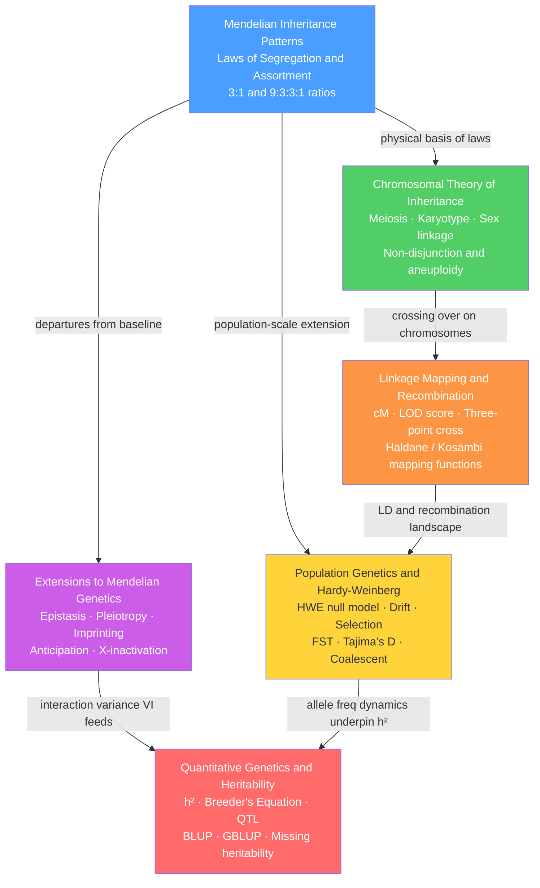

# Classical and Population Genetics — Map of Content

> [!abstract] Section Overview
> Classical genetics covers the rules of inheritance discovered by Mendel, given physical grounding through chromosomal theory and linkage mapping, and extended to the full range of real-world deviations — epistasis, pleiotropy, and imprinting — that enrich the baseline grammar of 3:1 ratios. Population genetics lifts these rules from individual crosses to entire breeding populations, using Hardy-Weinberg equilibrium as a null model and quantifying how genetic drift, natural selection, mutation, and gene flow shift allele frequencies across generations. Quantitative genetics completes the arc by bridging discrete Mendelian alleles and the continuous polygenic traits that underpin breeding, disease risk, and evolutionary adaptation.

---

## Concept Map

*(Blue = entry point, Green = chromosomal foundation, Orange = mapping tools, Purple = exceptions and extensions, Yellow = population-level theory, Red = advanced quantitative synthesis; arrows = "leads to" or "requires")*

---

## Learning Paths

### Classical Genetics Path
*Recommended for a first pass through inheritance mechanics:*

1. [[Mendelian_Inheritance_Patterns]] — Start here: Mendel's two laws, Punnett squares, and the probability arithmetic that underpins all of classical genetics
2. [[Chromosomal_Theory_of_Inheritance]] — Gives physical reality to Mendel's abstract factors; meiosis explains segregation and independent assortment mechanistically
3. [[Linkage_Mapping_and_Recombination]] — Introduces the first major violation of independent assortment; shows how crossover frequency becomes a genetic ruler in centiMorgans
4. [[Extensions_to_Mendelian_Genetics]] — Catalogues every major class of deviation from clean Mendelian ratios: epistasis, pleiotropy, imprinting, anticipation, and X-inactivation

### Population and Quantitative Genetics Path
*For continuous traits, evolutionary dynamics, and genomic prediction:*

5. [[Population_Genetics_and_Hardy_Weinberg]] — Scales Mendelian alleles up to populations; Hardy-Weinberg equilibrium as the null model; five forces that drive evolutionary change
6. [[Quantitative_Genetics_and_Heritability]] — Extends allele-frequency thinking to polygenic continuous traits; heritability, the Breeder's Equation, QTL mapping, and genomic selection

---

## All Notes in This Section

| Note | Core Framework | Mathematical Tools | Level |
|------|---------------|-------------------|-------|
| [[Mendelian_Inheritance_Patterns]] | Segregation and independent assortment; discrete allele ratios from gamete probabilities | Product/sum probability rules; Punnett squares; chi-square goodness-of-fit | Beginner |
| [[Chromosomal_Theory_of_Inheritance]] | Genes reside on chromosomes; meiosis generates haploid gametes through segregation and crossing over | Binomial independent assortment (2²³ gamete types); chi-square for X-linkage | Beginner–Intermediate |
| [[Linkage_Mapping_and_Recombination]] | Physical linkage violates independent assortment; recombination frequency as genetic distance in cM | RF estimation; Haldane and Kosambi mapping functions; LOD score; interference coefficient | Intermediate |
| [[Extensions_to_Mendelian_Genetics]] | Epistasis, pleiotropy, genomic imprinting, anticipation — departures that reveal gene interaction | Modified Punnett ratios (9:3:4, 12:3:1, 9:7, 15:1); ANOVA interaction terms; epistasis coefficient ε | Intermediate |
| [[Population_Genetics_and_Hardy_Weinberg]] | HWE as evolutionary null model; five forces alter allele and genotype frequencies | HWE equation (p² + 2pq + q²); Wright-Fisher binomial; FST; Tajima's D; coalescent expectations | Intermediate–Advanced |
| [[Quantitative_Genetics_and_Heritability]] | Polygenic model; phenotypic variance decomposition (VA, VD, VI, VE); heritability and selection response | Parent-offspring regression; Breeder's Equation R = h²S; LOD/QTL interval mapping; GBLUP matrix algebra | Advanced |

---

## Key Questions This Section Answers

- How do discrete alleles combine to produce predictable offspring ratios, and what probability rules govern that arithmetic?
- Why do chromosomes provide the physical mechanism for Mendel's laws, and what happens when they fail to segregate correctly?
- How is the distance between genes on the same chromosome measured, and why does recombination frequency saturate at 50%?
- What are the major classes of gene interaction that distort classical Mendelian ratios, and what molecular mechanisms produce them?
- What is Hardy-Weinberg equilibrium, what forces break it, and how do those forces shape the genetic diversity of natural populations?
- How is heritability defined and estimated, and what does it predict about the response of a population to selection?
- Why do twin studies and GWAS give different heritability estimates, and what is "missing heritability"?

---

## Cross-Section Connections

- [[_MOC_Genetics_Master]] — Master entry point for the entire Genetics and Genomics vault; this section provides the classical and population-genetic foundation required by all downstream sections
- Section 05 — Human Genetics and Disease: [[Complex_Trait_Genetics_and_GWAS]] — GWAS relies directly on HWE assumptions for quality control, FST-based population stratification correction, and LD decay determined by the local recombination landscape from linkage mapping
- Section 06 — Evolutionary and Comparative Genomics: [[Natural_Selection_Genetic_Drift_and_Bottlenecks]] — Evolutionary genetics extends population genetics by modelling selective sweeps, founder effects, demographic bottlenecks, and coalescent-based inference of population history

---

#MOC #Genetics #ClassicalGenetics #PopulationGenetics #SectionMOC
