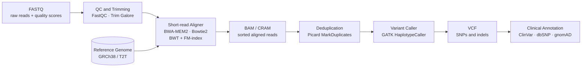

# 🧬 Bioinformatics Algorithms and Sequence Analysis

> [!abstract] TL;DR
> Bioinformatics algorithms extract evolutionary and functional signal from biological sequences by recasting biology as computer science: pairwise alignment as dynamic programming, database search as seeded heuristic traversal (BLAST), genome assembly as an Eulerian-path problem on de Bruijn graphs, and ultra-fast read mapping as Burrows-Wheeler text indexing. Mastering these algorithms is the gateway to genomics, proteomics, and precision medicine.

## Intuition — analogy FIRST

Imagine two strings of colored beads representing two DNA sequences. You want to lay them side by side so that matching colors line up as much as possible, but you are allowed to slide a bead over slightly by inserting a gap (a blank placeholder) whenever a bead is simply missing from one strand, or to accept a wrong-color match when an ancestral bead mutated to a new color. The challenge is that there are exponentially many ways to stretch and shift the strings, so brute force is impossible.

Dynamic programming solves this by building a grid: each cell stores the best possible alignment score for the subsequences seen **so far**, computed from just three neighboring cells (diagonal = substitution, left = gap in seq1, up = gap in seq2). The optimal answer for the full sequences emerges automatically from the bottom-right corner of the grid. Every key algorithm in sequence analysis — from pairwise alignment to profile hidden Markov models to genome assembly — is a variation on this "build a table of partial solutions" theme.

---

## How It Works



---

## Key Concepts / Details

### Secondary Level

**Why sequences diverge.** A shared ancestral DNA sequence changes over time through point mutations (one nucleotide replaced by another), insertions (extra bases added), and deletions (bases removed). Two present-day species sharing a common ancestor therefore have sequences that are similar but not identical. Alignment reconstructs the most plausible evolutionary correspondence between their residues.

**What alignment produces.** An alignment inserts gap characters (`-`) into each sequence so they reach the same length, then scores each column: matching characters score positively, mismatching characters score a small negative value, and gap columns score a penalty. The score summarizes how evolutionarily or functionally related the two sequences are.

**FASTQ format.** Raw sequencing reads are stored in FASTQ files: four lines per read — a header (`@`), the base sequence, a separator (`+`), and a quality string where each ASCII character encodes a Phred quality score $Q = -10\log_{10}(P_\text{error})$. A quality of `I` (ASCII 73) corresponds to Q = 40, meaning a 0.01% error probability per base.

**Sequence databases.** Biologists deposit sequences in public repositories:

| Database | Content | URL |
|----------|---------|-----|
| GenBank / NCBI | All known nucleotide sequences | ncbi.nlm.nih.gov |
| UniProt / Swiss-Prot | Manually annotated protein sequences | uniprot.org |
| PDB | 3-D protein and RNA structures | rcsb.org |
| Pfam | Protein domain families (profile HMMs) | pfam.xfam.org |
| ClinVar | Human variants with clinical significance | ncbi.nlm.nih.gov/clinvar |

### Undergraduate Level

**Pairwise alignment: global vs. local.**

*Needleman-Wunsch (global, 1970).* Aligns two sequences in their entirety. Initialize borders with cumulative gap penalties, then fill the DP table and trace back:

$$F(i,j) = \max\!\begin{cases} F(i{-}1,\,j{-}1) + s(a_i,\, b_j) & \text{(substitution / match)} \\ F(i{-}1,\,j) - d & \text{(gap in } b \text{)} \\ F(i,\,j{-}1) - d & \text{(gap in } a \text{)} \end{cases}$$

with $F(0,0) = 0$, $F(i,0) = -i \cdot d$, $F(0,j) = -j \cdot d$.

*Smith-Waterman (local, 1981).* Finds the highest-scoring local region. Identical recurrence except a fourth option resets negative scores to zero, so the traceback starts from the highest-value cell anywhere in the table:

$$H(i,j) = \max\!\begin{cases} 0 \\ H(i{-}1,j{-}1) + s(a_i,b_j) \\ H(i{-}1,j) - d \\ H(i,j{-}1) - d \end{cases}$$

Both algorithms run in $O(mn)$ time and space (space can be reduced to $O(\min(m,n))$ using Hirschberg's divide-and-conquer).

**Scoring matrices.** The substitution score $s(a,b)$ quantifies how likely an observed amino-acid swap is relative to chance:

- **PAM (Point Accepted Mutations).** PAM1 models one amino-acid change per 100 residues. PAM250 is extrapolated to 250 evolutionary units (roughly 20% sequence identity). Useful for distant homologs modeled as many small steps.
- **BLOSUM62 (BLOcks SUbstitution Matrix, 62% identity cutoff).** Computed directly from ungapped alignments of conserved protein blocks. Each entry is a log-odds score:

$$s(a,b) = \text{round}\!\left(2\log_2 \frac{q_{ab}}{p_a \cdot p_b}\right)$$

where $q_{ab}$ is the observed frequency of the substitution and $p_a, p_b$ are background residue frequencies. Positive score = substitution observed more than chance; negative = rarer than chance. BLOSUM62 is the default for most database searches and works best around 30–60% sequence identity.

**Gap penalties.** A single gap of length $k$ costs:
- *Linear:* $g(k) = k \cdot d$ — penalizes every gap residue equally; easy to optimize.
- *Affine:* $g(k) = d + (k-1) \cdot e$ with $d \gg e$ — opening a gap is expensive but extending it is cheap, which reflects biology (a single insertion/deletion event produces a contiguous gap). Affine penalties require three DP matrices (match, gap-in-A, gap-in-B) but remain $O(mn)$.

**BLAST heuristics.** The DP approach is too slow for searching databases with billions of residues. BLAST (Basic Local Alignment Search Tool, Altschul et al. 1990) achieves near-linear speed through four phases:

1. **Word index.** Compile a lookup table of all $k$-mers in the query (typical $k = 3$ for protein, $k = 11$ for DNA) and neighboring words with score $\geq T$.
2. **Hit detection.** Scan the database for exact matches to these words.
3. **Gap-free extension.** Extend each seed in both directions while the running score stays above a drop threshold $X$, producing high-scoring segment pairs (HSPs).
4. **Gapped extension.** Apply full Smith-Waterman around the best ungapped HSPs.

Statistical significance is reported as an E-value (expected number of hits as good as this by chance in a database of size $n$):

$$E = K \cdot m \cdot n \cdot e^{-\lambda S} \approx m \cdot n \cdot 2^{-S'}$$

where $S$ is the raw alignment score, $S'$ is the normalized **bit-score** $S' = (\lambda S - \ln K) / \ln 2$, and $K$, $\lambda$ are matrix-specific constants. An E-value of $10^{-5}$ means roughly one false positive in $10^5$ equivalent database searches; anything $\leq 10^{-3}$ warrants follow-up; anything $> 0.1$ is likely noise.

**Multiple sequence alignment (MSA).** Aligning $k > 2$ sequences simultaneously is NP-hard for exact solutions ($O(2^k \cdot L^k)$ for $k$ sequences of length $L$), so heuristics are used:

- **ClustalW (progressive).** Compute all pairwise distances, build a guide tree (UPGMA or Neighbor-Joining), then align sequences from the leaves inward. Fast but accumulates errors early in the tree.
- **MUSCLE (iterative refinement).** Two-phase progressive alignment followed by iterative profile-profile refinement. More accurate than ClustalW.
- **MAFFT.** Uses Fast Fourier Transform to find offset-free correlations between residue composition vectors, enabling rapid detection of homologous regions. Fastest of the three for large inputs.

**Profile HMMs for annotation.** A profile HMM represents a protein family's residue preferences at each position as a probabilistic generative model with match states, insertion states, and deletion states. Pfam database stores one HMM per domain family. Given a query sequence, the Viterbi algorithm finds the most probable path through the HMM states in $O(L \cdot |Q|)$ time where $L$ is the sequence length and $|Q|$ is the number of model states. HMMER3 (hmmscan) is the standard tool.

### Graduate Level

**De Bruijn graphs for genome assembly.** Short reads from sequencing cannot be assembled by pairwise overlap alone due to exponential combinatorics. Instead:

1. Break all reads into overlapping $k$-mers.
2. Build a de Bruijn graph where **nodes are ($k-1$)-mers** and **directed edges are $k$-mers** observed in the data.
3. A correct assembly corresponds to an **Eulerian path** through the graph (visits every edge exactly once).
4. Repeats create cycles and branching nodes (bubbles); resolvers use paired-end constraints or long reads to untangle them.

SPAdes (short reads), Hifiasm (PacBio HiFi), and Flye (Oxford Nanopore) all use de Bruijn or string graphs as their core data structure. Long-read assemblers additionally perform iterative rounds of **polishing** (aligning reads back to the draft assembly to correct consensus errors).

**Burrows-Wheeler Transform and FM-index.** Pairwise DP is $O(mn)$ per read — far too slow for mapping billions of 150 bp reads to a 3 Gbp human genome. BWA-MEM2 and Bowtie2 use the **FM-index**:

1. **BWT.** Sort all cyclic rotations of the reference string and record the last column $L$. Similar characters cluster in $L$, enabling compression (BWT underpins bzip2).
2. **Suffix array.** Store the starting positions of each sorted rotation.
3. **Backward search.** Given a query pattern of length $k$, locate all its occurrences in $O(k)$ time using the LF-mapping property: $\text{rank of } L[i] \text{ among equal characters} = \text{row in } F$ of the next occurrence.

Alignment proceeds by seeding with exact or near-exact matches from the FM-index, then extending seeds with a banded Smith-Waterman pass. Result: mapping a 150 bp read to the human genome in microseconds vs. seconds for naïve DP.

**Pangenome variation graphs.** A single linear reference genome is biased toward the reference haplotype — reads carrying alternate alleles or structural variants align poorly, causing reference bias in variant calling. Variation graphs (vg toolkit, Minigraph-Cactus, PanGraph) represent a population's genomic diversity as a directed acyclic graph where alternative paths encode known variants. Alignment to the graph is more sensitive for polymorphic loci and removes the "reference allele advantage" that inflates false-negative rates in under-represented populations.

**Protein language models and AlphaFold2.** AlphaFold2 predicts protein 3-D structure from sequence alone. Its key innovation is the **MSA representation**: hundreds of homologous sequences are aligned by Jackhmmer (HMMER) and fed as a matrix into an Evoformer transformer. Co-evolutionary signals — pairs of columns that co-vary across species — encode spatial contacts between residue pairs, giving the model near-crystallographic accuracy (median TM-score > 0.9 on CASP14). ESM-2, a protein language model trained on 250 M sequences without any MSA input, also achieves strong structure prediction by learning co-evolutionary statistics implicitly from scale.

---

## Python Demo

```python
# pip install numpy
import numpy as np


def needleman_wunsch(seq1, seq2, match=1, mismatch=-1, gap=-2):
    """
    Global alignment of seq1 and seq2 via Needleman-Wunsch dynamic programming.
    Returns (aligned_seq1, aligned_seq2, optimal_score).
    Traceback codes: 0=origin, 1=diagonal (sub/match), 2=up (gap in seq2), 3=left (gap in seq1).
    """
    m, n = len(seq1), len(seq2)
    dp = np.zeros((m + 1, n + 1), dtype=int)
    tb = np.zeros((m + 1, n + 1), dtype=int)

    # Border initialization: cumulative gap penalties
    for i in range(1, m + 1):
        dp[i][0] = i * gap
        tb[i][0] = 2  # up
    for j in range(1, n + 1):
        dp[0][j] = j * gap
        tb[0][j] = 3  # left

    # Fill DP table
    for i in range(1, m + 1):
        for j in range(1, n + 1):
            sub = match if seq1[i - 1] == seq2[j - 1] else mismatch
            scores = {
                1: dp[i - 1][j - 1] + sub,   # diagonal: substitution or match
                2: dp[i - 1][j] + gap,         # up: gap inserted into seq2
                3: dp[i][j - 1] + gap,         # left: gap inserted into seq1
            }
            best_dir = max(scores, key=scores.get)
            dp[i][j] = scores[best_dir]
            tb[i][j] = best_dir

    # Traceback from bottom-right corner
    aligned1, aligned2 = [], []
    i, j = m, n
    while i > 0 or j > 0:
        d = tb[i][j]
        if d == 1:
            aligned1.append(seq1[i - 1])
            aligned2.append(seq2[j - 1])
            i -= 1
            j -= 1
        elif d == 2:
            aligned1.append(seq1[i - 1])
            aligned2.append('-')
            i -= 1
        else:
            aligned1.append('-')
            aligned2.append(seq2[j - 1])
            j -= 1

    a1 = ''.join(reversed(aligned1))
    a2 = ''.join(reversed(aligned2))
    return a1, a2, int(dp[m][n])


if __name__ == "__main__":
    seq1 = "ACGTACGT"
    seq2 = "AGTACG"

    a1, a2, score = needleman_wunsch(seq1, seq2)
    match_line = ''.join('|' if a1[k] == a2[k] else ' ' for k in range(len(a1)))

    print(f"Seq1:  {a1}")
    print(f"       {match_line}")
    print(f"Seq2:  {a2}")
    print(f"Score: {score}")
    # Expected output:
    # Seq1:  ACGTACGT
    #        | ||||| 
    # Seq2:  A-GTACG-
    # Score: 2
    #
    # 6 matches (+6), 2 gap characters (-4) = net +2
    # Change to local alignment (Smith-Waterman) by replacing dp fill with:
    #   scores[0] = 0; best_dir = max(scores, key=scores.get)
    # and starting traceback from the cell with the highest value.
```

---

## Real-World Applications

**Gene function prediction via BLAST homology.** When a newly sequenced gene is unknown, BLASTp searches its protein translation against Swiss-Prot. If a hit has E-value $< 10^{-5}$ and > 30% identity over > 70% of the query length, the function and domain architecture of the known protein is transferred to the query. This "guilt by association" underlies the annotation of >60% of all GenBank entries.

**Clinical variant interpretation.** After the FASTQ→BAM→VCF pipeline, each variant is annotated by tools such as ANNOVAR or VEP: is the variant present in ClinVar (known pathogenic/benign), what is its allele frequency in gnomAD (rare variants are more likely causal), and does it fall in a Pfam domain essential for protein function? A frameshift in a BRCA1 HMM match state with allele frequency 0/250,000 in gnomAD and ClinVar classification "pathogenic" is reported to the oncology team.

**AlphaFold2 structure prediction.** The input MSA is built by running Jackhmmer against UniRef90 and searching the PDB for structural templates. The Evoformer processes the MSA through 48 blocks of row-wise and column-wise attention, learning co-evolutionary constraints. The resulting structure module places each residue using invariant point attention over 3-D frames. Released in 2021, AlphaFold2 predicted structures for virtually the entire human proteome (>20,000 proteins), accelerating drug target discovery.

**Metagenomic taxonomic profiling.** Tools such as Kraken2 classify environmental sequencing reads by matching $k$-mers against a hash table of $k$-mers labeled by their lowest common ancestor (LCA) in the NCBI taxonomy. A wastewater sample can reveal the presence of a novel viral lineage in minutes without culturing any organism.

**Drug-target binding prediction.** Sequence-based features from BLAST alignments to known druggable targets, combined with protein language model embeddings from ESM-2, feed machine learning classifiers for virtual screening. This reduced hit-to-lead time in several recent kinase inhibitor programs by pre-filtering millions of candidate compounds.

---

## Common Pitfalls

- **Using global alignment for remote homologs.** Needleman-Wunsch forces alignment across the entire sequence, penalizing domain insertions and extensions. When only a domain region is shared, Smith-Waterman local alignment avoids spurious terminal penalties that inflate apparent divergence.
- **Misreading E-value as p-value.** E-value is an expected count, not a probability. E = 0.01 means one false positive is expected per 100 equivalent searches — it is approximately equal to the p-value only when E is small. Reporting "statistically significant at E = 0.01" without accounting for database size is incorrect.
- **BLOSUM62 for highly similar sequences.** BLOSUM62 is calibrated on moderately diverged sequences (~30–60% identity). For highly similar sequences (>80% identity) use BLOSUM80; for very distant homologs (<20%) use BLOSUM45 or PAM250.
- **Gap penalties not tuned to problem.** The default BLAST gap open of 11 and extension of 1 suit protein searches. DNA alignments require different parameters; using protein defaults on nucleotide sequences produces biologically meaningless gappings.
- **Repeat-induced assembly collapse.** In de Bruijn graph assembly, repeated sequences appear as single high-coverage nodes with multiple incoming and outgoing edges. Assemblers emit a contig break rather than guess which path is correct. Low-complexity and transposable element repeats are the primary source of fragmented assemblies and must be masked (RepeatMasker) before downstream annotation.
- **BLAST misses structurally related but sequence-diverged proteins.** Below ~15% sequence identity (the "twilight zone"), BLAST E-values become uninformative. Profile-based methods (PSI-BLAST, HMM-HMM comparison with HHpred) or structure comparison tools (DALI, TM-align) are required.
- **Reference bias in variant calling.** Aligning to a single linear reference genome systematically under-represents reads carrying large structural variants or population-specific haplotypes. Use graph genomes or add known variants to a personalized reference with bwa-mem2 alt-aware alignment.

---

## Related Concepts

- [[_MOC_Genomics_and_Bioinformatics|↑ Genomics and Bioinformatics MOC]]
- [[DP_Fundamentals]] — the recurrence relation framework that underlies Needleman-Wunsch, Smith-Waterman, and all DP-based bioinformatics algorithms
- [[Edit_Distance]] — Levenshtein distance is a special case of global alignment with uniform +1 mismatch and gap scores; the recurrence is identical
- [[LCS_and_LIS]] — Longest Common Subsequence is equivalent to global alignment with match=+1, mismatch=0, gap=0; fundamental to understanding alignment scoring
- [[Suffix_Array]] — core data structure underlying the FM-index used in BWA-MEM2 and Bowtie2 for O(k) pattern matching
- [[Information_Theory]] — entropy and mutual information quantify conservation at each MSA column; log-odds in BLOSUM62 are information-theoretic scores
- [[HMM_GMM_ASR]] — profile HMMs in Pfam share the same three-state topology (match / insert / delete) as the phoneme HMMs used in speech recognition; Viterbi decoding applies to both
- [[DNA_Sequencing_Technologies]] — the sequencing platforms (Illumina short reads, PacBio HiFi, Oxford Nanopore) that generate the FASTQ files feeding these pipelines (same vault)
- [[Comparative_Genomics_and_Synteny]] — whole-genome alignment tools (MUMmer, LASTZ, minimap2) apply the same pairwise alignment logic at chromosomal scale to detect conserved syntenic blocks (same vault)

---

## Review Questions

1. **Secondary.** A student BLASTs a newly discovered bacterial gene and gets a hit to a human enzyme with E-value $4 \times 10^{-8}$ and 38% amino acid identity over 320 of 340 residues. What does this result tell us about likely gene function, and why is E-value a better significance measure than raw alignment score?

2. **Undergraduate.** Write the Needleman-Wunsch recurrence with affine gap penalty $g(k) = d + (k-1)e$. Why does affine penalty require three DP matrices instead of one? Given a BLAST bit-score $S' = 50$ against a database of $m = 400$ aa query and $n = 5 \times 10^7$ aa total (Swiss-Prot scale), compute the E-value. Is this hit significant?

3. **Graduate.** Explain how the Burrows-Wheeler Transform enables O(k) exact-match lookup for a k-character read against an indexed genome of length n, and contrast this with the O(mn) complexity of pairwise DP. Then describe two fundamental limitations of mapping reads to a single linear reference genome, and explain how variation graphs address each limitation.

---

## Sources

- Durbin R, Eddy SR, Krogh A, Mitchison G (1998). *Biological Sequence Analysis: Probabilistic Models of Proteins and Nucleic Acids*. Cambridge University Press.
- Altschul SF, Gish W, Miller W, Myers EW, Lipman DJ (1990). "Basic Local Alignment Search Tool." *Journal of Molecular Biology* 215(3): 403–410.
- Mount DW (2004). *Bioinformatics: Sequence and Genome Analysis*, 2nd ed. Cold Spring Harbor Laboratory Press.
- Li H, Durbin R (2009). "Fast and accurate short read alignment with Burrows-Wheeler Aligner." *Bioinformatics* 25(14): 1754–1760.
- Jumper J et al. (2021). "Highly accurate protein structure prediction with AlphaFold." *Nature* 596: 583–589.

---

#Genetics #Genomics #Bioinformatics #SequenceAlignment
