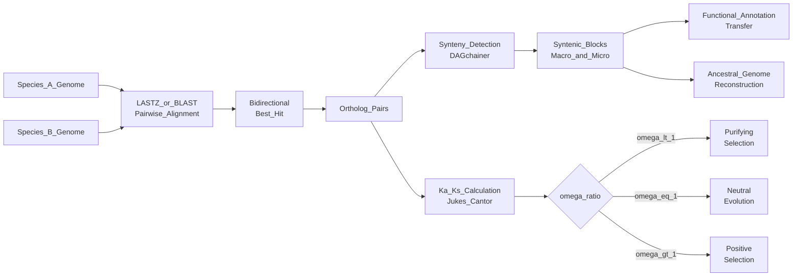

# Comparative Genomics and Synteny

> [!abstract] TL;DR
> Comparative genomics reads the evolutionary history embedded in DNA by aligning genomes across species — syntenic blocks (conserved gene order) reveal ancient chromosomal architecture, ortholog/paralog classification separates speciation from duplication events, and the Ka/Ks ratio quantifies whether natural selection is purifying, neutral, or adaptive at individual genes.

---

## Intuition

**Analogy:** Comparing two genomes is like comparing two editions of the same encyclopedia published centuries apart. Syntenic blocks are chapters that kept their sequence and internal order — chapters on "circulation" still appear before "digestion" in both editions. Rearrangements are chapters that got shuffled. Duplications are chapters that were photocopied and modified into a new entry. Deletions are chapters that were cut entirely. The more editions you collect, the more confidently you can reconstruct the original manuscript — the ancestral genome.

In molecular terms: if a stretch of genes appears in the same linear order on a chromosome in human, mouse, and chicken, that order has survived ~350 million years of evolution, almost certainly because disrupting it is lethal or highly deleterious. Regions that scramble freely are under no such constraint.

---

## How It Works

### Core Mechanics

**Step 1 — Pairwise Genome Alignment**
Whole-genome aligners (LASTZ, BLAST, MUMmer) find locally collinear blocks (LCBs) — maximal segments where gene content and order match between two species. A hit requires both sequence similarity and positional context.

**Step 2 — Ortholog Identification via Bidirectional Best Hit (BBH)**
1. BLAST all proteins of species A against all proteins of species B. Record the best hit for each A protein.
2. BLAST species B against A. Record best hits in the reverse direction.
3. A pair (a, b) is a putative ortholog if a's best hit is b AND b's best hit is a — a mutual best hit (BBH).
4. Refinement tools (OrthoFinder, OrthoMCL) extend BBH into ortholog groups using graph clustering.

**Step 3 — Classify Evolutionary Relationships**

| Type | Origin | Example |
|------|--------|---------|
| **Orthologs** | Speciation (vertical descent) | Human HBB vs mouse Hbb-b1 (both beta-globins) |
| **Paralogs** | Gene duplication (within/between lineages) | Human HBA1 vs HBB (alpha vs beta globin) |
| **Ohnologs** | Whole-genome duplication | ~30% of vertebrate gene pairs from 2R WGD |
| **Xenologs** | Horizontal gene transfer (HGT) | Bacterial antibiotic resistance genes in gut flora |

**Step 4 — Synteny Detection**
DAGchainer, MCScan, and i-ADHoRe identify syntenic blocks by finding chains of co-linear ortholog pairs that exceed a minimum length threshold. Macro-synteny covers megabase-scale chromosomal segments; micro-synteny tracks local gene neighbourhoods (5–20 genes).

**Step 5 — Ka/Ks Calculation**
For each ortholog pair, count synonymous (silent, Ks or dS) and non-synonymous (amino-acid changing, Ka or dN) substitutions, then apply a substitution model correction for multiple hits (Jukes-Cantor, Yang-Nielsen, or more sophisticated models). The ratio Ka/Ks (also written dN/dS) reports selective pressure:

$$\omega = \frac{K_a}{K_s} = \frac{dN}{dS}$$

- **ω < 1** — purifying (negative) selection: most amino-acid changes are deleterious, removed by selection
- **ω ≈ 1** — neutral evolution: protein function is relaxed or irrelevant
- **ω > 1** — positive (Darwinian) selection: new amino-acid states are actively favoured (e.g., immune genes, pathogen-host arms races)

**Step 6 — Functional Annotation Transfer**
If gene X in species A has a known function, its ortholog in species B can be annotated by inference — the foundation of GO term propagation and genome-assisted breeding.

### Whole-Genome Duplication Events

**Vertebrate 2R Hypothesis (Ohno 1970)**
Two successive rounds of whole-genome duplication (WGD) at the base of vertebrates expanded the ancestral chordate genome ~4-fold. Evidence: four paralogous Hox clusters (HoxA–D), four paralogous MHC regions, and Ks-based dating placing both duplications ~500 Mya. Gene pairs surviving from WGD are called **ohnologs** and are preferentially dosage-sensitive (transcription factors, signalling components).

**Teleost 3R**
A third WGD specific to ray-finned fish (~320 Mya) partially explains the extraordinary phenotypic diversity of teleosts (~30,000 species). Zebrafish retains ~20% of the expected ohnolog pairs; the rest were re-diploidised (silenced and deleted).

**Plant Polyploidy**
Virtually all flowering plants carry evidence of ancient WGD — Arabidopsis thaliana underwent at least three rounds; bread wheat (Triticum aestivum) is a hexaploid (AABBDD) arising from two hybridisation events within 10,000 years. Plant synteny is detected with SynMap/CoGe.

### Ultraconserved Elements (UCEs)

Bejerano et al. (2004) identified 481 genomic elements ≥200 bp that are 100% identical across human, mouse, and rat (diverged ~87 Mya). Zero observed mutations. Many overlap exons, splice sites, or regulatory enhancers of developmental transcription factors. Ka/Ks logic does not apply (UCEs are largely non-coding), but their extreme conservation implies lethal or near-lethal fitness consequences for any change — estimated selection coefficient s > 0.001 per mutation.

### Molecular Clock and Neutral Theory

Kimura's Neutral Theory (1968) states that the majority of nucleotide substitutions fixed in populations are selectively neutral — driven by genetic drift. Synonymous sites approximate a neutral clock because amino-acid identity is maintained regardless of codon choice. Ks therefore accumulates at a rate set by the neutral mutation rate μ:

$$K_s \approx 2\mu t$$

where t is divergence time (in each lineage). Calibrated against a fossil-dated divergence event, Ks becomes a molecular clock.

**Jukes-Cantor Correction** — the simplest model correcting for multiple substitutions at the same site:

$$d = -\frac{3}{4} \ln\!\left(1 - \frac{4}{3}p\right)$$

where p is the observed proportion of differing sites. Without correction, old divergences are underestimated because early substitutions are overwritten.

### CAFE — Gene Family Evolution

Computational Analysis of gene Family Evolution (CAFE) fits a birth-death model to gene family sizes across a species tree. For each family it tests whether observed expansions (e.g., olfactory receptor genes: 388 in mouse, 802 in rats) or contractions (e.g., taste receptor pseudogenization in cetaceans) are statistically significant. Contracted immune families in domesticated animals often signal relaxed pathogen pressure; expanded detoxification families signal dietary specialization.

### Synteny Browsers

| Tool | Strength |
|------|----------|
| **Ensembl SyntenyView** | Pre-computed vertebrate/invertebrate macro-synteny maps |
| **SynMap (CoGe)** | Plant-focused, handles polyploid genomes |
| **MAUVE** | Multi-genome alignment with LCB detection, handles rearrangements |
| **MCScan / JCVI** | Syntenic dot plots, collinearity blocks, WGD analysis |

### Flow / Architecture



---

## Key Concepts

### Secondary Level

**What is synteny?**
When you line up the chromosomes of a human and a mouse, whole stretches of genes appear in the same order — same neighbourhood, same orientation. These stretches are syntenic. They exist because moving genes around (via chromosomal inversions, translocations, or transpositions) usually breaks something — a regulatory element, a topologically associating domain, or a co-expressed gene cluster. The more evolutionary time has passed, the more rearrangements accumulate and the shorter the average syntenic block.

**Orthologs vs Paralogs — why it matters**
If you want to study a mouse model of a human disease gene, you need the ortholog (same gene in a different species), not a paralog (a related gene that diverged by duplication — it may have a different function). Misidentifying paralogs as orthologs is a classic source of incorrect functional inferences in comparative biology.

**The molecular clock concept**
DNA accumulates mutations at a roughly constant rate in non-functional sites. This means two species that diverged 100 Mya will have accumulated twice as many synonymous changes as two species that diverged 50 Mya. By calibrating the clock with one well-dated fossil split, you can estimate divergence times for all other species pairs.

### Undergraduate Level

**Ka/Ks Calculation — Worked Example**

Given two aligned codons: `ACG` (Thr) vs `AGG` (Arg).
- One nucleotide change: position 2, C→G.
- Amino acid changes: Thr → Arg — this is a **non-synonymous** (Ka) substitution.

After counting all synonymous and non-synonymous differences across a full gene and normalising by the total number of synonymous/non-synonymous sites, apply the Jukes-Cantor correction:

$$K_s = -0.75 \ln\!\left(1 - \frac{4}{3} p_S\right), \quad K_a = -0.75 \ln\!\left(1 - \frac{4}{3} p_N\right)$$

A gene with ω = 0.05 is under very strong purifying selection — 95% of amino-acid changes are removed. A gene with ω = 3.2 has undergone an adaptive sweep — the majority of fixed changes are amino-acid altering (common in immune receptor genes, sperm proteins, and pathogen surface antigens).

**Phylogenetic Distance from Ks**

For a pair of protein-coding genes where Ks = 0.15 and the synonymous substitution rate μ_s = 2.5 × 10⁻⁹ substitutions per site per year:

$$t = \frac{K_s}{2\mu_s} = \frac{0.15}{2 \times 2.5 \times 10^{-9}} = 30 \text{ Mya}$$

This gives a divergence time estimate without relying on fossil records alone.

**WGD Detection via Ks Peaks**

After WGD, all duplicated gene pairs begin diverging simultaneously. Plotting the Ks distribution for all intra-genome paralog pairs therefore produces a peak at the Ks value corresponding to the WGD date. Arabidopsis shows two peaks (two ancient polyploidy events); vertebrates show a shoulder around Ks ≈ 0.9–1.2 corresponding to the 2R events.

### Graduate Level

**Ancestral Genome Reconstruction**

Given a phylogenetic tree and the gene orders in extant species, parsimony-based tools (GRIMM, MGRA, AnAGram) reconstruct the minimum number of rearrangement events (inversions, translocations, fissions, fusions) needed to explain observed differences. The inferred ancestral chromosomal architecture can be compared to fossil karyotypes (e.g., Cretaceous mammals retained ~23 ancestral chromosomes); violations of parsimony reveal convergent rearrangements.

**MAUVE Alignment and Locally Collinear Blocks**

MAUVE identifies LCBs using a progressive alignment strategy with a sum-of-pairs scoring model. For closely related bacterial strains (e.g., E. coli K-12 vs O157:H7), it resolves the mosaic structure of genomic islands inserted by prophages — genomic regions present in one strain but absent in another. This is xenology detection at the structural level.

**Transposable Element-Driven Synteny Disruption**

Transposable elements (TEs) constitute 45% of the human genome and up to 85% of some plant genomes. TEs create direct and inverted repeats at multiple loci; ectopic recombination between non-homologous TE copies causes deletions, inversions, and translocations that shatter synteny. Rodents (50× faster TE activity than primates) have correspondingly more scrambled synteny with human; syntenic block N50 in mouse-human comparisons (~90 Mb) is markedly shorter than dog-human comparisons (~220 Mb), consistent with rodent TE burst rates.

**Micro-Synteny Analysis and Regulatory Conservation**

While macro-synteny tracks chromosomal scale order, micro-synteny analysis (5–20 gene windows) detects conserved gene neighbourhoods that include regulatory elements in intergenic regions. The Irx3-Irx5-Irx6 cluster is micro-syntenic across vertebrates; disrupting its TAD boundary by a structural variant is the causal mechanism linking a distant obesity-associated SNP to Irx3 misexpression in hypothalamic neurons.

---

## Python Demo

```python
# pip install numpy matplotlib
import numpy as np
import matplotlib.pyplot as plt
import random

# Standard genetic code (codon -> single-letter amino acid, '*' = stop)
GENETIC_CODE = {
    'TTT': 'F', 'TTC': 'F', 'TTA': 'L', 'TTG': 'L',
    'CTT': 'L', 'CTC': 'L', 'CTA': 'L', 'CTG': 'L',
    'ATT': 'I', 'ATC': 'I', 'ATA': 'I', 'ATG': 'M',
    'GTT': 'V', 'GTC': 'V', 'GTA': 'V', 'GTG': 'V',
    'TCT': 'S', 'TCC': 'S', 'TCA': 'S', 'TCG': 'S',
    'CCT': 'P', 'CCC': 'P', 'CCA': 'P', 'CCG': 'P',
    'ACT': 'T', 'ACC': 'T', 'ACA': 'T', 'ACG': 'T',
    'GCT': 'A', 'GCC': 'A', 'GCA': 'A', 'GCG': 'A',
    'TAT': 'Y', 'TAC': 'Y', 'TAA': '*', 'TAG': '*',
    'CAT': 'H', 'CAC': 'H', 'CAA': 'Q', 'CAG': 'Q',
    'AAT': 'N', 'AAC': 'N', 'AAA': 'K', 'AAG': 'K',
    'GAT': 'D', 'GAC': 'D', 'GAA': 'E', 'GAG': 'E',
    'TGT': 'C', 'TGC': 'C', 'TGA': '*', 'TGG': 'W',
    'CGT': 'R', 'CGC': 'R', 'CGA': 'R', 'CGG': 'R',
    'AGT': 'S', 'AGC': 'S', 'AGA': 'R', 'AGG': 'R',
    'GGT': 'G', 'GGC': 'G', 'GGA': 'G', 'GGG': 'G',
}
BASES = 'ATGC'
VALID_CODONS = [c for c, aa in GENETIC_CODE.items() if aa != '*']


def jukes_cantor(p):
    """JC69 correction for multiple hits. Clamps p < 0.75 to avoid log(0)."""
    p = min(p, 0.7499)
    return -0.75 * np.log(1.0 - (4.0 / 3.0) * p)


def ka_ks(seq1, seq2):
    """
    Simplified site-counting Ka/Ks estimate for two aligned CDS strings.
    Returns (Ka, Ks, omega) or (None, None, None) if sequences are too short.
    """
    assert len(seq1) == len(seq2) and len(seq1) % 3 == 0
    S, N = 0.0, 0.0    # total synonymous / nonsynonymous sites
    sd, nd = 0, 0      # observed synonymous / nonsynonymous differences

    for i in range(0, len(seq1), 3):
        c1, c2 = seq1[i:i+3], seq2[i:i+3]
        if c1 not in GENETIC_CODE or c2 not in GENETIC_CODE:
            continue
        if GENETIC_CODE[c1] == '*' or GENETIC_CODE[c2] == '*':
            continue
        aa1, aa2 = GENETIC_CODE[c1], GENETIC_CODE[c2]

        # Count synonymous sites in c1 (average of both sequences is ideal;
        # here we use c1 for simplicity — adequate for small divergences)
        for pos in range(3):
            syn_alts = sum(
                1 for b in BASES
                if b != c1[pos]
                and (c1[:pos] + b + c1[pos+1:]) in GENETIC_CODE
                and GENETIC_CODE[c1[:pos] + b + c1[pos+1:]] == aa1
            )
            S += syn_alts / 3.0
            N += (3 - syn_alts) / 3.0

        # Differences between codons (path-of-one approximation for 1 diff)
        n_diff = sum(c1[p] != c2[p] for p in range(3))
        if n_diff == 0:
            continue
        if aa1 == aa2:
            sd += n_diff   # synonymous difference
        else:
            nd += n_diff   # nonsynonymous difference

    if S < 1.0 or N < 1.0:
        return None, None, None

    Ks = jukes_cantor(sd / S)
    Ka = jukes_cantor(nd / N)
    omega = Ka / Ks if Ks > 1e-9 else float('inf')
    return Ka, Ks, omega


def simulate_cds(n_codons=120, seed=0):
    """Generate a random coding sequence from non-stop codons."""
    rng = random.Random(seed)
    return ''.join(rng.choice(VALID_CODONS) for _ in range(n_codons))


def evolve(seq, syn_prob=0.03, nonsyn_prob=0.01, seed=0):
    """
    Introduce synonymous and nonsynonymous point mutations to simulate
    divergence from a reference sequence under a given selective regime.
    """
    rng = random.Random(seed)
    s = list(seq)
    for i in range(0, len(seq), 3):
        codon = ''.join(s[i:i+3])
        if codon not in GENETIC_CODE or GENETIC_CODE[codon] == '*':
            continue
        ref_aa = GENETIC_CODE[codon]
        for pos in range(3):
            r = rng.random()
            alts = [b for b in BASES if b != s[i + pos]]
            rng.shuffle(alts)
            if r < syn_prob:
                for b in alts:
                    nc = codon[:pos] + b + codon[pos+1:]
                    if nc in GENETIC_CODE and GENETIC_CODE[nc] == ref_aa:
                        s[i + pos] = b
                        codon = nc
                        break
            elif r < syn_prob + nonsyn_prob:
                for b in alts:
                    nc = codon[:pos] + b + codon[pos+1:]
                    if nc in GENETIC_CODE and GENETIC_CODE[nc] not in ('*', ref_aa):
                        s[i + pos] = b
                        codon = nc
                        break
    return ''.join(s)


# ---- Simulate three evolutionary regimes (25 gene pairs each) ----
regimes = {
    'Purifying (omega < 1)':  {'syn': 0.04, 'nonsyn': 0.004, 'color': 'steelblue'},
    'Neutral  (omega ~ 1)':   {'syn': 0.03, 'nonsyn': 0.03,  'color': 'gray'},
    'Positive (omega > 1)':   {'syn': 0.005, 'nonsyn': 0.045, 'color': 'tomato'},
}

fig, ax = plt.subplots(figsize=(7, 6))
N_GENES = 25

for label, params in regimes.items():
    kas, kss = [], []
    for seed in range(N_GENES):
        ref = simulate_cds(n_codons=120, seed=seed)
        evo = evolve(ref, syn_prob=params['syn'],
                     nonsyn_prob=params['nonsyn'], seed=seed + 1000)
        ka, ks, omega = ka_ks(ref, evo)
        if ka is not None and ks > 1e-9 and not np.isinf(ka):
            kas.append(ka)
            kss.append(ks)
    ax.scatter(kss, kas, label=label, color=params['color'],
               alpha=0.85, edgecolors='k', linewidths=0.4, s=60)

lim = 0.5
ax.plot([0, lim], [0, lim], 'k--', lw=1.2, label='omega = 1 (neutral)')
ax.set_xlim(0, lim)
ax.set_ylim(0, lim)
ax.fill_between([0, lim], [0, 0], [0, lim], alpha=0.04, color='steelblue',
                label='Purifying region (Ka < Ks)')
ax.fill_between([0, lim], [0, lim], [lim, lim], alpha=0.04, color='tomato',
                label='Positive selection region (Ka > Ks)')
ax.set_xlabel('Ks  (synonymous substitutions per site)', fontsize=11)
ax.set_ylabel('Ka  (non-synonymous substitutions per site)', fontsize=11)
ax.set_title('Ka vs Ks  —  Simulated Selective Pressure\n'
             '(Jukes-Cantor corrected)', fontsize=12)
ax.legend(fontsize=8, loc='upper left')
plt.tight_layout()
plt.savefig('ka_ks_scatter.png', dpi=120)
plt.show()
print("Saved: ka_ks_scatter.png")
```

---

## Real-World Applications

> **Disease gene orthologs for animal models.** The cystic fibrosis transmembrane conductance regulator (CFTR) gene has clear orthologs in mouse, pig, ferret, and zebrafish. Comparative Ka/Ks analysis across vertebrates revealed that the NBD2 ATPase domain is under extreme purifying selection (ω ≈ 0.01), confirming functional indispensability. This conservation justified pig and ferret CFTR knockout models, which recapitulate lung pathology far better than mouse models where the bronchial architecture differs.

> **Predicting regulatory function from conservation.** The ENCODE project used cross-species conservation (human vs 29 mammals) to score putative cis-regulatory elements. Sequences conserved but not protein-coding — detected by synteny-aware alignment — were prioritised as enhancers. ~15% of initially predicted enhancers showed activity in reporter assays, a 6-fold enrichment over non-conserved random sequences.

> **Genome-assisted breeding.** Maize and sorghum share syntenic blocks covering ~70% of gene space. When a drought-tolerance QTL is mapped in sorghum, breeders use micro-synteny to identify the corresponding genomic interval in maize and scan it for candidate genes already characterised in maize functional studies — dramatically narrowing the gene discovery bottleneck.

> **Ancestral genome reconstruction.** By integrating synteny across 23 mammalian genomes, Murphy et al. reconstructed the 22-chromosome karyotype of the placental mammal ancestor. Comparing extinct lineages (e.g., Neanderthal via ancient DNA) against the ancestral reconstruction quantifies the net chromosomal changes in the ~600,000 years since human-Neanderthal divergence.

---

## Trade-offs

| Aspect | Strength | Limitation |
|--------|----------|------------|
| **Ortholog inference (BBH)** | Fast, scalable to thousands of genomes | Misses many-to-many relationships; collapses paralog groups |
| **Ka/Ks as selection proxy** | Interpretable, theory-grounded | Assumes Ks is neutral; fails when Ks is saturated (ancient divergences); averages over episodic selection |
| **WGD detection via Ks peaks** | Genome-wide, no prior knowledge needed | Peaks broaden with increasing age; overlapping WGD signals are hard to deconvolve |
| **Synteny-based annotation** | Transfers knowledge across species efficiently | Breaks down in rapidly evolving lineages (rodents, insects) with high rearrangement rates |
| **UCE conservation as proxy for function** | Identifies the most constrained elements | Does not distinguish regulatory vs structural roles; function hard to test experimentally |

---

## When to Use vs Avoid

**Use when:**
- Identifying functional orthologs for experimental model design
- Dating divergence events when fossils are sparse (molecular clock)
- Detecting positive selection in pathogen-host interaction genes, immune genes, or rapidly adaptive traits
- Prioritising non-coding regulatory regions for functional validation
- Reconstructing ancestral gene order to understand chromosomal evolution

**Avoid when:**
- Species are very closely related (Ks ≈ 0 — insufficient signal) or very distantly related (Ks > 3 — saturation)
- Studying highly rearranged lineages (some fungi, insects) where synteny dissolves rapidly
- Using Ka/Ks as a binary test without accounting for within-gene heterogeneity (some sites may be under positive selection even when the gene-wide average ω < 1)
- Inferring function solely from sequence conservation — highly conserved sequences can still have redundant or unexpected functions

---

## Common Pitfalls

- **Paralog-as-ortholog contamination** — BBH can pair a gene with its most similar paralog rather than its true ortholog, particularly after WGD. Always validate with phylogenetic tree topology (gene trees vs species trees).
- **Ks saturation for ancient divergences** — When Ks approaches 1.0–2.0, the Jukes-Cantor correction diverges (log of a near-zero number). Use more sophisticated substitution models (HKY85, GTR) or protein-level divergence (Ka only) for Cambrian-scale comparisons.
- **Gene conversion masking duplication** — Concerted evolution between paralogs (e.g., rDNA arrays, histone clusters) homogenises sequences, making paralog pairs look like orthologs in sequence-similarity searches.
- **Using ω on entire genes** — A gene with overall ω = 0.3 may contain specific codons with ω > 5 (e.g., antibody hypervariable loops). Site-specific models (PAML codeml M2a vs M1a) or branch-site tests are necessary to detect episodic positive selection.
- **Confusing micro- and macro-synteny** — Two genes being syntenic at the chromosome level does not mean their immediate regulatory neighbourhood is conserved. Micro-synteny analyses require tighter window-based comparisons and higher sequence identity thresholds.
- **TE copies inflating apparent paralogy** — BLAST searches against repeat-rich genomes return many TE-derived low-complexity hits that superficially resemble gene duplications. Always mask repeats (RepeatMasker) before large-scale ortholog searches.

---

## Related Concepts

- [[_MOC_Genomics_and_Bioinformatics|↑ Genomics and Bioinformatics MOC]]
- [[Information_Theory]] — Shannon entropy and Kolmogorov-complexity-based measures of sequence information provide formal frameworks for quantifying evolutionary divergence and compressibility of genomic sequences
- [[Molecular_Evolution_and_Phylogenetics]] — The same neutral theory and substitution models that underpin Ka/Ks drive phylogenetic tree inference; synteny provides an independent, topology-free source of phylogenetic signal
- [[Genome_Organization_and_Structure]] — Syntenic blocks are shaped by chromosome architecture (TADs, centromeres, heterochromatin); understanding genome packaging explains which rearrangements are tolerated and which are lethal
- [[Bioinformatics_Algorithms_and_Sequence_Analysis]] — BLAST, Smith-Waterman, and suffix-array-based aligners are the computational engines underlying every ortholog search and synteny detection pipeline

---

## Review Questions

**Conceptual**
1. A gene encoding a ribosomal protein shows ω = 0.02 across 300 vertebrate species, while a nearby gene encoding a sperm surface receptor shows ω = 4.1 in the primate lineage. What does each value tell you about the evolutionary constraints on these genes, and what biological logic explains the difference?

**Scenario**
2. You have assembled a high-quality genome for a newly discovered deep-sea fish and want to identify which genes are responsible for its bioluminescence adaptation. You have access to genomes from 12 related non-bioluminescent fish species. Outline a comparative genomics strategy — specifying which tools, which evolutionary metrics, and which synteny analyses you would apply — to prioritise candidate genes for functional validation.

**Trade-off**
3. A colleague wants to use Ka/Ks ratios to detect positive selection in a comparison between two strains of the same bacterial species that diverged ~5,000 years ago. A second colleague wants to apply the same test to compare human and lamprey genes diverged ~500 Mya. What are the specific technical failure modes in each scenario, and what alternative methods would you recommend for each?

---

## Sources

- Lewin, B. et al. *Lewin's Genes XII*. Jones & Bartlett Learning, 2021.
- Kellis, M., Birren, B. W. & Lander, E. S. "Proof and evolutionary analysis of ancient genome duplication in the yeast *Saccharomyces cerevisiae*." *Nature* 428, 617–624 (2004).
- Zhang, J. "Evolution by gene duplication: an update." *Trends in Ecology & Evolution* 18(6), 292–298 (2003). *(Ka/Ks review)*
- Yang, Z. & Nielsen, R. "Estimating synonymous and nonsynonymous substitution rates under realistic evolutionary models." *Molecular Biology and Evolution* 17(1), 32–43 (2000).
- Bejerano, G. et al. "Ultraconserved elements in the human genome." *Science* 304(5675), 1321–1325 (2004).
- Ohno, S. *Evolution by Gene Duplication*. Springer, 1970.
- Darling, A. C. E. et al. "Mauve: multiple alignment of conserved genomic sequence with rearrangements." *Genome Research* 14(7), 1394–1403 (2004).

---

#Genetics #Genomics #ComparativeGenomics #Synteny
