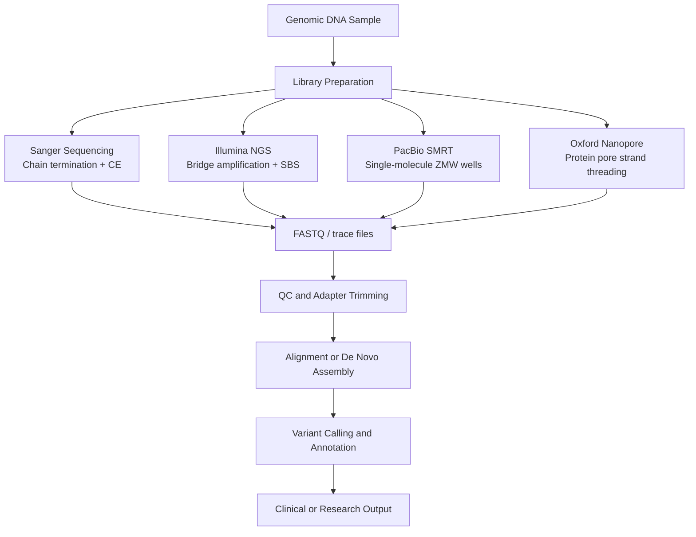

# 🧬 DNA Sequencing Technologies

> [!abstract] TL;DR
> DNA sequencing technologies convert the order of nucleotides (A, T, G, C) in a genome into machine-readable data — spanning Sanger's precise chain-termination chemistry, Illumina's massively parallel short-read synthesis, and nanopore's real-time ionic current strand-threading — enabling clinical diagnostics, pandemic surveillance, and the $200 human genome.

---

## Intuition

**Analogy:** Imagine a very long book that has been shredded. Sanger sequencing reads the book word-by-word in a single pass — slow, precise, limited to about one page at a time. Next-generation sequencing (Illumina) shreds the entire book into millions of tiny 150-character snippets simultaneously, then reassembles the complete text computationally by finding where snippets overlap — brute-force parallel reconstruction at enormous scale. Long-read sequencing (PacBio, Nanopore) reads whole paragraphs at once: each read spans far more of the narrative, making it far easier to reassemble repetitive passages that look identical in snippets, though each paragraph contains a few more typos per line.

The computational challenge mirrors the biological one: converting chemistry-produced signals (fluorescent flashes, ionic current dips) into reliable base calls, then stitching billions of overlapping fragments back into a coherent genome.

---

## How It Works



---

### 1. Sanger Sequencing — Chain Termination (1977)

**Chemistry:** DNA polymerase extends a primer in a mixture of normal dNTPs and a small fraction of dideoxynucleotides (ddNTPs). A ddNTP lacks the 3′-OH group required to form the next phosphodiester bond — chain synthesis terminates at whichever position that ddNTP is incorporated. Each of the four ddATP, ddCTP, ddGTP, ddTTP carries a distinct fluorescent dye label.

**Readout:** Capillary electrophoresis separates the resulting population of terminated fragments by length (single-base resolution). A laser at the detector end excites each dye as the fragment passes; the temporal sequence of colour signals equals the DNA sequence.

**Performance characteristics:**

| Metric | Value |
|--------|-------|
| Read length | ~700–1000 bp |
| Error rate | < 0.001% |
| Throughput | ~96 reads per capillary run |
| Cost per Mb | ~$500–2000 |

Sanger remains the gold standard for validating specific variants, sequencing PCR products under 1 kb, and confirming NGS hits in clinical diagnostic workflows.

---

### 2. Illumina NGS — Sequencing by Synthesis (SBS)

**Library preparation:** Fragment genomic DNA to ~300–500 bp by sonication or enzymatic shearing, then ligate platform-specific adapter oligonucleotides to both ends of each fragment.

**Bridge amplification:** Adapter-ligated fragments hybridise to complementary oligonucleotides covalently tethered to a glass flow cell surface. Each fragment arches over and hybridises to an adjacent oligo, forming a bridge. Extension by polymerase creates a duplexed bridge; denaturation leaves two surface-attached copies. Repeated bridging and extension cycles produce dense clusters of ~1000 identical copies per spot (~1 µm²), amplifying the fluorescent signal sufficiently for camera-based detection of single-molecule events at massive parallelism.

**Sequencing-by-synthesis cycle:**
1. Flood the flow cell with all four fluorescently labelled, 3′-blocked dNTPs.
2. DNA polymerase incorporates exactly one nucleotide per strand (blocked 3′-OH prevents chain elongation past one base).
3. Unincorporated nucleotides are washed away.
4. Image the entire flow cell: the fluorescent colour of each cluster encodes the incorporated base.
5. Chemical cleavage removes the dye and unblocks the 3′-OH.
6. Repeat for the next cycle (~150 cycles for 150 bp reads).

**Paired-end sequencing:** After completing reads from one adapter end, the template is regenerated and sequenced from the opposite adapter, producing two reads per fragment. This improves alignment accuracy, reveals the insert-size distribution, and enables detection of structural variants through discordant read pairs.

**Performance (NovaSeq X):**

| Metric | Value |
|--------|-------|
| Read length | 2 × 150 bp (paired-end) |
| Error rate | ~0.1% (>85% bases at Q30) |
| Throughput | up to 16 Tb per run |
| Cost per human WGS | ~$200–300 |

---

### 3. PacBio SMRT Sequencing — Single-Molecule Real-Time (2009)

**Zero-Mode Waveguides (ZMW):** Arrays of $\sim\!10^5$ cylindrical nano-wells, each ~70 nm in diameter — far below the diffraction limit of visible light. A laser propagating upward into the well creates an evanescent field illuminating only the ~20-zeptolitre volume at the bottom. A single DNA polymerase molecule is immobilised at the floor of each ZMW, physically confining the fluorescent signal to that one molecule.

**Real-time sequencing:** The polymerase threads the template through its active site. Fluorescently labelled dNTPs diffuse into the ZMW; an incorporation event is recorded as a sustained burst of fluorescence (~milliseconds) before the dye label is cleaved off by the polymerase's own phosphodiester bond formation. The identity of the incorporated base is read from the dye colour and the duration of the pulse.

**HiFi (CCS) reads:** For high accuracy, the SMRTbell library circularises DNA inserts with hairpin adapters. The polymerase can traverse the same circular template multiple times, producing multiple passes. The passes are collapsed algorithmically into a Circular Consensus Sequence (CCS), also called HiFi, dramatically reducing per-base error:

| Metric | Value |
|--------|-------|
| Read length | 15–30 kb (HiFi consensus) |
| Error rate | ~0.1% (post-CCS) |
| Throughput | ~300–360 Gb per SMRT Cell (Revio) |
| Unique strengths | Structural variants, methylation via kinetics, phasing |

---

### 4. Oxford Nanopore Sequencing (2014)

**Physical mechanism:** A biological nanopore protein — currently MspA-inspired R10.4.1 pore derived from *Mycobacterium smegmatis* porin A — is embedded in a synthetic lipid bilayer membrane. An applied voltage drives an ionic current (~100 pA) through the ~1 nm constriction of the pore. A motor protein (helicase) ratchets a single-stranded DNA strand through the pore at ~450 bases per second, controlling the translocation rate.

**Current signal:** The ~5-base segment occupying the pore's narrow constriction at any moment produces a characteristic ionic current level. As successive bases move through, the current changes in a sequence-specific pattern, generating a time-series "squiggle." Base-calling software converts this raw squiggle into a nucleotide sequence.

**Adaptive sampling (Read Until):** Sequencing software analyses the first ~200 bases of each read in real time. If the read does not match a target list, the system reverses the voltage, physically ejecting the DNA strand before it finishes threading — enriching for targets of interest with no wet-lab capture step required.

**Performance (PromethION R10.4.1):**

| Metric | Value |
|--------|-------|
| Read length | 10 kb to >4 Mb (ultra-long) |
| Raw error rate | 5–15% (R9.4.1); ~3–5% (R10.4.1) |
| Throughput | ~290 Gb per flow cell (PromethION) |
| Unique strengths | Direct methylation detection, adaptive sampling, portable MinION device |

---

### Bioinformatics Pipeline

**FASTQ format:** Each read is stored as four lines — a header (read ID and metadata), the nucleotide sequence, a `+` separator, and a per-base quality string. Each character in the quality string encodes a Phred Q score via ASCII offset 33.

**Phred quality score:**

$$Q = -10 \log_{10} p$$

where $p$ is the estimated probability of a base-call error. Q30 means $p = 0.001$; Q40 means $p = 0.0001$.

| Q score | Error probability | Accuracy |
|---------|------------------|----------|
| Q10 | 10% | 1 in 10 |
| Q20 | 1% | 1 in 100 |
| Q30 | 0.1% | 1 in 1,000 |
| Q40 | 0.01% | 1 in 10,000 |

**Standard pipeline steps:**
1. **QC assessment:** FastQC or MultiQC generates per-base quality profiles, GC content, and adapter contamination reports.
2. **Adapter trimming:** Remove platform-specific adapter sequences from read ends (Trimmomatic, fastp). Failure here causes systematic misalignment at read ends.
3. **Alignment:** BWA-MEM (short reads — uses Burrows-Wheeler Transform indexing); minimap2 (long reads — uses minimizer-based sketching for speed on noisy reads).
4. **De novo assembly:** SPAdes (short-read de Bruijn graph assembly); Flye (long-read overlap-layout-consensus).
5. **Variant calling:** GATK HaplotypeCaller (germline SNPs/indels); Mutect2 (somatic); DeepVariant (CNN-based, state-of-the-art accuracy).
6. **Coverage requirements:** Minimum 30× for reliable germline WGS; 100× or higher for somatic variant calling at low allele frequencies.

**Sequencing cost trajectory (human genome):**

| Year | Approximate cost |
|------|-----------------|
| 2001 | ~$100 million |
| 2007 | ~$10 million |
| 2010 | ~$10,000 |
| 2015 | ~$1,000 |
| 2024 | ~$200–300 |

---

## Key Concepts

### Secondary Level

- **Four-letter alphabet:** DNA encodes information using four nucleotide bases — adenine (A), thymine (T), guanine (G), cytosine (C). Sequencing determines the precise order of these bases along a chromosome. The human genome contains ~3.1 billion base pairs per haploid set.
- **Why coverage depth matters:** A single read at a genomic position might contain a sequencing error. Covering that position 30 independent times allows a majority vote to distinguish true variants from technical noise — analogous to taking multiple independent measurements in an experiment.
- **Short-read vs. long-read intuition:** Short reads (150 bp) are cheap and accurate but cannot span long repetitive elements (transposons, centromeres). Long reads (10–30 kb) bridge these regions easily but carry more per-base errors and cost more per base.
- **Sequencing is not assembly:** Sequencing produces raw reads; assembly is the computational process of reconstructing the original genome from those reads. They are distinct problems — better sequencing data makes assembly easier but does not eliminate it.

---

### Undergraduate Level

**Phred scores in practice:**
- Illumina quality reports target >80% of bases at Q30. Per-base Q scores degrade toward the 3′ end because the synchrony of reversible terminator cleavage decreases after many cycles — a phenomenon called phasing (out-of-phase strands in a cluster generate incorrect signal).
- FASTQ files store Q scores as ASCII characters (value + 33 offset): `!` = Q0, `I` = Q40, `J` = Q41.

**Coverage depth and Lander-Waterman statistics:**
$$C = \frac{N \cdot L}{G}$$
where $C$ = mean coverage, $N$ = number of reads, $L$ = read length, $G$ = genome size. For 30× WGS of the human genome ($G = 3.1 \times 10^9$ bp) with 150 bp reads, $N \approx 620$ million reads. The fraction of the genome with zero coverage at mean coverage $C$ is approximately $e^{-C}$ — at 30× this is ~$9 \times 10^{-14}$, essentially zero for non-repetitive regions.

**Paired-end reads and insert size:**
Two reads from opposite ends of a known-size fragment (~300–500 bp insert) are analysed together. If paired reads map unexpectedly far apart, too close, or in wrong orientation relative to the reference → strong evidence of a structural rearrangement at that locus.

**Read alignment algorithms:**
- **BWA-MEM:** Builds a Burrows-Wheeler Transform (BWT) index of the reference genome (~5 GB RAM for human). Queries are seeded by maximal exact matches (MEMs) then extended with Smith-Waterman dynamic programming. Runtime: ~1–2 hours for 30× WGS on an 8-core server.
- **minimap2:** Selects minimizers (minimum hash values in sliding windows) to build sparse sketches of both query and reference. Chains minimizer anchors, then refines with banded alignment. ~10× faster than BWA-MEM for long reads; also competitive for short reads in certain modes.

**De novo vs. reference-guided assembly:**
- Reference-guided: align reads to a known reference, call differences. Fast and low-memory but inherently misses variants absent from the reference (reference bias).
- De novo: build an overlap graph or de Bruijn graph from reads alone, find the Eulerian/Hamiltonian path through it. Computationally intensive but unbiased. Essential for novel organisms, structural variant discovery, and metagenomics.

---

### Graduate Level

**Base-calling neural networks (Nanopore):**
Raw Nanopore output is a time-series of ~4000 samples per second of ionic current. Base-calling is a sequence-to-sequence problem: convert the squiggle signal into a string of nucleotide calls.

- **Guppy** (legacy): bidirectional LSTM with connectionist temporal classification (CTC) decoder. Adequate accuracy but slower and less flexible.
- **Dorado** (current): transformer encoder blocks trained on paired squiggle-to-sequence data. "Super accuracy" (SUP) model achieves ~99.5% modal read accuracy; "fast" (FAST) model trades ~1% accuracy for ~10× throughput on GPU.
- Model–chemistry coupling is hard: the R10.4.1 pore geometry is physically different from R9.4.1; a model trained on one produces systematically inflated errors on the other. Always verify that the Dorado model version matches the flow cell chemistry version in the run metadata.

**Structural variant calling:**
Structural variants (SVs) — deletions, insertions, inversions, duplications, translocations — cumulatively affect >3 million base pairs between any two human genomes. Short reads detect simple SVs through read-depth changes and discordant pairs, but SVs involving repetitive sequences (e.g., LINE-1 insertions, satellite DNA) are systematically missed because no single 150 bp read can span the breakpoint.

Long reads that entirely span SV breakpoints resolve junctions at single-base resolution:
- **PBSV** (PacBio): alignment-based SV caller using long-read split alignments.
- **Sniffles2** (Nanopore): clustering of split-alignment signatures; optionally uses a joint calling mode across population cohorts.
- **Phasing:** Long reads can simultaneously span heterozygous SNPs and an SV, assigning the SV to a specific haplotype — critical for compound heterozygous disease diagnosis.

**CpG methylation detection in long reads:**
- Traditional bisulfite sequencing chemically converts unmethylated cytosine → uracil (read as thymine), measuring 5-methylcytosine (5mC) indirectly. It destroys the DNA, cannot distinguish 5mC from 5-hydroxymethylcytosine (5hmC), and introduces its own sequencing artefacts.
- **Nanopore direct methylation calling:** 5mC and 5hmC produce measurably different current signatures compared to unmodified C in the same sequence context. Dorado methylation-aware models (Remora module) call 5mC, 5hmC, and N6-methyladenine (6mA) directly from native, chemically unmodified DNA.
- **PacBio kinetic methylation:** A methylated base slows the polymerase during incorporation; the inter-pulse duration (IPD) deviation from the unmethylated expected IPD is used by **pb-CpG-tools** and **primrose** to call CpG methylation genome-wide.

**Pangenome graphs:**
The GRCh38 linear reference genome encodes a single haplotype derived primarily from one donor. Aligning diverse-population reads to this reference causes systematic reference bias — alleles absent from the reference are misaligned, penalised, or lost.

A pangenome graph encodes multiple haplotypes simultaneously as a directed acyclic graph (DAG): shared sequence forms linear nodes, alternative alleles form "bubbles." Reads aligned to the graph are placed along the correct haplotypic path, not forced onto a mismatching linear sequence.

- **Human Pangenome Reference Consortium (HPRC, 2023):** Built a draft pangenome from 47 diverse haplotype-resolved assemblies using Minigraph-Cactus. Contains ~119 million variant sites, including SVs invisible to GRCh38-based analysis.
- **VG toolkit:** Aligns reads to variation graphs, calls variants relative to the graph, and converts calls back to coordinates in any embedded linear reference for downstream compatibility.
- **Computational challenge:** Graph alignment is $O(N \cdot M)$ in graph nodes × read length rather than the $O(N \log N)$ of BWT-based linear alignment. Heuristic minimizer seeding onto the graph is an active research area.

**Error correction strategies:**
- **HERRO** (Nanopore): deep learning-based error correction before assembly; uses pairwise alignments of reads to themselves, correcting systematic context-specific errors.
- **DeepConsensus** (PacBio): transformer model trained on subreads → improves CCS Q values by ~2–4 Q points, recovering previously discarded low-quality HiFi reads.

---

## Python Demo

```python
# pip install numpy matplotlib
import numpy as np
import matplotlib.pyplot as plt

np.random.seed(42)

READ_LENGTH = 150    # Illumina 150 bp reads
N_READS     = 1000  # simulated reads

# Per-position mean Q score: starts near Q38, drops quadratically toward 3' end
# Reflects phasing errors accumulating in later cycles
positions      = np.arange(READ_LENGTH)
mean_q_profile = 38 - 15 * (positions / READ_LENGTH) ** 2
std_q_profile  =  2 +  4 * (positions / READ_LENGTH)   # spread increases toward 3' end

# Sample Q matrix: shape (N_READS, READ_LENGTH)
q_matrix = np.random.normal(
    loc=mean_q_profile,
    scale=std_q_profile,
    size=(N_READS, READ_LENGTH)
).clip(2, 40)   # Phred Q range [2, 40]

mean_q = q_matrix.mean(axis=0)
q25    = np.percentile(q_matrix, 25, axis=0)
q75    = np.percentile(q_matrix, 75, axis=0)

fig, (ax1, ax2) = plt.subplots(1, 2, figsize=(13, 4))

# Plot 1: per-base quality profile ------------------------------------------------
ax1.fill_between(positions + 1, q25, q75,
                 alpha=0.3, color="steelblue", label="IQR (Q25-Q75)")
ax1.plot(positions + 1, mean_q, color="steelblue", lw=2, label="Mean Q")
ax1.axhline(30, color="orange", ls="--", lw=1.2, label="Q30 threshold")
ax1.axhline(20, color="red",    ls="--", lw=1.2, label="Q20 threshold")
ax1.set_xlabel("Read position (bp)")
ax1.set_ylabel("Phred Q score")
ax1.set_title("Per-Base Quality Profile (Illumina, 150 bp)")
ax1.set_ylim(0, 42)
ax1.legend()

# Plot 2: Q30 pass rate across read positions ------------------------------------
q30_pass = (q_matrix >= 30).mean(axis=0)
ax2.plot(positions + 1, q30_pass * 100, color="steelblue", lw=2)
ax2.axhline(80, color="orange", ls="--", lw=1.2, label="80% target (industry standard)")
ax2.set_xlabel("Read position (bp)")
ax2.set_ylabel("% bases passing Q30")
ax2.set_title("Q30 Pass Rate vs. Read Position")
ax2.set_ylim(0, 105)
ax2.legend()

plt.tight_layout()
plt.savefig("illumina_quality_profile.png", dpi=150)
plt.show()

# Summary statistics
q30_overall = (q_matrix >= 30).mean()
print(f"Overall Q30 pass rate:             {q30_overall:.1%}")
print(f"Q30 pass rate (positions  1-10):   {(q_matrix[:, :10]  >= 30).mean():.1%}")
print(f"Q30 pass rate (positions 141-150): {(q_matrix[:, 140:] >= 30).mean():.1%}")
```

**Expected behaviour:** Plot 1 shows Q scores starting near Q38 and degrading parabolically toward the 3′ end — closely matching real Illumina FastQC profiles. Plot 2 shows the Q30 pass rate dropping from >95% near position 1 to ~60–70% at position 150, illustrating why aggressive 3′ trimming is applied before alignment. Run the script and compare the simulated profile with a real FastQC report from any public SRA dataset.

---

## Real-World Applications

**1. Clinical whole-genome and exome sequencing**
Hospital diagnostic laboratories sequence rare-disease patients using Illumina WES (~30 Mb coding exome, 100× coverage) or WGS (3 Gb, 30×). The NIH Undiagnosed Diseases Network resolves ~35% of previously undiagnosed Mendelian disease cases through WGS, identifying causative SNVs, small indels, and structural rearrangements in disease genes that targeted gene panels miss.

**2. SARS-CoV-2 pandemic genomic surveillance**
During COVID-19, both Illumina (ARTIC amplicon protocol on MiSeq/NextSeq) and Oxford Nanopore (portable MinION in field and airport laboratories) were deployed globally. GISAID accumulated over 15 million genome sequences, enabling near-real-time tracking of variant emergence — Alpha B.1.1.7, Delta B.1.617.2, Omicron BA.2 — and monitoring of immune-escape mutations in spike protein within weeks of emergence. This was the first pandemic in which real-time genomic surveillance directly informed public health policy.

**3. Metagenomics and environmental sequencing**
Shotgun sequencing of all DNA in a sample — gut microbiome, ocean water, hospital air — without prior culturing identifies organisms that cannot be grown in the lab. Nanopore adaptive sampling enables real-time depletion of human host reads, enriching pathogen signal from clinical samples. Metagenomic clinical pipelines (e.g., UCSF SURPI) can identify novel pathogens within 6–8 hours of sample collection.

**4. Liquid biopsy for cancer (ctDNA)**
Cell-free circulating tumour DNA (ctDNA) shed from tumours into blood is present at 0.01–5% allele frequency. Ultra-deep Illumina sequencing (500×–1000×) of tumour-derived panels (Guardant360, FoundationOne Liquid CDx) detects cancer driver mutations non-invasively, monitors treatment response, and identifies resistance mutations — enabling serial tumour monitoring without repeat tissue biopsies. FDA-cleared liquid biopsy tests now guide first-line therapy selection in NSCLC, CRC, and breast cancer.

**5. Forensic genomics**
Short tandem repeat (STR) profiling using capillary electrophoresis (Sanger-based) remains the primary tool for criminal identification. Massively parallel sequencing adds SNP-based phenotypic inference (eye colour, ancestry, externally visible characteristics) and can recover usable profiles from degraded ancient DNA that STR analysis cannot. Long-read sequencing of ancient DNA now routinely resolves population movements from 40,000-year-old specimens (e.g., Vindija Neanderthal genome, Reich Lab).

---

## Common Pitfalls

- **Insufficient coverage depth** — Calling germline variants below 15× generates excessive false positives and misses heterozygous sites; somatic variant calling below 50× misses low-allele-frequency mutations entirely. Calculate target coverage before library preparation and sequence accordingly.
- **GC-content bias in PCR-based libraries** — Standard Illumina library preparation amplifies GC-rich regions poorly (GC > 65%) and AT-rich regions excessively. PCR-free library protocols eliminate amplification bias and should be used for copy-number analysis, CpG-island characterisation, and any application where uniform coverage is essential.
- **Short reads and repetitive elements** — Roughly 50% of the human genome consists of repetitive sequences (SINEs, LINEs, simple tandem repeats, satellite DNA). Short reads mapping to repeats receive low mapping quality scores (MAPQ < 20) and are either discarded or randomly placed — creating systematic blind spots precisely in the most structurally dynamic genomic regions.
- **Adapter contamination** — Incomplete adapter trimming leaves adapter sequence at read ends that causes misalignment artefacts and phantom variants at 3′ positions. Always run FastQC before alignment; verify that the adapter sequences in your trimmer configuration exactly match the kit used for library preparation.
- **Base-calling model mismatch (Nanopore)** — Using a Dorado model trained on R9.4.1 chemistry to basecall data generated on R10.4.1 flow cells inflates error rates to >10% and corrupts methylation calls. Always check run metadata for flow cell version and chemistry; re-basecall with the matching model if samples were basecalled at run time with an outdated version.
- **Reference genome bias** — Aligning to GRCh38 (built primarily from a single donor) causes reads carrying alleles absent from the reference to systematically misalign. For diverse cohort studies or structural variant discovery, consider graph-pangenome alignment with VG or Minigraph to reduce allele dropout.
- **Strand bias artefacts** — Variants supported exclusively by reads mapping to one strand (all forward or all reverse) are common library preparation artefacts, especially in FFPE (formalin-fixed paraffin-embedded) samples. Filter using GATK's FisherStrand (FS) annotation — FS > 60 is a standard flag for likely artefact in germline calling.

---

## Related Concepts

- [[_MOC_Genomics_and_Bioinformatics|↑ Genomics and Bioinformatics MOC]]
- [[Information_Theory]] — Shannon entropy and data compression are directly applied: the CRAM alignment format uses reference-based compression to achieve ~5× size reduction over BAM by encoding only the differences from the reference. Phred-scaled base quality scores are log-likelihood values, directly analogous to information-theoretic surprise measures.
- [[Fourier_Transform]] — Spectral analysis of raw Nanopore ionic current time-series is used in research base-callers and signal denoising pipelines; the squiggle is a continuous time-domain signal whose frequency content encodes translocation speed variation and pore noise characteristics.
- [[Bioinformatics_Algorithms_and_Sequence_Analysis]] — Alignment algorithms (BWT, Smith-Waterman, de Bruijn graph assembly) and variant calling statistical models sit directly downstream of sequencing and depend on the read length, error model, and coverage provided by each technology (same vault, planned note).
- [[Genome_Organization_and_Structure]] — Chromosomal architecture, telomeres, centromeres, CpG islands, and transposable elements directly determine which genomic regions are sequenceable at what accuracy, and which platform is required to span them (same vault, planned note).

---

## Review Questions

**Tier 1 — Conceptual**

1. Why does Illumina sequencing require bridge amplification into clusters before imaging, rather than sequencing individual DNA molecules directly? What physical constraint does cluster amplification overcome, and what artefact does it introduce?
2. Phred Q scores use a base-10 logarithmic scale. A base-caller reports Q10 vs. Q30. Compute the error probability for each and explain why this 20-point difference matters disproportionately when calling a heterozygous SNP at 30× coverage.
3. PacBio SMRT and Oxford Nanopore both produce long reads but differ in error model and cost structure. Describe one specific genomic analysis task where each has a decisive advantage over the other.

**Tier 2 — Scenario**

4. A clinical geneticist suspects that a patient's muscular dystrophy is caused by a large intronic GAA repeat expansion in the *FXN* gene (Friedreich ataxia), spanning several kilobases within tandem repetitive sequence. Short-read WGS at 30× fails to characterise the expansion. Propose a sequencing strategy, justify your technology choice, and describe the bioinformatics steps needed to size the expansion precisely and assign it to a haplotype.
5. You are building a real-time infectious disease surveillance system for a rural clinic with intermittent internet connectivity and no liquid nitrogen cold chain. Which sequencing platform would you deploy, and why? What accuracy trade-offs do you accept, and how would your bioinformatics pipeline compensate for them?

**Tier 3 — Advanced / Trade-off**

6. A pharmaceutical company wants to identify somatic driver mutations in 50,000 cancer patients at allele frequencies as low as 0.5%. Compare Illumina WGS at 100×, targeted Illumina panel sequencing at 1000×, and a hybrid Illumina + PacBio HiFi approach across cost, sensitivity, specificity, structural variant detection, and turnaround time. Under what patient-stratification or discovery-phase scenario would each approach be optimal?
7. The Human Pangenome Reference Consortium argues that a single linear reference genome introduces systematic variant-calling bias. Explain mechanistically why aligning short reads to a pangenome graph reduces false-negative variant calls compared to GRCh38, and describe one computational challenge that graph-based alignment introduces relative to BWT-based linear alignment.

---

## Sources

- [Shendure et al. (2017) — DNA sequencing at 40: past, present and future. *Nature*, 550, 345–353](https://doi.org/10.1038/nature24286)
- [Goodwin et al. (2016) — Coming of age: ten years of next-generation sequencing technologies. *Nat Rev Genet*, 17, 333–351](https://doi.org/10.1038/nrg.2016.49)
- [Eid et al. (2009) — Real-time DNA sequencing from single polymerase molecules. *Science*, 323, 133–138](https://doi.org/10.1126/science.1162986)
- [Human Pangenome Reference Consortium (2023) — A draft human pangenome reference. *Nature*, 617, 312–324](https://doi.org/10.1038/s41586-023-05896-x)
- [NHGRI Sequencing Cost Data](https://www.genome.gov/about-genomics/fact-sheets/DNA-Sequencing-Costs-Data)

---

#Genetics #Genomics #Sequencing #NGS
