# Functional Genomics and Transcriptomics

> [!abstract] TL;DR
> Functional genomics interrogates which parts of the genome are active, when, and in which cell types — RNA-seq measures the transcriptome at single-base resolution, ChIP-seq maps where proteins bind DNA, and ATAC-seq reveals which chromatin regions are physically accessible, together converting the static sequence catalogue into a dynamic map of cellular activity.

---

## Intuition

**Analogy:** If the genome is a complete recipe book sealed in every cell, functional genomics is watching the kitchen in real time. RNA-seq is a camera that counts which recipes are actively being cooked (mRNA abundance). ChIP-seq records which pages the head chef has bookmarked with sticky notes (transcription factor and histone-mark occupancy). ATAC-seq measures which pages are physically open on the counter versus locked shut in the spine (chromatin accessibility). The same recipe book sits in every cell; the combination of open pages, bookmarks, and active cooking varies completely between a neuron, a hepatocyte, and a cancer cell.

In technical terms: DNA is the static sequence; the transcriptome is its dynamic readout. Measuring RNA gives a snapshot of cellular state — disease, development, drug response — without altering the underlying sequence. ChIP-seq and ATAC-seq reveal the regulatory logic that determines which genes are on or off in the first place.

---

## How It Works

### RNA-seq Workflow

1. **RNA extraction** — total RNA is isolated from cells or tissue (TRIzol, column-based kits). Quality is assessed by RNA Integrity Number (RIN score; RIN > 7 is acceptable).
2. **Library preparation** — mRNA is enriched by poly-A selection (for eukaryotic mRNA) or rRNA depletion (for total RNA including non-polyadenylated transcripts). The RNA is fragmented to ~200 bp, reverse-transcribed to cDNA, and sequencing adapters are ligated. PCR amplifies the library.
3. **Sequencing** — Illumina short-read sequencing generates 75–150 bp reads, typically 20–50 million reads per sample for bulk RNA-seq. Paired-end reads (both ends of each fragment) improve quantification accuracy.
4. **Quality control** — FastQC checks per-base quality, adapter content, and GC bias. Trimmomatic or Trim Galore remove low-quality bases and adapter sequences.
5. **Alignment or pseudo-alignment** — STAR and HISAT2 align reads to the reference genome allowing splice-junction spanning. kallisto and salmon use k-mer matching against the transcriptome (pseudo-alignment) — 10–100x faster with comparable accuracy.
6. **Quantification** — HTSeq-count or featureCounts counts reads overlapping annotated gene models. kallisto/salmon output estimated transcript abundance directly.
7. **Downstream analysis** — normalization, differential expression, and functional annotation (see below).

### Normalization Strategies

Raw read counts are confounded by two factors: sequencing depth (more reads → more counts for every gene) and gene length (longer genes capture more reads by chance). Three normalization strategies exist:

**RPKM/FPKM** (Reads/Fragments Per Kilobase per Million):
- Divide count by gene length in kilobases, then by total mapped reads in millions.
- Problem: FPKM values across samples do not sum to the same total, making direct cross-sample comparisons invalid.

**TPM** (Transcripts Per Million):
- Step 1: divide each count by gene length in kb → RPK (Reads Per Kilobase).
- Step 2: divide each RPK by the sum of all RPKs in that sample, then multiply by 10⁶.
- Every sample sums to exactly 10⁶ TPM — directly comparable across samples. TPM represents the proportion of transcripts attributable to each gene.

**Count-based normalization (DESeq2, edgeR)**:
- Work on raw integer counts — the negative binomial model requires them.
- DESeq2 computes size factors via the median-ratio method: for each sample, the size factor is the median of ratios (count_ig / geometric_mean_g) across all genes g. Dividing by the size factor corrects for library size.
- edgeR uses TMM (Trimmed Mean of M values): trims extreme fold-change and highly expressed genes, then computes a weighted mean of log-ratios as the normalization factor.

### Differential Expression Analysis

DESeq2 and edgeR model count data as a **negative binomial** distribution because RNA-seq counts are overdispersed relative to a Poisson: variance = mean + dispersion × mean². Overdispersion reflects biological variability between replicates beyond Poisson sampling noise.

**DESeq2 pipeline (Love et al. 2014):**
1. Estimate size factors (correct library depth).
2. Estimate per-gene dispersion, then share information across genes via an empirical Bayes shrinkage prior (MAP estimation). Low-count genes borrow strength from the global trend: dispersion ∝ 1/mean.
3. Fit a negative binomial generalized linear model: log(μ_ij) = x_j · β_i, where β_i is the log2 fold change for gene i.
4. Wald test: β_i / SE(β_i) ~ N(0,1) under H₀.
5. Apply **apeglm** or **ashr** shrinkage to log2FC estimates — shrinks unreliable fold changes of low-count genes toward zero, improving ranking quality.
6. Correct for multiple testing using **Benjamini–Hochberg FDR** at a 10% or 5% threshold.

### Visualization

**MA plot** — log2 fold change (y-axis) versus mean expression (x-axis). Reveals the characteristic "fan" shape: fold change estimates are noisy at low expression. After shrinkage, the fan collapses. Points above/below horizontal lines at ±1 are candidates for DE genes.

**Volcano plot** — -log10(p-value) (y-axis) versus log2 fold change (x-axis). Points in the upper-left and upper-right quadrants (large fold change, small p-value) are the most interesting. Combines statistical and biological significance in one view.

**Heatmap** — Z-scored expression (per gene, across samples) displayed as a color matrix with hierarchical clustering on both rows (genes) and columns (samples). Reveals sample grouping and co-regulated gene clusters.

### ChIP-seq: Mapping Protein-DNA Interactions

Chromatin Immunoprecipitation followed by sequencing (ChIP-seq) identifies where a specific protein binds DNA across the entire genome.

**Workflow:** crosslink protein to DNA (formaldehyde) → fragment chromatin by sonication → immunoprecipitate with a specific antibody (against a transcription factor or histone modification) → reverse crosslinks → sequence the co-precipitated DNA fragments. A paired input control (no antibody) is sequenced to model background.

**Peak calling with MACS2:** models the background fragment distribution, identifies regions enriched relative to input, outputs narrow peaks (transcription factor binding, ~200 bp) or broad domains (repressive marks like H3K27me3 or H3K9me3, spanning kilobases). The summit of a narrow peak typically coincides with a transcription factor motif.

**Key histone marks and their meaning:**

| Mark | Location | Function |
|------|----------|----------|
| H3K4me3 | ±1 kb of TSS | Active promoters |
| H3K27ac | Enhancers, promoters | Active regulatory elements |
| H3K4me1 | Enhancers | Primed/active enhancers |
| H3K27me3 | Gene bodies, intergenic | Polycomb repression |
| H3K9me3 | Repeat elements, heterochromatin | Constitutive silencing |

### ATAC-seq: Chromatin Accessibility

The Assay for Transposase-Accessible Chromatin with sequencing (ATAC-seq) uses a hyperactive Tn5 transposase to simultaneously cut and ligate sequencing adapters into nucleosome-free regions of chromatin. Open chromatin is physically accessible to Tn5; nucleosome-occupied regions are protected. The resulting library is enriched at promoters, enhancers, and CTCF binding sites — precisely the functional regulatory landscape.

Advantages over DNase-seq (the previous standard): ATAC-seq requires only 50,000–500,000 cells (or even single cells in scATAC-seq), is completed in ~3 hours, and has a well-characterized fragment-size distribution (sub-nucleosomal, mono-nucleosomal, di-nucleosomal peaks at ~200, ~400 bp).

**Footprinting:** within accessible regions, TF binding leaves a small protected footprint (~10–20 bp). Computational tools (TOBIAS) identify footprints and infer which TFs are actively bound versus merely present in open chromatin.

### Functional Annotation: GO, KEGG, GSEA

A list of differentially expressed genes is meaningless without biological context. Three complementary approaches:

**Gene Ontology (GO) enrichment** — the GO consortium maintains a directed acyclic graph of ~43,000 terms across three ontologies: Biological Process (e.g., "apoptosis"), Molecular Function (e.g., "kinase activity"), and Cellular Component (e.g., "nucleus"). Fisher's exact test or a hypergeometric test asks: are genes of a particular GO term over-represented among DE genes compared to all expressed genes? Correct for multiple testing (BH FDR).

**KEGG pathway enrichment** — KEGG curates ~500 metabolic and signaling pathways with manually drawn maps. The same over-representation test identifies which pathways are perturbed. KEGG maps allow visualizing where DE genes fall within a pathway diagram (e.g., "PI3K-Akt signaling pathway").

**GSEA (Gene Set Enrichment Analysis, Subramanian et al. 2005)** — unlike GO/KEGG enrichment (which requires a hard cutoff), GSEA uses the entire ranked gene list (ranked by log2FC × -log10 p). It tests whether genes from a predefined set (e.g., a hallmark gene set from MSigDB) are concentrated at the top or bottom of the ranked list. The enrichment score (ES) is computed as a running sum, and its significance assessed by permutation. GSEA is more sensitive than overrepresentation analysis when many genes in a pathway change modestly.

### Single-Cell RNA-seq

Bulk RNA-seq measures the average expression across millions of cells, masking cellular heterogeneity. Single-cell RNA-seq (scRNA-seq) profiles each cell individually.

**Droplet-based platforms (10x Genomics Chromium, Drop-seq):** cells are encapsulated in nanoliter droplets alongside barcoded hydrogel beads. Each bead carries thousands of oligo-dT primers with a unique cell barcode (CBC) and unique molecular identifiers (UMIs). UMIs tag individual mRNA molecules before PCR, enabling deduplication of PCR artifacts — a count is therefore the number of distinct mRNA molecules captured, not PCR copies.

**Analysis pipeline (Seurat, Scanpy):**
1. QC: filter cells with too few genes (empty droplets), too many genes (doublets), or high mitochondrial fraction (dying cells).
2. Normalization: divide each cell's counts by total counts × 10,000 (library-size normalization), then log-transform.
3. Highly variable gene selection: identify genes with high expression variance across cells.
4. PCA on the HVG matrix, followed by t-SNE or UMAP for 2D visualization.
5. Construct a k-nearest-neighbor graph in PCA space; apply Louvain or Leiden community detection for clustering.
6. Marker genes per cluster: Wilcoxon rank-sum test for each gene comparing one cluster versus all others.
7. **Trajectory/pseudotime analysis** (Monocle 3, RNA velocity via scVelo): orders cells along a developmental continuum, inferring differentiation trajectories from spliced vs unspliced RNA ratios.

### RNA-seq Workflow Overview

```mermaid
flowchart LR
    A["Biological Sample"] --> B["RNA Extraction<br/>RIN > 7"]
    B --> C["Library Prep<br/>poly-A / rRNA depletion,<br/>cDNA synthesis"]
    C --> D["Illumina Sequencing<br/>20-50M reads/sample"]
    D --> E["QC<br/>FastQC + Trimmomatic"]
    E --> F{"Alignment<br/>strategy"}
    F -- "Splice-aware" --> G["STAR / HISAT2<br/>genome alignment"]
    F -- "Fast pseudo" --> H["kallisto / salmon<br/>transcriptome"]
    G --> I["Count Matrix<br/>genes x samples"]
    H --> I
    I --> J["Normalisation<br/>TPM or DESeq2<br/>size factors"]
    J --> K["DE Analysis<br/>DESeq2 / edgeR<br/>NB model + FDR"]
    K --> L["Visualisation<br/>Volcano / MA / Heatmap"]
    L --> M["Functional Annotation<br/>GO / KEGG / GSEA"]
```



---

## Key Concepts

### Secondary Level

**Central dogma and why RNA matters:** DNA is a permanent blueprint stored in the nucleus. When a gene is needed, the cell transcribes the relevant segment into messenger RNA (mRNA), which is exported to the cytoplasm and translated into protein. The set of all mRNA molecules in a cell at a given moment — the transcriptome — directly reflects which genes are "switched on." Because proteins are difficult to measure at scale, RNA abundance serves as a high-throughput proxy for gene activity.

**Sequencing as counting:** Next-generation sequencing breaks the mRNA pool into fragments and reads each fragment. The number of times a fragment from a given gene is read is proportional to how abundant that gene's mRNA is in the cell. This converts the transcriptome into a count table: one row per gene, one column per sample.

**Why compare conditions?** The goal of most RNA-seq experiments is to find genes whose expression changes between two states — healthy vs diseased, drug-treated vs untreated, day 0 vs day 14 of differentiation. These differentially expressed (DE) genes are the molecular signature of the biological difference being studied.

### Undergraduate Level

**TPM normalization formula:**
$$\text{TPM}_i = \frac{c_i\, /\, \ell_i}{\displaystyle\sum_{j=1}^{N} c_j\, /\, \ell_j} \times 10^6$$

where $c_i$ is the raw count for gene $i$ and $\ell_i$ is its effective transcript length in kilobases. The denominator sums RPK values across all $N$ genes. TPM is preferred over FPKM for cross-sample comparisons because every sample sums to exactly $10^6$ TPM.

**Log₂ fold change:**
$$\log_2\!\text{FC}_i = \log_2\!\!\left(\frac{\bar{c}_i^{\,\text{treat}} + \epsilon}{\bar{c}_i^{\,\text{ctrl}} + \epsilon}\right)$$

$\epsilon$ (pseudocount, typically 0.5–1) prevents division by zero. Log₂ scale is symmetric: a twofold upregulation is +1, a twofold downregulation is −1. A commonly used threshold for "biologically meaningful" change is |log₂FC| > 1.

**Benjamini–Hochberg (BH) FDR correction:** In a typical RNA-seq experiment, ~20,000 genes are tested simultaneously. At $\alpha = 0.05$, raw p-values would yield ~1,000 false positives by chance. BH correction controls the False Discovery Rate — the expected proportion of significant results that are false. Given sorted p-values $p_{(1)} \le p_{(2)} \le \cdots \le p_{(m)}$, the adjusted value for rank $k$ is:
$$\hat{p}_{(k)} = \min_{j \ge k}\!\left(\frac{m}{j}\cdot p_{(j)},\; 1\right)$$

An adjusted p-value (q-value) < 0.1 means at most 10% of those discoveries are expected to be false.

**MA plot interpretation:** in an MA plot, the x-axis is average log expression (A = ½(log₂ treat + log₂ ctrl)) and the y-axis is log₂ fold change (M = log₂ treat − log₂ ctrl). For a well-normalized experiment, the bulk of points should lie along M = 0. A global offset indicates a normalization failure. The fan-shape at low A arises from count noise, which shrinkage estimators (apeglm) correct.

**Negative binomial model for counts:** RNA-seq counts are not Poisson because biological replicates introduce extra variance beyond sampling noise. The negative binomial distribution with mean $\mu$ and dispersion $\alpha$ models this: $\text{Var}(Y) = \mu + \alpha\mu^2$. At large $\mu$, variance grows quadratically (overdispersion). DESeq2 estimates $\alpha$ per gene and uses it in the GLM to avoid inflated significance for highly variable genes.

### Graduate Level

**Pseudobulk analysis for scRNA-seq:** A naive approach applies DE analysis (Wilcoxon test) directly to individual cells, treating each cell as an independent replicate. This pseudoreplication inflates degrees of freedom and produces many spurious DE genes. The correct approach aggregates counts within each donor × cell-type combination (pseudobulk), reducing the problem to a standard bulk RNA-seq DE analysis with DESeq2 or edgeR. Pseudobulk is the current gold standard for cell-type-specific DE from multi-donor single-cell data (Crowell et al. 2020).

**Spatially resolved transcriptomics:** Standard scRNA-seq destroys spatial context (cells are dissociated). Visium (10x Genomics) uses a glass slide with a grid of 55 µm spots each containing barcoded oligonucleotides; mRNA from a tissue section hybridizes to the spots. Each spot captures ~1–10 cells. MERFISH (Multiplexed Error-Robust FISH) uses in situ hybridization with combinatorial barcoding to detect hundreds of RNA species at single-molecule, single-cell resolution while preserving tissue architecture — critical for studying tumor microenvironment or cortical laminar organization.

**Long-read RNA-seq for isoform quantification:** Illumina short reads (150 bp) cannot span full-length transcripts (often 1–10 kb), so isoform assignment is probabilistic and depends on EM algorithms (kallisto, salmon). Pacific Biosciences SMRT and Oxford Nanopore Technologies platforms sequence full-length cDNA molecules (1–100 kb), enabling unambiguous isoform assignment and discovery of novel splice variants. Nanopore direct RNA sequencing additionally detects RNA modifications (m6A) without a separate sequencing step.

**Multimodal omics integration:** CITE-seq simultaneously measures the transcriptome and surface protein levels (via antibody-oligonucleotide conjugates) on single cells. SHARE-seq co-profiles chromatin accessibility (ATAC) and gene expression in the same cell. Weighted Nearest Neighbor (WNN) analysis in Seurat integrates modalities by computing a per-cell weighting of each data type based on its information content, producing a joint embedding that reflects both regulatory state and gene expression.

---

## Python Demo

```python
# pip install numpy matplotlib scipy
import numpy as np
import matplotlib.pyplot as plt
from scipy import stats

rng = np.random.default_rng(42)

# ── Simulation parameters ────────────────────────────────────────────────────
N_GENES = 2000    # genes to test
N_REPS  = 3       # biological replicates per condition
N_DE    = 200     # truly differentially expressed genes

# Mean expression drawn from log-normal (mirrors real expression distributions)
mu_base  = rng.lognormal(mean=4.0, sigma=2.0, size=N_GENES)
# Dispersion: low-count genes are noisier (overdispersion ∝ 1/mean)
disp_vec = 0.1 + 2.0 / (mu_base + 1)


def nb_counts(mu, disp, n_reps, rng):
    """Draw a (n_genes × n_reps) integer matrix from NB(mu, disp)."""
    r   = 1.0 / disp                   # NB size parameter
    p   = r / (r + mu)                 # success probability
    mat = np.zeros((len(mu), n_reps), dtype=int)
    for rep in range(n_reps):
        mat[:, rep] = stats.nbinom.rvs(r, p, random_state=rng)
    return mat


ctrl = nb_counts(mu_base, disp_vec, N_REPS, rng)

# Assign true fold changes to N_DE genes (2x, 3x up; 0.5x, 0.33x down)
true_fc         = np.ones(N_GENES)
de_idx          = rng.choice(N_GENES, size=N_DE, replace=False)
true_fc[de_idx] = rng.choice([2.0, 3.0, 0.5, 0.33], size=N_DE)
treat           = nb_counts(mu_base * true_fc, disp_vec, N_REPS, rng)

# ── Log2 fold change ─────────────────────────────────────────────────────────
pseudo   = 1.0
log2fc   = (np.log2(treat.mean(axis=1) + pseudo) -
            np.log2(ctrl.mean(axis=1)  + pseudo))

# ── Welch's t-test on log2-transformed counts ────────────────────────────────
_, pvals = stats.ttest_ind(
    np.log2(treat + pseudo),
    np.log2(ctrl  + pseudo),
    axis=1, equal_var=False
)


# ── Benjamini–Hochberg FDR adjustment ────────────────────────────────────────
def bh_adjust(p):
    """Return BH-adjusted p-values (q-values) controlling FDR."""
    n     = len(p)
    order = np.argsort(p)
    padj  = np.empty(n)
    for i, idx in enumerate(order):
        padj[idx] = min(p[idx] * n / (i + 1), 1.0)
    # Enforce monotonicity: step down from largest rank
    s          = padj[order]
    padj[order] = np.minimum.accumulate(s[::-1])[::-1]
    return padj


padj   = bh_adjust(pvals)
is_sig = (padj < 0.05) & (np.abs(log2fc) > 1.0)
up     = is_sig & (log2fc >  1.0)
down   = is_sig & (log2fc < -1.0)

# ── Volcano plot ─────────────────────────────────────────────────────────────
fig, ax = plt.subplots(figsize=(7, 5))
ax.scatter(log2fc[~is_sig], -np.log10(pvals[~is_sig] + 1e-300),
           c="#aec7e8", alpha=0.35, s=8, linewidths=0, label="Not significant")
ax.scatter(log2fc[up],   -np.log10(pvals[up]   + 1e-300),
           c="#d62728", alpha=0.65, s=12, linewidths=0, label=f"Up ({up.sum()})")
ax.scatter(log2fc[down], -np.log10(pvals[down] + 1e-300),
           c="#1f77b4", alpha=0.65, s=12, linewidths=0, label=f"Down ({down.sum()})")

ax.axhline(-np.log10(0.05), color="grey", linestyle="--", linewidth=0.8, label="p = 0.05")
ax.axvline(-1.0, color="grey", linestyle=":", linewidth=0.8)
ax.axvline( 1.0, color="grey", linestyle=":", linewidth=0.8)
ax.set_xlabel("log₂ Fold Change  (Treated / Control)")
ax.set_ylabel("-log₁₀(p-value)")
ax.set_title("Simulated RNA-seq Volcano Plot")
ax.legend(fontsize=8, framealpha=0.7)
plt.tight_layout()
plt.show()

print(f"Total genes tested   : {N_GENES}")
print(f"Significant DE genes : {is_sig.sum()} (FDR < 5%, |log2FC| > 1)")
print(f"  Up-regulated       : {up.sum()}")
print(f"  Down-regulated     : {down.sum()}")
```

---

## Real-World Applications

**Cancer transcriptomics — molecular subtyping:** The TCGA (The Cancer Genome Atlas) project profiled thousands of tumors by RNA-seq. For breast cancer, transcriptomics identified four intrinsic subtypes (Luminal A, Luminal B, HER2-enriched, Basal-like / triple-negative) with distinct prognoses and treatment responses. PAM50 — a 50-gene expression classifier derived from RNA-seq data — is now an FDA-approved companion diagnostic used in clinical practice to guide adjuvant chemotherapy decisions.

**Immune cell profiling — COVID-19 host response:** During the COVID-19 pandemic, scRNA-seq of bronchoalveolar lavage fluid from patients with mild vs severe disease revealed that severe cases were dominated by hyperactivated monocyte-derived macrophages expressing cytokine storm signatures (IL-6, TNF, CXCL10) while patients with mild disease retained tissue-resident alveolar macrophages. This mechanistic insight directly informed clinical trials of IL-6 receptor blockade (tocilizumab), which reduced mortality in severe COVID-19.

**Drug mechanism of action:** Connectivity Map (CMap) and LINCS L1000 measured transcriptional profiles of ~1,000 cell lines treated with >30,000 compounds. When a drug perturbs the transcriptome, its expression signature can be compared against CMap to identify mechanistically similar compounds, repurpose existing drugs, or infer unknown targets. This approach suggested the antidepressant imipramine as a candidate therapy for small-cell lung cancer by identifying convergent transcriptional signatures.

**Organoid transcriptomics:** Human intestinal organoids (stem-cell-derived 3D mini-guts) exposed to SARS-CoV-2 were profiled by scRNA-seq to map which cell types are infected and how each responds. This defined enterocytes as primary targets and revealed an interferon-dependent innate immune response in uninfected bystander cells — impossible to study in bulk tissue where cell-type composition is confounded.

**Epigenomics — ENCODE project:** The Encyclopedia of DNA Elements consortium generated >20,000 ChIP-seq and ATAC-seq experiments across hundreds of human cell types. The 2012 flagship Nature paper reported that ~80% of the human genome shows at least one biochemical function (transcription factor binding, histone modification, or chromatin accessibility) in at least one cell type — reframing much of what was previously called "junk DNA" as cell-type-specific regulatory sequence.

---

## Common Pitfalls

- **Insufficient replicates** — with only two replicates per condition, dispersion estimation in DESeq2/edgeR is unreliable. Estimates are heavily inflated, producing conservative results. The practical minimum is three biological replicates; five or more substantially improves power for low-count genes.

- **Confusing biological replicates with technical replicates** — sequencing the same RNA library twice is a technical replicate and adds almost no information (sequencing variance is negligible compared to biological variance). Biological replicates — independently grown, treated, and extracted samples — are what the DE model requires.

- **Using FPKM for cross-sample comparison** — FPKM values from different samples do not sum to the same total, making direct comparisons misleading. Use TPM for exploratory comparison and raw counts with DESeq2/edgeR for statistical testing.

- **Applying DESeq2 to normalized counts** — DESeq2 must receive raw integer counts. Passing TPM or FPKM to DESeq2 breaks its normalization and dispersion estimation. The model internally accounts for library size via size factors.

- **Multiple testing without FDR control** — at 20,000 genes and p < 0.05, ~1,000 genes are expected false positives. Always apply BH FDR correction, and report adjusted p-values (q-values), not raw p-values.

- **Ignoring batch effects** — samples processed in different sequencing runs, by different operators, or at different times show strong batch-driven expression differences that dominate biological signal. PCA of the count matrix before DE analysis diagnoses batch effects. Correct with ComBat-seq (on counts) or include batch as a covariate in the DESeq2 design formula.

- **Cell clustering over-interpretation in scRNA-seq** — clustering resolution is a tunable hyperparameter. The same dataset can yield 5 or 30 clusters depending on the resolution setting. Cluster identities must be validated by known marker genes, not inferred solely from cluster existence.

- **ChIP-seq without an input control** — sequenceable DNA is not uniformly distributed across the genome: open chromatin, copy-number variations, and GC bias all create apparent "peaks" without any immunoprecipitation. An unpaired input control makes peak calling unreliable; MACS2 expects the matched input file.

---

## Related Concepts

- [[_MOC_Genomics_and_Bioinformatics|↑ Genomics and Bioinformatics MOC]]
- [[Bioinformatics_Algorithms_and_Sequence_Analysis]] — sequence alignment (BWA, STAR), k-mer methods (kallisto), and genome annotation are the computational foundation on which RNA-seq quantification is built
- [[Gene_Regulation_and_Epigenetics]] — ChIP-seq and ATAC-seq directly measure epigenetic marks and chromatin state; differential expression is the downstream consequence of regulatory changes
- [[PCA]] — PCA on the count matrix (after variance-stabilizing transformation) is the standard first step for quality control and sample outlier detection in bulk RNA-seq; UMAP of PCA coordinates is the standard visualization in scRNA-seq
- [[tSNE]] — non-linear embedding used alongside UMAP in scRNA-seq Seurat/Scanpy workflows to visualize high-dimensional single-cell expression data in 2D
- [[UMAP]] — preferred over t-SNE for scRNA-seq visualization because it better preserves global structure and scales to millions of cells
- [[Information_Theory]] — mutual information is used in gene regulatory network inference (ARACNE, GENIE3) to identify pairs of genes with non-linear co-expression relationships; entropy measures expression heterogeneity across cells
- [[Hypothesis_Testing]] — the BH FDR procedure, Wald tests in DESeq2, Wilcoxon rank-sum tests in scRNA-seq marker detection, and permutation-based GSEA are all applications of multiple-testing-aware statistical inference

---

## Review Questions

**Secondary level:**
1. A muscle cell and a liver cell in your body have identical DNA. Explain, using the recipe-book analogy, why they look completely different and perform different functions.

**Undergraduate level:**
2. You have three control and three treated samples. Gene A has raw counts [5, 8, 3] (control) and [50, 60, 45] (treated). Gene B has counts [5000, 4800, 5200] (control) and [6000, 5900, 6100] (treated). Both have a raw p-value of 0.01 and log₂FC ≈ 3.0 and 0.3 respectively. After BH correction with 20,000 genes, both are significant. Why would you trust the significance call for Gene B more than Gene A, and which DESeq2 feature specifically addresses this concern?

**Graduate level:**
3. You are designing a scRNA-seq study to identify cell-type-specific transcriptional changes in Alzheimer's disease versus healthy controls, using post-mortem brain tissue from 5 donors per group. A colleague suggests applying a Wilcoxon test across all cells (pooled across donors) per cell type. Explain why this approach is statistically invalid, describe the correct pseudobulk approach, and discuss what determines statistical power in this design.

---

## Sources

- [Anders, S. & Huber, W. (2010). "Differential expression analysis for sequence count data." *Genome Biology* 11, R106.](https://doi.org/10.1186/gb-2010-11-10-r106)
- [Love, M.I., Huber, W. & Anders, S. (2014). "Moderated estimation of fold change and dispersion for RNA-seq data with DESeq2." *Genome Biology* 15, 550.](https://doi.org/10.1186/s13059-014-0550-8)
- [ENCODE Project Consortium (2012). "An integrated encyclopedia of DNA elements in the human genome." *Nature* 489, 57–74.](https://doi.org/10.1038/nature11247)
- [Subramanian, A. et al. (2005). "Gene set enrichment analysis." *PNAS* 102(43), 15545–15550.](https://doi.org/10.1073/pnas.0506580102)
- [Crowell, H.L. et al. (2020). "Muscat detects subpopulation-specific state transitions from multi-sample multi-condition single-cell transcriptomics data." *Nature Communications* 11, 6077.](https://doi.org/10.1038/s41467-020-19894-4)
- [Corces, M.R. et al. (2018). "The chromatin accessibility landscape of primary human cancers." *Science* 362, eaav1898.](https://doi.org/10.1126/science.aav1898)

---

#Genetics #Genomics #Transcriptomics #RNAseq
