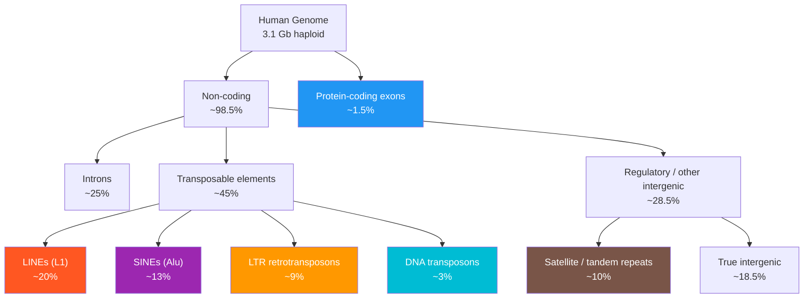

# 🧬 Genome Organization and Structure

> [!abstract] TL;DR
> A genome's physical size (the **C-value**, measured in base pairs) bears no simple relationship to biological complexity — the **C-value paradox** — because most eukaryotic DNA is non-coding: ~50% is repetitive transposable elements, ~25% is introns, and only ~1.5% encodes protein; understanding this architecture, its repeat classes, gene families, and organellar satellites is the foundation of genomics, evolution, and genome-scale medicine.

---

## Intuition — analogy FIRST

Think of the genome as a **massive city library**. A bigger building does not mean more unique books: a cramped university library with 100,000 carefully curated volumes may contain far more knowledge than a warehouse ten times its size packed mostly with reprints of the same pulp novels, blank filler pages, ancient marginalia from defunct readers, and dusty photocopier manuals. The onion on your kitchen counter has a library warehouse five times bigger than yours — not because onions are smarter, but because their collection is glutted with repetitive "books" that have been photocopied millions of times (satellite DNA), old viral pamphlets that got stuck in (retroelements), and enormous chapters of junk inserted between the actual novels (introns). The **C-value paradox** is the observation that genome size and organism complexity are almost entirely uncorrelated, because the *volume* of the building tells you almost nothing about the *content* of the shelves.

---

## How It Works

### Genome Size and the C-value

The **C-value** (also written **1C**) is the total amount of DNA in a haploid nucleus, usually reported in **picograms (pg)** of DNA or converted to base pairs (1 pg ≈ 978 Mb). Representative values:

| Organism | Haploid genome size | Protein-coding genes |
|----------|----------------------|----------------------|
| *E. coli* | 4.6 Mb | ~4,300 |
| *S. cerevisiae* (yeast) | 12 Mb | ~6,000 |
| *D. melanogaster* (fly) | 180 Mb | ~14,000 |
| *A. thaliana* (thale cress) | 135 Mb | ~27,000 |
| *H. sapiens* (human) | 3,100 Mb (3.1 Gb) | ~20,000 |
| *Allium cepa* (onion) | 16,000 Mb | ~not much more than human |
| *Ambystoma tigrinum* (salamander) | ~32,000 Mb | ~similar to human |
| *Paris japonica* (plant) | 149,000 Mb | comparable to other plants |

The **C-value paradox** is this: salamanders carry ~10× more DNA per cell than humans, and the onion genome is ~5× larger than the human genome, yet neither is remotely more complex in morphology or gene count. The genome size variation across eukaryotes spans five orders of magnitude with no correlation to complexity.

**The onion test**: if you claim a biological explanation requires a specific genome size, ask whether it explains why onions need five times more DNA than humans. If it cannot, the explanation is inadequate.

### Gene Number vs Genome Size

| Observation | Implication |
|-------------|-------------|
| Human has ~20,000 protein-coding genes in 3.1 Gb | Mean inter-gene distance ~150 kb |
| Nematode *C. elegans* has ~20,470 genes in 97 Mb | Gene density ~8× higher than human |
| *E. coli* has ~4,300 genes in 4.6 Mb | ~87% of genome is coding |
| Only ~1.5% of the human genome encodes protein | The remaining 98.5% is non-coding |

The increase in eukaryotic genome size over prokaryotes comes almost entirely from: (1) **introns** (~25% of human genome), (2) **interspersed transposable elements** (~45%), (3) **tandem repetitive sequences** (~10%), and (4) large **intergenic regions** that may contain regulatory elements.

### Classification of Repetitive DNA

Repetitive sequences are classified by their arrangement in the genome:

#### 1. Tandem Repeats
Repeated units arranged head-to-tail at specific chromosomal loci.

| Class | Unit size | Copy number | Location | Example |
|-------|-----------|-------------|----------|---------|
| Satellite DNA | 100–300 bp | 10^5–10^7 | Centromeres, heterochromatin | α-satellite (human centromere) |
| Minisatellites | 9–100 bp | 10–1,000 | Telomeres, dispersed | TTAGGG (telomere repeat) |
| Microsatellites (STRs) | 1–6 bp | 5–50 | Throughout genome | (CA)_n, (AT)_n |

Microsatellites are highly polymorphic (alleles differ in repeat number) — this makes them invaluable for **forensic STR profiling** and genetic mapping.

#### 2. Interspersed Repeats (Transposable Elements)

Sequences that have spread through the genome via **transposition** — copying themselves to new locations. They make up ~45% of the human genome.

**Class I — Retrotransposons** (copy via RNA intermediate: "copy-and-paste")

| Element | Size | Human genome fraction | Autonomy | Notes |
|---------|------|-----------------------|----------|-------|
| **LINEs** (Long Interspersed Nuclear Elements) | ~6 kb | **~20%** | Autonomous | L1 encodes own reverse transcriptase; most copies are 5'-truncated and inactive |
| **SINEs** (Short Interspersed Nuclear Elements) | ~300 bp | **~13%** | Non-autonomous | **Alu** elements (~1.1 million copies, derived from 7SL RNA) dominate human SINEs |
| LTR retrotransposons | 5–10 kb | **~9%** | Varies | Endogenous retroviruses (HERVs); long terminal repeats flank internal sequence |

**Class II — DNA Transposons** (move via DNA intermediate: "cut-and-paste")

| Element | Human genome fraction | Status |
|---------|----------------------|--------|
| DNA transposons | **~3%** | Mostly inactive fossils in humans |

> Key distinction: **Alu** elements (~11% of the human genome by some counts) are the most abundant SINE family — ~1.1 million copies averaging ~300 bp each. Their high GC content (~56%) creates CpG islands that can act as promoters. **L1 elements** (~500,000 full-length or truncated copies) are the dominant LINE family and the primary vehicle for SINE mobilisation, because SINEs borrow L1's reverse transcriptase machinery.

### Gene Families

Many human genes exist in **paralogous** copies arising from ancient duplications:

- **Globin family**: α-globin cluster (chr 16) and β-globin cluster (chr 11) evolved by tandem duplication; fetal, embryonic, and adult forms allow oxygen-affinity tuning across development.
- **Olfactory receptor (OR) genes**: ~400 functional genes and ~600 pseudogenes in humans; ~1,000 functional in mice — the largest gene family in mammals, reflecting olfactory importance.
- **Immunoglobulin superfamily**: V, D, and J gene segments are tandemly arrayed in multiple cluster loci; somatic V(D)J recombination generates antibody diversity without germline change.
- **HOX clusters**: four clusters (HOXA–D), each with 9–11 genes encoding transcription factors; arose by two rounds of whole-genome duplication (2R hypothesis) early in vertebrate evolution.

### Pseudogenes

Duplicated sequences that have lost function:

| Type | Origin | Features |
|------|--------|----------|
| **Duplicated pseudogene** | Tandem or segmental duplication of a functional gene | Retains intron structure; inactivated by frameshift or nonsense mutations |
| **Processed pseudogene** | Reverse transcription of mRNA, reinsertion | Lacks introns, lacks promoter (usually silent); has poly-A tail |

Humans have ~15,000 pseudogenes; ~8,000 are processed. Some are not completely "dead" — a few are transcribed and regulate their cognate genes via RNA interference or antisense competition (e.g., *PTENP1*).

### Organellar Genomes

Cells contain DNA in organelles as well as the nucleus:

| Organelle | Genome size | Shape | Inheritance | Notable features |
|-----------|------------|-------|-------------|-----------------|
| Mitochondria (human) | 16,569 bp | Circular | **Strictly maternal** | 37 genes: 13 OXPHOS proteins, 22 tRNAs, 2 rRNAs; no introns; compact |
| Chloroplast (tobacco) | ~155,000 bp | Circular | Maternal (uniparental) | ~130 genes; two inverted repeats flanking single-copy regions |

The **endosymbiont hypothesis** (Margulis, 1967) holds that mitochondria and chloroplasts were free-living bacteria engulfed by a proto-eukaryotic host; most of their original genes have been transferred to the nucleus over evolutionary time (endosymbiotic gene transfer).

### Polyploidy

**Polyploidy** — having more than two complete chromosome sets — is a major driver of genome size increase, especially in plants.

- **Paleopolyploidy in vertebrates**: Two rounds of whole-genome duplication (Ohno's 2R hypothesis, ~550 Mya) in the vertebrate ancestor produced the four paralogous HOX clusters and many other gene quadruplets.
- **Modern polyploidy in plants**: ~35% of flowering plant species are polyploid. *Triticum aestivum* (bread wheat) is **hexaploid** (6n = 42, genome ~17 Gb), carrying three distinct subgenomes (A, B, D) from ancient hybridisation events. Polyploidy creates gene redundancy that permits functional divergence.

### Human Genome Landmarks

The Human Genome Project (Lander et al., 2001; Venter et al., 2001) and subsequent updates established:

- Total size: 3.1 Gb haploid (6.2 Gb per diploid somatic cell)
- Protein-coding genes: ~20,000–25,000 (far fewer than the ~100,000 predicted before sequencing)
- Mean gene size: ~27 kb (including introns); mean coding sequence ~1.3 kb
- Largest gene: *TITIN* (~363 kb CDS; ~2.4 Mb genomic span)
- Densest chromosome for genes: chr 19 (~26 genes/Mb)
- GC content: ~41% overall; varies from ~33% (gene-poor, AT-rich isochores) to ~60% (GC-rich isochores correlated with gene-dense regions)



---

## Key Concepts

### Secondary Level

**What is a genome?** The complete set of genetic instructions in an organism — all DNA in the nucleus plus organellar DNA. It is not just the genes; it includes everything between and around them.

**Haploid vs diploid.** The **C-value** refers to the haploid (1C) content. Human somatic cells are diploid (2C = two copies of each chromosome), so their total DNA is ~6.2 Gb. Sperm and eggs are haploid (1C = 3.1 Gb).

**Coding vs non-coding DNA.** "Coding" strictly means *translated into protein*. Roughly 98.5% of the human genome does not encode protein; this includes introns, regulatory regions, repetitive elements, and structural sequences. "Non-coding" does not mean "non-functional" — regulatory DNA, centromeres, and telomeres are non-coding but essential.

**Why are there introns?** Introns interrupt most eukaryotic genes. They are removed from pre-mRNA by spliceosomes before translation. **Alternative splicing** of introns allows a single gene to encode multiple protein isoforms — a key mechanism for proteome complexity from a relatively small gene count.

**Chromosome structure basics.** Each chromosome is a single, linear, double-stranded DNA molecule packaged with histones into **chromatin**. Heterochromatin (dense, mostly silent) concentrates at centromeres and telomeres; euchromatin (loose, gene-rich) is more transcriptionally active.

### Undergraduate Level

**Cot curves (reassociation kinetics).** Before sequencing, genome complexity was measured by **Cot analysis**: DNA is denatured (separated into single strands), then allowed to reassociate. The rate of reassociation depends on the frequency of each sequence — highly repeated sequences find their complements quickly (low Cot), whereas unique sequences reassociate slowly (high Cot).

- **C₀t** = initial DNA concentration × time (mol·L⁻¹·s)
- **Cot½** = the C₀t value at which half the sequences have reassociated, inversely proportional to repetitive fraction

A typical eukaryotic Cot curve shows three components:
1. **Fast fraction** (low Cot½): highly repetitive satellite DNA (~10–15%)
2. **Intermediate fraction**: moderately repetitive (transposons, gene families, ~40–50%)
3. **Slow fraction** (high Cot½): single-copy (unique) sequences (~40–45%)

**RepeatMasker.** The standard bioinformatics tool for identifying repetitive elements in genome assemblies. It aligns genomic sequences against the **Repbase** library of known repeat families, masks (replaces with 'N') or annotates identified repeats, and reports the fraction of each repeat class. A typical run on a new vertebrate genome outputs a table showing ~45–55% of sequence is repetitive.

**Genome assembly N50.** A quality metric for draft assemblies:
- Sort all assembled **contigs** (or scaffolds) by length (longest first)
- Sum lengths until reaching 50% of the total assembly size
- The length of the last contig added is the **N50**
- Higher N50 = fewer, longer contigs = better assembly continuity

Human genome: short-read (Illumina) assemblies had N50 ~70 kb; long-read (PacBio/ONT) assemblies achieve N50 >100 Mb, finally resolving centromeric satellite arrays that were gaps for 20 years.

**Isochores.** Eukaryotic genomes are not homogeneous in GC content. Long genomic regions (~300 kb) with relatively uniform GC content are called **isochores**. GC-rich isochores (H3: >57% GC) tend to be gene-dense; AT-rich isochores (L1: <37% GC) are gene-poor. Isochore structure correlates with replication timing, chromatin state, and gene expression.

### Graduate Level

**Genome evolution by duplication and divergence.** Susumu Ohno's principle (1970): gene duplication is the primary source of new genetic material. After a duplication event, one copy retains the ancestral function; the other is free to accumulate mutations and potentially evolve a new function (**neofunctionalization**) or divide the original function between both copies (**subfunctionalization**). The **DDC model** (duplication-degeneration-complementation) formalises this. Whole-genome duplications (WGDs) are detectable as blocks of **synteny** (conserved gene order) between duplicated chromosomal segments — e.g., the shared WGD in the ancestor of all angiosperms, or the 2R WGD in vertebrates.

**Transposon regulation: piRNA and KRAB-ZFP.** Uncontrolled transposon jumping causes insertional mutations and chromosomal instability. Two major silencing systems:

1. **piRNA pathway** (germline): Piwi-interacting RNAs (~24–32 nt) are produced from transposon-rich genomic clusters and form a "ping-pong" amplification cycle that degrades transposon transcripts post-transcriptionally. PIWI proteins (MILI, MIWI2 in mice) also direct de novo DNA methylation of transposon loci.

2. **KRAB-ZFP / KAP1 system** (soma and germline): ~350 KRAB zinc-finger proteins in humans each recognise specific transposon families. KRAB-ZFP recruits KAP1 (TRIM28), which nucleates a heterochromatin complex (NuRD, SETDB1 histone methyltransferase, HP1) to silence the locus. This system co-evolves with transposons in an evolutionary arms race: new transposon variants escape existing KRAB-ZFPs, selecting for new ZFP specificities.

**Genome size evolution: the mutational hazard hypothesis.** Lynch and Conery (2003) argued that genome size is primarily determined by the balance between the **deleterious mutational load** of non-coding DNA (insertions increase mutation targets) and **genetic drift** (in small populations, selection is too weak to purge slightly deleterious insertions). This predicts large genomes in organisms with small effective population sizes ($N_e$) — broadly confirmed: unicellular organisms with $N_e > 10^9$ have compact genomes; vertebrates with $N_e \sim 10^4$–$10^6$ carry large ones.

**ENCODE controversy.** The ENCODE project (2012) claimed ~80% of the human genome has "biochemical function" based on ChIP-seq, ATAC-seq, and RNA-seq evidence in diverse cell types. Critics (Graur et al., 2013; Doolittle et al.) argued "biochemical activity" (being transcribed or bound by a protein) is not equivalent to "biological function" (having a fitness consequence if mutated). The debate crystallised distinctions between:
- **Sequence-level function**: evolutionarily conserved, under purifying selection
- **Biochemical activity**: detectable signal in an assay, may be neutral or incidental
- The fraction of the human genome under purifying selection is estimated at **~8–15%** (Rands et al., 2014), far below the 80% ENCODE claim.

---

## Python Demo

```python
# pip install numpy matplotlib
import numpy as np
import matplotlib.pyplot as plt

# Human genome composition fractions (haploid, approximate)
GENOME_SIZE_GB = 3.1  # 1C value in Gb

components = {
    "Coding exons":         0.015,
    "Introns":              0.250,
    "LINEs (L1)":           0.200,
    "SINEs (Alu+others)":   0.130,
    "LTR retrotransposons": 0.090,
    "DNA transposons":      0.030,
    "Satellite / tandem":   0.100,
    "Other intergenic":     0.185,
}

# GC content per compartment (empirically derived)
gc_by_component = {
    "Coding exons":         0.52,
    "Introns":              0.41,
    "LINEs (L1)":           0.38,   # L1 is AT-rich
    "SINEs (Alu+others)":   0.56,   # Alu is GC-rich
    "LTR retrotransposons": 0.44,
    "DNA transposons":      0.42,
    "Satellite / tandem":   0.40,
    "Other intergenic":     0.41,
}

sizes_mb = {k: v * GENOME_SIZE_GB * 1000 for k, v in components.items()}

# Weighted overall GC content
total_size_mb = sum(sizes_mb.values())
overall_gc = sum(sizes_mb[k] * gc_by_component[k] for k in components) / total_size_mb

print(f"Synthetic genome size : {total_size_mb:,.0f} Mb")
print(f"Weighted GC content   : {overall_gc:.1%}")
print()
print(f"{'Component':<28} {'Size (Mb)':>10}  {'GC%':>6}")
print("-" * 50)
for comp in components:
    print(f"{comp:<28} {sizes_mb[comp]:>10.0f}  {gc_by_component[comp]:>5.0%}")

# --- Pie chart of genome composition ---
labels = list(components.keys())
fractions = list(components.values())
colors = ["#2196F3", "#4CAF50", "#FF5722", "#9C27B0",
          "#FF9800", "#00BCD4", "#795548", "#9E9E9E"]
explode = [0.1 if k == "Coding exons" else 0.0 for k in labels]

fig, ax = plt.subplots(figsize=(9, 9))
wedges, texts, autotexts = ax.pie(
    fractions, labels=labels, autopct="%1.1f%%",
    colors=colors, explode=explode, startangle=90,
    pctdistance=0.82, textprops={"fontsize": 10},
)
for at in autotexts:
    at.set_fontsize(9)
ax.set_title(
    f"Human Genome Composition  (~{GENOME_SIZE_GB} Gb haploid)\n"
    f"Overall GC = {overall_gc:.1%}",
    fontsize=13, fontweight="bold",
)
plt.tight_layout()
plt.savefig("genome_composition.png", dpi=150)
plt.show()
print("Chart saved → genome_composition.png")
```

**Sample output:**

```
Synthetic genome size : 3,100 Mb
Weighted GC content   : 43.1%

Component                    Size (Mb)    GC%
--------------------------------------------------
Coding exons                        47    52%
Introns                            775    41%
LINEs (L1)                         620    38%
SINEs (Alu+others)                 403    56%
LTR retrotransposons               279    44%
DNA transposons                     93    42%
Satellite / tandem                 310    40%
Other intergenic                   574    41%
```

---

## Real-World Applications

> **Forensic STR profiling.** The FBI's CODIS system uses 20 microsatellite (STR) loci distributed across the human genome. Because STR alleles differ in the number of tandem repeat units, each person has a near-unique multi-locus genotype. The probability of two unrelated individuals matching all 20 loci is ~$10^{-26}$ — the basis of DNA fingerprinting in criminal investigations and paternity testing.

> **Cancer genomics and copy number variation.** Tumour cells often undergo segmental duplication or deletion of chromosomal regions containing oncogenes or tumour suppressors (e.g., *ERBB2/HER2* amplification in breast cancer, *TP53* deletion in many cancers). Array CGH and whole-genome sequencing detect these **copy number variants (CNVs)** at kilobase resolution; repeat-rich regions of the genome are hotspots for CNV formation via non-allelic homologous recombination between flanking Alu or LINE elements.

> **Genome assembly of large, repeat-rich genomes.** The wheat genome (17 Gb, ~85% repetitive) was not assembled to chromosome level until 2018 because Illumina short reads could not span the large repeat arrays. Only the advent of long-read sequencing (PacBio HiFi) and Hi-C chromatin-conformation data allowed the repeats to be oriented and placed correctly. The axolotl salamander genome (~32 Gb — the largest vertebrate genome ever assembled) was released in 2018, revealing massive LINE expansion as the primary driver of its extraordinary size.

> **Transposon-based mutagenesis screens.** The *Sleeping Beauty* and *PiggyBac* DNA transposons have been reactivated in the laboratory and used as insertional mutagens in mice and human cell lines. Because the insertion site can be mapped by sequencing, these screens identify cancer-driver genes and essential genes at genome scale.

---

## Common Pitfalls

- **Conflating genome size with gene number.** A larger C-value does not imply more genes. The onion (*A. cepa*, 16 Gb) likely has a similar number of unique protein-coding genes to *Arabidopsis* (135 Mb). Genome size mainly reflects repeat content, not coding capacity.
- **Treating all repetitive DNA as junk.** Many repetitive sequences have been domesticated for functional roles: centromeric satellite DNA is essential for kinetochore assembly; Alu elements in introns can be alternatively spliced to create new protein domains; HERV sequences contribute regulatory elements and some encode functional proteins (e.g., syncytins involved in placentation).
- **Confusing 1C and 2C values.** Published genome size databases (Plant DNA C-values; Animal Genome Size Database) report **1C (haploid)** values; somatic cells are diploid (2C) and contain twice as much. Polyploid species complicate this further — hexaploid wheat has a 1C value of ~17 Gb but each gamete carries six haploid genome equivalents.
- **Assuming organellar DNA is negligible.** Mitochondria are present in hundreds to thousands of copies per cell, each with its own ~16.5 kb genome, so the **mitochondrial genome contributes far more reads than expected** in whole-genome sequencing. NGS libraries typically contain 10–50% mitochondrial reads that must be filtered before nuclear genome analysis.
- **Treating pseudogenes as entirely neutral.** Some processed pseudogenes are transcribed and act as **ceRNA (competing endogenous RNA)** sponges, titrating miRNAs away from their functional mRNA targets. Deleting them can have phenotypic consequences — they are not always silent fossils.
- **Misinterpreting RepeatMasker fractions.** RepeatMasker requires an annotated repeat library; it will miss lineage-specific or young repeat families not yet in Repbase. For newly sequenced genomes, de novo repeat identification (RepeatModeler, EDTA) must precede masking.

---

## Related Concepts

- [[_MOC_Genomics_and_Bioinformatics|↑ Genomics and Bioinformatics MOC]]
- [[Biomolecules_Overview]] — DNA as one of the four biomolecule classes; nucleotide chemistry underpins genome structure
- [[DNA_Structure_and_Replication]] — the double-helix and semiconservative replication that genome organisation depends on
- [[DNA_Sequencing_Technologies]] — the sequencing methods (Illumina, PacBio, ONT) required to read and assemble large repeat-rich genomes
- [[Comparative_Genomics_and_Synteny]] — comparing genome organisation across species reveals paleopolyploidy, conserved gene order, and accelerated evolution

---

## Review Questions

1. **Secondary.** The C-value paradox describes the lack of correlation between genome size and organism complexity. Name two reasons why a salamander can have 10× more DNA per cell than a human without having 10× more protein-coding genes.

2. **Undergraduate.** A Cot curve for a new plant genome shows three reassociation components with Cot½ values of 0.001, 0.5, and 500. Estimate the fraction of the genome in each category and describe the likely biological identity of each fraction. How would RepeatMasker and RepeatModeler be used together to characterise the fast-reassociating fraction?

3. **Graduate.** Compare the piRNA pathway and the KRAB-ZFP/KAP1 system as mechanisms of transposon silencing. In what cell types and developmental windows does each operate, and what are the consequences of failure? How does the ENCODE controversy relate to the question of whether transposon-derived sequences should be considered "functional"?

---

## Sources

- Lewin, B. et al. — *Lewin's Genes XII* (2018), Ch. 4 (Genome organisation) and Ch. 10 (Transposable elements)
- Brown, T.A. — *Genomes 4* (2012), Ch. 2 (Genome anatomy) and Ch. 5 (Molecular phylogenetics)
- Lander, E.S. et al. (International Human Genome Sequencing Consortium) — "Initial sequencing and analysis of the human genome," *Nature* 409, 860–921 (2001)
- Venter, J.C. et al. — "The sequence of the human genome," *Science* 291, 1304–1351 (2001)
- Ohno, S. — *Evolution by Gene Duplication* (1970), Springer
- Lynch, M. & Conery, J.S. — "The origins of genome complexity," *Science* 302, 1401–1404 (2003)
- ENCODE Project Consortium — "An integrated encyclopedia of DNA elements in the human genome," *Nature* 489, 57–74 (2012)
- Rands, C.M. et al. — "8.2% of the human genome is constrained," *PLOS Genetics* 10, e1004525 (2014)

---

#Genetics #Genomics #GenomeOrganization #RepetitiveElements
