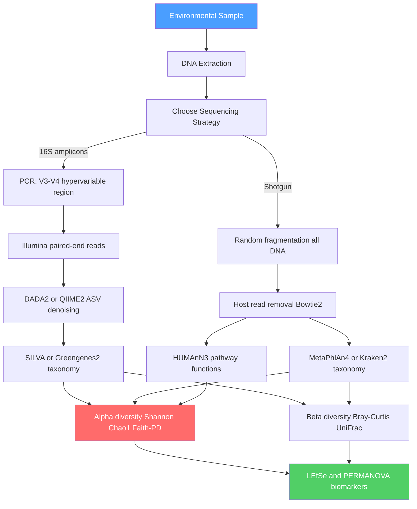

# 🦠 Metagenomics and Microbiome

> [!abstract] TL;DR
> Metagenomics sequences all DNA extracted directly from an environmental or clinical sample — bypassing the need to culture individual organisms — to reveal community composition, functional potential, and host-microbe interactions. Shannon diversity, Bray-Curtis dissimilarity, and UniFrac distances quantify community structure; tools like DADA2, MetaPhlAn4, and HUMAnN3 translate raw reads into taxonomy and metabolic pathways. The human gut microbiome of ~38 trillion cells is now established as a key organ influencing immunity, metabolism, and even neurological disease.

---

## Intuition — analogy FIRST

Imagine a vast library containing thousands of books from dozens of languages, all shredded into individual sentences and mixed together in a pile. Traditional microbiology is like trying to read the library by checking out one book at a time — but most books are glued shut (over 99% of environmental microbes cannot be cultured in a lab). Metagenomics ignores the individual books entirely: it sequences every sentence fragment in the pile simultaneously, then uses computational assembly to reconstruct which books were present, how many copies of each existed, and what stories they told. The "books" are microbial genomes; the "sentences" are sequencing reads; the "reconstruction" is taxonomic and functional profiling.

This analogy holds even for the key challenge: fragments from different books look similar, chimeric PCR artifacts produce nonsense sentences, and books with no entries in your reference catalogue remain unidentified.

---

## How It Works

Metagenomics splits into two main strategies distinguished by what DNA is sequenced:

**16S rRNA amplicon sequencing** targets a single taxonomic marker gene present in all bacteria and archaea, yielding community composition at relatively low cost. **Shotgun metagenomics** fragments and sequences all DNA in the sample, providing both taxonomic and functional information at higher cost and computational demand. Both feed into shared downstream diversity analyses and statistical testing.



---

## Key Concepts / Details

### Secondary Level

**What is the microbiome?** The microbiome is the complete community of microorganisms — bacteria, archaea, viruses, fungi, and protists — inhabiting a specific environment, together with their collective genetic material (the metagenome). The human gut alone harbours ~38 trillion microbial cells, roughly equal to the number of human cells in the body, encoding ~150 times more unique genes than the human genome.

**Why sequence instead of culture?** Classic microbiology grows isolated colonies on agar plates. The problem: over 99% of environmental bacteria and virtually all archaea cannot be cultured with known laboratory media. Metagenomics bypasses this by extracting DNA directly from the bulk sample — soil, seawater, gut biopsy — without any culturing step, revealing the full community including the "microbial dark matter."

**The 16S rRNA gene as a universal barcode.** The gene encoding the 16S ribosomal RNA subunit is found in all bacteria and archaea. It contains conserved regions (useful for universal PCR primers) flanking nine hypervariable regions (V1–V9) whose sequence diverges enough between taxa to serve as a phylogenetic barcode. Sequencing V3–V4 (~460 bp) on an Illumina MiSeq can identify community members to genus or species level.

**Gut microbiome overview.** The healthy adult gut is dominated by four phyla:
- **Bacteroidota** (formerly Bacteroidetes): *Bacteroides*, *Prevotella* — ferment complex polysaccharides
- **Firmicutes**: *Lactobacillus*, *Ruminococcus*, *Clostridium* — major short-chain fatty acid (SCFA) producers
- **Actinobacteria**: *Bifidobacterium* — abundant in breast-fed infants, declines with age
- **Proteobacteria**: *Escherichia*, *Helicobacter* — normally low; bloom in dysbiosis and inflammation

### Undergraduate Level

**16S rRNA amplicon sequencing pipeline in detail.**

The V3–V4 amplicons are sequenced with paired-end Illumina reads (~2×300 bp). Raw reads undergo quality filtering, merging of forward and reverse reads, and chimera removal. Two paradigms exist for grouping:

- **OTUs (Operational Taxonomic Units):** cluster reads at 97% sequence identity (traditional). Fast but discards biological information, masks strain-level variation, and results are not reproducible across studies.
- **ASVs (Amplicon Sequence Variants):** exact biological sequences after error correction (DADA2, Deblur). Higher resolution, reproducible across studies (the same ASV in two independent experiments is the same sequence), and can detect single-nucleotide differences between strains. ASVs are now the community standard.

QIIME2 (Quantitative Insights Into Microbial Ecology 2) is the dominant pipeline: `q2-dada2` plugin performs denoising → feature table → `q2-feature-classifier` (naïve Bayes trained on SILVA 99% OTUs or Greengenes2) assigns taxonomy.

**Shotgun metagenomics pipeline.**

All DNA is sheared to ~150–300 bp fragments and sequenced. Host reads (e.g., human genomic DNA in a gut biopsy) are removed by aligning to the host reference genome with Bowtie2. Two profiling strategies:

- **Kraken2**: assigns reads by k-mer matching against a database of reference genomes using a lowest common ancestor (LCA) algorithm. Extremely fast (~8 Gbp/min) but prone to false positives with low-abundance taxa. Bracken computes abundance from Kraken2 k-mer counts.
- **MetaPhlAn4**: uses ~1 million clade-specific marker genes across ~22,000 microbial species (including MAG-derived genomes) for taxonomic profiling. Slower than Kraken2 but more accurate; the standard for the Human Microbiome Project and large cohort studies.

**HUMAnN3 (HMP Unified Metabolic Analysis Network 3)** takes MetaPhlAn4 species profiles, aligns reads to species-specific pan-genome databases (UniRef90), and generates: (1) gene family abundances (counts per million), (2) pathway abundances from MetaCyc and KEGG, and (3) pathway coverage (fraction of pathway genes detected).

**Alpha diversity — within-sample richness.**

| Metric | Formula | What it captures |
|--------|---------|-----------------|
| Species richness | $S$ = number of observed species | Presence only |
| Shannon index | $H' = -\sum_{i=1}^{S} p_i \ln p_i$ | Richness + evenness |
| Gini-Simpson | $D = 1 - \sum p_i^2$ | Dominance-corrected |
| Chao1 | $\hat{S} = S_{obs} + \frac{F_1^2}{2F_2}$ | Unseen species estimate |
| Faith's PD | Sum of phylogenetic branch lengths spanning all observed taxa | Phylogenetic breadth |

In the Shannon formula, $p_i$ is the relative abundance of species $i$; higher $H'$ means more even distribution of reads across taxa. Chao1 uses $F_1$ (singleton count) and $F_2$ (doubleton count) to extrapolate unseen rare species.

**Beta diversity — between-sample dissimilarity.**

$$\text{Bray-Curtis}(A,B) = 1 - \frac{2 \sum_i \min(a_i, b_i)}{\sum_i a_i + \sum_i b_i}$$

This ranges from 0 (identical communities) to 1 (no shared species). Unweighted UniFrac measures the fraction of unique phylogenetic branch length not shared between samples. Weighted UniFrac additionally incorporates relative abundances, making it sensitive to dominant taxa shifts. Principal Coordinates Analysis (PCoA) on a beta-diversity distance matrix produces the canonical "microbiome ordination plot."

**LEfSe (Linear discriminant analysis Effect Size)** identifies differentially abundant taxa between groups: Kruskal-Wallis test across groups → Wilcoxon pairwise test within subgroups → LDA score for effect size. It is the most cited method for microbiome biomarker discovery despite concerns about multiple testing.

**Host-microbe interactions.**

Gut bacteria ferment dietary fibre into short-chain fatty acids (SCFAs):
- **Butyrate**: primary fuel for colonocytes, anti-inflammatory, inhibits HDAC (epigenetic regulator)
- **Propionate**: transported to liver, gluconeogenic substrate, reduces lipogenesis
- **Acetate**: peripheral fuel, crosses blood-brain barrier

The microbiome shapes host immunity: colonisation by *Clostridia* clusters IV and XIVa induces colonic regulatory T cells (Tregs); segmented filamentous bacteria (SFB) drive Th17 differentiation. **Dysbiosis** — a disruption in microbiome composition or function — is associated with inflammatory bowel disease (IBD), obesity, type 2 diabetes, and colorectal cancer.

The **Human Microbiome Project (HMP)** Phase 1 (2012) characterised the healthy microbiome across 18 body sites in 242 healthy adults, establishing reference ranges and showing that body site is a stronger predictor of community composition than host identity. HMP Phase 2 (iHMP, 2019) tracked longitudinal changes in pregnancy, IBD, and pre-diabetes.

### Graduate Level

**Metagenome-assembled genomes (MAGs).** Shotgun reads are assembled into contigs (MEGAHIT, metaSPAdes), then binned into draft genomes by co-abundance across samples and tetranucleotide frequency (MetaBAT2, CONCOCT). CheckM2 estimates completeness and contamination using conserved single-copy marker genes. Quality tiers: medium-quality MAG = completeness >70%, contamination <10%; high-quality = >90%/<5%. With sufficient depth (~20 Gbp per gut sample), ~80–90% of gut species can be recovered as MAGs, dramatically expanding the Genome Taxonomy Database (GTDB).

**Strain-level resolution.** Species-level profiling misses clinically critical differences. StrainPhlAn4 (MetaPhlAn ecosystem) uses clade-specific marker genes to track strain-level evolution across longitudinal samples. inStrain computes pairwise nucleotide diversity, linkage disequilibrium, and gene-level selection within MAGs. This resolves, for instance, commensal E. coli from enterohaemorrhagic O157:H7 that standard genus-level profiling cannot distinguish.

**Resistome analysis.** The resistome is the collection of all antibiotic resistance genes (ARGs) in a metagenome. ARGs are profiled by aligning reads to the Comprehensive Antibiotic Resistance Database (CARD) or ResFinder. Mobile genetic elements (plasmids, transposons, integrons) are co-identified because they mediate horizontal transfer of ARGs between species — a One Health concern spanning gut, agriculture, and hospital environments. GROOT uses a variation graph approach to detect ARG variants at single-nucleotide resolution.

**Phage-bacteria co-evolution.** Bacteriophages are the most abundant biological entities in the gut (~$3.8 \times 10^{12}$ per gram of faeces). The gut virome is dominated by the *crAss-phage* clade (infects *Bacteroides*) and tailed *Caudovirales*. Bacteria record past phage encounters as CRISPR spacers, enabling retrospective reconstruction of phage predation history. Arms-race dynamics drive rapid turnover: phage tail-fibre proteins evolve to overcome bacterial receptor mutations, and bacteria shed surface receptors to block phage entry — traceable via evolutionary analysis of CRISPR arrays across longitudinal samples.

**Ecological null models.** Community assembly can be deterministic (environmental filtering, competitive exclusion) or stochastic (random birth-death events, dispersal limitation). The beta nearest taxon index ($\beta$NTI) compares observed phylogenetic turnover to a null distribution of randomised communities: $\beta\text{NTI} > +2$ indicates variable selection; $< -2$ indicates homogenising dispersal; within $\pm 2$ indicates stochastic drift (ecological drift). Combined with the Raup-Crick metric based on Bray-Curtis (RCbray), researchers can partition what fraction of microbiome variation in a cohort is deterministic versus stochastic — critical for understanding whether disease-associated dysbiosis is reproducibly caused or merely correlates.

**Virome and mycobiome.** The human gut virome — profiled by VirSorter2 or VIBRANT after assembling virus-enriched (VLP) fractions — reveals eukaryotic RNA viruses, crAss-phages, and proviral elements integrated into bacterial genomes. The mycobiome (fungal component) is profiled with ITS1/ITS2 amplicons and dominated by *Candida*, *Malassezia*, and *Saccharomyces*; fungi comprise <0.1% of gut microbiota by count but can drive outsized immunological effects (*Candida* bloom in antibiotic-treated patients triggers Th17 responses).

**Multi-omics integration.** Metagenomics alone reveals potential (gene presence); metatranscriptomics (RNA-seq on environmental RNA) reveals gene expression; metaproteomics and metabolomics reveal biochemical output. Integrating these layers — the microbiome-metabolome axis — uses tools like Maaslin2 (multivariable linear models for microbiome-metadata associations) and sparse canonical correlation analysis (sCCA). The gut metabolome contains thousands of microbiome-derived compounds including secondary bile acids, tryptophan metabolites, and urolithins that circulate systemically and influence host physiology.

---

## Python Demo

```python
# pip install numpy matplotlib
import numpy as np
import matplotlib.pyplot as plt

rng = np.random.default_rng(42)


def generate_community(n_species: int, sigma: float = 1.0, n_reads: int = 10000) -> np.ndarray:
    """
    Simulate a microbial community using a log-normal abundance model.
    Low sigma -> even community (high diversity).
    High sigma -> few dominant taxa (low diversity, dysbiosis-like).
    """
    log_abundances = rng.normal(0.0, sigma, size=n_species)
    abundances = np.exp(log_abundances)
    probs = abundances / abundances.sum()
    return rng.multinomial(n_reads, probs)


def shannon_index(counts: np.ndarray) -> float:
    """H' = -sum(p_i * ln(p_i)) over taxa with counts > 0."""
    total = counts.sum()
    if total == 0:
        return 0.0
    p = counts[counts > 0] / total
    return float(-np.sum(p * np.log(p)))


def gini_simpson(counts: np.ndarray) -> float:
    """D = 1 - sum(p_i^2); probability two random reads are from different species."""
    total = counts.sum()
    if total == 0:
        return 0.0
    p = counts / total
    return float(1.0 - np.sum(p**2))


def chao1(counts: np.ndarray) -> float:
    """Chao1 = S_obs + F1^2 / (2 * F2), where F1=singletons, F2=doubletons."""
    s_obs = int((counts > 0).sum())
    f1 = int((counts == 1).sum())
    f2 = int((counts == 2).sum())
    if f2 == 0:
        return float(s_obs + f1 * (f1 - 1) / 2)  # bias-corrected form
    return float(s_obs + f1**2 / (2 * f2))


def rarefaction_curve(counts: np.ndarray, n_steps: int = 25) -> tuple:
    """
    Subsample reads at increasing depths without replacement.
    Rarefaction normalises for unequal sequencing depth across samples.
    """
    total = int(counts.sum())
    depths = np.linspace(200, total, n_steps, dtype=int)
    species_pool = np.repeat(np.arange(len(counts)), counts)
    richness = []
    for d in depths:
        subsample = rng.choice(species_pool, size=d, replace=False)
        richness.append(int(np.unique(subsample).size))
    return depths, np.array(richness)


# Three communities mimicking real microbiome scenarios
communities = {
    "Healthy gut (even)":     generate_community(n_species=150, sigma=0.6),
    "Dysbiotic gut (uneven)": generate_community(n_species=150, sigma=2.4),
    "Soil metagenome (rich)": generate_community(n_species=500, sigma=1.1),
}

# Print diversity metrics table
print(f"{'Sample':<28} {'Shannon H':>10} {'Gini-Simpson':>13} {'Chao1':>8} {'Richness':>9}")
print("-" * 72)
for name, counts in communities.items():
    h   = shannon_index(counts)
    d   = gini_simpson(counts)
    c1  = chao1(counts)
    s   = int((counts > 0).sum())
    print(f"{name:<28} {h:>10.4f} {d:>13.4f} {c1:>8.1f} {s:>9}")

# Rarefaction curves
fig, ax = plt.subplots(figsize=(9, 5))
colors = ["#2196F3", "#F44336", "#4CAF50"]
for (name, counts), color in zip(communities.items(), colors):
    depths, richness = rarefaction_curve(counts)
    ax.plot(depths, richness, marker="o", markersize=4, label=name, color=color)

ax.set_xlabel("Sequencing depth (reads)")
ax.set_ylabel("Observed species richness")
ax.set_title("Rarefaction Curves — Simulated Metagenomic Communities")
ax.legend()
plt.tight_layout()
plt.savefig("rarefaction_curves.png", dpi=150)
plt.show()
print("Saved: rarefaction_curves.png")
```

**Expected output (approximate):**
```
Sample                       Shannon H  Gini-Simpson    Chao1  Richness
------------------------------------------------------------------------
Healthy gut (even)              4.5821        0.9895   148.0       143
Dysbiotic gut (uneven)          2.1034        0.7820   112.5        98
Soil metagenome (rich)          5.3210        0.9972   490.0       471
```

The dysbiotic gut shows dramatically lower Shannon diversity despite the same number of species in the pool — a direct consequence of a few taxa dominating the community, as seen in antibiotic-treated patients or Clostridioides difficile infection.

---

## Real-World Applications

**Fecal microbiota transplant (FMT) for C. difficile.** Recurrent *Clostridioides difficile* infection (rCDI) is driven by antibiotic-induced loss of colonisation resistance — the microbiome barrier that prevents *C. diff* spore germination. FMT restores donor diversity in >90% of rCDI cases, far exceeding vancomycin success rates. Metagenomic profiling identifies which donor taxa (particularly *Lachnospiraceae*, *Ruminococcaceae*) are transferred and persist. FDA approved Rebyota (LBP-101) in 2022, the first microbiome therapeutic.

**Gut-brain axis and mental health.** The vagus nerve, HPA axis, and microbiome-derived neuroactive compounds (GABA, serotonin precursors, tryptophan metabolites) link gut dysbiosis to depression, anxiety, and autism spectrum disorder. Germ-free mouse models show exaggerated stress responses reversed by mono-colonisation with *Lactobacillus rhamnosus*. Metagenomic cohort studies (n > 2,000) have found *Coprococcus* depletion and *Dialister* depletion consistently associated with depression scores, independent of antidepressant use.

**Probiotic and synbiotic design.** Metagenomic-guided probiotic development goes beyond off-the-shelf Lactobacillus strains. Precision synbiotics pair specific microbial strains (e.g., *Akkermansia muciniphila* for metabolic syndrome) with their preferred dietary substrates (prebiotic fibres). Metagenomics validates engraftment, persistence, and downstream metabolome changes (SCFA increases, secondary bile acid shifts).

**Antibiotic resistance surveillance (One Health).** The global resistome is tracked by the Global Sewage Surveillance Project: metagenomic sequencing of untreated wastewater from 74 countries identified carbapenem-resistance genes (NDM, OXA-48) years before clinical outbreaks emerged. Hospital ICU microbiome surveillance using shotgun metagenomics detects plasmid transmission chains of multidrug-resistant organisms faster than culture-based methods.

**Ancient microbiome reconstruction.** Dental calculus (calcified dental plaque) preserves microbial DNA for up to 750,000 years. aDNA authentication (cytosine deamination patterns, short fragment lengths, post-mortem damage with mapDamage2) enables reconstruction of Neanderthal oral microbiomes and tracing of bacterial evolution through prehistoric dietary transitions. Coprolites from Ötzi the Iceman revealed a *Helicobacter pylori* strain ancestral to modern European strains, informing the human migration history.

---

## Common Pitfalls

- **DNA extraction bias** — Different lysis protocols (bead beating intensity, enzymatic pre-treatment) lyse gram-positive bacteria, gram-negative bacteria, and fungi with very different efficiencies. The same sample extracted with two protocols can produce quantitatively different community profiles. Always report and standardise extraction protocol; use ZymoBIOMICS mock community controls.

- **Chimeric sequences in 16S amplicons** — PCR can join partial reads from two different templates, creating hybrid sequences that do not correspond to any real organism. DADA2's error-correction model and UCHIME chimera checking remove most chimeras, but over-cycling (>35 PCR cycles) dramatically increases chimera rate. Use minimal cycle numbers and low DNA inputs.

- **Reference database incompleteness** — Over 50% of gut microbial diversity lacks a cultured reference; novel taxa are assigned to "Unknown" or misassigned to the nearest relative. This biases community comparisons when studies use different database versions (SILVA 138 vs. 132 can yield different genus assignments for the same sequence). Always report database version and ensure version-matched comparisons.

- **Rarefaction vs. compositional normalisation** — Rarefying to equal depth (subsampling all samples to the minimum read count) discards data and introduces variance. Compositional approaches (CLR transformation, ALDEx2, ANCOM-BC) treat microbiome data as compositional (simplex-constrained) and avoid rarefaction. Both have trade-offs; the field has not converged, and reported effect sizes can differ by method.

- **Confounding variables** — Antibiotic exposure history, diet, BMI, stool consistency (Bristol stool scale), age, and sequencing batch all drive beta diversity more strongly than most clinical variables. Ignoring these in PERMANOVA or LEfSe analyses produces spurious biomarkers. Use paired designs, blocked permutations in PERMANOVA, and include covariates in Maaslin2 models.

- **Strain-level over-interpretation** — 16S rRNA amplicons cannot reliably distinguish strains or even many closely related species (e.g., *E. coli* vs. *Shigella* share >99% 16S identity). Shotgun metagenomics or culture-independent targeted sequencing is required for clinically actionable strain-level conclusions.

---

## Related Concepts

- [[_MOC_Genomics_and_Bioinformatics|↑ Genomics and Bioinformatics MOC]]
- [[Information_Theory]] — Shannon entropy $H' = -\sum p_i \ln p_i$ is directly the Shannon diversity index; the cross-entropy and KL divergence analogies apply to comparing microbial distributions between conditions
- [[Bayesian_Statistics]] — Bayesian Dirichlet-multinomial models are used in DADA2's error model, LEfSe's LDA prior, and in compositional data analysis (ALDEx2 uses a Monte Carlo Dirichlet prior for zero-handling)
- [[DNA_Sequencing_Technologies]] — Illumina MiSeq/NovaSeq (16S and shotgun), Oxford Nanopore (long-read metagenomics for strain resolution and structural variant detection), PacBio HiFi (high-accuracy long reads for MAG assembly)
- [[Bioinformatics_Algorithms_and_Sequence_Analysis]] — Sequence alignment (Bowtie2 for host removal), k-mer databases (Kraken2), de Bruijn graph assembly (MEGAHIT, metaSPAdes), hidden Markov models (HMMER for marker gene detection in MAGs)

---

## Review Questions

1. **(Secondary)** A researcher swabs soil from a contaminated industrial site and an adjacent pristine meadow. They perform 16S rRNA sequencing and find the contaminated site has lower Shannon diversity. Does lower alpha diversity necessarily mean fewer species are present? What else could explain the difference?

2. **(Undergraduate)** You have shotgun metagenomic data from 50 IBD patients and 50 healthy controls. Describe, step by step, how you would use MetaPhlAn4, HUMAnN3, and LEfSe to identify microbial species and metabolic pathways associated with IBD. What statistical test would you use to assess whether the overall community composition differs between groups, and why does PERMANOVA require permutation-based $p$-values rather than parametric ones?

3. **(Graduate)** A clinical trial tests a precision synbiotic in patients with metabolic syndrome. Baseline and post-intervention metagenomic samples show increased *Akkermansia muciniphila* abundance in the treatment arm. A reviewer asks: (a) How would you rule out that the apparent increase is due to reference database bias from new MAGs added between sequencing runs? (b) How would you use $\beta$NTI null models to determine whether the synbiotic is acting through deterministic selection versus stochastic drift? (c) What complementary -omics measurement would confirm that the taxonomic change translates to altered host metabolism?

---

## Sources

- [Knight et al. (2018) Best practices for analysing microbiomes — *Nature Reviews Microbiology*](https://doi.org/10.1038/s41579-018-0029-9)
- [Human Microbiome Project Consortium (2012) Structure, function and diversity of the healthy human microbiome — *Nature*](https://doi.org/10.1038/nature11234)
- [Segata et al. (2012) Metagenomic microbial community profiling using unique clade-specific marker genes — *Nature Methods*](https://doi.org/10.1038/nmeth.2066)
- [Callahan et al. (2016) DADA2: High-resolution sample inference from Illumina amplicon data — *Nature Methods*](https://doi.org/10.1038/nmeth.3869)
- [Bolyen et al. (2019) Reproducible, interactive, scalable and extensible microbiome data science using QIIME 2 — *Nature Biotechnology*](https://doi.org/10.1038/s41587-019-0209-9)
- [Beghini et al. (2021) Integrating taxonomic, functional, and strain-level profiling of diverse microbial communities with bioBakery 3 — *eLife*](https://doi.org/10.7554/eLife.65088)
- [Wood et al. (2019) Improved metagenomic analysis with Kraken 2 — *Genome Biology*](https://doi.org/10.1186/s13059-019-1891-0)

---

#Genetics #Genomics #Metagenomics #Microbiome
