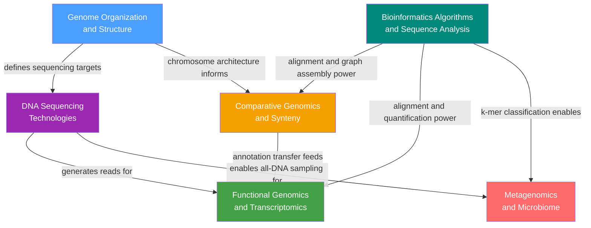

# Genomics and Bioinformatics — Section MOC

> [!abstract]
> Genomics and bioinformatics translate the molecular genetic knowledge of DNA chemistry into whole-genome analysis at scale — beginning with how genomes are physically organised and sequenced, extending through the computational algorithms that align, assemble, and annotate sequences, and culminating in comparative and functional interrogation of genome activity across species, cell types, and entire microbial ecosystems. Together these disciplines convert raw nucleotide strings into biological meaning: identifying genes under selection, cataloguing transcriptional states, and mapping the microbial communities that shape human health.

> [!info] How to use this map
> Start with **Fundamentals**, follow the arrows, and use the Learning Paths below as your guide.
> Each node links to a full note. Come back to this map when you feel lost.

---

## Concept Map

*(Blue = structural foundation, Purple = technology layer, Teal = computational foundation, Orange/Green = integrative analyses, Red = advanced application; arrows = "leads to" or "enables")*

---

## Learning Paths

### Experimental Path
*For wet-lab biologists moving toward genome-scale analysis:*

1. [[Genome_Organization_and_Structure]] — understand what a genome is and why most of it is non-coding before you try to sequence it
2. [[DNA_Sequencing_Technologies]] — learn how Sanger, Illumina, PacBio, and Nanopore differ in read length, accuracy, and cost, and which pipeline step each feeds
3. [[Functional_Genomics_and_Transcriptomics]] — apply sequencing to RNA-seq, ChIP-seq, and ATAC-seq to measure which genome elements are active in your cells
4. [[Metagenomics_and_Microbiome]] — extend sequencing to unculturable whole-community DNA, community diversity metrics, and host-microbe interactions

### Computational Path
*For computer scientists entering bioinformatics:*

1. [[Bioinformatics_Algorithms_and_Sequence_Analysis]] — master the algorithmic foundations — dynamic programming alignment, BLAST heuristics, de Bruijn graph assembly, and BWT indexing — that underpin every downstream tool
2. [[Comparative_Genomics_and_Synteny]] — apply pairwise alignment at chromosomal scale to detect syntenic blocks, classify orthologs and paralogs, and quantify selection with Ka/Ks
3. [[Functional_Genomics_and_Transcriptomics]] — bridge sequence analysis with expression quantification, normalisation statistics, and multi-omics integration

---

## All Notes in This Section

| Note | Core Technology / Method | Data Type | Level |
|------|--------------------------|-----------|-------|
| [[Genome_Organization_and_Structure]] | C-value analysis, RepeatMasker, Cot reassociation | Genomic DNA composition | Foundational |
| [[DNA_Sequencing_Technologies]] | Sanger, Illumina SBS, PacBio SMRT, Oxford Nanopore | FASTQ reads, quality scores | Beginner |
| [[Bioinformatics_Algorithms_and_Sequence_Analysis]] | NW / SW dynamic programming, BLAST, BWT/FM-index, de Bruijn graphs | Raw sequences, FASTQ | Intermediate |
| [[Comparative_Genomics_and_Synteny]] | BLAST BBH, Ka/Ks (Jukes-Cantor), DAGchainer synteny detection | Multi-genome pairwise alignments | Intermediate |
| [[Functional_Genomics_and_Transcriptomics]] | RNA-seq, ChIP-seq, ATAC-seq, DESeq2, scRNA-seq | RNA count matrices, ChIP/ATAC signal | Intermediate |
| [[Metagenomics_and_Microbiome]] | 16S rRNA amplicons, shotgun metagenomics, MAG assembly | Environmental DNA, diversity indices | Advanced |

---

## Key Questions This Section Answers

- Why do genomes vary so dramatically in size across organisms without corresponding variation in gene count (the C-value paradox), and what elements fill the extra space?
- How do Illumina short reads, PacBio HiFi long reads, and Oxford Nanopore ultra-long reads each complement one another for assembling repeat-rich and structurally complex genomes?
- What algorithmic principles — dynamic programming, BWT indexing, de Bruijn graphs — make it computationally feasible to align billions of reads or search trillion-base databases in seconds?
- How does Ka/Ks ratio distinguish genes under purifying selection from those undergoing adaptive evolution, and what does synteny reveal about ancient whole-genome duplications?
- How does RNA-seq coupled with DESeq2 produce a statistically rigorous list of differentially expressed genes, and what do ChIP-seq and ATAC-seq add that RNA-seq alone cannot tell us?
- How does metagenomics bypass the cultivation barrier to characterise entire microbial communities, and what diversity metrics and bioinformatic tools translate raw environmental reads into taxonomic and functional profiles?

---

## Connections to Other Topics

- [[_MOC_Genetics_Master]] — parent vault map; this section provides the genome-scale empirical and computational layer that contextualises all other Genetics sections
- S01 Molecular Mechanisms — the DNA replication, transcription, and epigenetic regulation notes in Section 01 describe the molecular machinery whose genome-wide outputs are measured by RNA-seq, ChIP-seq, and ATAC-seq in this section
- S05 Human Genome Variation — GWAS, SNP arrays, and population-level structural variation analysis in Section 05 depend directly on the sequencing technologies and bioinformatics alignment pipelines covered here
- S06 Comparative and Evolutionary Genomics — the molecular clock, phylogenetic tree building, and ancestral genome reconstruction methods in Section 06 build on the Ka/Ks rationale and synteny detection frameworks introduced in Comparative Genomics and Synteny

---

#MOC #Genetics #Genomics #Bioinformatics #SectionMOC
