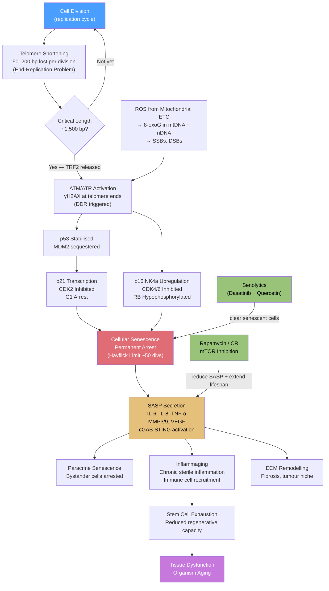

# Aging and Genome Instability

> [!abstract] TL;DR
> Aging is the progressive, genome-driven deterioration of cellular homeostasis: telomeres shorten with every division until the DNA damage response forces permanent arrest (senescence), ROS erode mitochondrial DNA, and somatic mutations accumulate into clonal landscapes that shift tissues toward dysfunction and cancer. The López-Otín hallmarks framework (9 in 2013; expanded to 12 in 2023) organises these processes into primary insults, compensatory responses, and integrative phenotypes — and identifies the longevity pathways (mTOR, FOXO, sirtuins) and therapeutic strategies (senolytics, caloric restriction) that can retard the cascade.

---

## Intuition — analogy FIRST

Imagine a library that makes imperfect photocopies of its books each time a reader requests one. Every copy loses a word or two at the top and bottom of each page (the margins, like telomeres) and picks up random smudges in the text (somatic mutations from ROS and replication errors). After fifty rounds of copying, the margins are gone entirely, the photocopier jams and refuses to make any more copies of that document (replicative senescence), and the jammed machine starts leaking toner fumes that damage nearby documents (SASP). Meanwhile, the generator powering the photocopiers slowly rusts (mitochondrial dysfunction), cutting power to everything.

The library does not collapse instantly — it was designed with error-correction (repair pathways), redundant copies (diploid genome), and a backup generator (stem cells). But each backup degrades at its own rate, and the cumulative entropy of the whole system defines **biological age** — which can run faster or slower than the clock on the wall, as the Horvath epigenetic clock quantifies.

---

## How It Works

### The Hallmarks Framework

López-Otín et al. proposed a unified framework for understanding aging through defined molecular and cellular hallmarks. The 2013 *Cell* paper identified nine hallmarks; the 2023 *Cell* update expanded the list to twelve by adding **disabled macroautophagy**, **chronic inflammation**, and **dysbiosis** as distinct drivers.

The twelve hallmarks are classified into three tiers:

**Primary hallmarks (the root causes — always deleterious):**
1. Genomic instability — accumulation of DNA damage and somatic mutations
2. Telomere attrition — progressive shortening of chromosomal ends
3. Epigenetic alterations — loss of histone marks, drifting DNA methylation, derepression of transposable elements
4. Loss of proteostasis — aggregation and misfolding of proteins (amyloid, tau, alpha-synuclein)
5. Disabled macroautophagy (new 2023) — failure of lysosomal cargo clearance

**Antagonistic hallmarks (adaptive responses that become harmful when chronic):**
6. Deregulated nutrient-sensing — hyperactivation of mTORC1, reduced AMPK, blunted insulin sensitivity
7. Mitochondrial dysfunction — reduced membrane potential, increased ROS output, mtDNA mutations
8. Cellular senescence — permanent cell cycle arrest with SASP secretion

**Integrative hallmarks (emerge from the upstream damage, directly drive organ failure):**
9. Stem cell exhaustion — reduced regenerative capacity in all renewal tissues
10. Altered intercellular communication — endocrine/paracrine dysfunction, inflammaging
11. Chronic inflammation (new 2023) — sterile, low-grade "inflammaging" driven by SASP and innate immune activation
12. Dysbiosis (new 2023) — gut microbiome compositional shift with age, contributing to systemic inflammation

This note focuses on the **genomic and epigenetic hallmarks** — telomere attrition, genomic instability, and epigenetic alterations — and the downstream senescence cascade.

---

### Telomere Biology and the Hayflick Limit

**Structure of telomeres.** Human telomeres consist of TTAGGG hexanucleotide repeats (5–15 kb in newborns) capped by the **shelterin** protein complex: TRF1, TRF2, POT1, TIN2, RAP1, and TPP1. Shelterin performs two jobs: (1) it recruits telomerase in stem/germ cells; (2) it forms a **T-loop** structure in which the 3′ single-stranded G-overhang invades upstream double-stranded repeat sequence, hiding the chromosome end from the DNA damage surveillance machinery.

**The end-replication problem.** DNA polymerase requires an RNA primer and synthesises only 5′→3′. On the lagging strand template, the RNA primer at the very 3′ end cannot be replaced by DNA after its removal, leaving a 50–200 bp gap per division. Result: each mitotic cycle erodes telomeres by ~50–200 bp.

**Hayflick limit.** In 1961, Leonard Hayflick showed that human fetal lung fibroblasts (WI-38 strain) would divide approximately **50 times** in culture and then permanently cease proliferation. This ceiling — ~50 population doublings — is set by the average telomere erosion rate relative to the critical minimum length (~1,500 bp). Once the shortest telomere in a cell falls below this threshold, the T-loop cannot form, TRF2 dissociates, and the exposed chromosome end is recognised as a double-strand break (DSB).

**Telomerase.** The reverse transcriptase **TERT** (Telomerase Reverse Transcriptase) paired with the RNA template component **TR/TERC** can add TTAGGG repeats back onto the 3′ overhang, preventing net shortening. Telomerase is active in: germline, embryonic stem cells, adult stem cells (HSCs, basal epithelium), and most cancers (>85%). Somatic cells, post-differentiation, silence TERT transcriptionally — the price paid for the tumour-suppressive Hayflick limit.

---

### From Shortened Telomere to Senescence

When TRF2 is lost from a critically short telomere, the exposed end recruits the **MRN complex (MRE11-RAD50-NBS1)** and activates **ATM** exactly as it would at an internal DSB. The ensuing DNA Damage Response (DDR) diverges into two parallel but reinforcing arrest circuits:

**Arm 1 — p53-p21 axis (senescence initiation):**
1. ATM phosphorylates CHK2, which phosphorylates and stabilises p53 (Ser15, Ser20 block MDM2 binding).
2. p53 transcriptionally activates **p21** (CDKN1A), a CDK2 inhibitor.
3. CDK2 inhibition prevents phosphorylation of Retinoblastoma protein (RB) → RB remains active → E2F transcription factors are sequestered → S-phase entry blocked.
4. The cell arrests at the G1/S checkpoint. This arm is rapid (~48 h) but reversible if p53 is removed.

**Arm 2 — p16INK4a-RB axis (senescence maintenance):**
1. Sustained DDR signalling (and oncogene activation) induces **p16INK4a** (CDKN2A), a CDK4/6 inhibitor.
2. CDK4/6 inhibition independently locks RB in its active, hypophosphorylated state.
3. p16 levels rise progressively and remain high even after p53 levels subside, creating an **irreversible** growth arrest.

**Replicative senescence vs. stress-induced premature senescence (SIPS):** Replicative senescence is purely telomere-driven and occurs after ~50 divisions. SIPS can be triggered at any division number by acute oncogene activation (OIS — oncogene-induced senescence, e.g., RAS^G12V), oxidative damage, chemotherapy, or radiotherapy. Both converge on p53/p21 and p16/RB.

---

### SASP — The Inflammatory Arm of Senescence

A senescent cell is not simply quiescent; it adopts a pro-inflammatory secretory programme termed the **Senescence-Associated Secretory Phenotype (SASP)**. The SASP is driven by:

- **NF-κB**: activated by cytoplasmic DNA fragments sensed by the **cGAS-STING pathway** (mitochondrial DNA leakage, cytoplasmic chromatin fragments called CCFs).
- **C/EBPβ**: cooperates with NF-κB on SASP gene promoters.
- **mTOR**: promotes SASP translation via 4E-BP1 phosphorylation.

**Major SASP components:**

| Category | Key factors | Downstream effect |
|---|---|---|
| Pro-inflammatory cytokines | IL-6, IL-8, TNF-α, IL-1α | Paracrine senescence, immune recruitment |
| Matrix metalloproteinases | MMP3, MMP9, MMP1 | ECM degradation, tumour invasion |
| Growth factors | VEGF, HGF, IGFBP3 | Angiogenesis, proliferation of nearby cells |
| Coagulation factors | PAI-1 | Thrombosis risk |
| Immune modulators | CXCL1, CXCL2, CCL2 | Macrophage/neutrophil recruitment |

**Dual role of SASP.** Acutely, SASP is beneficial: it recruits NK cells and macrophages to clear senescent cells (immune surveillance), promotes wound healing, and limits cancer by inducing growth arrest in neighbouring cells. Chronically (when clearance fails with age), persisting senescent cells poison the tissue microenvironment, promote tumourigenesis, drive fibrosis, and impair regeneration.

---

### Reactive Oxygen Species and Mitochondrial DNA Damage

**ROS generation.** Mitochondrial Complex I (NADH-ubiquinone oxidoreductase) and Complex III (ubiquinol-cytochrome c reductase) are the principal sources of superoxide radicals (O₂•⁻) as electrons leak from the electron transport chain (ETC). The superoxide is dismuted by **SOD2** (Mn-SOD, mitochondrial matrix) to hydrogen peroxide (H₂O₂), which is further reduced by glutathione peroxidase or catalase to water. However, H₂O₂ reacts with Fe²⁺ via the **Fenton reaction** (H₂O₂ + Fe²⁺ → OH• + OH⁻ + Fe³⁺) to generate the highly reactive hydroxyl radical (OH•), the major oxidative DNA-damaging species.

**Why mitochondrial DNA is more vulnerable.** MtDNA (16,569 bp circular genome; 37 genes: 13 OXPHOS subunit mRNAs, 22 tRNAs, 2 rRNAs) accumulates mutations 10–17× faster than nuclear DNA for several reasons:
1. Physical proximity to the ETC — the highest ROS concentration in the cell.
2. Lack of protective histones; mtDNA is packaged by TFAM but with far less compaction.
3. Limited repair repertoire — BER (OGG1, UNG) is present in mitochondria, but NER, MMR, and DSB repair pathways are absent.
4. Semi-autonomous replication with less proofreading than nuclear Pol δ/ε.

**Heteroplasmy and threshold effect.** A single mitochondrion contains 2–10 copies of mtDNA; a cell contains 100–2,000 mitochondria. Somatic mtDNA mutations create a mixture of wild-type and mutant genomes within the same cell — **heteroplasmy**. When the proportion of mutant mtDNA exceeds a tissue-specific threshold (~60–80%), OXPHOS capacity collapses, ATP production falls, and the cell experiences bioenergetic crisis. Skeletal muscle fibres, cardiomyocytes, and neurons — all post-mitotic, unable to dilute mutant genomes through cell division — are especially vulnerable.

---

### Epigenetic Clocks and Biological Age

**DNA methylation drift.** The human epigenome accumulates systematic changes in CpG methylation throughout life: some CpG sites show progressive **hypermethylation** (many are Polycomb-regulated loci and tumour suppressor promoters), others show progressive **hypomethylation** (repetitive elements — LINE-1, Alu — creating genomic instability as silenced transposons reactivate). These changes are not random; they follow predictable, tissue-specific trajectories that can be read as a biological clock.

**The Horvath clock (2013).** Steve Horvath trained an elastic net regression model on 8,000 DNA methylation samples from 82 Illumina EPIC/450K array datasets spanning 51 tissues and cell types, identifying **353 CpG sites** whose β-values (methylation fraction, 0–1) collectively predict chronological age with a median absolute error of ~3.6 years across tissues. The model's key innovation is tissue universality: the same 353 CpGs work for brain, blood, liver, saliva, and most other tissues without modification.

**Epigenetic age acceleration.** The difference (DNAm age − chronological age) is **age acceleration**:
- **Positive** (DNAm age > calendar age) → biologically older; associated with higher all-cause mortality, frailty, and disease risk.
- **Negative** → biologically younger; associated with longevity and healthy aging.

Factors that accelerate the Horvath clock: smoking, obesity, HIV infection, Werner syndrome, Down syndrome. Factors that decelerate it: caloric restriction, exercise, DNMT3A/TET2 wild-type status, centenarian genetic background.

**Second-generation clocks.** The Horvath 2013 clock predicts age but not health. Second-generation clocks were trained on health-related outcomes:
- **PhenoAge** (Levine 2018): 513 CpGs + 9 clinical biomarkers; predicts biological age as a composite of mortality risk.
- **GrimAge** (Lu 2019): 1,030 CpGs; trained on DNAm surrogates of plasma proteins (GDF15, PAI-1); the strongest predictor of time-to-death from natural causes.
- **DunedinPACE** (Belsky 2022): trained on longitudinal data in the same individuals; measures the rate of biological aging per calendar year.

---

### Somatic Mutation Accumulation and Clonal Evolution

Every cell in the human body accumulates ~2–4 somatic mutations per year in dividing tissues (blood, colon epithelium, skin), fewer in post-mitotic tissues. Over a 70-year lifespan, a colon crypt cell may carry >200 somatic mutations. The vast majority are passenger mutations with no functional consequence. Occasionally, a mutation strikes a **driver gene** (KRAS, TP53, CDKN2A, APC), conferring a selective growth advantage: the mutant cell's lineage clonally expands.

**Clonal hematopoiesis of indeterminate potential (CHIP).** By age 70, ~10% of people carry a blood cell clone with a somatic driver mutation — most commonly in **DNMT3A**, **TET2**, or **ASXL1** (all chromatin regulators). CHIP confers a 0.5–1% per year risk of haematologic malignancy, but more significantly a ~2× increase in cardiovascular disease risk because TET2/DNMT3A-mutant macrophages over-produce IL-6 and IL-8, accelerating atherosclerosis. CHIP is therefore a direct molecular link between somatic mutagenesis and inflammaging.

---

### Accelerated Aging Syndromes

Two monogenic diseases phenocopy normal aging at dramatically compressed timescales, providing natural experiments in genome instability:

**Hutchinson-Gilford Progeria Syndrome (HGPS).**
- **Mutation:** c.1824C>T in *LMNA* (exon 11) — synonymous at the protein level but activates a cryptic splice site, deleting 50 amino acids from Lamin A → a truncated, permanently farnesylated protein called **progerin**.
- **Mechanism:** Progerin accumulates in the inner nuclear membrane, disrupting the nuclear lamina scaffold. Consequences: (1) Abnormal nuclear morphology; (2) loss of peripheral heterochromatin (HP1α, H3K9me3 at lamina-associated domains); (3) impaired recruitment of DNA repair factors (XPA, WRN) to DSBs; (4) premature telomere erosion.
- **Phenotype:** Children appear elderly by age 2; median death at 13–14 years from myocardial infarction/stroke — remarkably similar to normal aging's leading cause.
- **Therapy:** Lonafarnib (farnesyl transferase inhibitor) prevents progerin membrane attachment; FDA-approved 2020.

**Werner Syndrome (WS).**
- **Gene:** *WRN* — a member of the RecQ helicase family.
- **Function:** WRN unwinds G-quadruplex structures at replication forks and telomeres, resolves Holliday junctions, and coordinates with PCNA, RPA, and Ku70/80 at DSBs. WRN also has a unique 3′→5′ exonuclease domain used in long-patch BER.
- **Phenotype:** Adult-onset (symptoms begin ~20 years); bilateral cataracts, scleroderma-like skin, osteoporosis, type 2 diabetes, premature atherosclerosis, rare cancers (sarcomas, thyroid carcinoma). Fibroblasts exhaust their Hayflick limit after only ~20 divisions.
- **Mechanism of accelerated aging:** Without WRN, G-quadruplexes stall replication forks at telomeres → accelerated telomere erosion → premature CHIP and replicative senescence.

---

### Longevity Pathways and Interventions

**Three conserved nutrient-sensing axes modulate lifespan across phyla:**

**1. Insulin/IGF-1 Signalling (IIS) — FOXO axis.**
- **C. elegans model:** Loss-of-function mutation in **daf-2** (worm orthologue of the insulin/IGF-1 receptor) doubles lifespan. The mechanism: reduced DAF-2 signalling deactivates PI3K-PDK1-AKT, allowing the FOXO transcription factor **DAF-16** to translocate to the nucleus and drive expression of stress resistance, autophagy, and detoxification genes (SOD, catalase, small heat shock proteins).
- **Mammalian FOXO3:** FOXO3 loss-of-function variants are associated with reduced human longevity; FOXO3 gain-of-function is enriched in centenarians. FOXO3 activates autophagy genes (LC3, Beclin1), DNA repair genes, and ROS detoxification genes.

**2. mTOR pathway.**
- mTOR Complex 1 (mTORC1) integrates amino acid, energy, and growth factor signals. Hyperactive mTORC1 suppresses autophagy (phospho-inactivates ULK1), promotes SASP translation, and drives cellular hypertrophy.
- **Rapamycin** (allosteric mTORC1 inhibitor) extends lifespan in mice by ~10–25% even when administration begins at 600 days of age (equivalent to ~60 human years) — the first lifespan-extending drug proven effective in an already-aged mammal (Harrison et al. 2009, *Nature*).
- **Caloric restriction (CR):** 20–40% reduction in caloric intake without malnutrition extends lifespan in every tested organism from yeast to non-human primates (rhesus monkey studies showed delayed onset of age-related pathology). CR works partly by reducing mTORC1 activity (fewer amino acids) and activating AMPK.

**3. Sirtuin-NAD+ axis.**
- **Yeast SIR2** (Silent Information Regulator 2) was the founding sirtuin. Overexpression of SIR2 extends replicative lifespan in yeast by suppressing aberrant recombination at rDNA loci (preventing formation of extrachromosomal rDNA circles, a yeast-specific aging mechanism). SIR2 requires NAD+ as a co-substrate — NAD+ levels fall ~50% between age 20 and 60 in humans, limiting sirtuin activity.
- **SIRT1** (mammalian orthologue) deacetylates: FOXO3 (activating), p53 (attenuating apoptosis in favour of repair), PGC-1α (promoting mitochondrial biogenesis), and H3K9/K16 (gene silencing). SIRT3, SIRT4, SIRT5 are mitochondria-targeted sirtuins that regulate OXPHOS and ROS.
- **NMN (nicotinamide mononucleotide)** and **NR (nicotinamide riboside)** are NAD+ precursors that restore declining NAD+ levels in aged mice, improving muscle function, liver metabolism, and — in some studies — delaying multiple hallmarks.

**4. Senolytics and senomorphics.**
- **Senolytics** selectively kill senescent cells by targeting their pro-survival BCL-2 family proteins (BCL-2, BCL-xL, BCL-W) that are upregulated in senescent cells as a compensatory anti-apoptotic mechanism. Eliminating senescent cells removes the SASP source.
  - **Dasatinib** (tyrosine kinase inhibitor, originally BCR-ABL/SRC) targets SRC kinase, disrupting senescent cell adhesion survival signals.
  - **Quercetin** (flavonoid) inhibits PI3K and BCL-2/BCL-xL. The D+Q combination was the first senolytic tested in humans (2019, idiopathic pulmonary fibrosis; Mayo Clinic); it reduced senescent cell burden and reduced plasma SASP factors.
  - **Navitoclax** (ABT-263): potent BCL-2/BCL-xL inhibitor; effective senolytic but causes platelet depletion (thrombocytopenia) because platelets also depend on BCL-xL.
- **Senomorphics** suppress SASP without killing senescent cells:
  - **Rapamycin** — mTOR inhibition reduces SASP translation.
  - **JAK1/2 inhibitors (ruxolitinib)** — block JAK-STAT signalling downstream of IL-6/IL-8 receptors.

---

### Cascade from Telomere to Tissue Dysfunction



---

## Key Concepts / Details

### Secondary Level

**What is the Hayflick limit, and does it apply to all cells?** The Hayflick limit (~50 divisions for human fibroblasts) is not a universal cell property — it is a consequence of the telomere erosion rate relative to initial telomere length. Cells with active telomerase (stem cells, germ cells, most cancer cells) do not have a Hayflick limit in the traditional sense. Post-mitotic neurons and cardiomyocytes never reach the Hayflick limit because they rarely divide; instead they accumulate damage via ROS and somatic mutations in a division-independent manner.

**Why does aging increase cancer risk?** Two forces converge with age: (1) accumulated somatic mutations in proto-oncogenes and tumour suppressors, increasing the probability of a cell acquiring the requisite driver combination; and (2) immunosenescence (decline in cytotoxic T-cell and NK-cell surveillance) reducing the immune system's ability to eliminate early malignant clones. The SASP also remodels the microenvironment to be pro-tumourigenic: MMP3/9 degrade basement membranes, VEGF drives angiogenesis, and senescent stromal cells provide growth factor support for pre-malignant neighbours.

**What is "inflammaging"?** The term coined by Franceschi et al. (2000) describes the chronic, sterile, low-grade inflammation characteristic of elderly individuals even in the absence of acute infection. Major contributors: (1) SASP from accumulating senescent cells; (2) NF-κB activation by cytoplasmic mtDNA (cGAS-STING); (3) derepressed transposable elements (LINE-1) generating cytoplasmic dsRNA/dsDNA sensed as viral PAMPs; (4) gut dysbiosis allowing LPS translocation. Inflammaging underlies virtually every major age-related disease: atherosclerosis, type 2 diabetes, Alzheimer's, sarcopenia.

### Undergraduate Level

**The Horvath clock: how do you read a β-value?** Each CpG site on a DNA methylation array is reported as a β-value: the fraction of sequencing reads (or array intensities) at that site that are methylated, ranging from 0.0 (fully unmethylated) to 1.0 (fully methylated). The 353 Horvath clock CpGs are not binary switches; they shift gradually from specific β-values at birth to different values at old age, and the elastic net model learned the weighted combination that best tracks age. Clock CpGs include sites in genes such as *ELOVL2* (fatty acid elongase, becomes highly methylated with age), *FHL2*, and multiple Polycomb target regions.

**Telomere measurement methods.** Laboratory measurement of telomere length uses several assays, each with distinct precision and throughput:

| Method | Principle | Output | Limitation |
|---|---|---|---|
| Southern blot TRF | HinfI/RsaI digest, probe for TTAGGG repeats | Mean TRF length | High DNA requirement, no single-cell resolution |
| qPCR T/S ratio | PCR telomere signal normalised to single-copy gene | Relative mean TL | High variance, does not measure shortest telomere |
| FISH + flow cytometry | Fluorescent PNA probe hybridisation, FACS | Per-cell distribution | Limited to suspension cells |
| TeSLA | Single-molecule SMRT sequencing of individual telomeres | Per-telomere length + sequence | Low throughput |
| Telomere-seq | Long-read Oxford Nanopore or PacBio | All telomere lengths + variants | Expensive, bioinformatics-intensive |

**Why does CR extend lifespan? The IIS-mTOR-sirtuin intersection.** Caloric restriction signals through three parallel nodes: (1) reduced amino acid/glucose levels lower mTORC1 activity, releasing ULK1 to initiate autophagy; (2) reduced ATP/AMP ratio activates AMPK, which phosphorylates and activates ULK1 while inhibiting mTORC1 directly (RAPTOR phosphorylation); (3) declining caloric substrate lowers NAD+/NADH ratio less acutely and raises NAD+ availability for SIRT1/SIRT3 activity. All three arms converge on improved proteostasis, reduced ROS, and upregulated stress resistance — explaining why rapamycin, metformin (AMPK activator), and NMN/NR each partially phenocopy dietary restriction.

**Progerin and nuclear lamina integrity.** The LMNA c.1824C>T mutation does not change the amino acid at position 608 (glycine); it creates a new splice donor site 150 nucleotides upstream of the natural splice donor in exon 11. The mRNA is spliced at this new site, deleting 150 nucleotides and removing 50 amino acids from the C-terminal tail of Lamin A. This 50-aa region contains the ZMPSTE24 cleavage site — normally, mature Lamin A is processed by ZMPSTE24 to remove the farnesylated C-terminus. Progerin retains the farnesyl group permanently, anchoring it to the inner nuclear membrane and preventing dynamic incorporation into the nucleoplasmic lamin network. The resulting stiff, malformed lamina impairs histone modifications (loss of H3K27me3), mispositions peripheral heterochromatin, and blocks efficient recruitment of KU70/80 and WRN to DSBs — explaining the accelerated genomic instability.

### Graduate Level

**cGAS-STING and the SASP inflammatory relay.** The innate immune sensor **cGAS** (cyclic GMP-AMP synthase) recognises cytosolic double-stranded DNA — normally absent from the cytoplasm. In senescent cells, three sources of cytoplasmic DNA activate cGAS: (1) **cytoplasmic chromatin fragments (CCFs)** — nuclear DNA extruded during failed nuclear envelope repair; (2) **mitochondrial DNA** released from damaged mitochondria (BAX/BAK pores or mitochondrial permeability transition); (3) **derepressed transposable elements** (LINE-1 reverse transcription generates cytoplasmic cDNA). cGAS synthesises cGAMP, which activates **STING** (Stimulator of Interferon Genes) on the ER membrane. STING activates **TBK1 → IRF3 → IFN-β** (type I interferon) and **IKKβ → NF-κB → SASP cytokines**. This loop creates a feed-forward cycle: ROS damage → mtDNA release → STING activation → NF-κB → more SASP → more ROS → more damage.

**Somatic evolution and clonal hematopoiesis (CHIP).** The hematopoietic stem cell (HSC) pool is refreshed by ~200,000 stem cell divisions per year in an adult. Each HSC divides ~5 times per year; by age 65, each HSC has accumulated ~130 somatic mutations. When a mutation hits a driver gene (DNMT3A R882H being the most common CHIP variant, found in ~1% of 60-year-olds and ~3% of 80-year-olds), the mutant HSC gains a clonal fitness advantage and expands. TET2-mutant macrophages derived from CHIP clones show hyperactivation of the NLRP3 inflammasome, producing excess IL-1β and IL-18. In the CHIP-atherosclerosis axis, TET2-mutant foam cells in plaques overproduce CXCL1/2 and MCP-1, accelerating plaque formation — a mechanism validated by TET2-knockout bone marrow transplant experiments in apoE⁻/⁻ mice.

**Telomere dysfunction in cancer: crisis and breakage-fusion-bridge cycles.** When cells evade senescence (typically through p53 mutation or p16/RB deletion) and continue dividing with critically short telomeres, they enter **telomere crisis**: chromosomes with uncapped ends fuse (NHEJ-mediated end-to-end chromosome fusions), creating dicentric chromosomes. During anaphase, sister dicentrics are pulled to opposite poles → the bridge breaks at random positions → the broken ends are re-fused in the next cycle → **breakage-fusion-bridge (BFB) cycles**. BFB produces rapid, large-scale chromosomal rearrangements (amplifications, deletions, inversions) that can activate oncogenes and inactivate tumour suppressors within a handful of divisions. Crisis is thus a mutational accelerator that condenses decades of carcinogenic mutation accumulation into weeks. When a cell in crisis fortuitously activates telomerase (reactivating TERT transcription, typically through TERT promoter mutations — the most common non-coding mutations in cancer), it stabilises and becomes a fully immortalised cancer cell. The TERT C228T and C250T promoter mutations each create a new binding site for ETS/GA-binding protein transcription factors and are found in >80% of glioblastomas and ~70% of melanomas.

**Aging clocks and the "information theory of aging" (Sinclair).** David Sinclair's 2023 hypothesis proposes that aging is fundamentally a loss of **epigenetic information**: the original CpG methylation landscape set during embryogenesis is progressively eroded by DNA repair events (which transiently remove epigenetic marks and do not always restore them faithfully), transposable element activation, and stochastic drift. The **observer problem** in this model: Sir2/SIRT1 and other chromatin factors are recruited to DSBs to assist repair, temporarily abandoning their epigenetic maintenance roles at other loci — a trade-off between genome repair and epigenome preservation. Evidence: partial epigenetic reprogramming (transient expression of Yamanaka factors OSK — Oct4, Sox2, Klf4 — without cMyc) restores youthful methylation patterns and reverses age-related vision loss and nerve crush injury in mice (Lu et al. 2020, *Nature*).

---

## Python Demo

```python
# pip install numpy matplotlib
import numpy as np
import matplotlib.pyplot as plt

# Simulate telomere shortening over cell divisions in two populations:
#   - No telomerase (normal somatic cells)
#   - With telomerase (stem cells / cancer cells)
# Each division loses a normally-distributed bp amount; telomerase partially
# compensates in the second population. Cells that drop below the critical
# threshold enter senescence and stop dividing.

np.random.seed(42)

INITIAL_MEAN       = 10_000   # bp — average telomere length at birth
INITIAL_STD        = 600      # bp — inter-cell variation
LOSS_PER_DIV_MEAN  = 100      # bp — mean loss per division (end-replication problem)
LOSS_PER_DIV_STD   = 30       # bp — stochastic variation per division
CRITICAL_THRESHOLD = 1_500    # bp — triggers ATM/p53/p16 senescence
N_CELLS            = 300
MAX_DIVISIONS      = 65


def simulate_population(n_cells, max_div, telo_gain_mean=0.0, telo_gain_std=10.0):
    """
    Simulate telomere lengths for n_cells across max_div divisions.
    telo_gain_mean > 0 models telomerase (partial restoration each division).
    Returns a (n_cells x max_div+1) array; NaN marks post-senescent cells.
    """
    lengths = np.full((n_cells, max_div + 1), np.nan)
    lengths[:, 0] = np.random.normal(INITIAL_MEAN, INITIAL_STD, n_cells)
    active = np.ones(n_cells, dtype=bool)

    for div in range(1, max_div + 1):
        loss = np.random.normal(LOSS_PER_DIV_MEAN, LOSS_PER_DIV_STD, n_cells)
        gain = np.random.normal(telo_gain_mean, telo_gain_std, n_cells)
        net_loss = np.maximum(loss - gain, 0.0)   # telomere can never grow past cap

        prev = lengths[:, div - 1]
        new_len = np.where(active, prev - net_loss, np.nan)
        # Cells hitting threshold become senescent
        just_senescent = active & (new_len < CRITICAL_THRESHOLD)
        active[just_senescent] = False
        new_len[just_senescent] = np.nan
        lengths[:, div] = new_len

    return lengths


# Run both populations
no_telo   = simulate_population(N_CELLS, MAX_DIVISIONS, telo_gain_mean=0.0)
with_telo = simulate_population(N_CELLS, MAX_DIVISIONS, telo_gain_mean=85.0,
                                telo_gain_std=15.0)

divs = np.arange(MAX_DIVISIONS + 1)

# Derived metrics
mean_no   = np.nanmean(no_telo, axis=0)
std_no    = np.nanstd(no_telo, axis=0)
alive_no  = np.sum(~np.isnan(no_telo), axis=0)

mean_tl   = np.nanmean(with_telo, axis=0)
std_tl    = np.nanstd(with_telo, axis=0)
alive_tl  = np.sum(~np.isnan(with_telo), axis=0)

# --- Plotting ---
fig, axes = plt.subplots(1, 3, figsize=(16, 5))
fig.suptitle("Telomere Shortening Simulation — Hayflick Limit Model", fontsize=13)

# Panel 1: Mean telomere length with ±1 SD band
ax = axes[0]
ax.plot(divs, mean_no, color='crimson', linewidth=2, label='No telomerase')
ax.fill_between(divs, mean_no - std_no, mean_no + std_no,
                color='crimson', alpha=0.18)
ax.plot(divs, mean_tl, color='steelblue', linewidth=2, label='With telomerase')
ax.fill_between(divs, mean_tl - std_tl, mean_tl + std_tl,
                color='steelblue', alpha=0.18)
ax.axhline(CRITICAL_THRESHOLD, color='black', linestyle='--', linewidth=1.3,
           label=f'Critical threshold ({CRITICAL_THRESHOLD:,} bp)')
ax.set(xlabel='Cell divisions', ylabel='Telomere length (bp)',
       title='Mean Telomere Length\n(±1 SD band)')
ax.legend(fontsize=8)
ax.grid(alpha=0.3)

# Panel 2: Hayflick survival curve — fraction still dividing
ax = axes[1]
ax.plot(divs, alive_no / N_CELLS, color='crimson', linewidth=2, label='No telomerase')
ax.plot(divs, alive_tl / N_CELLS, color='steelblue', linewidth=2, label='With telomerase')
ax.axvline(50, color='grey', linestyle=':', linewidth=1.3,
           label='Canonical Hayflick limit (~50)')
ax.set(xlabel='Cell divisions', ylabel='Fraction of cells still dividing',
       title='Hayflick Survival Curve\n(Population Replicative Capacity)')
ax.legend(fontsize=8)
ax.set_ylim(-0.05, 1.05)
ax.grid(alpha=0.3)

# Panel 3: Telomere length distribution at three checkpoints (no-telomerase pop)
ax = axes[2]
checkpoints = [(0, 'forestgreen', 'Division 0 (birth)'),
               (25, 'darkorange', 'Division 25'),
               (50, 'crimson', 'Division 50')]
for div, color, label in checkpoints:
    vals = no_telo[:, div]
    vals = vals[~np.isnan(vals)]
    if len(vals) > 0:
        ax.hist(vals, bins=28, alpha=0.55, color=color,
                label=f'{label}  (n={len(vals)})', density=True, edgecolor='white')
ax.axvline(CRITICAL_THRESHOLD, color='black', linestyle='--', linewidth=1.3,
           label=f'Critical threshold')
ax.set(xlabel='Telomere length (bp)', ylabel='Density',
       title='Telomere Length Distribution\n(No-Telomerase Population)')
ax.legend(fontsize=7.5)
ax.grid(alpha=0.3)

plt.tight_layout()
plt.show()

# Summary table
print(f"{'Division':<12} {'Alive (no telo)':>16} {'Mean length (bp)':>18}")
print("-" * 48)
for div in [0, 10, 25, 40, 50, 60]:
    alive = alive_no[div]
    mean  = mean_no[div] if not np.isnan(mean_no[div]) else 0
    print(f"{div:<12} {alive:>16}  {mean:>16.0f}")
```

The three panels reveal: (1) mean telomere length falls linearly for the no-telomerase population, plateauing near zero as active cells are removed; the telomerase population hovers near the initial value. (2) The Hayflick survival curve falls sharply around division 50 for somatic cells — the stochastic variation in initial telomere length and per-division loss means the entire population does not senesce at the same moment. (3) The distribution at division 50 shows a heavy left tail: a minority of cells with initially short telomeres senesce early, leaving only the long-telomere survivors — a selection effect that mirrors clonal telomere dynamics in vivo.

---

## Real-World Applications

> **Telomerase and Cancer Immortality.** Over 85% of human cancers activate telomerase — most commonly through somatic mutations in the *TERT* promoter (C228T or C250T, creating new ETS-family binding motifs). Without telomerase, cancer cells entering crisis would be eliminated by BFB-mediated catastrophic genomic instability. TERT reactivation stabilises chromosomes and grants unlimited replicative potential — one of the defining hallmarks of cancer. Imetelstat (a TERT RNA template-targeting oligonucleotide) is in clinical trials for myelofibrosis and myelodysplastic syndrome.

> **GrimAge Clock in Clinical Research.** GrimAge — the second-generation epigenetic clock trained on mortality outcomes — outperforms traditional risk factors (Framingham score, smoking history, BMI) for predicting all-cause mortality, cardiovascular events, and cancer incidence. In the UK Biobank cohort (500,000 participants), each 1-year increase in GrimAge age acceleration is associated with a ~6% increase in all-cause mortality hazard. GrimAge is now used as a primary outcome endpoint in anti-aging intervention clinical trials (rapamycin, senolytics, caloric restriction protocols) to compress trial duration: demonstrating biological age reversal over 1–2 years rather than waiting 20 years for hard mortality endpoints.

> **Senolytics in Idiopathic Pulmonary Fibrosis (IPF).** IPF is characterised by senescent, SASP-secreting alveolar type II pneumocytes with aberrant profibrotic TGF-β and IL-6 secretion. The first human senolytic trial (Kirkland et al. 2019, *EBioMedicine*) gave 14 IPF patients intermittent oral dasatinib (100 mg/day) + quercetin (1,250 mg/day) for 3 weeks. Circulating senescent cell burden (p16, p21 mRNA in CD3+ T-cells) fell significantly; physical function (6-minute walk distance) improved modestly. Ongoing Phase 2 trials are testing D+Q, navitoclax, and the novel senolytic UBX0101 (MDM2 inhibitor).

> **Hutchinson-Gilford Progeria — Lonafarnib Approval.** Lonafarnib, a farnesyl transferase inhibitor, prevents the farnesyl group from permanently anchoring progerin to the inner nuclear membrane. In a 2018 clinical trial (Gordon et al., *PNAS*), children treated with lonafarnib showed a median survival increase of 2.5 years compared to untreated historical controls, establishing the first FDA-approved treatment for HGPS (2020). Mechanistically, unanchored progerin is mobile and more accessible to ZMPSTE24 processing, reducing nuclear lamina disruption and improving DNA repair efficiency.

> **CHIP and Cardiovascular Disease.** Clonal hematopoiesis driven by TET2 or DNMT3A mutations (CHIP) is now an independent cardiovascular risk factor comparable to hypertension or diabetes. The Lancet 2017 prospective study (Jaiswal et al.) showed that individuals with CHIP variants had a 1.9× higher risk of coronary heart disease and a 4× higher risk of myocardial infarction at young ages. Pharmacological targeting of the IL-1β/NLRP3 inflammasome axis (e.g., canakinumab, as used in the CANTOS trial) may disproportionately benefit CHIP carriers — a precision cardiology application of somatic genetics.

> **Rapamycin in Aged Mice — Translational Implications.** The NIA Interventions Testing Program demonstrated that rapamycin (42 ppm in chow) extended median lifespan by 9–14% in male and 13–18% in female C57BL/6J mice when treatment began at 600 days of age (~equivalent to 60 human years). Subsequent studies showed rapamycin also improved cardiac function, cognitive performance, and periodontal health in aged mice without causing the immunosuppression seen at transplantation doses. Human trials of low-dose rapamycin for healthy aging are underway (PEARL trial, 2022–present).

---

## Common Pitfalls

1. **Conflating replicative senescence with apoptosis.** Senescent cells are metabolically active and resistant to apoptosis (upregulated BCL-2, BCL-xL). They persist for months or years, continuing SASP secretion. A cell that has hit the Hayflick limit is not dead; it is arrested and inflammatory. This distinction is clinically critical — senolytic therapy must actively kill senescent cells because they will not spontaneously apoptose.

2. **Assuming the Hayflick limit is ~50 for all somatic cell types.** The ~50 division figure was determined in human fetal lung fibroblasts. Adult skin fibroblasts from elderly donors may have only 20–30 divisions remaining, and the limit varies by tissue: intestinal crypt cells (~100–200 total lifetime divisions), colonic epithelium, and hematopoietic progenitors each have distinct erosion rates and initial telomere lengths. Post-mitotic cells (neurons, cardiomyocytes) do not approach the Hayflick limit through replication.

3. **Treating the Horvath clock as measuring aging causally.** DNAm age is a biomarker of biological age, not a causal driver. Intervening on the methylation marks themselves (artificially demethylating specific CpGs) without addressing the upstream damage does not extend lifespan. The clock measures the state of the epigenome; the state changes because of ROS, repair errors, and transposon activity — addressing those upstream causes is what the longevity interventions target.

4. **Confusing SASP with apoptosis-mediated inflammation.** Apoptotic cells engage the phosphatidylserine-dependent "eat-me" signal and are quietly phagocytosed with minimal inflammatory cytokine release — this is **immunologically silent** cell death. SASP is the opposite: the senescent cell actively broadcasts a pro-inflammatory signal. The clinical implication is that attempts to clear senescent cells must target the senescent phenotype specifically (senolytics), not generic apoptosis inducers, to avoid killing beneficial non-senescent cells.

5. **Equating telomere length with chronological age.** Population-level correlations between leukocyte telomere length (LTL) and age are real but weak at the individual level; the correlation explains only ~25% of age-related LTL variance. Stress, smoking, obesity, BMI, and socioeconomic factors each contribute independently to LTL. A 40-year-old with short telomeres due to chronic psychosocial stress and a 70-year-old with long telomeres due to genetics can be the same biological age by other measures. LTL is one input into a biological age composite, not the sole determinant.

6. **Overlooking heteroplasmy thresholds in mtDNA disease and aging.** A cell can harbour a pathogenic mtDNA mutation for decades without phenotypic consequence, provided mutant mtDNA stays below the ~70% threshold. Threshold effects are tissue-dependent (neurons ~60%; muscle ~80%) and variant-dependent. Age-related accumulation of somatic mtDNA mutations can push previously subclinical heteroplasmy levels over threshold — explaining late-onset mitochondrial disease and contributing to the bioenergetic decline characteristic of aging skeletal muscle (sarcopenia).

---

## Related Concepts

- [[DNA_Repair_and_Mutation]] — the five major repair pathways (BER, NER, MMR, NHEJ, HDR) suppress the primary genomic instability hallmark; age-related decline in BER and NER throughput directly accelerates somatic mutation accumulation; the ATM-p53-p21 axis linking repair to senescence is shared between both notes.
- [[Gene_Regulation_and_Epigenetics]] — epigenetic alterations (drifting CpG methylation, H3K27me3 redistribution, LINE-1 derepression) are a primary hallmark of aging; the same DNMT3A/TET2/PRC2 machinery discussed in gene regulation underlies epigenetic clock drift and CHIP carcinogenesis.
- [[Chromatin_Structure_and_Nucleosomes]] — histone loss and nucleosome repositioning are among the earliest epigenetic changes detectable with age; loss of H3K9me3 from pericentromeric heterochromatin destabilises constitutive heterochromatin and derepresses repeat elements, directly feeding cGAS-STING activation.
- [[DNA_Structure_and_Replication]] — the end-replication problem (why lagging strand synthesis cannot replicate the terminal base) is the mechanistic origin of telomere attrition; G-quadruplex structures at telomere repeats require WRN/FANCJ helicases for replication — absent in Werner syndrome.
- [[Chemical_Kinetics]] — ROS reaction kinetics govern the rates of 8-oxoG formation (second-order, dependent on [OH•] and [dGTP]), Fenton-reaction Fe²⁺ oxidation, and BER enzyme turnover numbers; activation energies of deamination and depurination set the baseline genomic instability rate at body temperature.
- [[Neurodegenerative_Diseases]] — Alzheimer's disease tau pathology and Parkinson's alpha-synuclein aggregation each involve SASP-driven neuroinflammation from senescent astrocytes and microglia; telomere shortening in neurons correlates with neurofibrillary tangle burden; progerin accumulation in HGPS affects neural progenitor differentiation.
- [[Genome_Organization_and_Structure]] — telomeres are a specialised chromatin domain (constitutive heterochromatin, H3K9me3/HP1); the 3D organisation of telomeres in the nucleus (telomere clustering, shelterin interaction with the nuclear lamina) is perturbed in progeria; somatic copy-number alterations (BFB-derived amplifications) reshape the 3D genome in cancer.
- [[Metabolism_and_Bioenergetics]] — the mTOR-AMPK axis sits at the crossroads of cellular metabolism and aging; NAD+ decline couples mitochondrial dysfunction (Complex I efficiency) to sirtuin inactivity; caloric restriction's benefits require intact mitochondrial biogenesis via PGC-1α.
- [[_MOC_Developmental_and_Epigenetic_Genetics|↑ Developmental and Epigenetic Genetics MOC]]

---

## Review Questions

1. **Secondary.** A human diploid fibroblast at division 0 has a mean telomere length of 10,000 bp. Each division removes an average of 100 bp. The critical senescence threshold is 2,000 bp. (a) Predict the maximum number of divisions before senescence onset, ignoring stochastic variation. (b) Which two protein complexes — one structural and one kinase — are the immediate sensors of a critically shortened telomere, and what phosphorylation event marks the site of damage?

2. **Undergraduate.** A 58-year-old patient's blood DNA is run on an Illumina EPIC array and the 353 Horvath clock CpGs analysed. The algorithm returns a DNAm age of 71 years. (a) Define "epigenetic age acceleration" and state the magnitude here. (b) Name two modifiable lifestyle factors associated with positive age acceleration and two associated with negative age acceleration. (c) Explain why the same 353-CpG model applies to blood, liver, and brain tissue, whereas a separate model would be needed for sperm.

3. **Undergraduate.** Compare and contrast replicative senescence triggered by telomere erosion with oncogene-induced senescence (OIS) triggered by constitutively active RAS. Consider: (a) the molecular trigger, (b) the cell cycle arrest mechanism (p53/p21 vs p16/RB balance), (c) the SASP profile, and (d) the evolutionary function of each form of senescence.

4. **Graduate.** A mouse model of Werner syndrome (WRN⁻/⁻ with a telomerase-null background) ages far more rapidly than either single mutant. (a) Explain why removing telomerase unmasks the WRN phenotype, whereas telomerase-sufficient WRN⁻/⁻ mice are relatively long-lived. (b) Which specific step in WRN-dependent DNA metabolism is compromised at telomeres, and what structural DNA feature accumulates? (c) Predict the mutational signature expected in WRN-deficient tumours: would you expect a predominance of SBS1-like C→T transitions, C→A transversions characteristic of oxidative damage, or chromosomal rearrangements, and why?

---

## Sources

- [López-Otín, C. et al. (2013). The Hallmarks of Aging. *Cell*, 153(6), 1194–1217](https://doi.org/10.1016/j.cell.2013.05.039) — the foundational framework classifying nine hallmarks.
- [López-Otín, C. et al. (2023). Hallmarks of Aging: An Expanding Universe. *Cell*, 186(2), 243–278](https://doi.org/10.1016/j.cell.2022.11.001) — 2023 update expanding to twelve hallmarks.
- [Horvath, S. (2013). DNA methylation age of human tissues and cell types. *Genome Biology*, 14, R115](https://link.springer.com/article/10.1186/gb-2013-14-10-r115) — the original 353-CpG Horvath clock.
- [Campisi, J. & d'Adda di Fagagna, F. (2007). Cellular senescence: when bad things happen to good cells. *Nature Reviews Molecular Cell Biology*, 8, 729–740](https://doi.org/10.1038/nrm2233) — SASP and the dual role of senescence.
- [Jaiswal, S. et al. (2017). Clonal Hematopoiesis and Risk of Atherosclerotic Cardiovascular Disease. *NEJM*, 377(2), 111–121](https://doi.org/10.1056/NEJMoa1701719) — CHIP-cardiovascular disease link.
- [Harrison, D. E. et al. (2009). Rapamycin fed late in life extends lifespan in genetically heterogeneous mice. *Nature*, 460, 392–395](https://doi.org/10.1038/nature08221) — landmark rapamycin lifespan extension at advanced age.
- [Max Planck Institute for Biology of Ageing — What is the epigenetic clock?](https://www.age.mpg.de/what-is-the-epigenetic-clock) — accessible overview of epigenetic clock biology.
- [Elysium Health — What are the Hallmarks of Aging?](https://www.elysiumhealth.com/blogs/aging101/what-are-the-hallmarks-of-aging) — accessible summary of the hallmarks framework.

---

#Genetics #DevelopmentalGenetics #Aging #GenomeInstability
