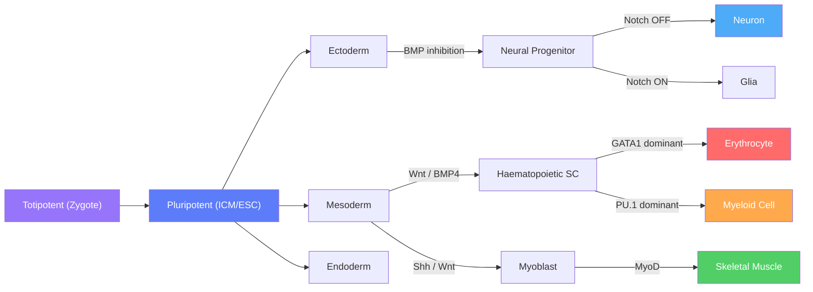

# Cell Fate and Differentiation

> [!abstract] TL;DR
> Cell fate and differentiation is the process by which a single fertilised egg — through cascading signals, master transcription factors, and self-reinforcing epigenetic circuits — generates the ~200 specialised cell types of the adult body; understanding these mechanisms underpins regenerative medicine, cancer biology, and direct cellular reprogramming.

---

## Intuition — analogy FIRST

Imagine releasing a marble from the very top of a hilly landscape riddled with valleys of different depths. The marble can roll in any direction at first, but as it descends, ridges channel it into progressively fewer paths until it settles permanently in one valley. Now imagine the landscape itself is not fixed: external signals reshape the terrain in real time — deepening one valley, filling in another — steering the marble toward specific destinations at each fork.

That is C.H. Waddington's **epigenetic landscape** (1957): the marble is a cell's gene expression state, the valleys are stable cell fates (attractors) maintained by self-reinforcing transcription factor (TF) circuits and chromatin modifications, the ridges are unstable equilibria between mutually inhibitory programmes, and the signals from neighbouring cells are the forces that reshape the terrain at each developmental decision point. Once a cell has rolled into a valley and the walls have grown high enough (through accumulated epigenetic marks), reversing the commitment requires extraordinary force — the molecular equivalent of climbing a cliff.

---

## How It Works

### Potency Hierarchy and Fate Specification



---

## Key Concepts / Details

### Secondary Level

**The potency hierarchy**

Every cell produced from a fertilised egg carries the same genome, yet can only make progressively fewer cell types as development proceeds. This narrowing is captured in a four-level potency scale:

| Potency | Definition | Example |
|---------|------------|---------|
| **Totipotent** | Can form all embryonic and extraembryonic cell types | Zygote; 2–4 cell embryo blastomeres |
| **Pluripotent** | Can form all somatic cell types but not placenta | Inner cell mass (ICM); ESCs; iPSCs |
| **Multipotent** | Can form multiple related types within one lineage | Haematopoietic stem cells; neural stem cells |
| **Unipotent** | Produces only one cell type | Muscle satellite cells; spermatogonial stem cells |

**Germ layers and their derivatives**

At gastrulation, the pluripotent epiblast is sorted into three primary germ layers by signals from the primitive streak:

- **Ectoderm** → epidermis, nervous system, sensory organs, neural crest (craniofacial bones, melanocytes, peripheral neurons)
- **Mesoderm** → skeletal and cardiac muscle, bone, kidney, blood, vasculature, gonads
- **Endoderm** → epithelial lining of the gut, lungs, liver, and pancreas

**Master transcription factors**

A small set of transcription factors acts as **cell-type determinants**: expressing a single "master regulator" in the wrong cell type can redirect its identity. Key examples:

| Master TF | Cell type it specifies | Defining experiment |
|-----------|----------------------|---------------------|
| MyoD | Skeletal muscle | Transfecting *MyoD* into fibroblasts → myotubes (Davis et al. 1987) |
| Pax6 | Eye / lens | *Pax6* misexpression in *Drosophila* antenna → ectopic eye |
| GATA1 | Erythrocytes, megakaryocytes | GATA1 deletion → block at proerythroblast stage |
| Ngn2 | Cortical glutamatergic neurons | *Ngn2* alone converts fibroblasts to functional neurons |
| Pdx1 | Pancreatic progenitors | *Pdx1* KO mice lack a pancreas entirely |

Master TFs operate not in isolation but by opening chromatin at enhancers of the downstream programme while recruiting co-activators (CBP/p300) and evicting Polycomb repressive complexes.

---

### Undergraduate Level

**Embryonic induction — the Spemann-Mangold organizer**

Hans Spemann and Hilde Mangold (1924, Nobel Prize 1935) showed that transplanting the **dorsal blastopore lip** of one *Xenopus* gastrula onto the ventral side of a host embryo induced a complete secondary body axis. The organizer emits BMP antagonists (Noggin, Chordin, Follistatin) that block BMP4 signalling over the dorsal ectoderm, allowing overlying cells to adopt the **neural default fate**. Without BMP inhibition, dorsal ectoderm would instead become epidermis — a fact that remains counter-intuitive but is firmly established. Additional organizer signals (Wnt antagonists, FGF) establish anterior identity and the head–tail axis.

**The five fate-specifying pathways**

**(1) Notch — lateral inhibition:**
Notch ligands (Delta-like: Dll1, Dll3, Dll4; Jagged: Jag1, Jag2) are membrane-bound, so Notch only operates between touching cells (juxtacrine signalling). Ligand binding triggers two sequential proteolytic cleavages (ADAM metalloprotease + γ-secretase) releasing the **Notch intracellular domain (NICD)**. NICD translocates to the nucleus and converts the CSL/RBPJκ repressor into an activator, inducing **Hes1, Hes5, Hey1** (bHLH repressors that silence proneural genes Ngn2 and Ascl1).

*Lateral inhibition logic:* a cell that gains a slight initial advantage in proneural gene expression (more Ascl1) increases Dll expression → activates Notch in neighbours → neighbours downregulate Dll and proneural genes → the original cell becomes a neuroblast while neighbours become glia or epidermis. This salt-and-pepper pattern generates the precisely spaced hair cells of the cochlea and the mosaic of photoreceptor subtypes in the retina.

**(2) Wnt/β-catenin — canonical pathway:**
Without Wnt: β-catenin is recruited to a **destruction complex** (APC + Axin + GSK3β + CK1), phosphorylated on Ser45 (CK1) and Ser33/37/Thr41 (GSK3β), then ubiquitinated by β-TrCP and degraded by the proteasome.
With Wnt: Frizzled + LRP5/6 co-receptor bind Wnt → Dishevelled (Dvl) is activated → destruction complex is inactivated → β-catenin accumulates → enters nucleus → partners with TCF/LEF TFs → activates target genes (*Axin2*, *Cyclin D1*, *c-Myc*, *Lgr5*).

Role in fate decisions: posterior neural tube identity, dorsal mesoderm specification, intestinal stem cell maintenance (Lgr5+ cells at crypt base depend on Wnt from adjacent Paneth cells).

**(3) BMP/Smad:**
BMP2/4/7 (TGF-β superfamily members) bind heterodimeric receptors (BMPR-II + BMPR-I/ALK3). BMPR-II phosphorylates ALK3, which phosphorylates R-Smads (Smad1, 5, 9). Phospho-Smad1/5/9 complex with Smad4 → nuclear translocation → activate ID genes (inhibitors of differentiation) and ventral fate specifiers. The dorsal organizer secretes secreted BMP antagonists to protect the neural plate from BMP-induced epidermal fate.

**(4) FGF/MAPK:**
FGF ligands (FGF2, 4, 8) bind FGFRs (RTKs) → dimerisation and autophosphorylation → adaptor recruitment (FRS2, Grb2, Sos) → RAS-GTP → RAF → MEK → ERK (MAPK). ERK phosphorylates ETS family TFs to activate mesoderm-specifying genes (*Brachyury/T*). FGF8 from the isthmus acts as an organising signal in the midbrain; FGF10 from lateral plate mesoderm induces limb bud initiation.

**(5) Sonic Hedgehog / Gli:**
Shh is secreted as a lipid-modified signalling protein. Without Shh: Patched1 (Ptch) inhibits Smoothened (Smo) → full-length Gli2/3 undergoes partial proteasomal cleavage to a **Gli repressor** form. With Shh: Ptch is internalised → Smo is de-repressed → Gli2 escapes cleavage → **Gli activator (GliA)** drives target gene expression (*Ptch1*, *Gli1*, *Foxa2*, *Olig2*). A concentration gradient of Shh emanating from the ventral floor plate parcels the neural tube into ~5 dorsoventral domains, each expressing a distinct combination of TFs that specifies a different interneuron or motor neuron subtype.

**Bistable toggle switch — the molecular basis of binary fate choice**

The critical observation in developmental biology is that many cell fate choices are **binary and irreversible**: a haematopoietic progenitor becomes either an erythrocyte or a myeloid cell, not a blend of both. The mechanism is **mutual inhibition** between two master TFs:

For the erythrocyte/myeloid decision:
- **GATA1** activates erythroid genes and **represses PU.1**
- **PU.1** activates myeloid genes and **represses GATA1**

Each TF also activates its own transcription (positive autoregulation). This double-negative + self-activation wiring creates a **bistable switch**: the system has two stable steady states (GATA1-high/PU.1-low = erythrocyte; PU.1-high/GATA1-low = myeloid) with an unstable intermediate state between them. The initial balance of the two TFs — set by upstream signals (EPO/EPOR boosts GATA1; M-CSF/GM-CSF boosts PU.1) — determines which attractor is reached.

This toggle topology is widespread: Cdx2/Oct4 (trophectoderm vs. ICM), GATA6/Nanog (primitive endoderm vs. epiblast), Pax5/EBF1 (B-cell commitment), Id2/E2-2 (innate vs. plasmacytoid dendritic cell).

**Polycomb/Trithorax bivalency at lineage-determining loci**

In ESCs, many developmental TF genes (e.g., *Pax6*, *Gata4*, *MyoD*) carry **bivalent chromatin domains**: the repressive mark H3K27me3 (placed by PRC2/EZH2) co-occupies the same nucleosome as the active mark H3K4me3 (placed by MLL/SET1). The gene is poised — silenced but primed for rapid activation. Upon receipt of the appropriate differentiation signal:
- The activated lineage's TF loci lose H3K27me3 (KDM6A/UTX demethylase activity) and retain H3K4me3 → active transcription
- The alternative lineage TF loci gain H3K27me3 (PRC2 recruited) and lose H3K4me3 → stable silencing

Bivalency is thus the molecular implementation of Waddington's ridge: the cell is poised at the bifurcation point, able to commit rapidly in either direction.

---

### Graduate Level

**scRNA-seq trajectory analysis**

Single-cell RNA sequencing resolves the continuous spectrum of states that bulk RNA-seq obscures. Three analytical frameworks infer differentiation trajectories from scRNA-seq data:

*Monocle (pseudotime ordering, Trapnell lab):* cells are embedded in a low-dimensional space; a **reversed graph embedding** (PAGA, Monocle3) or minimum spanning tree (Monocle2) is fitted through the point cloud. Pseudotime is assigned as arc-length along the principal graph from a user-defined root. Monocle identifies **branching points** (progenitors) and **branch endpoints** (terminally differentiated types) and can test which genes change significantly as a function of pseudotime (via generalized additive models).

*Scanpy / PAGA (Wolf et al. 2019):* **Partition-based Graph Abstraction** computes a coarser graph over cell clusters, where edge weights reflect the connectivity between partitions (corrected for random graph connectivity). Highly connected partition pairs indicate lineage relationships; weakly connected ones represent fate boundaries. PAGA graphs overlaid on UMAP provide a readable trajectory map that scales to millions of cells.

*RNA velocity (La Manno et al. 2018; Bergen et al. 2020):* the ratio of **unspliced (nascent) to spliced** mRNA captures transcriptional momentum — a gene being newly activated shows an excess of unspliced RNA relative to the current spliced steady state. Fitting a kinetic model (splicing rate, degradation rate) per gene yields a velocity vector per cell in PCA/UMAP space, producing a **vector field** that predicts the future state of each cell without requiring temporal sampling.

**Lineage tracing**

*Cre-lox recombination:* a tissue-specific or tamoxifen-inducible (CreERT2) promoter drives Cre expression; Cre recombines loxP sites flanking a STOP cassette upstream of a reporter (Rosa26^STOP-GFP or ^STOP-tdTomato) → permanent, heritable reporter expression in every daughter cell. An inducible system (CreERT2 + tamoxifen pulse) provides temporal control: only cells expressing the Cre-driver at the moment of tamoxifen administration are labelled, enabling clonal analysis.

*CRISPR barcoding:* multiple CRISPR target arrays are introduced at safe-harbour loci. Active Cas9 (or Cas12a) continuously introduces indels at the sites as cells divide; each cell and its daughters accumulate a unique combination of edits — a **somatic barcode**. Deep sequencing of the barcode locus at the end of the experiment allows maximum-parsimony or maximum-likelihood reconstruction of the cell lineage tree. GESTALT (McKenna et al. 2016) demonstrated whole-zebrafish lineage trees from a single adult fish; subsequent methods (CARLIN, CellTagging, Larry) extended this to inducible systems and thousands of clones.

*Optical barcoding (Brainbow / Confetti):* stochastic Cre-mediated recombination among multiple fluorescent protein cassettes produces unique combinations of XFP expression per cell, allowing clonal identification by microscopy without sequencing. Used extensively to map cerebellar granule cell clonal boundaries and intestinal crypt stem cell dynamics.

**Transdifferentiation and direct reprogramming**

Transdifferentiation is direct conversion of one differentiated type to another **without traversing a pluripotent intermediate**. Key milestones:

| Conversion | Factors | Reference |
|------------|---------|-----------|
| Fibroblast → skeletal myocyte | MyoD alone | Davis et al. 1987 |
| Fibroblast → neuron | BAM: Brn2 + Ascl1 + Myt1l | Vierbuchen et al. 2010 |
| Fibroblast → cardiomyocyte | GMT: Gata4 + Mef2c + Tbx5 | Ieda et al. 2010 |
| Pancreatic exocrine → beta cell | Ngn3 + Pdx1 + MafA | Zhou et al. 2008 |

Efficiency in all cases is low (1–10%) and requires overcoming H3K9me3-marked heterochromatin at key fate-determining loci — the same barrier that limits iPSC reprogramming. Co-expression of BAF chromatin remodeling complex subunits or addition of small-molecule HDAC/DOT1L inhibitors improves conversion efficiency by relaxing the epigenetic barrier at the target lineage's enhancers.

**Bifurcation theory applied to cell fate**

The bistable toggle switch is formally a **cusp catastrophe** in parameter space. The differential equation system:

$$\frac{dA}{dt} = \frac{\alpha}{1 + (B/K)^n} - \delta A, \quad \frac{dB}{dt} = \frac{\alpha}{1 + (A/K)^n} - \delta B$$

has three fixed points when $n \geq 2$ and the parameters satisfy $K < \alpha/\delta$: two stable nodes (fate attractors) separated by a saddle point (the ridge in Waddington's landscape). As an external signal parameter varies (e.g., increasing EPO concentration raises effective $\alpha$ for GATA1), the system traverses the cusp: the saddle collides with the unwanted stable fixed point in a **saddle-node bifurcation**, leaving only one attractor — the cell has committed irreversibly. Recovering the other state requires the signal to exceed a *different* (higher) threshold — this **hysteresis** is the molecular basis of epigenetic memory at the single-cell level.

---

## Python Demo

```python
# Bistable toggle switch: mutual inhibition of two transcription factors (TF-A and TF-B)
# Models the GATA1 / PU.1 erythroid-vs-myeloid fate decision in haematopoiesis.
#
# dA/dt = alpha / (1 + (B/K)^n)  -  delta * A
# dB/dt = alpha / (1 + (A/K)^n)  -  delta * B
#
# When n >= 2 and K < alpha/delta, the system is bistable:
# initial conditions alone determine which attractor (cell fate) is reached.
#
# pip install numpy scipy matplotlib

import numpy as np
import matplotlib.pyplot as plt
from scipy.integrate import solve_ivp

# ── Parameters ──────────────────────────────────────────────────────────────
alpha = 1.0   # max synthesis rate (a.u.)
K     = 0.5   # repression threshold (a.u.)
n     = 4.0   # Hill coefficient — high n gives sharp switch; bistability needs n >= 2
delta = 1.0   # equal degradation rates (a.u.)

def mutual_inhibition(t, y):
    A, B = y
    dA = alpha / (1.0 + (B / K) ** n) - delta * A
    dB = alpha / (1.0 + (A / K) ** n) - delta * B
    return [dA, dB]

t_span = (0.0, 50.0)
t_eval = np.linspace(0.0, 50.0, 500)

fig, (ax1, ax2) = plt.subplots(1, 2, figsize=(13, 5))

# ── Panel 1: time courses from two opposite initial conditions ───────────────
# IC set 1: TF-A initially dominant  →  converges to A-high / B-low (erythrocyte fate)
sol_A = solve_ivp(mutual_inhibition, t_span, [1.2, 0.1], t_eval=t_eval, rtol=1e-10)
# IC set 2: TF-B initially dominant  →  converges to A-low / B-high (myeloid fate)
sol_B = solve_ivp(mutual_inhibition, t_span, [0.1, 1.2], t_eval=t_eval, rtol=1e-10)

ax1.plot(sol_A.t, sol_A.y[0], color='steelblue', lw=2, ls='-',
         label='TF-A/GATA1  IC=(1.2, 0.1) → erythrocyte')
ax1.plot(sol_A.t, sol_A.y[1], color='tomato',    lw=2, ls='-',
         label='TF-B/PU.1   IC=(1.2, 0.1) → erythrocyte')
ax1.plot(sol_B.t, sol_B.y[0], color='steelblue', lw=2, ls='--',
         label='TF-A/GATA1  IC=(0.1, 1.2) → myeloid')
ax1.plot(sol_B.t, sol_B.y[1], color='tomato',    lw=2, ls='--',
         label='TF-B/PU.1   IC=(0.1, 1.2) → myeloid')
ax1.set_xlabel('Time (a.u.)')
ax1.set_ylabel('TF concentration (a.u.)')
ax1.set_title('Toggle switch dynamics\n(solid = A-dominant IC, dashed = B-dominant IC)')
ax1.legend(fontsize=7)
ax1.grid(True, alpha=0.3)

# ── Panel 2: basin-of-attraction map ────────────────────────────────────────
# For each (A0, B0) on a grid, run to steady state and record which TF wins.
N = 40
A0_vals = np.linspace(0.0, 1.5, N)
B0_vals = np.linspace(0.0, 1.5, N)
fate    = np.empty((N, N))

for i, A0 in enumerate(A0_vals):
    for j, B0 in enumerate(B0_vals):
        sol = solve_ivp(mutual_inhibition, (0.0, 100.0), [A0, B0], rtol=1e-10)
        A_f, B_f = sol.y[0, -1], sol.y[1, -1]
        # 1.0 = A-fate (erythrocyte), 0.0 = B-fate (myeloid)
        fate[j, i] = 1.0 if A_f > B_f else 0.0

ax2.imshow(fate, extent=[0, 1.5, 0, 1.5], origin='lower',
           cmap='RdBu', aspect='auto', alpha=0.85)
ax2.plot([0, 1.5], [0, 1.5], 'k--', lw=1.5,
         label='A0 = B0 (near separatrix)')
ax2.set_xlabel('Initial TF-A concentration (A0)')
ax2.set_ylabel('Initial TF-B concentration (B0)')
ax2.set_title('Basin of attraction\n(blue = A-fate/erythrocyte, red = B-fate/myeloid)')
ax2.legend(fontsize=8)

plt.suptitle(
    f'Bistable TF toggle switch  (alpha={alpha}, K={K}, n={n}, delta={delta})\n'
    'Bistability requires n >= 2 and K < alpha/delta',
    fontsize=9
)
plt.tight_layout()
plt.show()
# The sharp boundary near A0 ~ B0 is the separatrix (Waddington's ridge).
# Points above it converge to A-fate; points below to B-fate.
# A small signal shifting A0 above B0 irreversibly commits the cell to erythrocyte fate.
```

The basin-of-attraction map is the computational implementation of Waddington's landscape: the symmetry line (A0 = B0) is the ridge, and points on either side roll into opposite valleys. The sharpness of the boundary reflects the Hill coefficient — increasing *n* makes the transition more knife-edge, reducing noise-driven spontaneous switching between fates.

---

## Real-World Applications

**Directed differentiation of iPSCs for cell therapy:**
Patient-specific iPSCs are differentiated into therapeutic cell types by administering the same signalling sequences that operate in normal embryogenesis. The Melton lab's protocol for beta cells (Pagliuca et al. 2014) applies six sequential inductive steps in 35 days: Activin A (endoderm) → Wnt3a (primitive streak) → NOGGIN + SB431542 (pancreatic progenitor, BMP inhibition) → EGF + KGF (endocrine progenitor) → Notch inhibitor (endocrine specification) → T3 thyroid hormone + ALK5i (beta cell maturation). The resulting SC-beta cells secrete insulin in response to glucose and have restored euglycaemia in diabetic mice. Clinical trials for type 1 diabetes (Vertex VX-880) use this strategy.

**Acute myeloid leukaemia (AML) as a blocked differentiation:**
AML is not primarily a proliferation disorder but a **differentiation arrest**: leukaemic blasts are multipotent haematopoietic progenitors locked in an immature state by oncogenic TF fusions. The AML1-ETO fusion (t(8;21)) produces a dominant-negative repressor of the RUNX1 TF that normally drives myeloid maturation; PML-RARα (t(15;17)) blocks RAR-target gene activation needed for granulocyte differentiation. The therapeutic insight is that restoring differentiation — rather than simply killing dividing cells — can cure AML: all-trans retinoic acid (ATRA) binds and overcomes the dominant-negative PML-RARα fusion in acute promyelocytic leukaemia (APL), achieving remission rates >90% without cytotoxic chemotherapy. This paradigm of **differentiation therapy** is being extended to IDH1/2 mutant AML (enasidenib, ivosidenib) and other blocked-differentiation leukaemias.

**Direct reprogramming for cardiac regeneration:**
Adult mammalian cardiomyocytes do not regenerate after myocardial infarction; the scar tissue is composed of cardiac fibroblasts. Transdifferentiation offers a strategy: in vivo delivery of GMT factors (Gata4, Mef2c, Tbx5) via AAV into the infarcted mouse heart converts resident fibroblasts into cardiomyocyte-like cells, reducing infarct size and improving cardiac function (Qian et al. 2012). Adding Hand2 and miR-590/miR-199a further improved efficiency. Human fibroblast → cardiomyocyte conversion requires additional factors (ETS2 + MESP1; or GHMT with miRNAs) and remains an active area of preclinical development.

---

## Common Pitfalls

- **Assuming master TFs work alone.** MyoD expressed in a fibroblast does not instantly make a muscle cell at full efficiency; it requires a permissive chromatin state, co-factors (E proteins, MEF2), and BRD4-mediated enhancer activation. Expressing a master TF in an inaccessible chromatin context produces little or no conversion — which is why reprogramming efficiency is always far below 100%.

- **Conflating pluripotency with multipotency.** "Pluripotent" (ESCs, iPSCs) means the cell can form any somatic germ layer derivative; "multipotent" means multiple but lineage-restricted types. The terms are not interchangeable. Haematopoietic stem cells are multipotent, not pluripotent, and cannot make neurons under physiological conditions despite occasional overinterpreted in vitro reports.

- **Treating the Waddington landscape as fixed.** The landscape is dynamically remodelled by signalling context. Pathological conditions (chronic inflammation, metabolic stress, oncogene activation) can flatten valleys or create new ones not present during normal development. A dedifferentiated cancer cell may occupy an attractor state with no normal developmental equivalent.

- **Confusing transdifferentiation with dedifferentiation + redifferentiation.** True transdifferentiation converts one type to another without an iPSC-like intermediate; the cell never re-expresses pluripotency markers (Oct4, Sox2, Nanog) at high levels. In practice, many forced-conversion protocols do transit through a partially reprogrammed state. Single-cell transcriptomic profiling of the conversion trajectory is the most rigorous way to distinguish between the two mechanisms.

- **Overinterpreting scRNA-seq pseudotime as real developmental time.** Pseudotime is a statistical ordering based on transcriptional similarity, not a clock. The root cell must be specified by the user (ideally confirmed by independent lineage tracing). Branching point assignment is sensitive to the resolution parameter and neighbourhood graph construction; reporting pseudotime without sensitivity analysis is unreliable.

- **Assuming Notch always inhibits differentiation.** Context matters critically. In the intestinal crypt, Notch maintains transit-amplifying cell proliferation and *prevents* goblet cell differentiation. In T-cell development, Notch is required to *drive* T-lineage commitment. In neurogenesis, Notch inhibits neuron production and keeps progenitors cycling. The same pathway switches polarity depending on which co-factors are present in a given tissue.

---

## Related Concepts

- [[Gene_Regulation_and_Epigenetics]] — the chromatin marks and TF logic (Polycomb/Trithorax bivalency, H3K27me3, H3K4me3) that implement the epigenetic barriers between fate attractors; bivalency at lineage-specific loci is the molecular form of Waddington's ridge (Genetics/01_Molecular_Genetics)
- [[Chromatin_Structure_and_Nucleosomes]] — nucleosome positioning, CTCF-anchored TAD boundaries, and A/B compartment switching during lineage commitment; chromatin accessibility (ATAC-seq peaks) at enhancers is the primary readout of permissive cell fate state (Genetics/01_Molecular_Genetics)
- [[Membranes_and_Cell_Signaling]] — the receptor tyrosine kinase, GPCR, and TGF-β/Smad signalling cascades that translate extracellular fate signals (FGF, BMP, Wnt, Shh) into nuclear TF activation; the Notch and Wnt pathways described here rely on the membrane receptor biology covered there (Chemistry/06_Biochemistry)
- [[Systems_of_ODEs]] — the mathematical framework underlying the bistable toggle switch; nullcline analysis, phase-plane portraits, fixed-point stability, and saddle-node bifurcations are the tools used to analyse mutual-inhibition gene circuits quantitatively (Mathematics/07_Differential_Equations)
- [[Neuron_Structure_and_Function]] — one of the terminal outputs of the Notch-mediated neural fate decision covered here; the highly specialised morphology and protein complement of a neuron is the product of the transcriptional programme activated downstream of Ngn2 and NeuroD (Neuroscience/01_Cellular_and_Molecular_Neuroscience)
- [[Stem_Cells_and_Pluripotency]] — the pluripotent ground state (ESC / iPSC), Yamanaka reprogramming factors, and naïve vs. primed pluripotency; the pluripotent attractor sits at the top of the Waddington landscape described in this note (Genetics/04_Developmental_and_Epigenetic_Genetics)
- [[_MOC_Developmental_and_Epigenetic_Genetics|↑ Developmental and Epigenetic Genetics MOC]]

---

## Review Questions

1. **(Secondary)** A skin fibroblast and a skeletal muscle cell have identical DNA sequences. Using the Waddington landscape metaphor, explain why introducing MyoD alone into a fibroblast is sufficient to produce myotubes in a culture dish, but why that same experiment cannot re-activate every silenced gene and return the fibroblast to a pluripotent state.

2. **(Undergraduate)** A neural progenitor cell expressing roughly equal amounts of Notch and Delta is exposed to a transient pulse of Dll4 from an adjacent cell. Using the bistable toggle switch logic and the Notch pathway, describe the molecular events that: (a) lead to a stable decision in the progenitor, (b) propagate the choice to its daughters via epigenetic memory, and (c) might be disrupted by γ-secretase inhibitor treatment.

3. **(Graduate)** You perform scRNA-seq on cells isolated from a developing pancreas at E13.5 in mice and perform PAGA trajectory analysis. You identify three clusters: endocrine progenitors, alpha cells, and beta cells, with a branch point at the progenitor cluster. RNA velocity vectors point away from the progenitor towards both endpoints. However, Cre-lox lineage tracing (Ptf1a-Cre) labels only acinar cells and some progenitors, not alpha or beta cells. Propose two alternative hypotheses reconciling the RNA velocity data with the lineage trace result, and describe one additional experiment that could distinguish between them.

---

## Sources

- Waddington, C.H. (1957). *The Strategy of the Genes*. Allen & Unwin. (Original landscape metaphor)
- Vierbuchen, T. et al. (2010). "Direct conversion of fibroblasts to functional neurons by defined factors." *Nature*, 463, 1035–1041. https://doi.org/10.1038/nature08797
- Ieda, M. et al. (2010). "Direct reprogramming of fibroblasts into functional cardiomyocytes by defined factors." *Cell*, 142, 375–386. https://doi.org/10.1016/j.cell.2010.07.002
- McKenna, A. et al. (2016). "Whole-organism lineage tracing by combinatorial and cumulative genome editing." *Science*, 353, aaf7907. https://doi.org/10.1126/science.aaf7907
- Bergen, V. et al. (2020). "Generalizing RNA velocity to transient cell states through dynamical modeling." *Nature Biotechnology*, 38, 1408–1414. https://doi.org/10.1038/s41587-020-0591-3
- Pagliuca, F.W. et al. (2014). "Generation of functional human pancreatic beta cells in vitro." *Cell*, 159, 428–439. https://doi.org/10.1016/j.cell.2014.09.040
- Wolf, F.A. et al. (2019). "PAGA: graph abstraction reconciles clustering with trajectory inference." *Genome Biology*, 20, 59. https://doi.org/10.1186/s13059-019-1663-x
- Alberts, B. et al. (2022). *Molecular Biology of the Cell*, 7th ed. W.W. Norton. Ch. 21 (Development of Multicellular Organisms).
- Slack, J.M.W. (2013). *Essential Developmental Biology*, 3rd ed. Wiley-Blackwell.

---

#Genetics #DevelopmentalGenetics #CellFate #Differentiation
