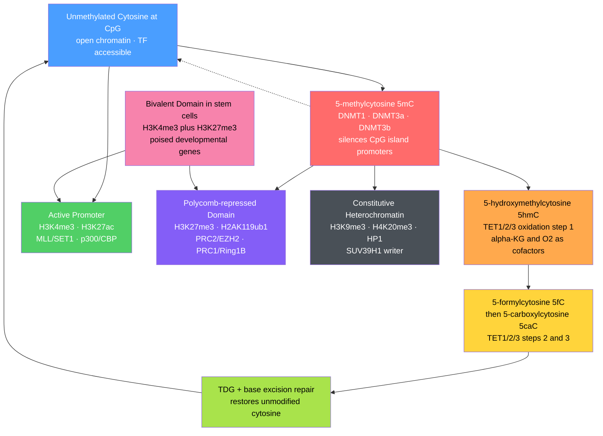

# Epigenetics: DNA Methylation and Histone Modification

> [!abstract] TL;DR
> Epigenetics is the system of heritable chemical marks on DNA (5-methylcytosine at CpG dinucleotides) and histone proteins (acetylation, methylation, phosphorylation, ubiquitination) that control gene accessibility without altering the DNA sequence; together the two layers constitute the **epigenome** — the cell-type-specific instruction set that converts one genome into 200+ distinct cell identities, records developmental history, and is increasingly druggable in cancer and aging.

---

## Intuition — analogy FIRST

Imagine a **national library where every branch holds identical copies of the same encyclopaedia** — 46 volumes, 3 billion characters, exactly the same text in every neuron, liver cell, and T lymphocyte. Yet each branch displays completely different chapters in the reading room while locking others away. How?

**DNA methylation** is the **librarian's "RESTRICTED" ink stamp** — a tiny methyl group dabbed onto specific cytosine letters throughout the text. Stamped pages are pulled behind a locked cage (compact, inaccessible chromatin); transcription machinery cannot reach them. Crucially, when the library photocopies its encyclopaedia for a new branch (cell division), the copying machine reads the ink and re-stamps the same pages in the daughter copy — the restriction is inherited.

**Histone modification** is the **annotation layer** plastered on chapter headings and margin tabs: a bright green sticky note (H3K4me3, H3K27ac) on a chapter header means "actively reading now"; a purple rubber stamp (H3K27me3) means "this chapter is reserved for another cell type — keep it shut but leave the page in the book"; a heavy padlock (H3K9me3) on the end papers means "permanently archived, never open under any circumstances."

The critical insight is that **both types of marks are enzymatically reversible**: writers add them, erasers remove them, and readers interpret them to recruit larger regulatory machines. The same genome, different annotations, different cellular identity.

---

## How It Works

### The Two Layers of the Epigenome

The epigenome operates through two chemically distinct but mechanistically coupled systems:

1. **DNA methylation** — a —CH₃ group added to the 5-carbon of cytosine within 5'-CpG-3' dinucleotides; written by DNA methyltransferases (DNMTs), reversed by TET-enzyme-mediated oxidative demethylation.
2. **Histone modifications** — acetyl, methyl, phospho, ubiquitin, and SUMO groups added to lysine, arginine, serine, and threonine residues on the flexible N-terminal tails of histones H2A, H2B, H3, and H4.

Both layers feed into **chromatin accessibility**: open chromatin allows transcription factors, RNA Pol II, and enhancer-binding proteins to land; compact chromatin denies them access.



The dashed arrow B → A represents **passive demethylation**: if DNMT1 is absent or inhibited during replication, the daughter strand is diluted to zero methylation over successive divisions — the mechanism exploited by the embryo during global reprogramming and by clinical DNMT inhibitors.

---

## Key Concepts / Details

### Secondary Level

**What is a CpG dinucleotide?** 5'-CG-3' (cytosine followed immediately by guanine, linked by the phosphodiester bond — hence the "p"). CpGs are palindromic: the complementary strand also reads 5'-CG-3', so when a cytosine on one strand is methylated, the complementary cytosine can be recognised and methylated too — making the mark heritable through DNA replication (DNMT1 copies hemi-methylated CpG to fully methylated after each round of synthesis).

Human CpGs are underrepresented in the genome (~1 per 80 bp; expected ~1 per 16 bp from base composition alone) because unmethylated CpGs deaminate over evolutionary time to TpG, which is not corrected efficiently. The depleted background makes CpG-dense regions stand out.

**CpG islands** are ~300–3000 bp stretches with high CpG density (observed/expected ratio > 0.6) and high GC content. Roughly 60% of human gene promoters are embedded in CpG islands. In healthy, expressing genes, CpG islands are unmethylated and sit in open, accessible chromatin. When a CpG island becomes methylated — as in cancer, X-chromosome inactivation, or developmental silencing — the associated gene is shut down.

**What do histone modifications do?** Modifications affect chromatin two ways: (i) **directly** — acetylation on lysine neutralises its positive charge, weakening the electrostatic attraction to negatively charged DNA phosphates and loosening the nucleosome; (ii) **indirectly** — the modified residue creates a docking surface for "reader" proteins that recruit larger regulatory complexes (activators, repressors, remodellers, splicing factors).

**The six key marks at secondary level:**

| Mark | Where you find it | What it means | Written by |
|------|-------------------|---------------|------------|
| H3K4me3 | Active gene promoters | "Gene is ON" | MLL/SET1 family |
| H3K27ac | Active enhancers and promoters | "Regulatory element is active" | p300/CBP |
| H3K4me1 | Primed or active enhancers | "Enhancer is primed" | MLL3/MLL4 |
| H4K16ac | Broadly open chromatin | "Chromatin is accessible" | MOF/KAT8 |
| H3K27me3 | Polycomb domains | "Gene silenced (reversibly)" | PRC2/EZH2 |
| H3K9me3 | Centromeres, retrotransposons | "Permanently archived" | SUV39H1 |

---

### Undergraduate Level

**DNA methylation machinery in depth:**

Three catalytically active mammalian DNMTs do distinct jobs:

- **DNMT3a and DNMT3b** — *de novo* methyltransferases. They establish new methylation on previously unmethylated DNA during gametogenesis, embryonic implantation, and somatic differentiation. DNMT3L is a catalytically dead paralogue that stimulates DNMT3a/3b by dimerising with their catalytic domains (DNMT3L–DNMT3a–DNMT3a–DNMT3L heterotetramers), increasing processivity. DNMT3b splice variants (DNMT3b1–DNMT3b7) carry tissue-specific insertions that target different chromatin contexts — DNMT3b1/3 favour pericentromeric satellite repeats; DNMT3a preferentially targets gene-body CpGs and imprinting control regions. Biallelic DNMT3b mutations cause ICF syndrome (Immunodeficiency, Centromeric instability, Facial anomalies), with near-complete loss of satellite methylation and chromosomal instability.
- **DNMT1** — maintenance methyltransferase. At each replication fork, the newly synthesised daughter strand is initially unmethylated (hemi-methylated CpG). DNMT1 is recruited to replication foci by **PCNA** and the E3 ligase-like adaptor **UHRF1**, which recognises hemi-methylated CpG via its SRA (SET and RING finger-Associated) domain and flips the hemimethylated cytosine into DNMT1's catalytic pocket. Fidelity exceeds 95% per CpG per division — the molecular basis for the near-perfect heritable copying of methylation patterns across somatic cell lineages.

**TET enzymes and the oxidative demethylation pathway:**

TET1, TET2, and TET3 are **Fe(II)/alpha-ketoglutarate-dependent dioxygenases** that iteratively oxidise 5mC in three steps:

$$\text{5mC} \xrightarrow{\text{TET}} \text{5hmC} \xrightarrow{\text{TET}} \text{5fC} \xrightarrow{\text{TET}} \text{5caC} \xrightarrow{\text{TDG + BER}} \text{C}$$

Key details: each oxidation step consumes one molecule of O₂ and one of alpha-ketoglutarate (alpha-KG), producing succinate and CO₂ as by-products. DNMT1 does not recognise 5hmC or further oxidised forms as substrates, so 5hmC is diluted passively across replication cycles (constituting passive demethylation). 5fC and 5caC are removed by **thymine-DNA glycosylase (TDG)**, which creates an abasic site repaired by base excision repair (BER) — constituting **active demethylation** even in post-mitotic cells.

**Why the IDH–TET axis matters in cancer:** IDH1 and IDH2 gain-of-function mutations (common in low-grade glioma, AML, cholangiocarcinoma) produce the oncometabolite **2-hydroxyglutarate (2-HG)**, a structural mimic of alpha-KG that competitively inhibits all TET enzymes (as well as the histone demethylases KDM6A/B, KDM5, KDM4). The result is simultaneous accumulation of 5mC at CpG islands (**CpG Island Methylator Phenotype, CIMP**) and H3K27me3/H3K9me3 genome-wide — two compounding epigenetic silencing events that together drive a stem-like, undifferentiated state.

**The histone code — writers, readers, and erasers in full:**

| Mark | Writer | Reader domain | Eraser | Functional context |
|------|--------|---------------|--------|-------------------|
| H3K4me3 | MLL1–4/SET1A/B (COMPASS family) | PHD finger, ING1/2 | KDM5A–D (JARID1) | Active promoters; marks TSS |
| H3K4me1 | MLL3/4 (KMT2C/D) | PHD finger | KDM1A/LSD1, KDM5 | Primed and active enhancers |
| H3K27ac | p300/CBP (KAT3A/3B) | Bromodomain (BRD4, BPTF) | HDAC1/2/3 | Active enhancers and promoters |
| H4K16ac | MOF/KAT8 (NSL/MSL complexes) | Bromodomain | HDAC1, SIRT1 | Broadly open chromatin; dosage compensation (MSL) |
| H3K27me3 | PRC2/EZH2 (KMT6) | Chromodomain (CBX2/4/7) | KDM6A/UTX · KDM6B/JMJD3 | Polycomb silencing (reversible) |
| H3K9me3 | SUV39H1/H2; SETDB1/ESET | HP1α/β/γ chromodomain | KDM4A–D (JMJD2) | Constitutive heterochromatin; pericentric repeats |
| H2AK119ub1 | Ring1A/B (PRC1 component) | Steric block on Pol II | BAP1/ASXL (PR-DUB complex) | Polycomb compaction; Pol II pause |

"**Writers**" (KMTs for methylation, KATs for acetylation) add the mark using SAM (S-adenosylmethionine) as the methyl donor or acetyl-CoA as the acetyl donor. "**Erasers**" (KDMs — Jumonji-domain demethylases; HDACs) remove it. "**Readers**" (bromodomain recognises acetyl-Kac; chromodomain recognises methyl-Kme; PHD finger recognises H3K4me3; Tudor domain recognises methyl-K or methyl-R in varied contexts) interpret the mark and recruit further effectors. The **BRD4–bromodomain** interaction is among the most clinically exploited — BET inhibitors (JQ1, OTX015) displace BRD4 from H3K27ac at super-enhancers, reducing MYC and BCL2 transcription in multiple cancers.

**Polycomb Repressive Complexes — PRC1 and PRC2:**

Polycomb group (PcG) proteins form two major multi-subunit complexes that maintain silencing of developmental gene programmes in the wrong cell type:

- **PRC2**: Contains **EZH2** (catalytic KMT; writes H3K27me2/me3), **EED** (binds existing H3K27me3 via its aromatic cage, allosterically stimulating EZH2 — a positive-feedback read-write mechanism for spreading the mark), **SUZ12** (structural scaffold), and **RBBP4/7** (histone-binding). PRC2 spreads H3K27me3 over kilobase-wide **Polycomb domains** covering entire Hox gene clusters and lineage-specific transcription factor loci not needed in the current cell type.
- **PRC1** (canonical): **CBX2/4/6/7/8** read H3K27me3 via their chromodomain, recruiting **Ring1A/Ring1B** (E3 ubiquitin ligase), which monoubiquitylates histone H2A at K119 (H2AK119ub1). H2AK119ub1 physically inhibits RNA Pol II elongation and promotes chromatin compaction. **Non-canonical PRC1** (ncPRC1; contains RYBP/YAF2 instead of CBX proteins) is recruited independently of H3K27me3, providing PRC2-independent silencing at a subset of targets.
- **Trithorax group (TrxG)** is the functional antagonist of PcG: MLL1–4/SET1 COMPASS complexes write H3K4me3 to maintain active transcription of developmental regulators. The balance of PRC2 (depositing H3K27me3) versus TrxG (depositing H3K4me3) at developmental gene promoters governs lineage commitment decisions throughout embryogenesis and adult tissue homeostasis.

**Bivalent chromatin in pluripotent stem cells:**

Embryonic stem cells face a paradox: they must remain pluripotent while being poised to rapidly activate any developmental programme. The molecular solution is **bivalent chromatin domains** — a subset of developmental regulator promoters carry simultaneous **H3K4me3** (written by TrxG MLL complexes, associated with an open, "ready" promoter) and **H3K27me3** (written by PRC2, exerting net repression). The gene is off (Polycomb dominates) but primed (H3K4me3 keeps chromatin accessible and RNA Pol II is paused just downstream of the TSS). Approximately 2500 developmental regulator promoters are bivalent in human ESCs (Bernstein et al., 2006).

Upon differentiation the domain resolves:
- **Toward the target lineage**: KDM6A/UTX (or KDM6B/JMJD3) erases H3K27me3, PRC2 dissociates, H3K27ac is added by p300/CBP, and the gene is fully activated.
- **Away from the target lineage**: KDM5 erases H3K4me3, PRC2 spreads H3K27me3, DNMT3a may add DNA methylation at the CpG island, and the locus is stably silenced.

Bivalency is largely restricted to pluripotent and multipotent cells — most terminally differentiated cells resolve these domains. When oncogenic mutations deregulate PRC2 or TrxG (EZH2 gain-of-function; NSD1/2 gain-of-function in NSD-rearranged leukemias), bivalent resolution is blocked, maintaining tumour cells in an aberrant, stem-like epigenetic state.

---

### Graduate Level

**Bisulfite sequencing (WGBS) — reading the methylome at single-base resolution:**

Sodium bisulfite deaminates **unmethylated cytosine (C) → uracil (U)**, which reads as **T** after PCR and sequencing. **5-methylcytosine resists bisulfite conversion** and reads as **C**. Comparing bisulfite-treated reads to the reference genome therefore reveals the methylation status of every CpG: C in the read = methylated; T in the read = unmethylated.

**Whole-Genome Bisulfite Sequencing (WGBS)** maps all ~28 million CpGs in the human genome at single-base resolution; ~30× coverage is required for reliable per-CpG calls. Reduced-Representation Bisulfite Sequencing (RRBS) uses MspI digestion to enrich CpG-rich fragments (~5% of the genome) covering ~85% of CpG islands at ~10% of WGBS cost. Critical limitation: bisulfite treatment degrades >85% of input DNA and cannot distinguish 5mC from 5hmC (both resist conversion). **Oxidative bisulfite sequencing (oxBS-seq)** oxidises 5hmC → 5fC first (with potassium perruthenate), making 5hmC bisulfite-sensitive; subtracting oxBS from standard WGBS isolates 5hmC. **Nanopore direct sequencing** detects the native current signature of 5mC, 5hmC, and N6mA without bisulfite treatment, and is rapidly becoming the standard for single-molecule methylomics.

**ChIP-seq — mapping histone modifications across the genome:**

Chromatin Immunoprecipitation followed by sequencing (ChIP-seq): formaldehyde cross-links proteins to DNA in intact cells; chromatin is sheared to ~200–500 bp fragments by sonication or MNase; antibody specific to the histone mark of interest immunoprecipitates modified fragments; cross-links are reversed; DNA is sequenced. Read pile-up relative to an input control reveals the genome-wide distribution of the mark with hallmark patterns:

- **Sharp narrow peaks** (~200–500 bp): H3K4me3 at promoters, H3K27ac at enhancers — one or two modified nucleosomes.
- **Broad domains** (5 kb – 2 Mb): H3K27me3 (Polycomb domains), H3K9me3 (constitutive heterochromatin), H3K36me3 (actively transcribed gene bodies).
- **Super-enhancer clusters**: rank-ordered H3K27ac signal shows an inflection point above which clusters of enhancers are designated super-enhancers; these disproportionately control cell-identity genes.

**CUT&TAG** (Cleavage Under Targets and TAGmentation) fuses Protein A/G–Tn5 transposase to the antibody bridge; Tn5 inserts sequencing adapters directly at antibody-bound chromatin in situ — no formaldehyde required, working from as few as 1000 cells or single cells (scCUT&TAG).

**Epigenetic reprogramming in the early mammalian embryo:**

The zygote undergoes two waves of genome-wide epigenetic erasure to re-establish developmental totipotency:

**Wave 1 — post-fertilisation demethylation:** Within hours of fertilisation, **TET3** (abundantly loaded into the oocyte) oxidises 5mC → 5hmC across the paternal pronucleus, enabling passive demethylation over the first cleavage divisions. The maternal genome demethylates passively (DNMT1 is excluded from the cleavage-stage nucleus by DPPA3/Stella, which protects the maternal genome from TET3 and DNMT1). By the morula/early blastocyst stage (~day 4 in humans), both genomes are nearly demethylated. Critical exceptions: **imprinting control regions (ICRs)** and **IAP retrotransposons** resist demethylation — ICRs are protected by DPPA3 and ZFP57 binding; IAPs retain Kap1/TRIM28-mediated H3K9me3 that blocks TET access.

**Wave 2 — de novo remethylation:** As the inner cell mass (ICM) differentiates into epiblast at implantation, DNMT3a and DNMT3b are upregulated and re-establish cell-type-specific methylation patterns. The epiblast acquires the somatic methylation pattern (~75–80% of CpGs); CpG islands at active promoters remain unmethylated. Primordial germ cells (PGCs), specified from the epiblast and migrating to the gonad, undergo a second, more complete demethylation that erases even ICR methylation; sex-specific remethylation then establishes new parent-of-origin imprints in the sperm and egg.

**Transgenerational epigenetic inheritance — evidence and debate:**

*The claim:* parental environmental exposures (nutrition, stress, toxins) alter offspring and grandchild phenotypes through incompletely erased epigenetic marks in the germline.

*Epidemiological evidence:*
- **Överkalix cohort** (Pembrey et al., 2006): paternal grandfather's nutritional availability during his pre-pubertal slow-growth period correlated with grandchildren's cardiovascular and diabetes mortality across two generations — a skip consistent with germline epigenetic transmission.
- **Dutch Hunger Winter** (Heijmans et al., 2008): individuals whose mothers were exposed to famine in early gestation showed altered DNA methylation at the *IGF2* imprinted locus six decades later, with differences between concordant (same exposure) and discordant sibling pairs.

*Mechanistic evidence in model organisms:*
- **C. elegans**: piRNA-directed H3K9me3 silencing at germline loci can be maintained for 20+ generations after removal of the initiating trigger (Ashe et al., 2012), transmitted through both oocytes and sperm.
- **Mice**: paternal high-fat diet-induced metabolic phenotypes (impaired glucose tolerance) transmit to F1 and partially to F2 offspring through sperm-borne tRNA-derived small RNAs (tsRNAs) and sncRNAs; injection of sperm RNA from diet-exposed males into normal zygotes recapitulates the phenotype (Chen et al., 2016; Sharma et al., 2016).

*Mechanisms of transmission:*
1. **Sperm small RNAs**: sperm contains miRNA, piRNA, and tsRNA cargo packaged in protective structures; delivery to the oocyte cytoplasm can modulate early embryonic transcription before zygotic genome activation.
2. **Residual histone variants**: ~10–15% of human sperm chromatin is nucleosomal (not protamine-packaged), enriched at developmental gene promoters; retained H3K4me3, H3K27me3, and H3.3/H2A.Z variants are candidate carriers.
3. **Sperm DNA methylation** at loci escaping reprogramming — particularly imprinted DMRs and repetitive elements.

*The challenge:* human epidemiological studies cannot rule out shared genetics, in utero indirect effects (the grandmother's environment alters the developing F1 germline directly — a "maternal" F2 effect), or postnatal behavioural transmission. The mainstream view is that genuine F3+ transgenerational epigenetic inheritance is real in C. elegans and documented at specific loci in rodents, but its contribution to human population phenotypic variation is small relative to genetic and in utero environmental effects — and its molecular carriers remain vigorously debated.

---

## Python Demo

```python
# pip install numpy matplotlib
# Simulate CpG methylation across a 2 000-bp genomic region
# containing a CpG island (positions 600-1000) with low methylation.
# Mimics what whole-genome bisulfite sequencing (WGBS) would show.

import numpy as np
import matplotlib.pyplot as plt

rng = np.random.default_rng(42)

REGION_LEN = 2000
CGI_START  = 600
CGI_END    = 1000
BIN_SIZE   = 100

# Generate CpG positions:
#   outside CGI: ~1 per 10 bp on average (sparse; random subset)
#   inside  CGI: ~1 per 5 bp on average (dense; CpG islands are CpG-rich)
outside_idx = np.sort(
    rng.choice(
        np.concatenate([np.arange(0, CGI_START), np.arange(CGI_END, REGION_LEN)]),
        size=140, replace=False,
    )
)
inside_idx = np.sort(
    rng.choice(np.arange(CGI_START, CGI_END), size=60, replace=False)
)

all_pos = np.concatenate([outside_idx, inside_idx])

# Assign methylation probabilities:
#   gene-body / intergenic CpGs  ~70-90% methylated
#   active-promoter CGI CpGs     ~2-8%   methylated
prob_outside = rng.uniform(0.70, 0.90, size=len(outside_idx))
prob_inside  = rng.uniform(0.02, 0.08, size=len(inside_idx))
all_probs    = np.concatenate([prob_outside, prob_inside])

# Bernoulli draw: is each CpG methylated?
methylated = rng.random(len(all_pos)) < all_probs

# Compute bin-averaged methylation frequency in 100-bp windows
n_bins      = REGION_LEN // BIN_SIZE
bin_centers = np.arange(BIN_SIZE // 2, REGION_LEN, BIN_SIZE)
bin_freq    = np.full(n_bins, np.nan)

for b in range(n_bins):
    lo, hi = b * BIN_SIZE, (b + 1) * BIN_SIZE
    mask = (all_pos >= lo) & (all_pos < hi)
    if mask.sum() > 0:
        bin_freq[b] = methylated[mask].mean()

# Colour bars: blue for CGI bins, red for flanking gene-body bins
bar_colors = [
    "#74c0fc" if (CGI_START <= c < CGI_END) else "#ff6b6b"
    for c in bin_centers
]

fig, (ax1, ax2) = plt.subplots(
    2, 1, figsize=(10, 6), sharex=True,
    gridspec_kw={"height_ratios": [3, 1]},
)

# Upper panel: methylation frequency per 100-bp bin
ax1.bar(bin_centers, bin_freq, width=BIN_SIZE * 0.85,
        color=bar_colors, edgecolor="white", linewidth=0.5)
ax1.axvspan(CGI_START, CGI_END, alpha=0.12, color="limegreen",
            label="CpG island (CGI)")
ax1.axhline(0.80, color="#ff6b6b", lw=1.5, ls="--", alpha=0.7,
            label="Expected outside CGI  ~80 %")
ax1.axhline(0.05, color="#74c0fc", lw=1.5, ls="--", alpha=0.7,
            label="Expected inside CGI  ~5 %")
ax1.set_ylabel("Methylation frequency", fontsize=11)
ax1.set_ylim(0, 1.05)
ax1.set_title(
    "Simulated CpG Methylation Landscape\n"
    "Gene body (high methylation) vs CpG island at active promoter (low methylation)",
    fontsize=11,
)
ax1.legend(fontsize=9, loc="lower right")

# Lower panel: CpG position rug plot showing density difference
ax2.scatter(outside_idx, np.ones(len(outside_idx)) * 0.5,
            marker="|", s=40, color="#ff6b6b", alpha=0.6, label="Non-CGI CpGs")
ax2.scatter(inside_idx, np.ones(len(inside_idx)) * 0.5,
            marker="|", s=40, color="#74c0fc", alpha=0.9, label="CGI CpGs")
ax2.axvspan(CGI_START, CGI_END, alpha=0.12, color="limegreen")
ax2.set_yticks([])
ax2.set_xlim(0, REGION_LEN)
ax2.set_xlabel("Genomic position (bp)", fontsize=11)
ax2.set_ylabel("CpG sites", fontsize=9)
ax2.legend(fontsize=8, loc="upper right")

plt.tight_layout()
plt.show()

# Summary statistics
print(f"Outside CGI mean methylation : {methylated[:len(outside_idx)].mean():.1%}")
print(f"Inside  CGI mean methylation : {methylated[len(outside_idx):].mean():.1%}")
```

The upper panel shows the hallmark **methylation valley** over the CpG island: outside it gene-body CpGs hover around 70–90% methylation (red bars), while CpG island bins (blue) drop to 2–8%. The lower panel's rug plot reveals the higher CpG density inside the island relative to the flanking sequence — the defining feature of a CpG island. In real WGBS data, each bin value would be the fraction of reads returning C (not T) across all CpGs in that window; the island valley is typically sharp-edged and corresponds precisely to the nucleosome-free region at the active promoter.

---

## Real-World Applications

**1. Cancer epigenomics — CpG island hypermethylation silences tumour suppressors:**
Nearly every solid tumour carries aberrant CGI methylation at tumour-suppressor promoters: *CDKN2A/p16* (pan-cancer; silences the RB pathway), *MLH1* (colorectal; causes microsatellite instability via mismatch repair loss), *BRCA1* (breast/ovarian), *VHL* (renal cell carcinoma), *CDH1/E-cadherin* (invasive lobular breast cancer), *RASSF1A* (lung). The DNMT inhibitors **5-azacytidine** (azacitidine) and **decitabine** are cytosine analogues incorporated into DNA that covalently trap DNMT1, causing passive demethylation across replication. Both are FDA-approved for myelodysplastic syndrome (MDS) and AML. A mechanistically important secondary effect: demethylation reactivates endogenous retroviral elements (ERVs), producing double-stranded RNA that triggers cytoplasmic innate immune sensors (MDA5, RIG-I) and an interferon response — the "viral mimicry" mechanism (Chiappinelli et al., 2015) that converts DNMT inhibition into immune sensitisation and synergises with PD-1/PD-L1 checkpoint blockade.

**2. EZH2 gain-of-function mutations in lymphoma:**
A recurrent missense mutation at EZH2 Y641 (Y641F/N/S/H/C) in ~20% of follicular lymphoma and DLBCL shifts EZH2 substrate preference so the mutant enzyme hyper-efficiently converts H3K27me2 → H3K27me3 (while wild-type EZH2 prefers H3K27me1 → H3K27me2). The resulting supraphysiological H3K27me3 spreads over B-cell maturation regulators, locking tumour B cells in an undifferentiated germinal-centre state. **Tazemetostat (Tazverik)**, a SAM-competitive EZH2 inhibitor, is FDA-approved for EZH2-mutant follicular lymphoma and for epithelioid sarcoma (which carries inactivating SMARCB1/INI1 mutations in the SWI/SNF complex, creating unique PRC2 dependence).

**3. Genomic imprinting disorders — disrupting parent-of-origin methylation:**
A subset of ~80 mammalian genes are monoallelically expressed from only the maternally or paternally derived allele, controlled by **imprinting control regions (ICRs)** — CpG-rich DMRs that carry differential DNA methylation inherited from the sperm or oocyte and maintained through somatic development. The *H19/IGF2* locus on chromosome 11p15: the ICR is methylated on the paternal allele; this methylation blocks CTCF binding, allowing downstream enhancers to loop to *IGF2*; on the maternal allele, the unmethylated ICR binds CTCF, insulating *IGF2* from the enhancers and instead activating non-coding *H19*. Disruption:
- Loss of maternal ICR methylation (or paternal uniparental disomy) → biallelic *IGF2* expression → **Beckwith-Wiedemann syndrome** (overgrowth, Wilms tumour predisposition).
- Loss of paternal ICR methylation (or maternal UPD) → biallelic *H19* expression, *IGF2* silenced on both alleles → **Silver-Russell syndrome** (growth restriction, relative macrocephaly).

**4. BET bromodomain inhibitors — blocking the histone reader to kill oncogene addiction:**
BRD4 reads H3K27ac and H4K16ac at super-enhancers via its tandem bromodomains, driving transcription of *MYC*, *BCL2*, and lineage-identity oncogenes. JQ1, a thienodiazepine, competitively occupies the acetyl-lysine binding pocket, displacing BRD4 from super-enhancers and preferentially reducing transcription of super-enhancer-driven genes (their expression is more dependent on BRD4 than that of ordinary genes). NUT carcinoma (NMC), caused by the BRD4-NUT fusion oncoprotein that hijacks super-enhancer machinery to drive *MYC* and squamous programmes, shows striking clinical responses to BET inhibitors. Combination with CDK4/6 inhibitors or venetoclax (BCL2 inhibitor) is under investigation for AML and TNBC.

---

## Common Pitfalls

- **Equating all CpG methylation with gene silencing.** Gene-body methylation is positively correlated with active transcription in mammalian cells — it suppresses cryptic intragenic promoters and transposable element transcription within actively transcribed units. Only **promoter-region CpG island** methylation is consistently repressive. Writing "methylation = silence" without specifying genomic context is a frequent and consequential oversimplification, both in research papers and clinical interpretation.

- **Conflating 5mC and 5hmC in standard bisulfite data.** Sodium bisulfite cannot distinguish 5mC from 5hmC: both resist conversion and both appear as C in standard WGBS output. Brain tissue (high TET activity) and ESCs contain substantial 5hmC at enhancers and gene bodies; calling it "methylation" overstates silencing. Properly mapping 5hmC requires oxBS-seq, TAB-seq, or Nanopore direct detection.

- **Treating PRC2/H3K27me3 as equivalent to HP1/H3K9me3 heterochromatin.** These are mechanistically and functionally distinct silencing systems. H3K27me3 (Polycomb) marks **facultative heterochromatin** — it is reversibly maintained by the read-write PRC2 mechanism and dissolved by KDM6A/B during normal differentiation. H3K9me3 + HP1 marks **constitutive heterochromatin** at centromeres, telomeres, and retrotransposons — stable through the germline, rarely reversed in somatic cells. Drugs targeting one system do not address the other.

- **Ignoring the IDH–TET–KDM axis as a unified mechanism.** Students often learn TET loss and histone hypermethylation as separate events in IDH-mutant cancers. The mechanistic link is direct: 2-HG is a competitive inhibitor of the entire alpha-ketoglutarate-dependent dioxygenase superfamily, which includes TET1/2/3 (DNA demethylation), KDM5/JARID1 (H3K4me3 demethylation), KDM6A/B (H3K27me3 demethylation), and KDM4 (H3K9me3 demethylation). All four systems are simultaneously impaired, producing a compound epigenetic lock that blocks differentiation.

- **Assuming bisulfite sequencing resolution is always single-CpG.** At standard WGBS coverage (20–30×), individual CpG calls have binomial uncertainty (e.g., at 30× coverage, a 50%-methylated CpG has a 95% CI of roughly 33–67%). Single-CpG resolution is reliable only at >10× per CpG; at lower coverage, regional (100-bp bin) averages are more accurate. RRBS provides higher effective depth at CpG islands but blind spots in gene bodies and repetitive regions.

- **Confusing the bivalency model with the "poised Pol II" model.** Bivalent chromatin (H3K4me3 + H3K27me3) and Pol II pausing are related but distinct phenomena. Many bivalent genes in ESCs carry paused Pol II at their promoters (phospho-Ser5 CTD but not phospho-Ser2 CTD); upon differentiation, both the H3K27me3 mark is erased AND the paused Pol II is released. Reporting "H3K4me3 = active" without noting the co-occurring H3K27me3 misrepresents the gene's actual activity state in pluripotent cells.

---

## Related Concepts

- [[Gene_Regulation_and_Epigenetics]] — covers the broader logic of TF networks, enhancer-promoter looping, non-coding RNA, and the signal-to-chromatin flow; this note provides the molecular chemistry of the epigenetic marks that implement that regulatory logic (same vault, section 01)
- [[Chromatin_Structure_and_Nucleosomes]] — nucleosome structure, histone octamer geometry, TADs, and loop extrusion are the physical substrate on which every epigenetic mark described here operates; histone modification can only be understood against the nucleosome architecture detailed there (same vault, section 01)
- [[DNA_Structure_and_Replication]] — CpG methylation heritability depends on the palindromic symmetry of the CpG dinucleotide and DNMT1's recognition of hemi-methylated substrates at replication forks; semiconservative replication is the mechanism of both faithful copying (DNMT1) and passive dilution (TET-mediated) (same vault, section 01)
- [[Protein_Structure_and_Function]] — the catalytic mechanisms of EZH2, DNMT3a, p300, and TET enzymes, and the structural basis of chromodomain, bromodomain, PHD finger, and Tudor domain reader interactions, are all protein-structure problems; inhibitor design (tazemetostat binding EZH2, JQ1 in bromodomain pocket) is a direct application of protein-ligand structural biology (Chemistry/06_Biochemistry)
- [[Chemical_Kinetics]] — TET enzymes are Fe(II)/alpha-KG dioxygenases whose kinetics follow Michaelis-Menten; 2-HG inhibition of TET is competitive inhibition quantifiable by the Ki and Cheng-Prusoff equation; understanding why IDH-mutant cell lines respond differently to TET pathway drugs at different 2-HG concentrations is a kinetics problem (Chemistry/02_Physical_Chemistry)
- [[Enzyme_Kinetics_and_Catalysis]] — DNMT1's distributive versus processive methylation kinetics, the SAM methyl-donor chemistry, and the TDG glycosylase catalytic cycle are core enzyme kinetics applications directly relevant to epigenetic drug design (Chemistry/06_Biochemistry)
- [[DNA_Sequencing_Technologies]] — WGBS, RRBS, oxBS-seq, and Nanopore direct base-modification calling are all sequencing technology applications; single-molecule real-time (SMRT) kinetic methylation calling is detailed there (Genetics/03_Genomics_and_Bioinformatics)
- [[Functional_Genomics_and_Transcriptomics]] — ChIP-seq, CUT&TAG, ATAC-seq, and multi-omics integration that generates the epigenome-wide histone modification and accessibility maps referenced throughout this note are covered there (Genetics/03_Genomics_and_Bioinformatics)
- [[Nucleic_Acids_and_the_Central_Dogma]] — the chemical structure of cytosine, the geometry of the CpG palindrome, and the central dogma flow that epigenetic marks regulate at its first step (DNA → RNA accessibility) are established there (Chemistry/06_Biochemistry)
- [[_MOC_Developmental_and_Epigenetic_Genetics|↑ Developmental and Epigenetic Genetics MOC]]

---

## Review Questions

1. **(Secondary)** A colorectal cancer cell has methylated CpG islands at the promoters of *MLH1* (mismatch repair), *CDKN2A/p16* (RB pathway), and *CDH1/E-cadherin*. (a) What specific cellular dysfunction does each silenced gene produce, and how does each contribute to tumour progression? (b) The same tumour also shows global hypomethylation across its genome. Explain why hypomethylation at repetitive elements is pro-tumourigenic rather than protective. (c) When a DNMT inhibitor (decitabine) is given, it re-expresses silenced tumour suppressors after two or three cell divisions. Why does re-expression require cell division, and why does silencing return when the drug is withdrawn?

2. **(Undergraduate)** An ESC carries a bivalent domain (H3K4me3 + H3K27me3) at the *PAX6* promoter. During neural induction, *PAX6* must be activated. (a) Name the specific enzymatic complex and the cofactor it requires to erase H3K27me3 at this locus, and explain why IDH1-mutant cancer cells cannot perform this step efficiently. (b) What additional histone mark must be deposited at the *PAX6* promoter for full activation, which enzyme writes it, and what is the acetyl-donor substrate? (c) After full activation, if you add an EZH2 inhibitor, do you expect *PAX6* to become hyperactivated? Justify your answer in terms of the bivalency resolution mechanism.

3. **(Graduate)** A researcher feeds male mice a folate-deficient (low-methyl-donor) diet for eight weeks, then mates them with control females on a normal diet. The F1 offspring show hypomethylation at a cluster of metabolic gene promoters and impaired glucose homeostasis. She claims this is "transgenerational epigenetic inheritance." A reviewer challenges the interpretation with three alternative explanations. (a) State what the three most credible alternative explanations are. (b) Design a sperm injection experiment using sperm-RNA extraction that could distinguish RNA-mediated transmission from DNA methylation-mediated transmission — specify the sequencing assays, the injection controls, and the phenotypic readouts. (c) What would it mean mechanistically if the effect persists to F2 offspring (grandchildren) but disappears in F3 — and what does that imply about which wave of germline reprogramming failed to erase the mark?

---

## Sources

- [Allis CD & Jenuwein T (2016). The molecular hallmarks of epigenetic control. *Nature Reviews Genetics*, 17, 487–500.](https://doi.org/10.1038/nrg.2016.59)
- [Jones PA (2012). Functions of DNA methylation: islands, start sites, gene bodies and beyond. *Nature Reviews Genetics*, 13, 484–492.](https://doi.org/10.1038/nrg3230)
- [Bernstein BE et al. (2006). A bivalent chromatin structure marks key developmental genes in embryonic stem cells. *Cell*, 125, 315–326.](https://doi.org/10.1016/j.cell.2006.02.041)
- [Blackledge NP & Klose RJ (2021). The molecular principles of gene regulation by Polycomb repressive complexes. *Nature Reviews Molecular Cell Biology*, 22, 815–833.](https://doi.org/10.1038/s41580-021-00398-y)
- [Schübeler D (2015). Function and information content of DNA methylation. *Nature*, 517, 321–326.](https://doi.org/10.1038/nature14192)
- [Chiappinelli KB et al. (2015). Inhibiting DNA methylation causes an interferon response in cancer via dsRNA including endogenous retroviruses. *Cell*, 162, 974–986.](https://doi.org/10.1016/j.cell.2015.07.011)
- [Heijmans BT et al. (2008). Persistent epigenetic differences associated with prenatal exposure to famine in humans. *PNAS*, 105, 17046–17049.](https://doi.org/10.1073/pnas.0806560105)
- [Alberts B et al. (2022). *Molecular Biology of the Cell*, 7th ed. W. W. Norton. Chapter 7.](https://www.ncbi.nlm.nih.gov/books/NBK26887/)

---

#Genetics #DevelopmentalGenetics #Epigenetics #DNAMethylation
