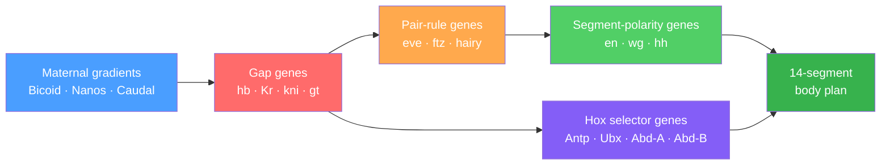

# Gene Regulation in Development

> [!abstract] TL;DR
> During embryonic development, cells read concentration gradients of signalling proteins (morphogens) and convert them into discrete gene-expression zones through transcription-factor thresholds and cis-regulatory logic; Hox selector genes then assign each zone a permanent positional identity, turning a single genome into a multi-segment body plan.

## Intuition — analogy FIRST

Imagine a room with a perfume diffuser running at one end. The scent is strongest right next to the diffuser and fades exponentially toward the far wall. Now imagine three people seated at different distances, each with a different sensitivity threshold: person A sneezes only when the concentration is very high; person B only at medium concentration; person C only when it is almost gone. They never overlap in space — each "gene" is switched on in a precise band determined not by the perfume's identity but purely by its local concentration crossing a threshold hardwired into that person's biology.

This is the French flag model of developmental patterning. The developing fly embryo is that room: a single maternal protein (Bicoid) diffuses away from the anterior pole and decays exponentially across the egg, providing each nucleus with a unique positional coordinate. Each nucleus reads the local concentration against a threshold encoded in its DNA — a cis-regulatory module — and activates the appropriate developmental gene for that position.

---

## How It Works



---

## Key Concepts / Details

### Secondary Level

**The French Flag Model**

Lewis Wolpert (1969) formalised the problem: how does a uniform egg become a patterned embryo? His answer proposes that a single morphogen gradient can specify three distinct territories if cells interpret two concentration thresholds.

- Above threshold 1 (high concentration): **blue** zone — gene A on
- Between threshold 1 and threshold 2: **white** zone — gene B on
- Below threshold 2 (low concentration): **red** zone — gene C on

What matters is the ratio of morphogen concentration to threshold, not absolute amounts — a property called **positional information**. Remove half the embryo and the pattern scales down proportionally because the gradient rescales with it.

**The Drosophila body plan hierarchy**

*Drosophila melanogaster* is the textbook system because its 14-segment body plan is laid out in nested regulatory layers before the embryo even cellularises (nuclei share cytoplasm in a syncytial blastoderm):

1. **Maternal effect genes** — mRNAs deposited asymmetrically by the mother. *bicoid* mRNA anchors at the anterior pole; *nanos* at the posterior. Translation generates opposing protein gradients.
2. **Gap genes** (*hunchback, Krüppel, knirps, giant*) — respond to maternal gradients with broad, non-overlapping expression domains that divide the embryo into anterior, central, and posterior territories.
3. **Pair-rule genes** (*even-skipped, fushi-tarazu, hairy*) — respond to gap gene combinations and are expressed in 7 stripes, each ~2 cells wide, establishing parasegment boundaries with double the resolution of the gap layer.
4. **Segment-polarity genes** (*engrailed, wingless, hedgehog*) — expressed in 14 stripes, one per segment, maintained by cell–cell signalling that locks in the pattern after cellularisation.
5. **Homeotic (Hox) genes** — assign a unique identity to each segment (antenna vs. leg vs. wing-bearing thorax vs. abdomen). Their combinatorial code, not the gradient, determines final morphology.

**Homeotic genes and what goes wrong**

Ed Lewis discovered in the 1970s that loss-of-function mutations in Hox genes transform one body segment into another — *Antennapedia* mutants grow a leg where an antenna should be; *bithorax* mutants grow four wings instead of two. Each Hox protein contains a 60-amino-acid **homeodomain** that binds DNA and controls hundreds of downstream effector genes responsible for building segment-specific structures.

---

### Undergraduate Level

**Quantitative threshold reading: the Bicoid–Hunchback example**

Bicoid is both a morphogen (graded signal) and a transcription factor (activates targets). It activates *hunchback* (*hb*) by binding six sites in the *hb* anterior enhancer cooperatively. The dose-response follows the Hill equation:

$$[\text{Hb}](x) = \frac{[\text{Bcd}(x)]^n}{K^n + [\text{Bcd}(x)]^n}$$

where $n \approx 5$ for Hunchback. The high Hill coefficient converts the graded Bicoid profile into a near-digital switch: Hb is nearly fully on where $[\text{Bcd}] > K$ and nearly off where $[\text{Bcd}] < K$, generating a sharp boundary at ~50% egg length. The same Hill logic operates throughout the patterning cascade — cooperative TF binding transforms continuous gradients into discrete domains.

**Gap gene cross-repression and boundary sharpening**

Adjacent gap genes repress each other via direct TF binding at each other's enhancers. Krüppel represses *knirps* and vice versa. This mutual repression behaves as a bistable switch: once a nucleus has more Krüppel than Knirps, it is driven toward the Krüppel-high state and Knirps is extinguished. Cross-repression **canalises** the graded maternal signal into boundaries sharper than the gradient alone could generate — a general principle of developmental boundary formation.

**The Hox code and anterior-posterior collinearity**

The eight Drosophila Hox genes are arranged in two genomic clusters (ANT-C and BX-C) in the same order along the chromosome as the body segments they regulate — **genomic collinearity**. In vertebrates, two rounds of whole-genome duplication produced four Hox clusters (HoxA–HoxD) on four chromosomes and 39 genes total. Vertebrate Hox genes show both spatial collinearity (3' genes expressed more anteriorly) and **temporal collinearity** (3' genes expressed earlier). Mutations in human Hox genes cause severe malformations: HOXD13 mutations produce synpolydactyly; HOXA13 mutations cause hand-foot-genital syndrome.

**Enhancers as Boolean logic gates: cis-regulatory modules (CRMs)**

A cis-regulatory module (CRM) receives inputs from multiple transcription factors and implements Boolean logic:

| Gate | TF logic | Mechanism |
|------|----------|-----------|
| AND | A **and** B required | Two adjacent binding sites each contribute partial activation; combined occupancy recruits coactivator |
| OR | A **or** B sufficient | Two independent activator sites each able to recruit Mediator |
| NOT (repression) | A but **not** B | Repressor B overlaps A's site (competition) or recruits HDAC to the CRM |
| AND-NOT | A and **not** B | Activator A and repressor B both bind; B overrides A via corepressor |

The *even-skipped* stripe 2 enhancer is the textbook CRM: 480 bp containing binding sites for activators Bicoid and Hunchback (AND gate) and repressors Giant and Krüppel (NOT gates). Stripe 2 is expressed precisely where Bcd/Hb are above threshold AND Giant/Kr are below threshold — a four-input Boolean circuit encoded in 480 nucleotides.

**Shadow enhancers and developmental robustness**

Many developmental genes have a redundant "shadow" enhancer — a second CRM elsewhere in the genome that drives nearly identical spatial expression. The *snail* gene controlling mesoderm fate has a primary enhancer and a shadow enhancer 5 kb away. Deleting either alone produces normal patterning; deleting both causes partial loss of *snail* expression and mesoderm defects.

Shadow enhancers provide **developmental robustness**: one copy buffers against mutations, temperature fluctuations, or stochastic TF variation. They also permit regulatory evolution — one copy can diverge to modify expression while the other maintains ancestral function (regulatory subfunctionalisation).

**Pioneer transcription factors**

Most TFs can only bind already-accessible, nucleosome-free DNA. **Pioneer transcription factors** bind nucleosomal DNA directly, displace H1 linker histone, and recruit chromatin remodellers that open the locus for subsequent TF binding — they establish new regulatory competence in previously silent chromatin.

- **FOXA1 (FoxA1)**: The liver pioneer factor. During hepatocyte differentiation, FOXA1 binds the nucleosomal form of liver-specific enhancers, displaces H1, and recruits SWI/SNF to remodel the nucleosome, enabling HNF4α and other liver TFs to bind. In breast and prostate cancer, FOXA1 pioneering activity determines which enhancers the oestrogen or androgen receptor can access — a direct link between pioneer factor activity and cancer gene expression programmes.
- **OCT4 (POU5F1)**: The pluripotency pioneer. One of Yamanaka's four iPSC reprogramming factors. OCT4 binds compacted somatic chromatin, recruits BRG1 (the SWI/SNF ATPase subunit), and opens chromatin at pluripotency enhancers. Its pioneering activity is rate-limiting for reprogramming efficiency.

---

### Graduate Level

**GRN topology: feedforward loops and bistable switches**

The regulatory connections among developmental TFs form a gene regulatory network (GRN). Network motifs — recurring circuit patterns — appear far above random expectation and implement specific dynamic functions.

*Type 1 coherent feedforward loop (C1-FFL):*

X activates Y; X and Y (AND logic) together activate Z. Consequence: when X turns on, Z is delayed (Z waits for Y to accumulate past threshold). When X turns off, Z turns off immediately. This implements a **sign-sensitive delay** — Z ignores brief pulses of X (noise filtering) but responds to sustained X (bona fide signal). The *even-skipped* stripe formation circuit contains C1-FFLs: Bicoid activates an activating TF (Hunchback), and only their combined, sustained presence activates the target stripe.

*Bistable switch (mutual repression with auto-activation):*

Two TFs A and B repress each other; positive auto-feedback stabilises each state. The system satisfies:

$$\frac{d[A]}{dt} = \frac{k_A [A]^n}{K_A^n + [A]^n} \cdot \frac{K_B^m}{K_B^m + [B]^m} - \delta_A [A]$$

This has two stable fixed points: (A-high, B-low) and (A-low, B-high). A transient signal flips the network from one state to the other, and it remains flipped after the signal is removed — **irreversible cell fate commitment**. In blood progenitor lineage decisions, GATA1 and PU.1 form exactly this mutual-repression toggle: a GATA1 pulse drives erythroid/megakaryocyte fate; a PU.1 pulse drives myeloid fate. See [[Systems_of_ODEs]] for bifurcation analysis tools.

**The sea urchin endomesoderm GRN: a complete regulatory blueprint**

Eric Davidson and colleagues assembled the gene regulatory network for *Strongylocentrotus purpuratus* endomesoderm specification — the first complete developmental GRN at whole-tissue level. Key architectural principles:

1. **Kernel**: A conserved core circuit of ~5 TFs (Otx, Tbr, Ets1, Alx1, FoxN2/3) connected by mutual activations and positive feedback. The kernel is **recursively wired** — each node feeds back onto all others — creating Boolean stability. Removing any single kernel node causes catastrophic failure of skeletogenic mesenchyme formation; the network cannot rewire around it. Kernels are the most evolutionarily conserved parts of developmental GRNs and are found unchanged between sea urchin and sea star, separated by ~500 million years.
2. **Plug-in circuits**: Downstream subcircuits for specific effector functions (biomineralisation gene batteries, cell migration). These can be rewired during evolution without disrupting the kernel — explaining morphological diversity with deep conservation of body plan logic.
3. **Switches**: Incoherent feedforward loops generating transient pulses during state transitions (e.g., Notch signalling input transiently activates Delta before being extinguished, preventing runaway lateral inhibition).
4. **Spatial initialisation**: Nuclear Beta-catenin in vegetal cells breaks symmetry and initiates the GRN. This initial asymmetry is the sole positional input; everything downstream is autonomous GRN logic.

The full network (~50 nodes, ~100 edges) is publicly maintained at http://grns.biotapestry.org and every node has been validated by morpholino knockdown and CRM dissection.

**Enhancer-promoter looping and 3D architecture in Hox regulation**

During vertebrate limb digit identity specification, the HoxD cluster undergoes a global 3D chromatin reorganisation. Hi-C and Micro-C data show that posterior mesenchyme cells switch the *HoxD* cluster from a Polycomb-repressive TAD to an active TAD in which a large regulatory "landscape" containing dozens of enhancers loops to specific *HoxD* gene promoters via cohesin-mediated extrusion. Deleting individual TAD boundary CTCF sites places normally silent HoxD genes under control of ectopic limb enhancers, causing digit number and identity changes — a direct causal link between 3D genome topology and developmental gene regulation.

**ODE models of gap gene patterning**

The Drosophila AP system can be modelled as coupled ODEs. For the simplified two-gene Hunchback–Krüppel interaction:

$$\frac{d[\text{Hb}]}{dt} = \frac{k_1 [\text{Bcd}]^{n_1}}{K_1^{n_1} + [\text{Bcd}]^{n_1}} \cdot \frac{K_3^{n_3}}{K_3^{n_3} + [\text{Kr}]^{n_3}} - \delta_{\text{Hb}} [\text{Hb}]$$

$$\frac{d[\text{Kr}]}{dt} = \frac{k_2}{1 + ([\text{Hb}]/K_2)^{n_2}} \cdot \frac{K_4^{n_4}}{K_4^{n_4} + [\text{Bcd}]^{n_4}} - \delta_{\text{Kr}} [\text{Kr}]$$

At steady state this reproduces complementary Hb (anterior) and Kr (central) expression domains. High Hill coefficients ($n \approx 4$–8) make the system stiff; numerical solution requires implicit solvers such as SciPy's `solve_ivp` with the Radau method.

---

## Python Demo

```python
import numpy as np
import matplotlib.pyplot as plt

# Morphogen gradient simulation — Drosophila A-P axis
# Bicoid decays exponentially from the anterior pole (x = 0.0)
# Caudal (de-repressed by Nanos) accumulates toward the posterior (x = 1.0)
# Threshold logic activates non-overlapping gap gene domains

n_cells = 300
x = np.linspace(0.0, 1.0, n_cells)   # fractional position along A-P axis

# Morphogen gradients (normalised concentration)
lambda_bcd = 0.20    # Bicoid decay length: ~20% of egg length
lambda_cad = 0.22    # Caudal decay length from posterior end

bicoid = np.exp(-x / lambda_bcd)            # peaks at anterior
caudal = np.exp(-(1.0 - x) / lambda_cad)   # peaks at posterior

# Gap gene threshold windows on the Bicoid gradient
# Each gene is active where  lo <= bicoid < hi
# Thresholds calibrated so that:
#   hunchback boundary at x ~ 0.50  (bicoid = exp(-0.5/0.20) ~ 0.082)
#   Kruppel boundary  at x ~ 0.70  (bicoid ~ 0.030)
#   knirps boundary   at x ~ 0.92  (bicoid ~ 0.010)
gap_genes = {
    "hunchback": (0.082, 1.010),   # anterior ~0-50%
    "Kruppel":   (0.030, 0.082),   # central  ~50-70%
    "knirps":    (0.010, 0.030),   # post-central ~70-92%
    "giant":     (0.000, 0.010),   # posterior ~92-100%
}
colors = ["#4a9eff", "#ff6b6b", "#51cf66", "#ffa94d"]

# Build binary expression profiles
profiles = {
    gene: np.where((bicoid >= lo) & (bicoid < hi), 1.0, 0.0)
    for gene, (lo, hi) in gap_genes.items()
}

fig, (ax1, ax2) = plt.subplots(2, 1, figsize=(10, 7), sharex=True)

# Panel 1 — morphogen gradients and threshold markers
ax1.plot(x, bicoid, color="#4a9eff", lw=2.5, label="Bicoid (anterior source)")
ax1.plot(x, caudal, color="#ff6b6b", lw=2.5, label="Caudal (posterior source)")
for col, (lo, _) in zip(colors, gap_genes.values()):
    ax1.axhline(lo, color=col, ls="--", lw=0.8, alpha=0.65)
ax1.set_ylabel("Relative morphogen concentration")
ax1.set_title("Morphogen gradients along the Drosophila A-P axis")
ax1.legend(framealpha=0.9)
ax1.set_ylim(-0.02, 1.12)

# Panel 2 — resulting gap gene expression bands
for i, (gene, expr) in enumerate(profiles.items()):
    ax2.fill_between(x, i + 0.08, i + 0.88,
                     where=expr.astype(bool),
                     color=colors[i], alpha=0.80, label=gene)

ax2.set_yticks([i + 0.48 for i in range(len(gap_genes))])
ax2.set_yticklabels(list(gap_genes.keys()))
ax2.set_xlabel("Fractional A-P position  (0 = anterior, 1 = posterior)")
ax2.set_title("Gap gene expression domains — threshold activation from Bicoid")
ax2.legend(loc="upper right", framealpha=0.9)

plt.tight_layout()
plt.show()

# Expected output:
#   Panel 1 — two crossing exponential curves with dashed threshold markers.
#   Panel 2 — four non-overlapping coloured bands covering the full A-P axis:
#              hunchback (blue, anterior half), Kruppel (red, central),
#              knirps (green, post-central), giant (orange, posterior tip).
# The boundary positions arise solely from threshold crossings of a single gradient
# — exactly the French flag model made quantitative.
```

---

## Real-World Applications

**Hox deregulation in acute myeloid leukemia**

In AML driven by MLL–AF9 translocations (*KMT2A* fusions), the fusion protein constitutively recruits the DOT1L H3K79 methyltransferase to *HOXA* loci, maintaining HOXA9 and HOXA10 at haematopoietic stem cell expression levels in committed myeloid cells. High HOXA9 blocks differentiation and drives proliferation; it is the strongest transcriptomic predictor of poor AML prognosis. The DOT1L inhibitor pinometostat (EPZ-5676) targets this mechanism and is in clinical trials for MLL-rearranged AML — a direct translational consequence of understanding Hox regulatory logic.

**Sonic Hedgehog as a morphogen in vertebrate digit patterning**

SHH secreted from the zone of polarising activity (ZPA) at the posterior limb bud establishes a gradient interpreted by HoxD genes to specify digit identity. Digits 1–5 arise from combinatorial HoxD dosage: HoxD13-dominant posterior cells form digit 5; HoxD11-dominant anterior cells form digit 1. Mutations that flatten the SHH gradient cause polydactyly — confirming that positional information requires a gradient, not simply morphogen presence.

**Pioneer factors in therapeutic cell engineering**

FOXA1 pre-treatment of pancreatic progenitors before beta-cell differentiation improves insulin-expressing cell yield approximately threefold by opening the beta-cell enhancer landscape before lineage-specifying TFs are introduced — demonstrating that pioneering chromatin accessibility is a rate-limiting step in directed differentiation protocols with direct relevance to diabetes cell therapies.

---

## Common Pitfalls

- **Conflating the gradient with the pattern** — Bicoid is graded; gap gene expression is not. The boundary sharpness is imposed by the threshold-reading mechanism (high Hill coefficient plus cross-repression), not by the gradient itself. Saying "Bicoid is expressed in the anterior" correctly locates the protein but misleads students into thinking boundary precision is inherent in the gradient.
- **Assuming Hox proteins are sequence-specific alone** — Different Hox proteins bind nearly identical TAAT-core DNA sequences yet regulate distinct targets. Specificity arises from cofactors (Exd/Pbx TALE-homeodomain heterodimers) that shift binding preference, and from pre-existing chromatin accessibility at target enhancers — not from the Hox homeodomain's intrinsic DNA-binding specificity.
- **Treating CRMs as additive input devices** — Enhancer logic is combinatorial, not linear. Adding an extra activator site to a repressor-saturated CRM does not increase output. Mutagenising individual binding sites in isolation gives misleading results if the remaining sites shift the logical operation of the module.
- **Ignoring shadow enhancers in knockout phenotypes** — A single-enhancer deletion that produces no phenotype does not mean the enhancer is non-functional; a shadow enhancer may compensate. Always survey ChIP-seq (H3K27ac) and ATAC-seq profiles for redundant regulatory elements before concluding an element is dispensable.
- **Conflating pioneer activity with constitutive chromatin accessibility** — Pioneer factors are defined by their ability to bind nucleosomal DNA before chromatin is open. ATAC-seq measured after pioneer overexpression reveals de novo accessible sites; measuring ATAC-seq after differentiation is complete misses the distinction between pioneer-dependent opening and constitutively accessible chromatin and can lead to an underestimate of pioneer activity.
- **Ignoring history in bistable GRN circuits** — A bistable network has different stable states depending on initial conditions. The same instantaneous TF concentration can correspond to either stable state; single time-point measurement of TF levels cannot determine cell fate. Chromatin state (ATAC-seq, H3K27ac ChIP-seq) or lineage history must be assessed alongside TF expression.

---

## Related Concepts

- [[Gene_Regulation_and_Epigenetics]] — foundational mechanisms (TF binding, chromatin remodelling, Polycomb/Trithorax, histone marks) that are deployed in the developmental context described here (Genetics/01_Molecular_Genetics)
- [[Chromatin_Structure_and_Nucleosomes]] — physical substrate on which pioneer factors and SWI/SNF remodellers act; histone variants H3.3 and H2A.Z are enriched at developmental enhancers and mark regulatory-element identity (Genetics/01_Molecular_Genetics)
- [[Transcription_and_RNA_Processing]] — RNA Pol II pausing at developmental gene promoters, enhancer RNA (eRNA) transcription as a readout of CRM activity, and co-transcriptional splicing decisions regulated by developmental TFs (Genetics/01_Molecular_Genetics)
- [[Membranes_and_Cell_Signaling]] — Wnt, Notch, Hedgehog, and FGF receptor signalling pathways that deliver positional signals upstream of the TF circuits described here; Bicoid itself is a TF, but SHH and Wnt are secreted ligands that activate nuclear effectors (Chemistry/06_Biochemistry)
- [[Systems_of_ODEs]] — mathematical framework for modelling GRN dynamics; bifurcation analysis of bistable toggle switches and sign-sensitive delay circuits; stiff ODE solvers required for high-Hill-coefficient patterning models (Mathematics/07_Differential_Equations)
- [[Graph_Representation]] — GRNs are directed, weighted graphs; feedforward loop and bi-fan motif enumeration requires the graph-theoretic formalism and adjacency-list/matrix representations covered here (DSA/07_Graphs)
- [[_MOC_Developmental_and_Epigenetic_Genetics|↑ Developmental and Epigenetic Genetics MOC]]

---

## Review Questions

1. **(Secondary)** A Drosophila embryo loses *bicoid* function entirely. Predict the phenotype (which body regions are lost and which expand?) and explain your reasoning in terms of the French flag model. Why would restoring Bicoid protein only at the very tip of the anterior end not fully rescue the wild-type body plan?

2. **(Undergraduate)** The *even-skipped* stripe 2 enhancer is expressed only in a narrow band at ~25% egg length. Cells anterior to that band have higher Bicoid and Hunchback but also high Giant. Cells posterior to the band have low Giant and low Krüppel but also low Bicoid. Using the AND-NOT Boolean logic gate model, explain why neither population expresses *eve* stripe 2, even though each population satisfies some of the activating conditions.

3. **(Graduate)** The sea urchin endomesoderm kernel is described as "recursively wired" and "resistant to rewiring." (a) Explain mechanistically why recursive positive feedback within the kernel makes it robust to perturbation, while also making it vulnerable to catastrophic failure when a single node is removed. (b) A researcher deletes the Alx1 kernel node and observes complete loss of skeletogenic fate. She then attempts rescue by ectopic Alx1 expression in an adjacent cell type and finds rescue only when the pioneer factor FoxA is co-expressed. Propose a molecular mechanism for why FoxA co-expression is necessary in the ectopic context but not in the endogenous one.

---

## Sources

- Wolpert, L. (1969). "Positional information and the spatial pattern of cellular differentiation." *Journal of Theoretical Biology*, 25(1), 1–47. https://doi.org/10.1016/S0022-5193(69)80016-0
- Driever, W. & Nüsslein-Volhard, C. (1988). "A gradient of bicoid protein in Drosophila embryos." *Cell*, 54(1), 83–93. https://doi.org/10.1016/0092-8674(88)90182-1
- Levine, M. & Davidson, E.H. (2005). "Gene regulatory networks for development." *PNAS*, 102(14), 4936–4942. https://doi.org/10.1073/pnas.0408031102
- Davidson, E.H. et al. (2002). "A genomic regulatory network for development." *Science*, 295, 1669–1678. https://doi.org/10.1126/science.1069883
- Zaret, K.S. & Carroll, J.S. (2011). "Pioneer transcription factors: establishing competence for gene expression." *Genes & Development*, 25, 2227–2241. https://doi.org/10.1101/gad.176826.111
- Levo, M. & Segal, E. (2014). "In pursuit of design principles of regulatory sequences." *Nature Reviews Genetics*, 15, 453–468. https://doi.org/10.1038/nrg3683
- Carroll, S.B., Grenier, J.K. & Weatherbee, S.D. (2005). *From DNA to Diversity: Molecular Genetics and the Evolution of Animal Design*, 2nd ed. Blackwell.
- [Dynamic patterning by morphogens illuminated by cis-regulatory studies — PubMed](https://pubmed.ncbi.nlm.nih.gov/33472851/)
- [Beyond the French Flag Model: Exploiting Spatial and Gene Regulatory Interactions for Positional Information — PLOS One](https://journals.plos.org/plosone/article?id=10.1371%2Fjournal.pone.0163628)

---

#Genetics #DevelopmentalGenetics #GeneRegulation #Development
