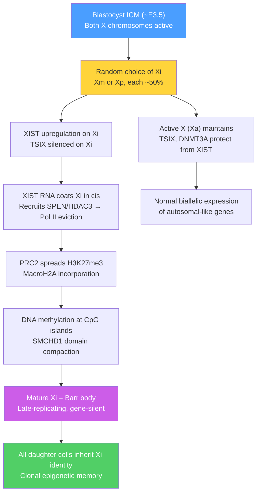

# Genomic Imprinting and X Inactivation

> [!abstract] TL;DR
> Genomic imprinting silences one parental copy of ~100 mammalian genes based solely on which parent donated it; X chromosome inactivation silences an entire X chromosome in every female somatic cell — both are epigenetic mechanisms that lock gene expression to parental identity rather than DNA sequence, and mutations that disrupt them cause some of the most clinically distinctive developmental syndromes in medicine.

---

## Intuition — analogy FIRST

**Genomic imprinting analogy:** Imagine a shared family recipe book where your mother has marked certain pages "use *only* my version" and your father has marked different pages "use *only* my version." Each child receives one book from each parent, but for the marked recipes, the instruction is pre-stamped by who gave it — only Mum's apple pie recipe is ever read, and only Dad's bread recipe is ever read, regardless of whether the other copy has identical words. That per-page parental stamp is genomic imprinting: which allele is active depends not on its sequence, but on which parent's germline it passed through.

**X inactivation analogy:** A company has two backup servers (the two X chromosomes in a female cell). Running both at full power creates chaotic conflicts. Early in the company's founding, management randomly designates one server as the primary and wraps the other in a thick dust cover — it's still present in the server room (the nucleus), visible as a grey lump (Barr body), but essentially off. Every branch office that opens later inherits the same server assignment as its parent office — the dust cover is maintained through all subsequent divisions. Different offices in the same building may have chosen different servers to cover, making the building a mosaic of both server configurations.

---

## How It Works

### Genomic Imprinting: Core Mechanics

Imprinting is established, maintained, and erased in three phases across the mammalian life cycle:

1. **Erasure** — in primordial germ cells (PGCs) migrating to the gonad (~E9.5–E13.5 in mice), existing methylation marks at imprinting control regions (ICRs) are wiped by TET-mediated oxidative demethylation and passive dilution during rapid proliferation.
2. **Establishment** — in the maturing gonad, sex-specific ICR methylation is written de novo by DNMT3A (aided by the non-catalytic paralogue DNMT3L):
   - In **oogenesis**: maternally imprinted ICRs become methylated (e.g., *SNRPN* ICR, *H19* ICR).
   - In **spermatogenesis**: paternally imprinted ICRs become methylated (e.g., *IGF2R*, *KCNQ1OT1* ICR).
3. **Maintenance** — after fertilisation, the global demethylation wave that erases somatic epigenetic marks spares imprinted ICRs; DNMT1 maintains their hemi-methylation pattern through every subsequent mitotic division in the embryo.

Approximately **100 imprinted genes** are known in mammals, clustered in ~15 chromosomal domains, each organised around one or a few ICRs.

### The IGF2/H19 Locus — CTCF Insulator Model

The best-characterised imprinted locus illustrates how a single differentially methylated region (DMR) can simultaneously control two genes in opposite directions:

- **Maternal allele**: the ICR upstream of *H19* is **unmethylated**. The insulator protein **CTCF** binds and blocks the downstream shared enhancers from looping to *IGF2*, ~80 kb away. *H19* lncRNA is expressed from the maternal allele; *IGF2* is silenced.
- **Paternal allele**: the same ICR is **methylated** (established in spermatogenesis). Methylated DNA blocks CTCF binding. The shared enhancers now freely loop to *IGF2*, activating it. *H19* is silenced (its promoter is also methylated). Paternal *IGF2* encodes insulin-like growth factor 2, a potent fetal growth promoter.

This one DMR therefore creates reciprocal, parent-of-origin-specific monoallelic expression of both genes — a molecular toggle controlled entirely by methylation at the insulator.

### KCNQ1OT1 — ncRNA-Based Imprinting

On chromosome 11p15.5, the *KCNQ1OT1* locus (also called *LIT1*) encodes a long non-coding RNA expressed exclusively from the **paternal** allele. *KCNQ1OT1* RNA spreads in *cis* along the paternal chromosome and recruits PRC2 (writing H3K27me3) and G9a (writing H3K9me2) to silence multiple flanking genes in placental tissue. On the maternal allele, the *KCNQ1OT1* ICR is methylated, suppressing the ncRNA — maternal genes in the cluster are therefore active. This parallels the XIST mechanism and highlights how nuclear lncRNAs are a recurring solution to dosage control.

### X Chromosome Inactivation — Lyon Hypothesis

Mary Lyon proposed in 1961 that one X chromosome is inactivated in every female somatic cell; subsequent work defined four key properties:

1. **Random**: in each cell of the inner cell mass (~E3.5–E6.5 in mice), either the maternal Xm or the paternal Xp is chosen for inactivation with approximately equal probability — no predictable rule.
2. **Irreversible in soma**: once chosen, the inactive X (Xi) is clonally maintained through all subsequent mitoses. Every descended cell in a patch of tissue inactivates the same X. Adult females are therefore somatic **mosaics** of two cell populations.
3. **Imprinted XCI in extra-embryonic tissues**: in the trophectoderm and primitive endoderm lineages, the **paternal X is always inactivated** (imprinted XCI), suggesting a default silencing of the paternal X that must be actively reversed in the embryo proper.
4. **Incomplete**: ~15–25% of X-linked genes **escape** inactivation — they continue to be expressed from both alleles. Genes in the pseudoautosomal regions (PAR1, PAR2) escape universally; a further ~12% escape variably across tissues.

### XIST and Chromatin Propagation

The molecular execution of XCI is orchestrated by **XIST** (*X-Inactive Specific Transcript*), a ~19 kb lncRNA transcribed exclusively from the Xi:

1. XIST RNA is expressed at low levels from both alleles before XCI; upon onset, monoallelic upregulation occurs on the future Xi through regulatory competition involving *TSIX* (an antisense lncRNA active on the active X).
2. XIST RNA **coats the Xi in cis**, spreading outward from the X inactivation centre (Xic).
3. XIST recruits **SPEN** (SHARP), which dismisses RNA Pol II through HDAC3-mediated histone deacetylation — the earliest silencing event.
4. Subsequent layers consolidate silence: PRC2 spreads **H3K27me3** across the Xi; SMCHD1 compacts large domains; DNA methylation at CpG islands locks the state permanently.
5. The mature Xi replicates **late in S phase**, is enriched for the histone variant macroH2A, and forms a compact dense body — the **Barr body** — visible at the nuclear periphery.

The number of Barr bodies in a nucleus is always **n − 1**, where n is the number of X chromosomes: XX females have 1 Barr body; XXX females have 2; XY males have 0; XXY (Klinefelter) males have 1.

### XCI Architecture Diagram



---

## Key Concepts / Details

### Secondary Level

**Why does imprinting exist? The Kinship (Haig) Theory:**

David Haig's **evolutionary conflict hypothesis** (1991) proposes that imprinting evolved because maternally and paternally derived genes have opposing fitness interests in the context of polygamous species:

- **Paternally expressed genes** (e.g., *IGF2*) are predicted to maximise nutrient extraction from the mother, because the father's genes benefit most from a large, well-nourished offspring (his genes are not in future offspring the mother might have with other males).
- **Maternally expressed genes** (e.g., *H19*, *IGF2R*) are predicted to *limit* fetal growth — the mother's genes are represented equally in all her offspring, so conserving maternal resources for future pregnancies is favoured.

This predicts that paternally expressed genes should be **growth-promoting** and maternally expressed genes should be **growth-restricting** — a pattern strongly supported by the mouse knockout data. *Igf2* paternal knockout = small mice; *Igf2r* maternal knockout = large mice with excess IGF2 signalling. The conflict theory also predicts imprinting would be found in placental mammals (where maternal resource transfer is greatest) but not in egg-laying vertebrates — broadly consistent with data.

**Imprinting disorders — the same deletion, opposite phenotypes:**

The chromosome **15q11-q13** region contains two distinct imprinted domains:

| Feature | Prader-Willi Syndrome (PWS) | Angelman Syndrome (AS) |
|---|---|---|
| Affected allele | Paternal (loss of paternal 15q11-q13) | Maternal (loss of maternal 15q11-q13) |
| Mechanism | Deletion (70%) or maternal UPD 15 (25%) | Deletion (70%) or paternal UPD 15 (7%) or UBE3A point mutation (15%) |
| Paternally expressed genes lost | SNRPN, SNORD116 snoRNAs, NDN, MAGEL2 | (these are intact) |
| Maternally expressed gene lost | (intact) | UBE3A (neuron-specific imprinting of paternal allele) |
| Key features | Hypotonia, hyperphagia, obesity, hypogonadism, mild intellectual disability | Seizures (80%), absent speech, ataxic gait, happy sociable demeanour, severe intellectual disability |

The same 5–6 Mb deletion on chromosome 15 produces **completely different diseases** depending purely on whether the deleted chromosome came from the father (PWS) or the mother (AS). This is the clinical proof-of-concept that demonstrates genomic imprinting is a real, pathologically relevant phenomenon.

**Beckwith-Wiedemann Syndrome (BWS):**

BWS results from dysregulation of the 11p15.5 imprinting cluster (the *IGF2/H19* and *KCNQ1OT1* domains):
- Loss of maternal methylation at the *KCNQ1OT1* ICR (50%) → biallelic *KCNQ1OT1* expression → silencing of normally maternal genes (*CDKN1C*)
- Paternal uniparental disomy (UPD) of 11p15 (20%) → biallelic paternal dosage of *IGF2*, loss of maternal *H19*
- Gain of methylation at the *H19* ICR (5%) → biallelic *IGF2* activation

Clinical features: macrosomia, macroglossia, hemihypertrophy, abdominal wall defects, **Wilms tumour risk (~7%)**. BWS illustrates that ICR methylation errors can act in either direction — hypo or hypermethylation — and both disrupt growth.

**Silver-Russell Syndrome (SRS):**

The mirror image of BWS: undergrowth with relative macrocephaly and body asymmetry. Most common cause is hypomethylation of the paternal *H19* ICR (~50%) — CTCF now binds the paternal allele, blocking *IGF2* from both chromosomes → severe IGF2 deficiency → intrauterine growth restriction. Maternal UPD of chromosome 7 (10%) also causes SRS through an uncharacterised imprinted locus on 7p. SRS highlights that the same ICR can be disrupted in the opposite direction from BWS, producing the phenotypic opposite.

---

### Undergraduate Level

**ICR methylation — establishment and maintenance in molecular detail:**

ICR methylation is established during gametogenesis by a complex of **DNMT3A + DNMT3L**. DNMT3L has no catalytic activity but acts as a co-factor: its PHD-domain reads **unmethylated H3K4** (the mark of transcriptionally permissive chromatin). Because actively transcribed regions carry H3K4me3, DNMT3L binding (and therefore *de novo* methylation) is blocked at those sites — ensuring imprints are written only on appropriately prepared chromatin. In the mature gamete, ICR methylation is maintained by DNMT1 at each S phase via the hemi-methylated intermediate, but is specifically protected from the post-fertilisation demethylation wave by the zinc-finger proteins **ZFP57** (in mice; *ZFP57* mutations in humans cause multi-locus imprinting disturbance) and its binding partner **TRIM28/KAP1**, which recruits the NuRD complex to locally maintain H3K9me3 and DNA methylation together.

**Escape from X inactivation — molecular basis:**

Genes that escape XCI share several features distinguishing them from silenced genes on Xi:
- They retain **H3K27ac** and **H3K4me3** marks associated with active chromatin even on the Xi.
- They are frequently found in **topological compartments** that are insulated from XIST-spreading domains by strong CTCF boundary elements.
- Many escape genes lack the **repeat elements** (especially LINE-1 elements) that are hypothesised by Mary Lyon's "way-station" model to propagate silencing signals along the chromosome. LINE-1-poor regions are more likely to contain escape genes.

Physiologically, escape matters for **Turner syndrome (45,X)**: females with only one X have no inactive X, yet they show a phenotype (short stature, gonadal dysgenesis, lymphedema, aortic coarctation) that differs from normal XX females — because the second X normally contributes expressed alleles from escape genes that haploinsufficiency abolishes in 45,X individuals. The most important is *SHOX* (short stature homeobox gene) in PAR1, which explains the skeletal phenotype of Turner syndrome.

**XIST regulation — the competition model:**

Before XCI, both X chromosomes express low levels of XIST. The antisense lncRNA **TSIX** is transcribed across the XIST locus on the future active X (Xa) and suppresses XIST in *cis*, partly through the action of the non-coding RNA **XITE** (X-inactivation intergenic transcription elements). On the future Xi, TSIX is downregulated by mechanisms that remain partially unclear; XIST then undergoes a dramatic ~100-fold upregulation in a positive-feedback loop. Pluripotency factors (OCT4, NANOG, SOX2) repress XIST in ES cells, explaining why XCI onset is coupled to loss of pluripotency at implantation. **Reprogramming to iPSCs reactivates** the silent X chromosome in ~30–50% of human iPSC lines, demonstrating that XCI is not fully irreversible once the pluripotent state is restored.

**Uniparental disomy (UPD) as proof of imprinting:**

UPD occurs when both copies of a chromosome pair are inherited from the **same parent**. In the absence of mutation, both alleles are sequence-normal — yet if the chromosome carries imprinted genes, the individual lacks either the paternal or the maternal epigenotype and develops an imprinting disorder:
- Maternal UPD 15 (both chromosomes 15 from mother) → no paternal SNRPN/SNORD116 → **Prader-Willi syndrome** despite no deletion
- Paternal UPD 15 → no maternal *UBE3A* (neuron-specific) → **Angelman syndrome** despite no deletion
- Paternal UPD 11p15 → biallelic *IGF2*, no *H19* → **Beckwith-Wiedemann syndrome**

UPD cases were historically crucial because they proved imprinting disorders could occur without any detectable sequence change, establishing that parental identity of the chromosome itself carries functional information.

---

### Graduate Level

**Three-dimensional organisation of imprinted domains:**

Imprinted gene clusters are not randomly distributed in nuclear space. Hi-C and Micro-C data reveal that imprinted loci are organised into **sub-TAD loops** where ICRs serve as anchor points. At the *IGF2/H19* locus, the CTCF-bound maternal ICR forms a loop that physically brings *H19* and the shared enhancers into contact, spatially sequestering the enhancers from *IGF2*. On the paternal allele, loss of CTCF at the methylated ICR collapses this loop, allowing a different loop topology in which the enhancers directly contact the *IGF2* promoter. Deletions of CTCF sites at ICRs therefore do not merely affect local binding — they alter megabase-scale chromatin topology and disrupt dosage control of the entire domain, explaining the severe and reproducible phenotypes that arise from small structural variants at imprinted loci.

**XIST interactome and phase-separated silencing:**

ChIRP-MS and dCas13-APEX proximity labelling have identified >80 proteins that associate with XIST RNA on the Xi. Key modules:
- **SPEN–HDAC3**: recruited by XIST repeat A; responsible for the first wave of transcriptional silencing by deacetylating histones and displacing elongating RNA Pol II
- **HNRNPK–PRC1**: XIST repeat B/C region; HNRNPK scaffolds non-canonical PRC1 to deposit H2AK119ub1 before H3K27me3, suggesting H2Aub precedes PRC2 recruitment
- **SMCHD1**: a non-SMC chromatin organisational protein that merges early XIST-seeded domains into the contiguous Xi compartment; loss of SMCHD1 produces partial derepression of Xi genes in a locus-specific pattern that overlaps with the facioscapulohumeral muscular dystrophy (FSHD2) gene
- **SHARP/SPEN IDR**: SPEN contains an intrinsically disordered region that may undergo phase separation, concentrating HDAC3 activity in a liquid-like compartment at the Xi — consistent with its large, coherent gene-silencing effect across the entire chromosome

The Xi itself forms a bipartite 3D structure detectable by super-resolution microscopy: an outer shell enriched for XIST RNA and PRC2, and an inner core containing Polycomb-repressed genes. This Barr body architecture is not simply a collapsed chromosome — it is a stereotyped nuclear compartment assembled by the lncRNA scaffold.

**Imprinting and cancer — loss of imprinting (LOI):**

In normal somatic cells, the ICR at *IGF2/H19* maintains monoallelic *IGF2* expression. In ~30–60% of Wilms tumours (pediatric kidney cancers) and colorectal cancers, the maternal ICR loses its CTCF-binding methylation — producing **biallelic *IGF2* expression** (loss of imprinting, LOI). LOI doubles the IGF2 protein available to activate IGF1R-PI3K-mTOR mitogenic signalling. Critically, LOI at *IGF2* has been detected in normal-appearing colonic mucosa in patients with colorectal cancer, suggesting it is a **field defect** and early initiating event rather than a late progression marker. This makes *IGF2* LOI one of the few epigenetic changes proposed as a cancer biomarker for at-risk screening.

**Clinical detection — methylation-specific PCR and MS-MLPA:**

Molecular diagnosis of imprinting disorders relies on distinguishing the methylation status of each parental allele at ICRs:
- **Methylation-specific PCR (MS-PCR)**: sodium bisulfite converts unmethylated cytosines to uracil but leaves 5-methylcytosine intact; primers specific to the converted or unconverted sequence amplify only the unmethylated or methylated allele respectively. Loss of the normal band, or gain of the abnormal band, diagnoses methylation defects.
- **MS-MLPA (methylation-sensitive multiplex ligation-dependent probe amplification)**: simultaneously interrogates methylation status AND copy number across dozens of probes in a single reaction — distinguishing deletion, UPD, and ICR epimutation in a single assay. It is the current first-tier test for PWS, AS, BWS, and SRS in clinical genetics laboratories.

---

## Python Demo

```python
# pip install numpy matplotlib
# Simulate random X inactivation across a tissue:
# Each founder cell independently inactivates maternal (0) or paternal (1) X.
# Clonal expansion grows each founder cell into a patch.
# Plot the resulting mosaic pattern across the tissue.

import numpy as np
import matplotlib.pyplot as plt

rng = np.random.default_rng(seed=42)

N_FOUNDERS = 16      # founder cells in the inner cell mass that contribute to tissue
TISSUE_SIZE = 80     # tissue grid side length (pixels)
CELLS_PER_FOUNDER = TISSUE_SIZE * TISSUE_SIZE // N_FOUNDERS

# Each founder independently chooses which X to inactivate
founder_xi = rng.integers(0, 2, size=N_FOUNDERS)   # 0 = maternal Xi, 1 = paternal Xi

# Build tissue: assign each pixel to a founder cell's clone
# Use a Voronoi-like assignment via random seed points
seed_x = rng.integers(0, TISSUE_SIZE, size=N_FOUNDERS)
seed_y = rng.integers(0, TISSUE_SIZE, size=N_FOUNDERS)

tissue = np.zeros((TISSUE_SIZE, TISSUE_SIZE), dtype=int)
for row in range(TISSUE_SIZE):
    for col in range(TISSUE_SIZE):
        dists = np.sqrt((seed_x - col) ** 2 + (seed_y - row) ** 2)
        nearest = np.argmin(dists)
        tissue[row, col] = founder_xi[nearest]   # 0 or 1

# Compute patch statistics
paternal_xi_fraction = tissue.mean()
print(f"Founder cells: {N_FOUNDERS}")
print(f"XCI choices per founder: {founder_xi.tolist()}")
print(f"Tissue fraction with paternal Xi inactive: {paternal_xi_fraction:.2f}")
print(f"Tissue fraction with maternal Xi inactive:  {1 - paternal_xi_fraction:.2f}")
print()
print("Expected (fair coin per founder):")
expected_frac = founder_xi.mean()
print(f"  Observed paternal-Xi fraction among founders: {expected_frac:.2f}")
print("  Tissue proportion deviates from 50:50 due to stochastic founder sampling")

# Plot mosaic
fig, axes = plt.subplots(1, 2, figsize=(12, 5))

cmap = plt.cm.RdBu
axes[0].imshow(tissue, cmap=cmap, vmin=0, vmax=1, interpolation='nearest')
axes[0].set_title(
    f"X Inactivation Mosaic\n"
    f"Blue = maternal Xi inactive (Xa = paternal)\n"
    f"Red  = paternal Xi inactive (Xa = maternal)"
)
axes[0].set_xlabel("Cell column")
axes[0].set_ylabel("Cell row")
axes[0].scatter(seed_x, seed_y, c='yellow', s=60, marker='*',
                edgecolors='black', linewidths=0.5, label='Founder cells', zorder=5)
axes[0].legend(loc='lower right', fontsize=8)

# Bar chart of founder XCI choices
labels = [f"F{i+1}" for i in range(N_FOUNDERS)]
colors = ['steelblue' if xi == 0 else 'tomato' for xi in founder_xi]
axes[1].bar(labels, [1] * N_FOUNDERS, color=colors, edgecolor='white')
axes[1].set_title("Founder cell XCI choices\nBlue = maternal Xi  |  Red = paternal Xi")
axes[1].set_xlabel("Founder cell")
axes[1].set_ylabel("Count")
axes[1].set_ylim(0, 1.5)
axes[1].tick_params(axis='x', rotation=45)

plt.tight_layout()
plt.savefig("x_inactivation_mosaic.png", dpi=150)
plt.show()

# Key result: with only ~16 founders, substantial deviation from 50:50
# can occur by chance — leading to 'skewed' X inactivation in real tissues.
# In some women, >90% of cells inactivate the same X (extreme skewing),
# which can either unmask carrier phenotypes (if the wild-type X is preferentially
# inactivated) or protect carriers (if the mutant-allele X is preferentially inactive).
```

---

## Real-World Applications

**Calico cats and tortoiseshell X mosaicism:** The orange (*Xo*) and black (*X+*) coat colour alleles in cats are X-linked. Female cats heterozygous for both alleles are mosaic: patches of cells expressing *Xo* produce orange fur; patches expressing *X+* produce black fur; both produce white in the absence of pigment. The resulting tortoiseshell or calico coat is visible physical proof of X inactivation mosaicism. Male calico cats (XXY, Klinefelter equivalent) exist but are rare (~1/3,000) and nearly always sterile.

**Imprinting-based tumour suppression:** Wilms tumour (nephroblastoma) arises when *WT1* (11p13) mutations combine with loss of imprinting at *IGF2* (11p15.5). The *IGF2* LOI doubles growth factor signalling, providing a proliferative advantage to cells that acquire the *WT1* hit. Understanding this two-hit-plus-epigenetics model has informed risk stratification: children with BWS (known 11p15 imprinting errors) are surveyed with abdominal ultrasound every 3 months until age 7 — a direct clinical application of imprinting biology.

**CRISPR-based imprinting therapy for Angelman syndrome:** The paternal *UBE3A* allele is silenced in neurons by the paternal *UBE3A-ATS* antisense transcript. Antisense oligonucleotides (ASOs) that reduce *UBE3A-ATS* levels can reactivate paternal *UBE3A* in mouse models, rescuing electrophysiological and behavioural deficits. Clinical trials using intrathecal ASO (GTX-102, GeneTx / Ultragenyx) are ongoing in AS patients; preliminary data show improvements in development and EEG abnormalities. This represents one of the first examples of a targeted epigenetic therapy that acts by unsilencing an already-present imprinted allele rather than delivering exogenous gene.

---

## Trade-offs

| Aspect | Benefit | Cost |
|--------|---------|------|
| X inactivation (dosage compensation) | Equalises X-linked gene product levels between XX and XY | Creates somatic mosaicism; carrier females variably express X-linked disease alleles depending on skew |
| Genomic imprinting (parent-of-origin expression) | Resolves parental genomic conflict; may fine-tune fetal growth | Single functional allele = haploinsufficiency from one hit; UPD or deletion causes disease with no second mutation |
| Incomplete XCI escape | Preserves haploinsufficiency protection for ~15–25% of genes | Turner (45,X) phenotype from loss of escape gene dosage; XXX/XXY phenotypes from partial over-dosage |
| ICR methylation stability | Maintained with >95% fidelity across thousands of cell divisions | Stochastic epimutation events cause sporadic imprinting disorders; assisted reproduction (IVF/ICSI) slightly elevates BWS and AS risk |

---

## When to Use vs Avoid (Diagnostic Framing)

**Consider an imprinting disorder when:**
- Child presents with growth abnormality (macro- or microsomia) plus additional features (tongue, ears, hemihypertrophy, abdominal wall defect) — think BWS or SRS.
- Neonatal hypotonia with subsequent hyperphagia and obesity — think PWS.
- Intellectual disability with absent speech, happy demeanour, seizures — think AS.
- Molecular tests show no sequence mutation but a clinical phenotype consistent with a single-gene disorder on an imprinted chromosome.

**Do not rely on standard sequencing alone when:**
- Phenotype matches an imprinting disorder — deletion, UPD, and ICR epimutation all produce the same disease but are invisible to exome sequencing; use MS-MLPA or methylation arrays (850K EPIC array).
- A deletion on chr 15q11-q13 is found — must determine parental origin (FISH with parental samples, SNP array with UPD analysis) before counselling.

---

## Common Pitfalls

- **Assuming the deletion side predicts PWS vs AS** — the rule is *which parent's allele is lost*, not which chromosomal region. A maternal 15q11-q13 deletion causes AS; a paternal deletion causes PWS. Students often memorise region without direction. Always ask: is the deleted chromosome maternal or paternal?
- **Confusing Barr body number with X count** — Barr bodies = n − 1, where n = number of X chromosomes. A 47,XXX female has 2 Barr bodies, not 3; a 46,XY male has 0, not 1. The formula is n − 1, not n.
- **Treating XCI as complete gene silencing** — ~15–25% of genes escape. Claiming "all genes on the inactive X are silenced" is incorrect and clinically important: the incomplete escape explains Turner syndrome features in 45,X, and variable escape explains why XXX and XXY individuals have milder-than-expected phenotypes relative to autosomal trisomies.
- **Treating imprinting as synonymous with methylation** — methylation is the primary mark at ICRs, but the downstream silencing involves H3K27me3 (Polycomb), H3K9me2/3, and ncRNA mechanisms. Imprinting can occur at some loci where the primary ICR mark is histone-based rather than DNA methylation (e.g., paternal H3K27me3 at some loci in early embryo before methylation is established).
- **Assuming IVF-conceived children have the same imprinting risks as naturally conceived children** — multiple studies report a 2–9 fold elevated risk of BWS in IVF/ICSI offspring (~1/4,000 vs background ~1/14,000), likely because in vitro culture and ovarian stimulation perturb *de novo* methylation at ICRs during oogenesis or early embryo development. This is clinically significant for genetic counselling of assisted reproduction families.
- **Confusing maternal UPD with maternal imprinting** — "maternal UPD" means both chromosomes came from the mother, so the paternally expressed genes are missing. It is easy to reverse the direction: maternal UPD 15 → PWS (no paternal genes), paternal UPD 15 → AS (no maternal *UBE3A*). A consistent mnemonic: UPD gives you two copies of one parent, so you're missing the *other* parent's contribution.

---

## Related Concepts

- [[Gene_Regulation_and_Epigenetics]] — covers the broader epigenetic machinery (DNA methylation, histone modifications, Polycomb/Trithorax, ncRNAs including XIST) that executes imprinting maintenance and Xi silencing; also discusses XIST as the paradigm lncRNA
- [[Chromatin_Structure_and_Nucleosomes]] — the Barr body is a chromatin-level phenomenon; TAD reorganisation of the Xi and ICR-anchored loops at imprinted loci require understanding nucleosome packaging and 3D genome architecture
- [[Chromosomal_Theory_of_Inheritance]] — X-linked inheritance, Turner syndrome, Klinefelter syndrome, and the concept of sex chromosomes as a special chromosome class are grounded here; also covers X-inactivation in the context of sex-linked gene expression
- [[_MOC_Developmental_and_Epigenetic_Genetics|↑ Developmental and Epigenetic Genetics MOC]]

---

## Review Questions

1. A newborn presents with severe hypotonia and feeding difficulties; DNA analysis reveals a normal karyotype (46,XY) but methylation-specific PCR shows loss of the paternal methylation pattern at the SNRPN ICR. What disorder is likely, and what molecular mechanisms (deletion, UPD, or ICR epimutation) could each produce this methylation result? How would you distinguish between them using a single molecular test?

2. A female mouse has a heterozygous loss-of-function mutation in a gene on the X chromosome that is known to escape XCI in ~30% of cells. A male mouse with the same mutation is severely affected. Predict the phenotype of the female, and explain how the proportion of cells in which the gene escapes XCI would affect your prediction. What additional experiment would confirm whether escape is the key variable?

3. The Haig kinship theory predicts that paternally expressed imprinted genes should promote growth and maternally expressed genes should limit it. How well does this prediction hold for *IGF2*, *H19*, *IGF2R*, *CDKN1C*, and *KCNQ1OT1*? Identify one imprinted gene that does not fit the simple growth-conflict prediction and propose an alternative evolutionary explanation for its imprinting.

---

## Sources

- Barlow, D.P. & Bartolomei, M.S. (2014). "Genomic imprinting in mammals." *Cold Spring Harbor Perspectives in Biology*, 6, a018382. https://doi.org/10.1101/cshperspect.a018382
- Haig, D. (2004). "Genomic imprinting and kinship: how good is the evidence?" *Annual Review of Genetics*, 38, 553–585.
- Lyon, M.F. (1961). "Gene action in the X-chromosome of the mouse." *Nature*, 190, 372–373.
- Brockdorff, N. et al. (2020). "The product of the mouse Xist gene is a 15 kb inactive X-specific transcript containing no conserved ORF and located in the nucleus." *Cell*, 71, 515–526 [historic]; see also updated review: Brockdorff, N. (2017). "Polycomb complexes in X chromosome inactivation." *Philosophical Transactions of the Royal Society B*, 372, 20170021.
- Kalish, J.M. et al. (2014). "Beckwith-Wiedemann syndrome." In *GeneReviews* [Internet]. https://www.ncbi.nlm.nih.gov/books/NBK1384/
- Cassidy, S.B. et al. (2012). "Prader-Willi syndrome." *Genetics in Medicine*, 14, 10–26.
- Gallagher, R.C. et al. (2002). "Epigenetic changes in patients with Angelman syndrome." *American Journal of Medical Genetics*, 111, 243–250.
- Berletch, J.B. et al. (2011). "Genes that escape from X inactivation." *Human Genetics*, 130, 237–245.
- Colvin, E.K. et al. (2022). "XIST RNA structure and function." *Wiley Interdisciplinary Reviews: RNA*, e1757.

---

#Genetics #DevelopmentalGenetics #Imprinting #XInactivation
