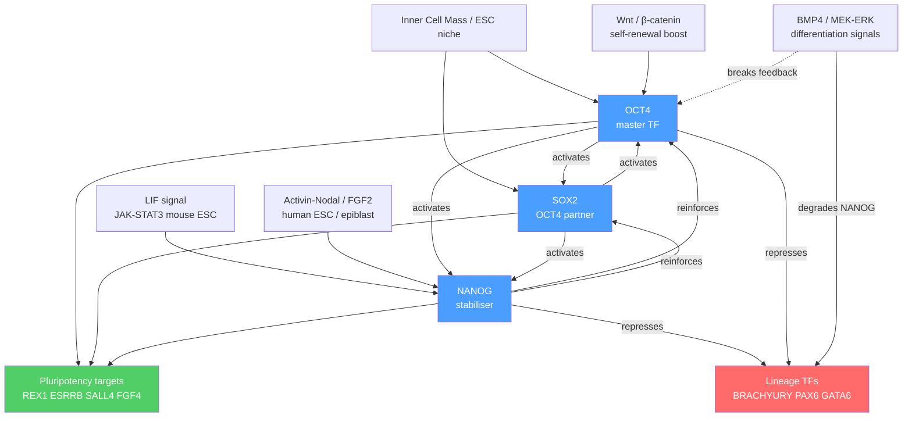

# Stem Cells and Pluripotency

> [!abstract] TL;DR
> Stem cells are undifferentiated cells that balance unlimited self-renewal with the ability to generate specialised progeny; pluripotency — the capacity to form any of the ~200 cell types in the body — is maintained by a small network of transcription factors (OCT4, SOX2, NANOG) operating on a distinctively open, bivalent chromatin landscape, and can be artificially re-installed in adult somatic cells by the four Yamanaka factors to produce induced pluripotent stem cells (iPSCs) with vast biomedical potential.

---

## Intuition — analogy FIRST

Think of the developing embryo as a **freshly opened box of modelling clay.** The clay is uniform, pliable, and can be shaped into anything — a tree, a face, a vehicle. That is the pluripotent stem cell: maximum potential, minimum commitment. As a sculptor's hands guide the clay into a permanent shape — a fired ceramic bowl — the cell's options narrow and eventually lock. The bowl cannot become a vase once it has been kiln-fired.

What Yamanaka showed in 2006 is that you can, in effect, **melt the fired bowl back into soft clay**: introduce four regulatory proteins into an adult skin cell and watch it revert to pluripotency, erasing decades of developmental commitment. It is the biological equivalent of undoing the firing by hitting clay with enough heat from a different direction. This *reprogramming* demolishes the epigenetic barriers that kept differentiation irreversible — and opens the door to patient-matched stem cells for disease modelling and, ultimately, regenerative medicine.

---

## How It Works

### The Pluripotency Transcription Factor Network

The core circuit that maintains pluripotency is a small mutual-activation network centred on three transcription factors:

- **OCT4 (POU5F1):** A POU-domain TF that acts as the master regulator. Its dosage is critical — halving OCT4 causes trophectodermal differentiation; doubling it causes primitive endoderm or mesoderm formation. OCT4 is expressed exclusively in the inner cell mass (ICM), primordial germ cells, and pluripotent stem cells.
- **SOX2:** An HMG-box TF that forms an obligate heterodimer with OCT4. The OCT4:SOX2 complex binds a composite motif on hundreds of pluripotency gene enhancers and co-activates targets including *Nanog*, *Rex1*, *Esrrb*, and *Fgf4*.
- **NANOG:** A homeodomain TF that provides a stabilising positive-feedback loop; NANOG occupies the same enhancers as OCT4/SOX2 and reinforces their expression. Unlike OCT4 and SOX2, NANOG expression is heterogeneous (noisy) even within a pluripotent population — cells fluctuate between NANOG-high (highly pluripotent, primed for self-renewal) and NANOG-low (primed to differentiate) states.

Together, OCT4, SOX2, and NANOG form a **three-node positive feedback loop**: each factor activates the other two, creating a stable high-expression attractor (pluripotent state) separated from a low-expression attractor (differentiated state) by an energy barrier.

### Core Circuit and Signalling Inputs



---

## Key Concepts / Details

### Secondary Level

**Three categories of stem cell:**

| Type | Example | Potency | Self-renewal |
|------|---------|---------|--------------|
| Embryonic stem cell (ESC) | Derived from blastocyst ICM | Pluripotent | Unlimited in culture |
| Induced pluripotent stem cell (iPSC) | Fibroblast reprogrammed by OCT4/SOX2/KLF4/cMYC | Pluripotent | Unlimited in culture |
| Adult / somatic stem cell | Hematopoietic (HSC), Neural, Intestinal Lgr5+ | Multipotent to unipotent | Limited; sustained by niche |

**ESC derivation:** Mouse ESCs were first derived by Evans & Kaufman and Martin (1981) from the inner cell mass (ICM) of the mouse blastocyst. Human ESCs were derived by Thomson et al. in 1998. ESCs require specific niche signals to maintain pluripotency: mouse ESCs need LIF (signals through JAK-STAT3) and optionally BMP4; human ESCs instead require Activin-A/TGF-β and FGF2, reflecting a slightly later developmental epiblast-like state. The critical ethical issue is that deriving ESCs destroys the embryo.

**iPSC reprogramming — the Yamanaka breakthrough:** In 2006 Takahashi and Yamanaka showed that retroviral delivery of just four transcription factors — OCT4, SOX2, KLF4, and c-MYC — into mouse fibroblasts generates cells that are morphologically, epigenetically, and functionally indistinguishable from ESCs. These are induced pluripotent stem cells (iPSCs). In 2007 both Yamanaka's group and Thomson's group independently generated human iPSCs. Yamanaka shared the 2012 Nobel Prize in Physiology or Medicine with Sir John Gurdon for this discovery.

**Key adult stem cell populations:**

| Tissue | Stem cell type | Location | Key marker |
|--------|---------------|---------|------------|
| Blood / immune | Hematopoietic stem cell (HSC) | Bone marrow endosteal niche | CD34+, CD38−, Lin− |
| Brain | Neural stem cell (NSC) | SVZ of lateral ventricle; dentate gyrus SGZ | Sox2+, Nestin+ |
| Small intestine | Intestinal stem cell (ISC) | Crypt base columnar (CBC) cell | Lgr5+ |
| Skin | Epidermal stem cell | Bulge of hair follicle | CD49f+, p63+ |
| Muscle | Satellite cell | Beneath basal lamina of muscle fibre | Pax7+ |

---

### Undergraduate Level

**Bivalent chromatin domains — the pluripotent epigenetic signature:**

Pluripotent cells carry a unique chromatin state at developmental gene promoters: they simultaneously bear the activating mark **H3K4me3** (written by MLL/SET1 complexes) and the repressive mark **H3K27me3** (written by PRC2/EZH2). This *bivalency* creates a **poised but silent** state: the gene is held ready to be quickly activated (by removing H3K27me3 via KDM6A/B demethylases) or permanently silenced (by removing H3K4me3) during differentiation. Bivalent domains are enriched at Hox gene clusters, lineage-determining transcription factors (Pax6, Gata1, Gata2, etc.), and other developmental regulators that must be silent in pluripotent cells but rapidly inducible upon the correct differentiation signal.

Upon differentiation:
- Genes appropriate to the chosen lineage lose H3K27me3 → active (H3K4me3 only)
- Genes inappropriate to the lineage lose H3K4me3 → stably silenced (H3K27me3 only, backed by DNA methylation)

The bivalent state is therefore a form of epigenetic pre-programming that enables rapid, high-amplitude transcriptional switching during fate decisions.

**Super-enhancers at pluripotency loci:**

The OCT4, NANOG, and SOX2 loci are regulated by extraordinarily large enhancer clusters — **super-enhancers** spanning tens of kilobases — that are loaded with OCT4, SOX2, Mediator, and BRD4 (bromodomain protein that reads H3K27ac). Super-enhancers are defined by rank-ordered ChIP-seq signal for H3K27ac or Med1: the top ~3% of all enhancers account for a disproportionate fraction of cell-identity gene expression. Inhibition of BRD4 (with JQ1) or CDK8 (Mediator kinase) preferentially collapses super-enhancer-driven expression, rapidly silencing OCT4 and NANOG and triggering differentiation — far more than it affects typical enhancers. Super-enhancers at pluripotency loci also drive phase separation of transcriptional condensates (see Graduate section).

**Self-renewal vs differentiation — asymmetric cell division:**

Stem cell populations maintain homeostasis through two modes:
1. **Symmetric self-renewal:** Both daughter cells inherit the full stem cell identity (expands the stem cell pool).
2. **Asymmetric cell division:** One daughter retains stemness; the other is a transit-amplifying progenitor committed to differentiation (maintains pool size while generating progeny).

Asymmetric fate outcomes are mechanistically achieved by:
- **Differential inheritance of cell fate determinants:** In *Drosophila* neuroblasts, NUMB (Notch inhibitor) is asymmetrically localised to the basal cortex by aPKC/PAR complex polarity, ensuring only the basal daughter cell becomes a differentiating ganglion mother cell.
- **Proximity to niche:** In intestinal crypts, the CBC cell closest to the Paneth cells (the niche) receives the highest Wnt3/Notch signal and remains Lgr5+; cells displaced upward experience lower Wnt and begin differentiation.
- **Epigenetic asymmetry:** Strand-specific retention of parental DNA histones (carrying pluripotency marks) by the stem daughter has been proposed but remains controversial.

**Niche signalling in adult stem cell compartments:**

| Stem cell | Primary niche signal | Downstream pathway | Function |
|-----------|---------------------|-------------------|---------|
| HSC | CXCL12 from CXCR4+ stromal cells; SCF from Kitl+ niche cells | PI3K-AKT, JAK-STAT | Retention and quiescence in endosteal niche |
| Intestinal ISC (Lgr5+) | Wnt3 from Paneth cells; EGF; Notch (DLL1/4) | β-catenin, MAPK | Self-renewal; Notch prevents secretory fate |
| Neural NSC | Shh from choroid plexus; FGF2; Notch | Hh, MAPK, Notch | Quiescence and activation for neurogenesis |
| Epidermal bulge | BMP6 from niche; FGF from dermal papilla | SMAD, MAPK | Quiescence during telogen; activation in anagen |

---

### Graduate Level

**Reprogramming mechanisms and epigenetic barriers:**

Reprogramming efficiency with the four Yamanaka factors is low (~0.01–1%) because multiple epigenetic barriers oppose pluripotency gene reactivation:

1. **H3K9me3 heterochromatin** at OCT4, NANOG, and ESRRB promoters in somatic cells physically blocks OCT4 binding. Transient overexpression of H3K9 demethylases (KDM3A, KDM4C) dramatically boosts iPSC efficiency, confirming this as the primary barrier.
2. **DNA methylation** at pluripotency gene CpG islands must be reversed by TET enzyme-mediated oxidation (5mC → 5hmC → demethylation). Vitamin C (ascorbate) is a TET cofactor and enhances reprogramming by accelerating this process.
3. **Mesenchymal-to-Epithelial Transition (MET):** Fibroblasts undergo a morphological shift from mesenchymal to epithelial character (upregulating E-cadherin, downregulating vimentin) as an early obligatory step in reprogramming, driven partly by BMP signalling through c-MYC and KLF4.
4. **Stochastic progression:** Even in cells that eventually reprogram, the process is not deterministic — cells wander through a high-dimensional epigenome space and can take multiple routes. Single-cell omics has mapped these trajectories, revealing that NANOG upregulation is a late, gating event that determines whether a partially reprogrammed state consolidates into bona fide pluripotency or collapses back to somatic identity.

**Directed differentiation and organoid technology:**

From a pluripotent starting state, controlled manipulation of signalling pathways mimics embryonic development to generate specific cell types at scale:

| Target cell type | Key protocol steps | Signalling logic |
|-----------------|-------------------|-----------------|
| Cardiomyocyte | EB formation → Wnt activation (CHIR99021) day 0–3 → Wnt inhibition (IWP-2) day 3–5 → metabolic selection | Wnt ON = mesoderm; Wnt OFF = cardiac mesoderm |
| Cortical neuron | Dual SMAD inhibition (LDN193189 + SB431542) → cortical patterning via FGF8 withdrawal | Inhibit BMP + TGF-β to force neuroectoderm |
| Pancreatic β-cell | Activin-A (definitive endoderm) → FGF10 + CYC (pancreatic progenitor) → PDX1/NKX6.1+ → T3 + Alk5i → functional β-cell | 5-stage protocol recapitulates pancreatic organogenesis |
| Intestinal organoid | EGF + Noggin + R-Spondin1 (ENR) 3D Matrigel culture of Lgr5+ intestinal stem cells | Wnt amplification (R-Spondin/RSPO1) + BMP inhibition |

**Organoids** are self-organising three-dimensional structures derived from stem cells that recapitulate the architecture and cell-type composition of the source tissue. Landmark systems include:
- **Cerebral organoids (Lancaster et al. 2013):** Free-floating neuroectoderm aggregates that spontaneously form cortical plate, choroid plexus, and retinal structures; used to model microcephaly and Zika virus neuropathology.
- **Intestinal organoids (Sato et al. 2009):** Crypt-villus structures maintained by ENR medium from Lgr5+ cells; used to model colorectal cancer, cystic fibrosis (CFTR patch testing), and IBD.
- **Liver organoids (Huch et al. 2013):** Ductal organoids from EpCAM+ liver progenitors that transdifferentiate to hepatocyte-like cells under oncostatin M/Dex; used for DILI testing.

**CRISPR-based disease modelling in iPSCs:**

iPSCs from patients with monogenic diseases provide a renewable, patient-matched cellular model system. Combined with CRISPR-Cas9, this enables:
- **Isogenic controls:** Correct the causal variant in patient iPSCs → same genetic background, disease-variant removed. Differences between corrected and uncorrected lines are causally attributable to the mutation, eliminating genetic background confounders inherent in comparing patient vs. unrelated healthy donor cells.
- **Saturation genome editing (SGE):** Systematic introduction of every possible single-nucleotide variant at a disease locus and functional readout (e.g., BRCA1 splice function, PTEN expression) across a pooled iPSC library — generating variant effect maps that precompute pathogenicity for thousands of variants of uncertain significance (VUS).
- **Drug screening on disease-relevant cell types:** iPSC-derived cardiomyocytes from Long QT Syndrome patients recapitulate arrhythmic action potential phenotypes; cardiomyocytes from titin-truncation DCM patients show sarcomere disarray — both enabling compound screening in human cells.

**Transcriptional condensates and super-enhancer biology:**

The OCT4 and MED1 (Mediator) proteins contain intrinsically disordered regions (IDRs) that drive liquid-liquid phase separation into nuclear condensates at pluripotency super-enhancers. These condensates:
- Concentrate transcriptional activators 100-fold above nuclear background
- Selectively enrich initiating RNA Pol II (phospho-Ser5 CTD) and exclude elongating Pol II (phospho-Ser2 CTD), creating a compartment for transcriptional initiation
- Are dissolved by 1,6-hexanediol (disrupts hydrophobic interactions) and by CDK8 inhibition
- Are themselves regulated by NANOG levels — as cells exit pluripotency, NANOG condensates dissolve within minutes of signal reception, providing a rapid switch

**Ethical landscape:**

| Issue | Concern | Current consensus |
|-------|---------|------------------|
| ESC derivation | Destroys blastocyst embryo | Permitted with ethics review in most jurisdictions; prohibited in some countries |
| iPSC germline editing | Heritable genome modification in human embryo (if implanted) | International moratorium; He Jiankui affair (2018) demonstrated catastrophic governance failure |
| Chimaera research | Human-animal chimaeras for organ farming raise animal welfare and human dignity concerns | Case-by-case ethics review; NIH moratorium lifted with conditions (2016) |
| iPSC-derived gametes | In vitro gametogenesis could allow single-parent children or gametes from minors | Currently prohibited; active societal debate |

---

## Python Demo

```python
# pip install numpy matplotlib
import numpy as np
import matplotlib.pyplot as plt

# ---------------------------------------------------------------
# OCT4–NANOG bistable toggle switch with stochastic noise
#
# Two coupled Euler–Maruyama SDEs per cell:
#   dx = [alpha * h(y) - gamma * x - delta(t) * x] dt + sigma dW_x
#   dy = [beta  * h(x) - gamma * y - delta(t) * y] dt + sigma dW_y
#
#   h(u) = u^n / (K^n + u^n)   (Hill activation function)
#   x    = OCT4 activity   (arbitrary units, clipped 0–2.5)
#   y    = NANOG activity  (arbitrary units, clipped 0–2.5)
#   delta(t) represents an increasing differentiation signal
#             that turns on after t = 10 time units
# ---------------------------------------------------------------

np.random.seed(2024)

# Biophysical parameters
alpha = 1.5    # mutual activation strength (NANOG → OCT4)
beta  = 1.5    # mutual activation strength (OCT4 → NANOG)
gamma = 0.6    # basal protein degradation rate
K     = 0.4    # Hill half-saturation constant
n     = 2      # Hill cooperativity (bistability requires n >= 2)
sigma = 0.06   # intrinsic noise (Brownian motion amplitude)

N_CELLS = 400  # number of simulated cells
DT      = 0.01 # time step (arbitrary units)
T_TOTAL = 25.0 # total simulation duration

n_steps = int(T_TOTAL / DT)

def hill(u: np.ndarray) -> np.ndarray:
    """Hill activation function: h(u) = u^n / (K^n + u^n)."""
    return u**n / (K**n + u**n)

def differentiation_signal(t: float) -> float:
    """Linearly increasing signal that destabilises pluripotency after t=10."""
    return max(0.0, 0.10 * (t - 10.0)) if t > 10.0 else 0.0

# Initialise all cells in the pluripotent attractor (high OCT4, high NANOG)
x = np.random.uniform(0.85, 1.05, N_CELLS)
y = np.random.uniform(0.85, 1.05, N_CELLS)

# Store snapshots at three time points
snapshots: dict = {}
SNAP_MAP = {
    int(5.0  / DT): "t=5  (pluripotent)",
    int(12.5 / DT): "t=12.5 (transition)",
    int(25.0 / DT): "t=25  (differentiated)",
}

for step in range(1, n_steps + 1):
    t    = step * DT
    d    = differentiation_signal(t)

    dx_det = alpha * hill(y) - gamma * x - d * x
    dy_det = beta  * hill(x) - gamma * y - d * y

    noise_x = sigma * np.random.randn(N_CELLS) * np.sqrt(DT)
    noise_y = sigma * np.random.randn(N_CELLS) * np.sqrt(DT)

    x = np.clip(x + dx_det * DT + noise_x, 0.0, 2.5)
    y = np.clip(y + dy_det * DT + noise_y, 0.0, 2.5)

    if step in SNAP_MAP:
        snapshots[SNAP_MAP[step]] = (x.copy(), y.copy())

# ---- Visualise: scatter plot of OCT4 vs NANOG at three time points ----
fig, axes = plt.subplots(1, 3, figsize=(13, 4), sharey=True, sharex=True)
palette = ['#4da6ff', '#ff9f43', '#ff6b6b']
PLURIPOTENT_THRESHOLD = 1.0   # cells with OCT4 + NANOG > threshold are scored pluripotent

for ax, (label, (sx, sy)), color in zip(axes, snapshots.items(), palette):
    pct_pluripotent = np.mean((sx + sy) > PLURIPOTENT_THRESHOLD) * 100
    ax.scatter(sx, sy, alpha=0.4, s=14, c=color, edgecolors='none')
    ax.axhline(0.5, color='gray', lw=0.7, ls='--', alpha=0.6)
    ax.axvline(0.5, color='gray', lw=0.7, ls='--', alpha=0.6)
    ax.set_title(f"{label}\nPluripotent: {pct_pluripotent:.0f}% of cells", fontsize=9)
    ax.set_xlabel("OCT4 activity (a.u.)")
    ax.set_xlim(-0.05, 2.0)
    ax.set_ylim(-0.05, 2.0)

axes[0].set_ylabel("NANOG activity (a.u.)")
fig.suptitle(
    "OCT4–NANOG Bistable Network: Pluripotent → Differentiated State Transition\n"
    "(stochastic simulation, N=400 cells, differentiation signal onset at t=10)",
    fontsize=11
)
plt.tight_layout()
plt.savefig("oct4_nanog_simulation.png", dpi=150, bbox_inches='tight')
plt.show()

# Summary statistics
print("\nSummary (mean ± std of OCT4 + NANOG pluripotency score):")
for label, (sx, sy) in snapshots.items():
    score = sx + sy
    print(f"  {label}: {score.mean():.3f} ± {score.std():.3f}")
```

The simulation demonstrates the key bistability property: before the differentiation signal, virtually all cells cluster near the high OCT4/high NANOG attractor. As the signal grows, cells scatter and eventually collapse to the low-activity attractor (differentiated state). The heterogeneity in the transition window reflects stochastic escape over the energy barrier — consistent with single-cell observations that individual cells within a differentiating culture exit pluripotency at different times even under identical conditions.

---

## Real-World Applications

**iPSCs in disease modelling and drug development — Eroom's law reversal attempt:**
AstraZeneca and other pharma companies now use iPSC-derived cardiomyocytes as a tier-1 cardiac safety screen. Human iPSC-CM (cardiomyocyte) assays detect hERG/QT liability earlier than animal models and with better human predictability. Sanofi's iPSC platform screens ~50,000 compounds per year against iPSC-derived neurons for Parkinson's phenotype rescue.

**CAR-T cell manufacturing from iPSCs:**
Fate Therapeutics and Allogene Therapeutics develop "off-the-shelf" CAR-T and CAR-NK cell therapies by engineering iPSC master cell banks, then differentiating to immune effectors. A single iPSC clone generates unlimited doses of identical, pre-edited immune cells — overcoming the batch-to-batch variability and manufacturing bottleneck of autologous T-cell therapies.

**Intestinal organoids in cystic fibrosis:**
Forsythe cystic fibrosis organoids (patient-derived intestinal organoids carrying CFTR mutations) swell when CFTR is pharmacologically activated by CFTR modulators (lumacaftor, ivacaftor, elexacaftor). This *forskolin-induced swelling (FIS) assay* is used clinically in the Netherlands to predict whether a specific patient's rare CFTR variant will respond to modulator therapy — a precision medicine application of organoid technology currently in compassionate-use protocols.

**Neural stem cells for stroke and Parkinson's disease:**
BlueRock Therapeutics (Bayer subsidiary) is conducting Phase I/II trials of iPSC-derived dopaminergic neuron transplants in Parkinson's disease patients. The rationale is direct replacement of the substantia nigra neurons lost in PD. First human transplant with iPSC-derived neurons was reported by Takahashi's group in 2020.

---

## Trade-offs

| Aspect | Pro | Con |
|--------|-----|-----|
| iPSC vs ESC | Patient-matched; no embryo destruction; unlimited supply | Incomplete epigenetic reprogramming; residual somatic memory; slower/less uniform differentiation |
| Directed differentiation | Defined, scalable, reproducible | Generates immature/fetal-like cells; co-culture with other cell types needed for maturation |
| Organoids | 3D architecture; self-organisation; patient-specific | Lack vasculature and immune cells; size limited by diffusion; inter-organoid variability high |
| CRISPR in iPSCs | Isogenic controls; precise editing; pooled screens | Off-target edits; mosaicism after editing; must re-differentiate each line |
| Adult stem cells (autologous HSC transplant) | Already in clinical use; no immunosuppression needed | Tissue-specific; limited expansion in vitro; donor health constraints |

---

## When to Use vs Avoid

**Use iPSCs when:**
- You need patient-matched cells for a monogenic disease with no good animal model
- You are generating large numbers of a specific differentiated cell type for drug screening
- You want isogenic comparisons of disease vs. corrected variants via CRISPR
- You are building off-the-shelf allogeneic cell therapy products from a master cell bank

**Avoid or consider alternatives when:**
- You need fully mature adult cells (iPSC-derived cells are often fetal-like; primary cells or tissue-specific adult stem cells may be more appropriate)
- Speed is critical (reprogramming + differentiation takes 4–12 weeks; primary cell isolation takes days)
- You need in vivo context (organoids and 2D cultures lack systemic signals, vasculature, immune infiltration)
- The disease has a complex polygenic architecture where single-variant iPSC models will not capture the biology

---

## Common Pitfalls

- **Conflating pluripotency with totipotency.** Pluripotent cells (ESCs, iPSCs) can form all ~200 somatic cell types and germ cells, but they cannot form the trophoblast (placental precursor). Only totipotent cells (zygote, 2-cell blastomeres) can. Stating that iPSCs can form "any cell in the body including the placenta" is incorrect without qualification.
- **Assuming iPSCs are identical to ESCs.** Comparative methylome and transcriptome analyses show that iPSCs retain donor-of-origin epigenetic memory (somatic memory), particularly at H3K9me3-marked regions that were incompletely reprogrammed. This can bias differentiation toward the original cell type. Low-passage iPSCs and "complete" reprogramming protocols (with vitamin C, alternative factor combinations) reduce but do not eliminate this memory.
- **Ignoring NANOG heterogeneity.** Bulk pluripotency assays (alkaline phosphatase, qPCR for OCT4) do not capture the dynamic NANOG-high/NANOG-low fluctuations within a pluripotent population. NANOG-low cells are more prone to differentiation upon perturbation; using a heterogeneous culture as a "uniform" pluripotent baseline introduces experimental noise. Sorting or using NANOG-reporter lines before experiments is best practice.
- **Misidentifying bivalency as a universal pluripotency feature.** Bivalent domains are most pronounced in ESCs and are reduced or resolved in many iPSC lines and adult stem cells. Bivalency is also found in restricted multipotent progenitors. It is a feature of developmental gene regulation broadly, not a binary marker of pluripotency.
- **Overlooking the maturation deficit of iPSC-derived cells.** iPSC-derived cardiomyocytes spontaneously beat (fetal phenotype), express fetal isoforms (MYH6 instead of MYH7), and have immature electrophysiology. Drugs that act on the adult mature contractile apparatus may show false-negative or false-positive results in these models. Maturation protocols (metabolic switching to fatty acids, 3D culture, mechanical loading) partially address this but full adult-equivalent maturation is not yet achieved.
- **Treating organoids as full organ models.** Organoids lack vasculature, immune cells, stromal architecture, and organ-scale mechanical forces. A colon organoid is useful for epithelial-intrinsic biology but will not recapitulate immune-mediated colitis or tumour-stroma interactions faithfully without adding back those missing components.

---

## Related Concepts

- [[Gene_Regulation_and_Epigenetics]] — the OCT4/SOX2/NANOG network, bivalent domains, and super-enhancers are applications of TF combinatorics, histone modification writers/erasers, and Polycomb/Trithorax balance described here (Genetics/01_Molecular_Genetics)
- [[Chromatin_Structure_and_Nucleosomes]] — the open, bivalent chromatin landscape of pluripotency and the closed heterochromatin barriers to reprogramming are built on the nucleosome architecture and TAD organisation described here (Genetics/01_Molecular_Genetics)
- [[Membranes_and_Cell_Signaling]] — LIF/JAK-STAT3, Wnt/β-catenin, BMP/SMAD, and FGF/MAPK niche signals that maintain or break pluripotency are all receptor-mediated signalling cascades described here (Chemistry/06_Biochemistry)
- [[Protein_Structure_and_Function]] — OCT4, SOX2, NANOG, and the Yamanaka factors are all transcription factors whose domain structure (POU, HMG, homeodomain) determines DNA binding specificity and protein-protein interactions described here (Chemistry/06_Biochemistry)
- [[Neuroplasticity_and_Rehabilitation]] — iPSC-derived neural stem cell transplants and cerebral organoids are being developed to replace or repair neurons lost in stroke and neurodegeneration, connecting pluripotency technology directly to neural repair strategies described here (Neuroscience/06_Clinical_and_Applied_Neuroscience)
- [[_MOC_Developmental_and_Epigenetic_Genetics|↑ Developmental and Epigenetic Genetics MOC]]

---

## Review Questions

1. **(Secondary)** An embryonic stem cell and a neuron derived from it have identical DNA sequences. Explain using bivalent chromatin domains and Polycomb/Trithorax balance why the pluripotent cell keeps neuronal genes silent but poised, while the neuron has those same genes stably and permanently active.

2. **(Undergraduate)** A researcher generates iPSCs from a patient with a point mutation in the LMNA gene (Hutchinson-Gilford Progeria Syndrome) and from an unrelated healthy donor, then differentiates both to smooth muscle cells to study vascular aging. A reviewer argues the experiment has a major confound. What is it, and how would you design a more rigorous experiment using CRISPR to address it?

3. **(Graduate)** OCT4 and NANOG are both expressed in naive pluripotent cells, yet ChIP-seq and ATAC-seq show that OCT4 occupies thousands of different enhancers in naïve vs. primed epiblast stem cells despite identical OCT4 protein levels. Using pioneer factor theory, chromatin accessibility, niche signalling (LIF vs. Activin-FGF), and the concepts of super-enhancer dissolution and condensate reorganisation, propose a mechanistic model for how the same TF achieves such divergent genomic occupancy in two pluripotent states.

---

## Sources

- Takahashi, K. & Yamanaka, S. (2006). "Induction of Pluripotent Stem Cells from Mouse Embryonic and Adult Fibroblast Cultures by Defined Factors." *Cell*, 126, 663–676. https://doi.org/10.1016/j.cell.2006.07.024
- Thomson, J.A. et al. (1998). "Embryonic Stem Cell Lines Derived from Human Blastocysts." *Science*, 282, 1145–1147.
- Young, R.A. (2011). "Control of the Embryonic Stem Cell State." *Cell*, 144, 940–954.
- Bernstein, B.E. et al. (2006). "A Bivalent Chromatin Structure Marks Key Developmental Genes in Embryonic Stem Cells." *Cell*, 125, 315–326.
- Sato, T. et al. (2009). "Single Lgr5 stem cells build crypt-villus structures in vitro without a mesenchymal niche." *Nature*, 459, 262–265.
- Lancaster, M.A. & Knoblich, J.A. (2014). "Organogenesis in a dish: modeling development and disease using organoid technologies." *Science*, 345, 1247125.
- Hnisz, D. et al. (2013). "Super-Enhancers in the Control of Cell Identity and Disease." *Cell*, 155, 934–947.
- The Nobel Prize in Physiology or Medicine 2012 — Press release. https://www.nobelprize.org/prizes/medicine/2012/press-release/

---

#Genetics #DevelopmentalGenetics #StemCells #iPSC
