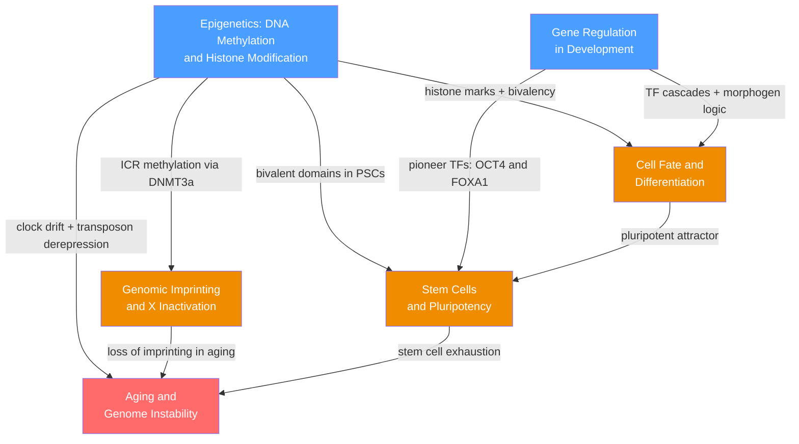

# Developmental and Epigenetic Genetics — Section Map of Content

> [!info] How to use this map
> Start with **Fundamentals** (blue nodes), follow the arrows, and use the Learning Paths below as your guide.
> Each node links to a full note. Come back to this map when you feel lost.

> [!abstract] Section Overview
> This section examines how a single genome gives rise to ~200 specialised cell types and sustains them across a lifetime. It bridges molecular mechanisms — DNA methylation, histone modification, and gene regulatory networks — with developmental biology, tracing how epigenetic instructions are written during gametogenesis, read during embryogenesis, inherited through cell division, and ultimately eroded during aging. Together these six notes form a mechanistic account of cell identity: how it is established, maintained, disrupted in disease, and lost with time.

---

## Section Concept Map

*(Blue = foundational molecular mechanisms, Orange = core developmental and epigenetic processes, Red = advanced integrative capstone; arrows show conceptual dependencies)*

---

## Notes in This Section

| Note | Core Topic | Level |
|------|-----------|-------|
| [[Gene_Regulation_in_Development]] | Morphogen gradients, Hox genes, cis-regulatory logic, GRN topology | Intermediate |
| [[Cell_Fate_and_Differentiation]] | Waddington landscape, potency hierarchy, bistable fate switches | Intermediate |
| [[Stem_Cells_and_Pluripotency]] | OCT4/SOX2/NANOG network, iPSC reprogramming, organoids | Intermediate |
| [[Epigenetics_DNA_Methylation_and_Histone_Modification]] | DNA methylation cycle, histone code, PRC1/PRC2, bivalency | Intermediate |
| [[Genomic_Imprinting_and_X_Inactivation]] | ICR methylation, CTCF insulator, XIST, PWS/AS/BWS | Intermediate–Advanced |
| [[Aging_and_Genome_Instability]] | Telomere attrition, senescence, SASP, epigenetic clocks, senolytics | Advanced |

---

## Learning Paths

### Path 1 — Development Track

*Recommended for learners approaching from embryology, developmental biology, or cell biology:*

1. [[Gene_Regulation_in_Development]] — establishes morphogen gradients, Hox gene logic, and cis-regulatory modules as the positional information layer that converts a uniform egg into a patterned embryo
2. [[Cell_Fate_and_Differentiation]] — shows how those positional signals are translated into stable cell identities via bistable TF toggles and the Waddington landscape
3. [[Stem_Cells_and_Pluripotency]] — examines the pluripotent ground state at the apex of the Waddington landscape: how it is maintained by OCT4/SOX2/NANOG, dismantled during differentiation, and artificially re-established by Yamanaka reprogramming

### Path 2 — Epigenomics Track

*Recommended for learners approaching from biochemistry, genomics, or clinical genetics:*

1. [[Epigenetics_DNA_Methylation_and_Histone_Modification]] — builds the molecular vocabulary: CpG methylation, histone writer/reader/eraser systems, PRC1/PRC2 Polycomb complexes, bivalent domains, and epigenome-wide sequencing assays (WGBS, ChIP-seq)
2. [[Genomic_Imprinting_and_X_Inactivation]] — applies that vocabulary to parent-of-origin gene control and X dosage compensation, showing how epigenetic marks carry identity information from gamete to soma and cause clinical syndromes when disrupted
3. [[Aging_and_Genome_Instability]] — follows epigenetic marks to their long-term fate: clock-like methylation drift, transposon derepression, telomere attrition, and cellular senescence converge in the twelve hallmarks of aging

---

## Cross-Section Connections

- **Links to S01 (Molecular Genetics):** All six notes build directly on S01 foundations. [[Gene_Regulation_and_Epigenetics]] (S01) provides the chromatin-remodelling and Polycomb/Trithorax machinery deployed throughout. [[Chromatin_Structure_and_Nucleosomes]] (S01) underpins histone modification biology and the TAD architecture that organises imprinted loci and Hox gene clusters. [[DNA_Structure_and_Replication]] (S01) explains the end-replication problem driving telomere attrition and the hemi-methylated CpG substrate that DNMT1 maintains. [[DNA_Repair_and_Mutation]] (S01) supplies the ATM-p53 DDR axis central to replicative senescence.
- **Links to S03 (Genomics and Bioinformatics):** [[DNA_Sequencing_Technologies]] (S03) covers WGBS, oxBS-seq, and Nanopore direct methylation detection used to read the epigenome quantitatively. [[Functional_Genomics_and_Transcriptomics]] (S03) covers ChIP-seq, CUT&TAG, ATAC-seq, and scRNA-seq trajectory analysis that are the primary experimental tools driving discoveries in this section.
- **Links to S05 (Human and Medical Genetics):** [[Chromosomal_Theory_of_Inheritance]] (S05) contextualises X-linked inheritance and sex chromosome aneuploidies (Turner syndrome 45,X; Klinefelter 47,XXY). Imprinting disorders (PWS, AS, BWS, SRS), cancer epigenomics (EZH2 mutations, DNMT inhibitor therapy), and CHIP-driven cardiovascular risk connect directly to clinical genetics content in S05.

---

## Cross-Vault Links

- [[Membranes_and_Cell_Signaling]] (Chemistry/06_Biochemistry) — Wnt, Notch, BMP, FGF, and Shh signalling pathways deliver the extracellular fate cues decoded by the TF circuits in [[Gene_Regulation_in_Development]] and [[Cell_Fate_and_Differentiation]]
- [[Protein_Structure_and_Function]] (Chemistry/06_Biochemistry) — structural basis of homeodomain DNA binding, bromodomain–acetyl-lysine reader interactions, and the intrinsically disordered regions (IDRs) driving transcriptional condensates in [[Stem_Cells_and_Pluripotency]]
- [[Chemical_Kinetics]] (Chemistry/02_Physical_Chemistry) — TET dioxygenase Michaelis-Menten kinetics, competitive 2-HG inhibition of alpha-KG-dependent enzymes, and Fenton-reaction ROS rates underpin [[Epigenetics_DNA_Methylation_and_Histone_Modification]] and [[Aging_and_Genome_Instability]]
- [[Systems_of_ODEs]] (Mathematics/07_Differential_Equations) — nullcline analysis, cusp bifurcation, and saddle-node transitions provide the mathematical framework for bistable fate switches in [[Cell_Fate_and_Differentiation]] and the OCT4/NANOG toggle in [[Stem_Cells_and_Pluripotency]]
- [[Neurodegenerative_Diseases]] (Neuroscience) — SASP-driven neuroinflammation, senescent astrocyte and microglial phenotypes, and progerin effects on neural progenitors link [[Aging_and_Genome_Instability]] directly to Alzheimer's and Parkinson's pathology
- [[Neuroplasticity_and_Rehabilitation]] (Neuroscience) — iPSC-derived dopaminergic neuron transplants and cerebral organoid models connect [[Stem_Cells_and_Pluripotency]] to neural repair and disease-modelling strategies
- [[Graph_Representation]] (DSA/07_Graphs) — gene regulatory networks are directed weighted graphs; feedforward loop enumeration, bi-fan motif counting, and adjacency-matrix representations apply directly to the GRN topology covered in [[Gene_Regulation_in_Development]]

---

## Key Questions This Section Answers

- How does a single genome generate ~200 distinct, stable cell identities, and what molecular marks encode that identity across cell divisions?
- What makes a morphogen gradient sufficient to specify precise, non-overlapping gene expression zones in a developing embryo?
- Why does the same chromosomal deletion or uniparental disomy cause completely different diseases depending on which parent donated the chromosome?
- Can differentiation truly be reversed, and what epigenetic barriers must be dismantled to return a somatic cell to pluripotency?
- Why does biological aging accelerate with time, and which conserved longevity pathways (mTOR, FOXO, sirtuins, senolytics) can retard the hallmarks-of-aging cascade?

---

[[_MOC_Genetics_Master]]

#MOC #Genetics #DevelopmentalGenetics #Epigenetics
