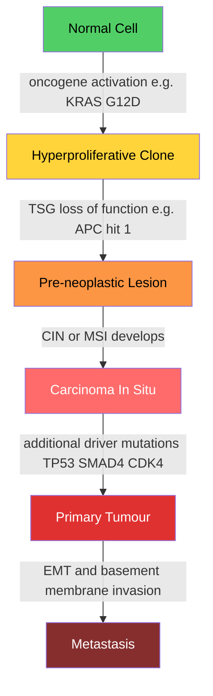

# 🧬 Cancer Genetics and Oncogenes

> [!abstract] TL;DR
> Cancer is somatic evolution: mutations in proto-oncogenes and tumour suppressor genes confer heritable growth advantages that allow clones to expand and accumulate further alterations, progressively acquiring all 14 hallmarks of malignancy — a process driven by genomic and chromosomal instability, shaped by clonal selection, and increasingly exploited by targeted therapies and immunotherapy.

---

## Intuition — analogy FIRST

Think of a normal cell as an employee in a tightly regulated corporation. The corporation has two complementary control systems: an accelerator (proto-oncogenes — the "gas pedal" genes that tell the cell to divide when growth signals arrive) and a braking system (tumour suppressor genes — the "checkpoint" employees who say "stop dividing, this is not the right time or place"). Cancer begins when the gas pedal gets stuck in the *on* position, or when the checkpoint employees get fired.

The stuck gas pedal is an **oncogene** — a mutation that converts a normal proto-oncogene into a permanently active driver of proliferation. A single copy is enough to cause trouble (dominant gain-of-function). The fired checkpoint is an inactivated **tumour suppressor gene** — both copies of the gene must be lost before the braking function disappears (recessive loss-of-function), explaining Alfred Knudson's famous "two-hit" observation.

Once the first few controls are disabled, the cell begins dividing at a slight but persistent advantage over its neighbours. Natural selection in the tissue microenvironment then amplifies these advantages: faster-dividing clones crowd out slower ones, acquire further mutations, and over decades generate the heterogeneous, drug-resistant tumours we recognise clinically.

---

## How It Works

### Core Mechanics

Cancer arises through a multi-step accumulation of somatic mutations in three functional categories of genes:

1. **Proto-oncogenes → oncogenes:** gain-of-function mutations that constitutively activate growth-promoting signals. One mutant allele is sufficient (dominant).
2. **Tumour suppressor genes (TSGs):** loss-of-function mutations that remove growth-inhibitory checkpoints. Both alleles must be inactivated (Knudson two-hit, recessive).
3. **DNA-repair and genome-stability genes:** mutations that accelerate the overall rate of somatic mutation, generating microsatellite instability (MSI) or chromosomal instability (CIN), which then drives faster accumulation of drivers.

Each cell in a tumour is the result of clonal expansion from a common ancestral cell that first acquired a heritable growth advantage. Subsequent driver mutations generate subclones with further selective advantages — a branching evolutionary process identical in logic to Darwinian speciation, but occurring within a single organism over years to decades.

### Flow / Architecture



---

## Key Concepts / Details

### Secondary Level

**What is cancer — somatic evolution.**
A cancer cell is a normal cell that has acquired heritable alterations conferring a net growth advantage over its neighbours. These alterations are almost always *somatic* (arising in body cells after fertilisation), not germline, which is why cancer is generally not directly inherited — with the important exception of hereditary cancer syndromes where one defective allele is already present at birth, halving the mutational distance to full inactivation.

**Proto-oncogenes and oncogenes.**

A **proto-oncogene** is a normal cellular gene encoding a protein that promotes cell growth, division, or survival under appropriate physiological conditions — for example, growth factor receptors, signal transduction GTPases, and transcription factors that regulate the cell cycle. An **oncogene** is a mutant or overexpressed form of a proto-oncogene that promotes cell proliferation even in the absence of the normal growth signal.

| Proto-oncogene | Oncogene form | Mechanism | Cancer context |
|----------------|---------------|-----------|----------------|
| *RAS* (KRAS/HRAS/NRAS) | KRAS G12D, G12V | Point mutation freezes RAS in GTP-bound active state | Pancreatic, colorectal, NSCLC |
| *MYC* | *c-MYC* amplification, t(8;14) | Overexpression drives S-phase entry and ribosome biogenesis | Burkitt lymphoma, breast, NSCLC |
| *HER2* (*ERBB2*) | Amplification (6–32 copies) | Constitutive dimerisation and kinase activity | Breast, gastric, NSCLC |
| *EGFR* | L858R, exon 19 del, amplification | Constitutive tyrosine kinase, sustained MAP/PI3K signalling | NSCLC, glioblastoma |
| *ABL1* | BCR-ABL fusion t(9;22) | Constitutive cytoplasmic tyrosine kinase | CML, Ph+ ALL |

Oncogene mutations act **dominantly** — a single mutant copy in an otherwise diploid cell is sufficient to promote aberrant proliferation.

**Tumour suppressor genes and the two-hit hypothesis.**

Alfred Knudson (1971) analysed the age of onset of retinoblastoma (a childhood eye cancer caused by loss of the *RB1* gene) and made a remarkable statistical observation: familial cases arise earlier and are often bilateral (affecting both eyes), whereas sporadic cases arise later and are unilateral. He proposed that *two independent mutational events* are required to inactivate both alleles of *RB1*. In familial cases, one hit is inherited in the germline — every cell in the body already has one defective copy. A single somatic second hit in any retinal cell suffices to produce a tumour. In sporadic cases, two independent somatic hits must occur in the same cell, which is statistically much rarer and produces only unilateral disease.

This **two-hit hypothesis** is now the universal model for TSG inactivation. The second hit need not be another point mutation; it can arise by **loss of heterozygosity (LOH)** — loss of the entire chromosomal arm or chromosome bearing the wild-type allele — or by **epigenetic silencing** (promoter CpG island methylation), or by copy-neutral LOH (uniparental disomy).

Key tumour suppressor genes:

| Gene | Pathway | Cancer syndrome | Second hit mechanism |
|------|---------|-----------------|---------------------|
| *RB1* | G1/S checkpoint; CDK4/cyclin D target | Hereditary retinoblastoma | LOH (most common) |
| *TP53* | G1/S, G2/M checkpoints; apoptosis; DNA-damage guardian | Li-Fraumeni syndrome | Point mutation + LOH; or gain-of-function |
| *APC* | WNT/β-catenin pathway; degradation complex | Familial adenomatous polyposis (FAP) | Point mutation or truncation |
| *BRCA1/2* | Homologous recombination DNA repair | Hereditary breast/ovarian cancer | LOH |
| *VHL* | HIF-α degradation, oxygen sensing | Hereditary clear-cell renal cell carcinoma | Methylation or LOH |

### Undergraduate Level

**Mechanisms of oncogene activation.**

Three molecular mechanisms convert a proto-oncogene into an oncogene:

1. **Point mutation:** A single amino-acid change creates a constitutively active protein. The archetypal example is *KRAS* G12D — glycine at position 12 is replaced by aspartate, preventing GTP hydrolysis and locking RAS in the active GTP-bound state. The MAPK and PI3K/AKT/mTOR proliferation cascades fire continuously.
2. **Gene amplification:** Extra copies of the gene are made, producing massive overexpression. *HER2* is amplified in ~20% of breast cancers (detectable by FISH as clusters of bright signals); *MYC* is amplified in neuroblastoma (N-MYC), NSCLC, and many others. Amplification typically appears as extrachromosomal DNA (ecDNA) or chromosomal homogeneously staining regions (HSRs).
3. **Chromosomal translocation:** A proto-oncogene is placed under the control of a strong promoter, or is fused to another gene, creating an overexpressed or functionally altered fusion protein. The canonical example is the **Philadelphia chromosome** t(9;22)(q34;q11), which fuses *BCR* to *ABL1* creating a constitutively active cytoplasmic tyrosine kinase — the direct cause of chronic myeloid leukaemia (CML). In Burkitt lymphoma, *c-MYC* is translocated to immunoglobulin heavy-chain loci where it is transcribed at very high levels.

**Mechanisms of TSG inactivation (second hit).**

Beyond point mutation and LOH, TSGs are frequently silenced by **promoter hypermethylation** — a DNA methylation mark at CpG islands in the promoter region that physically blocks transcriptional access (see [[Gene_Regulation_and_Epigenetics]]). This is epigenetically heritable (maintained by DNMT1 after replication) and is therapeutically reversible with demethylating agents (5-azacytidine, decitabine). *CDKN2A* (p16), *MLH1*, *VHL*, and *BRCA1* are all commonly silenced this way in sporadic cancers.

**DNA repair genes and mutator phenotypes.**

A third category of cancer gene — **DNA repair and genome-caretaker genes** — does not directly promote growth but instead massively increases the rate at which driver mutations accumulate:

- **Mismatch repair (MMR):** Germline defects in *MLH1*, *MSH2*, *MSH6*, or *PMS2* cause **Lynch syndrome** (HNPCC), the most common hereditary colorectal cancer syndrome. MMR-deficient tumours exhibit **microsatellite instability (MSI-H)**: short tandem repeats throughout the genome accumulate insertion-deletion errors uncorrected, generating hundreds to thousands of frameshift neoantigens — a feature that makes these tumours exquisitely sensitive to immune checkpoint inhibitors.
- **Homologous recombination repair:** Germline loss-of-function in *BRCA1* or *BRCA2* creates **homologous recombination deficiency (HRD)**, which forces cells to use error-prone NHEJ for double-strand break repair, generating genomic scars (large-scale copy number changes, telomeric allelic imbalance). HRD tumours are selectively killed by PARP inhibitors (synthetic lethality — see [[DNA_Repair_and_Mutation]]).
- **POLE/POLD1 exonuclease domain mutations:** Ultra-hypermutated tumours (>100 mutations/Mb) arise when the proofreading exonuclease of the replicative polymerase is inactivated; these tumours carry characteristic C→T and C→A signatures at specific trinucleotide contexts.

**Cancer driver vs passenger mutations.**

In a typical cancer genome there are ~2–8 recurrently mutated **driver** genes — mutations that directly increase cellular fitness by increasing proliferation, blocking apoptosis, or evading immune destruction. The remaining hundreds to tens of thousands of mutations are **passenger** mutations — mutational noise that accumulated in the expanding clone but confers no selective advantage. Distinguishing drivers from passengers requires population-level statistics: a gene is likely a driver if it is mutated more often than expected by chance given its base composition, expression level, and background mutation rate (tools: MutSigCV, dNdScv, OncodriveMut). In practice, ~700 genes satisfy these criteria across TCGA pan-cancer analyses.

**Mutational signatures.**

Each carcinogenic process leaves a characteristic imprint on the cancer genome — a **mutational signature** defined by the pattern of single-base substitutions across all 96 possible trinucleotide contexts. COSMIC (Catalogue of Somatic Mutations In Cancer) has catalogued >67 single-base substitution (SBS) signatures:

| COSMIC Signature | Aetiology | Characteristic change | Cancer types |
|-----------------|-----------|----------------------|-------------|
| SBS1 | Clock-like: spontaneous deamination of 5-methylcytosine | C→T at CpG dinucleotides | All cancers; accumulates with age |
| SBS3 | Homologous recombination deficiency (HRD; BRCA1/2/PALB2 loss) | Broad spectrum indels + structural variants | Breast, ovarian, prostate |
| SBS4 | Tobacco smoke (benzo[a]pyrene adducts; NER substrate) | C→A at specific trinucleotides | Lung, head/neck, bladder |
| SBS7a/7b | UV-induced cyclobutane pyrimidine dimers | C→T and CC→TT at dipyrimidines | Melanoma, squamous cell skin |
| SBS2/SBS13 | APOBEC3A/3B cytidine deaminase activity | C→T and C→G at TCA/TCT contexts | Breast, cervical, bladder |

Signatures are clinically actionable: SBS3 predicts PARP inhibitor sensitivity; MSI-H (SBS6/15/20/21/26) predicts immune checkpoint inhibitor response; SBS4 provides forensic evidence of tobacco exposure independent of patient history.

**Microsatellite instability (MSI) vs chromosomal instability (CIN).**

These are the two major forms of genomic instability in cancer and are largely mutually exclusive:

- **MSI-High (MSI-H):** caused by MMR deficiency. Short tandem repeats (microsatellites) accumulate insertion-deletion errors. Tumours are near-diploid with many point mutations and frameshifts but few copy number changes. High neoantigen burden → immunogenic. Responds well to anti-PD-1 therapy.
- **Chromosomal instability (CIN):** caused by defects in spindle assembly checkpoint (SAC), cohesins, or centrosome number. Whole-chromosome or chromosome-arm gains/losses accumulate at high rates. Aneuploidy, copy number variation, and structural rearrangements are the hallmarks. CIN is associated with poor prognosis and drug resistance through ongoing clonal evolution.

**The 14 Hallmarks of Cancer (Hanahan & Weinberg 2000, 2011, 2022).**

Hanahan and Weinberg's landmark framework organises the diverse phenotypic capabilities a cell must acquire to become fully malignant:

*Core functional capabilities:*

| # | Hallmark | Molecular example |
|---|----------|------------------|
| 1 | Sustaining proliferative signalling | KRAS, EGFR, cyclin D1 overexpression |
| 2 | Evading growth suppressors | RB1 loss, p16/CDKN2A deletion |
| 3 | Resisting cell death | BCL-2 overexpression, TP53 mutation |
| 4 | Enabling replicative immortality | TERT promoter mutation, ALT pathway |
| 5 | Inducing angiogenesis | VEGFA upregulation via HIF-1α |
| 6 | Activating invasion and metastasis | EMT, MMP secretion, integrins |
| 7 | Deregulating cellular energetics (2011) | Warburg effect, GLUT1 upregulation |
| 8 | Avoiding immune destruction (2011) | PD-L1 upregulation, MHC-I downregulation |
| 9 | Unlocking phenotypic plasticity (2022) | Cancer stem cell state switching, EMT reversibility |
| 10 | Nonmutational epigenetic reprogramming (2022) | IDH1/2 neomorphic mutations, EZH2 gain-of-function |
| 11 | Polymorphic microbiomes (2022) | Fusobacterium nucleatum in colorectal cancer |
| 12 | Senescent cells (2022) | SASP fuels tumour-promoting inflammation |

*Enabling characteristics:*

| # | Enabling feature | Molecular example |
|---|-----------------|------------------|
| 13 | Genome instability and mutation | CIN, MSI, APOBEC activity, defective DDR |
| 14 | Tumour-promoting inflammation | NF-κB, IL-6, TNF from TAMs and CAFs |

**Tumour microenvironment (TME).**

A tumour is not a mass of cancer cells alone; it is an ecosystem comprising cancer cells, cancer-associated fibroblasts (CAFs), endothelial cells, and a diverse immune infiltrate. Key immune cell types:

- **Tumour-associated macrophages (TAMs):** usually adopt an M2-like immunosuppressive phenotype, secreting IL-10 and TGF-β; high TAM density correlates with poor prognosis in most solid tumours.
- **Regulatory T cells (Tregs):** suppress effector T cell killing via CTLA-4, IL-10, and TGF-β.
- **CD8+ cytotoxic T cells (CTLs):** the primary anti-tumour effectors; their dysfunction ("exhaustion") in the TME is the target of checkpoint inhibitors.
- **Cancer-associated fibroblasts (CAFs):** remodel the extracellular matrix (ECM), secrete growth factors (HGF, IGF-1), and physically shield tumour cells from immune attack.

**Targeted therapies.**

The mechanistic understanding of oncogene addiction (cancer cells become structurally dependent on a single hyperactivated signalling node) has enabled a generation of targeted agents:

- **Imatinib (Gleevec):** BCR-ABL1 tyrosine kinase inhibitor. Transformed CML from a fatal disease to a manageable chronic condition with >90% 10-year survival in chronic phase. First proof-of-concept that a single oncogenic kinase can be a sustained therapeutic vulnerability.
- **Vemurafenib / dabrafenib:** BRAF V600E inhibitors. In BRAF-mutant melanoma, dramatic responses but rapid resistance via NRAS mutation or MEK bypass; combination with MEK inhibitor (trametinib) delays resistance.
- **Trastuzumab (Herceptin):** anti-HER2 monoclonal antibody; HER2-amplified breast and gastric cancer.
- **Cetuximab / erlotinib:** EGFR inhibitors; active only in *KRAS* wild-type colorectal cancer (KRAS mutation creates a downstream bypass of EGFR blockade).

**Immunotherapy — PD-1/PD-L1 axis.**

Tumour cells upregulate **PD-L1** (programmed death ligand 1) in response to IFN-γ from infiltrating T cells. PD-L1 binds **PD-1** on CD8+ T cells, delivering an "off" signal that drives T cell exhaustion and anergy — a physiological checkpoint coopted by the tumour. Anti-PD-1 antibodies (pembrolizumab, nivolumab) and anti-PD-L1 antibodies (atezolizumab, durvalumab) remove this brake, restoring T cell killing. Response is best predicted by:

1. **Tumour mutational burden (TMB):** more mutations → more neoantigens → stronger T cell response.
2. **MSI-H status:** frameshift neoantigens are particularly immunogenic; pembrolizumab was the first FDA-approved *tissue-agnostic* therapy (2017), approved for any MSI-H/dMMR solid tumour regardless of histology.
3. **PD-L1 IHC expression:** useful but imperfect biomarker.

### Graduate Level

**Somatic evolution — neutral drift, clonal sweeps, and branching.**

Not all tumour subclones are under strong positive selection. Single-cell sequencing and phylogenetic analyses of large tumour sections have revealed that a substantial fraction of subclonal mutations are **neutrally evolving** — present by chance in large subclones but providing no detectable fitness benefit. The ongoing debate (Williams et al., 2016 vs Noorbakhsh et al.) concerns what proportion of intratumoural heterogeneity arises from positive selection of distinct subclones vs neutral drift in an expanding cell population. Practically, the distinction matters: neutrally heterogeneous tumours may not develop true drug resistance until therapy creates a strong selective pressure, whereas pre-existing selected subclones can cause primary resistance.

The evolutionary dynamics create **branched phylogenies**: a trunk of clonal mutations shared by all cells in the tumour (the earliest drivers), branching into private mutations found only in spatial subregions or metastatic deposits. Trunk mutations are the best therapeutic targets because they cannot be escaped by clonal selection; branch mutations may predict prognosis but are not present in every cell.

**Oncogenesis via epigenetics: IDH1/2 and EZH2.**

A growing class of cancer-driving mutations act through chromatin remodelling rather than direct growth signalling — "epigenetic oncogenesis":

- **IDH1/2 neomorphic mutations (R132H/C in IDH1; R172K/H, R140Q in IDH2):** Normal IDH1/2 converts isocitrate to α-ketoglutarate (α-KG) in the TCA cycle. Mutant IDH uses α-KG as a substrate to produce **2-hydroxyglutarate (2-HG)**, an oncometabolite that competitively inhibits α-KG-dependent dioxygenases — including **TET2** (DNA demethylase) and **KDM histone demethylases**. The result is genome-wide **CpG Island Methylator Phenotype (CIMP)**, silencing tumour suppressor gene promoters and locking cells in an undifferentiated state. IDH mutations are found in >80% of grade 2–3 gliomas and ~20% of AML. Specific IDH inhibitors (enasidenib for IDH2, ivosidenib for IDH1) are FDA-approved and induce differentiation rather than killing the cells.
- **EZH2 gain-of-function mutations (Y641F/N/H/S/C, A677G):** EZH2 is the catalytic subunit of PRC2, writing H3K27me3 to silence gene loci (see [[Chromatin_Structure_and_Nucleosomes]]). These mutations increase the efficiency of H3K27me3 trimethylation, broadly silencing tumour suppressor genes including *CDKN2A*, *p21*, and differentiation regulators. Found in ~20% of follicular lymphomas and ~10% of DLBCL. Tazemetostat (EZH2 inhibitor) was approved in 2020 for epithelioid sarcoma and relapsed/refractory follicular lymphoma with EZH2 mutations.

**Liquid biopsy and circulating tumour DNA (ctDNA).**

Tumour cells shed DNA fragments into the circulation — **circulating tumour DNA (ctDNA)** — constituting typically 0.01–10% of total cell-free DNA (cfDNA) in plasma. Detection relies on ultrasensitive sequencing methods (digital droplet PCR, BEAMing, ultra-deep tagged amplicon sequencing) that can identify tumour-specific variants at VAF (variant allele frequency) as low as 0.01%.

Clinical applications:

1. **Early detection:** ctDNA-based multi-cancer early detection (e.g., Galleri/Grail) — methylation signatures and mutation profiles in cfDNA.
2. **Minimal residual disease (MRD) monitoring:** post-surgical ctDNA positivity predicts recurrence before imaging.
3. **Resistance mutation detection:** e.g., *EGFR* T790M (resistance to first-generation EGFR TKIs in NSCLC) was detectable in plasma before clinical progression, guiding switch to osimertinib.
4. **Tumour mutational landscape without repeated biopsies:** captures clonal heterogeneity from shedding of all subclones.

ctDNA analysis via next-generation sequencing (see [[DNA_Sequencing_Technologies]]) is now standard of care in multiple tumour types.

**Synthetic lethality and HRD.**

BRCA1/2-deficient tumour cells cannot perform homologous recombination. When PARP1 is inhibited, unrepaired SSBs collapse replication forks into DSBs that can only be fixed by HDR — impossible without BRCA. Normal cells tolerate PARP inhibition because HDR is intact. This **synthetic lethality** (see [[DNA_Repair_and_Mutation]] for mechanistic detail) was the first successful translation of evolutionary cancer genetics into clinical practice. HRD extends beyond *BRCA1/2*: mutations in *PALB2*, *RAD51C/D*, *BRIP1*, and epigenetic silencing of *BRCA1* all produce HRD. HRD scoring algorithms (Myriad myChoice, Foundation Medicine) combine LOH fraction, telomeric allelic imbalance, and large-scale transition metrics to identify platinum/PARP-inhibitor-sensitive tumours regardless of BRCA status.

---

## Python Demo

```python
# pip install numpy matplotlib
# Simulates somatic clonal evolution: a stochastic branching process where
# cells with more driver mutations grow faster and eventually dominate the tumour.
import numpy as np
import matplotlib.pyplot as plt

rng = np.random.default_rng(42)

# ── Model parameters ──────────────────────────────────────────────────────────
N_GENERATIONS    = 80           # cell generations to simulate
INIT_CELLS       = 100          # start: small initiated clone
BASE_NET_GROWTH  = 0.05         # net growth rate with 0 driver mutations per step
DRIVER_ADVANTAGE = 0.15         # each additional driver adds +15% net growth
MU_DRIVER        = 0.005        # P(acquire next driver mutation per cell per gen)
MAX_DRIVERS      = 6            # track clones carrying 0 to 6 driver mutations
DEATH_PROB       = 0.03         # background death probability per step

# pop[k] = number of cells with exactly k driver mutations
pop = np.zeros(MAX_DRIVERS + 1, dtype=np.int64)
pop[0] = INIT_CELLS

total_history    = []
mean_drv_history = []

for gen in range(N_GENERATIONS):
    new_pop = np.zeros_like(pop)
    for k in range(MAX_DRIVERS + 1):
        n = int(pop[k])
        if n == 0:
            continue
        net_rate  = BASE_NET_GROWTH + k * DRIVER_ADVANTAGE
        births    = int(rng.poisson(net_rate * n))
        deaths    = int(rng.binomial(n, DEATH_PROB))
        survivors = max(0, n + births - deaths)
        if survivors == 0:
            continue
        if k < MAX_DRIVERS:
            new_mut         = int(rng.binomial(survivors, MU_DRIVER))
            new_pop[k]     += survivors - new_mut
            new_pop[k + 1] += new_mut
        else:
            new_pop[k] += survivors

    pop   = new_pop.copy()
    total = int(pop.sum())
    if total == 0:
        break

    mean_drv = float(np.dot(np.arange(MAX_DRIVERS + 1), pop)) / total
    total_history.append(total)
    mean_drv_history.append(mean_drv)

# ── Plotting ──────────────────────────────────────────────────────────────────
fig, axes = plt.subplots(1, 2, figsize=(13, 5))
gens = np.arange(len(total_history))

axes[0].semilogy(gens, total_history, color="steelblue", linewidth=2)
axes[0].set(
    xlabel="Cell generation",
    ylabel="Total cells  (log scale)",
    title="Tumour Clonal Expansion\nbranching process with selective sweep",
)
axes[0].grid(alpha=0.3)

# Mean driver count rises in a staircase pattern as each successive
# driver mutation sweeps through and dominates the population.
axes[1].plot(gens, mean_drv_history, color="darkorange", linewidth=2)
axes[1].set(
    xlabel="Cell generation",
    ylabel="Mean driver mutations per cell",
    title="Driver Mutation Accumulation\nclonal sweeps lift mean driver count",
)
axes[1].grid(alpha=0.3)

plt.tight_layout()
plt.show()

# ── Summary ───────────────────────────────────────────────────────────────────
final_total = int(pop.sum())
print(f"Final tumour size after {N_GENERATIONS} generations: {final_total:,}")
print("Clone distribution  (driver count -> cell count):")
for k, n in enumerate(pop):
    if n > 0:
        pct = 100.0 * n / final_total
        print(f"  {k} driver mutation(s): {n:12,} cells  ({pct:5.1f}%)")
```

The left panel shows the characteristic **exponential-then-explosive** tumour growth: the initial clone (0 drivers) expands slowly, but once a 2-driver or 3-driver subclone emerges it sweeps to numerical dominance and drives rapid total growth. The right panel shows the stepwise increase in mean driver mutations per cell — each step corresponds to a selective sweep where a higher-fitness clone colonises the tumour. This mirrors phylogenetic analyses of human tumour evolution where trunk-to-branch transitions mark successive waves of clonal expansion.

---

## Real-World Notes

> **CML and the BCR-ABL paradigm.** Chronic myeloid leukaemia (CML) is caused in >95% of cases by the Philadelphia chromosome translocation t(9;22)(q34;q11), fusing *BCR* to *ABL1*. The resulting BCR-ABL oncoprotein is a constitutively active cytoplasmic tyrosine kinase that drives myeloid proliferation. Before 2001, CML had a median survival of ~5 years and required bone marrow transplantation. Imatinib (Gleevec), a competitive BCR-ABL kinase inhibitor designed to fit the inactive conformation of the kinase domain, changed the disease: complete cytogenetic response in >80% of chronic-phase patients, and 10-year overall survival >80%. CML remains the proof-of-concept model for oncogene-addicted cancer therapy.

> **BRAF V600E and melanoma.** BRAF V600E — a transversion at codon 600 that substitutes glutamate for valine — constitutively activates BRAF kinase, continuously driving the MAPK proliferation cascade. Found in ~50% of cutaneous melanomas, it is a prime therapeutic target. Vemurafenib and dabrafenib (BRAF inhibitors) produce objective responses in ~50% of BRAF V600E melanoma patients, but resistance emerges within months via NRAS mutation or BRAF amplification that bypasses the inhibitor. Combining BRAF and MEK inhibitors (dabrafenib + trametinib) delays resistance and improves progression-free survival to ~12 months.

> **Lynch syndrome and tissue-agnostic immunotherapy.** Lynch syndrome (hereditary non-polyposis colorectal cancer, HNPCC) arises from germline loss-of-function in MMR genes (*MLH1*, *MSH2*, *MSH6*, *PMS2*), conferring ~80% lifetime colorectal cancer risk. All Lynch tumours are MSI-H. Because MMR deficiency generates thousands of frameshift mutations — many encoding entirely novel peptide epitopes (neoantigens) — these tumours are strongly immunogenic. In 2017, the FDA approved pembrolizumab as the first tissue-agnostic therapy for any MSI-H/dMMR solid tumour, based on objective response rates of ~40% across 12 different tumour types.

> **Liquid biopsy in EGFR-mutant NSCLC.** In non-small-cell lung cancer (NSCLC), sensitising EGFR mutations (exon 19 deletion, L858R) predict response to gefitinib/erlotinib. Resistance invariably develops, frequently via EGFR T790M — a "gatekeeper" mutation that blocks first-generation TKI binding. Plasma ctDNA testing (e.g., cobas EGFR Mutation Test v2) can detect T790M in circulating DNA without a repeat tumour biopsy, enabling rapid switch to osimertinib (third-generation TKI that tolerates T790M) — a workflow that has transformed NSCLC management into a serial molecular dialogue between tumour evolution and therapeutic selection.

> **IDH1 inhibitor and glioma differentiation.** IDH1-mutant lower-grade gliomas (grade 2–3 astrocytoma/oligodendroglioma) carry the R132H mutation in virtually all tumour cells (a trunk driver). Ivosidenib (IDH1 inhibitor) reduces 2-HG production, reverses promoter hypermethylation, and induces differentiation in IDH-mutant cells. Phase 3 data (INDIGO trial, 2023) showed ivosidenib significantly prolonged progression-free survival in IDH1-mutant glioma — the first targeted therapy to show benefit in this disease.

---

## Common Pitfalls

- **Conflating proto-oncogene with oncogene.** A proto-oncogene is the normal, wild-type cellular gene. An oncogene is its mutant or overexpressed derivative. Saying "RAS is an oncogene" is imprecise — *RAS* is a proto-oncogene; *KRAS G12D* is the oncogene.

- **Applying the two-hit hypothesis to oncogenes.** The Knudson two-hit model applies to tumour suppressor genes (recessive, loss-of-function). Oncogenes are dominant gain-of-function: a single mutant allele is sufficient. There is no "two-hit" requirement for an oncogene.

- **Assuming all TP53 mutations are simple loss-of-function.** The majority (~75%) of *TP53* mutations are missense rather than truncating. Most missense variants do lose the ability to transactivate canonical p53 target genes. However, a subset also exert **dominant-negative** activity (the mutant p53 protein sequesters the wild-type tetramer partner), and a further subset acquire **gain-of-function** properties — activating oncogenic transcriptional programmes independent of wild-type p53. These distinctions matter for predicting therapeutic sensitivity.

- **Confusing MSI with CIN.** MSI and CIN are mechanistically distinct and largely mutually exclusive. MSI-H tumours are near-diploid, hypermutated, immunogenic, and sensitive to checkpoint inhibitors. CIN tumours are aneuploid, structurally rearranged, and typically resistant to checkpoint inhibition. Conflating them leads to incorrect prognostic and therapeutic predictions.

- **Treating "high mutational burden" and "MSI-H" as synonyms.** MSI-H tumours have high TMB, but not all high-TMB tumours are MSI-H. *POLE* exonuclease-deficient tumours have the highest TMB of any cancer (~100–500 mut/Mb) and are MSI-stable (MSS). Both MSI-H and ultra-hypermutated *POLE* tumours respond well to PD-1 blockade, but through distinct mechanisms and at different cut-offs.

- **Overestimating the actionability of passenger mutations.** Sequencing reports from tumour panels often return dozens to hundreds of variants. The clinical challenge is identifying the true drivers. A missense variant in a known cancer gene is not automatically a driver — its position (hotspot vs. random location), functional domain context, and recurrence across many tumours must be considered before attributing clinical significance.

- **Ignoring clonal architecture in targeted therapy selection.** A targeted agent effective against a trunk driver mutation (present in 100% of tumour cells) has a very different expected benefit from one targeting a branch mutation present in only 5% of cells. Liquid biopsy or multi-region sampling is increasingly needed to establish whether a putative driver is clonal.

---

## Related Concepts

- [[DNA_Repair_and_Mutation]] (Genetics/01_Molecular_Genetics) — the molecular mechanisms — BER, NER, MMR, NHEJ, HDR — that prevent or generate the mutations driving cancer; MMR deficiency causes Lynch syndrome; HRD causes BRCA-associated cancer; PARP inhibitor synthetic lethality bridges repair genetics and oncology.
- [[Population_Genetics_and_Hardy_Weinberg]] (Genetics/02_Classical_and_Population_Genetics) — the mathematical framework for allele frequency dynamics under selection applies directly to intratumoural clonal selection; clonal expansion follows the same Wright-Fisher logic as selective sweeps in populations.
- [[Gene_Regulation_and_Epigenetics]] (Genetics/01_Molecular_Genetics) — IDH1/2 and EZH2 mutations drive cancer through epigenetic reprogramming (CIMP, aberrant H3K27me3); promoter methylation silences TSGs in lieu of a classical second mutational hit.
- [[Chromatin_Structure_and_Nucleosomes]] (Genetics/01_Molecular_Genetics) — the physical substrate of epigenetic TSG silencing; PRC2/EZH2-mediated H3K27me3 repression, SWI/SNF complex mutations (ARID1A, SMARCA4) are among the most common cancer mutations genome-wide.
- [[Protein_Structure_and_Function]] (Chemistry/06_Biochemistry) — oncoproteins (mutant RAS, constitutively active kinases, fusion proteins like BCR-ABL) acquire their oncogenic properties through specific structural changes; targeted inhibitor design exploits the altered active-site geometry.
- [[Membranes_and_Cell_Signaling]] (Chemistry/06_Biochemistry) — the signal transduction cascades (MAPK, PI3K/AKT/mTOR, JAK-STAT, WNT/β-catenin) that oncogenes hijack to drive constitutive proliferation originate at the plasma membrane.
- [[DNA_Sequencing_Technologies]] (Genetics/03_Genomics_and_Bioinformatics) — next-generation sequencing of tumour genomes enables driver identification, mutational signature analysis, TMB scoring, MSI testing, and ctDNA liquid biopsy.
- [[Functional_Genomics_and_Transcriptomics]] (Genetics/03_Genomics_and_Bioinformatics) — transcriptomic profiling (RNA-seq, single-cell RNA-seq) of tumours characterises the TME, identifies cancer cell states (EMT, stem-like), and underpins immune subtype classification.
- [[Neurodegenerative_Diseases]] (Neuroscience/06_Clinical_and_Applied_Neuroscience) — both cancer and neurodegeneration can involve IDH-mutant gliomas of the CNS; brain tumours share mechanistic overlap with neurological disease in their epigenetic dysregulation and impaired proteostasis.
- [[_MOC_Human_and_Medical_Genetics|↑ Human and Medical Genetics MOC]] — section entry point and concept map for all human and medical genetics notes

---

## Review Questions

1. **(Secondary)** A child is diagnosed with bilateral retinoblastoma. Her unaffected mother carries a germline *RB1* mutation detected on cascade testing. (a) Using Knudson's two-hit hypothesis, explain why the child developed bilateral tumours at a younger age than a child with sporadic retinoblastoma would. (b) Why does inheriting one defective *RB1* allele not itself cause cancer? (c) What is the name of the molecular event most commonly responsible for the second hit in *RB1*-associated retinoblastoma?

2. **(Undergraduate)** A patient with a 40-pack-year smoking history presents with stage IIIA NSCLC. Next-generation sequencing of the biopsy identifies *KRAS* G12C as the dominant driver. (a) Explain the biochemical mechanism by which KRAS G12C constitutively activates downstream MAPK signalling. (b) Why would this patient NOT respond to cetuximab (anti-EGFR), and what targeted option is now available for KRAS G12C? (c) The sequencing report also shows SBS4 as the predominant mutational signature. What does this tell you about the tumour's aetiology, and how does it relate to the patient's history?

3. **(Graduate)** A patient with ovarian high-grade serous carcinoma initially achieves complete response to carboplatin + paclitaxel, then relapses 14 months later. Re-biopsy shows a tumour that is BRCA1-proficient by sequencing but exhibits an HRD score of 78 (above the 42-unit threshold) by Myriad myChoice. (a) Name three molecular mechanisms other than *BRCA1/2* point mutation that can cause HRD and explain how each one impairs homologous recombination. (b) The oncologist considers adding olaparib maintenance. Describe the mechanism of PARP trapping and explain why it is more cytotoxic than catalytic PARP inhibition alone in HRD cells. (c) Plasma ctDNA is collected three months after olaparib initiation and shows emergence of a RAD51C promoter demethylation event. Interpret the clinical significance of this finding in the context of acquired resistance.

---

## Sources

- [Hanahan, D. (2022). Hallmarks of Cancer: New Dimensions. *Cancer Discovery*, 12(1), 31–46.](https://aacrjournals.org/cancerdiscovery/article/12/1/31/675608/Hallmarks-of-Cancer-New-Dimensions)
- [Hanahan, D. & Weinberg, R. A. (2011). Hallmarks of Cancer: The Next Generation. *Cell*, 144(5), 646–674.](https://pubmed.ncbi.nlm.nih.gov/21376230/)
- [Knudson, A. G. (1971). Mutation and cancer: statistical study of retinoblastoma. *PNAS*, 68(4), 820–823.](https://www.pnas.org/doi/10.1073/pnas.68.4.820)
- [Alexandrov, L. B. et al. (2020). The repertoire of mutational signatures in human cancer. *Nature*, 578, 94–101.](https://www.nature.com/articles/s41586-020-1943-3)
- [COSMIC Mutational Signatures — SBS1, SBS3, SBS4. Wellcome Sanger Institute.](https://cancer.sanger.ac.uk/cosmic/signatures/SBS/)
- [Lord, C. J. & Ashworth, A. (2017). PARP inhibitors: Synthetic lethality in the clinic. *Science*, 355(6330), 1152–1158.](https://www.science.org/doi/10.1126/science.aam7344)
- [Williams, M. J. et al. (2016). Identification of neutral tumour evolution across cancer types. *Nature Genetics*, 48, 238–244.](https://www.nature.com/articles/ng.3489)
- Vogelstein, B. & Kinzler, K. W. (2015). The Path to Cancer — Three Strikes and You're Out. *New England Journal of Medicine*, 373, 1895–1898.

---

#Genetics #HumanGenetics #CancerGenetics #Oncogene
