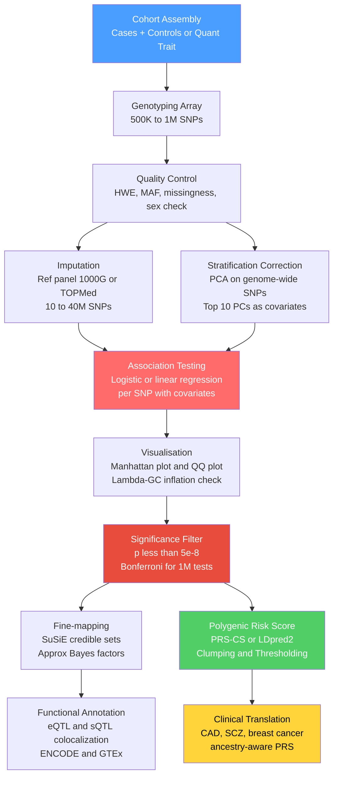

# 🧬 Complex Trait Genetics and GWAS

> [!abstract] TL;DR
> Most human diseases and continuous traits — height, blood pressure, schizophrenia, type 2 diabetes — are shaped by thousands of common genetic variants, each contributing a tiny fraction of overall risk; genome-wide association studies (GWAS) systematically test every SNP across the genome for statistical association with a trait, and polygenic risk scores (PRS) aggregate those tiny effects into clinically actionable individual predictions.

---

## Intuition — analogy FIRST

Imagine your final exam grade depends not on one decisive essay question but on 10,000 micro-questions, each worth 0.01 points. No single micro-question meaningfully changes your score, yet together they fully determine it. A student who answers most of them correctly ends up with a high grade; one who answers most incorrectly does not. Now imagine you want to find which micro-questions genuinely predict success versus which reflect random noise. You would need to give the exam to thousands of students, then statistically correlate each micro-question's answer with the final grade — and you would need to be very strict about what counts as a "real" correlation versus a lucky coincidence across 10,000 simultaneous tests.

GWAS does exactly this, but the "exam" is a person's genome, the "micro-questions" are roughly 1 million single-nucleotide polymorphisms (SNPs), and the "final grade" is a disease status or continuous trait measurement. The challenge is that with 1 million questions tested simultaneously, chance alone will generate many spurious correlations — demanding an extremely stringent p-value threshold and biological validation to separate genuine signal from noise.

---

## How It Works

The canonical GWAS pipeline moves from biological sample collection through genotyping, quality control, imputation, statistical testing, and finally downstream analysis for fine-mapping and PRS construction.



---

## Key Concepts / Details

### Secondary Level

**Complex traits vs Mendelian traits.** Mendelian diseases (cystic fibrosis, sickle cell anaemia) are caused by mutations in a single gene of large effect and segregate in discrete Mendelian ratios within families. Complex traits — height, body mass index, schizophrenia, coronary artery disease (CAD) — do not. Instead, they are influenced by hundreds to thousands of genetic loci, each contributing a tiny fraction of phenotypic variance, plus substantial environmental contributions and gene-by-environment interactions. No single "height gene" determines height; the Yengo et al. (2022) meta-analysis found that roughly 12,000 independent SNPs each nudge adult height by fractions of a millimetre.

**The SNP.** A single-nucleotide polymorphism (SNP) is a position in the genome where two different nucleotides segregate in the population: some people carry A at chromosomal position 123,456,789, others carry G. Each person inherits two copies (one from each parent), giving genotypes AA, AG, or GG. Commercial genotyping arrays (Illumina, Affymetrix) simultaneously query 500,000–1,000,000 SNPs using microfluidics and fluorescent probe hybridisation at a cost of $50–200 per sample — far cheaper than whole-genome sequencing.

**The association test.** For each SNP, a simple regression asks: do people carrying more copies of the G allele tend to have higher trait values (or higher disease risk)? For binary disease outcomes logistic regression predicts odds of disease from allele dosage (0, 1, or 2 copies of the minor allele). The output is an odds ratio (OR) and a p-value per SNP. In large modern GWAS, effect sizes are tiny — an OR of 1.03 means the G allele increases disease odds by 3%. Individually inconsequential; collectively, thousands of such variants explain a substantial fraction of heritable disease risk.

**The Manhattan plot.** Each dot represents one SNP, positioned on the x-axis by chromosomal location and on the y-axis by $-\log_{10}(p)$. A horizontal dashed red line marks the genome-wide significance threshold at $-\log_{10}(5 \times 10^{-8}) \approx 7.3$. True association signals appear as "peaks" — vertical clusters of associated SNPs rising above the threshold because neighbouring SNPs on the same haplotype share correlation (linkage disequilibrium) with the causal variant and therefore carry elevated association signal.

**The QQ plot.** A quantile-quantile plot compares observed $-\log_{10}(p)$ values against those expected under the null hypothesis of no association. In a well-controlled GWAS most SNPs are null and should lie along the diagonal; only the few true signals deviate at the high end. A global inflation away from the diagonal across the whole distribution — rather than just at the tail — indicates a systemic problem, typically population stratification or cryptic relatedness, quantified by the **genomic inflation factor $\lambda_{GC}$** (ratio of observed to expected median chi-squared statistic). Well-controlled GWAS have $\lambda_{GC} < 1.05$; values above 1.1 require investigation and correction.

### Undergraduate Level

**Genotyping and imputation.** Arrays directly interrogate a fixed subset of SNPs chosen to maximise genome coverage through linkage disequilibrium (LD). Because nearby SNPs are correlated, measuring one predicts others in the same LD block. **Imputation** extends this by using a reference panel of whole-genome sequences — 1000 Genomes Project (2,504 individuals, 26 populations), Haplotype Reference Consortium (HRC, ~32,000 individuals), or NIH TOPMed (~97,000 individuals including diverse ancestries) — as a mosaic template to statistically infer genotypes at millions of untyped positions in the study sample. Imputed datasets reach 10–40 million SNPs, dramatically increasing power to detect associations with rare or uncommon variants not on the array. **INFO score** (0–1) measures imputation certainty; standard practice discards SNPs with INFO < 0.3–0.5.

**Linkage disequilibrium and tagging SNPs.** LD is the non-random correlation between alleles at nearby loci: knowing the allele at one SNP partially predicts the allele at a nearby SNP. The standard metric is $r^2$: two SNPs with $r^2 = 1.0$ carry identical information; $r^2 = 0$ means complete independence. A **tagging SNP** on the array statistically captures (tags) the causal variant in its LD block even if the causal variant itself is not genotyped. The human genome is organised into blocks of high LD (~100–300 kb in Europeans, shorter in African-ancestry populations due to greater historical recombination) separated by recombination hotspots. This structure means that ~600K well-chosen tagging SNPs can capture most common variation (minor allele frequency > 5%) genome-wide in European populations.

**Bonferroni correction and the 5×10⁻⁸ threshold.** With ~1 million effectively independent tests (the approximate number of independently segregating LD blocks in Europeans), a Bonferroni-corrected threshold is $\alpha = 0.05 / 10^6 = 5 \times 10^{-8}$. This threshold has become the field-wide convention because it was calibrated to produce roughly one false positive per whole-genome scan at $\alpha = 0.05$. For African-ancestry populations with smaller LD blocks (more independent tests) an even more stringent threshold may be appropriate.

**GWAS study designs.** Two dominant designs:

| Design | Trait type | Statistical model | Examples |
|--------|-----------|-------------------|---------|
| Case-control | Binary disease | Logistic regression | Schizophrenia, T2D, CAD |
| Quantitative trait | Continuous measurement | Linear regression | Height, BMI, LDL cholesterol |

Both adjust for sex, age, genotyping batch effects, and the first 10–20 principal components (PCs) of genome-wide ancestry. For quantitative traits in population cohorts (UK Biobank), inverse normal rank transformation is standard to avoid non-normality inflating test statistics. For binary traits with extreme case-control imbalance, Firth logistic regression or the saddle-point approximation (SPA) corrects deflated p-values at rare variants.

**Fine-mapping: from signal to causal variant.** A GWAS peak spans dozens to hundreds of correlated SNPs in LD — the "credible set." Fine-mapping assigns probabilistic causal evidence to each variant in the region. Two dominant approaches:

- **Approximate Bayes Factor (ABF)** (Wakefield 2009): computes posterior probability (PP) of causality per SNP from its Bayes factor compared to the null. Simple, fast, but assumes exactly one causal variant per locus.
- **SuSiE** (Sum of Single Effects, Wang et al. 2020): iterative Bayesian regression that handles multiple causal variants per locus simultaneously. Outputs $L$ credible sets, each containing the likely causal variant(s) at high posterior probability (typically 95% credible sets). SuSiE is now the default fine-mapping method in large consortium analyses.

### Graduate Level

**Polygenic risk scores (PRS).** A PRS aggregates thousands of GWAS-derived effect estimates into a single individual-level score:

$$\text{PRS}_i = \sum_{j=1}^{M} \hat{\beta}_j \cdot x_{ij}$$

where $\hat{\beta}_j$ is the estimated effect size (log OR or regression coefficient) for SNP $j$ from the GWAS, and $x_{ij} \in \{0, 1, 2\}$ is the dosage for individual $i$. Individuals in the top decile of a PRS for CAD have approximately 3× the lifetime risk of those in the bottom decile — equivalent to a monogenic familial hypercholesterolaemia mutation (Khera et al. 2018).

Three major PRS construction methods differ in how they handle LD and effect size shrinkage:

1. **Clumping + Thresholding (C+T):** Select SNPs below a p-value threshold (e.g., $p < 0.5$), then prune correlated pairs using LD clumping (remove one SNP from each pair with $r^2 > 0.1$ within a window). Fast and interpretable but suboptimal: effect sizes from the discovery GWAS are used directly without correction for winner's curse or LD-induced bias.

2. **LDpred2** (Privé et al. 2020): Bayesian shrinkage estimator. Models the full LD matrix to produce posterior effect size estimates. Places a spike-and-slab prior on SNP effects: proportion $p$ of variants are causal with normally distributed effects; the remainder have zero effect. Requires a LD reference panel matched to the GWAS discovery ancestry. The "auto" mode estimates $p$ and the per-SNP heritability $h^2/M$ from the data.

3. **PRS-CS** (Ge et al. 2019): places a continuous shrinkage (CS) prior — a global-local shrinkage prior — on all SNP effects simultaneously. The prior shrinks null effects strongly toward zero while preserving large true effects. Consistently among the top-performing methods in independent benchmarks across traits and ancestries.

**Functional annotation and biological interpretation.** Over 90% of GWAS hits fall in non-coding regions. Moving from statistical association to biological mechanism requires:

- **eQTL (expression QTL):** SNPs that modulate gene expression levels in a specific tissue. Colocalization analysis (coloc, HEIDI-outlier) tests whether the GWAS signal and the eQTL signal in GTEx tissue share the same causal variant. When they do, the eQTL target gene is the likely effector gene.
- **sQTL (splicing QTL):** SNPs affecting alternative splicing ratios — particularly important for neuropsychiatric traits where splicing changes in brain tissue drive many associations that show no eQTL signal.
- **ENCODE and Roadmap Epigenomics:** H3K27ac histone marks (active enhancers), DNase-seq/ATAC-seq (open chromatin), and TF ChIP-seq identify whether a fine-mapped variant overlaps a regulatory element active in the disease-relevant tissue. A variant in an enhancer active only in pancreatic beta-cells is a strong candidate for T2D mechanistic follow-up.
- **Stratified LD-score regression (S-LDSC):** Partitions SNP heritability by functional annotation categories — showing, for example, that conserved non-coding sequences explain 10–30× more heritability per SNP than typical intergenic regions, validating the functional relevance of GWAS hits.

**LD score regression (LDSC).** Regresses the per-SNP chi-squared statistics from a GWAS against the LD score of each SNP (sum of $r^2$ with all nearby SNPs within a window). Key outputs:

- **LDSC intercept:** close to 1.0 indicates that inflated $\lambda_{GC}$ is due to genuine polygenicity (many causal variants), not stratification or other technical artefacts. This distinguishes well-powered GWAS from poorly controlled ones.
- **SNP heritability ($h^2_{\text{SNP}}$):** the regression slope estimates the fraction of phenotypic variance explained by all common SNPs collectively — typically 20–50% for common complex diseases.
- **Genetic correlation ($r_g$):** cross-trait LDSC estimates the genetic correlation between two traits without requiring the same individuals. The genetic correlation between major depression and schizophrenia ($r_g \approx 0.4$) and between BMI and T2D ($r_g \approx 0.6$) reveals partially shared polygenic architectures that inform drug repurposing and nosology.

**The missing heritability problem.** Twin studies estimate high heritability for most complex traits: height $H^2 \approx 0.80$; schizophrenia $H^2 \approx 0.80$; BMI $H^2 \approx 0.70$. Early modest GWAS explained only a few percent. The gap between twin $H^2$ and GWAS-explained variance is now understood as a sum of multiple sources:

| Source | Contribution |
|--------|-------------|
| Polygenicity — thousands of sub-threshold loci | Large; shrinks with increasing GWAS $N$ |
| Rare variants (MAF < 1%) not on genotyping arrays | Moderate; addressed by whole-exome and whole-genome sequencing |
| Structural variants (CNVs, indels, mobile elements) | Moderate for neurodevelopmental traits (SCZ, ASD) |
| Gene × environment interactions ($V_{GE}$) | Inflates twin $H^2$ but not $h^2_{\text{SNP}}$; magnitude varies by trait |
| Dominance and epistasis ($V_D$, $V_I$) | Small for most traits; contributes to $H^2$ but not $h^2_{\text{SNP}}$ |

For height, the Yengo et al. (2022) analysis with $N \approx 5.4$ million largely closed the gap for common variants: >12,000 independent signals explain ~40% of phenotypic variance, consistent with the GCTA SNP heritability estimate of ~45%.

**PRS equity and the Eurocentric bias.** Over 80% of GWAS participants are of European ancestry (as of ~2022). This creates a fundamental portability problem: LD patterns, haplotype structure, and allele frequencies differ across ancestries. A PRS trained on European GWAS transfers poorly to African-ancestry populations because the tagging SNPs on the array correlate with causal variants in Europeans but may not in Africans (different LD blocks, different haplotypes). Empirically, a CAD PRS derived from European GWAS has ~50% lower predictive performance in South Asians and ~70% lower in individuals of African ancestry. Solutions include: (1) ancestry-matched GWAS in diverse biobanks (Million Veteran Program, Uganda Genome Resource, All of Us Research Program); (2) trans-ethnic meta-analysis tools (MR-MEGA, METAL with heterogeneity); (3) multi-ancestry PRS construction methods (PRS-CSx, CT-SLEB) that jointly model multiple ancestry groups and produce a combined ancestry-aware score.

---

## Python Demo

```python
# Simulated GWAS Manhattan plot: 500K SNPs, 10 true causal associations
# pip install numpy matplotlib

import numpy as np
import matplotlib.pyplot as plt

rng = np.random.default_rng(seed=42)

# --- Genome layout: SNP counts proportional to chromosome length ---
CHR_LENGTHS_MB = [248, 242, 198, 191, 181, 171, 159, 145, 138, 133,
                  135, 133, 114, 107, 102,  90,  81,  78,  59,  63,  47,  51]
N_CHR      = 22
TOTAL_SNPS = 500_000

snp_counts = np.round(
    np.array(CHR_LENGTHS_MB) / sum(CHR_LENGTHS_MB) * TOTAL_SNPS
).astype(int)
snp_counts[-1] += TOTAL_SNPS - snp_counts.sum()   # correct rounding residual

# --- Place 10 causal loci on distinct chromosomes ---
N_CAUSAL   = 10
causal_chrs = rng.choice(N_CHR, size=N_CAUSAL, replace=False)
causal_pos  = {c: rng.integers(60, snp_counts[c] - 60) for c in causal_chrs}

# --- Simulate p-values ---
LD_WINDOW = 35          # number of flanking SNPs in LD with each causal SNP
chromosomes, positions, neg_log_p = [], [], []

for chr_idx in range(N_CHR):
    n    = snp_counts[chr_idx]
    logp = -np.log10(rng.uniform(0, 1, size=n))   # null: uniform p → Exp(1) -log10

    if chr_idx in causal_pos:
        ci     = causal_pos[chr_idx]
        signal = rng.uniform(8.5, 14.0)            # genome-wide significant peak
        logp[ci] = signal
        # LD shoulder: nearby SNPs elevated with distance decay
        for offset in range(-LD_WINDOW, LD_WINDOW + 1):
            idx = ci + offset
            if 0 <= idx < n and idx != ci:
                decay    = 1.0 - abs(offset) / (LD_WINDOW + 1)
                logp[idx] = max(logp[idx],
                                signal * decay * rng.uniform(0.35, 0.75))

    chromosomes.extend([chr_idx + 1] * n)
    positions.extend(range(n))
    neg_log_p.extend(logp)

chromosomes = np.array(chromosomes, dtype=np.int32)
neg_log_p   = np.array(neg_log_p,   dtype=np.float32)
pos_arr     = np.array(positions,   dtype=np.int64)

# --- Build cumulative x-axis positions for plotting ---
chr_offsets = np.zeros(N_CHR + 1, dtype=np.int64)
for i in range(N_CHR):
    chr_offsets[i + 1] = chr_offsets[i] + snp_counts[i]

x_pos = np.empty(len(chromosomes), dtype=np.int64)
for chr_idx in range(N_CHR):
    mask = chromosomes == (chr_idx + 1)
    x_pos[mask] = pos_arr[mask] + chr_offsets[chr_idx]

# --- Manhattan plot ---
GWAS_THRESH = -np.log10(5e-8)    # genome-wide significance line
SUGG_THRESH = -np.log10(1e-5)    # suggestive threshold line
COLORS = ["#4a9eff", "#1a6bcc"]  # alternating blue shades per chromosome

fig, ax = plt.subplots(figsize=(16, 5))

for chr_idx in range(N_CHR):
    mask  = chromosomes == (chr_idx + 1)
    color = COLORS[chr_idx % 2]
    ax.scatter(x_pos[mask], neg_log_p[mask],
               c=color, s=1.2, alpha=0.5, linewidths=0)

sig_mask = neg_log_p >= GWAS_THRESH
n_sig    = int(sig_mask.sum())
ax.scatter(x_pos[sig_mask], neg_log_p[sig_mask],
           c="#e74c3c", s=10, zorder=5, linewidths=0,
           label=f"p < 5e-8  ({n_sig} SNPs across 10 peaks)")

ax.axhline(GWAS_THRESH, color="red",    linestyle="--", lw=1.0,
           label="Genome-wide threshold")
ax.axhline(SUGG_THRESH, color="orange", linestyle=":",  lw=0.8,
           label="Suggestive threshold (p < 1e-5)")

chr_centers = [(chr_offsets[i] + chr_offsets[i+1]) // 2 for i in range(N_CHR)]
ax.set_xticks(chr_centers)
ax.set_xticklabels([str(i + 1) for i in range(N_CHR)], fontsize=8)
ax.set_xlabel("Chromosome", fontsize=11)
ax.set_ylabel("-log10(p)", fontsize=11)
ax.set_title(
    "Simulated GWAS Manhattan Plot — 500K SNPs, 10 True Associations\n"
    "Blue/navy = null SNPs; red = genome-wide significant (LD shoulder visible)",
    fontsize=12,
)
ax.legend(fontsize=9)
ax.set_xlim(0, x_pos.max())
ax.set_ylim(0, float(neg_log_p.max()) * 1.08)
plt.tight_layout()
plt.savefig("gwas_manhattan.png", dpi=150, bbox_inches="tight")
plt.show()

print(f"Genome-wide significant SNPs: {n_sig}")
print("Expected: 10 discrete peaks with LD shoulders containing ~5-30 red dots each")
```

The output is a classic Manhattan plot. Most chromosomes show a flat landscape of blue/navy null SNPs. The 10 causal chromosomes each show a prominent red spike above the dashed threshold, surrounded by an LD "shoulder" of elevated-but-sub-threshold neighbours — exactly what real GWAS data looks like. The total count of red dots exceeds 10 because each causal SNP drags correlated flanking SNPs into significance through LD.

---

## Real-World Applications

> **Coronary Artery Disease PRS.** Khera et al. (2018, *Nature Genetics*) constructed a PRS for CAD from ~6.6 million SNPs using a Bayesian genome-wide scoring method. In an independent validation cohort, individuals in the top 8% of the PRS had odds ratios of 3.0 compared to those in the bottom 22% — a risk equivalent to carrying a monogenic familial hypercholesterolaemia mutation. NHS England (2023) included CAD PRS in its Genomics strategy for primary prevention and statin prescribing decisions.

> **Schizophrenia GWAS.** The Psychiatric Genomics Consortium GWAS (Trubetskoy et al. 2022, $N > 320{,}000$) identified 287 independent genome-wide significant loci for schizophrenia, with strong enrichment in genes expressed in glutamatergic neurons and synaptic scaffolding pathways. The top locus clusters in the MHC (major histocompatibility complex) on chromosome 6, pointing toward complement and immune involvement — a hypothesis that would never have emerged without the hypothesis-free GWAS approach.

> **Height.** Yengo et al. (2022) meta-analysed $N \approx 5.4$ million individuals and identified 12,111 approximately independent signals collectively explaining ~40% of phenotypic variance — consistent with the GCTA SNP heritability of ~45% and validating the infinitesimal polygenic model at an unprecedented scale. The largest single-SNP effect is near *HMGA2* (rs1042725): each G allele is worth ~6 mm of height.

> **UK Biobank as GWAS engine.** The UK Biobank (N = 500,000, genotyped + imputed, >4,000 phenotypes) has powered hundreds of simultaneous GWAS across all disease domains. Its primary limitation is that 87% of participants are of British/Irish ancestry, making PRS built on it less portable to other populations and underscoring the diversity imperative for equitable genomic medicine.

---

## Common Pitfalls

- **Population stratification.** If cases are systematically of different ancestry than controls, thousands of spurious SNP associations emerge — not because those SNPs cause disease, but because they tag ancestry-specific allele frequency differences. Always include 10–20 PCs as covariates and verify the LDSC intercept remains close to 1.0.
- **Winner's curse (effect size inflation).** The first GWAS to identify an association overestimates the effect size: only estimates inflated by sampling noise cross the threshold. Effect sizes consistently shrink in replication and meta-analysis. PRS built from single-study effect sizes will be miscalibrated; use meta-analytic estimates or Bayesian shrinkage (LDpred2, PRS-CS).
- **Confusing the tagging SNP with the causal SNP.** A genome-wide significant SNP is almost certainly not the causal variant — it sits in LD with the causal variant, which could be hundreds of kilobases away. Fine-mapping and functional annotation are required, and even a 95% credible set often contains dozens of candidates.
- **LD reference panel ancestry mismatch.** Using a European LD reference panel to fine-map or compute PRS in an African-ancestry cohort produces erroneous shrinkage because LD block structure differs. Always match reference panel ancestry to the target cohort.
- **P-value threshold inflation for diverse ancestries.** The $5 \times 10^{-8}$ threshold was calibrated for ~1M independent tests in European populations. African-ancestry populations have smaller LD blocks (~100 kb vs ~250 kb in Europeans), meaning more independent tests and potentially requiring a more stringent threshold of $p < 1 \times 10^{-8}$.
- **GWAS discovery / PRS target sample overlap.** If the individuals used to estimate GWAS effect sizes overlap with the PRS validation sample, the PRS will be artificially inflated. Always use strictly separated discovery and target cohorts, or apply leave-one-out jackknife corrections.
- **Conflating SNP heritability with clinical PRS utility.** High $h^2_{\text{SNP}}$ does not guarantee a clinically useful PRS. With $h^2_{\text{SNP}} = 0.50$ but a modestly sized GWAS discovery cohort, a PRS may explain only 5–15% of variance because the noise in estimated effect sizes dominates. Clinical utility requires both high heritability and very large discovery GWAS (N > 100K, ideally >500K).

---

## Trade-offs

| Aspect | Pros | Cons |
|--------|------|------|
| GWAS at scale (N > 100K) | High statistical power; unbiased genome-wide discovery | Massive data-sharing logistics; phenotype harmonisation across cohorts |
| Genotyping arrays + imputation | Low cost (~$100/sample); covers common variation well | Misses rare variants (MAF < 1%); structural variants absent |
| PRS-CS / LDpred2 vs C+T | Better calibrated effect sizes; higher predictive $R^2$ | Requires ancestry-matched LD reference panel; computationally heavier |
| European-ancestry GWAS base | Largest available sample sizes; well-powered for discovery | Poor PRS portability to non-European targets; misses ancestry-specific variants |
| Functional annotation post-GWAS | Connects SNPs to biology; prioritises causal variants | Mostly correlational; annotation completeness varies by tissue and cell type |
| Fine-mapping with SuSiE | Handles multiple causal variants per locus; probabilistic output | Assumes accurate LD estimates; slow for very large genomic windows |

---

## When to Use vs Avoid

**Use GWAS when:**
- The trait is heritable (twin $H^2 > 0.20$) and shows variation at the population level.
- The goal is discovery — identifying genomic loci, candidate genes, or pathways without prior hypotheses.
- Sample sizes of thousands to hundreds of thousands are achievable (either from a single biobank or via meta-analysis consortia).
- A polygenic risk score is needed for prediction, stratification, or prevention.

**Avoid (or supplement GWAS with alternatives) when:**
- The disease is caused by rare, highly penetrant variants — whole-exome or whole-genome sequencing with family-based or burden-test approaches is more appropriate.
- Sample size is below ~5,000 — the study will be severely underpowered and almost no replicable associations will emerge.
- The goal is mechanistic causal inference — GWAS identifies statistical association, not causation; Mendelian randomisation, CRISPR functional screens, and model organism experiments are needed to establish causality.
- The study population is highly admixed without appropriate principal component modelling or local ancestry inference.

---

## Related Concepts

- [[Quantitative_Genetics_and_Heritability]] — GWAS is the genome-wide empirical implementation of quantitative genetic theory; SNP heritability from GCTA bridges the population genetics framework and GWAS results; PRS construction methods (LDpred2, BayesR) are direct extensions of genomic BLUP.
- [[Population_Genetics_and_Hardy_Weinberg]] — GWAS depends on HWE assumptions in control cohorts for genotype QC; population stratification arises from $F_{ST}$ differences between ancestries; the LD block structure that makes tagging SNPs possible originates from the population's recombination and drift history.
- [[Linkage_Mapping_and_Recombination]] — Classical QTL mapping is the low-resolution precursor to GWAS; recombination hotspots define the haplotype block structure that determines LD extent and tagging SNP efficiency; centiMorgan distances calibrate expected LD decay.
- [[Functional_Genomics_and_Transcriptomics]] — eQTL and sQTL datasets generated by RNA-seq experiments (GTEx, GTEx v8) are the primary tool for connecting GWAS loci to candidate effector genes; ENCODE chromatin data annotates whether a fine-mapped variant resides in an active regulatory element.
- [[Bayesian_Statistics]] — Fine-mapping uses Bayes factors and posterior probabilities to rank causal variant candidates; LDpred2 and PRS-CS place Bayesian shrinkage priors on SNP effect sizes; cross-trait LDSC and genetic correlation estimation are Bayesian hierarchical model comparisons.
- [[PCA]] — The top 10–20 principal components of the genomic relationship matrix are the standard covariate correction for population stratification in GWAS regression; PC outliers flag ancestry and genotyping batch effects during sample QC.
- [[Statistical_Inference]] — GWAS is a massive multiple testing problem; Bonferroni correction, FDR control, and Firth regression for binary traits with rare variants are all classical inference tools; LD score regression reformulates genomic inflation as a linear regression diagnostic.
- [[_MOC_Human_and_Medical_Genetics|↑ Human and Medical Genetics MOC]] — section entry point and concept map for all human and medical genetics notes

---

## Review Questions

1. **(Secondary)** A genome-wide significant SNP has p = 3×10⁻⁹. Why does this not necessarily mean that this specific nucleotide causes the disease? What is the term for the pattern of elevated SNPs surrounding a true causal variant in the Manhattan plot, and what biological phenomenon produces it?

2. **(Undergraduate)** A GWAS for type 2 diabetes with $N = 50{,}000$ Europeans identifies 80 genome-wide significant loci explaining 8% of phenotypic variance. Twin studies give $H^2 = 65\%$ and GCTA gives $h^2_{\text{SNP}} = 30\%$. Reconcile these three numbers: why does each estimate differ from the others? What one study design change would most efficiently recover the "GCTA–GWAS gap" (the 30% – 8% difference)?

3. **(Graduate)** You want to build a PRS for coronary artery disease in a Ugandan population using a GWAS conducted in 400,000 UK Biobank (primarily European) participants. (a) Explain why the tagging SNP strategy that works in Europeans may fail in Ugandans, using the concept of $r^2$ and LD block size. (b) The genetic correlation between European and African populations for CAD is $r_g \approx 0.75$. What does this imply about the fundamental upper bound on PRS portability from European to African ancestry, regardless of statistical method? (c) Describe two complementary approaches to improve PRS performance in this setting.

---

## Sources

- Visscher, P. M., Wray, N. R., Zhang, Q., et al. (2017). 10 Years of GWAS Discovery: Biology, Function, and Translation. *American Journal of Human Genetics*, 101(1), 5–22. https://doi.org/10.1016/j.ajhg.2017.06.005
- Khera, A. V., Chaffin, M., Aragam, K. G., et al. (2018). Genome-wide polygenic scores for common diseases identify individuals with risk equivalent to monogenic mutations. *Nature Genetics*, 50, 1219–1224. https://doi.org/10.1038/s41588-018-0183-z
- Trubetskoy, V., et al.; Psychiatric Genomics Consortium (2022). Mapping genomic loci implicates genes and synaptic biology in schizophrenia. *Nature*, 604, 502–508. https://doi.org/10.1038/s41586-022-04434-5
- Yengo, L., Vedantam, S., Marouli, E., et al. (2022). A saturated map of common genetic variants associated with human height. *Nature*, 610, 704–712. https://doi.org/10.1038/s41586-022-05275-y
- Privé, F., Arbel, J., & Vilhjálmsson, B. J. (2020). LDpred2: better, faster, stronger. *Bioinformatics*, 36(22–23), 5424–5431. https://doi.org/10.1093/bioinformatics/btaa1029
- Ge, T., Chen, C.-Y., Ni, Y., et al. (2019). Polygenic prediction via Bayesian regression and continuous shrinkage priors. *Nature Communications*, 10, 1776. https://doi.org/10.1038/s41467-019-09718-5
- Wang, G., Sarkar, A., Carbonetto, P., & Stephens, M. (2020). A simple new approach to variable selection in regression, with application to genetic fine mapping. *Journal of the Royal Statistical Society B*, 82(5), 1273–1300. https://doi.org/10.1111/rssb.12388
- Martin, A. R., Kanai, M., Kamatani, Y., et al. (2019). Clinical use of current polygenic risk scores may exacerbate health disparities. *Nature Genetics*, 51, 584–591. https://doi.org/10.1038/s41588-019-0379-x
- Bulik-Sullivan, B. K., Loh, P.-R., Finucane, H. K., et al. (2015). LD Score regression distinguishes confounding from polygenicity in genome-wide association studies. *Nature Genetics*, 47, 291–295. https://doi.org/10.1038/ng.3211

---

#Genetics #HumanGenetics #GWAS #ComplexTraits
